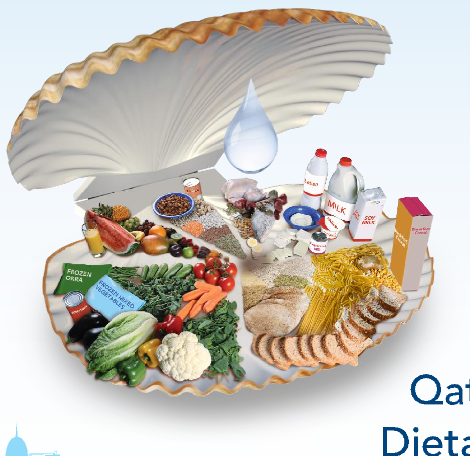

# Qatar Dietary Guidelines

Health Promotion and Non-communicable Diseases Section Public Health Department The Ministry of Public Health Qatar, Doha 2015

# Development of the Qatar Dietary Guidelines

The Ministry of Public Health, Health Promotion and Non-communicable Diseases/Public Health Department developed the Qatar Dietary Guidelines.

Dr. Barbara Seed coordinated the development under the direction of Dr. Al-Anoud Mohammed Ghanim Al-Thani, Ministry of Public Health.

The Ministry of Public Health, Health Promotion and Non-communicable Diseases/Public Health Department thanks the following organizations for their support in the development of the guidelines:

- - Nutrition Department, WHO (Regional Office for the Eastern Mediterranean)
- - Nutrition Department, American University of Beirut
- - Food and Nutrition Policy Department, Tufts University
- - Office of Nutrition Policy and Promotion, Health Canada
- - National Health and Medical Research Council, Australia

Ministry of Public Health Doha, Qatar 2015

# Acknowledgements

###### National Dietary Guidelines Task Force representatives contributed to the development of the Qatar Dietary Guidelines. Members included:

###### Ministry of Public Health, Health Promotion and Non-communicable Diseases:

Dr. Al-Anoud Mohammed Ghanim Al-Thani - Manager Health Promotion and Non-communicable Diseases Dr. Barbara Seed - National Nutrition Policy and Programs Coordinator Dr. Walaa Fattah Mahmood Al-Chetachi - Supervisor Cardiovascular Diseases, Diabetes, Nutrition and Blindness Prevention Unit Ms. Leila Jazairi - Supervisor National Nutrition and Physical Activity Program Mrs. Riham Baddoura - Nutrition Diets Advisor - III

###### Qatar Diabetes Association Mrs. Katie Nahas - Senior Dietitian

Qatar Foundation Mrs. Aisha Al-Romaihi - Deputy Executive Director, Support Services Mrs. Joelle H. Sayouri - Food Services Manager, Support Services

Sidra Medical and Research Centre Mrs. Sara Al Zaidan - Clinical Nutrition & Research Coordinator Ms. Amal Fakha - Subject Matter Expert – Clinical Nutrition Ms. Alyaa Saleh Al Sulaiti - Nutritionist

Qatar University Dr. Abdelmonem Hassan - Associate Professor of Human Nutrition Dr. Abdelhamid Kerkadi - Associate Professor of Human Nutrition Dr. Amanda Brown - Assistant Professor and Director of Human Nutrition Program Mrs. Zeina Jamal - Teaching Assistant of Human Nutrition Hamad Medical Corporation Mrs. Reem Khalid Al-Saadi - Assistant Director of Corporate Dietetics and Nutrition Mr. Anwar Mohammed Qudaisat - Dietetic Technician Supervisor Ms. Noora Mohammed Al-Jaffali - Head Dietitian Aspetar Ms. Shaima Alkhaldi – Sports Dietitian Weill Cornell Medical College Dr. Sohaila Cheema- Director Department of Global and Public Health Qatar National Food Security Program Mrs. Darine Barakat- Senior Researcher Currently National Nutrition Policies & Programs Coordinator at Ministry of Public Health

###### Advisement on focus group testing for the Dietary Guidelines was provided by:

Dr. Hanan Abdul Rahim - Associate Professor, Public Health Program Coordinator- Qatar University Dr. Ahmad Omar Haj Bakri - Supervisor Health Intelligence Unit - Ministry of Public Health

The Ministry of Public Health would also like to thank staff from the Health Promotion and Non-Communicable Diseases Division (Ministry of Public Health ) and the Department of Community Medicine, Residency Training Program (Primary Health Care Cooperation) for their contribution in the development of the guidelines.

- 4

# Foreword

The Qatar Dietary Guidelines are part of the National Nutrition and Physical Activity Action Plan 2011-2016. They lay the foundation for the promotion of healthy eating and the development of healthy food policy.

Adopting behaviors consistent with the Qatar Dietary Guidelines will help to reduce risk factors for chronic non-communicable diseases such as cardiovascular diseases, diabetes and cancer. Behavior is determined through individual factors such as knowledge, preferences and health status. However, behavior is also determined through factors in our environments. These include social factors (e.g. family, culture); the physical environment (e.g. access to health promoting food and activities); economic factors (e.g. marketing foods to children, adequate family finances); and public policy (e.g. baby-friendly breastfeeding initiatives, food labeling) (1,2).

The Qatar Dietary Guidelines will direct both individual behavior change and the development of health and food policies in Qatar. They also provide consistent information for the development of new education and social marketing resources in Qatar.

###### Sheikh Dr. Mohamed Bin Hamad Al Thani

Director of Public Health Ministry of Public Health

# Table of Contents

###### Introduction 08

- 1. Eat a Variety of Healthy Choices from the 6 Food Groups 10 Vegetables 12 Fruit 13 Cereals & Starchy Vegetables 14 Legumes 15 Milk, Dairy Products & Alternatives 16 Fish, Poultry, Meat & Alternatives 18 More about… Fish 19
- 2. Maintain a Healthy Weight 20 If You Need to Lose Weight 21
- 3. Limit Sugar, Salt and Fat 22 Limit Sweetened Food and Beverages 22 Reduce Intake of Table Salt and Salty Foods 23 Avoid Saturated Fat and Hydrogenated or Trans-Fat 24 More about... Nutrition Labeling 25
- 4. Be Physically Active 27 Vitamin D Production from the Sun 28
- 5. Drink Plenty of Water 29
- 6. Adopt Safe and Clean Food Preparation Methods 30
- 7. Eat Healthy while Protecting the Environment 32
- 8. Take Care of Your Family 33 Breastfeeding 33 Build and Model Healthy Patterns for your Family 34

###### Appendices 37

- Appendix 1: Five keys to safer food 37
- Appendix 2: Development of the Qatar Dietary Guidelines 38 References 39

# Introduction

##### Learning about Healthy Eating with the Qatar Dietary Guidelines

Following the Qatar Dietary Guidelines help people to stay healthy and strong, maintain a healthy weight, and reduce their risk of obesity, diabetes, cardiovascular diseases, cancer and osteoporosis. The Qatar Dietary Guidelines outline the types of food to eat as a foundation every day, and the types of foods to limit or avoid. The “plate” design gives guidance on the proportion of different foods to eat. The Qatar Dietary Guidelines focus on the quality of food choices, with some guidance on quantity (i.e. number of fruit and vegetables per day; legumes daily; fish twice a week). Making a diversity of high quality food choices is a cornerstone to healthy eating.

The guidelines emphasize plant-based foods (vegetables, fruit, whole grain cereals, legumes, nuts and seeds), as decades of research have shown the health benefits of eating plant-based foods. Benefits include a reduced risk of cardiovascular diseases, diabetes, and some cancers. Meat, fish and poultry also contribute to a healthy diet, when eaten in smaller amounts. To avoid problems associated with too much refined carbohydrate, it is important

to recognize that whole (less refined) foods are emphasized – for example, choosing whole grains such as whole wheat flour, jareesh, whole wheat pasta or oatmeal, rather than refined cereals such as white bread, white rice and regular pasta.

Focusing on healthy eating and physical activity every day instead of looking to “diets” for health and weight loss is healthier, more enjoyable, and is likely to last longer.

Specific details on each food group and each section including benefits and consumer “tips” can be found within this booklet. For more information, see also sections called “More About...” on food labels, fish, and calcium rich alternatives to milk and dairy products.

These guidelines are designed for the healthy population. People requiring special diets may need to meet with a Dietitian or other health professional for more guidance.

More information on the Qatar Dietary Guidelines can be found at: www.moph.gov.qa

###### Qatar Dietary Guideline Recommendations

|1|Eat Healthy Choices from the 6 Food Groups|
|---|---|
|2|Maintain a Healthy Weight|
|3|Limit Sugar, Salt and Fat|
|4|Be Physically Active|
|5|Drink Plenty of Water|
|6|Adopt Safe and Clean Food Preparation Methods|
|7|Eat Healthy while Protecting the Environment|
|8|Take Care of your Family:  a. Breastfeed your baby exclusively for the first six months of their life, and continue until your child is two years old. b. Build and model healthy patterns for your family. |

##### What You can Learn from the Qatar Dietary Guidelines Booklet

Using this Qatar Dietary Guidelines booklet, you should be able to:

|1 List the benefits of healthy eating.|
|---|
|2 List the benefits of being physically active.|
|3 Identify the six food groups according to the Qatar Dietary Guidelines.|
|4  List a variety of examples of foods from each of the six food groups in the Qatar Dietary Guidelines.|
|5 Understand the benefits of reading food labels.|
|6  Identify the negative effects of the regular consumption of foods high in sugar, salt and harmful fats.|
|7 List less healthy food choices, and healthy substitutes for them.|
|8  Reflect on your own eating habits and identify changes you can make that can contribute to your health.|
|9  Identify types of physical activity you might do, and how much activity you should do each week.|
|10 List ways to decrease sitting time.|

# 1. Eat a Variety of Healthy Choicesfrom the 6 Food Groups

Vegetables

- • Aim for 3-5 servings of a variety of vegetables every day.
- • Eat vegetables with most meals, including snacks.
- • Choose vegetables prepared with little or no added fat or salt.
- • Aim for 2-4 servings of a variety of fruit every day.
- • Favor whole fruit over juices.
- • Choose often as snacks.
- • Substitute refined grains (e.g. white bread) with whole grain breads and cereals.
- • Choose grains prepared with little or no added fat, sugar or salt.
- • Read labels to choose foods with high fiber and nutrient content and to avoid hydrogenated or trans-fat.

Green leafy vegetables 1 serving = 1 cup

Cooked vegetables 1 serving = ½ cup

###### Fresh, frozen and canned vegetables 1 serving = ½ cup

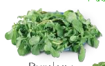

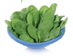

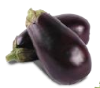

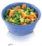

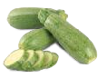

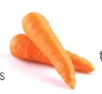

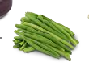

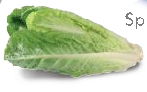

Purslane

Spinach

Canned tomatoes

Frozen mixed vegetables

Eggplant

Zucchini

Green Beans Carrot

Lettuce

Fruit

Cut fresh fruits 1 serving = ½ cup

Whole fresh fruits 1 serving = 1 medium fruit

Dried fruits 1 serving = ¼ cup

100% Fruit juice 1 serving = ½ cup

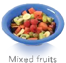

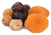

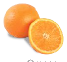

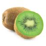

Dried fruit: dates, figs & Banana Orange apricots

Mixed fruits Kiwi

Orange Juice

Pineapple

Cereals & Starchy Vegetables

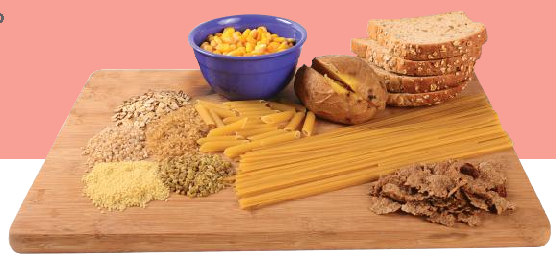

#### Legumes

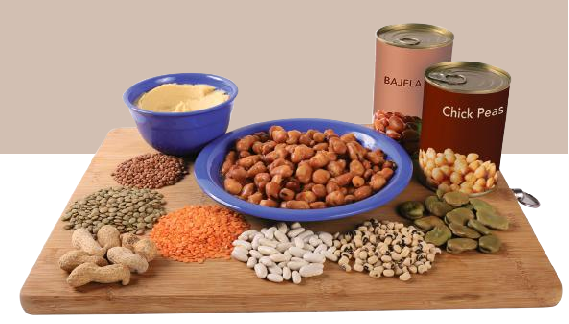

- • Eat legumes daily.
- • Choose legumes prepared with little or no added fat or salt.
- • Maintain a daily consumption of skimmed or low fat milk and dairy products.
- • Choose vitamin D fortified milk.
- • Choose unflavored milk, laban and yogurt more often.
- • If you do not drink milk or eat dairy products, choose other calcium and vitamin D rich foods (e.g. fortified soy drinks, almonds, chickpeas).
- • Eat a variety of fish at least twice a week.
- • Choose skinless poultry and lean cuts of meat.
- • Avoid processed meats (e.g. sausages, luncheon meats).
- • Choose legumes, nuts and seeds as alternative protein sources.
- • Choose unsalted nuts and seeds as part of a healthy snack.

#### Milk, Dairy Products & Alternatives

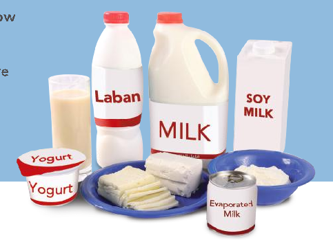

#### Fish, Poultry, Meat & Alternatives

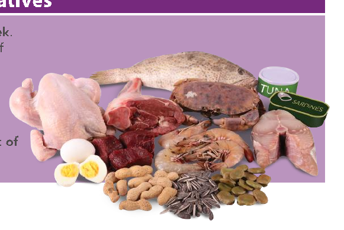

## Vegetables

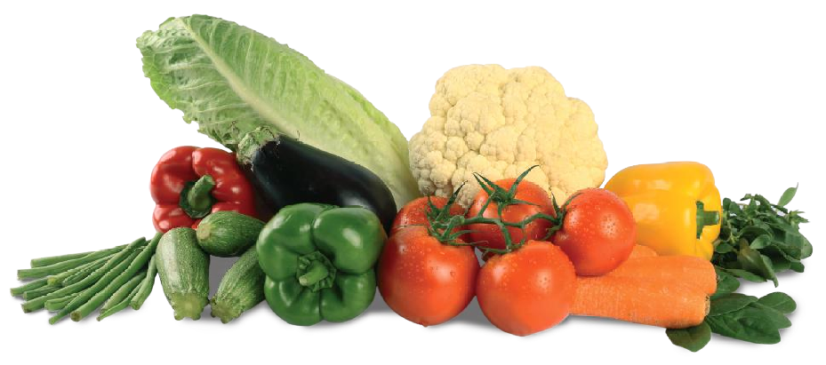

###### Key Recommendations

- • Aim for 3-5 servings of a variety of vegetables every day.
- • Eat vegetables with most meals, including snacks.
- • Choose vegetables prepared with little or no added fat or salt.

###### Benefits

Vegetables are rich in many nutrients, such as vitamins A and C, folate (a B vitamin), potassium, iron and fiber. Eating vegetables regularly is linked to a lower risk of heart disease, stroke, several types of cancer, and weight gain (3). Eating a lot of vegetables can help you feel full and replace other foods higher in calories. Starchy vegetables such as potatoes and corn are listed with the “cereals” food group, as they contain similar nutrients.

###### Examples of One Serving

- • ½ cup cooked green or colored vegetables (cabbage, broccoli, eggplant)
- • 1 cup raw green leafy vegetables
- • 1 large carrot
- • 1 medium tomato

###### Tips

- • Choose a wide variety and color of vegetables.
- • Favor fresh vegetables in season.
- • Cook side vegetables such as broccoli, carrots and zucchini by lightly steaming or stir-frying to preserve nutrients.
- • Eat more greens and leafy vegetables (e.g. fattouch, tabbouleh, green thyme, cabbage or spinach salad). In restaurants, order salad dressing separately and limit how much you add.
- • Eat raw vegetables as snacks with low fat dip.
- • Enjoy grilled vegetables (e.g. tomatoes, onions, mushrooms, green peppers).
- • Eat more vegetable based dishes such as saloona.
- • When eating out, choose plain vegetables instead of those breaded or deep fried.
- • Avoid adding butter or margarine and rich sauces to vegetables. Use fresh or dried herbs, spices or lemon juice instead.
- • Rinse canned vegetables to lower the salt content.
- • Offer a plate of fresh, cut vegetables before dinner. Children will eat them up when they are hungry!

## Fruit

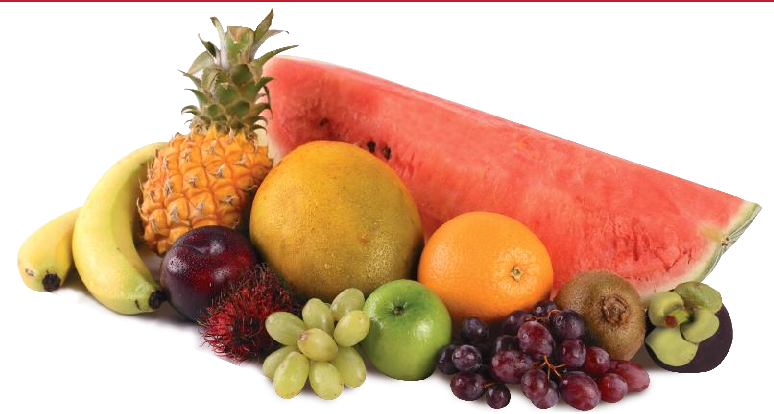

- Key Recommendations
- • Aim for 2-4 servings of a variety of fruit every day.
- • Favor whole fruit over juices.
- • Choose often as snacks.

###### Benefits

Fruit is rich in vitamins A and C, folate (a B vitamin), potassium, and fiber. Eating fruit regularly is linked to a lower risk of heart disease, stroke, obesity and weight gain, and some types of cancers (3).

###### Examples of One Serving

- • 1 medium fruit (e.g. banana, apple)
- • ½ cup sliced fruit (e.g. watermelon)
- • ½ cup 100% juice
- • ¼ cup dried fruit
- • 12-15 grapes

###### Tips

- • Choose a wide variety and color of fruit.
- • Favor fresh fruit in season.
- • Keep a bowl of fruit handy.
- • Cut-up or dried fruit makes a good snack and is easy to pack.
- • Fruit salad makes a healthy dessert.
- • Eat dried fruit in moderation, and choose them without sugar added.
- • Favor fresh or unsweetened frozen fruit instead of canned fruit packed in syrup.
- • Make shakes or smoothies by blending low or no fat laban, yogurt, milk or a fortified milk alternative such as soy beverage with a combination of fresh or frozen fruit.
- • Fresh fruit pieces on a stick make a great snack for children and adults.
- • Enjoy fresh juice with no added sugar, but limit to ½ cup per day.

## Cereals & Starchy Vegetables

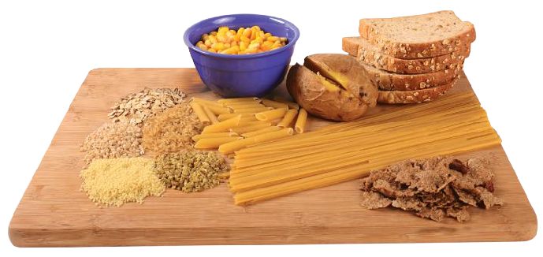

###### Key Recommendations

- • Substitute refined products (e.g. white bread) with whole grain breads and cereals.
- • Choose grains prepared with little or no added fat, sugar or salt.
- • Read labels to choose foods with high fiber and nutrient content and to avoid hydrogenated or transfat.

###### Benefits

Whole grain cereals are rich in many nutrients, including fiber. Eating whole grains regularly is linked to lower risk of cardiovascular diseases, type 2 diabetes, obesity and colon cancer. Whole grains include whole wheat flour, brown rice, jareesh, whole oats or oatmeal, whole wheat pasta and harees. Whole grains are a great source of essential nutrients, including B vitamins (niacin, folate, riboflavin, and thiamin), fiber, and minerals (selenium, magnesium, and iron). Cereals made from refined grains do not have these benefits (e.g. white rice, regular pasta, white bread) (3).

Endosperm

Bran

Germ

Whole grains include 3 edible layers: bran; germ and endosperm. Much of the benefit of whole grain is found in the germ and the bran. Refined grains are made up mostly from the endosperm.

###### Choose Wisely

When purchasing bread, pasta or cereals, read the label to make sure whole grain or whole wheat is first on the list of ingredients to make sure you are getting the benefits from all parts of the grain. For example, the beginning of the list could say whole grain wheat or whole grain oats. Be aware that not all brown breads are made from whole grain – some are only colored brown. Also, read labels to avoid crackers, biscuits and baked products made with hydrogenated or trans-fat. For more information, see: More About… Nutrition Labeling, p.25.

###### Tips

- • Make most of your choices whole grain. Choose brown rice, whole wheat pasta and whole grain bread.
- • Whole grains will keep you full longer than foods made from refined grains.
- • Make sandwiches on whole grain breads.
- • Keep moderate portion sizes – especially for refined foods like pasta and white rice.
- • When eating out, order pasta with a tomato rather than a cream based sauce.
- • Start your day with a bowl of oatmeal, whole grain cereal, or whole wheat toast instead of grabbing a fatayer, croissant or muffin later in the morning.
- • Keep biscuits, cakes, pastries and pies for special occasions.
- • Avoid french fries. Have a baked or boiled potato, sweet potato, or salad instead.
- • Limit fried breads (e.g. paratha, puri) and breads made with fat and oil (e.g. croissant, fatayer).
- • Eating plenty of whole grains daily is associated with reduced risk of weight gain.

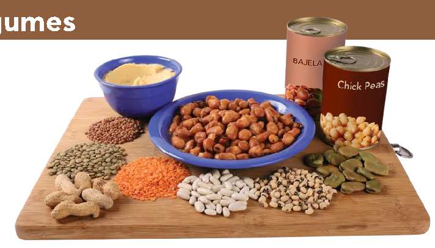

## Legumes

###### Key Recommendations

- • Eat legumes daily.
- • Choose legumes prepared with little or no added fat or salt.

###### Benefits

Similar to fish, poultry and meat, legumes are rich in protein, iron and zinc, which make them a good substitute for these animal foods. They also contain soluble fiber, which helps to stabilize blood sugar and lower cholesterol, lowering the risk of cardiovascular diseases (4). Eating legumes is also related to decreased colon cancer (3).

Legumes are included as a separate food group due to their health benefits, and because they are a staple of a traditional Middle Eastern diet. Legumes are also an important foundation of a vegetarian diet (see: If You Choose to be Vegetarian, p.18).

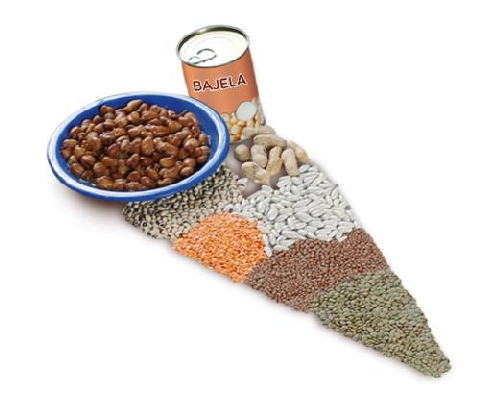

###### Tips

- • Enjoy traditional Arabic foods such as foul mudammes, hummus, bajela and nakhi.
- • Add beans, lentils or chickpeas to soups, stews and casseroles.
- • Top a salad with beans, unsalted nuts or seeds.
- • For lunch at work or school, try cooked beans, dahl or hummus.
- • Try vegetarian dishes from other cultures such as bean burritos.
- • Rinse canned beans with water before using to decrease salt.
- • Include foods rich in vitamin C (tomato, peppers, lemon) with meals to enhance absorption of iron and zinc from legumes.
- • Allow 30 minutes after meals before drinking tea to allow for absorption of iron from foods.
- • Cooking dry legumes instead of using canned varieties is cheaper and decreases packaging waste, salt, and exposure to chemicals from cans.

## Milk, Dairy Products & Alternatives

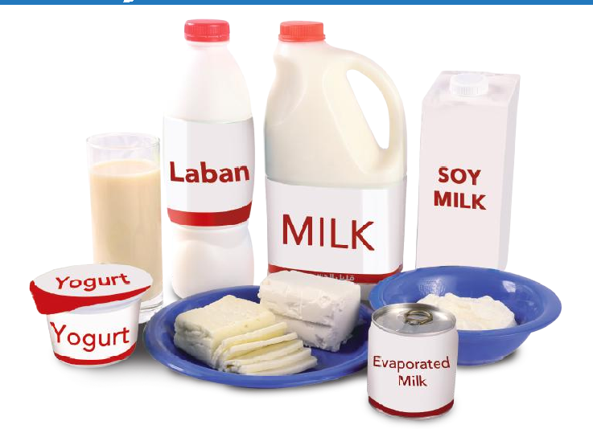

- Tips
- • Include a glass of low fat milk, laban or yogurt with your meals.
- • Pack milk, laban or yogurt with an ice-pack in your child’s lunch box.
- • Drink lactose-free milk or fortified soy beverages if you have lactose intolerance.
- • Use low fat milk or dairy products in cooking.
- • Favor plain dairy products like milk, laban and yogurt over sweetened and flavored ones. Add your own fruit when desired.
- • When drinking karak or other hot drinks (e.g. lattés and cappuccinos) choose low fat options and add only a small amount of sugar.
- • Prepare your milk based desserts (e.g. Umm Ali, muhallabiya) with low fat milk.
- • Choose low fat types of halloumi, mozzarella and feta or other cheese for cooking.
- • Limit processed cheese (e.g. spreadable).
- • Make shakes or smoothies by blending low or no fat laban, yogurt, milk or a fortified milk alternative such as soy beverage with a combination of fresh or frozen fruit.

###### Key Recommendations

- • Maintain a daily consumption of skimmed or low fat milk and dairy products.
- • Choose vitamin D fortified milk.
- • Choose unflavored milk, laban and yogurt more often.
- • If you do not drink milk or eat dairy products, choose other calcium and vitamin D rich foods (e.g. fortified soy drinks, almonds, chickpeas).

###### Benefits

Milk and dairy products are high in calcium, and milk is often fortified with vitamin D. Consuming mostly low fat dairy foods is related to a reduced risk of heart diseases, stroke, hypertension, colorectal cancer, type II diabetes, metabolic syndrome and to strengthening bones (5). Butter, cream and ice cream are not included in the list of dairy products that have these positive benefits.

###### What is equivalent to the calcium in 1 cup milk (300 mg calcium)?

- • 1 cup yogurt (low fat or skimmed)
- • 14 tablespoons labneh
- • 50 grams cheese

Most people meet their calcium requirements by consuming two equivalents per day. Pre-teens and teens need 3-4 equivalents, while adults over 50 need 3 equivalents. If you do not consume milk and dairy products, see: “More about… Calcium Rich Alternatives to Dairy Products”, p.17.

###### More About… Calcium Rich Alternatives to Milk and Dairy Products

Some people may not drink milk or consume dairy products if they are vegan or lactose intolerant. Calcium rich non dairy foods or calcium fortified products can be taken instead. Consult a Dietitian or other health professional about whether supplements are needed.

Examples of Non Dairy Foods High in Calcium

|Calcium Rich Alternatives to Dairy Products  Milk for comparison|Amount  1 cup|Calcium  ~300 mg|
|---|---|---|
|Tofu (only those processed with calcium sulfate- check label)|1 cup|600 mg|
|Calcium fortified orange juice|1 cup|310 mg|
|Sardines|½ cup|300 mg1|
|Salmon, canned (with bones)|½ cup|220 mg|
|Soy or rice milk (fortified)|1 cup|200-300 mg|
|Jew’s mallow|½ cup|198 mg|
|Swiss chard, cooked|1 cup|190 mg|
|Dried figs|¼ cup|162 mg|
|Tahini|2 tbsp|128 mg|
|Dried apricot|¼ cup|119 mg|
|Almonds|¼ cup|94 mg|
|Stuffed Grape leaves|¾ cup (5 pieces)|67 mg|
|Broccoli, cooked|1 cup|66 mg|
|Okra, cooked|½ cup|66-96 mg|
|Dates|100 g (4 dates)|64 mg|
|Hummus|½ cup|64 mg|
|Chickpeas, canned|½ cup|41 mg|
|Pumpkin Seeds, roasted|¼ cup|30 mg|

Values taken from: (6-9) Values are approximate, depending on product or recipe.

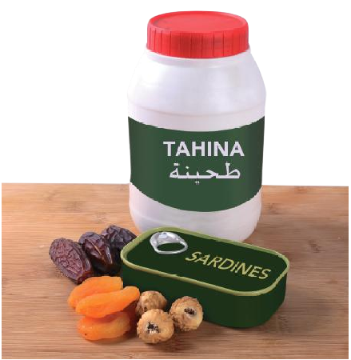

- 1 High in salt if canned

###### Choose Wisely

Oxalic acid is found in vegetables such as spinach and beet greens. Oxalic acid binds with the calcium in those foods and reduces its absorption. These foods are not considered good sources of calcium.

Rice milk does not have the protein content of soy, cow or goat milk. Rice milk should never be used as a substitute in infant feeding.

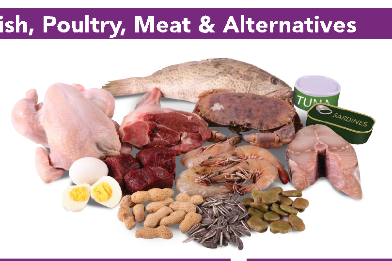

## Fish, Poultry, Meat & Alternatives

###### Tips

###### Key Recommendations

- • Eat a variety of fish at least twice each week.
- • Choose skinless poultry and lean cuts of meat.
- • Avoid processed meats (e.g. sausages, luncheon meats).
- • Choose legumes, nuts and seeds as alternative protein sources.
- • Choose unsalted nuts and seeds as part of a healthy snack

- • Remove skin from poultry before cooking or buy skinless pieces.
- • Choose less fatty cuts of meat such as leg of lamb (after removing visible fat), lean ground beef and beef tenderloin.
- • Tenderize lean cuts of meat by using a marinade or a slow cooking method such as stewing or braising.
- • Trim off visible fat from meats. Discard fat drippings from cooked meat.
- • Broil, grill, roast, poach or boil meat, fish and poultry instead of frying.
- • If frying meat, use little oil.
- • Enjoy fish twice a week. See “More about… Fish” for more details p.19.
- • Eat at least one “meatless” main meal per week.
- • Make sandwiches with lower fat, unprocessed meats such as roast beef, turkey or chicken.
- • Prepare foods without coating (e.g. breaded); avoid rich sauces and gravies.
- • See tips under “Legumes” p.15 to include more alternatives.
- • Enjoy moderate portions of unsalted nuts and seeds (e.g. ¼ cup).
- • Include foods rich in vitamin C (tomato, capsicum, lemon, oranges) with meals to enhance absorption of iron and zinc from legumes.
- • Limit pre-prepared breaded foods such as chicken nuggets and fish fingers.
- • Allow 30 minutes after meals before drinking tea to allow for absorption of iron from foods.

###### Benefits

This food group is high in protein, iron, zinc and vitamin B12. Eating nuts and seeds may protect from cardiovascular diseases by reducing cholesterol and inflammation (5). Eating fish also protects from cardiovascular diseases (see “More about… Fish”, p.19).

###### Choose Wisely

Women who are iron deficient may benefit from eating red meat. However, some research suggests limiting portions of red meat to no more than 500 grams (0.5 kilogram) per week. More than 100 grams/day has been related to colorectal cancer (3, 10). Also, avoid processed luncheon and deli meats such as corned beef, hot dogs, pepperoni, salami and smoked meat. They can be high in salt and cancer causing nitrates (4).

###### If You Choose to be Vegetarian

One cannot be a healthy vegetarian by going to a fast food restaurant and ordering french fries and soda! Vegetarians can meet their nutrient needs by choosing a variety of meat alternatives such as beans, lentils, eggs, tofu, soy-based meat substitutes, nuts, nut butters and seeds (11). For more tips, see Legumes, p. 15.

#### More about… Fish

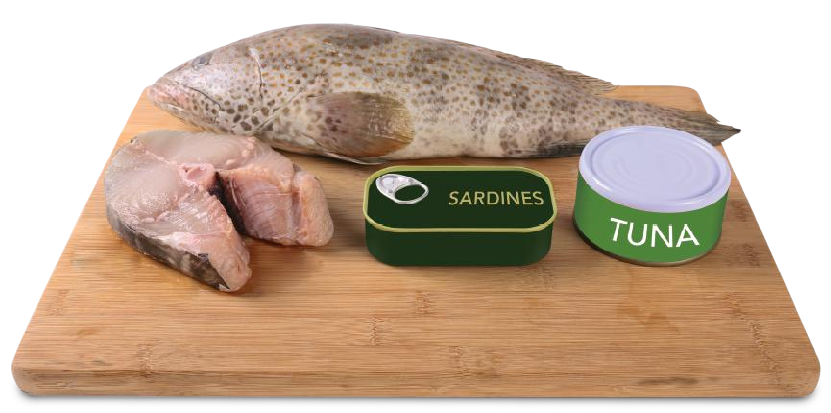

###### Benefits

Fish and seafood are high in protein and some types are high in the healthy fat – omega 3 fatty acids. Regularly eating fish protects us from cardiovascular diseases and stroke, reduces the risk of dementia and may also reduce the risk of agerelated macular degeneration (5).

###### Choose Wisely

are the healthiest and most environmentally friendly.

Plant sources of omega-3 fatty acids include walnuts, pumpkin seeds, and other seeds such as flaxseed, as well as canola oil. However, current research suggests that these are not as well utilized by the body as fish sources (12).

###### Tips

- • Bake or grill fish instead of frying.
- • Buy fresh or frozen fish that has not been breaded, battered or deep-fried.
- • When dining out, choose fish seasoned with herbs and lemon rather than a rich sauce.
- • Wrap a fish fillet along with vegetables and herbs in parchment paper and bake in the oven.
- • Enjoy seafood, but avoid deep fried choices.
- • Choose canned fish packed in water, not in oil.
- • To minimize mercury exposure, choose light tuna or salmon instead of white (albacore) tuna.

Oily fish has the most omega 3 fatty acids. This includes fish such as: salmon, oysters, and some varieties of canned tuna. Sardines (aoam) can be caught locally, and are very high in omega 3 fatty acids. Zobaidy (malabar cavalla) and gubgub (sea crab) are also local, and have some omega 3 fatty acids. While fish is very healthy, some larger wild fish (grouper, king mackerel, tuna) may contain contaminants such as mercury. Limited data exists about the mercury content of fish in the Arabian Gulf. Some farmed fish can contain harmful chemicals and dioxins. Choosing a variety of fish can help to minimize the risk of exposure to chemicals. Research suggests the health benefits of fish outweigh the risks (12). Online seafood guides provide information about which fish and seafood

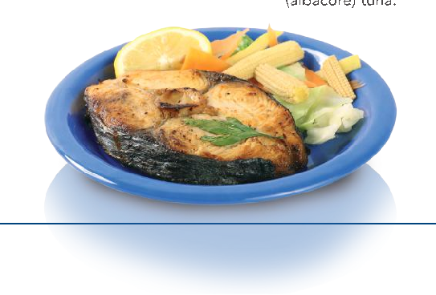

# 2. Maintain a Healthy Weight

###### Key Recommendations

###### • Following the Qatar Dietary Guidelines helps you to stay strong and healthy, maintain a healthy weight, and reduce your risk of obesity, diabetes, cardiovascular diseases, cancer and osteoporosis.

###### Benefits and Concerns

Maintaining your weight helps you to lower your risk of disease, be more able to enjoy physical activities with your family and can help you keep your mobility as you age.

Overweight and obesity are related to increased risk of type

- 2 diabetes, cardiovascular diseases, hypertension, some cancers, joint problems, respiratory conditions, sleep apnea, gall bladder disease, hernia, reproductive disorders, mental health disorders and other health issues (5).

However, too much focus on weight and dieting can contribute to disordered eating and eating disorders. Instead, focus on healthy eating and being active.

Being underweight can also affect health negatively. It is related to decreased immunity and muscle strength and osteoporosis. It can be especially harmful for older people.

###### How is Weight Assessed?

BMI (body mass index), is a measure of weight relative to height. It is a tool for adults, and should not be used for children or adolescents. It is also not applicable for athletes or those with a lot of muscle.

weight (kg) height (m)2

BMI=

|BMI|Weight Status|
|---|---|
|< 18.5|Underweight|
|18.5-24.9|Normal|
|25-29.9|Overweight|
|>30|Obese|

Waist circumference is another helpful tool to assess health risk. Abdominal (or central) obesity is strongly associated with cardiovascular diseases. Men should have a waist size of no more than 102 cm. A women’s waist should be no more than 88 cm. Optimal recommendations are smaller – no more than 94 cm for men and no more than 80 cm for women.

###### Tips

- • Keep your “everyday” foods healthy. Save high sugar and fat foods for occasions, not as a foundation for your everyday diet.
- • Be active every day and stay active as you get older (see “Be Physically Active, p.27).
- • Limit sugar sweetened drinks such as carbonated, fruit and energy drinks.
- • Limit sitting time outside of work and school hours (e.g. computer, television, etc.).
- • Avoid extreme diets that promise fast weight loss in a short period of time. They can be harmful to health and do not build healthy habits that can be maintained in the long term. They may even increase the risk of overweight and obesity later on.
- • Seek the help of a Dietitian.
- • Work with your workplace and schools to increase healthy eating choices and opportunities for physical activity.
- • Children in families that eat healthy and are active have less chance of being overweight.
- • Being breastfed is related to a reduced risk of becoming obese in childhood.

## If You Need to Lose Weight

Adopting healthy eating and activity patterns that can be maintained over time is a more effective way to lose weight than dieting. Being consistent is more important than random efforts. Dieting can also lead to obsessing about weight and food – and even to eating disorders.

To begin, consider your support network. Ask your friends and family for support. Tell them it will help if they join you in physical activity and in eating healthy foods. Also consider your environment. Talk to your workplace or school about making healthy food choices available, and about opportunities for physical activity breaks.

Physical activity contributes to weight loss even beyond the immediate effects. Building muscles increases metabolism and helps to burn calories. Exercise can also help you to feel positive about yourself, and motivate you to stick with your health plans. Getting enough sleep is essential. Recent research suggests that a lack of sleep is related to overweight and obesity. Getting enough sleep may also help you to have enough energy to exercise.

Do not obsess about weight. Stay positive, and focus on eating well and being active. If you have children that are overweight, this is even more important. Support an overweight child by taking the opportunity to adopt healthy eating and activity patterns for the whole family. Allow children to decide what and how much to eat from a range of healthy food choices. Limit unhealthy food choices for the whole family. For example, do not include soft drinks as a regular part of meals; keep them only for special occasions.

###### Tips

- • See a Dietitian.
- • Eat breakfast daily.
- • Keep moderate portion sizes.
- • Take time to eat slowly.
- • Prepare your foods with less oil and fat.
- • Eat more high fiber foods.
- • Avoid the intake of calorie dense snacks and beverages.
- • Weight loss using healthy eating and regular physical activity can be maintained over time.
- • In periods of fasting, continue your healthy eating habits.
- • Be physically active. Accumulate a minimum of 150 minutes per week of moderateintensity physical activity (e.g. 30 minutes per day, 5 days per week). Perform physical activity in bouts of at least 10 minutes duration as an effective alternative to continuous physical activity. Begin slowly, and gradually build activity time, frequency and intensity. Check with your doctor before beginning if you have any medical conditions.
- • For more significant weight loss, perform more than 250 minutes per week (e.g. 50 minutes or more per day, 5 days per week).
- • Spend less time sitting (e.g. television and computer time).
- • Follow the recommendations of the Qatar Dietary Guidelines.

# 3. Limit Sugar, Salt and Fat

###### Key Recommendations

- • Limit sweetened foods. Avoid sweetened beverages such as carbonated, energy and fruit drinks.
- • Reduce intake of salty foods.
- • Eat less fast foods and processed foods.
- • Avoid saturated fat and hydrogenated or transfat (e.g. ghee, partially hydrogenated vegetable oil) and foods made with these fats (french fries, commercially baked sweets).
- • Use healthy vegetable oils such as olive, corn and sunflower in moderation.
- • Read nutrition labels to choose foods low in sugar, salt and fat and high in nutrients.
- • Eat home-made food more often.
- • Explore healthy ways to prepare traditional foods.

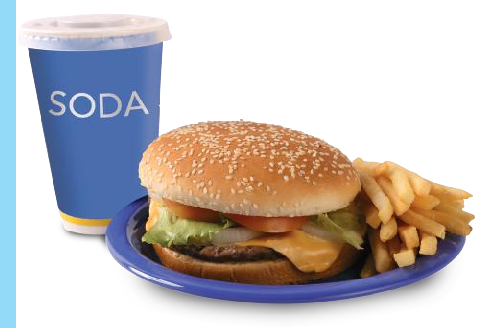

### Limit Sweetened Food and Beverages

Foods low in sugar have 5g or less of total sugars per 100g. A medium level of sugars is between these two amounts (13).

###### Choose Wisely

Limit added or “free” sugar in your diet (i.e. sugar added to food, rather than naturally occurring sugar such as that in fruit). Sugar sweetened drinks such as soda, energy drinks, fruit drinks, vitamin waters and sports drinks are the largest sources of added sugar for many people. Drinking a lot of these can cause weight gain, and is also related to increased dental cavities and reduced bone strength (3).

When you eat high sugar foods instead of more nutritious foods, it also decreases the amount of nutrients you consume (3,4).

###### What to Look for on Food Labels

When choosing packaged foods such as breakfast cereal and jam, check the list of ingredients to make sure sugar is near the end of the list, rather than first on the list (foods are listed in order of what ingredient is highest in weight to the lowest in weight). Sugar can also be listed as: sugar, fructose, glucose, sucrose or high fructose corn syrup.

Also check the “nutrition facts” box for sugar content. Foods high in sugar have over 22.5g of total sugars per 100g.

For more information, see: More About… Nutrition Labeling, p.25.

###### Tips

- • Eat regular meals so you are not tempted to make impulsive decisions to eat high sugar foods because you are hungry.
- • For a sweet treat, choose foods high in naturally occurring sugars such as dates and fresh fruit.
- • Cook puddings such as sagho with less sugar.
- • Save your sweet tooth for your favorite special foods you can savor and enjoy.
- • When eating out, order sparkling water with a twist of lemon, laban, milk, fresh juice or water instead of soda.
- • Be aware of the amount of sugar in hot and cold coffee beverages served in cafes.
- • Avoid sweetened drinks such as soda, energy drinks, fruit drinks, vitamin waters and sports drinks.

### Reduce Intake of Table Salt and Salty Foods

###### Choose Wisely

Decreasing intake of salt and salty foods can decrease blood pressure for adults with normal and high blood pressure and for children too (3). Having high blood pressure puts you at more risk for stroke and cardiovascular diseases (14). People with hypertension, diabetes and chronic kidney disease are more sensitive to salt, and sensitivity also increases with age. Eating a lot of salt and salt preserved foods is also related to stomach cancer (3).

Consume less than 2000 mg of sodium per day equivalent to 1 teaspoon salt or 5 grams salt (15)

Low potassium levels also increase the risk of hypertension. Most people do not consume enough potassium. Potassiumrich foods include legumes, nuts, vegetables and fruit. Processing reduces the amount of potassium in many food products (16).

What to Look for on Food Labels

Check food labels for the words salt or sodium.

- • Foods high in salt have more than 1.5g of salt (0.6g sodium) per 100g.
- • Foods low in salt have 0.3g of salt (or 0.1g sodium) or less per 100g (14).

For more information, see: More About… Nutrition Labeling, p.25

###### Tips

- • Eat fresh and home-made foods more often, minimizing fast food and highly processed foods.
- • Do not keep the salt shaker on the table, and taste your food before reaching for the salt shaker.
- • Use lemon, spices, pepper, herbs, garlic and onions to flavor food.
- • Soak high salt white cheese (e.g. halloumi, akkawi) in water before eating to remove excess salt.
- • Limit consumption of makdoos and pickled vegetables.
- • Buy low salt versions of sauces such as soya sauce and ketchup.
- • Limit pastries made with zaatar and salty cheese.
- • If using canned vegetables, rinse them with water to decrease the salt.
- • Avoid luncheon meats such as sausage and salami.
- • Eat unsalted nuts and seeds.
- • Experiment with traditional recipes to lower salt content.
- • Avoid salted laban (e.g. laban ayran).
- • Limit processed cheese (e.g. spreadable).
- • Avoid potato chips, pretzels and salty crackers.

### Avoid Saturated Fat and Hydrogenated or Trans-Fat

###### Choose Wisely

While certain types of vegetable oils are essential for health, eating too much of the wrong type of fat can be harmful. Eating a lot of foods high in saturated (fat that is solid at room temperature) and hydrogenated (trans) fat can harm blood cholesterol levels. Replacing saturated and trans-fat with monounsaturated and polyunsaturated improves cholesterol levels related to cardiovascular diseases (3).

Low fat diets are not recommended for children under 2 years of age! (17)

What to Look for on Food Labels Saturated fat

- • Foods high in saturated fat contain more than 5g of saturated fat per 100g.
- • Foods low in saturated fat contain1.5g of saturated fat or less per 100g

###### Hydrogenated or Trans-Fat

Try to avoid any hydrogenated or trans-fat. Look on the ingredient list to avoid the words “hydrogenated” or “partially hydrogenated” vegetable oil. They both raise “bad” (LDL) cholesterol levels and decrease “good” (HDL) cholesterol levels (13).

For more information, see: More About… Nutrition Labeling, p.25.

###### Tips

- • Replace foods high in saturated and trans-fat such as butter, cream, hard margarines, palm oil or ghee with foods which contain mostly monounsaturated and polyunsaturated fat such as vegetable oils (e.g. olive, corn, sunflower).
- • Choose low fat yogurt, laban and milk instead of full cream varieties.
- • Steam, bake, broil, grill or sauté foods instead of frying or deep frying.
- • Remove the skin from chicken before cooking and before eating.
- • If you buy margarine, read the nutrition label to compare how much saturated and transfat it contains. Choose a soft margarine that has 2 grams or less of saturated and trans-fat combined per serving.
- • Limit consumption of sausages (e.g. nakanik), processed meats (e.g. sujuk) and luncheon meats.
- • Choose protein alternatives such as legumes, nuts and seeds.
- • Choose nuts that are unsalted, and not fried.
- • Commercially processed baked foods such as pastries, crackers, biscuits and cakes often contain high amounts of trans and saturated fat. Eat home-made baked goods instead.
- • French fries can also be high in trans-fat. At home, try tossing wedges of potato or sweet potato in olive oil and bake.
- • Keep your “everyday” foods healthy. Save high fat foods for occasions, not as a foundation for your everyday diet.
- • Consume foods with healthy fat such as walnuts, pumpkin seeds, flaxseed, and canola oil with moderation.
- • Be aware of fat and salt content in commercial salad dressing (e.g. mayonnaise). Limit dressings or try to make your own.
- • Limit fast food such as burgers, french fries, shawarma and deep fried falafel.

### More about... Nutrition Labeling

Many pre-packaged foods have nutrition labels. As Qatar imports foods from many countries, these labels can be different, depending on which country the food comes from. Usually there are 3 ways to find out more information about the food you are eating from the label:

- 1. Nutrition claims
- 2. Nutrition facts or nutrition values table
- 3. Ingredient list

For best understanding, use a combination of the three labels. Sometimes, using only one of them can be misleading. For example, when looking at cereals, a product may show it is low in sugar and fat in the nutrition table, but it could also have little nutrition if refined (white) flour is first on the ingredient list.

Best food choices are both low in sugar, salt and saturated and hydrogenated (trans) fat, but are also nutrient dense (e.g. high in whole grains and other whole foods, as well as vitamins, minerals and fiber).

###### 1. Nutrition Claims

Nutrition and health claims are similar between countries, as many follow the International Codex Alimentarius guidelines (an international standard-setting body that sets out

categories of nutrition and health claims and conditions for their use) (18). Examples of nutrient claims include: “source of calcium; high in fiber; trans-fat free”.

“A healthful diet rich in fiber may reduce the risk of colon cancer. X cereal is high in fiber”;

“A healthful diet low in trans-fat may reduce the risk of heart disease. X brand crackers are low in trans-fat”

While crackers are not generally recommended if they are made with trans-fat, the second example above shows how a claim can be made to show that a certain brand of crackers is low in trans-fat.

Also, the use of nutrition claims which are not regulated can be confusing. For example, a food that is labeled as “all natural” may or may not be healthier than a similar food. Another example occurs when foods that never have cholesterol (e.g. plant foods like bananas or vegetable oil) are labeled “cholesterol free” (only foods from animal origin contain cholesterol).

###### 2. Nutrition Facts orNutrition Values Table

Figure A is an example of a table used in Canada and the US. Figure B is an example from the UK. Check the % RI (Reference Intake) or the % DV (Daily Value) on the tables to compare different foods to see which are better choices for you. These values compare the nutrients in foods to the amount you need every day for good health. A good rule to follow is that 15% of a RI or DV is a lot, and

- 5% is a little of your daily needs. Most people need to choose foods higher in fiber, calcium and iron and less in sugars, saturated fat and sodium (or salt). Aim for less than 3 grams of total fat per 100 grams, less than 1.5 grams of saturated fat per 100 grams, less than 0.2 grams of trans fat per 100 grams, less than 5 grams of sugar per 100 grams, and less than 120 milligrams of sodium per 100 grams (13,19).

###### Figure A US & Canada Nutrition Facts

|Nutrition Facts  Per 125 mL (87 g)  Amount Calories 80 Fat 0.5 g Saturates 0g  + Trans 0g Cholesterol 0mg Sodium 0mg Carbohydrate 18g  Vitamin A 2% Calcium 0%  Vitamin C Iron  Fibre 2g Sugars 2g  Protein 3g  % Daily Value  1% 0%  0% 6% 8%  10% 2%|
|---|

###### Figure B UK Nutrition Facts

###### Nutrition

Typical values

100g contains

Each slice (typically 44g) contains

% RI*

Energy Fat of which saturates Carbohydrate of which sugars Fibre Protein Salt

985KJ 235Kcal

- 1.5g

- 0.3g 45.5g 3.8g

2.8g 7.7g

- 1.0g

435KJ 105Kcal

- 0.7g

- 0.1g 20.0g
- 1.7g

- 1.2g 3.4g 0.4g

5% 1%

- 1%
- 2%

7%

This pack contains 16 servings

* Reference intake of average adult (8400KJ / 2000Kcal)

RI* for an average adult

8400KJ 2000Kcal 70g 20g

90g

6g

###### 3. Ingredients List

Foods are listed in order of the ingredient highest in weight to the ingredient lowest in weight. When choosing packaged foods, check the list of ingredients to make sure that whole foods like fruit, vegetables and whole grains are near the start of the list, rather than ingredients like sugar (or glucose or fructose) or white, refined or wheat flour (vs. whole wheat or whole grain flour). For example, the breakfast cereal in the first example below is a healthier choice than the second one, even though it may be higher in calories and fat.

- Example 1

|Ingredients|Whole grain rolled oats, almond flakes, raisins, sugar, salt.|
|---|---|

- Example 2

|Ingredients|Wheat flour, sugar, salt, color.|
|---|---|

# 4. Be Physically Active

###### Key Recommendations

- • Adults should do moderate intensity physical activity at least 5 days per week (for at least 30 minutes) and/or vigorous intensity aerobic physical activity at least 3 days per week (for at least 20 minutes). Children and youth should accumulate at least 60 minutes of moderate to vigorous-intensity physical activity daily. Begin slowly, and gradually build activity time, frequency and intensity.
- • Participate in activities that strengthen your muscles and bones 2 or more times each week, such as climbing stairs and lifting weights.
- • If you have any medical conditions, consult your doctor before beginning any physical activity.
- • For greater health benefits, increase the amount or intensity of both aerobic and strengthening activities.
- • Spend less time sitting (e.g. television and computer time). Instead, walk with your family, do housework or prepare healthy foods.
- • When exercising outdoors, expose your skin to the sun for limited periods to increase Vitamin D production.

###### Benefits

Physical activity benefits all ages. For all ages, physical activity has been shown to reduce the risk of over 25 chronic conditions, including cardiovascular diseases, stroke, hypertension, breast cancer, colon cancer, Type 2 diabetes and osteoporosis. It is also a great stress reliever, can help to lower blood sugar and increase “good” cholesterol levels, and of course is essential to maintaining or losing weight. Regular physical activity maintains strength and flexibility, balance and coordination.

For children, physical activity is essential for healthy growth and development, and develops cardiovascular fitness, strength and strong bones.

For adults over 65, weight-bearing physical activity reduces the rate of bone loss associated with osteoporosis. Regular physical activity helps prolong good health and independence, and can reduce the risk of falls. Research shows that as much as half the decline in function between the ages of 30 and 70 is from being inactive, not from age (20)!

###### Tips

- • Organize a regular walk with your family.
- • Take the stairs, up and down, wherever you are. Every step you take helps your fitness and health.
- • Reduce the time spent being physically inactive such as watching television and sitting at, or playing games on the computer.
- • Walk indoor (e.g. shopping malls) or outdoor (e.g. parks or walking paths in your area).
- • Start slowly and build up to the recommended amount of weekly physical activity.
- • Be a role model for your children. Establishing positive habits early in childhood can last a lifetime.
- • Organize a physical activity break at work or at school – even if it is just some gentle stretching!
- • Join a fitness gym or take exercise classes.

### Vitamin D Production from the Sun

###### When exercising outdoors, expose your skin to the sun for limited periods to increase vitamin D production.

Most people meet at least some of their vitamin D needs through exposure to sunlight. Everyone needs vitamin D to absorb calcium and phosphorus from their diet. Vitamin D is essential for healthy bones. A deficiency can cause softening and weakening of bones and lead to bone deformities. In children, for example, lack of vitamin D can lead to rickets. In adults, lack of vitamin D can lead to osteomalacia, which causes bone pain and tenderness. Fortified foods (like dairy and soy products and margarine), egg yolks, seafood oil and oily fish are the major dietary sources of vitamin D (21).

###### How long should we spend in the sun?

The amount of time you need to spend in the sun for your skin to make enough vitamin D is different for every person. This is because the amount of time you need to spend in the sun for your skin to make enough vitamin D depends on many factors. Season, time of day, length of day, cloud cover, smog, skin melanin content (how dark your skin is), and sunscreen are among the factors that affect UV radiation exposure and vitamin D synthesis. All of these factors and limited research to date make it difficult to provide general guidelines.

Some vitamin D researchers in the UK and USA suggest that approximately 5–30 minutes of sun exposure between 10 AM and 3 PM at least twice a week to the face, arms, legs, or back without sunscreen is usually enough. Data for estimates is not available in the Middle East, but required exposure time for Qatar is likely less than these estimates. The risk of skin cancer due to excessive sun exposure must be balanced with the need for Vitamin D. Cover up or protect your skin before the amount of time it takes to start to turn red or burn.

Individuals with limited sun exposure need to include good sources of vitamin D in their diet or take a supplement to achieve recommended levels of intake (on the advice of a physician) (21, 22).

# 5. Drink Plenty of Water

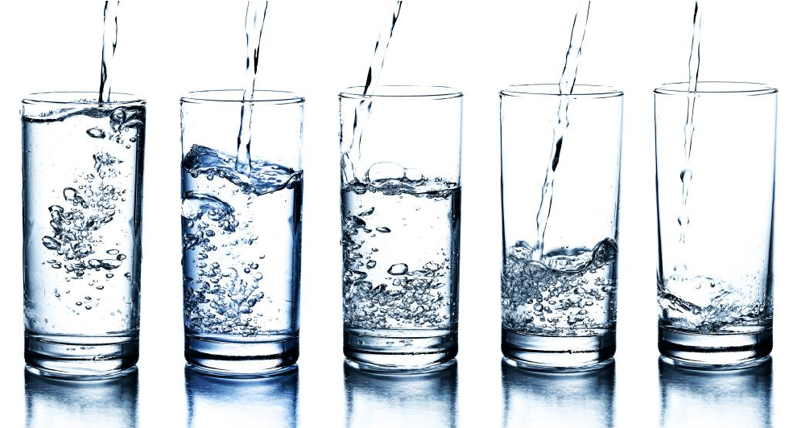

Consuming sugar sweetened beverages is

Key Recommendations also associated with weight gain (3).

- • Choose water more often than other types of beverages.
- • Drink more water in hot weather and when active.

###### Tips

###### Benefits

Water is essential for life, as it is involved in many functions in the body. We take in some water from foods, but most water comes from the fluids we drink.

It is estimated that men need 3.7 liters of fluid/day, while women need 2.7 liters/day (23). This includes water from all beverages and foods. Most health recommendations suggest about 8 cups water per day. It is important to drink even when you are not thirsty, especially for the elderly and athletes.

Drinking water is much better for the teeth than other beverages are. Erosion of teeth is related to acidity of soft drinks, whether sweetened with sugar or artificial sweeteners. In addition, the carbonation process creates an acidic environment that contributes to the erosion of tooth enamel.

- • Drink 2- 3 litres (8-12 cups) of fluid each day, choosing water often.
- • Choose water as a drink with meals.
- • Choose water instead of sugar-sweetened beverages to help maintain your weight and the health of your teeth.
- • Choose water instead of other beverages when eating out. You will save money and reduce calories.
- • Add a wedge of lime or lemon to enhance the taste of water.
- • Breastfeeding women need to drink about 1 litre more fluid per day.
- • The elderly are especially prone to dehydration and should drink 8-12 cups of fluid per day, even when not thirsty.

# 6. Adopt Safe and Clean FoodPreparation Methods

- • Thoroughly clean work surfaces, crockery, cutlery, cooking utensils and other equipment by using warm water with detergent.
- • Make sure that utensils and other equipment are thoroughly dry before reusing them.
- • Make sure to frequently wash and dry kitchen towels, sponges and cloths and to replace sponges regularly. You can reduce the risk of cross-contamination by using paper towels, which by being disposable cannot harbor and spread bacteria.
- • Keep appliances such as microwave ovens, toasters, can openers, and blender and mixer blades free of residual food particles.

Key Recommendations

- • Keep your hands, equipment and food preparation area clean.
- • Separate raw and cooked food. Use separate equipment (e.g. knives, cutting boards) for handling raw foods.
- • Cook food thoroughly.
- • Keep food at safe temperatures. Do not leave cooked food at room temperature for more than 2 hours. Keep foods that are supposed to be cold in the refrigerator.
- • Use safe food.

See “Five Keys to Safer Food”, Appendix 1, for more tips and information about the key recommendations (24).

###### Food Borne Disease

Adopting safe and clean food preparation methods can help to avoid food poisoning or food borne illness. Food borne diseases can be caused by consuming foods directly contaminated with microorganisms (e.g. salmonella in chicken) or food contaminated by diseased food handlers (e.g. typhoid, hepatitis A). Food poisoning can be especially severe for people with low immunity such as infants and the elderly.

###### Recommendations for Safe Food

from WHO EMRO, 2012 (4)

###### 1. Cleaning

###### 2. Purchase, Transport and Storage

- • Do not purchase food items that have defective packaging, that are improperly sealed or that show signs of spoilage.
- • Do not purchase or consume the contents of swollen or leaking cans and throw out the contents of any can if there is an unusual odor.
- • Keep the purchasing of chilled and frozen foods until the end of a shopping trip to avoid warming or thawing of these products.
- • Always read the label for storage instructions of purchased food items.
- • Check the expiry date of packaged food before purchasing.
- • When opening vacuum-sealed jars, make sure to listen for a popping sound, which indicates that the jar’s seal was intact.
- • Make sure that areas used for food storage, such as cupboards, are clean and that foods are stored in food-grade containers away from chemicals.
- • Store raw foods separately from readyto-eat foods in the refrigerator to prevent cross-contamination.
- • Store frozen food in fully sealed packages to prevent “freezer burn” (i.e. the drying that occurs on the surface of a product and negatively affects its quality but not its safety).
- • Store opened canned foods in the refrigerator, preferably not in the can.
- • Store rehydrated foods in the refrigerator (e.g. bean).
- • Store dried food in a sealed container and in a cool, dry place away from direct heat or sunlight.
- • Make sure that the refrigerator temperature is 5 °C or lower.

- • Cover all cooked foods and store them on a shelf above uncooked foods.
- • Wrap raw meats or place them in a closed container and store them near the bottom of the refrigerator to prevent the dripping of meat juices on other foods.
- • Regularly clean fridge and freezer shelves and doors and immediately clean up incidental spills.
- • Make sure that frozen food is kept completely frozen.
- • Regularly inspect dried food for insect infestation.
- • Eat refrigerated leftovers and ready-to-eat meals within 1–2 days.

###### 3. Preparation, Cooking and Serving

- • Wash hands well with soap before starting to prepare food, giving attention to areas between fingers and under fingernails.
- • After washing, thoroughly dry hands using a clean towel or a paper towel.
- • Do not prepare food if suffering from a foodborne illness.
- • Thoroughly clean chopping board and utensils used for cutting up raw meat in hot soapy water before using them for preparing foods to be eaten raw (e.g. vegetables, fruit).
- • Keep vegetables separate from raw meat, chicken and fish while shopping, preparing and storing.
- • Thaw foods in the refrigerator or a microwave oven, using the defrost setting.
- • When thawing raw meat, make sure meat juices do not contaminate other foods, containers or utensils.
- • Thoroughly wash fruit and vegetables under running water before peeling and cutting. Rub vegetables briskly to remove dirt.
- • When preparing green salads (e.g. lettuce-based or parsley-based salads) make sure to thoroughly wash leaves as these items are usually harder to clean.
- • Do not partially cook products and finish cooking them later; meat, fish and poultry must be thoroughly cooked before storage in the refrigerator.

- • Carefully select meat intended to be eaten raw and to consume it immediately.
- • Limit the time during which cooked foods such as stews and other meat and poultry dishes are left at room temperature (no more than 2 hours).
- • Refrigerate milk-based deserts (e.g. mahalibia, custard) and consume them in 1–2 days after purchase or preparation.
- • Never serve cooked food in plates and utensils that have held raw meat, poultry or seafood.
- • When reheating food, heat it until it is “steaming hot” throughout.
- • Boil unpasteurized milk before consuming it.
- • Avoid raw (unpasteurized) milk or dairy products.
- • Avoid raw or partially cooked eggs or foods containing raw eggs.
- • Do not reheat foods more than once.

31 See “Five Keys to Safer Food”, Appendix 1, for more tips and information about the key recommendations (24).

# 7. Eat Healthy while Protectingthe Environment

###### Key Recommendations

- • Emphasize a plant-based diet, including vegetables, fruit, whole grain cereals, legumes, nuts and seeds.
- • Reduce leftovers and waste.
- • When available, consume foods produced locally and regionally.
- • Choose fresh, home-made foods over highly processed foods and fast foods.
- • Conserve water in food preparation.
- • Follow the recommendations of the Qatar Dietary Guidelines.

###### How is what we eat linked to the environment?

The production and consumption of food, including processing, packaging, transportation, and waste disposal all affect our environment. Damage to the environment then impacts our ability to produce food.

The Qatar National Development Strategy identifies: shortage in water; low arable land; solid waste generation and depletion of fish stocks as concerns in Qatar that relate to food production (25).

Most water used by humans is incorporated into the food that we eat (e.g. water for crops, pesticide and fertilizer production, animal uses, processing). In general, plant-based foods such as fruit, vegetables, legumes and grains use less water in their production than animal foods, such as beef

(26). Greenhouse gas emissions (contributing to climate change) are also lower in plant-based versus animal-based foods (27).

Food waste is estimated to be 3139% of all food eaten in high and middle income countries. Reducing food waste is one of the easiest ways to help protect the environment (28).

- • Food depletes many natural resources in its production.
- • Overconsumption of food and eating highly processed and packaged low nutrient foods also increases water use, greenhouse gas emissions and the production of waste.

###### Tips

- • Plan meals and shopping to reduce waste from spoiling food.
- • Try not to overconsume food and drinks. This uses more natural resources and puts more pressure on the environment, including increasing disposal of food waste and packaging.
- • Emphasize a plant-based diet (more cereals, fruit, vegetables, legumes and less meat).
- • Choose less processed foods; this usually results in less impact on the environment.
- • Store foods safely and properly to decrease food waste.
- • Choose foods that do not have more packaging than is required.
- • Use reusable shopping bags.
- • Breastfeeding (compared to infant formula feeding) requires no resources in transporting and home preparation and generates no waste!

# 8. Take Care of Your Family

###### Tips

###### Key Recommendations

- • Breastfeed your baby exclusively for the first six months of their life, and continue until your child is two years old.
- • Build and model healthy patterns for your family.

- - Keep regular hours for meals.
- - Eat at least one meal together daily with family.
- - Be a role model for your children when it comes to healthy eating and physical activity.

###### Breastfeeding

Breastfeeding is the best source of nourishment for infants and young children, and it increases the bond between mother and baby. The World Health Organization recommends exclusive breastfeeding for the first six months of life. At six months, solid foods, such as infant cereals, and mashed vegetables fruits should be introduced to complement breastfeeding, but breastfeeding is recommended for up to two years (29).

###### Benefits

Breast milk gives infants all the nutrients they need for healthy development as well as antibodies to protect them from illness. Breastfeeding also contributes to a lifetime of good health.

Adolescents and adults who were breastfed as babies are less likely to be overweight or obese. They are also less likely to have type-2 diabetes and perform better in intelligence tests.

Mothers also benefit from breastfeeding. It reduces their risk of breast and ovarian cancer later in life, helps women return to their pre-pregnancy weight faster, and lowers rates of obesity (29).

- • Before the birth of your baby, make sure you arrange for someone trained to help you in case you have problems. Many women encounter difficulties at the beginning. Nipple pain, and fear that there is not enough milk are common problems

- but almost all women have enough milk! The more often and effectively a baby breastfeeds, the more milk will be made.

- • “Room in” with your baby in the hospital to make breastfeeding easier.
- • Start breastfeeding within one hour of birth.
- • A woman’s decision to breastfeed is influenced by her family; explain the benefits to your family and ask for support.
- • A mother’s fluid needs increase when breastfeeding. Have a glass of water nearby when you are breastfeeding.
- • Eat healthy by following the Qatar Dietary Guidelines while breastfeeding.
- • Working mothers can express milk and refrigerate it so the baby can continue on breastmilk when the mother is away.
- • To be sure each breast will produce a good milk supply, start each nursing session with the last breast used. You can pin your bra to remind you.
- • Weight loss is a natural benefit of breastfeeding. But do not use crash diets, as they could be harmful to your baby. Slow weight loss is best.

33

### Build and Model Healthy Patterns for your Family

###### Keep regular hours for meals

Set regular times for meals and snacks. This helps to establish a healthy routine, and makes the children feel secure by knowing when to expect to eat. Enjoy meal and snack time, and make time for healthy eating so that children do not feel rushed.

###### Eat at least one meal together daily with family

When children eat with their parents, they eat more vegetables, drink more milk, and may consume more fruit. Children and teens who have family meals with their parents consume more nutritious foods containing calcium, iron, potassium, zinc, folate, fiber, and vitamins B-6, B-12, C and E. They also eat less fat, including saturated and trans-fat. Youth who regularly eat dinner with their parents are more likely to eat breakfast, whether or not adults are present. Most studies have found that children who often eat together with their families are less likely to be obese.

Beyond nutritional benefits, children and teens who eat together with their families are more likely to get better grades in school, have a broader vocabulary, use less substances like tobacco, be less depressed, and contribute more to their community and society. Communication with the family can also improve (30).

###### Be a role model for your children when it comes to healthy eating and physical activity

Set a good example for children by taking the stairs instead of the escalator or elevator, and by walking in public places instead of riding in a cart. When at home or eating out, children will be more likely to choose healthy options if you do. Finally, take time to play with your children.

###### Tips

- • Prepare meals that include foods from each of the six groups.
- • Involve children in learning how to prepare their favourite foods. Use the tips in the Qatar Dietary Guidelines to prepare them in the healthiest way. Teach children to grow some of their favourite herbs (e.g. basil).
- • If your family drinks soda pop or enjoys other sweets, set limits (e.g. allowing 1 soda per week).
- • For a treat at home, instead of sweets try a new exotic fruit.
- • Be patient in introducing new foods to children.If an unfamiliar food is rejected the first time, it can be offered again later. The more often children are exposed to new foods, the more likely they are to accept them.
- • Keep in mind that while parents and caregivers are responsible for what children eat, children are responsible for how much they eat.Offer suitable portions with options for second helpings (31).

# Appendices and References

# Appendices

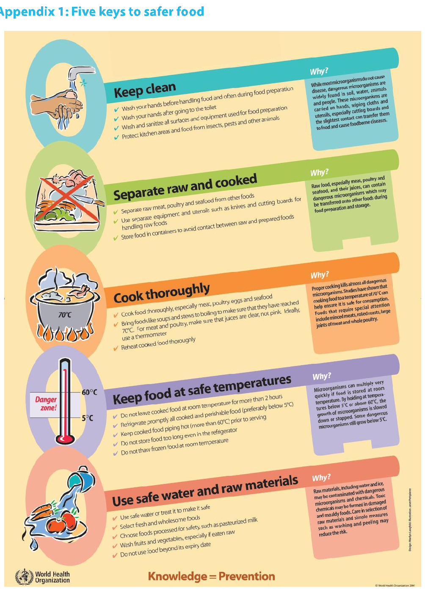

- Appendix 1: Five keys to safer food

###### Appendix 2: Development of the Qatar Dietary Guidelines

Members of the National Dietary Guidelines Task Force began working on the guidelines in 2012. The Ministry of Public Health, Health Promotion and Non-communicable Diseases, led the development of the Qatar Dietary Guidelines in collaboration with the Task Force. Representatives included: Qatar University; Qatar Foundation; Qatar Diabetes Association; Hamad Medical Corporation; Aspetar; Qatar National Food Security Program; Sidra Medical and Research Centre; Weill Cornell Medical College.

A workshop was held in January 2013 with Task Force members to review the nutrition needs in Qatar, and to create a first draft of the dietary guidelines. In February, a Coordinator was hired with the Ministry of Public Health to manage further steps. A Qatar Nutrition and Diet Profile was completed to ensure the guidelines are based on documented nutrition concerns in Qatar. It is available at: www.moph.gov.qa.

In addition to the Qatar Nutrition and Diet Profile, more than 10 dietary guidelines from across the region and world were reviewed. In particular, the Qatar Dietary Guidelines drew on recommendations, guidance and evidence from dietary guidelines from Australia (3); EMRO (4); Lebanon (32); Oman (33);

and Canada (2), as well as the 2012 American Cancer Society Guidelines on nutrition and physical activity for cancer prevention (10), the state of Qatar national physical activity guidelines (34) and the Arab Centre for Nutrition in Bahrain (35).

Upon extensive consultation, a decision was taken to focus on the quality of food eaten (versus quantity). Although specific numbers of servings per food group were not recommended, some guidance on quantity is provided. For example, serving numbers and sizes were included for fruit and vegetables, as this is an international standard. Other guidance is also provided, e.g. “eat legumes daily”, and “eat fish at least twice a week”. A next version of the Qatar Dietary Guidelines may consider including serving sizes if more information and resources are available in the future, and if it is desired by the public.

The guideline messages were pilot tested in the fall of 2013. A visual handout for the Qatar Dietary Guidelines was then designed, incorporating the feedback. A longer booklet was developed to complement the handout. The Qatar Dietary Guidelines were launched in 2015.

###### References

- 1. Raine K. Determinants of healthy eating in Canada. Canadian Journal of Public Health. 2005;96(3):S8-S14.
- 2. Health Canada. Eating Well with Canada’s Food Guide – A Resource for Educators and Communicators. 2011.
- 3. Australian National Health and Medical Research Council. Australian Dietary Guidelines. Providing the scientific evidence for healthier Australian diets. Canberra 2013.
- 4. WHO Regional Office for Eastern Mediterranean. Promoting a Healthy Diet for the WHO Eastern Mediterranean Region: user-friendly guide. Cairo 2012.
- 5. Australian National Health and Medical Research Council. A review of the evidence to address targeted questions to inform the revision of the Australian Dietary Guidelines. Canberra 2011.
- 6. Health Canada. Canadian Nutrient File 2012 [cited 2013 August 20]. Available from: http://webprod3.hcsc.gc.ca/cnf-fce/newSearch-nouvelleRecherche.do?action=new_nouveau&lang=eng.
- 7. Davis B, Melina, V. Becoming vegan. Summertown, TN: Book Publishing Company; 2000.
- 8. Musaiger A. Food Composition Tables for GCC Countries. Bahrain: Arab Center for Nutrition, 2006.
- 9. United States Department of Agriculture: Agricultural Research Service. USDA National Nutrient Database for Standard Reference. 2013.
- 10. Kushi L, Doyle, C, McCullough, M, Rock CL, Demark-Wahnefried, W, Bandera, E, et. al. American Cancer Society guidelines on nutrition and physical activity for cancer prevention: Reducing the risk of cancer with healthy food choices and physical activity. CA: A Cancer Journal for Clinicians. 2012;62(1):30-67.
- 11. American Dietetic Association. Position of the American Dietetic Association: Vegetarian diets. Journal of American Dietetic Association. 2009;109(7):1266-82.
- 12. Mozaffarian D, Rimm, E. Fish Intake, Contaminants, and Human Health Evaluating the Risks and the Benefits. Journal of American Medical Association. 2006;296(15):1885-99.
- 13. UK National Health Services. NHS Choices: Food Labels 2013 [cited 2013 August 26]. Available from: http://www.nhs.uk/Livewell/Goodfood/Pages/food-labelling.aspx.
- 14. UK National Health Services. NHS Choices: Tips for a Lower Salt Diet 2013 [cited 2013 August 26]. Available from: http://www.nhs.uk/Livewell/Goodfood/Pages/cut-down-salt.aspx.
- 15. World Health Organization. Guideline: Sodium intake for adults and children. Geneva 2012.
- 16. World Health Organization. Guideline: Potassium intake for adults and children. Geneva 2012.
- 17. Food and Agriculture Organization. Fats and fatty acids in human nutrition: report of an expert consultation. Rome 2010.
- 18. World Health Organization, Food and Agriculture Organization. Codex Alimentarius; International Food Standards 2013 [cited 2013 Sept 9]. Available from: http://www.codexalimentarius.org/.
- 19. Health Canada. Food Labelling 2008 [cited 2013 August 29]. Available from: http://www.hc-sc.gc.ca/fn-an/ label-etiquet/index-eng.php.

- 20. Public Health Agency of Canada. Benefits of Physical Activity 2011 [cited 2013 September 2]. Available from: http://www.phac-aspc.gc.ca/hp-ps/hl-mvs/pa-ap/02paap-eng.php.
- 21. UK National Health Services. NHS Choices. Sunlight and Vitamin D 2011 [cited 2013 June 18]. Available from: http://www.nhs.uk/Livewell/Summerhealth/Pages/vitamin-D-sunlight.aspx.
- 22. National Institute of Health USA Office of Dietary Supplements. Dietary Supplement Fact Sheet: Vitamin D: Health Professional 2011 [cited 2013 July 25]. Available from: http://ods.od.nih.gov/factsheets/Vitamin D-HealthProfessional/#en6.
- 23. US National Academy of Sciences. Dietary Reference Intakes for Water, Potassium, Sodium, Chloride, and Sulfate. In: United States Department of Agriculture National Agricultural Library: Food and Nutrition Information Centre Institute of Medicine, editor. 2004.
- 24. World Health Organization. Five keys to safer food manual. In: Department of Food Safety Zoonoses and Foodborne Diseases, editor. 2006.
- 25. Qatar General Secretariat for Development Planning. Qatar National Development Strategy 2011-2016. Doha: Gulf Publishing and Printing Company; 2011.
- 26. Allan T. Virtual water: Tackling the threat to our planet’s most precious resource. London I. B. Tauris; 2011.
- 27. Sustainable Development Commission. Setting the table: advice to government on priority elements of sustainable diets. London 2009.
- 28. Food and Agriculture Organization. Food wastage footprint: Impacts on natural resources In: Natural Resources Management and Environment Department, editor. Rome 2013.
- 29. World Health Organization. 10 facts on breastfeeding 2013 [cited 2013 September 3]. Available from: http://www.who.int/features/factfiles/breastfeeding/en/index.html.
- 30. Washington State University Extension. Eat Together, Eat Better. Leader’s Guide 2013 [cited 2013 September 3]. Available from: http://nutrition.wsu.edu/eteb/.
- 31. Ellen Satter Institute. Ellen Satter’s division of responsibility in feeding 2013 [cited 2013 September 3]. Available from: http://ellynsatterinstitute.org/dor/divisionofresponsibilityinfeeding.php.
- 32. American University of Beirut. The food-based dietary guideline manual for promoting healthy eating in the Lebanese adult population. Beirut 2012
- 33. Department of Nutrition. The Omani Guide to Healthy Eating. Oman Ministry of Health, 2009.
- 34. Aspetar. The state of Qatar National Physical activity guidelines . Qatar 2014. Available from: http://www. namat.qa/NamatImages/Publications/75/QATAR
- 35. Musaiger A. Food Consumption Patterns in the Eastern Mediterranean Region Bahrain: Arab Center of Nutrition; 2011 [cited 2013 May 20]. Available from: www.acnut.com/v/images/stories/pdf/cov2.pdf.

