United States Department of Agriculture

Infant Nutrition and Feeding

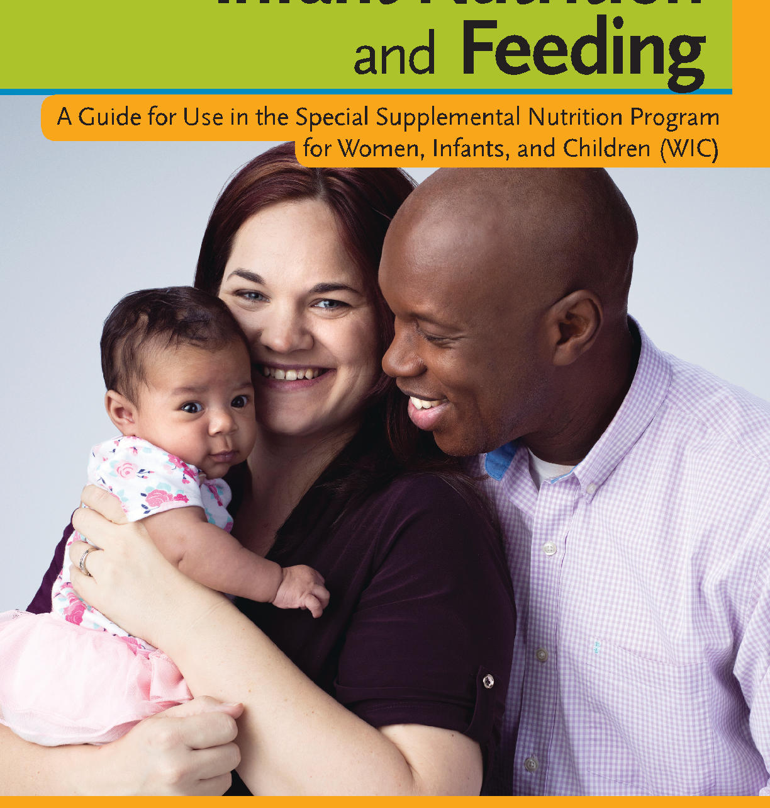

##### A Guide for Use in the Special Supplemental Nutrition Program for Women, Infants, and Children (WIC)

INFANT NUTRITION AND FEEDINGFood and Nutrition Service3

In accordance with Federal civil rights law and U.S. Department of Agriculture (USDA) civil rights regulations and policies, the USDA, its Agencies, offices, and employees, and institutions participating in or administering USDA programs are prohibited from discriminating based on race, color, national origin, sex, disability, age, or reprisal or retaliation for prior civil rights activity in any program or activity conducted or funded by USDA.

Persons with disabilities who require alternative means of communication for program information (e.g., Braille, large print, audiotape, American Sign Language, etc.) should contact the Agency (State or local) where they applied for benefits. Individuals who are deaf, hard of hearing, or have speech disabilities may contact USDA through the Federal Relay Service at (800) 877-8339. Additionally, program information may be made available in languages other than English.

To file a program complaint of discrimination, complete the USDA Program Discrimination Complaint Form, (AD-3027), found online at: http://www.ascr.usda.gov/complaint_filing_cust.html, and at any USDA office, or write a letter addressed to USDA and provide in the letter all of the information requested in the form. To request a copy of the complaint form call (866) 632-9992. Submit your completed form or letter to USDA by:

Mail: U.S. Department of Agriculture Office of the Assistant Secretary for Civil Rights 1400 Independence Avenue, SW Washington, DC 20250-9410

Fax: (202) 690-7442

Email: program.intake@usda.gov

This institution is an equal opportunity provider.

U.S. Department of Agriculture Food and Nutrition Service April 2019 FNS-826

###### Note to the Reader on Using This Guidebook

The WIC Infant Feeding Guide is for staff who provide nutrition education and counseling to the parents and guardians (termed “parents and caregivers”) of infants who participate in the Special Supplemental Nutrition Program for Women, Infants, and Children (WIC). This publication provides an overview of basic subjects related to infant nutrition and feeding and answers common questions on the nutritional needs of infants; the development of feeding skills; breastfeeding; formula feeding; the introduction of complementary foods; infant feeding practices; appropriate food selection and preparation; oral health; vegetarian nutrition; common gastrointestinal problems; obesity; physical activity/motor skill development; and sanitary preparation and storage of food.

Since this publication primarily focuses on nutrition for the healthy full-term infant, the reader is advised to consult with trained health professionals or textbooks on pediatrics or pediatric nutrition for more detailed or advanced technical information on aspects of infant nutrition; assessment of an infant’s nutritional status (including growth and development); and nutrition care for preterm, lowbirth-weight, or special needs infants, or those with medical conditions. Note that the term “health care provider” in the text refers to the physician, dentist, nurse practitioner, registered nurse, or other health professional providing medical or dental care to the infant.

This guidebook can assist staff in disseminating appropriate and accurate information to participants. It is a resource for planning individual counseling sessions, group classes, and staff in-service training sessions. Throughout the text, features in green boxes provide useful tips and information, such as “A Shopping List Rich in

Vitamins and Minerals,” “State Laws That Protect Breastfeeding Mothers,” “Choosing a Breast Pump,” “Colic: A Mystery Ailment,” and “Immunization Is Important.” Notes in bold letters give warnings and concerns, such as, “Refer infants who appear to have feeding problems to a health care provider for assessment.” For quick reference, newly introduced terms are highlighted in blue, and their definitions appear at the bottom of the page. Readers will find a full glossary at the end of the guidebook. Numbered endnotes throughout the text indicate resource information from key organizations such as the American Academy of Pediatrics (AAP) and the U.S. Food and Drug Administration (FDA). The resources are cited in full at the end of each chapter; a complete bibliography with all the resources appears in the back of the guidebook. An additional list of resources is provided in the appendix for more information on infant nutrition, food safety, and other related topics. For quick reference to topics, refer to the detailed index at the end of this guide.

Every effort has been made to ensure the accuracy of the information in this guidebook. The recommendations in this guidebook are not designed to serve as an exclusive nutrition care plan or program for all infants. It is the responsibility of each staff person providing nutrition education to parents and caregivers of infants to evaluate the appropriateness of nutrition recommendations in the context of an individual infant’s nutritional and health status, lifestyle, and other factors affecting that status. The staff person must also consider any new developments in infant nutrition. If you have a question or are unsure about the appropriateness of a nutrition recommendation, consult with the infant’s health care provider or a professional with additional expertise in pediatric nutrition before making a recommendation.

We are interested in your comments on this guidebook. Complete the questionnaire in the Reader Response section of this guidebook.

INFANT NUTRITION AND FEEDING i

###### SHUTTERSTOCK

## CONTENTS

### qNutritional Needs of Infants . . . . . . . . . . . . . . . . . . . . . . . . . . . . . . . . . . . . . . . . . 1

Nutrition Assessment . . . . . . . . . . . . . . . . . . . . . . . . . . . . . . . . . . . . . . . . . . . . . . . . . . . . . . . . . . . . . . . . . . . . . 1 Dietary Reference Intakes (DRIs) . . . . . . . . . . . . . . . . . . . . . . . . . . . . . . . . . . . . . . . . . . . . . . . . . . . . . . . . . . . . 3 Energy and Important Nutrients . . . . . . . . . . . . . . . . . . . . . . . . . . . . . . . . . . . . . . . . . . . . . . . . . . . . . . . . . . . . . 4 Energy . . . . . . . . . . . . . . . . . . . . . . . . . . . . . . . . . . . . . . . . . . . . . . . . . . . . . . . . . . . . . . . . . . . . . . . . . . . . . . . . . . 4 Nutrients . . . . . . . . . . . . . . . . . . . . . . . . . . . . . . . . . . . . . . . . . . . . . . . . . . . . . . . . . . . . . . . . . . . . . . . . . . . . . . . . 5 Macronutrients . . . . . . . . . . . . . . . . . . . . . . . . . . . . . . . . . . . . . . . . . . . . . . . . . . . . . . . . . . . . . . . . . . . . . . . . . . . 5 Micronutrients . . . . . . . . . . . . . . . . . . . . . . . . . . . . . . . . . . . . . . . . . . . . . . . . . . . . . . . . . . . . . . . . . . . . . . . . . . 10 Vitamin and Mineral Supplements . . . . . . . . . . . . . . . . . . . . . . . . . . . . . . . . . . . . . . . . . . . . . . . . . . . . . . . . . . 22 Endnotes . . . . . . . . . . . . . . . . . . . . . . . . . . . . . . . . . . . . . . . . . . . . . . . . . . . . . . . . . . . . . . . . . . . . . . . . . . . . . . . 28

- Table 1.1 – Recommended Dietary Reference Intakes for Macronutrients . . . . . . . . . . . . . . . . . . . . . . . . . . . . 6
- Table 1.2 – Recommended Dietary Reference Intakes for Fat-Soluble Vitamins . . . . . . . . . . . . . . . . . . . . . . . 10
- Table 1.3 – Recommended Dietary Reference Intakes for Water-Soluble Vitamins . . . . . . . . . . . . . . . . . . . . . 14
- Table 1.4 – Recommended Dietary Reference Intakes for Minerals . . . . . . . . . . . . . . . . . . . . . . . . . . . . . . . . . 17
- Table 1.5 – Nutrients: Function, Deficiency and Toxicity Symptoms, and Major Food Sources . . . . . . . . . . . 23

### wDevelopment of Infant Feeding Skills. . . . . . . . . . . . . . . . . . . . . . . . . . . . . . . . . . . . 33

Infant Behavior . . . . . . . . . . . . . . . . . . . . . . . . . . . . . . . . . . . . . . . . . . . . . . . . . . . . . . . . . . . . . . . . . . . . . . . . . . 33 The Feeding Relationship . . . . . . . . . . . . . . . . . . . . . . . . . . . . . . . . . . . . . . . . . . . . . . . . . . . . . . . . . . . . . . . . . . 39 How Developmental Delays Affect an Infant’s Feeding Skills . . . . . . . . . . . . . . . . . . . . . . . . . . . . . . . . . . . . . 43 Endnotes . . . . . . . . . . . . . . . . . . . . . . . . . . . . . . . . . . . . . . . . . . . . . . . . . . . . . . . . . . . . . . . . . . . . . . . . . . . . . . . 44

- Table 2.1 – Sequence of Infant Developmental Skills . . . . . . . . . . . . . . . . . . . . . . . . . . . . . . . . . . . . . . . . . . . . 38
- Table 2.2 – Infant Hunger and Satiety Cues . . . . . . . . . . . . . . . . . . . . . . . . . . . . . . . . . . . . . . . . . . . . . . . . . . . 39
- Table 2.3 – Desired Outcomes for the Infant and the Role of the Family in the Feeding Relationship . . . . . 41

### eBreastfeeding. . . . . . . . . . . . . . . . . . . . . . . . . . . . . . . . . . . . . . . . . . . . . . . . . . . . . . . . 47

Breastfeeding Recommendations . . . . . . . . . . . . . . . . . . . . . . . . . . . . . . . . . . . . . . . . . . . . . . . . . . . . . . . . . . . 47 Benefits of Breastfeeding . . . . . . . . . . . . . . . . . . . . . . . . . . . . . . . . . . . . . . . . . . . . . . . . . . . . . . . . . . . . . . . . . . 48 Factors Affecting the Decision to Initiate or Continue Breastfeeding . . . . . . . . . . . . . . . . . . . . . . . . . . . . . . . .51 Methods to Support Breastfeeding Mothers in Your Program . . . . . . . . . . . . . . . . . . . . . . . . . . . . . . . . . . . . 52 The Basics of Breastfeeding . . . . . . . . . . . . . . . . . . . . . . . . . . . . . . . . . . . . . . . . . . . . . . . . . . . . . . . . . . . . . . . . 52 Characteristics of Feedings . . . . . . . . . . . . . . . . . . . . . . . . . . . . . . . . . . . . . . . . . . . . . . . . . . . . . . . . . . . . . . . . 60 Breast Care . . . . . . . . . . . . . . . . . . . . . . . . . . . . . . . . . . . . . . . . . . . . . . . . . . . . . . . . . . . . . . . . . . . . . . . . . . . . . 63 Expressing Human Milk . . . . . . . . . . . . . . . . . . . . . . . . . . . . . . . . . . . . . . . . . . . . . . . . . . . . . . . . . . . . . . . . . . . 64 Human Milk Storage . . . . . . . . . . . . . . . . . . . . . . . . . . . . . . . . . . . . . . . . . . . . . . . . . . . . . . . . . . . . . . . . . . . . . 65 Common Concerns . . . . . . . . . . . . . . . . . . . . . . . . . . . . . . . . . . . . . . . . . . . . . . . . . . . . . . . . . . . . . . . . . . . . . . 66 Choosing a Breast Pump . . . . . . . . . . . . . . . . . . . . . . . . . . . . . . . . . . . . . . . . . . . . . . . . . . . . . . . . . . . . . . . . . . 67 Planning Time Away From the Infant . . . . . . . . . . . . . . . . . . . . . . . . . . . . . . . . . . . . . . . . . . . . . . . . . . . . . . . . 73

INFANT NUTRITION AND FEEDING iii

Weaning the Breastfed Infant. . . . . . . . . . . . . . . . . . . . . . . . . . . . . . . . . . . . . . . . . . . . . . . . . . . . . . . . . . . . . . . 75 Contraindications to Breastfeeding . . . . . . . . . . . . . . . . . . . . . . . . . . . . . . . . . . . . . . . . . . . . . . . . . . . . . . . . . . 76 Breast Surgery or Piercing . . . . . . . . . . . . . . . . . . . . . . . . . . . . . . . . . . . . . . . . . . . . . . . . . . . . . . . . . . . . . . . . . 76 Use of Cigarettes, Alcohol, and Other Substances During Breastfeeding . . . . . . . . . . . . . . . . . . . . . . . . . . . . 77 Endnotes . . . . . . . . . . . . . . . . . . . . . . . . . . . . . . . . . . . . . . . . . . . . . . . . . . . . . . . . . . . . . . . . . . . . . . . . . . . . . . . 84

- Figure 3.1 – How the Breast Makes Milk . . . . . . . . . . . . . . . . . . . . . . . . . . . . . . . . . . . . . . . . . . . . . . . . . . . . . . 53
- Figure 3.2 – How Mothers Make Milk: The Role of the Brain . . . . . . . . . . . . . . . . . . . . . . . . . . . . . . . . . . . . . .55
- Figure 3.3 – Latching On Correctly . . . . . . . . . . . . . . . . . . . . . . . . . . . . . . . . . . . . . . . . . . . . . . . . . . . . . . . . . . . 59

- Table 3.1 – Human Milk Storage Guidelines for the Special Supplemental Nutrition Program for Women, Infants and Children (WIC) . . . . . . . . . . . . . . . . . . . . 66

rInfant Formula Feeding. . . . . . . . . . . . . . . . . . . . . . . . . . . . . . . . . . . . . . . . . . . . . . . . . . . . .93

Types of Infant Formulas . . . . . . . . . . . . . . . . . . . . . . . . . . . . . . . . . . . . . . . . . . . . . . . . . . . . . . . . . . . . . . . . . . 93 Infant Formula Additives . . . . . . . . . . . . . . . . . . . . . . . . . . . . . . . . . . . . . . . . . . . . . . . . . . . . . . . . . . . . . . . . . . 97 Formula Feeding in the First Year . . . . . . . . . . . . . . . . . . . . . . . . . . . . . . . . . . . . . . . . . . . . . . . . . . . . . . . . . . . 98 Formula Feeding Recommendations . . . . . . . . . . . . . . . . . . . . . . . . . . . . . . . . . . . . . . . . . . . . . . . . . . . . . . . 100 Common Feeding Concerns . . . . . . . . . . . . . . . . . . . . . . . . . . . . . . . . . . . . . . . . . . . . . . . . . . . . . . . . . . . . . . 101 Selection, Preparation, Storage, and Warming of Infant Formula . . . . . . . . . . . . . . . . . . . . . . . . . . . . . . . . . 103 Guidelines for Using Infant Formula When Access to Common Kitchen Appliances Is Limited . . . . . . . . . 107 Natural Disaster or Power Outage: Infant Formula Guidelines . . . . . . . . . . . . . . . . . . . . . . . . . . . . . . . . . . . 107 Weaning from the Bottle . . . . . . . . . . . . . . . . . . . . . . . . . . . . . . . . . . . . . . . . . . . . . . . . . . . . . . . . . . . . . . . . . 108 Endnotes . . . . . . . . . . . . . . . . . . . . . . . . . . . . . . . . . . . . . . . . . . . . . . . . . . . . . . . . . . . . . . . . . . . . . . . . . . . . . . 109

- Table 4.1 – Formula Preparation Guidelines . . . . . . . . . . . . . . . . . . . . . . . . . . . . . . . . . . . . . . . . . . . . . . . . . . 105

tComplementary Foods. . . . . . . . . . . . . . . . . . . . . . . . . . . . . . . . . . . . . . . . . . . . . . . . . . . . . .115

Recommendations on Transitioning to Complementary Foods . . . . . . . . . . . . . . . . . . . . . . . . . . . . . . . . . . .115 Food Hypersensitivities/Allergies, Intolerances, and Other Adverse Reactions . . . . . . . . . . . . . . . . . . . . . . .119 Choking Prevention . . . . . . . . . . . . . . . . . . . . . . . . . . . . . . . . . . . . . . . . . . . . . . . . . . . . . . . . . . . . . . . . . . . . . 120 Types of Complementary Foods to Introduce . . . . . . . . . . . . . . . . . . . . . . . . . . . . . . . . . . . . . . . . . . . . . . . . . 124 Beverages . . . . . . . . . . . . . . . . . . . . . . . . . . . . . . . . . . . . . . . . . . . . . . . . . . . . . . . . . . . . . . . . . . . . . . . . . . . . . 129 Preparing Infant Foods for Consistency, Size, and Shape . . . . . . . . . . . . . . . . . . . . . . . . . . . . . . . . . . . . . . . .133 Foods to Avoid . . . . . . . . . . . . . . . . . . . . . . . . . . . . . . . . . . . . . . . . . . . . . . . . . . . . . . . . . . . . . . . . . . . . . . . . . .135 Recommended Amounts of Complementary Foods. . . . . . . . . . . . . . . . . . . . . . . . . . . . . . . . . . . . . . . . . . . . 136 Home-Prepared Foods . . . . . . . . . . . . . . . . . . . . . . . . . . . . . . . . . . . . . . . . . . . . . . . . . . . . . . . . . . . . . . . . . . . .137 Mealtimes . . . . . . . . . . . . . . . . . . . . . . . . . . . . . . . . . . . . . . . . . . . . . . . . . . . . . . . . . . . . . . . . . . . . . . . . . . . . . 140 Practical Aspects of Feeding Complementary Foods . . . . . . . . . . . . . . . . . . . . . . . . . . . . . . . . . . . . . . . . . . . .141 Endnotes . . . . . . . . . . . . . . . . . . . . . . . . . . . . . . . . . . . . . . . . . . . . . . . . . . . . . . . . . . . . . . . . . . . . . . . . . . . . . . 143

- Table 5.1 – Common Foods That Cause Choking in Children Under Age 4 . . . . . . . . . . . . . . . . . . . . . . . . . . 122 Table 5.2 – Guidelines for Feeding Healthy Infants, Birth to 12 Months Old. . . . . . . . . . . . . . . . . . . . . . . . . .138

iv INFANT NUTRITION AND FEEDING

### ySpecial Concerns in Infant Feeding and Development. . . . . . . . . . . . . . .151

Oral Health . . . . . . . . . . . . . . . . . . . . . . . . . . . . . . . . . . . . . . . . . . . . . . . . . . . . . . . . . . . . . . . . . . . . . . . . . . . . .151 Vegetarian Diets . . . . . . . . . . . . . . . . . . . . . . . . . . . . . . . . . . . . . . . . . . . . . . . . . . . . . . . . . . . . . . . . . . . . . . . . 156 Common Gastrointestinal Problems . . . . . . . . . . . . . . . . . . . . . . . . . . . . . . . . . . . . . . . . . . . . . . . . . . . . . . . . 160 Immunization . . . . . . . . . . . . . . . . . . . . . . . . . . . . . . . . . . . . . . . . . . . . . . . . . . . . . . . . . . . . . . . . . . . . . . . . . . 164 Overweight and Obesity Prevention . . . . . . . . . . . . . . . . . . . . . . . . . . . . . . . . . . . . . . . . . . . . . . . . . . . . . . . . 165 Sleeping Patterns and Safe Sleep Practices . . . . . . . . . . . . . . . . . . . . . . . . . . . . . . . . . . . . . . . . . . . . . . . . . . 166 Endnotes . . . . . . . . . . . . . . . . . . . . . . . . . . . . . . . . . . . . . . . . . . . . . . . . . . . . . . . . . . . . . . . . . . . . . . . . . . . . . . 169

uPhysical Activity in Infancy . . . . . . . . . . . . . . . . . . . . . . . . . . . . . . . . . . . . . . . . . . . . . . . .177

Why Physical Activity Is Important . . . . . . . . . . . . . . . . . . . . . . . . . . . . . . . . . . . . . . . . . . . . . . . . . . . . . . . . . .177 Gross Motor Milestones in Infancy . . . . . . . . . . . . . . . . . . . . . . . . . . . . . . . . . . . . . . . . . . . . . . . . . . . . . . . . . 179 Physical Activity Guidelines for Infants . . . . . . . . . . . . . . . . . . . . . . . . . . . . . . . . . . . . . . . . . . . . . . . . . . . . . . 179 Play Positions . . . . . . . . . . . . . . . . . . . . . . . . . . . . . . . . . . . . . . . . . . . . . . . . . . . . . . . . . . . . . . . . . . . . . . . . . . .181 Common Concerns With Walkers and Infant Equipment . . . . . . . . . . . . . . . . . . . . . . . . . . . . . . . . . . . . . . . . 184 Media Use and Inactivity . . . . . . . . . . . . . . . . . . . . . . . . . . . . . . . . . . . . . . . . . . . . . . . . . . . . . . . . . . . . . . . . . 184 Endnotes . . . . . . . . . . . . . . . . . . . . . . . . . . . . . . . . . . . . . . . . . . . . . . . . . . . . . . . . . . . . . . . . . . . . . . . . . . . . . . 187 Table 7.1 – Milestones and Development . . . . . . . . . . . . . . . . . . . . . . . . . . . . . . . . . . . . . . . . . . . . . . . . . . . . 180

iFood Safety. . . . . . . . . . . . . . . . . . . . . . . . . . . . . . . . . . . . . . . . . . . . . . . . . . . . . . . . . . . . . . . . . . .191

Clean Hands and Kitchens Keep Infants Well . . . . . . . . . . . . . . . . . . . . . . . . . . . . . . . . . . . . . . . . . . . . . . . . . .191 Safely Preparing and Storing Human Milk and Infant Formula . . . . . . . . . . . . . . . . . . . . . . . . . . . . . . . . . . . 192 Preparing and Storing Home-Prepared and Commercial Foods Safely . . . . . . . . . . . . . . . . . . . . . . . . . . . . . 193 Water and Food Contaminants . . . . . . . . . . . . . . . . . . . . . . . . . . . . . . . . . . . . . . . . . . . . . . . . . . . . . . . . . . . . 198 Endnotes . . . . . . . . . . . . . . . . . . . . . . . . . . . . . . . . . . . . . . . . . . . . . . . . . . . . . . . . . . . . . . . . . . . . . . . . . . . . . . 209

Appendixes . . . . . . . . . . . . . . . . . . . . . . . . . . . . . . . . . . . . . . . . . . . . . . . . . . . . . . . . . . . . . . . . . . . . . . . . . . . . 217

- A. Using the WIC Works Resource System . . . . . . . . . . . . . . . . . . . . . . . . . . . . . . . . . . . . . . . . . . . . . . 218 Guidelines for Feeding Healthy Infants Infant Developmental Skills/Infant Hunger and Satiety Cues Infant Feeding: Tips for Food Safety
- B. Resources on Infant Nutrition, Food Safety, and Related Topics . . . . . . . . . . . . . . . . . . . . . . . . . . . 225

Glossary . . . . . . . . . . . . . . . . . . . . . . . . . . . . . . . . . . . . . . . . . . . . . . . . . . . . . . . . . . . . . . . . . . . . . . . . . . . . . . 229 Bibliography . . . . . . . . . . . . . . . . . . . . . . . . . . . . . . . . . . . . . . . . . . . . . . . . . . . . . . . . . . . . . . . . . . . . . . . . . . . 237 Acknowledgments . . . . . . . . . . . . . . . . . . . . . . . . . . . . . . . . . . . . . . . . . . . . . . . . . . . . . . . . . . . . . . . . . . . . . . 256 Index . . . . . . . . . . . . . . . . . . . . . . . . . . . . . . . . . . . . . . . . . . . . . . . . . . . . . . . . . . . . . . . . . . . . . . . . . . . . . . . . . 257 Reader Response . . . . . . . . . . . . . . . . . . . . . . . . . . . . . . . . . . . . . . . . . . . . . . . . . . . . . . . . . . . . . . . . . . . . . . . 268

INFANT NUTRITION AND FEEDING v

SHUTTERSTOCK

CHAPTERq

## NUTRITIONAL NEEDS OF INFANTS

# G

ood nutrition is essential for the rapid growth and brain development that occur during an infant’s first year of life. For healthy growth and development, an infant must eat an adequate amount of essential nutrients by consuming appropriate quantities and types of foods. During infancy,

###### This chapter reviews:

nutrient requirements per pound of body weight are proportionally higher than at any other time in the life cycle. Positive and supportive feeding attitudes and techniques demonstrated by the parent or caregiver help infants develop healthy attitudes toward foods, themselves, and others.

QNutrition assessment QDietary Reference Intakes (DRIs) QEnergy and important nutrients

needed during infancy

1

Nutrition Assessment

To determine an infant’s nutritional needs and develop a nutrition care plan, an accurate assessment of the infant’s nutritional status must be performed. The nutrition assessment provides the nutritionist or competent professional authority (CPA) with important information about feeding practices and the infant’s health. Nutrition education sessions can then be designed to help parents discuss their infants’ feeding and growth concerns and devise strategies that help ensure the infants’ optimal development. The nutritionist/CPA, as well as, the pediatrician plays essential roles in establishing healthy habits concerning infant feeding.

###### Why WIC Nutrition Assessment?

A WIC nutrition assessment is the process of obtaining and synthesizing relevant and accurate information to achieve the following goals:

QTo assess an infant’s nutrition status and risk QTo design appropriate nutrition education

and counseling

QTo tailor the food package to address

nutrition needs

QTo make appropriate referrals

###### Your CPA Is Vital

To ensure the quality of nutrition services in the WIC program, each local agency shall have a competent professional authority (CPA) on staff. The CPA determines the eligibility of applicants to the WIC program by assessing and documenting income eligibility, determining nutritional risks, prescribing food packages, providing nutrition education including breastfeeding promotion and support, and making referrals to appropriate health and other social services as well as community resources.

###### Value Enhanced Nutrition Assessment

Value Enhanced Nutrition Assessment (VENA) encompasses all aspects of WIC nutrition assessment, which is an essential component of the WIC nutrition services process. By using VENA during the WIC nutrition assessment, CPAs can provide parents and caregivers with the WIC benefits of targeted nutrition education, supplemental food packages, and referrals to health and social services. No single measurement can indicate an infant’s nutritional status. The assessment must be comprehensive to obtain a clear picture of the issues and variables that impact the infant’s nutritional and health status.

For the CPA to create such a comprehensive assessment, the following relevant information should be obtained and synthesized during each WIC nutrition assessment:

QAnthropometric data QBiochemical data QClinical data QDietary information QEnvironmental and family information QOther adjunct health information and technical

requirements

For more information about the Value Enhanced Nutrition Assessment, visit https://wicworks. fns.usda.gov/resources/value-enhanced-nutritionassessment-vena-guidance.

###### Anthropometric Data

Anthropometry is a practical and immediately applicable technique for assessing children’s development patterns during the first years of life. Anthropometric data are less accurate than clinical and biochemical techniques when it comes to assessing individual nutritional status. However, anthropometry is a screening tool to identify individuals at nutritional risk. Growth charts have been developed to allow assessment of children’s growth based on two criteria:

QLength or stature for age and weight for age QHead circumference and weight for length

or stature

Charts have been developed for both males and females for two age intervals:

QBirth–24 months Q2–18 years

By plotting body measurements on growth charts, the CPA can determine if an infant’s growth is within the recommended parameters.

For more information on growth charts, visit the Centers for Disease Control and Prevention website: https://www.cdc.gov/growthcharts/who_charts.htm.

###### Biochemical Data

Biochemical data help diagnose or confirm an infant’s nutritional deficiencies or excesses. In the WIC program, required measurements include hemoglobin or hematocrit levels for screening of iron deficiency anemia. WIC regulations require that all infants 9 months of age and older (who have not already had a hematological test performed or obtained between the ages of 6 and 9 months) shall have a hematological test performed between 9 and 12 months of age or obtained from referral sources. If levels are low, the CPA should assess factors affecting low hemoglobin or hematocrit levels, such as medical condition, recent illness or infection, appetite, diet, factors inhibiting dietary iron absorption, and lead poisoning. In addition, it is important to discuss with the parent or caregiver whether an infant has had lead testing in the past 12 months and refer the parent or caregiver to appropriate resources if needed.

###### Clinical Data

Clinical data are gathered through the infant’s medical chart review, the parent or caregiver interview, the health care provider referral form(s), or other sources. Issues that contribute to a complete assessment include the following:

QFailure to thrive contributors, such as birth status, illnesses, developmental delay, and potential for abuse, neglect, or poor psychosocial environment

QNutrition-related medical condition or illness,

as well as infant’s special diet

QPrescriptions or over-the-counter medications with

nutrition implications

QMajor surgery, trauma, or burns in the past 2

months

###### Dietary Information

###### WIC’s approach to dietary assessment is qualitative, not quantitative. The CPA may assess the infant’s feeding history and primary nutrient sources, as well

Hemoglobin: The iron-containing, oxygen-carrying protein in the blood Hematocrit: The percentage of blood that consists of packed red blood cells

- as use of complementary foods, feeding patterns, use of dietary supplements, use of nursing bottles and cups, routine feeding practices, ability to transition to complementary feeding after 6 months of age, and infant and maternal factors that affect breastfeeding. Such questions will foster positive communication between the parent or caregiver and the CPA and can serve as a springboard for further discussion.

###### Environmental and Family Information

It is important to understand environmental and family factors. This information includes: socioeconomic background, primary residence, level of access to safe and adequate food and drinking water, food preparation and storage facilities, the primary parent or caregiver’s ability to make appropriate feeding decisions and/or to prepare food, and exposure to environmental toxics such

- as tobacco smoke, and to assess the caregiver’s understanding of any potential health risks.

###### Other Adjunct Health Issues and Technical Requirements

Other adjunct health issues include assessments of an infant’s oral health and dental screenings, well childcare, immunization status, food safety, and physical activity.

The diagram below illustrates how nutrition assessment fits into the WIC nutrition services process. To provide an appropriate and personalized nutrition intervention (e.g., nutrition education, food package tailoring, and referrals), the CPA must first conduct a nutrition assessment.

2

###### Dietary Reference Intakes

The Dietary Reference Intakes (DRIs), developed by the Food and Nutrition Board for the Health and Medicine Division (formerly the Institute of Medicine) at the National Academies of Sciences, are four nutrient-based reference values intended for planning and assessing diets:

QEstimated average requirement (EAR) QRecommended dietary allowance (RDA) QAdequate intake (AI) QTolerable upper intake level (UL)

Recommendations for feeding infants, from human milk to complementary foods, are based primarily on the DRIs. The DRIs for infants are based on the nutrient content of foods consumed by healthy infants with normal growth patterns, the nutrient content of human milk, investigative research, and metabolic studies. Although experts agree that humans need many nutrients, the requirements for intake have been estimated for only a limited number of nutrients. It is difficult to define precise nutrient requirements applicable to all infants

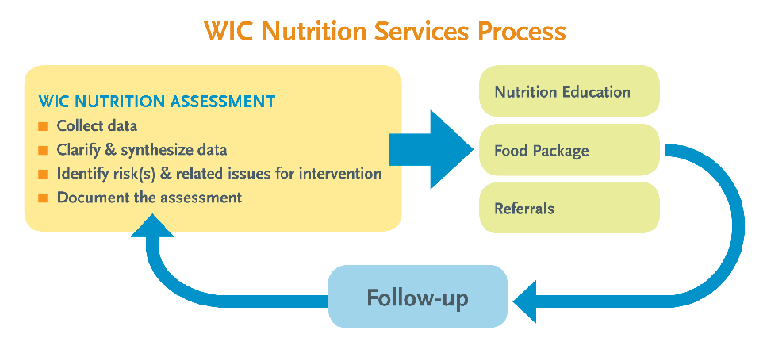

because each infant is unique. Infants differ in the amount of nutrients ingested and stored, their body composition, growth rates, and physical activity levels. Also, infants with medical problems or special nutritional needs (such as metabolic disorders, chronic diseases, injuries, premature birth, birth defects, other medical conditions, or use of drug therapies) may have different nutritional needs than healthy infants. The DRIs for carbohydrates, lipids, protein, vitamins, and minerals are set at levels thought to be high enough to meet the nutrient needs of most healthy infants, while energy allowances, referred to as the estimated energy requirements, are based on average requirements for infants.

###### Energy and Important Nutrients

3

###### The following sections include information on energy, important nutrients, and water. They also

include food sources, functions, and concerns regarding major nutrients considered to be of public health significance to infants in the United States.

###### Energy

Infants need energy from food for activity, growth, and normal development. Energy comes from foods containing energy-producing macronutrients. Macronutrients provide energy, and they are measured in kilocalories, or what we often call “calories.” The number of kilocalories needed per unit of a person’s body weight expresses energy needs.

###### Energy Needs

Energy needs are highly variable in infants and depend on the following:

QBasal metabolic rate (the energy the body expends

at rest)

###### Nutrition Terms You Need to Know

These reference values help you plan and assess an infant’s diet: QEAR (estimated average requirement) is the median usual intake that is estimated to meet the

requirement of 50 percent of the healthy population for age and gender. The EAR is used to establish the RDA and evaluate the diet of a population.

QRDA (recommended dietary allowance) is the average dietary intake level sufficient to meet the nutrient requirement of nearly all (97 to 98 percent of) healthy individuals. If there is not enough scientific evidence to establish an EAR and set the RDA, an AI is derived.

QAI (adequate intake) represents an approximation of intake by a group of healthy individuals maintaining a defined nutritional status. It is a value set as a goal for individual intake of nutrients that do not have an RDA.

QUL (tolerable upper intake level) is the highest level of ongoing daily intake of a nutrient that is estimated to pose no risk in the majority of the population. ULs are not intended to be recommended levels of intake, but they can be used as guides to limiting intakes of specific nutrients.

QEER (estimated energy requirement) is the level of physical activity consistent with normal development. QREA (recommended energy allowance) is the level of energy intake an individual requires to maintain a

healthy weight at a reasonable level of activity.

Body composition: The percentages of muscle, fat, water, and other substances such as mineral components, in the body

Kilocalorie (Kcal): A measure of how much energy a food supplies to the body, technically defined as the quantity of heat required to raise the temperature of 1 kilogram (kg) of water by 1 degree Celsius

QMedical conditions QSex QAge QBody size and composition QGrowth rate QPhysical activity QAmbient temperature

birth weight by 6 months of age and triple it by 12 months of age.7 Ultimately, each infant’s growth must be individually assessed. This can be done by periodically plotting the infant’s body measurements in growth charts throughout the first year of life. ä See also: “Anthropometric Data,” page 2.

In general, infants are capable of regulating their intake of food to consume the amount of kilocalories they need. Thus, parents and caregivers are advised to watch their infants’ hunger and satiety cues in making decisions about when and how much to feed their infants. ä See also: Chapter 2, “Hunger and Satiety Cues by Age,” pages 38–39.

###### Recommended Energy Allowances

A person’s recommended energy allowance (REA) is the amount of energy intake an individual requires to maintain weight while going about life

- at a healthy and reasonable level of activity. Children require more energy because they are making more body tissue.4

Using this rationale, the Health and Medicine Division’s Food and Nutrition Board has determined that the estimated energy requirement (EER) for infants should balance energy expenditure at a level of physical activity consistent with normal development.

###### Estimated Energy Requirements5

0–3 months (89 × weight [kg] – 100) + 175 Kcal 4–6 months (89 × weight [kg] – 100) + 56 Kcal 7–12 months (89 × weight [kg] – 100) + 22 Kcal

###### Energy Intake and Growth Rate

A general indicator of whether an infant is consuming an adequate number of kilocalories per day is the infant’s growth rate in length, weight, and head circumference. However, physical growth is a complex process that can be influenced by perinatal history, genetic factors (e.g., parental height, genetic syndromes, disorders), and environmental and medical conditions,6 in addition to dietary intake. In general, most healthy infants double their

Weight for age is a sensitive indicator of acute nutritional inadequacy. The rate of growth during infancy, especially early infancy, is rapid, and abnormalities in the rate of weight gain may often be detected in the first few months. In contrast, children beyond infancy grow rather slowly, and many months of observation may be required to demonstrate that the rate of weight gain is unusually slow.

###### Nutrients

It is important to know that an infant—or anyoneabsorbs nutrients better from natural sources than from supplements. Consuming foods that contain a wide array of nutrients ensures their absorption because they interact with one another at the cellular level. The calcium and vitamin D pairing is a good example of nutrients that work well together. Vitamin D enhances the intestinal absorption of calcium. Once in the intestine, calcium moves into the bloodstream and is deposited into the bones. Likewise, vitamin B12 helps to convert vitamin B9 (folate) to its active form, while vitamin C (ascorbic acid) enhances iron absorption.8

###### Macronutrients

Macronutrients are nutrients needed in large amounts for energy provision and other body functions. Table 1.1 (see page 6) indicates the recommended DRIs for macronutrients for children ages 0 to 3 years old. For infants younger than 6 months of age, human milk or infant formula will supply the necessary macronutrients. Macronutrients include the following:

QCarbohydrates QProtein QLipids (fats and oils)

Ambient temperature: The temperature of the infant’s environment

###### Human Milk Is the Infant’s Best Food

Human colostrum and mature milk are the best sources for feeding infants. Both are rich in nutrients, and each is a single food adequate as the sole source of nutrition. They are composed of a mixture of macronutrients, micronutrients, and other bioactive factors that are easy to digest and absorb and have strong physiologic effects upon the infant. In addition, the composition changes over time to meet the infant’s changing nutritional needs. If a mother can’t breastfeed her infant, iron-fortified infant formula should be recommended. ä See also: Chapter 4, “Infant Formula Feeding,” pages 93–112.

Human milk is tailor-made to meet the nutrient needs of the infant. Its carbohydrate is lactose, and its fat provides a generous portion of linoleic acid, the essential omega-6 fatty acid, and its products. A mother who consumes food rich in omega-3 fatty acids will pass these nutrients on to her infant through her milk. The protein of human milk is particularly digestible and helps support tissue growth. Human milk contains fat-digestive enzymes that help ensure efficient fat absorption by the infant. Human milk also conveys immune factors, which both protect an infant and inform the infant’s body about the outside environment. ä See also: Chapter 3, “The Basics of Breastfeeding,” pages 52–60.

###### TABLE 1.1 – Recommended Dietary Reference Intakes (DRIs) for Macronutrients

###### (Based on the 2000 DRIs and 2011 DRIs for Calcium and Vitamin D)

|Age| |Carbohydrate (g/day)|Fat (g/day)|Linoleic acid (g/day)|α-Linolenic acid (g/day)|Protein (g/day)|
|---|---|---|---|---|---|---|
|0–6 months|AI|60|31|4.4|0.5|9.1|
| |EAR| | | | | |
| |RDA| | | | | |
| |UL| | | | | |
|7–12 months|AI|95|30|4.6|0.5| |
| |AER| | | | |1|
| |RDA| | | | |11|
| |UL| | | | | |

Note: Blank spaces indicate that information is not available. Tolerable Upper Intake Level (UL) is not available for this population. Source: Otten, Jennifer J., Hellwig, JP and Meyers LD. 2006. DRI, dietary reference intakes: the essential guide to nutrient requirements. Washington, D.C.: National Academies Press; Institute of Medicine (or NASEM). 2011. Dietary Reference Intake for Calcium and Vitamin D. Washington D.C.: The National Academies Press.

Colostrum: Thick human milk that is secreted during pregnancy and for several days after delivery Bioactive factors: Factors that protect from infection, including immunoglobulins, immune system proteins that attack and destroy bacteria and viruses, and the Bifidus factor, which promotes the development of intestinal flora Physiologic effect: The promotion of the human body’s normal functioning

###### Carbohydrates

###### AI for Infants

0–6 months 60 g/day of carbohydrate 7–12 months 95 g/day of carbohydrate

Dietary carbohydrates are converted to glucose in the liver. Glucose is the most abundant carbohydrate. The majority of glucose is metabolized for energy. Glucose and other carbohydrates fall into these major categories:

QMonosaccharides (simple sugars): e.g., glucose,

galactose, and fructose

QDisaccharides (double sugars): e.g., sucrose,

lactose, and maltose

QPolysaccharides (complex carbohydrates): e.g.,

starch, dextrins, and glycogen

QIndigestible complex carbohydrates (dietary fiber): e.g., pectin, lignin, gums, and cellulose; not broken down by intestinal digestive enzymes

QSugar alcohols: including sorbitol and xylitol

###### Functions of Carbohydrates

Carbohydrates are necessary in the infant’s diet for the following reasons:

QSupplying food energy for growth, body functions,

and activity QBuilding new tissue QAllowing for the normal use of fats in the body QProviding the building blocks for some essential

body compounds

QFeeding the brain and nervous system

###### Sources of Carbohydrates

The major type of carbohydrate consumed during infancy is lactose, the carbohydrate source in human milk and infant formula. The carbohydrate in human milk is almost exclusively lactose and readily hydrolyzed in the infant’s intestine. The lactose content of human milk is approximately 74 grams per liter (g/L) and changes little over the total nursing period. As the infant gradually grows and consumes other foods, the volume of milk consumed decreases gradually over the first 12 months. Over the first 6 months of life,the adequate intake (AI) of 60 grams per day (g/day) represents

37 percent of total food energy.9This amount of carbohydrate and the ratio of carbohydrate to fat in human milk can be assumed to be optimal for infant growth and development over the first 6 months of life.For older infants, the total intake of carbohydrate from human milk and complementary foods is 95 g/day. In later infancy, infants derive carbohydrates from additional sources, including cereal and other grain products, fruits, and starchy vegetables such as potatoes and legumes. ä See also: Chapter 5, “Complementary Foods,” pages 115–142.

###### Fiber10

Dietary fiber is found in legumes, whole-grain foods, fruits, and vegetables. Among other benefits, fiber helps the body move food through the digestive tract, delay glucose absorption, and slow down the process of starch hydrolysis.

As complementary foods are introduced to the diet, fiber intake increases; however, no AI for fiber has been established due to lack of data on dietary fiber intake in this age group. It has been recommended that for infants 6–12 months of age, whole-grain breads and cereals, fruits, cooked green leafy vegetables, and legumes gradually be introduced to provide 5 grams of fiber per day by 1 year of age. ä See also: Chapter 6, “Vegetarian Diets,” pages 156–160.

###### Carbohydrate Deficiency

In infants, carbohydrate deficiency is related to hereditary disorders of carbohydrate metabolism caused by specific enzyme deficiencies. Such disorders result in hypoglycemia, which is low blood sugar. An example of hypoglycemia is G6PD (glucose-6-phosphatase) deficiency. Infants can be screened for this after birth as part of the normal newborn screening lab test.

###### Protein

###### AI for Infants

0–6 months 9.1 g/day of protein

###### RDA for Older Infants

7–12 months 11 g/day of protein

The daily required intakes for protein were devised based on the intake of protein from human milk for

the exclusively breastfed infant 0–6 months of age.11 Human milk proteins have a high nutritional quality and are digested and absorbed more efficiently than proteins in infant formula. The contribution of complementary foods to total protein intake in the second 6 months of infancy was considered in establishing the RDA for this age.

Proteins are major structural and functional components of all cells in the body. They consist of one or more chains of amino acids that vary in their sequence and lengths. Those chains are combinations of about 20 common amino acids, which are categorized in the following way:

QNonessential amino acids. Manufactured in the body when adequate amounts of protein-rich foods are eaten

QEssential amino acids. Not manufactured in the

human body and must be supplied by the diet

Cysteine and tyrosine are two amino acids that are infant-specific and considered essential for premature infants because enzymes needed to metabolize those amino acids are still immature.12

ä See also: “Know Your Amino Acids,” this page.

###### Functions of Protein

Infants require high-quality protein from foods. Protein performs the following tasks:

QBuilds, maintains and repairs new tissues, including tissues of the skin, eyes, muscles, heart, lungs, brain, and other organs

QManufactures important enzymes, hormones,

antibodies, and other body components

QPerforms very specialized functions in regulating

body processes

Protein also serves as a potential source of energy if the diet does not furnish sufficient kilocalories from carbohydrates or fats. As with energy needs, an infant’s protein needs for growth per unit of body weight are initially high and then decrease with age as growth rate decreases.

###### Sources of Protein

###### Human milk has high-quality proteins that are

###### Know Your Amino Acids

There are two main kinds of amino acids: essential and nonessential. For a balanced diet, the body needs to intake both kinds during the day.

QNonessential amino acids are manufactured in

the body:

- •Alanine
- •Arginine
- •Asparagine
- •Aspartic acid
- •Cysteine
- •Glutamic acid
- •Glutamine
- •Glycine
- •Proline
- •Serine
- •Tyrosine

QEssential amino acids come from diet:

- •Isoleucine
- •Leucine
- •Lysine
- •Methionine
- •Phenylalanine
- •Threonine
- •Tryptophan
- •Valine

Source: F. Sizer and E. Whitney, Nutrition: Concepts and Controversies, 14th ed. (Boston: Cengage Learning, 2017), 202–3.

digested and absorbed more efficiently than those in formula.13 Exclusively breastfed infants receive adequate protein for at least 6 months.14 In later infancy, sources of protein include meat, poultry, fish, eggs, cheese, yogurt, legumes such as soy and garbanzo beans, quinoa, and tofu.

Proteins in animal foods contain sufficient amounts of all the essential amino acids needed to meet protein requirements. In comparison, plant foods contain low levels of one or more of

Amino acids: Various compounds that link together to form proteins; can be made in the body (nonessential) or obtained from the diet (essential)

the essential amino acids. However, when plant foods low in one essential amino acid are eaten on the same day with an animal food or other plant food high in that amino acid (e.g., legumes such as pureed kidney beans that are low in methionine and high in lysine, and grain products such as mashed rice that are high in methionine and low in lysine), sufficient amounts of all the essential amino acids are made available to the body.15 The protein eaten from the two plant foods would be equivalent to the high-quality protein found in animal products.

###### Protein Deficiency

In the United States, very few infants suffer from true protein deficiency, and it is mainly associated with clinical conditions that decrease intake or inhibit digestion or absorption of food. Infants who are deprived of adequate types and amounts of food for long periods of time may develop kwashiorkor, a condition caused by severe protein deficiency, or marasmus, a condition caused by calorie deficiency.16

###### Lipids

###### AI for Infants

0–6 months 31 g/day of fat 7–12 months 30 g/day of fat

The lipids in foods and the human body fall into three categories: triglycerides, phospholipids (e.g., lecithin), and sterols (e.g., cholesterol). Lipids are necessary, and some lipids must be present in the diet to maintain good health.

The term “fat” is usually used when referring to triglycerides. Fat is the body’s most important storage form for the energy from food consumed in excess. This is a valuable survival mechanism.

The American Academy of Pediatrics (AAP) and the National Heart, Lung, and Blood Institute (NHLBI) recommend no restriction of fat and cholesterol for infants under 1 year of age because their rapid growth and development requires such highenergy intake—unless there is a medical reason for restriction.17 The fast growth of infants requires

an energy-dense diet with a higher percentage of kilocalories from fat than is needed by older children.

Fatty acids are the major constituent of triglycerides and are important in the diet to maintain health.18 The body can synthesize almost all fatty acids, except two that the body needs for basic functions:

QLinoleic acid (LA), the primary member of a group

of fatty acids named omega-6 fatty acids

QAlpha-linolenic acid (ALA), the primary member of

a group of fatty acids named omega-3 fatty acids

Eicosapentaenoic acid (EPA) and docosahexaenoic acid (DHA) are omega-3 fatty acids found in the tissues of fish. Science has shown that they are important for the following reasons:

QBrain development QVision and retina formation QImmune system functioning QHeart health maintenance

Also, arachidonic acid (ARA) and DHA are known as long-chain polyunsaturated fatty acids (LCPUFAs). They are derived from linoleic acid and alpha-linolenic acid, respectively. They are considered essential fatty acids only when LA and ALA are lacking in the diet.

###### Cholesterol

Cholesterol performs a variety of functions in the body, but it is not an essential nutrient because it is manufactured in the liver. It has been suggested that human milk’s high level of cholesterol stimulates the development of enzymes necessary to prepare the infant’s body to process cholesterol more efficiently in later life,19 but carefully designed, well-controlled studies need to be conducted to confirm this possibility.20

###### Functions of Lipids

Infants require lipids in their diets because lipids supply the following benefits:21

QA major source of energy QA store of fat that provides padding for the vital

organs and serves as a shock absorber

QA fat blanket under the skin that insulates the body

from temperature extremes

QAn environment for the absorption of the fat-

soluble vitamins A, D, E, and K

QEssential fatty acids which are required for normal brain and eye development, healthy skin and hair, and resistance to infection and disease

###### Sources of Lipids

Human milk contains triglycerides, phospholipids, and their component fatty acids. Other food sources of lipids in the older infant’s diet include meat, poultry, fatty fish, cheese and other dairy products, egg yolks, and any fats or vegetable oils added to home-prepared foods.

###### Lipids Deficiency

###### EPA and DHA are major fatty acids important for brain and retina development. Some studies have shown that deficiencies may impact visual acuity and cognitive development.22

###### Micronutrients

Micronutrients are essential nutrients required in small amounts to maintain normal metabolism and growth as well as physical health. For infants younger than 6 months of age, human milk or infant formula will supply the necessary micronutrients. After 6 months of age, complementary foods added to the diet will help supply the nutrient needs of growing infants. There are two types of micronutrients:

QVitamins QMinerals

###### Vitamins

Vitamins are essential organic compounds. These noncaloric nutrients are needed in tiny amounts in the diet. They are vital to life and indispensable for bodily functions. Many vitamins are facilitators: they make it possible for the body to metabolize other nutrients. Vitamins fall into two categories,

###### TABLE 1.2 – Recommended Dietary Reference Intakes for Fat-Soluble Vitamins

###### (Based on the 2000 Dietary Reference Intakes)

|Age| |Vitamin A (µg/RAE day)|Vitamin D (µg/IU day)|Vitamin E (α-tocopherol) (mg/day)|Vitamin K (µg/day)|
|---|---|---|---|---|---|
|0–6 months|AI|400|10 (400)|4|2|
| |EAR| | | | |
| |RDA| | | | |
| |UL|600 preformed|25 (1,000)|n.d.|n.d.|
|7–12 months|AI|500|10 (400)|5|2.5|
| |EAR| | | | |
| |RDA| | | | |
| |UL|600 preformed|38 (1,000)|n.d.|n.d.|

Note: n.d. = not determinable. Blank spaces indicate that information is not available. Source: Food and Nutrition Board, Health and Medicine Division, National Academies of Sciences, Engineering, and Medicine, National Research Council Dietary Reference Intakes.

RAE: Retinol Activity Equivalents (RAE) is used to compare the Vitamin A activity of the different forms of Vitamin A.

IU: IU stands for International Units and is used for the measurement of drugs and vitamins. Webster’s defines IU as a quantity of a biologic (such as a vitamin) that produces a particular biological effect agreed upon as an international standard.

based on their solubility characteristics: fat-soluble and water-soluble. Each category will be discussed below, as well as the amount of each vitamin required by infants. Tables 1.2 and 1.3 list the fatand water-soluble vitamins needed for an infant’s optimal development.

###### Fat-Soluble Vitamins

The fat-soluble vitamins (A, D, E, and K) have the following characteristics:

QDissolve in lipids QRequire bile for absorption QAre stored in the liver and fatty tissues QBecome toxic in excess

Table 1.2 (see page 10) indicates the recommended DRIs for fat-soluble vitamins for children ages 0 to 12 months old.

###### Vitamin A

###### AI for Infants

0–6 months 400 µg RAE/day of vitamin A 7–12 months 500 µg RAE/day of vitamin A

###### UL for Infants

0–12 months 600 µg/day of preformed vitamin A

###### Functions of Vitamin A

- Vitamin A is essential for the following:

QFormation and maintenance of healthy skin, hair,

and mucous membranes QProper vision QBone growth QHealthy immune and reproductive systems

###### Sources of Vitamin A

- Vitamin A refers to a group of compounds, including preformed types of the vitamin found in animal products and carotenes, which are precursors of the vitamin A found in plants. Good sources of active vitamin A are liver and fish oil. Butter and eggs provide some vitamin A to the diet. Many vegetables (yellow vegetables such as sweet potatoes and carrots, and green leafy vegetables such as spinach) and fruits (apricots, cantaloupes, and peaches) contain the vitamin A precursor betacarotene.

Milk and milk products and fortified cereals also can be good sources.

###### Vitamin A Deficiency

Vitamin A deficiency can result from insufficient vitamin A intake, infection, or malnutrition, and it can lead to damage of varying severity to the eyes, poor bone growth, loss of appetite, increased susceptibility to infections, and skin changes. Vitamin A deficiency is rare in the United States. Although there are no current guidelines for infants, nursing mothers should increase their consumption of foods rich in vitamin A.23

###### Vitamin D

###### AI for Infants

0–12 months 10 µg (400 IU)/day of vitamin D

###### UL for Infants

0–6 months 25 µg (1,000 IU)/day of vitamin D 7–12 months 38 µg (1,500 IU)/day of vitamin D24

###### Functions of Vitamin D

Vitamin D is essential for the following: QSkeletal health

- •Properly formed bones
- •Utilization of calcium and phosphorus in the body

Q Extraskeletal health

- •Enhancement of nearly all the cells in the immune system
- •Improvement of muscle function and strength
- •Promotion of heart health

###### Sources of Vitamin D

Vitamin D is manufactured in the skin by the action of ultraviolet light from the sun on chemicals naturally present in the skin. Fatty fish, liver, egg yolks, and fortified milk products are the major dietary sources of vitamin D.

There is evidence that limited sunlight exposure prevents rickets in many breastfed infants; however, due to the increased risk of skin cancer from early exposure to sunlight, the AAP recommends that infants less than 6 months of age not be overexposed to direct sunlight in efforts to increase

vitamin D concentrations. When outdoors, an infant should always be protected with clothing and hats. The parent or caregiver should talk with the health care provider about the use of pediatric sunscreen.

Individuals with darker skin pigmentation and those who live in northern latitudes with less sunlight do receive the benefits of vitamin D synthesis from sunlight. However, the amount of sun exposure needed to receive adequate vitamin D to meet the recommended daily dose for these infants is longer than for others and could be harmful to the skin. Therefore, parents or caregivers for either darkskinned infants or those in northern latitudes should discuss with their health care provider the adequate dose of vitamin D supplement needed for meeting the daily requirement.

###### Vitamin D for Breastfed and Formula-fed Infants

QFor exclusively breastfeeding or partially breastfeeding infants. Because human milk does not contain enough vitamin D (typically 25 IU/L or less),25 infants should receive a minimum intake of 400 IU of vitamin D per day starting soon after birth.26

QFor formula-fed infants. Most infant formulas contain 1.5 mg (62 IU) of vitamin D/100 Kcal or 10 mg/L (400 IU/L). Therefore, if the infant consumes at least 1 liter (33.8 ounces) of formula per day, he or she does not need additional supplements.

A child 1 year of age or older needs no further supplementation if weaned to at least the same amount of vitamin D–fortified milk.27

###### Vitamin D Deficiency

An infant who does not receive sufficient vitamin D through diet, sun exposure, or supplementation can develop vitamin D deficiency. When this happens, the infant’s intestines cannot absorb adequate amounts of calcium and phosphorus. As a result, mineralization of the infant’s bones and teeth is impaired. Rickets is an example of a vitamin D deficiency disease. Sometimes rickets has no symptoms, but often it manifests as varying degrees

of bone pain, swollen joints, poor growth, and bowing of the legs or knocked knees.28

###### Vitamin E

###### AI for Infants

0–6 months 4 mg/day of α-tocopherol 7–12 months 5 mg/day of α-tocopherol

Functions of Vitamin E Vitamin E, which is also identified as α-tocopherol, is an antioxidant and performs the following roles: QProtects vitamin A and essential fatty acids from

oxidation

QPrevents the breakdown of tissues

###### Sources of Vitamin E

Vitamin E sources for older infants include vegetable oils and their products; wheat germ; and whole-grain breads, cereals, and other fortified or enriched grain products. Other products such as meat, poultry, fish, eggs, and milk products contribute smaller percentages. Vitamin E can be destroyed through processing and cooking. ä See also: Chapter 8, “Home-Prepared Food,” pages 194–197.

###### Vitamin E Deficiency

Vitamin E deficiency is rare because the vitamin is available in many foods. The transfer of vitamin E takes place from mother to infant in the last weeks of pregnancy. Premature babies who are born before that transfer takes place may be at risk for rupture of the red blood cells, and they may become anemic.29

###### Vitamin K

###### AI for Infants

0–6 months 2.0 µg/day of vitamin K 7–12 months 2.5 µg/day of vitamin K

###### Functions of Vitamin K

Vitamin K is vital for the following:

QProper blood clotting QAiding in bone mineralization for bone formation

###### Sources of Vitamin K

Human milk has a low content of vitamin K. Although bacteria normally found in the intestines manufacture this vitamin, this process is not fully developed in the early stages of an infant’s life; therefore, a newborn is at risk for vitamin K deficiency. The AAP recommends that vitamin K be given to all newborns as a single, intramuscular dose of 0.5 to 1 milligram.30

For older infants and children, sources of vitamin K include green leafy vegetables such as cooked spinach and collard greens, and canola and soybean oils. Lettuce, broccoli, and Brussels sprouts and other foods of the cabbage family provide some vitamin K. Like vitamin D, vitamin K can be obtained from nonfood sources: vitamin K can come from intestinal bacteria.

###### Vitamin K Deficiency

Babies are born with a very small amount of vitamin K stored in their bodies. Immediately, they must be given a vitamin K supplement to help their blood clot normally and avoid the risk of serious bleeding, or hemorrhage. Infants who do not receive the vitamin K shot at birth can develop vitamin K deficiency bleeding (VKDB) at any time up to 6 months of age. An infant with VKDB will bleed into his or her intestines, or into the brain, which can lead to brain damage and even death.31

###### Should All Infants Get a Vitamin K Shot at Birth?

Yes. Infants do not have enough vitamin K at birth, and there is only a little vitamin K in human milk. Thus, it is very important that all infants get a vitamin K shot.

Newborns delivered at home should be referred to a healthcare provider to discuss how and when they can receive vitamin K.

Source: “Protect Your Baby from Bleeds – Talk to Your Healthcare Provider about Vitamin K. available at https://www.cdc.gov/ncbddd/blooddisorders/ documents/vitamin-k.pdf.

###### Water-Soluble Vitamins

Water-soluble vitamins (B and C) have the following characteristics:

QDissolve in water QAre easily absorbed QAre excreted through the urine QAre not stored extensively in tissues QSeldom reach toxic levels

In food preparation, these vitamins need special consideration to avoid being lost or destroyed. Table 1.3 (see page 14) indicates the recommended DRIs for water-soluble vitamins for children ages 0 to 12 months old. ä See also: Chapter 5, “Tips for Choosing and Preparing Vegetables,” page 129.

###### Vitamin B1 (Thiamin)

###### AI for Infants

0–6 months 0.2 mg/day of thiamin 7–12 months 0.3 mg/day of thiamin

###### Functions of Vitamin B1 (Thiamin)

Infants need vitamin B1 for the following functions: QTo help the body release energy from carbohydrates during metabolism QTo support a healthy nervous system

###### Sources of Vitamin B1 (Thiamin)

Food sources of vitamin B1 include pork and pork products, whole-grain cereals, and legumes.

###### Vitamin B1 (Thiamin) Deficiency

Vitamin B1 deficiency is rare, but it can occur in breastfed infants of thiamin-deficient mothers or when an infant’s intestines do not absorb an adequate amount of the vitamin. This deficiency can cause a disease called beriberi.32 Thiamin deficiency usually presents by 2–3 months of age. The symptoms vary clinically and can include the following:

QCardiomegaly: enlarged heart QCyanosis: blue discoloration due to lack of oxygen QDyspnea: shortness of breath QTachycardia: elevated heart rate QVomiting

###### Vitamin B2 (Riboflavin)

###### AI for Infants

0–6 months 0.3 mg/day of riboflavin 7–12 months 0.4 mg/day of riboflavin

###### Functions of Vitamin B2 (Riboflavin)

Vitamin B2 helps the body release energy from protein, fat, and carbohydrates during metabolism.

###### Vitamin B3 (Niacin)

###### AI for Infants

0–6 months 2 mg/day of preformed niacin 7–12 months 4 mg/day of niacin equivalents

###### Functions of Vitamin B3 (Niacin)

Vitamin B3 helps the body release energy from protein, fat, and carbohydrates during metabolism.

###### Sources of Vitamin B2 (Riboflavin)

Food sources of vitamin B2 include organ meats, dairy products, green leafy vegetables, and wholegrain breads, fortified cereals, and other fortified or enriched grain products.

###### Vitamin B2 (Riboflavin) Deficiency

Riboflavin deficiency has not been reported among infants in the United States, although breastfed infants whose mothers are on a vegan or macrobiotic diet that excludes dairy products, red meat, and poultry may be at risk.33 Riboflavin deficiency can inhibit growth. Deficiency symptoms include skin changes and dermatitis, anemia, and lesions in the mouth.

###### Sources of Vitamin B3 (Niacin)

Food sources of vitamin B3 include poultry, meat, fish, potatoes, and whole-grain breads, cereals, and fortified or enriched grain products. Niacin can be formed in the body from tryptophan in meat, poultry, cheese, yogurt, fish, and eggs.

###### Vitamin B3 (Niacin) Deficiency

Niacin deficiency causes the disease pellagra. Symptoms include diarrhea, dermatitis, dementia, and ultimately death. The disease still occurs among poorly nourished people.

###### TABLE 1.3 – Recommended Dietary Reference Intakes for Water-Soluble Vitamins

|Age| |Vitamin B1 Thiamin (mg/day)|Vitamin B2 Riboflavin (mg/day)|Vitamin B3 Niacin (NE/day)|Vitamin B6 Pyridoxine (mg/day)|Vitamin B9 Folate (µg/day)|Vitamin B12 Cobalamin (µg/day)|Vitamin C (mg/day)|
|---|---|---|---|---|---|---|---|---|
|0–6 months|AI|0.2|0.3|2|0.1|65|0.4|40|
| |EAR| | | | | | | |
| |RDA| | | | | | | |
|7–12 months|AI|0.3|0.4|4|0.3|80|0.5|50|
| |EAR| | | | | | | |
| |RDA| | | | | | | |

Note: Blank spaces indicate that information is not available. Tolerable Upper Intake Level (UL) is not available for this population. Source: 1. Otten, Jennifer J., Hellwig, JP and Meyers LD. 2006. DRI, dietary reference intakes: the essential guide to nutrient requirements. Washington, D.C.: National Academies Press. 2. Institute of Medicine (current NASEM). 2011. Dietary Reference Intake for Calcium and Vitamin D. Washington D.C.: The National Academies Press.

###### Vitamin B6 (Pyridoxine)

###### AI for Infants

0–6 months 0.1 mg/day of vitamin B6 7–12 months 0.3 mg/day of vitamin B6

###### Functions of Vitamin B6 (Pyridoxine)

- Vitamin B6 supports body systems in the following ways:

QHelps the body use protein to build tissues QContributes to the regulation of blood glucose QPlays roles in immune function QMaintains normal nerve function QSynthesizes hemoglobin

- Vitamin B6 plays an important role in protein metabolism, and so the need for it increases as protein intake increases.

- Sources of Vitamin B6 (Pyridoxine) Food sources of vitamin B6 include meat, fish, poultry, potatoes, green leafy vegetables, and some fruits. Other foods such as legumes provide smaller amounts.

###### Vitamin B6 (Pyridoxine) Deficiency

Vitamin B6 deficiency can cause a form of anemia and weaken the immune response. Other symptoms include irritability, insomnia, depression, and greasy dermatitis.

###### Vitamin B9 (Folate)

###### AI for Infants

0–6 months 65 µg/day of dietary folate equivalents 7–12 months 80 µg/day of dietary folate equivalents

###### Functions of Vitamin B9 (Folate)

Vitamin B9 is required for the following body functions:

QCell division QGrowth and development of healthy blood cells QFormation of genetic material within every cell

At times, vitamin B9 is referred to as folic acid, but there is a difference between the two. Both are forms of the same B vitamin, but they come from different sources. Folate occurs naturally in foods; folic acid is a synthetic form of the vitamin that is added to foods and supplements.

###### Sources of Vitamin B9 (Folate)

Good sources of vitamin B9 include green leafy vegetables, legumes, oranges, cantaloupes, eggs, and fortified cereals or enriched grain products. Folate can be lost from foods during preparation, cooking, or storage.

###### Vitamin B9 (Folate) Deficiency

Deficiencies of folate cause anemia, diminished immunity, and abnormal digestive function. Researchers have found that proper maternal folate intake protects infants from neural tube defects (NTDs), including spina bifida.34

###### Vitamin B12 (Cobalamin)

###### AI for Infants

0–6 months 0.4 µg/day of vitamin B12 7–12 months 0.5 µg/day of vitamin B12

###### Functions of Vitamin B12 (Cobalamin)

Vitamin B12 is necessary to maintain:

QHealthy blood cells QProper functioning of the nervous system

###### Sources of Vitamin B12 (Cobalamin)

An infant’s vitamin B12 stores at birth generally supply his or her needs for approximately 8 months. Complementary foods such as meat, poultry, fish, eggs, and dairy products help provide this vitamin later in infancy.

###### Vitamin B12 (Cobalamin) Deficiency

The amount of vitamin B12 in an infant’s body at birth is directly related to the mother’s stores of vitamin B12 and to how many previous times she has been pregnant.35 After birth, the vitamin B intake of an infant who is exclusively breastfed

depends on the mother’s intake and stores of the vitamin. As long as the mother’s diet has adequate amounts, the infant will receive adequate amounts through her milk. However, infants of breastfeeding mothers who follow strict vegetarian or vegan diets or eat very few dairy products, meat, or eggs are at risk for developing vitamin B12 deficiency by 4–6 months of age. Signs of deficiency include failure to thrive, movement disorders, delayed development, and megaloblastic anemia. ä See also: Chapter 6, “Vitamin B12,” page 158.

###### Vitamin C (Ascorbic Acid)

###### AI for Infants

0–6 months 40 mg/day of vitamin C 7–12 months 50 mg/day of vitamin C

###### Functions of Vitamin C (Ascorbic Acid)

The major functions of vitamin C (ascorbic acid) include the following:

QForming collagen, a protein that gives structure to bones, cartilage, muscle, blood vessels, and other connective tissue

QMaintaining capillaries, bones, and teeth QHealing wounds QHelping the body resist infections QEnhancing the absorption of iron

###### Sources of Vitamin C (Ascorbic Acid)

Good sources of vitamin C (ascorbic acid) for older infants include vegetables such as tomatoes, broccoli, and potatoes; citrus fruits such as oranges and mandarin oranges; papayas, cantaloupes,

###### A Shopping List Rich in Vitamins and Minerals

An infant will not be ready for these foods for several months, but parents and caregivers should be aware of the vitamin-rich complementary foods available when their infant is ready to eat solid foods.

Vitamin-rich foods QVitamin A: beef liver, sweet potatoes, carrots,

cantaloupes, spinach, winter squash, tomatoes, peaches, butternut squash

- QVitamin B1 (thiamin): black beans, green peas, fish, oatmeal, meat, whole wheat bread, cabbage, summer squash
- QVitamin B2 (riboflavin): beef liver, enriched cereal, yogurt, cottage cheese, meat, mushrooms, spinach
- QVitamin B3 (niacin): enriched cereal, fish, lean meats, mushrooms, potatoes

QVitamin B6 (pyridoxine): potatoes, bananas, turkey breast, spinach, fish, navy beans, broccoli, squash, fortified grain products

- QVitamin B9 (folate): spinach, asparagus, turnip greens, beets, oranges, cantaloupes, broccoli, legumes, summer squash, fortified grain products

QVitamin B12 (cobalamin): chicken liver, fish, enriched cereal, meat, Swiss cheese, cottage cheese, yogurt, eggs

- QVitamin C (ascorbic acid): cantaloupes, oranges, broccoli, Brussels sprouts, tomatoes, potatoes, cabbage
- QVitamin D: fish, enriched cereal, fortified yogurt, eggs
- QVitamin E: sunflower seed oil, wheat germ, safflower oil, cottonseed oil, corn oil, peanut butter, canola oil, avocado

QVitamin K: kale, spinach, cabbage, salad greens,

asparagus, soybeans, plantains, kiwi Mineral-rich foods QCalcium: cheese, plain yogurt, calcium-set tofu,

turnip greens (cooked)

QIron: fish, enriched cereal, beef liver, spinach,

navy beans, Swiss chard, meat, black beans

QZinc: fish, enriched cereal, meat, plain yogurt

###### Recommended Dietary Reference Intakes for MineralsTABLE 1.4 –

|Sodium  (g)/day|0.1| | |n.d.|0.4| | |n.d.|
|---|---|---|---|---|---|---|---|---|
|Zinc  (mg/day)|2| | |4| |2.5|3|5|
|Selenium  (µg/day)|15| | |45|20| | |60|
|Phosphorus  (mg/day)|100| | |n.d.|275| | |n.d.|
|Manganese  (mg/day)|0.003| | |n.d.|0.6| | |n.d.|
|Magnesium  (mg/day)|30| | |n.d.|75| | |n.d.|
|Iron  (mg/  day)|0.27| | |40| |6.9|11|40|
|Iodine  (µg/day)|110| | |n.d.|130| | |n.d.|
|Fluoride  (mg/day)|0.01| | |0.7|0.5| | |0.9|
|Copper  (µg/day)|200| | |n.d.|220| | |n.d.|
|Chromium  (µg/day)|0.2| | |n.d.|5.5| | |n.d.|
|Calcium  (mg/day)|200| | |1,000|260| | |1,500|
| |AI|EAR|RDA|UL|AI|EAR|RDA|UL|
|Age|0–6  months| | | |7–12  months| | | |

(mg/day) Sodium

(g)/day

400.7n.d.n.d.n.d.n.d.454n.d.

400.9n.d.n.d.n.d.n.d.605n.d.

month 0.5130750.6275200.4

month 0.270.01110300.0031001520.1

(µg/day) Zinc

6.92.5

113

(mg/day) Selenium

(mg/day) Phosphorus

(mg/day) Manganese

day) Magnesium

(mg/

(µg/day) Iron

(mg/day) Iodine

AgeFluoride

7–12

0–6

Otten, Jennifer J., Hellwig, JP and Meyers LD. 2006. DRI, dietary reference intakes: the essential guide to nutrient requirements. Washington, D.C.: National Academies Press.Source:

Institute of Medicine (current NASEM). 2011. Dietary Reference Intake for Calcium and Vitamin D. Washington D.C.: The National Academies Press.

Blank spaces indicate that information is not available. Tolerable Upper Intake Level (UL) is not available for this population.Note:

and strawberries. Use the minimum time required to cook fresh vegetables and fruits to reduce the destruction of vitamin C in the food.

greens; meat; poultry; fish; eggs; fortified or enriched grain products; and tofu (if the food label indicates it was made with calcium sulfate).

###### Vitamin C (Ascorbic Acid) Deficiency

Vitamin C (ascorbic acid) deficiency can eventually lead to scurvy, a serious disease with the following symptoms in infants: poor bone growth, bleeding, and anemia.36

###### Minerals

Minerals come from inorganic, or nonliving, sources, such as soil and water. For an infant to grow and develop normally, the infant needs an adequate supply of both major minerals and trace minerals. Major minerals are not more important than trace minerals. Both are essential. It is simply that major minerals are present in larger quantities in the body and therefore needed in greater amounts in the diet. Major minerals include calcium and phosphorus, and trace minerals include iron and zinc. Table 1.4 (see page 17) lists the key major and trace minerals and the amounts needed for an infant’s optimal development.

###### Calcium

###### AI for Infants

0–6 months 200 mg/day of calcium 7–12 months 260 mg/day of calcium

###### Functions of Calcium

Calcium plays an important role in the following body processes:

QBone and tooth development QBlood clotting QIntracellular signaling and hormonal secretion QCritical muscle and nerve function

###### Sources of Calcium

Older infants can obtain additional calcium from dairy products such as yogurt and cheese; vegetables such as legumes and some green leafy vegetables, including collards, kale, mustard greens, and turnip

Nearly all of the body’s calcium is stored in the bones and teeth. Calcium supports bone structure and function. A small portion of the body’s calcium supports the muscles and nerves. Bone undergoes constant remodeling, with constant bone resorption, or breakdown, of calcium in existing bone and bone deposition, or depositing, of calcium to make new bone. The depositing of calcium to create new bone is aided by the presence of other nutrients, such as vitamin D. In an infant, vitamin D must be available in the body for the infant to retain and use the calcium consumed.37

###### Calcium Deficiency and Lead Poisoning

Calcium deficiency is related to increased blood lead levels and perhaps increased vulnerability to the adverse effects of lead in the body.38 Infants at risk for lead poisoning should receive adequate calcium in their diet.

###### Iron

###### AI for Infants

0–6 months 0.27 mg/day of iron

###### RDA for Infants

7–12 months 11 mg/day of iron

###### UL for Infants

0–12 months 40 mg/day of iron

###### Functions of Iron

The following are the major functions of iron: QProper formation and growth of healthy

blood cells QTransportation of oxygen throughout the body QPrevention of iron-deficiency anemia

Most of the iron in the body is a component of two proteins: hemoglobin in red blood cells and myoglobin in muscle cells. Hemoglobin in the red blood cells carries oxygen from the lungs to tissues

Bone resorption: The breakdown and transfer of calcium and other minerals from the bone into the bloodstream Bone deposition: The depositing of calcium to form new bone

throughout the body. Myoglobin in the muscle cells carries and stores oxygen for the muscles. Iron helps these proteins hold and carry oxygen and then release it.

###### Sources of Iron

Iron passes from mother to infant in the last 3 months of pregnancy. Most full-term infants are born with adequate iron stores, which are not depleted until about 4–6 months of age.39 In comparison, preterm infants are at greater risk for iron deficiency at birth.40

Sources of iron for older infants and children include meat, liver, poultry, legumes such as navy beans, fortified or enriched grain products such as pasta, whole-grain breads and cereals, and green leafy vegetables. The ability to absorb the iron in food depends on the infant’s iron status and the form of iron in the food. Absorption of iron from the diet is relatively low when body iron stores are high, and absorption may increase when iron stores are low.

It is important to note that vitamin C (ascorbic acid) helps a food’s natural iron remain absorptionfriendly and helps enhance the iron’s uptake by the body’s cells.41

###### Iron for Breastfed and Formula-Fed Infants

To ensure that breastfeeding infants will not be affected by iron deficiency, the AAP recommends:42

QFor exclusively breastfed infants. Iron in human milk is highly bioavailable, but it contains little iron, so infants who are exclusively breastfed may be at increased risk of iron deficiency after 4 months of age. Parents and caregivers should be encouraged to talk with their health care providers about iron supplementation of 1mg/kg per day of oral iron beginning at 4 months of age until appropriate iron-containing complementary foods are introduced into the diet.

QFor partially breastfed infants. If more than half of the infant’s daily feedings are from human milk

and he or she is not receiving iron-containing complementary foods, the recommendation remains the same as for fully breastfed infants.

QFor infant formula-fed infants. Iron-fortified formula should be used from birth through the entire first year of life. ä See also: Chapter 4, “IronFortified Infant Formula,” page 94.

###### T wo Kinds of Iron

Iron in your food occurs in two major forms: QHeme iron. This form of iron is well absorbed

into the body. It is found primarily in animal food sources, including red meat, liver, poultry, and fish. Commercially prepared infant foods in the form of individual meats contain more heme iron than the combinations of meat and other ingredients.

QNonheme iron. This form is not as well absorbed into the body. It is found in foods from plants. It comes in iron-fortified breads, cereals, or other grain products; legumes; fruits; and green leafy vegetables. Consumption of vitamin C–rich foods and meat, fish, or poultry (which contain the absorption-enhancing MFP factor) increases the absorption of nonheme iron.

###### Iron Deficiency

The symptoms of iron deficiency anemia include irritability, pallor, lethargy, and poor food intake. Iron deficiency in infants and older children may be associated with irreversible behavioral abnormalities and abnormal functioning of the brain.43Elevated blood lead levels may interfere with the utilization of iron, causing hypochromic normocytic anemia (lower than normal of paler red blood cells).44

NOTE: If the infant has signs of iron deficiency, refer him/her to a health care provider immediately.

MFP factor: A substance in meat, fish, and poultry that promotes the absorption of nonheme iron from other foods eaten with them

###### Zinc

###### AI for Infants

0–6 months 2 mg/day of zinc

###### UL for Infants

0–6 months 4 mg/day of zinc 7–12 months 5 mg/day of zinc

###### RDA for Infants

7–12 months 3 mg/day of zinc

###### Functions of Zinc

Zinc, an essential mineral, is needed in small quantities in the human body. Zinc affects behavior and learning, assists in immune function, and is essential to wound healing, taste perception, and growth and development in infants.

It works with proteins in every organ, helping more than 300 enzymes to perform the following functions:45

QTo make parts of the cell’s genetic material QTo make heme in hemoglobin QTo help the pancreas with its digestive functions QTo help metabolize carbohydrates, protein, and fat QTo liberate vitamin A from storage in the liver QTo dispose of damaging free radicals

Daily adequate intake of this mineral is important because there is no storage system for zinc in the body.

###### Sources of Zinc

Top food sources of zinc include meat and seafood. Among plant sources, some legumes and whole grains are rich in zinc, but the zinc is not as well absorbed into the body as when it comes from meat. That is because fiber and phytates bind, or hold, zinc as well as iron, preventing absorption into the body. Therefore, diets high in these products put the consumer at risk for zinc deficiency.

###### A voiding Lead Toxicity

The AAP recommends these guidelines from the CDC to prevent lead exposure before it occurs:

QThe local health department should be contacted about testing paint and dust in the home for lead if the home was built before 1978.

QAvoid common home renovation activities like sanding, cutting, and demolition, which can create hazardous lead dust and chips by disturbing lead-based paint.

QRenovation activities should be performed by certified renovators who are trained by Environmental Protection Agency (EPA)– approved training providers to follow lead-safe work practices.

QLearn more about the EPA’s Renovation, Repair, and Painting Rule by accessing https://www.epa.gov/lead/lead-renovationrepair-and-painting-program-rules.

QIf paint chips or dust are visible in windowsills or on floors because of peeling paint, these areas should be cleaned regularly with a wet mop.

QShoes should be wiped on a mat or removed before a person enters the home, especially if someone works in an occupation where lead is used.

QRecalled toys and toy jewelry should be removed from children. To stay current with recalls, visit the U.S. Consumer Product Safety Commission’s website: http://www.cpsc.gov.

QAs part of a healthy diet, make sure to provide

iron, calcium, and vitamin C–rich foods.

Sources: “Treatment of Lead Poisoning,” American Academy of Pediatrics, accessed August 2016, https://www.aap.org/en-us/advocacy-and-policy/aaphealth-initiatives/lead-exposure/Pages/Treatment-ofLead-Poisoning.aspx; American Academy of Pediatrics, “Policy Statement: Prevention of Childhood Lead Toxicity,” Pediatrics 138, no. 1 (June 2016): 1–15, http://pediatrics. aappublications.org/content/early/2016/06/16/peds.20161493; “Blood Lead Levels in Children Fact Sheet,” Centers for Disease Control and Prevention, last modified March 15, 2016, http://www.cdc.gov/nceh/lead/acclpp/blood_lead_ levels.htm.

###### Zinc Deficiency

Although severe zinc deficiencies have not been seen in developed countries, they do occur in some groups, such as infants. Zinc deficiency not only affects growth but also alters the digestive function and causes diarrhea, which worsens malnutrition. Zinc deficiency drastically impairs the immune response, making infections likely.

###### Zinc and Lead Poisoning

Zinc competes with lead for absorption in the gastrointestinal tract, so some may think that ingesting zinc may help prevent lead poisoning. However, high levels of dietary zinc or zinc supplementation have not been proven effective in preventing or treating lead toxicity.46

###### Fluoride

###### AI for Infants

0–6 months 0.01 mg/day of fluoride 7–12 months 0.5 mg/day of fluoride

###### UL for Infants

0–6 months 0.7 mg/day of fluoride 7–12 months 0.9 mg/day of fluoride

###### Functions of Fluoride

Fluoride is not considered an essential nutrient, but it is a beneficial mineral. If consumed

- at appropriate levels, fluoride decreases the susceptibility of the teeth to dental caries (tooth decay). When allowed to come in contact with teeth and to some extent when consumed before teeth erupt, this mineral is incorporated into the mineral portion of the teeth. Once fluoride is an integral part of the tooth structure, teeth are stronger and more resistant to decay.

###### Sources of Fluoride

Fluoride is present in small but varying concentrations in water supplies and in plant and animal foods. U.S. Public Health Service recommends a fluoride concentration of 0.7 mg/L (parts per million [ppm]) to maintain caries prevention benefits and reduce the risk of dental fluorosis.47The major dietary sources for infants are fluoridated water and some marine fish.48 Human

milk contains little fluoride even in areas where the mother’s intake of fluoridated water is adequate.49

The AAP and the CDC recommend no fluoride supplementation for infants under 6 months of age.50 After that time, infants need appropriate fluoride supplementation if local drinking water contains less than 0.3 parts per million (ppm) of fluoride.51 Parents or caregivers should address these concerns with the health care provider.

###### Fluoride Deficiency and Toxicity

When an infant or young child has too little fluoride intake, dental caries can develop because the tooth enamel is more susceptible to the effects of bacteria. On the other hand, too much fluoride can result in fluorosis. Fluorosis changes the appearance of the tooth enamel, which appears mostly as white lacy spots. Fluorosis occurs only during tooth development, and it is irreversible.

To prevent fluorosis, people in areas with fluoridated water should limit other sources of fluoride for infants and children, such as fluoride supplements, unless prescribed by a physician or a dentist.

###### Sodium

###### AI for Infants52

0–6 months 0.11 g/day of sodium 7–12 months 0.37 g/day of sodium

###### Functions of Sodium

Sodium is a major part of the body’s fluid and electrolyte balance system because it is the chief ion used to maintain the volume of fluid outside the cell. Sodium also is required for the following body functions:

QMaintaining acid-base balance QEnsuring muscle contraction and nerve

transmission

###### Sources of Sodium

Healthy, full-term infants who consume primarily human milk or infant formula receive an adequate amount of sodium for growth. Added salt is not recommended for infants younger than 12 months

old, either on commercially prepared or on homeprepared complementary foods.

###### Sodium Deficiency

A deficiency of sodium would be harmful, but few diets lack sodium. Most foods include more salt than is needed. The kidneys filter the surplus sodium out of the blood and into the urine. The kidneys also can store sodium and release it into the bloodstream in the event of deficiency.

###### Water

###### AI for Infants53

0–6 months 0.7 L/day of water 7–12 months 0.8 L/day of water

NOTE: Total water intake includes all water contained in food, beverages, and drinking water.

Water is key to survival and is the main ingredient in our bodies.54 Although everyone must stay hydrated, infants under 6 months of age should not be given extra water.

The total body water (TBW) as a percentage (range) of total body weight in infants is the following:

Q0–6 months 74 (64–84) Q6 months–1 year 60 (57–64)

The total amount of fluid in the body is kept in balance by delicate mechanisms. Imbalances such as dehydration and water intoxication can occur, but the balance is restored as promptly as the body can manage it. The body controls both intake and excretion to maintain water equilibrium.55

###### Functions of Water

Water is responsible for the following vital functions in the body:

QIncorporated into the chemical structures of compounds that form the cells, tissues, and organs, and serves as the solvent for amino acids, glucose, minerals, and many other substances needed by the cells

QParticipates actively in chemical and metabolic

reactions

QAids in maintaining body temperature QTransports nutrients throughout the body QCleanses the tissues and blood of waste generated

during metabolism, before buildup of toxic concentrations

QActs as a lubricant around joints QServes as a shock absorber inside the eyes, spinal

cord, joints, and amniotic sac surrounding a fetus in the womb

###### Sources of Water

Water is formed in the body by chemical reactions that metabolize proteins, fats, and carbohydrates. Supplemental water is not necessary for infants, even in hot, dry climates, and may have severe consequences if given in excess. In early infancy, human milk or infant formula provides enough water for a healthy infant to replace water losses from the skin, lungs, feces, and urine. When the older infant starts eating complementary foods, additional water may be required.56

Conditions that cause rapid fluid loss, such as hot weather, vomiting, diarrhea, or sweating, can propel an infant into life-threatening dehydration. In these cases, consult with a health care provider. ä See also: Chapter 8, “Parasitic, Bacterial, and Viral Contaminants,” pages 201–202.

###### Vitamin and Mineral Supplements

Vitamins and minerals are important for infant growth and development. Most are obtained through appropriate daily nutritional intake. Therefore, a parent or caregiver should not supplement an infant’s diet with vitamins or minerals during the first year of life unless prescribed by a health care provider. If a supplement is prescribed, it is important that only the dosage prescribed be given to the infant and that instructions from the health care provider are carefully followed. Excessive amounts of certain vitamins and minerals, in the form of drops or pills, can be toxic or even fatal to infants.

###### TABLE 1.5 – Nutrients: Function, Deficiency and Toxicity Symptoms, and Major Food Sources

This table provides a quick look at the key nutrients in this guidebook with their function, deficiency symptoms, toxicity symptoms, and the major food sources in which they occur.

|Nutrient|Function|Deficiency symptoms|Toxicity symptoms|Major food sources|
|---|---|---|---|---|
|Protein|Anabolism of tissue proteins; helps maintain fluid balance; energy source; formation of immunoglobulins; maintenance of acid-base balance; important part of enzymes and hormones|Kwashiorkor-edema; reddish pigmentation of hair and skin; fatty liver; retardation of growth in infants; diarrhea; dermatosis; decreased T-cell lymphocytes with increased secondary infections|Azotemia; acidosis; hyperammonemia|Meat; fish; poultry; eggs; dairy products (cheese, yogurt); legumes (soy, garbanzo, and other beans); quinoa; tofu|
|Carbohydrate|Major energy source; protein sparing; necessary for normal fat metabolism; glucose is the sole source of energy for the brain; many sources also provide dietary fiber|Ketosis| |Grain products (whole-grain breads, cereals, rice, pasta, other fortified or enriched grain products); starchy vegetables (potatoes, corn, legumes); fruits|
|Fat|Concentrated energy source; protein sparing; insulation for temperature maintenance; supplies essential fatty acids; carries fat-soluble vitamins A, D, E, K|Eczema; low growth rate in infants; lowered resistance in infection; hair loss| |Dairy products (yogurt, cheese); eggs; vegetable oils; some plant products (avocados); meat; poultry; fish|
|Vitamin D|Necessary for the formation of normal bone; promotes the absorption of calcium and phosphorus in the intestines|Rickets (symptoms: costochondral beading, epiphyseal enlargement, cranial bossing, bowed legs, persistently open anterior fontanelle)|Abnormally high blood calcium (hypercalcemia); retarded growth; vomiting; muscle weakness; nephrocalcinosis|Fatty fish; fish and liver oil; egg yolks; fortified dairy products|
|Vitamin A|Preserves integrity of epithelial cells; formation of rhodopsin for vision in dim light; necessary for wound healing, growth, and normal immune function|Night blindness; dry eyes; poor bone growth; impaired resistance to infection; follicular hyperkeratosis of the skin|Fatigue; night sweats; vertigo; headache; dry and fissured skin, lips; hyperpigmentation; retarded growth; bone pain; abdominal pain; vomiting; jaundice; hypercalcemia|Liver; eggs; dairy products; orange, red, green, and dark yellow vegetables (sweet potatoes, carrots, spinach); fruits (apricots, cantaloupes, peaches)|

|Nutrient|Function|Deficiency symptoms|Toxicity symptoms|Major food sources|
|---|---|---|---|---|
|Vitamin E|Functions as an antioxidant in the tissues; may also have a role as a coenzyme; neuromuscular function; immune function|Hemolytic anemia in premature infants; hyporeflexia, and spinocerebellar and retinal degeneration|May interfere with vitamin K activity leading to prolonged clotting and bleeding time; in anemia, suppresses the normal hematologic response to iron|Vegetable oils (sunflower, cottonseed, canola, olive, wheat germ, soybean, corn); unprocessed cereal grains; meat (especially the fatty portion)|
|Vitamin K|Catalyzes prothrombin synthesis; required in the synthesis of other blood-clotting factors; synthesis by intestinal bacteria|Prolonged bleeding and prothrombin time; hemorrhagic manifestations (especially in newborns)|Possible hemolytic anemia; hyperbilirubinemia (jaundice)|Green leafy vegetables (collards, spinach, lettuce) and other green vegetables (broccoli, Brussels sprouts, cabbage); vegetable oils (soybean, canola, olive)|
|Ascorbic acid  (vitamin C)|Essential in the synthesis of collagen (thus strengthens tissues and improves wound healing and resistance to infection); iron absorption and transport; watersoluble antioxidant; functions in folacin metabolism|Scurvy; pinpoint peripheral hemorrhages; bleeding gums; loose teeth; osmotic diarrhea|Nausea; abdominal cramps; diarrhea; possible formation of kidney stones|Fruits (citrus, papayas, cantaloupes, strawberries); vegetables (potatoes, Brussels sprouts, cabbage, broccoli, cauliflower, spinach, red and green peppers)|
|Vitamin B12  (cobalamin, cyanocobalamin)|Essential for biosynthesis of nucleic acids and nucleoproteins; red blood cell maturation; involved with folate metabolism; central nervous system metabolism|Megaloblastic anemia; loss of appetite; lethargy; vomiting; diarrhea; neurologic deterioration| |Meat; liver; fish; poultry; cheese; eggs; fortified cereal and soy products|
|Folate  (folacin, folic acid)|Essential in the biosynthesis of nucleic acids; necessary for the normal maturation of red blood cells|Poor growth; megaloblastic anemia (concurrent deficiency of vitamin B12 should be suspected); impaired cellular immunity|Masking of B12 deficiency symptoms in those with pernicious anemia not receiving cyanocobalamin|Liver; green leafy vegetables; grain products (fortified cereals and other fortified or enriched grain products); legumes; fruits (oranges, cantaloupes, avocados)|
|Pyridoxine  (vitamin B6)|Aids in the synthesis and breakdown of amino acids and unsaturated fatty acids from essential fatty acids; essential for conversion of tryptophan to niacin; essential for normal growth|Microcytic anemia; convulsions; irritability|Sensory neuropathy with progressive ataxia; photosensitivity|Meat; fish; poultry; legumes; green leafy vegetables; potatoes; noncitrus fruits (bananas)|

|Nutrient|Function|Deficiency symptoms|Toxicity symptoms|Major food sources|
|---|---|---|---|---|
|Thiamin  (vitamin B1)|Combines with phosphorus to form thiamin pyrophosphate (TPP) necessary for metabolism of protein, carbohydrate, and fat; essential for growth, normal appetite, digestion, and healthy nerves|Beriberi; neuritis; edema; restlessness; hoarseness; loss of appetite; cardiac failure| |Pork; grain products (whole-grain and enriched breads, fortified cereals and other grain products); legumes|
|Riboflavin  (vitamin B2)|Essential for growth; plays enzymatic role in tissue respiration and acts as a transporter of hydrogen ions; synthesis of FMN and FAD|Photophobia; cheilosis; glossitis; corneal vascularization; poor growth| |Meat; dairy products; egg yolks; legumes; green vegetables; grain products (whole-grain breads, fortified cereals, fortified or enriched grain products)|
|Niacin  (vitamin B3)|Part of the enzyme system for oxidation, energy release; necessary for synthesis of glycogen and the synthesis and breakdown of fatty acids|Pellagra (characterized by dermatitis, diarrhea, dementia)|Transient due to the vasodilating effects of niacin (does not occur with niacinamide); flushing; tingling; dizziness; nausea; liver abnormalities; hyperuricemia; decreased LDL and increased HDL cholesterol|Meat; poultry; fish; grain products (whole-grain breads, cereals, fortified or enriched grain products)|
|Calcium|Builds and maintains bones and teeth; essential in clotting of blood; influences transmission of ions across cell membranes; required in nerve transmission, muscle function|Rickets (abnormal development of bones)|Excessive calcification of bone; calcification of soft tissue; hypercalcemia; vomiting; lethargy|Dairy products (yogurt, cheese); vegetables such as legumes and some green leafy vegetables (collards, kale, mustard greens, turnip greens); meat; poultry; fish; eggs; fortified or enriched grain products; tofu (if made with calcium sulfate)|
|Iron|Essential for the formation of hemoglobin and oxygen transport; increases resistance to infection; functions as part of enzymes involved in tissue respiration|Hypochromic microcytic anemia; malabsorption; irritability; anorexia; pallor; lethargy|Hemochromatosis; hemosiderosis; nausea; fatigue; vomiting; headache; grayish color to skin|Meat; liver; legumes; fortified or enriched grain products (whole-grain breads, fortified cereals, pasta); green leafy vegetables|

|Nutrient|Function|Deficiency symptoms|Toxicity symptoms|Major food sources|
|---|---|---|---|---|
|Zinc|Component of many enzyme systems and insulin; supports normal growth and development during pregnancy and childhood|Decreased wound healing; hypogonadism in males; mild anemia; decreased taste acuity; hair loss; diarrhea; growth failure; skin changes|Acute gastrointestinal upset; vomiting; sweating; dizziness; copper deficiency|Meat; seafood; poultry; grain products (fortified cereals, other fortified or enriched grain products)|
|Fluoride|Helps protect teeth against tooth decay; may minimize bone loss|Increased dental caries|Mottled, discolored teeth (severe dental fluorosis)|Fluoridated water|
|Chloride|Helps regulate acidbase equilibrium and osmotic pressure of body fluids; component of gastric juices|Usually accompanied by sodium depletion; see Sodium|Increased blood pressure; edema in people with congestive heart failure, kidney disease, or cirrhosis|Sodium chloride (table salt); many vegetables|
|Chromium|Required for normal glucose metabolism; insulin cofactor|Glucose intolerance; impaired growth; peripheral neuropathy; negative nitrogen balance; decreased respiratory quotient| |Meat; grain products (whole-grain breads, cereals, other fortified or enriched grain products); brewer’s yeast; corn oil; fruits (apples, bananas, grapes); broccoli|
|Copper|Facilitates the function of many enzymes and iron; may be an integral part of RNA, DNA molecules|Pallor; retarded growth; edema; anorexia|Wilson’s disease (copper deposits in the cornea); cirrhosis of liver; deterioration of neurological processes|Organ meats; poultry; seafood; legumes; grain products (whole-grain breads, cereals, other grain products); cheese|
|Iodine|Helps regulate thyroid hormones; important in regulation of cellular oxidation and growth|Endemic goiter; depressed thyroid function; cretinism|Possible thyroid enlargement|Seafood; dairy products; iodized salt|
|Magnesium|Required for many coenzyme oxidationphosphorylation reactions, nerve impulse transmissions, and for muscle contraction|Muscle tremors; convulsions; irritability; tetany; hyper- or hypoflexia|Diarrhea; transient hypocalcemia; extremely high intakes can lead to irregular heartbeat and cardiac arrest|Grain products (whole-grain breads, fortified cereals, other grain products); tofu; legumes; green leafy vegetables; bananas|
|Manganese|Essential part of several enzyme systems involved in protein and energy metabolism|Impaired growth; skeletal abnormalities; neonatal ataxia|In extremely high exposure from contamination: severe psychiatric and neurologic disorders|Grain products (whole-grain breads, cereals, other grain products); legumes; green leafy vegetables; fruits|

|Nutrient|Function|Deficiency symptoms|Toxicity symptoms|Major food sources|
|---|---|---|---|---|
|Molybdenum|Part of the enzymes xanthine oxidase and aldehyde oxidase; possibly helps reduce incidence of dental caries| |Gout-like syndrome|Meat; grain products (breads, cereals, other grain products); green leafy vegetables; legumes|
|Phosphorus|Builds and maintains bones and teeth; component of nucleic acids, phospholipids; as coenzyme, functions in energy metabolism; buffers intracellular fluid|Phosphate depletion unusual—affects renal, neuromuscular, and skeletal systems as well as blood chemistries|Hypocalcemia (when parathyroid gland not fully functioning)|Cheese; egg yolks; meat; poultry; fish; grain products (whole-grain breads, cereals, other grain products); legumes|
|Potassium|Helps regulate acidbase equilibrium and osmotic pressure of body fluids; influences muscle activity, especially cardiac muscle|Muscle weakness; decreased intestinal tone and distension; cardiac arrhythmias; respiratory failure| |Fruits (especially oranges, bananas); yogurt; meat; fish; poultry; soy products; vegetables (potatoes)|
|Selenium|May be essential to tissue respiration; associated with fat metabolism and vitamin E; acts as an antioxidant|Myalgia; muscle tenderness; cardiac myopathy; increased fragility of red blood cells; degeneration of pancreas|Hair and nail loss; dizziness; tremors; irritation of mucous membranes|Grain products (whole-grain breads, fortified cereals, other fortified or enriched grain products); meat; seafood; vegetables (dependent on soil content)|
|Sodium|Helps regulate acidbase equilibrium and osmotic pressure of body fluids; plays a role in normal muscle irritability and contractility; influences cell permeability|Nausea; cramps; vomiting; dizziness; apathy; exhaustion; possible respiratory failure| |Sodium chloride (table salt); abundant in most foods except fruit|

Note: Food should be prepared in both texture and consistency in accordance with the developmental age of the infant. For more information on complementary foods and guidance, see chapter 5 (pages 116–51); for more information on allergic reactions, see chapter 6 (pages 152–78); for definitions of all words in bold, see Glossary, pages 233–40. Sources: L. K. Mahan and J. L. Raymond, Krause’s Food & the Nutrition Care Process, 14th ed. (St. Louis, MO: Elsevier, 2017), 1059–88; R. E. Kleinman and F. R. Greer, eds., Pediatric Nutrition, 7th ed. (Elk Grove Village, IL: American Academy of Pediatrics, 2014), 468–69; “Vitamin and Mineral Supplement Fact Sheets,” National Institutes of Health, Office of Dietary Supplements, last modified 2016, https://ods.od.nih.gov/factsheets/list-VitaminsMinerals/; L. E. Johnson, “Overview of Vitamins,” in Merck Manual Professional Version (online), last modified October 2014, https://www.merckmanuals.com/professional/nutritional

-disorders/vitamin-deficiency,-dependency,-and-toxicity/overview-of-vitamins; “Nutrient Recommendations: Dietary Reference Intakes (DRI),” National Institutes of Health, Office of Dietary Supplements, accessed August 2016, https://ods.od.nih.gov/ Health_Information/Dietary_Reference_Intakes.aspx.

###### Endnotes

- 1 U.S. Department of Agriculture, Food and Nutrition Service, VENA: The First Step in Quality Nutrition Services (Washington, DC: USDA, 2006), 13–14.
- 2 “Nutrient Recommendations: Dietary Reference Intakes (DRI),” NIH (National Institutes of Health), Office of Dietary Supplements, accessed August 2016, https://ods.od.nih.gov/Health_Information/ Dietary_Reference_Intakes.aspx.
- 3 F. Sizer and E. Whitney, Nutrition: Concepts and Controversies, 14th ed. (Boston: Cengage Learning, 2017), 7–8.
- 4 “Dietary Reference Intakes Intakes for Energy, Carbohydrate, Fiber, Fat, Fatty Acids, Cholesterol, Protein and Amino Acids” (DRI), Food and Nutrition Board, Institute of Medicine of the National Academies, 2005, 142. https://www.nap.edu/read/10490/chapter/7 #142.
- 5 “Dietary Reference Intakes for Energy, Carbohydrate, Fiber, Fat, Fatty Acids, Cholesterol, Protein and Amino Acids” (DRI) Food and Nutrition Board, 169. https://www.nap.edu/read/10490/chapter/7#169.
- 6 K. Holt et al., eds., Bright Futures: Nutrition, 3rd ed. (Elk Grove Village, IL: American Academy of Pediatrics, 2011), 21.
- 7 Sizer and Whitney, Nutrition: Concepts and Controversies, 538–39.
- 8 Sizer and Whitney, Nutrition: Concepts and Controversies, 320.
- 9 Food and Nutrition Board, Institute of Medicine of the National Academies, Dietary Reference Intakes for Energy, Carbohydrate, Fiber, Fat, Fatty Acids, Cholesterol, Protein, and Amino Acids (Macronutrients) (Washington, DC: National Academies Press, 2005), 281.
- 10 R. E. Kleinman and F. R. Greer, eds., Pediatric Nutrition, 7th ed. (Elk Grove Village, IL: American Academy of Pediatrics, 2014), 397-400.
- 11 Food and Nutrition Board, Institute of Medicine of the National Academies, Dietary Reference Intakes for Energy, Carbohydrate, Fiber, Fat, Fatty Acids, Cholesterol, Protein, and Amino Acids (Macronutrients), 620.
- 12 Kleinman and Greer, Pediatric Nutrition, 371.
- 13 Kleinman, and Greer, Pediatric Nutrition, 379.
- 14 L. K. Mahan and J. L. Raymond, Krause’s Food & the Nutrition Care Process, 14th ed. (St. Louis, MO: Elsevier, 2017), 301; Sizer and Whitney, Nutrition: Concepts and Controversies, 540.
- 15 Kleinman and Greer, Pediatric Nutrition, 376.
- 16 Kleinman and Greer, Pediatric Nutrition, 383.
- 17 National Heart, Lung, and Blood Institute, Expert Panel on Integrated Guidelines for Cardiovascular Health and Risk Reduction in Children and Adolescents, NIH publication 12-7486 (Washington, DC: U.S. Department of Health and Human Services, National Institutes of Health, October 2012), 54, https:// www.nhlbi.nih.gov/files/docs/guidelines/peds_guidelines_full.pdf.
- 18 Sizer and Whitney, Nutrition: Concepts and Controversies, 164.
- 19 Mahan and Raymond, Krause’s Food & the Nutrition Care Process, 284.
- 20 R. A. Lawrence and R. M. Lawrence, Breastfeeding: A Guide for the Medical Profession, 8th ed. (Philadelphia: Elsevier, 2016), 109.
- 21 Kleinman and Greer, Pediatric Nutrition, 407–26.

- 22 Sizer and Whitney, Nutrition: Concepts and Controversies, 541.
- 23 “Vitamin A: Fact Sheet for Health Professionals,” National Institutes of Health, Office of Dietary Supplements, last modified February 11, 2016, https://ods.od.nih.gov/factsheets/VitaminA-Health Professional/; U.S. Department of Health and Human Services, U.S. Department of Agriculture, Dietary Guidelines for Americans 2015–2020, 8th ed. (Washington, DC: HHS-USDA, 2015), 7, 16, accessed August 2016, http://health.gov/dietaryguidelines/2015/guidelines/.
- 24 Food and Nutrition Board, Institute of Medicine of the National Academies, “Dietary Reference Intakes for Calcium and Vitamin D,” in Dietary Reference Intakes Tables and Application (Washington, DC: National Academies Press, 2011), last modified 2016, http://www.nationalacademies.org/hmd/Reports/2010/ Dietary-Reference-Intakes-for-Calcium-and-Vitamin-D/DRI-Values.aspx.
- 25 “Vitamin D Supplementation,” CDC (Centers for Disease Control and Prevention), last modified June 17, 2015, http://www.cdc.gov/breastfeeding/recommendations/vitamin_D.htm.
- 26 “Vitamin D & Iron Supplements for Babies: AAP Recommendations,” AAP (American Academy of Pediatrics), last modified May 27, 2016, https://www.healthychildren.org/English/ages-stages/baby/ feeding-nutrition/Pages/Vitamin-Iron-Supplements.aspx.
- 27 “Vitamin D: Fact Sheet for Health Professionals,” NIH (National Institutes of Health), Office of Dietary Supplements, last modified February 11, 2016, https://ods.od.nih.gov/factsheets/VitaminD-Health Professional/#h6.
- 28 Food and Nutrition Board, Institute of Medicine of the National Academies, “Dietary Reference Intakes for Calcium and Vitamin D”; Sizer and Whitney, Nutrition: Concepts and Controversies, 541; “Vitamin D Supplementation,” CDC.
- 29 Mahan and Raymond, Krause’s Food & the Nutrition Care Process, 877–78; Sizer and Whitney, Nutrition: Concepts and Controversies, 257.
- 30 “Where We Stand: Administration of Vitamin K,” American Academy of Pediatrics, last modified November 21, 2015, https://healthychildren.org/English/ages-stages/prenatal/delivery-beyond/Pages/ Where-We-Stand-Administration-of-Vitamin-K.aspx.
- 31 “Facts about Vitamin K Deficiency Bleeding,” Centers for Disease Control and Prevention, last modified March 31, 2014, http://www.cdc.gov/ncbddd/vitamink/facts.html.
- 32 Kleinman and Greer, Pediatric Nutrition, 518; Sizer, and Whitney, Nutrition: Concepts and Controversies, 271.
- 33 “Riboflavin: Fact Sheet for Health Professionals,” NIH, Office of Dietary Supplements.
- 34 Sizer and Whitney, Nutrition: Concepts and Controversies, 267.
- 35 G. Hay et al., “Maternal Folate and Cobalamin Status Predicts Vitamin Status in Newborns and 6-MonthOld Infants,” Journal of Nutrition 140, no. 3 (March 2010): 557–64.
- 36 “Vitamin C: Fact Sheet for Health Professionals,” National Institutes of Health, Office of Dietary Supplements, last modified February 11, 2016, https://ods.od.nih.gov/factsheets/VitaminC-Health Professional/.
- 37 “Calcium and Vitamin D: Important at Every Age,” National Institutes of Health, Osteoporosis and Related Bone Disease National Resource Center, May 2015, http://www.niams.nih.gov/health_info/bone/ bone_health/nutrition/#d.
- 38 Kleinman and Greer, Pediatric Nutrition, 675.
- 39 Mahan and Raymond, Krause’s Food & the Nutrition Care Process, 303.
- 40 Kleinman and Greer, Pediatric Nutrition, 456.

- 41 Sizer and Whitney, Nutrition: Concepts and Controversies, 261.
- 42 Robert D. Baker, Frank R. Greer, and The Committee on Nutrition, “Clinical Report--Diagnosis and Prevention of Iron Deficiency and Iron-Efficiency Anemia in Infants and Young children (0-3 Years of Age),” American Academy of Pediatrics, http://pediatrics.aappublications.org/content/126/5/1040, November 2010, Volume 126. Issue 5.
- 43 “AAP Offers Guidance to Boost Iron Levels in Children,” American Academy of Pediatrics, last modified October 5, 2010, https://www.healthychildren.org/English/news/Pages/AAP-Offers-Guidance-to-Boost

-Iron-Levels-in-Children.aspx; Mahan and Raymond, Krause’s Food & the Nutrition Care Process, 303.

- 44 “Increased Lead Absorption and Lead Poisoning in Young Children,” Bureau of State Services, Environmental Health Services Division, Atlanta Georgia, US Department Health, Education, and Welfare Public Health Service Center for Disease Control, March 1975.
- 45 Sizer and Whitney, Nutrition: Concepts and Controversies, 324.
- 46 R. J. Taylor and E. O’Brien, “Nutrition to Fight Lead Poisoning,” Lead Action News 10, no. 2 (June 2010): 1–41, http://www.lead.org.au/lanv10n2/LEAD_Action_News_vol_10_no_2.pdf.
- 47 “U.S. Public Health Service Recommendation for Fluoride Concentration in Drinking Water for the Prevention of Dental Caries,” U.S. Department of Health and Human Services Federal Panel on Community Water, Public Health Reports: 2015 Jul-Aug; 130(4): 318–331, https://www.ncbi.nlm.nih.gov/ pmc/articles/PMC4547570/.
- 48 “Dietary Reference Intakes: Elements,” Food and Nutrition Board, Institute of Medicine of the National Academies, updated 2016, accessed August 2016, http://www.nationalacademies.org/hmd/~/media/ Files/Activity%20Files/Nutrition/DRI-Tables/6_%20Elements%20Summary.pdf?la=en.
- 49 T. Hale and H. Rowe, Medications and Mothers’ Milk Online (Plano, TX: Hale Publishing, L.P., 1992–2016), http://www.medsmilk.com/.
- 50 Kleinman and Greer, Pediatric Nutrition, 1173; American Academy of Pediatric Dentistry, “Guideline on Fluoride Therapy” (revised 2014), Reference Manual 37, no. 6 (15/16): 176–79, http://www.aapd.org/ media/policies_guidelines/g_fluoridetherapy.pdf; “Recommendations For Using Fluoride to Prevent and Control Dental Caries in the US” MMWR Recommendations and Reports, CDC Division of Oral Health, August 17, 2001 / 50(RR14);1-42 https://www.cdc.gov/mmwr/preview/mmwrhtml/rr5014a1.htm; R. Gary Rozier et. Al.,” Evidence-based clinical recommendations on the prescription of dietary fluoride supplements for caries prevention,” A report of the American Dental Association Council on Scientific Affairs, JADA 141(12) http://jada.ada.org December 2010.
- 51 American Academy of Pediatrics Committee on Practice and Ambulatory Medicine and Bright Futures Periodicity Schedule Workgroup, “2015 Recommendations for Preventive Pediatric Health Care,” Pediatrics 136, no. 3 (September 2015), http://pediatrics.aappublications.org/content/136/3/e727
- 52 National Academies of Sciences, Engineering, and Medicine, “Dietary Reference Intakes for Sodium and Potassium,” (Washington, DC: The National Academies Press, 2019), https://doi.org/10.17226/25353.
- 53 “Nutrient Recommendations: Dietary Reference Intakes (DRI),” NIH, Office of Dietary Supplements.
- 54 Sizer and Whitney, Nutrition: Concepts and Controversies, 294; Mahan and Raymond, Krause’s Food & the Nutrition Care Process, 86.
- 55 Sizer and Whitney, Nutrition: Concepts and Controversies, 294–95.
- 56 S. P. Shelov, Caring for Your Baby and Young Child: Birth to Age 5, 6th ed., American Academy of Pediatrics (New York: Bantam Books, 2014), 126–27.

SHUTTERSTOCK

CHAPTERw

## DEVELOPMENT OF INFANT FEEDING SKILLS

# A

n infant’s developmental stage determines the type and texture of foods he or she should be fed. An infant should be fed with human milk or formula starting at birth while being gradually introduced to a variety of solid foods of different textures at around 6 months, when he or she is developmentally ready. Although an infant’s age and size often correspond with his or her

developmental readiness, these should not be the only factors a parent or caregiver considers when deciding what and how to feed an infant, as each infant develops at his or her own rate. The rate at which an infant progresses to each new food texture and feeding style is also determined by the infant’s individual skills and attitudes. For example, some infants are cautious, others adventurous; it is always best to allow infants to set their own pace for feeding. It is important for parents and caregivers to be aware of the stages of development for an infant’s oral skills,1 gross motor skills, and fine motor skills. When this awareness is present, a parent or caregiver is more open to nutrition counseling regarding food types, texture, feeding methods, and social skills appropriate for his or her own infant at each stage.

###### This chapter reviews:

QInfant behavior, including reflexive responses during early infancy, infant development and feeding skills, and hunger and satiety cues by age

QThe feeding relationship QThe effect of developmental delays upon

infant feeding skills

###### Infant Behavior

Infant behavior ranges from the earliest oral skills, such as sucking, to the development of fine motor skills, such as maneuvering food into the mouth. It is important for a parent or caregiver to understand the stages of development in an infant’s life and to know the signs that indicate an infant’s temperament and needs. The first signs a parent or caregiver will notice are the infant’s reflexive responses, which help the infant find and take in food. These reflexes also indicate when an infant is full, needs something to be different, or is ready to sleep. As an infant grows and develops, new skills are learned and practiced, such as self-feeding and

drinking. At each age, an infant’s hunger and satiety cues will differ. It is vital to recognize the infant’s cues.

###### Reflexive Responses During Early Infancy

###### Oral Skills

Infants are born with the instinctive ability to suck and swallow liquids. These skills are integral to their survival. Their ability to feed well at birth can be attributed to a combination of reflexive responses that enable them to locate the source of nourishment, suck, and swallow the liquid.2

Oral skills: Movement and coordination of the lips, cheeks, tongue, and palate that allows milk to be extracted from the breast or bottle (sucking) and to make safe transport through the mouth into the stomach (swallowing) Gross motor skills: Movement and coordination of large body parts—e.g., arms and legs—allowing trunk stability for standing, walking, and running Fine motor skills: Movement and coordination of smaller body parts—e.g., wrists, hands, and fingers—allowing ability to pick up objects between the thumb and finger Social skills: The series of supportive behavioral interactions between parents or caregivers and infants that results in effective feeding and a healthy nutritional status

Reflexive responses important for successful feeding during early infancy are described as follows:3

QRooting reflex. An infant is born with a rooting reflex that prompts him or her to turn the head toward the mother’s hand or nipple if the mother strokes the infant’s oral area. The oral area includes the cheeks, corners of the mouth, upper and lower lips, and chin. When this area is stimulated by a nipple or finger, the infant turns his or her head in the direction of the side touched and opens the mouth, making sucking motions. The rooting reflex allows the infant to locate the nipple at feeding time and to orally grasp it. At first, the infant will root from side to side, turning the head toward the nipple, then away, in decreasing arcs. By about 3 weeks of age, this reflex changes into voluntary behavior. Then the infant will simply turn the head toward the nipple and move the mouth into position to suck. In all, the rooting reflex lasts from birth to about 4 months of age.4

USED WITH PERMISSION BY THE ALINA HEALTH SYSTEM

QSucking/swallowing reflex. The sucking reflex is present even before birth. A mother who has had an ultrasound test may have seen her infant sucking his or her thumb. After birth, the infant automatically begins to suck when the nipple from the breast or bottle is put inside the infant’s mouth and touches the roof of the mouth. There are two stages of sucking:5

- •The infant places his or her lips around the nipple’s areola and squeezes the nipple between the tongue and palate to express the milk.
- •Next, the infant’s tongue moves from the areola to the nipple as a continuous milking action takes place. The process is aided by suction, which secures the breast in the infant’s mouth.

As liquid moves into the mouth, the tongue immediately moves it to the back of the mouth for swallowing. The sucking/swallowing reflex is fairly complex because it requires a newborn to coordinate the motions of sucking with swallowing and breathing. That means some infants will not suck efficiently at first. But with practice, all infants can manage the process well. The sucking/swallowing reflex facilitates feeding from the breast or bottle, but not from a spoon or cup. This reflex is seen from birth to about 4 months of age.6

ISTOCK

Reflex: A muscle reaction that happens automatically in response to stimulation. Certain sensations or movements produce specific muscle responses.

Areola: The circular area of pigmented skin surrounding the nipple Express: To force milk out of the breast. Expression may occur through an infant’s sucking or through the mother’s pumping of the breast.

Q Tongue thrust reflex. When something touches an infant’s lips, the infant’s tongue extends out of the mouth. This natural reflex does two things:

- •It helps an infant to locate and suck on a breast or bottle.
- •It helps protect the infant from choking. If a solid substance—foreign to an infant—is placed on the tongue, the tongue reflexively juts out, rather than back into the mouth. (At this young age, such a substance would likely cause choking.)

This reflex is seen from birth to about 4 to 6 months of age. As the reflex diminishes, it is a physical sign that the infant is ready to take food from a spoon. The food will no longer be rejected.7

SHUTTERSTOCK

QGag reflex. Related to the tongue thrust reflex, the gag reflex also helps guard an infant from choking. This reflex takes place when the back of the mouth is stimulated. When any object, such as a spoon or a piece of solid food, is placed toward the back of the mouth, the infant gags. This propels that object forward on the tongue. This reflex helps to protect an infant from swallowing inappropriate food or objects that could cause choking. The gag reflex can happen in young infants until they get down the rhythm of sucking, breathing, and swallowing. In early feedings, some infants may gag on human milk or formula, mainly because it is flowing too swiftly for them. The gag reflex

diminishes by 4 months of age, but it is retained to some extent in adults. This reflex is one reason for delaying the introduction of complementary foods. Once the reflex diminishes, solid foods more easily move down the infant’s throat, although the gag reflex will still take place if solid foods are being fed too quickly or in amounts difficult to swallow.8

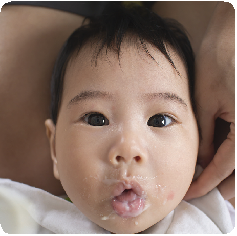

SHUTTERSTOCK

NOTE: Infants with developmental disabilities may retain these reflexes longer or the reflexes may be stronger or weaker than normally expected.

###### Infant Developmental and Feeding Skills

###### Gross and Fine Motor Skills

As infants mature, they gain the skills necessary to progress from eating strained complementary foods from a spoon to feeding themselves finger foods and eventually to beginning to feed themselves with a spoon. This acquisition of skills follows a sequential pattern that is similar in most infants. However, each infant is unique, and there is always a range of time in which an infant develops his or her own skills. Table 2.1 (see page 38) outlines this range of skill development. Development stages will vary with individual infants. The table shows the infant’s development and associated feeding skills.

###### D oes an Infant Want to Eat—or Simply Suck?

Healthy infants are born with the ability to suck. It is an important reflex that is carefully assessed by the infant’s doctor as part of the newborn exam by putting one gloved finger into the infant’s mouth.

A strong suck is an excellent indicator of an infant’s ability to eat effectively (a nutritive action). Parents or caregivers might notice that their infant likes to suck on something even when the infant is fully fed and satisfied (a nonnutritive action). The nonnutritive suck is normal in early development.

It is important for parents and caregivers to recognize their infants’ hunger and satiety cues so as not to overfeed them. Once satisfied, infants may suck on a pacifier—or their fingers. Nonnutritive sucking declines with increasing age, usually about age 4 to 5 years. ä See also: “Six Months and Under: Understanding the Infant’s Cues,” page 40.

Sucking on a pacifier and sucking on a breast are different actions, and pacifiers should not be used as a substitute for nursing or feeding. Pacifier

used in the neonatal period should be limited to medical situations, because it may interfere with successful breastfeeding. However, one potential benefit to use of pacifier at infant nap or sleep time is a possible decreased risk of sudden infant death syndrome (SIDS). The American Academy of Pediatrics suggests that a mother wait until her infant is breastfeeding well and her milk supply is established (usually 3 or 4 weeks after birth) before introducing a pacifier.

It is recommended that pacifier use cease by 12 months of age because there are several potential problems with the practice. Adverse effects include:

QDental issues QIncreased risk of ear infections

NOTE: It is important to discuss the use of a pacifier with the health care provider.

Sources: F. R. Hauck, O. O. Omojokun, and M. S. Siadaty, “Do Pacifiers Reduce the Risk of Sudden Infant Death Syndrome?,” Pediatrics 116, no. 5 (2005): e716–23; S. P. Shelov, ed., Caring for Your Baby and Young Child: Birth to Age 5, 6th ed., American Academy of Pediatrics (New York: Bantam Books, 2014), 62, 488–89. American Academy of Pediatrics, “Policy Statement: Breastfeeding and the Use of Human Milk,” Pediatrics 129, no. 3 (March 2012): e827–41, doi:10.1542/peds.2011-3552.

Parents and caregivers must watch carefully for signs for the diminishing of an infant’s early reflexive responses and the infant’s development of the skills needed for eating complementary foods. The parent or caregiver should watch for an increase in the following:

QGross motor skills QFine motor skills QOral skills QFeeding skills required to consume more than

human milk (e.g., complementary foods)

The concurrent development of gross motor, fine motor, and oral skills allows an infant to progress to the next level of feeding. Between 4 and 6 months of age, most infants are developing gross motor skills. As an infant develops, there is an increase in the ability to control the neck and head as well as to balance the trunk. These gross motor skills are required for the infant to sit without support.

There is also an increase in fine motor skills and the ability to use arms and hands in the self-feeding

Nutritive: Synchronous movement of lips, cheeks, tongue, and palate that results in bringing human milk/formula into the mouth.

Nonnutritive: When an infant sucks on a pacifier, finger, or fist and there is no feeding involved. The sucks usually occur in bursts, and are smaller and quicker than sucking for oral feeding. Some studies have shown that this can reduce stress in an infant and promote weight gain.

process. When gross and fine motor skills develop in conjunction with oral skills, such as the ability to transfer food from the front to the back of the tongue to swallow (see Table 2.1, page 38), the introduction of complementary foods with a spoon is appropriate.

Two other important developmental skills acquired during the self-feeding process are the palmar grasp and the pincer grasp. When these skills have developed, infants can begin to feed themselves with their hands and try finger foods.

NOTE: Refer infants who appear to have feeding problems to a health care provider for assessment.

###### Know the Infant’s Grasping Reflexes

The palmar grasp is an innate reflex, present at birth. It works like this: if an infant’s palm is touched, the infant grabs the finger touching it. At about 6 months of age, infants are able to use this grasp to push food and other objects into their palms.

SHUTTERSTOCK

The pincer grasp is the action an infant makes to hold food and other objects between the thumb and forefinger. Infants develop this reflex between 6 and 8 months of age.

SHUTTERSTOCK

###### Other Early Reflexes to Watch For

Besides basic skills for seeking food, newborns exhibit other early reflexes that parents and caregivers should be aware of. The following are examples of the innate awareness, motor skills, and the protective instinct in all of us:9

Birth to 2 months QMoro reflex. If the infant is startled by a loud noise, or the head falls backward suddenly, the reaction will be to throw out the arms and legs and extend the neck. Then the infant will pull the arms together. Loud crying may accompany the action. Different infants have different degrees of this “startle” reflex.

Q“Stepping.” The earliest example of an infant’s ability to walk happens with the parent or caregiver’s help. Hold the infant under the arms, taking care to support the head, and let the soles touch a flat surface. The infant will set one foot before the other. The reflex disappears in a month or 2, but it will return as learned voluntary behavior when the infant begins to walk later in the first year.

Birth to 5–7 months QTonic neck reflex. Also called the “fencing posture,”

this reflex occurs when the infant’s head turns to one side. The arm on that side will straighten and the opposite arm will bend, as if the infant is fencing. This posture is subtle and not always easy to see.

###### Developing Skills at the Rate That’s Right

Every infant is unique, and infants develop the skill to feed themselves at varying rates.10Although parents and caregivers may expect an infant to acquire certain feeding skills at specific ages, they must be aware that there is always a range associated with “normal development.” Parents and caregivers need to be aware of an infant’s developmental capabilities and nutritional needs when deciding the type, amount, and texture of food to feed their infant, as well as the method of feeding (e.g., using a spoon to feed, or allowing an infant to self-feed with fingers).

###### Hunger and Satiety Cues by Age

Infants use multiple cues together, or clustered cues, to convey their needs. They may bring their hands to their face, clench their hands, root, and make sucking noises. All these behaviors together help us know when an infant is hungry. A single cue alone does not necessarily indicate hunger or satiety. Table 2.2 lists cues to recognize as the infant advances to 1 year old. ä See also: Appendix A, “Infant Hunger and Satiety Cues,” page 222.

###### TABLE 2.1 – Sequence of Infant Developmental Skills

|Age|Mouth patterns|Hand and body skills|Feeding abilities|
|---|---|---|---|
|Birth–3 months|•Has tongue thrust, rooting, and gag reflex •Begins to babble |•Needs head support •Brings hands to the mouth |•Coordinates the suck-swallowbreathe action while breast- or bottle-feeding|
|4–7 months|•Transfers food from front to back of the tongue to swallow •Opens the mouth when sees spoon approaching •Begins to control the position of food in the mouth •Uses up-and-down munching movement |•Has head and neck control •Sits with support •Brings objects to the mouth •Begins to sit unaided •Tries to grasp small objects such as toys and food |•Takes in a spoonful of pureed/ strained food and swallows without choking •Drinks small amounts from cup (with spilling) held by another person •Begins to eat mashed foods •Eats from a spoon easily •Begins to feed self with his or her hands |
|8–12 months|•Uses the jaw and tongue to mash food •Uses rotary chewing (diagonal movement of the jaw as food is moved to the side or center of the mouth) |•Sits easily unaided •Easily grasps and/or brings small objects to the mouth, such as finger foods •Begins to hold a cup with two hands •Has good eye-hand-mouth coordination |•Begins to eat ground/finely chopped food and small pieces of soft food •Begins to eat less finely chopped food and small pieces of soft, cooked table food •Bites through a variety of textures •Demands to spoon-feed self |

Sources: U.S. Department of Agriculture, Baby Behavior modules, WIC Works Resource System, last modified July 21, 2016, https://wicworks.fns.usda.gov/infants/baby-behavior; K. Holt et al., eds., Bright Futures: Nutrition, 3rd ed. (Elk Grove Village, IL: American Academy of Pediatrics, 2011), 49, 223–24; World Health Organization, “Infant and Young Child Feeding,” Fact Sheet no. 342 (2009), last modified January 2016, http://who.int/mediacentre/factsheets/fs342/en/; “Starting Solid Foods,” American Academy of Pediatrics, last modified February 1, 2012, https://www.healthychildren.org/English/ages-stages/baby/feeding

-nutrition/Pages/Switching-To-Solid-Foods.aspx.

###### TABLE 2.2 – Infant Hunger and Satiety Cues

|Age|Hunger cues|Satiety cues|
|---|---|---|
|Birth–3 months|•Opens and closes mouth •Brings hands to face •Flexes arms and legs •Roots around on the chest of whoever is carrying the infant •Makes sucking noises and motions •Sucks on lips, hands, fingers, toes, toys, or clothing |•Slows or decreases sucking •Extends arms and legs •Extends/relaxes fingers •Pushes/arches away •Falls asleep •Turns head away from the nipple •Decreases rate of sucking or stops sucking when full |
|4–7 months|•Smiles, gazes at parent or caregiver, or coos during feeding to indicate wanting more •Moves head toward spoon or tries to swipe food toward mouth |•Releases the nipple •Seals lips together •May be distracted or pays attention to surroundings more •Turns head away from the food |
|8–12 months|•Reaches for spoon or food •Points to food •Gets excited when food is presented •Expresses desire for specific food with words or sounds |•Eating slows down •Clenches mouth shut •Pushes food away •Shakes head to say “no more” |

Sources: U.S. Department of Agriculture, Baby Behavior modules, WIC Works Resource System, last modified July 21, 2016, https://wicworks.fns.usda.gov/infants/baby-behavior; K. Holt et al., Bright Futures: Nutrition, 3rd ed. (Elk Grove Village, IL: American Academy of Pediatrics, 2011), 49, 223–24; “Starting Solid Foods,” American Academy of Pediatrics, last modified February 1, 2012, https://www.healthychildren.org/English/ages-stages/baby/feeding-nutrition/Pages/Switching-To-Solid-Foods

.aspx.

NOTE: Crying is a distress signal. Hunger cues occur prior to crying. Watching and responding early to cues can help prevent crying. Hungry infants might cry, but they will also exhibit hunger cues noted above. ä See also: “Six Months and Under: Understanding the Infant’s Cues,” page 40.

###### The Feeding Relationship

The feeding relationship is made up of social skills—a series of interactions and communications between a parent or caregiver and infant during feeding that influences the infant’s ability to progress in feeding skills and to consume a nutritionally

adequate diet. Through the feeding relationship,11 the infant’s health and nutritional status is promoted.

A positive feeding relationship is nurtured when the parent or caregiver does the following:

QCorrectly interprets the infant’s feeding cues and abilities, such as mouth opening and rooting

QIs attentive to the infant’s needs, such as feeding

on demand and burping at regular intervals QResponds appropriately to satisfy those needs QSits still during the feeding and lets the infant

eat at the desired pace

Feeding relationship: The social skills used between the parent or caregiver and infant that include appropriate food selection, supportive feeding techniques, appropriate caloric intake, and attention to infant cues and behavior

###### S ix Months and Under: Understanding the Infant’s Cues

Young infants will give the most basic cues. Some cues are obvious; others may be harder to pick up. Looking for cues can make it easier for parents or caregivers and infants to be calm and happy. Here are some cues that will help clarify an infant’s needs.

“I’m hungry” Q Stirring movements Q Opening mouth Q Turning head Q Seeking or rooting

“I’m really hungry” Q Stretching Q Increasing physical movement Q Moving hand to mouth or sucking on fist

“Calm me,

and then feed me” Q Making agitated

body movements Q Reddening of facial color Q Crying “I want to

be near you”

Q Staring at a parent or caregiver’s face

Q Rooting or making sucking motions Q Making feeding

sounds Q Smiling Q Relaxing the

face and body

Q Following the parent or caregiver’s voice and face

Q Raising his or her

head “I need something

to be different” Q Looking or

turning away

Q Arching his or her

back

Q Extending fingers with a still hand Q Falling asleep Q Frowning or showing a glazed look

Q Yawning

Sources: Government of Western Australia Department of Health, “Baby Feeding Cues,” Women and Newborn Health Service, Services A-Z (©State of Queensland, Queensland Health, 2012), accessed August 2016, https:// wicworks.fns.usda.gov/infants/baby-behavior; University of California Davis Human Lactation Center, “Understanding Your Baby: Infant Behavior, FitWIC Baby Behavior Study,” n.d, accessed August 2016, https://wicworks.fns.usda. gov/wicworks/Sharing_Center/CA/SelfLearningModules/ UnderstandingBabyEng.pdf.

ALL PHOTOS THIS PAGE: SHUTTERSTOCK

Nutrition during the first year of the infant’s life is important for proper growth and development of oral and motor skills that lead to social and other developmental skills. When the parents and caregivers work to understand and respond to the infant’s cues, the parent or caregiver creates a healthy feeding relationship and establishes a secure place in the family for the infant. Table 2.3, below, lists the general observations of skills developed by both infant and the parent or caregiver and family. Note that each infant is different and may achieve developmental skills earlier or later than his or her peers.

A dysfunctional feeding relationship can result in poor dietary intake and impaired growth.12Such a negative relationship is characterized by a parent or caregiver who does the following:

QConsistently misinterprets, ignores, or overrules

the infant’s feeding cues.

QRegularly forces an infant to consume additional food after he or she has become full and satisfied (e.g., urging the infant to finish the entire bottle to avoid “waste” when the infant indicates fullness).

###### TABLE 2.3 – Desired Outcomes for the Infantand the Role of the Family in the Feeding Relationship

|INFANTS|INFANTS|INFANTS|
|---|---|---|
|Educational/attitudinal|Behavioral|Health|
|•Has a sense of trust •Bonds with parents or caregivers •Enjoys eating |•Breastfeeds successfully •Bottle-feeds successfully if not breastfeeding •Consumes supplemental foods, when developmentally ready, to support appropriate growth and development |•Develops normal rooting, sucking, and swallowing reflexes •Develops fine and gross motor skills •Grows and develops at an appropriate rate •Maintains good health |

|FAMILY|FAMILY|FAMILY|
|---|---|---|
|Educational/attitudinal|Behavioral|Health|
|•Bonds with the infant •Enjoys feeding the infant •Understands the infant’s nutrition needs •Acquires a sense of competence in meeting the infant’s needs •Understands the importance of a healthy lifestyle, including healthy eating behaviors and regular physical activity, to promote shortterm and long-term health |•Meets the infant’s nutrition needs •Responds to infant’s hunger and fullness cues •Holds the infant when breastfeeding or bottle-feeding and maintains eye contact •Talks to the infant during feeding •Provides a pleasant eating environment •Uses nutrition programs and food resources if needed •Seeks help when problems occur |•Maintains good health •Adopts a healthy eating pattern as a lifelong goal •When developmentally ready, introduces nutrient-rich complementary foods to infant across all food groups, limiting sugars, fats, and sodium •Follows signals for infant hunger and satiety so infant is not underfed, leading to malnutrition, or overfed, leading to obesity •Involves infant in regular activity, helping increase gross and fine motor skills and muscle strength |

Sources: K. Holt et al., Bright Futures: Nutrition, 3rd ed. (Elk Grove Village, IL: American Academy of Pediatrics, 2011), 43; U.S. Department of Health and Human Services, U.S. Department of Agriculture, Dietary Guidelines for Americans 2015–2020, 8th ed. (Washington, DC: HHS-USDA, 2015), accessed August 2016, http://health.gov/dietaryguidelines/2015/guidelines/.

Infants whose feeding cues are not eliciting the expected response from their parents or caregivers tend to become dissatisfied and confused about their sensations of hunger and satiety (fullness). Ultimately, they may become unusually passive.

###### Help Infants Maintain a Healthy Weight

The prevalence of overweight tendencies in infants and toddlers has increased dramatically over the past three decades and can lead to childhood obesity. To prevent overfeeding their infants, parents and caregivers need to understand that infants will stop eating when they are full; and how to recognize an infant’s satiety cues.

Pay attention when he or she: QStops sucking; QTurns the head away from or spits out

the nipple;

QSeals the lips together; or QFalls asleep while feeding.

Avoid the urge to: QPush the infant to finish the bottle to

avoid waste; or

QPressure the infant to finish feeding.

Sources: R. E. Kleinman and F. R. Greer, eds., Pediatric Nutrition, 7th ed. (Elk Grove Village, IL: American Academy of Pediatrics, 2014), 805; L. K. Mahan and J. L. Raymond, Krause’s Food & the Nutrition Care Process, 14th ed. (St. Louis, MO: Elsevier, 2017), 324; American Academy of Pediatrics, “School Physical Education and Activity,” State Advocacy Focus, September 2015, https://www.aap.org/en-us/advocacy-and-policy/ state-advocacy/Documents/Obesity.pdf; S. R. Daniels, S. G. Hassink, Committee on Nutrition, “The Role of the Pediatrician in Primary Prevention of Obesity,”

Pediatrics 136, no. 1 (July 2015): e275–92; K. Holt et al., Bright Futures: Nutrition, 3rd ed. (Elk Grove Village, IL: American Academy of Pediatrics, 2011), 49.

Conversely, infants whose intake is too strictly regulated by their parents or caregivers may develop unhealthy food preferences. Evidence indicates that infants will self-regulate their energy intake when they can control how much they consume.However, when infants are not allowed some measure of selfcontrol in the feeding process, they may not learn to pay attention to their own internal cues of hunger and satiety.13This lack of attention to hunger and satiety cues has been linked to childhood obesity.

Instruct parents and caregivers to observe the hunger and satiety cues listed in Table 2.2 (see page 39), so that parents and caregivers can develop positive feeding relationships with their infants.14

Parents and caregivers should be instructed to do the following:15

Q Be sensitive to the infant’s hunger, satiety, and

food preferences.

- •Act promptly and watch for the infant cues that indicate hunger.
- •Avoid putting the infant on a rigid feeding schedule. An older infant can be offered food at around the time when he or she usually eats. But, in general, the parent or caregiver should watch for the infant to indicate hunger.
- •If an infant has certain medical conditions or is a sleepy infant who needs to be awakened to feed, specific intervals of time may be necessary.

Q Remember the infant’s developmental capabilities

and nutritional needs.

- •Thoughtfully decide the type, amount, and texture of food and the method of feeding (e.g., use a spoon for feeding; allow self-feeding with fingers). ä See also: Table 2.1, “Sequence of Infant Developmental Skills,” page 38.
- •Offer food in a positive and accepting fashion without forcing or enticing the infant to eat.
- •Do not withhold food. Infants are biologically capable of regulating their food intake to meet their needs for growth. Their diets may vary in the amount and types of foods eaten each day.

Q Help the infant have positive feeding experiences

and learn new eating skills.

- •Provide a relaxed and calm feeding environment, such as designating a specific comfortable place in the home.
- •Have patience and take time to communicate with and learn about the infant during feeding.
- •Show the infant lots of love, attention, eye contact, and cuddling in addition to feeding.
- •Avoid distractions such as use of cell phones, TV, or computers while feeding.

NOTE: Reassure parents and caregivers that being sensitive to an infant’s cues and acting on them with patience and vigilance will decrease fussiness and will not “spoil” the infant.

Family dysfunction can promote failure to thrive (FTT). Dysfunctions can include parent/caregiverinfant interactive disorders and disorders of feeding during infancy and early childhood. Cognitive limitation in a parent or caregiver has been recognized as a risk factor for FTT as well as for abuse and neglect. Maternal mental illness such as severe depression and maternal chemical dependency also represent social risk factors for FTT. All of these maternal conditions may contribute to a lack of synchrony between the infant and mother during feeding and therefore interfere with the infant’s growth process.16

If it is perceived that a parent or caregiver is exhibiting cognitive limitations, and he/she is not recognizing an infant’s feeding cues, responding to them inappropriately, or cannot feed the infant properly, the infant and parent or caregiver should be referred to resources appropriate to their situation:

QA health care provider for advice (either a physician

or nurse practitioner)

QClasses or other guidance offering help with

parenting skills

QA specialist or other services for psychosocial

evaluation

QThe Early Periodic Screening, Diagnosis, and

Treatment Program (EPSDT) for additional assessment, counseling, and follow-up services

Nutrient intake depends on the synchronization of maternal and infant behaviors involved in feeding interactions.17

###### How Developmental Delays Affect an Infant’s Feeding Skills

An infant’s development does not always match his or her chronological age. Infants may be developmentally delayed in their feeding skills for various reasons.18 Here is a sampling of factors that may influence them:

Q Medical risk factors (which may result in failure to

thrive)

- •Prematurity
- •Low birth weight
- •Multiple hospitalizations due to illness
- •Congenital anomalies, such as cleft lip or palate
- •Genetic issues, such as Down syndrome
- •Neuromuscular delay, such as cerebral palsy or muscular dystrophy

Q Psychosocial risk factors

- •Poverty
- •Abuse or neglect
- •Parent or caregiver depression
- •Substance abuse
- •Poor parenting skills

Infants affected by these medical and psychosocial risk factors may not be developmentally ready for complementary foods at similar chronological ages as healthy, full-term infants.

NOTE: A parent or caregiver of a developmentally delayed infant will need instructions on feeding techniques from the infant’s health care provider or a trained professional in feeding developmentally disabled infants.

Failure to thrive: Insufficient weight gain or insufficient rate of weight gain expected for age and gender. Inadequate caloric intake is a result of either poor parenting skills; social risk factors such as parent or caregiver mental illness; or medical conditions such as prematurity, cleft lip, or lead poisoning.

###### Endnotes

- 1 S. Marcus and S. Breton, Infant and Child Feeding and Swallowing: Occupational Therapy Assessment and Intervention (Bethesda, MD: American Occupational Therapy Association Press, 2013), 7–11.
- 2 Marcus and Breton, Infant and Child Feeding and Swallowing, 10–12; S. P. Shelov, ed., Caring for Your Baby and Young Child: Birth to Age 5, 6th ed., American Academy of Pediatrics (New York: Bantam Books, 2014), 159–62.
- 3 S. E. Morris and M. D. Klein, Pre-Feeding Skills: A Comprehensive Resource for Mealtime Development, 2nd ed. (Austin, TX: Pro-Ed, 2000), 59–92.
- 4 Shelov, Caring for Your Baby and Young Child: Birth to Age 5, 161.
- 5 Shelov, Caring for Your Baby and Young Child: Birth to Age 5, 159–60.
- 6 Shelov, Caring for Your Baby and Young Child: Birth to Age 5, 159–60; Encyclopedia of Children’s Health, s.vv. “Neonatal Reflexes,” accessed August 2016, http://www.healthofchildren.com/N-O/Neonatal-Reflexes. html.
- 7 K. Holt et al., eds. Bright Futures: Nutrition, 3rd ed. (Elk Grove Village, IL: American Academy of Pediatrics, 2011), 22; Shelov, Caring for Your Baby and Young Child: Birth to Age 5, 216, 241.
- 8 R. E. Kleinman and F. R. Greer, eds., Pediatric Nutrition, 7th ed. (Elk Grove Village, IL: American Academy of Pediatrics, 2014), 129–30.
- 9 Shelov, Caring for Your Baby and Young Child: Birth to Age 5, 161.
- 10 Shelov, Caring for Your Baby and Young Child: Birth to Age 5, 241–44.
- 11 E. Satter, How to Get Your Kid to Eat...But Not Too Much (Boulder, CO: Bull Publishing Company, E-book edition, 2012), 99–116.
- 12 Satter, How to Get Your Kid to Eat...But Not Too Much, 99–116.
- 13 “No More ‘Clean Plate Club,’” AAP (American Academy of Pediatrics), last modified November 21, 2015, https://www.healthychildren.org/English/healthy-living/nutrition/Pages/The-Clean-Plate-Club.aspx.
- 14 Holt et al., Bright Futures: Nutrition, 31–43.
- 15 N. F. Butte et al., “The Start Healthy Feeding Guidelines for Infants and Toddlers,” Journal of the American Dietetic Association 104 (2004): 442–54, doi:10.1016/j.jada.2004.01.027; Satter, How to Get Your Kid to Eat...But Not Too Much, 99–116.
- 16 P. J. Accardo and B. Y. Whitman, “Children of Mentally Retarded Parents,” American Journal of Diseases of Children 144 (1990): 69–70; R. J. Grand, J. L. Sutphen, and W. H. Dietz, Pediatric Nutrition: Theory and Practice (Boston: Butterworth-Heinneman, 1987); Holt et al., Bright Futures: Nutrition, 209–12; L. K. Mahan and J. L. Raymond, Krause’s Food & the Nutrition Care Process, 14th ed. (St. Louis, MO: Elsevier, 2017), 326. Kleinman and Greer, Pediatric Nutrition, 663–67.
- 17 Grand, Sutphen, and Dietz, Pediatric Nutrition: Theory and Practice; E. Pollitt and S. Wirtz, “MotherInfant Feeding Interaction and Weight Gain in the First Month of Life,” Journal of the American Dietetic Association 78, no. 6 (June 1981): 596–601; Kleinman and Greer, Pediatric Nutrition, 664.
- 18 Kleinman and Greer, Pediatric Nutrition, 596; A. Bernard-Bonnin, “Feeding Problems of Infants and Toddlers,” Canadian Family Physician 52, no. 10 (October 10, 2006), 1247-1251, https://www.ncbi.nlm.nih. gov/pmc/articles/PMC1783606/; “Feeding and Swallowing Disorders (Dysphagia) in Children,” ASHA (American Speech-Language-Hearing Association), https://www.asha.org/public/speech/swallowing/ Feeding-and-Swallowing-Disorders-in-Children/; “Feeding Disorders,” DDHealthInfo.org (Developmental Disabilities: Resources for Healthcare Providers), https://cme.ucsd.edu/ddhealth/courses/FEEDING%20 DISORDERS%20.html.

ALASKA WIC PROGRAM

CHAPTERe

## BREASTFEEDING

# S

cientific knowledge about the benefits of breastfeeding, not only for infants and mothers but also for families and their communities, has advanced considerably in recent years. These benefits include the positive effects breastfeeding has upon the immunological, nutritional, developmental,

###### This chapter reviews:

psychological, social, and economic status of mothers and their children, which in turn influence those around them. New evidence demonstrates both the short- and long-term effects of breastfeeding, including its protective effect upon chronic conditions.

Q The benefits of breastfeeding QFactors affecting the decision to initiate

or continue breastfeeding

QMethods for supporting breastfeeding

mothers QThe basics of breastfeeding QPractical breastfeeding techniques QPlanning for time away from the infant QWeaning the breastfed infant QContraindications to breastfeeding QCommon concerns about the use of

The American Academy of Pediatrics (AAP) states that “breastfeeding and human milk are the normative standards for infant feeding and nutrition”1 and has established exclusive breastfeeding for the first 6 months as the standard against which all alternative feeding methods must be measured with regard to growth, health, development, and all other short- and long-term outcomes for children.

cigarettes, alcohol, drugs, and certain beverages while breastfeeding

###### Breastfeeding Recommendations

The AAP Section on Breastfeeding, the American College of Obstetricians and Gynecologists, the American Academy of Family Physicians, the Academy of Breastfeeding Medicine, the World Health Organization, the United Nations Children’s Fund (UNICEF), and many other health organizations recommend exclusive breastfeeding for the first 6 months of life, except in a few cases in which breastfeeding is contraindicated.2 Exclusive breastfeeding is defined as an infant’s consumption of only human milk, with no supplementation by any other type of food or liquid (e.g., no water, juice, nonhuman milk, or foods).3 Moreover, it is recommended that breastfeeding be continued for the first year of life and after that for as long as it is mutually desired by both the mother and infant.4 However, even if a mother breastfeeds only for a limited time, doing so provides benefits for both her and her infant.

In the early 20th century, most mothers in the United

States breastfed their infants, but by the 1970s, the number had declined to 24.7 percent. Since then, the rates have continued to rise steadily.5 Among infants born in 2002, some 37.9 percent were breastfeeding at 6 months of age. This increased to 47.5 percent for infants born in 2010.By 2014, four out of five infants born that year (82.5 percent) started to breastfeed, more than half (55.3 percent) were breastfeeding at 6 months of age, and more than one-third (33.7 percent) were breastfeeding at 12 months. According to the 2018 Centers for Disease Control and Prevention (CDC) Breastfeeding Report Card, 36 States and Puerto Rico have already met the U.S. Department of Health and Human Services (HHS) Healthy People 2020 goal of 81.9 percent of mothers to initiate breastfeeding. Many other States continue to improve both in number of mothers starting to breastfeed and the duration of breastfeeding, but they are still working to meet their target goals.6

In 2011, given the importance of breastfeeding for the health and well-being of mothers and infants, HHS issued The Surgeon General’s Call to Action

to Support Breastfeeding.7 The document describes specific action steps for a society-wide approach to support mothers and infants who are breastfeeding. This approach includes the public health impact of everyone’s efforts: mothers and families, employers, health care providers including hospitals, and community settings.

###### Benefits of Breastfeeding

###### Health Benefits of Breastfeeding for the Infant

Human colostrum and human milk have been studied extensively. They are composed of a mixture of nutritive components and other bioactive factors that are easy to digest and absorb and have strong physiologic effects upon the infant. Their

composition changes over time to meet the infant’s changing nutritional needs.

The bioactive factors include immunoglobulins (IgA, IgG, IgM, and IgD), which act against viruses and bacteria; the bifidus factor that promotes development of intestinal flora (bifidobacteria); and lysozyme, which may be associated with the development and maintenance of the special intestinal flora of breastfed infants.8 These and other factors such as lactoferrin protect against a number of microorganisms that threaten the newborn.

The greater resistance to disease is especially evident in reduced hospitalization rates for severe respiratory tract infections, gastrointestinal disorders (such as diarrhea, necrotizing enterocolitis, and inflammatory bowel disease), and acute otitis

###### H ow WIC Supports and Promotes Breastfeeding

The WIC program promotes and supports breastfeeding as the best source of infant nutrition. As part of its mission to improve the health of its target audience, the WIC program has long provided breastfeeding promotion and support services for pregnant and postpartum participants. Benefits and services include the following:

QAccurate breastfeeding information through anticipatory guidance, counseling, and breastfeeding educational materials

QOne-on-one breastfeeding support from

peer counselors

QEligibility for breastfeeding mothers to participate in WIC longer than nonbreastfeeding mothers QEnhanced food package with a greater variety

and quantity of food for breastfeeding mothers

QBreast pumps and other breastfeeding aids (e.g., nipple shields, nursing supplements) to help support the initiation and continuation of breastfeeding

USDA

Source: U.S. Department of Agriculture, Food and Nutrition Service, Special Supplemental Nutrition Program for Women, Infants, andChildren (WIC): Breastfeeding Policy and Guidance (Washington, DC: USDA, 2016), accessed August 2016, http://www.fns.usda.gov/sites/default/files/wic/ WIC-Breastfeeding-Policy-and-Guidance.pdf.

Immunoglobulins: Proteins in the body that are major components of the immune response system. They perform antibody activity—for example, they protect against viruses, bacteria, and any foreign proteins in the body.

###### Lactoferrin: It is one of the main proteins found in human breast milk. It may be one of the reasons an infant can absorb the iron in human milk.

media among infants who exclusively breastfeed for at least 4 months compared with infants who do not exclusively breastfeed.9 A meta-analysis of 33 studies concluded that among generally healthy infants in developed nations, more than a tripling in severe respiratory tract illnesses resulting in hospitalizations was observed for infants who were not breastfed compared with those who were exclusively breastfed for 4 months.10 This benefit increased significantly in some infectious diseases (e.g., pneumonia and otitis media) for infants who breastfed for more than 6 months. In addition, partial breastfeeding for up to 1 year may reduce the prevalence of and subsequent morbidity due to respiratory illness and infection in infancy.11

Also, breastfeeding is associated with protection against several diseases as noted below:

possibly because breastfeeding guards against long-term obesity.18 In addition, the long-chain polyunsaturated fatty acids (LCPUFAs) in human milk may help develop skeletal muscle membrane. This protects against insulin resistance and ß-cell failure, which lead to type 2 diabetes. Without this protection, formula-fed infants have higher concentrations of insulin and increased diabetes risk.19

QLeukemia. The duration of breastfeeding has been correlated with a reduction in childhood leukemia and lymphoma,20 although the mechanism by which this association operates has yet to be understood.

QSudden infant death syndrome (SIDS). Breastfeeding has been shown to be protective against SIDS, and its effect is stronger when breastfeeding is exclusive.21

QAcute, chronic infections. Research has shown that exclusive breastfeeding contributes to protection against infections during infancy (e.g., ear infections, lower respiratory infections and gastrointestinal infections) and diminishes the frequency and severity of infectious episodes, such as those resulting from bacterial meningitis, bacteremia, and urinary tract infection.12 Partial breastfeeding, however, may not have this protective effect.

QAllergic disease. Breastfeeding for 3 to 4 months has been associated with a reduction in the incidence of asthma, atopic dermatitis, and eczema, and this protection is extended to childhood.13 The longer the mother breastfeeds, the better her infant is protected against asthma, even if the mother herself suffers asthma.14

QObesity. Breastfeeding may help protect a child from obesity through adolescence and adulthood.15 The process in which breastfeeding protects against obesity is still being investigated, however it may be related to a mechanism that helps infants fed at the breast self-regulate milk intake.16 Also, formula has been shown to cause a greater insulin response in infants, and may lead to increased fat storage.17

QDiabetes. The incidence of type 2 diabetes is

lower in infants breastfed for at least 3 months,

###### Other Benefits for the Infant

Breastfeeding allows the mother to have skin-toskin contact with her infant, which is important for making the infant feel secure and loved, and for promoting bonding between mother and infant. In addition, breastfeeding has been reported to provide an analgesic effect for infants during painful procedures.22

Ideally, the first skin-to-skin contact will take place moments after delivery, when the infant is placed on the mother’s abdomen or chest, with bare skin against bare skin. This is the first opportunity for mother and infant to bond and for the infant to feel warm, comfortable, and nurtured. A mother’s oxytocin levels are elevated between 15 and 45 minutes after she gives birth. Because the high levels are associated with positive maternal feelings and increased bonding, it is recommended that mothers take advantage of this period for skinto-skin contact.23 Skin-to-skin contact is also an infant’s introduction to the mother’s breasts and to connecting their sight, smell, and feel with satisfying hunger.24 When the infant suckles the mother’s nipple, the stimulation releases oxytocin, which in turn causes the milk let-down reflex. ä See also: “Role of the Brain,” pages 54–55. Suckling also

Milk let-down reflex: Also called milk ejection reflex. The mother’s milk is ready to flow. Signs are tingling in the breast or milk dripping from the nipple.

releases prolactin, which is responsible for milk production.Oxytocin can also be released when a mother sees, hears, smells, touches, or thinks about her infant, so skin-to-skin contact may contribute to the mother’s oxytocin level.25

Research shows that infants who attach within the first hour breastfeed more successfully and for a longer period of time than those who do not attach and feed for 2 hours or more after delivery. Early breastfeeders are also more likely to still be breastfeeding at 2 to 4 months of age.26

###### Health Benefits for the Mother

By breastfeeding, the new mother will not only provide her infant with the best nutrition, but also experience many benefits for herself.

###### Immediate Benefits

Benefits to a breastfeeding mother are both immediate and long term, including the following short-term examples:

QMothers who breastfeed their infants soon after birth experience milk let-down reflex, which helps to start the process of establishing a mother’s future milk supply.27 Breastfeeding will stimulate a mother’s postpartum uterine contractions and she will lose less blood because the infant’s sucking causes the uterus to contract. In many mothers, exclusive breastfeeding delays the resumption of normal ovarian cycles and the return to fertility. This process is known as lactational amenorrhea. Optimal intervals between births allow the mother’s body to replenish its stores of iron and to correct anemia. This recovery helps with future pregnancies.28

QBreastfeeding triggers the release of the hormone oxytocin. The hormone oxytocin also promotes nurturing and relaxation and may act as a buffer against the effects of stress.29

###### Long-Term Benefits

Many recent studies suggest that breastfeeding may help protect against a number of diseases in the mother.

QType 2 diabetes. A longer duration of breastfeeding is associated with a reduced incidence of type 2 diabetes. Two large cohort studies of women in the United States have concluded that breastfeeding may reduce the risk of type 2 diabetes in young and middle-aged women by improving glucose homeostasis.30

QCancer. Breastfeeding has been associated with a decreased risk of both breast and ovarian cancers. Also, the anovulation associated with lactation may protect against ovarian cancer.31

QHypertension. Increased duration of breastfeeding may have long-term positive influences reducing the prevalence of high blood pressure.32

###### Social and Economic Benefits of Breastfeeding

All research points to the fact that a mother who breastfeeds sets the stage for a healthier child. At the same time, she benefits society.

Statistics show that breastfed infants require fewer visits to the doctor for illness, fewer prescriptions, and fewer hospitalizations. A 2016 study published by the Lancet Breastfeeding Group estimates that if 90 percent of U.S. families followed guidelines to breastfeed exclusively for 6 months or continued breastfeeding for 1 to 2 years, the United States would annually save some $2.45 billion in reduced medical and other costs. In addition, the death rate for breastfed infants plummets dramatically: research has shown that if 90 percent of mothers breastfed exclusively for 6 months, nearly 1,000 infant deaths could be avoided each year.33

Because their infants are healthier, breastfeeding mothers who work may be less likely to take sick days to care for an infant who is ill. Therefore, breastfeeding not only supports the Nation’s workforce, but also may lower employers’ medical costs.

Anovulation: Failure of the ovaries to release ova, the female reproductive cells, over a time period of more than 3 months

###### WIC Breastfeeding Support

WIC Breastfeeding Support: Learn Together. Grow Together is a social marketing campaign from USDA. The goal of the campaign is to equip WIC moms with the information, resources and support they need to successfully breastfeed, as much as they can for as long as they can – ideally 6 months exclusively.

Launched in 2018, it is a rebrand of the 1997 Loving Support© Makes Breastfeeding Work campaign and is based on a strong foundation of research. The brand WIC Breastfeeding Support highlights what WIC offers (i.e., in-person support through counseling and breastfeeding classes, access to trained peer counselors and designated breastfeeding experts), while leveraging the familiarity, equity, and credibility of the program. The brand aims to deliver on the promise that breastfeeding gets easier, while the tagline, Learn Together. Grow Together speaks to the breastfeeding journey, acknowledging that it is a wonderful, emotional experience, but it takes mom and baby time to find success.

New campaign resources include an updated robust website, posters, educational materials, videos, social media products, and a buddy program. The website: https://wicbreastfeeding.fns.usda.gov provides moms with information based on where they are on their breastfeeding journey, whether it’s learning to breastfeed, starting to breastfeeding, facing challenges, or thriving with breastfeeding. All of the campaign resources are offered through WIC clinics and are available online so they are easily accessible and convenient. Moms can find information on breastfeeding basics, latches and holds, common challenges, going back to work, breastfeeding in public, expressing milk, and more.

WIC partners and staff can access resources to download, print, and share with moms to help support them in their breastfeeding journey. Family and friends will find resources, including videos from real dads and grandparents, to learn more about breastfeeding and how they can support mom and baby on their breastfeeding journey.

###### Factors Affecting the Decision to Initiate or Continue Breastfeeding

Mothers typically know that breastfeeding is the best way to feed their infants. However, several factors have been identified as having a significant impact on a mother’s decision to initiate or continue breastfeeding:

QA mother’s support network, which may include

fathers/partners, family members, and/or friends QThe attitudes of health care providers QHospital practices, such as providing infant

formula to newborns

QA mother’s personal experience with prior

breastfeeding

QA mother’s workplace environment

Some mothers are challenged with combining breastfeeding and other competing demands and so may focus on the barriers to breastfeeding rather than the benefits. Exploring both the barriers and benefits is an effective way to counsel a new mother about breastfeeding.

Recent data collected from a nationally representative sample of participants in WIC who joined WIC either before their infants were born or before the infants were 3 months old show that overall views regarding breastfeeding have shifted to be more positive in the last 20 years.34 Notably, there has been an increase in mothers affirming the benefits of breastfeeding, such as that breastfed babies are healthier and that breastfeeding protects the child from diseases, brings a mother closer to her child, and helps women lose weight. Also, the perception of barriers, such as the belief that breastfeeding ties a mother down and takes too much time, has decreased. However, many

women still report that breastfeeding is painful and that they feel uncomfortable with breastfeeding in public.

###### Methods to Support Breastfeeding Mothers in Your Program

Appropriate and accurate education, encouragement, and support can help women breastfeed successfully. It is important for WIC staff to become familiar with the methods that support breastfeeding mothers and to make the clinic or program site breastfeedingfriendly and accessible to them.

QMake a place or room available for mothers to breastfeed their infants when visiting a clinic or program site.

QOffer all breastfeeding mothers a list of professional and peer resources (e.g., WIC clinic breastfeeding coordinators, WIC peer counselors, public health nurses, breastfeeding mothers group, etc.) to contact for ongoing encouragement, information, breast pumps, and assistance.

QDisplay culturally appropriate posters and materials on breastfeeding at the clinic or program site. (Do not display infant formula and materials with infant formula brand names and logos.)

QDemonstrate positive attitudes toward breastfeeding and deliver positive and supportive messages about breastfeeding.

QProvide education about the benefits of breastfeeding to individuals and groups. Use printed materials and audiovisuals that portray breastfeeding as the preferred infant feeding choice and are appropriate to participants’ cultural and ethnic background, language, and reading level.

QEncourage the mother’s family and friends to participate in breastfeeding education and support sessions.

QCoordinate breastfeeding support with other health

care programs in the community.

QEncourage hospital practices that support

breastfeeding.

QEnsure that peer counselors and/or staff are available to provide regular and ongoing counseling and support services to breastfeeding women.

The WIC Nutrition Services Standards35 (WIC NSS) are intended to assist State and local agencies in their continual efforts to improve the services they provide by focusing on core elements that are essential to providing high-quality nutrition services. Core elements include breastfeeding education and promotion and support, including peer counseling activities.

The WIC NSS describes elements of staff training, clinic environment, coordinated efforts, program evaluation, breastfeeding education and support, and food packages for breastfed infants and breastfeeding women in a guide available at

https://wicworks.fns.usda.gov/resources/ wic-nutrition-services-standards

###### The Basics of Breastfeeding

###### Characteristics of Human Milk

Human milk is unique in its physical structure and types and concentrations of protein, fat, carbohydrates, vitamins and minerals, enzymes, hormones, growth factors, host resistance factors, inducers and modulators of the immune system, and anti-inflammatory agents. Because it is the best source of nutrition required for the first 6 months of an infant’s life, its nutrient content has been used by the National Academy of Medicine’s Food and Nutrition Board to establish adequate intakes (AIs).36 Human milk composition changes during a feeding, throughout the day, and over time to meet each infant’s nutritional needs.

###### Infant’s First Milk

The first milk that is produced by the breast for an infant right after birth is thick, yellow-colored fluid called colostrum. The yellow color results from colostrum’s high concentration of beta-carotene (vitamin A precursor). Although colostrum is

produced in limited quantity, it is rich in nutrients and substances the infant needs in the initial days following birth. It offers nutrition high in protein and low in fat that is easily digested by the newborn infant. It also provides antibodies, primarily secretory immunoglobulin A (SIgA), which protect the infant’s immune system by identifying and destroying foreign objects such as bacteria and viruses.

Mothers should not express any colostrum from their breasts before their infant’s birth because the pumping of the breasts may stimulate uterine contractions, risking premature delivery.37

Over the first 2 to 3 weeks after birth, the colostrum is gradually replaced by mature human milk. The intermediate or transitional milk is produced from about day 2 to day 5 postpartum to 2 weeks postpartum. During the transition to mature milk, concentrations of fat, lactose, water-soluble vitamins, and total calories increase in the milk, while those of protein, immunoglobulins, fat-soluble vitamins, and minerals decrease.

###### Mature Milk

Colostrum changes into mature milk by the 15th day after birth to fit the infant’s growth needs. This milk looks thinner than colostrum, but it has just the right amount of nutrients such as protein, fat, sugar, water, and bioactive factors for the infant’s healthy growth.38 ä See also: “Health Benefits of Breastfeeding for the Infant,” pages 48–49.

###### Making a Good Milk Supply

For most new breastfeeding mothers, making enough milk is their most important concern. The main reasons women wean their infants from the breast in the first 6 months of life is their perception that they are not making enough milk and that their infant is not getting enough. Making milk for one’s infant is a natural, integrated process, with the mother’s breasts, her brain, and the infant all playing a role in keeping the milk supply ample and flowing. Nearly all mothers can breastfeed successfully with the proper support and direction. The amount of milk a mother produces in the first 2

or 3 weeks naturally fluctuates. During this time it is key to establish good techniques, address problems and challenges to successfully carry out exclusive breastfeeding. Feeding a newborn frequently will stimulate milk production and increases the mother’s supply.39 ä See also: “Factors That May Increase and Decrease Milk Supply,” page 62; and “Planning Time Away From the Infant,” pages 73–– 74.

###### FIGURE 3.1 –How the Breast Makes Milk

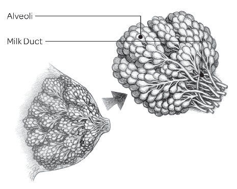

Source: Reproduced with permission from Amy Spangler, Breastfeeding: A Parent’s Guide, 9th ed. (Atlanta: baby gooroo, 2010), 15.

###### Role of the Breasts

During pregnancy, the breasts undergo physiological and anatomical changes that enable them to produce milk for an infant. Different parts of the breast have different functions in making and transporting milk to the mother’s nipple. Milk production occurs within the alveoli, which are grape-like clusters of cells located deep within the breast. Once the milk is produced, it is squeezed out through the alveoli into the milk ducts—which resemble highways—and is transported through the breast (see figure 3.1, above). The milk is released through openings in the nipple that many mothers cannot see until lactation begins.

###### Assessing the Breastfeeding Dyad

Refer breastfeeding mothers who request infant formula to a nutritionist for nutrition assessment and counseling.

Staff should assess and listen to the mother to determine the reason she is requesting formula and ensure that the mother receives support from WIC staff with breastfeeding training, a peer counselor, a WIC designated breastfeeding expert, or other health care professional who can adequately address the mother’s concerns and help her to continue to breastfeed. ä See also: “Planning Time Away From the Infant,” pages 73–74.

When WIC staff receive a request for formula from a breastfeeding mother, an assessment should be done to support the mother’s breastfeeding plan. The assessment should probe for the reason for the formula request, exploring what breastfeeding concerns may exist, among other points. If formula is issued, amounts should be tailored to meet but not exceed the infant’s nutritional needs.

Key points to discuss during the assessment include, but are not limited to, the following:

QWIC food packages available for breastfeeding

women and their infants.

QWIC breastfeeding counselors and experts available to help the mother with breastfeeding questions and concerns.

QThe infant’s weight and growth. Encourage mothers to follow up with the infant’s pediatrician to monitor for appropriate weight gain, especially in the early days/weeks after birth.

QNumber of wet diapers and bowel movements,

and color and texture of movements. QThe infant’s sleeping patterns. QBreastfeeding concerns, such as positioning;

discomfort signs; feeding frequency and duration of feedings; and changes in breasts before and after a feeding.

QFeeding cues and normal behavioral patterns. Care must be exercised to ensure that providing infant formula does not interfere with or undermine the breastfeeding mother’s desire to maintain lactation. It is also important to convey to mothers that sometimes it may be possible to resume exclusive breastfeeding even after using supplemental formula and that WIC is available to provide support and counseling to help her achieve her goals.

For more information, refer to the USDA

Breastfeeding Policy and Guidance document at https://wicworks.fns.usda.gov/resources/wicbreastfeeding-policy-and-guidance.

Fatty tissue is woven throughout the breast tissue. Fat helps determine the size of a woman’s breasts, not how they function in the breastfeeding process. Women with small breasts produce the same quantity and quality of milk as those with larger breasts. No matter their initial size, a woman’s breasts should increase in size from pre-pregnancy to after delivery; typically, they double or triple in weight by the time a woman is near term.

###### Role of the Brain

When the infant suckles, important nerve endings

inside the mother’s breast send a message to her brain. The brain then signals the pituitary gland to release two important hormones: prolactin causes the alveoli to begin making milk, and oxytocin causes the muscles around the alveoli cells to contract and squeeze the milk out through the ducts. The release of milk is called a “milk let-down reflex,” also known as a “milk ejection reflex.” Being relaxed helps oxytocin release milk, so the more relaxed and comfortable a mother is, the greater her let-down is, and the more milk her infant will receive. ä See also: Figure 3.2, “How Mothers Make Milk: The Role of the Brain,” page 55.

Dyad: The mother and infant unit

Signs of the milk let-down reflex include the following: QTingling, fullness, dull ache, or tightening in the

breasts. (Some mothers, however, do not feel any of these sensations.)

QMilk dripping or spurting from the breast that is

not being suckled during breastfeeding.

QUterine cramping after the infant is put to the

breast during the first few days postpartum.

In the early postpartum period, the milk let-down reflex is primarily triggered by the infant suckling on the breast. After breastfeeding is well established, the milk let-down reflex can occur due to a variety of other stimuli that the mother associates with the breastfeeding process, for example, when a mother hears her infant cry, sees or thinks of her infant, or at the usual time of day her infant is breastfed even if the infant is not around. The milk let-down reflex is sensitive to a woman’s psychological state and other factors. For example, the milk let-down reflex may be inhibited if a woman is experiencing stress, fatigue, embarrassment, or pain.

###### FIGURE 3.2 –How Mothers Make Milk: The Role of the Brain

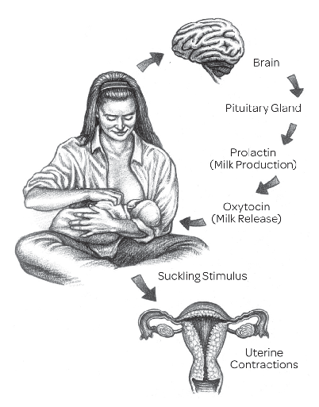

Source: Reproduced with permission from Amy Spangler, Breastfeeding: A Parent’s Guide, 9th ed. (Atlanta: baby gooroo, 2010), 15

There are many methods to encourage the milk let-down reflex:40

QRelaxation exercises QWarm compresses before breastfeeding

(e.g., a warm washcloth on the breast) QBreast massage QManual expression of a little milk QBreastfeeding in a calm setting without

distractions

QBreastfeeding while lying down

If a woman is concerned that her milk is not letting down, she should be referred to a WIC-designated breastfeeding expert for proper assessment, counseling, and follow-up services.

###### Role of the Infant

The infant also plays an important role in milk production through suckling at the breast and removing milk. When the infant is latched on correctly so that he or she has the nipple and most of the areola in his or her mouth, the special nerve endings that signal the brain to release milkproducing hormones are stimulated.

ä See also: “Frequency and Duration,” pages 60–61. The infant also helps by removing milk. The more milk the infant removes, the more milk the mother will make. Length of time at the breast is not an indicator that the infant is removing milk. Some infants are efficient at removing milk quickly, while others take longer or are latched on incorrectly so that they are removing very little milk. If the infant cannot breastfeed at the breast, the milk needs to be removed with a breast pump or through hand expression so the mother can establish a good milk supply.

###### Making a Good Milk Supply—Naturally

The first 1 to 2 months of effective nursing or pumping are important for establishing a good milk supply. Frequent breastfeeding or milk removal (8 to 12 times every 24 hours) helps mothers make a good milk supply.

###### Practical Breastfeeding Techniques and Tips

This section reviews basic information and techniques that can help mothers have a successful breastfeeding experience. Once a mother knows what to expect and how to handle common concerns in advance, she can better prevent and cope with most breastfeeding problems that might occur.

###### Comfort During Breastfeeding

Breastfeeding is easier and more enjoyable when the mother and infant are able to breastfeed in a relaxed setting. Encourage mothers to find a comfortable place. Special equipment is not necessary, but pillows and a footstool may help the mother get into a comfortable position and bring her infant closer to her breasts. In the early weeks postpartum, a mother may be more comfortable during breastfeeding if she has privacy and can relax with her infant. During this period, mothers should be encouraged to take time to interact with and learn about their infants.

###### Strategies for Breastfeeding in Public41

Although some mothers will express discomfort about breastfeeding in public, it is important for WIC staff to confirm that breastfeeding is both a vital and appropriate action, and that support exists for mothers to breastfeed in public. Encourage mothers to be proud that they are providing the best possible nutrition for her infants through breastfeeding.

To guide a parent or caregiver in building confidence and effectively feeding an infant in public, the following advice may be shared:

QIdentify clothes that give coverage and allow easy access to the breasts, such as button-down shirts or pull up loose-fitting tops. Mothers can also wear a tank top under the shirt so the stomach won’t show.

QA blanket or scarf may be draped around the

shoulders and infant during feeding.

QWhile traveling, a sling or other soft carrier helps comfort and keep the infant close to the breast during feeding.

QMore establishments now have designated areas for mothers who are looking for a private setting to breastfeed. Department stores, malls, and even baseball stadiums often have breastfeeding rooms. If there isn’t a special room, find a private or quiet space.

QKnow the infant’s hunger cues so that feeding

takes place before the infant is fussy.

QSome mothers may find it hard to breastfeed in public. Recommend them to practice breastfeeding in front of others or using a mirror, or practice in front of friends who are also new moms.

QIt is important to support their choice to breastfeed and to instill confidence in them. They should consult their WIC peer counselor or nutritionist with questions and concerns and for ongoing support.

###### State Laws That Protect Breastfeeding Mothers

A majority of States and the District of Columbia have specific laws that permit a mother to breastfeed her child in any public or private location. Visit http://www.ncsl.org/research/ health/breastfeeding-State-laws.aspx for a list of States and their specific laws.

###### Feeding Positions42

There is no one “right” breastfeeding position for every situation. No single position can meet the needs of every infant or mother all the time.Many women like to try different positions. However, the way a mother holds her infant and the position of the infant on the breast can influence successful breastfeeding. Incorrect positioning can make it difficult for an infant to suckle properly on the breast, which results in inadequate milk consumption by the infant and leads to sore nipples for the mother.

There are several commonly used positions that allow an infant and mother to breastfeed comfortably. See them illustrated below. To help a mother learn feeding positions, the WIC staff should try demonstrating them using a doll. Regardless of the feeding position, a mother should be comfortable. The infant should be positioned so that the head, shoulders, and hips are in alignment and the infant faces the mother’s body.As the infant grows, the “right” position can be anything the mother feels works for her as long as the infant gets milk and the mother is comfortable. No matter which position is used, it is important to avoid pushing on the back of the infant’s head because doing so may cause the infant to arch away from the breast.

###### Position 1: Lying Down or Side-Lying

In this position (below), the mother lies on her side with pillows under her head and behind her back, as needed. The infant lies on his or her side facing the mother with his or her chest to the mother’s chest and with his or her mouth level with the nipple. This position is recommended for a mother who has had a cesarean birth because it allows her to breastfeed without putting pressure on her incision. Special care should be taken not to surround the infant with loose clothing or bedding. If the mother is drowsy she should take precautions to prevent the infant’s entrapment or suffocation.

SHUTTERSTOCK

Position 1

USDA

Position 2

###### Position 2: Across the Lap or Cradle Hold

In this position (above), the mother sits upright in a chair or couch with her back supported while holding her infant securely. The mother’s same-sided arm supports the infant at the breast on which the infant is nursing, with the infant’s chest facing the mother’s chest. The infant’s head is cradled near the mother’s elbow, while the arm supports the infant along the back. It is easier for the mother to support her infant up to the level of her nipples if she places one or more pillows under her arm that support the infant. Alternatively, she could cross her legs and bring the infant up to nipple level with her raised leg. To prevent straining her back, the mother should avoid leaning down to the infant and instead bring the infant to her. This position may be useful for the infant who has difficulty latching on because the mother can easily guide the infant’s mouth to the breast.

###### Position 3: Cross-Cradle Hold

This hold (next page) uses nearly the same positioning as the cradle hold, but it supports the infant on the arm opposite the breast being used. The infant’s head is then supported at the base of the neck by the palm of the mother’s hand. The infant’s bottom rests in the crook of the arm. The mother rotates the infant’s body so that the infant’s mouth is lined up with her nipple. The infant can be

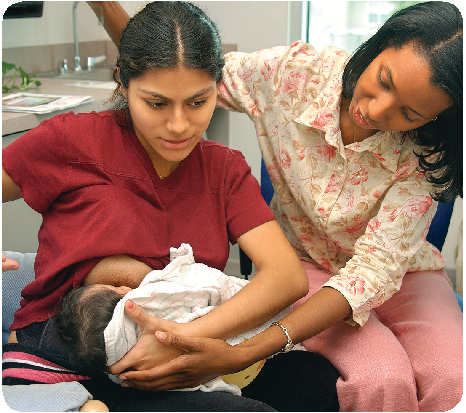

COURTESY OF TEXAS WIC PROGRAM

Position 3

supported on the mother’s lap to help raise the head to nipple level. A mother may also use pillows to support both elbows so they don’t grow tired before the end of the feeding. This hold offers extra head support and may help an infant remain latched. For this reason, premature infants or those with a weak suck often benefit from it.

COURTESY OF TEXAS WIC PROGRAM

- Position 3

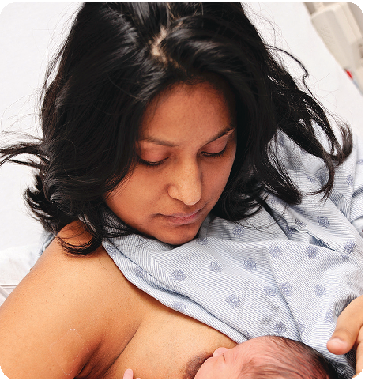

- Position 4

###### Position 4: Football Hold or Clutch Hold

In this position (above), the infant’s torso is held on the side of the mother’s body with the infant’s

feet and body tucked under the mother’s arm. The mother’s forearm supports the infant’s back and head. The infant’s head is facing the mother’s nipple and is supported by the mother’s hand. It is best for the mother to avoid leaning down toward the infant (this could strain her back) or pushing his or her head into her breast.

###### Position 5: Laid-Back Hold

As soon as possible after the infant is born, a mother can prop herself up, or be helped, to lie in a slightly reclining position (below). The infant then lies on top of the mother, with full skin-to-skin contact and with the infant’s face near the mother’s breasts. The mother can use a blanket or towel for warmth as needed. Gravity holds the infant to the mother so that the mother can stroke and touch the infant freely. Gradually the infant will find the nipple, latch, and begin to suck. This method can be carried out in the coming weeks as well, as long as it is comfortable for the mother and the infant’s needs are satisfied.

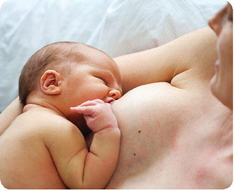

COURTESY OF TEXAS WIC PROGRAM

Position 5

###### Attachment (Latch-On)

Before positioning the infant to start breastfeeding, it is advisable for mothers to wash their hands with soap and water. It is recommended that mothers support the breast while breastfeeding by using the C-hold or palmar grasp. This hand position involves placing only the thumb on the top of the breast well behind the areola, with the other four fingers on the bottom of the breast to lift and support it. With the breast well supported,

the nipple and breast can be easily directed into the infant’s mouth. It is especially helpful for the mother to support the breast in this manner while breastfeeding the young infant.

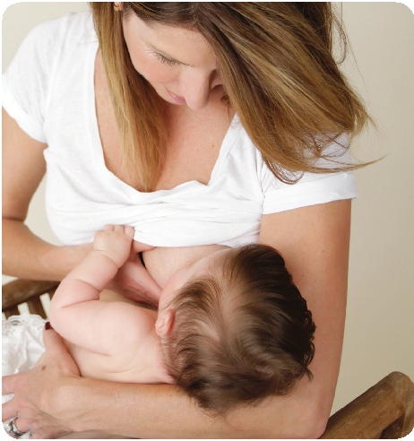

SHUTTERSTOCK

###### How to Initiate Breastfeeding

A mother can initiate breastfeeding by aiming the infant’s mouth so that his or her chin is touching the mother’s breast and the nose is aimed toward the top of the mother’s nipple. Next, she should stroke the lower lip of the infant with the nipple of the breast she is holding, which will cause the infant

to respond by opening his or her mouth, ready to accept the nipple. When the mouth is wide open and the infant’s tongue is down on the floor of the mouth, the mother should move the infant quickly onto the breast. It is important to make sure that the infant has both the nipple and a large part of the areola in his or her mouth with his or her lips sealed around the areola. When the infant suckles in this position, the infant’s gums press against the base of the areola, causing the milk to eject into the mouth.

When attached properly, the infant’s nose should be touching the skin of the breast. (The infant’s nose is designed to permit breathing during breastfeeding.) The infant’s lips should be flanged out (curved outward) and relaxed with neither the upper or lower lip curled inward (see figure 3.3 on this page).

In order to take in adequate milk, an infant needs to suckle more than the nipple. The infant’s mouth needs to rhythmically compress the milk-containing ducts located under the mother’s areola both to draw the milk out and to provide the stimulation needed to bring on the milk let-down reflex. An infant’s attempts to breastfeed when attached only to the nipple may result in the mother’s inadequate milk production and also nipple soreness.

If the infant is not attached correctly the first time, a mother may need to repeat the attachment procedure until her infant is latched on properly. The mother should be reassured that sometimes

###### FIGURE 3.3 – Latching On Correctly

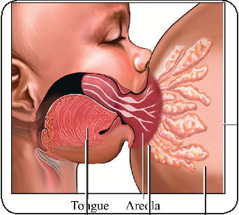

DIOMEDIA/MEDICAL IMAGES/KEITH A. PAVLIK

Tongue Areola Milk glands

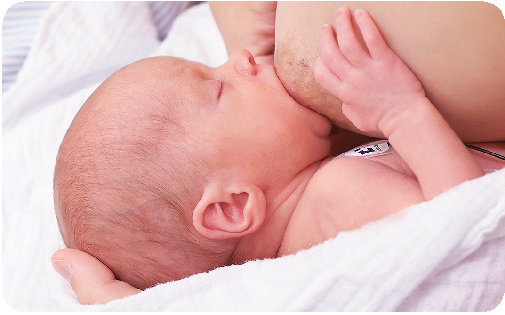

© 2017 MEDELA INC.

she may have to try several times to get a good latch-on. If a mother experiences any discomfort or tenderness during latch-on in the early weeks of breastfeeding, it should subside after the first 30 seconds to one minute if the infant is properly attached to the breast. If the mother still continues to feel discomfort, the infant should be repositioned on the breast. If the discomfort continues, refer the mother to a breastfeeding expert to discuss the best approach.

It is vital that mothers be prepared in advance to nurse properly. Before the infant’s arrival, the WIC staff should provide all pregnant women with anticipatory guidance so women are informed about resources available to them.

###### Coming Off the Breast

Some infants will automatically come off the breast when they are finished breastfeeding. At the end of a feed, the infant will slow or stop suckling, and his or her fists will relax. Some infants fall asleep. A mother can either wait until the infant stops suckling and comes off the breast naturally, or she may break the suction between the mouth and breast by slipping a finger down into the corner of the infant’s mouth along the gums until the release can be felt or heard. If a mother pulls her infant off without breaking the suction first, she could hurt her nipple.

###### Characteristics of Feedings

###### Feeding Cues

Breastfed infants should be fed when they show signs of hunger. Crying is not a cue, but rather a distress signal. Cues occur prior to crying. Watching and responding early to cues can help prevent crying. Hungry babies might cry, but they will also exhibit hunger cues. ä See also: Chapter 2, “Six Months and Under: Understanding the Infant’s Cues,” page 40. Mothers should be encouraged to understand the infant’s early feeding cues and begin feeding when the infant shows any of the following signs:

QRoots (opens mouth and turns toward mother’s

breast)

QBrings hands to face

QFlexes arm and legs QMakes sucking noises and motions QSucks on lips, hands, fingers, toes, toys, or

clothing QFusses or makes pre-cry facial grimaces QSmiles, gazes at mother, or coos during feeding to

indicate wanting more

Healthy, full-term infants express signs of hunger and satiety, learn trust, and feel secure when their mothers respond to these cues. Thus, putting healthy, exclusively breastfed infants on a strict feeding schedule is not recommended. Remind mothers that it is normal for infants to have fussy times and cry when they are not hungry. They may cry because they need a diaper change, want to be held, or need something to be different. ä See also: Chapter 2, “Does an Infant Want to Eat

—or Simply Suck?,” page 36.

###### Frequency and Duration

Frequent breastfeeding helps to maintain and increase a mother’s milk supply. Encourage mothers to feed on demand by watching their infants for signs indicating hunger and putting them to the breast when those signs are apparent. A newborn infant should go no longer than 2 to 3 hours during the day or 4 hours at night without breastfeeding. If a newborn sleeps longer than 4 hours at night, the infant should be awakened for a feeding. As an infant grows older, the amount of time between feedings will increase. Each infant establishes a feeding pattern. Some infants breastfeed for shorter periods at more frequent intervals, while others may feed for longer periods and less often. After a usual pattern of breastfeeding is established, an infant may suddenly demand to be fed more frequently—for example, during appetite spurts (resulting from growth spurts) or when teething. Also, the longer an infant sleeps at night, the more frequently the infant may demand to be fed during the day.

Daily breastfeeding patterns will vary from infant to infant, and an individual infant’s breastfeeding pattern may change from day to day while the infant grows.43 Just as a mother should learn her infant’s cues for feeding on demand, she should likewise

learn the satiety cues that determine the length of each feeding: for example, the infant comes off the breast spontaneously, falls asleep, or pushes away. An infant’s feeding period should not be restricted by time, but should be as long as indicated by the infant. ä See also: Chapter 2, “The Feeding Relationship,” pages 39–43.

If a newborn is breastfeeding and is not gaining weight properly, WIC staff should refer the mother to her pediatrician and a WIC-designated breastfeeding expert.

###### Waking Sleepy or Placid Infants To Feed

An exception to using the on-demand feeding approach is to waken and feed an infant who is lethargic, sluggish or drowsy. Infants who display these characteristics are primarily newborns recently discharged from the hospital. Breastfed infants who fail to “act hungry” may not gain weight adequately because they are not fed often enough and may not consume enough while they are at the breast. Remind mothers and caregivers to check up with the pediatrician within the first three to seven days of birth.44

To wake a sleepy infant, a mother can try these methods:

QStroking the infant’s cheek with the nipple QRubbing or stroking the infant’s hands and feet QUnwrapping or loosening blankets QGiving the infant a gentle massage QUndressing the infant or changing his or

her clothing or diaper

QPlaying with and talking to the infant

NOTE: If the newborn is increasingly unresponsive and hard to arouse, the parent or caregiver should seek medical help immediately.

###### Normal Breast Fullness and the Feeding Process

It is normal for a mother of a newborn to experience her breasts becoming larger, heavier, and more tender a few days after birth. This normal postpartum

fullness is caused by an increased volume of milk and blood flow to the breasts, as well as temporary swelling of the breast tissue. Breastfeeding 8 to 12 times every 24 hours (about every 1½ to 3 hours) during the first few weeks after birth removes the colostrum and incoming milk so that painful engorgement will not develop. Engorgement hampers the infant’s ability to latch on and breastfeed and may lead to the infant’s poor weight gain. Normal breast fullness usually decreases within the first 2 or

- 3 weeks after birth if the infant breastfeeds frequently and without restriction after birth.45 ä See also: “Engorgement,” pages 68–69.

When the infant stops suckling, the mother should gently remove the infant from the breast, burp the infant, and switch the infant to the other breast. Breastfed infants ingest less air during feeding than do bottle-fed infants. During the infant’s first

- 4 months, the average exclusively breastfed infant feeds between 10 and 20 minutes per breast for a total period of 20 to 40 minutes. Some infants are very efficient and will spend less time at the breast; others are slower and tend to spend more time. Limiting breastfeeding to specific times is not recommended.

Milk production by both breasts is stimulated by offering both at every feeding. It may be beneficial to alternate which breast is offered first if the infant does not equally stimulate both breasts. The breast is never truly “empty” because the secretory cells in the alveoli continue to produce milk, but frequent feedings at each breast will stimulate greater milk production. As the demand increases, so will the milk production.

The sucking patterns and needs of breastfeeding infants vary. While some infants’ sucking needs are met primarily during feedings, other infants may need additional sucking at the breast soon after feeding, even though they are not hungry. They may have the desire to suck for various reasons, such as when they are lonely, frightened, or in pain. This is referred to as nonnutritive sucking. ä See also: Chapter 2, “Does an Infant Want to Eator Simply Suck?,” page 36.

###### Bowel Movements of Breastfed Infants

The bowel movements of breastfed infants are different in color, consistency, and frequency than those of formula-fed infants. In the first few days after birth, all infants eliminate the meconium; this is the first stool the infant passes, which is dark greenish black and sticky. After that, the stools of an exclusively breastfed infant generally look like mustard-colored cottage cheese (although stools may be a darker brown or green color) and have a mild odor. In comparison, the stools of formula-fed infants are darker, more formed, and infrequent compared with those of breastfed infants.

###### Indicators of Whether an Infant Is Getting Enough Milk

Breastfeeding mothers cannot see how much human milk their infants are consuming, so they may ask how to determine whether the infant is taking in a sufficient amount. They should be reassured that the size and shape of the breasts do not affect the ability to produce and give milk. Then they should be guided to watch for several indicators.

An exclusively breastfed infant is probably consuming a sufficient amount of human milk if the following factors are apparent:

QThe infant gains weight consistently. Weight gain is the most important indicator of whether an infant is receiving sufficient milk and breastfeeding effectively. It’s not uncommon for an infant to lose some weight immediately after birth. However, the amount of weight loss should not exceed 8-10 percent and infants should return to their birth weight by 2 weeks of age.

QThe infant breastfeeds frequently and is satisfied

after each feeding. QThe infant wakes to feed. QThe infant can be heard swallowing consistently

while breastfeeding in a quiet room.

QThe infant has plenty of wet and soiled diapers, with pale yellow or nearly colorless urine. The urine should not be deep yellow or orange. (Infants should not being given any extra fluids besides human milk.)

###### Factors That May Increase and Decrease Milk Supply

It is always important for a mother to check with her health care provider if she is having any issues with her milk production, as many factors can cause a decrease in milk supply. She should not take any over-the-counter medications or supplements without first discussing them with her health care provider. Possible reasons for a decrease in milk:

QSmoking QDrinking alcohol QTaking certain medications, including

antihistamines, decongestants, diuretics QStress QUse of estrogens such as those in low-dose

contraceptives QDehydration QNot getting enough sleep

Tips to try for an increase in milk: QGetting plenty of sleep QBreastfeeding often and offering both breasts

at each feeding QEating a healthy diet QStimulating breast after nursing by using

breast pump or manual expression technique QMaking skin-to-skin contact with infant, which

promotes milk let-down

Source: R. A. Lawrence and R. M. Lawrence, Breastfeeding: A Guide for the Medical Profession, 8th ed. (Philadelphia: Elsevier, 2016) 285–87, 351–52, 388, 391–92.

Breastfeeding mothers also have their own physiological indicators as to whether their infant is consuming an adequate amount of milk. An exclusively breastfed infant is probably consuming a sufficient amount if the mother experiences the following changes: QShe has a tingly sensation of the milk let-down

reflex during the feeding.

QHer breasts would feel less full after a feeding.

###### Counting Wet Diapers and Bowel Movements

An infant’s release of urine and bowel movements will vary from the earliest days to 6 weeks of age and after. Typical number of wet diapers and bowel movements in an infant first week could be as follows:

- QAt least 1 wet diaper in the first 24 hours, and 1 bowel movement occurs within 8 hours after birth.
- QAt least 2 wet and 3 soiled diapers by 2 days of age.

Q5 to 6 wet and 3 soiled diapers by 3 days of age. QAt least 6 wet and 3 soiled diapers per day by 4

to 7 days of age.

QA varying number of soiled diapers per day after 6 weeks of age, based on the varying number of bowel movements an infant may have per day—from fewer than one to many.

Source: U.S. Department of Health and Human Services, Office on Women’s Health, “Your Guide to Breastfeeding” (Washington, DC: HHS, 2011), 21, accessed December 2018, https://www.womenshealth.gov/files/documents/ your-guide-to-breastfeeding.pdf;

QShe feels cramping in her lower abdomen, which

indicates uterine contractions. (Some mothers feel these contractions in the early postpartum period.)46

If there is any question whether the infant is receiving adequate nourishment, it would be appropriate to assess the infant’s breastfeeding history, feeding patterns, and growth using CDC growth charts. Refer the infant to the health care provider or a WIC-designated breastfeeding expert for further assessment. ä See also: Chapter 1, “Anthropometric Data,” page 2.

###### Breast Care

Mothers can take these simple steps when caring for their breasts to minimize the development of some common feeding-related breast and nipple concerns:

QAllow nipples to air dry between feedings, and replace breast pads (washable and disposable ones) frequently, as soon as they are moist, to reduce the likelihood of bacterial or fungal growth. Expressing some milk onto the nipples at the end of a feeding and letting it dry may help sore nipples to heal.

QDo not dry the nipples with a hair dryer or heat lamp after breastfeeding. This removes the internal moisture in the skin and may cause drying and cracking, or may even burn the skin.

QAvoid using harsh soap, shampoo, detergent, or alcohol on the nipples and areolae. They remove natural lubricants and dry out skin. Soap and shampoo that drip onto nipples and areolae during a bath or shower can be rinsed off with clean water. Excessive washing or rubbing may remove the protective outer layer of cells of these areas, contributing to soreness.

QAvoid “toughening” the nipples by rubbing them with a towel or cloth or otherwise “preparing the nipples” for breastfeeding before delivery. This practice can remove natural lubricants and some of the outer cell layer from the breast and increase irritation to the nipple. Rubbing can also cause micro cuts, which could lead to infection such as mastitis.

QDo not use creams, ointments, or oils on the nipples or areolae on a routine basis to heal sore nipples, abrasions, or cracks. The Montgomery’s glands in the areola secrete oils that naturally cleanse, lubricate, and protect the nipple and the areola during breastfeeding. This process usually eliminates the need for other lubricants. ä See also: “Sore Nipples,” page 68.

49

###### Expressing Human Milk

A woman may need or want to express, or extract, some of the human milk from her breast under these circumstances:

QHer breasts are engorged. QMother and infant are separated (e.g., milk is

needed while the infant is with a with another caregiver in a day care).

QMother or infant is sick or hospitalized.

All breastfeeding mothers can benefit from knowing how to express their human milk. Human milk can either be expressed manually or by breast pump—either hand or electric. Breast pumps are medical devices regulated by the U.S. Food and Drug Administration (FDA). Pumps can be used to maintain or increase a mother’s milk supply and to relieve plugged milk ducts and engorged breasts. They also help pull out flat or inverted nipples so that an infant can more easily latch on to the mother’s breast. ä See also: “Choosing a Breast Pump,” page 67.

48

Manual Milk Expression

In order to express milk cleanly and efficiently by hand, the mother should follow these basic steps:

QA washcloth with warm water may be placed on the

breast about 5 minutes before milk expression. QWash hands thoroughly with soap and warm water. QGently massage the breast from the outside

quadrants toward the areola; avoid applying deep pressure or friction.

QPlace the hand with the fingers below and the thumb above, about 1¼ inches away from the nipple base to form a “C” (see image above, right).

QPress toward the chest wall and then compress the thumb and fingers together, rolling them toward the nipple.

QMove the hand around the areola area of the breast

where milk ducts may still contain milk.

QUse the free hand to massage the breast from the outer quadrants toward the nipple. Do not squeeze the nipple.

DIOMEDIA/BSIP/VILLAREAL

The manual method can take 20 to 30 minutes for adequate draining of both breasts. If needed, talk with WIC breastfeeding staff for more information concerning manual human milk expression.

49

Breast Pump Milk Expression

For working mothers or for those who must travel or otherwise be away from their infant, a breast pump is often a necessity rather than a convenience. The milk can be stored for easy use by another parent or caregiver. The following basic steps may be used for pumping milk:

Q Wash hands thoroughly with soap and water and dry them fully with a clean paper towel before using the pump.

QIt is not necessary to wash the breasts unless

a mother has been using a cream or balm that should be removed before the infant attaches.

QAssembled the pump correctly, following the pump

manufacturer’s instructions.

QPumping should take place in a clean, and comfortable place where a mother can relax. An outlet may be needed if the pump is electric. Some mothers find that looking at a picture of the infant, or even holding the child, helps them relax.

QPlace the nipple into the center of the flange or breast shield so that the shield is comfortable and does not irritate the nipple or breast tissue.

QMassage gently the breast before and during milk

expression.

QAn electric or battery-powered pump should be switched on and put at the lowest setting for suction and speed. If the pump is manual, the guide will give tips on the ideal pumping speed; usually the speed will need to be adjusted for individual comfort.

QA pumping session usually will last 10 to 15 minutes per breast; however, the length and milk production varies for everyone, so a mother should pump only as long as she is comfortable and producing milk.

QA mother should be patient if human milk does not flow immediately after pumping begins; soon it will flow into the container attached to the pump. If leaks occur in the pump, she should check to be sure it has been assembled properly. If the problem persists, she should call the manufacturer’s customer service line.

QBreak the vacuum seal between the breast and breast shield by placing a finger between them, when finished pumping.

QSeparate the bottle with the milk from the pump, cap the bottle, and then label it with the date and time of pumping; the milk should be stored in the freezer, refrigerator, or cooler bag with ice packs.

QFollow proper manufacturer instructions to wash

and clean the pump.

QIf pump instructions are not available or help is

needed, WIC breastfeeding staff may be contacted.

###### Know Your Milkand Keep It Safe

Since human milk is not homogenized, the fat in it will separate and come to the top. Also, if human milk sits for a while, there may be small lumps of cream that do not dissolve. These characteristics are all normal. For optimal safety, human milk should always be collected in a very clean container: rigid plastic or glass containers are generally recommended.

###### Human Milk Storage

###### Tips for Collecting and Storing Expressed Human Milk

Pumped/expressed human milk is a perishable food, which must be stored properly for safe consumption. Table 3.1 on page 66 gives human milk storage guidelines. The mother should also follow these steps to collect and store the milk:

QWash hands thoroughly with soap and water. QWash bottles and pumping supplies in hot soapy

water in a clean wash basin used only for washing infant feeding equipment, or in the dishwasher. (Be sure to check the manufacturer information on whether pump parts are dishwasher-safe.)

QStore human milk in clean glass or BPA-free plastic bottles with tight-fitting lids. Do not use disposable bottle liners or other plastic bags to store human milk. (Bottles or milk storage bags that are made for freezing human milk, with the recycle symbol number 7 indicate that the container may be made of a BPA-containing plastic)

QPut the collection date on the container and then place it in the refrigerator or freezer. Do not store milk on the shelves in the refrigerator or freezer door because the temperature there varies due to the frequency of opening and closing the door.

QIf giving the milk to a childcare provider, put the infant’s name on the container and talk to the provider about guidelines for storing, thawing, and reheating human milk.

QWhen traveling for short periods of time, such as to and from work or school, store expressed milk in an insulated cooler bag with frozen ice packs.

50

Freezing Milk

Human milk can be frozen immediately after it is collected. Freeze in portions generally needed for a single feeding. See portion sizes and other tips below:

QFreeze milk in small batches of 2 to 4 ounces. QFreeze some 1-ounce portions for times when the

infant wants extra milk.

QLeave an inch or so of space at the top of the

container because milk will expand as it freezes.

QStore milk in the back of the freezer, not on the

shelves of the freezer door.

QTo add freshly pumped milk to milk already frozen,

chill the fresh milk before adding it.

###### Thawing and Warming Milk

When it is feeding time, these tips should be followed for preparing frozen human milk for an infant:

QRead the labels created with collection dates and use the oldest stored milk first. Practice FIFO (first in, first out).

QMilk may be thawed in several ways: in the refrigerator overnight, under lukewarm running water, or in a container of warm water.

QThawed milk should be used within 1 to 2 hours or

placed in the refrigerator.

QThawed milk placed in the refrigerator should be used within 1 day (24 hours) after it is thawed. QMilk should be gently swirled (not shaken) to mix

it, as it is normal for human milk to separate. QHuman milk does not need to be warmed. It can

be served cold or at room temperature.

QIf the milk is warmed, parents or caregivers should test the temperature by dropping some on their wrist. The milk should be comfortably warm.

QDiscard unused milk left in the bottle within 1 to 2

hours after the infant is finished feeding.

QHuman milk should not be microwaved. Microwaving creates hot spots, which can burn the infant’s mouth.

QNever refreeze thawed human milk, even if it had

been refrigerated.

###### Common Concerns

###### Flat or Inverted Nipples

Women get concerned that they may not be able to breastfeed successfully when they have flat or inverted nipples. Remember, for breastfeeding to work, the infant must latch on to both the nipple and the breast. Often, flat and inverted nipples will protrude more over time as the infant sucks more.51

###### TABLE 3.1 – Human Milk Storage Guidelines for the Special Supplemental Nutrition Program for Women, Infants, and Children (WIC)

| |Countertop or table|Refrigerator|Freezer with separate door|
|---|---|---|---|
|Storage temperatures*|77°F or colder (25°C)|40°F or colder (4°C)|0°F or colder (-18°C)|
|Freshly pumped / expressed human milk|Up to 4 hours|Up to 4 days|Within 6 months is best, up to 12 months is acceptable|
|Thawed human milk|1–2 hours|Up to 1 day (24 hours)|Never refreeze human milk after it has been thawed|

Sources: 7th Edition American Academy of Pediatrics (AAP) Pediatric Nutrition Handbook (2014); 2nd Edition AAP/American College of Obstetricians and Gynecologists (ACOG) Breastfeeding Handbook for Physicians (2014); and Academy of Breastfeeding Medicine (ABM) Clinical Protocol #8 Human Milk Storage Guidelines (2010).2. 2nd Edition AAP/ACOG Breastfeeding Handbook for Physicians (2014).3. 7th Edition AAP Pediatric Nutrition Handbook (2014).4. ABM Clinical Protocol #8 Human Milk Storage Guidelines (2010).5. CDC Human Milk Storage Guidelines accessed at: www.cdc.gov/breastfeeding/recommendations/handling_ breastmilk.htm.

Note: These guidelines are for healthy full-term babies and may vary for premature or sick babies. Check with your health care provider. Guidelines are for home use only and not for hospital use.

###### C hoosing a Breast Pump

Before buying a breast pump, a mother should discuss individual needs with a WIC-designated breastfeeding expert. Working or staying at home can make a difference in time and efficiency needed.

Many WIC participants obtain pumps through health insurers, group health plans, and Medicaid. State Medicaid programs, accessed at https://www.medicaid.gov/, may cover pump costs; also, military families may gain aid through TRICARE, accessed through http:// www.tricare.mil/CoveredServices/IsItCovered/ BreastPumpsSupplies.aspx. Some State agencies may also supply breast pumps to a group of mothers and infants based on Agency issuance protocol.

###### Manual Pumps

Many mothers like to use manual breast pumps because they are inexpensive, have few parts to manage, and will work as well or better than lowcost electric or battery-powered pumps. They may just take a little longer to use. Below are examples of pumps. Choices are the handle-style (below left) and the piston-style (below right).

NOTE: The rubber bulb-style manual pump (not shown here) is not recommended; bacteria can build up inside the bulb and contaminate the milk.

Handle-style pump Piston-style pump

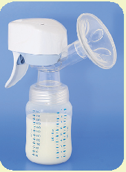

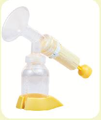

© 2017 MEDELA, INC.

SHUTTERSTOCK

###### Electric and Battery-Powered Pumps

###### These come in various sizes and efficiencies, either for pumping one or two breasts at once.

###### Two-breast pump One-breast pump

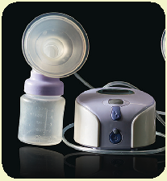

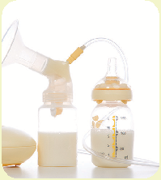

© 2017 MEDELA INC.SHUTTERSTOCK

SHUTTERSTOCK

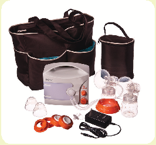

Multiuser pump

###### Single-User versus Multiuser Pumps

A single-user pump is FDA-registered for purchase by a single user only, as there is no way to guarantee this type of pump can be cleaned and disinfected between uses by different women, so it should not be shared. The handle- and piston-style pumps are examples. Multiuser pumps are made for rental. These pumps are designed to decrease the risk of contamination. Each renter is required to buy a new accessories kit that includes breast shields and tubing. Regardless of they type of breast pump, all parts of breast pumps that come in contact with the mother’s breast—for example breast shields, valves and milk containers—should be cleaned after each use. It is not necessary to clean breast pump tubing unless it comes in contact with breast milk. For specific information about cleaning your breast pump, check the pump’s instruction manual for the manufacturer-recommended method of cleaning.

Sources: U.S. Department of Agriculture, Food and Nutrition Service, “Allowable WIC Breastfeeding Aids,” in Breastfeeding Policy and Guidance (Washington, DC: USDA, 2016), 28; “Insurance and Medicaid Coverage of Lactation Services,” in Breastfeeding Policy and Guidance,

- 30; R. A. Lawrence and R. M. Lawrence, Breastfeeding: A Guide for the Medical Profession, 8th ed. (Philadelphia: Elsevier, 2016), 735; S. P. Shelov, ed., Caring for Your Baby and Young Child: Birth to Age 5, 6th ed. (New York: Bantam Books, 2014), 106; “Medical Devices: Breast Pumps,” U.S. Food and Drug Administration, last modified May 16, 2016, http://www.fda.gov/MedicalDevices/ProductsandMedicalProcedures/ HomeHealthandConsumer/ConsumerProducts/BreastPumps/default.htm. Caring for Your Baby and Young Child: Birth to Age 5, 6th ed. (New York: Bantam Books, 2014), 106; “Medical Devices: Breast Pumps,” U.S. Food and Drug Administration, last modified May 16, 2016, http:// www.fda.gov/MedicalDevices/ProductsandMedicalProcedures/HomeHealthandConsumer/ConsumerProducts/BreastPumps/default.htm.

QTalk to a breastfeeding expert or a physician. QUse the fingers to try and pull the nipples out. QSome experts believe that a woman can correct

these conditions by wearing breast shells or milk cups in her bra toward the end of her pregnancy and, if still needed, between feedings during the postpartum period. However, the use of breast shells has not proven to be effective in the limited studies done to date.

NOTE: If a woman has or thinks she has flat or inverted nipples, refer her to a health care provider or a WIC-designated breastfeeding expert for assistance.

52

###### Sore Nipples

Although mild nipple discomfort may occur when breastfeeding is initiated, pain that continues or becomes severe is not normal and should be assessed by a breastfeeding expert or physician.

Sore nipples beyond postpartum or soreness accompanied by visible damage to the breast or nipples may be caused by these and other factors:

QIncorrect positioning and latch-on to the breast. If an infant is not positioned appropriately for breastfeeding or the mouth is not attached to the breast with a good portion of the areola in the mouth, the nipple can become irritated. The infant’s grasp on the nipple should not feel painful to the mother if the infant is properly attached to her breast. ä See also: “Attachment (Latch-On),” page 58; and “How to Initiate Breastfeeding,” page 59.

QTrauma that produces cracking. This may come from failing to release suction before removing the infant from the breast, overzealous breast cleansing (mothers should be instructed to avoid harsh soaps), climate variables, or other potential causes of nipple pain.

QDelaying feedings. Delaying feedings can cause more pain and harm your milk supply. If you find yourself wanting to delay feedings because of pain, get help from a lactation consultant. ä See also: “Frequency and Duration,” pages 60–61.

QAn infection called thrush. The nipples suddenly become sore and cracked, with pink, flaky skin.

They may itch and burn. Thrush may also appear as white spots on the inside of the infant’s cheeks, tongue, or gums. In this case, a health care provider should be consulted for both the mother and infant.

QInfant’s medical reason. Conditions such as

ankyloglossia (tongue-tie) or cleft palate may not allow an infant to latch on to the breast correctly.

###### What to Do

If a mother complains of sore nipples, the cause of the soreness needs to be determined in order to treat the condition and prevent it from recurring. Expressing some milk onto the nipples at the end of a feeding and letting it dry may help sore nipples to heal. Some other suggestions for sore nipple relief may include starting the feeding on the least sore side, trying different positions, massaging the breast before the feeding to get the milk flowing, and seeking treatment for thrush. A WIC peer counselor or WIC-designated breastfeeding expert can also provide information and support.

53

###### Engorgement

Engorgement refers to the firm and painful overfilling and edema of the breasts. Normal fullness, common in the first weeks of lactation, is the result of new milk production along with increased blood flow to the breasts. By the 2nd or 3rd week postpartum, this normal fullness decreases and the breasts will feel softer, even when the milk supply is plentiful.

Engorgement may occur when milk is infrequently or ineffectively removed from the breast because of sore nipples, a sleepy infant, or mother-infant separation. When engorgement occurs, the breasts will feel full, hard, warm, tender, and painful. It may be difficult to attach the infant to the breast because the nipple and areola become very taut and hard to grasp. Cases of severe engorgement are associated with abrupt changes in breastfeeding frequency, such as when a mother skips several feedings in a day without pumping. Also, untreated engorgement can lead to mastitis.

There are a number of ways to relieve engorgement: QApply moist heat (hold a washcloth soaked in

warm water to the breasts or stand under a warm or hot shower) for 10 to 20 minutes before a feeding to facilitate the milk let-down reflex.

QExpress some milk to soften the areola and breast

and allow the nipple to protrude easily.

QTry reverse pressure softening. This makes the

areola soft around the base of the nipple and facilitates the infant’s latch. (Refer to the U.S. Department of Health and Human Services’

Your Guide to Breastfeeding for examples of engorgement relief measures.)

QMassage the breasts to encourage the flow of milk

and to relieve fullness.

QApply cold compresses to the breasts after feedings

to reduce swelling and pain.

QThe best management for engorgement is prevention, by having the infant breastfeed frequently and effectively every 1 to 3 hours, or by pumping/expressing milk as needed.

Speak with a WIC breastfeeding peer counselor or WIC-designated breastfeeding expert for advice on how to address these conditions.

###### Plugged Milk Ducts

A plugged milk duct can occur when a milk duct becomes clogged with milk. A mother with a plugged milk duct will commonly complain of a localized tender area on her breast or a lump she can feel in her breast, but she does not have fever or other flu-like symptoms. Plugged ducts can be caused by improper positioning of the infant on the breast, severe engorgement, consistent breastfeeding on one breast only, infrequent or skipped feedings, or pressure applied on the breast by a tight bra or other constricting clothing, certain sleeping positions, and other means.

###### What to Do

To release a plugged milk duct, a mother can take the following steps:

QTake a hot shower or apply warm, moist cloths to the area where the plugged duct is located and the rest of the breast.

QMassage the breast from the plugged area down to

the nipple before and during breastfeeding.

QBreastfeed frequently (at least every 2 hours) and

use different positions.

QPosition the infant’s chin toward the plugged duct

and empty the affected breast first. QExpress after feeding on the affected side. QLoosen tight clothing, especially the bra. QGet plenty of rest.

Because mastitis can result if plugged milk ducts are not relieved, a mother should contact her health care provider if the plugged duct does not go away or if she starts developing symptoms of mastitis.

###### Mastitis

Mastitis is an infection of the breast. The infection commonly enters through a break in the skin, usually a cracked nipple. It can occur if a mother does not breastfeed frequently and effectively, and thus often appears following engorgement or plugged ducts. This condition frequently occurs at times of stress or change in usual routine (e.g., visitors, holiday time, returning to work). Frequent and effective breastfeeding, which empties the milk from the breasts regularly, can prevent most cases of mastitis from developing. A mother with mastitis may have any of a number of symptoms: tenderness and/ or redness of the breast, yellowish discharge from the nipple that looks like colostrum, or flu-like symptoms such as body aches, headache, nausea, vomiting, fever, chills, malaise, or fatigue.54

NOTE: A breastfeeding mother complaining of any of the above symptoms should contact or be referred to her health care provider immediately.

The management for mastitis is the same as for a plugged duct: apply heat, get plenty of rest, drink adequate fluids, and breastfeed often, preferably from the affected breast first. The milk is not harmful to the infant. Antibiotics will usually be prescribed to cure the infection. To prevent the recurrence of mastitis, it is important that a mother take the entire course of prescribed medication, even if her symptoms have disappeared before the medication is finished. It is recommended that the mother continue

breastfeeding, using both breasts at each feeding, and breastfeed frequently to remedy and prevent this condition.

###### Poor Suckling

An infant who does not appear to be correctly attached to the breast, chews on the nipple, or pushes the nipple out of his or her mouth may not be suckling effectively. Poor suckling may result from improperly positioning an infant, incorrect use of the tongue while breastfeeding, nipple preference, and other problemssuch as ankyloglossia (tongue-tie). An infant who suckles poorly may be breastfeeding often but ineffectively, and thus possibly not receiving sufficient milk from the breasts. Ultimately, poor suckling can result in a decrease in the mother’s milk supply as well as an infant who is frustrated, gaining weight inadequately, has a low urinary output, and has abnormally infrequent stools.

NOTE: If a mother complains that her infant has any of these symptoms, refer the infant to a health care provider or WIC-designated breastfeeding expert who can provide assessment, counseling, and follow-up services to correct suckling problems.

55

###### Jaundice

After the birth of an infant, it is important to watch the newborn’s health closely. One thing that the health care provider will monitor is jaundice. Mild jaundice is common in most newborns and often disappears on its own. However, for moderate or severe cases of jaundice the infant may need medical care. Jaundice is visible in the yellowing of an infant’s skin and eyes. Jaundice occurs when a substance called bilirubin builds up in the infant’s system faster than it can be broken down by the liver and eliminated through the infant’s stool and urine. Extra feedings usually help rid the infant’s body of the extra bilirubin. However, if the bilirubin level is unusually high and not treated immediately and effectively, there is risk of damage to the infant’s brain and nervous system.

QBreastfeeding jaundice occurs within the first

week of life when an infant does not take in

enough milk. One out of 10 infants develops this condition. Too little milk intake can lead to decreased bowel movements, thus causing bilirubin levels to reabsorb and not be eliminated from the body. With increased feedings, the condition usually improves within two weeks.

QBreast milk jaundice is caused not by an infant’s lack of milk intake, but by substances in the mother’s milk that affect the ability of the infant’s body to rid itself of excess bilirubin. The condition rarely causes additional problems and usually subsides between 3 and 12 weeks of age as feedings continue.

NOTE: In all cases of jaundice, the parent or caregiver’s health care provider should be consulted immediately for guidance.

###### Appetite Spurts and Growth Spurts

56

Appetite spurts and growth spurts are short periods of time when the infant breastfeeds more frequently than normal.When the infant is around 2 to 3 weeks of age, mothers may notice the infant acts hungrier than normal and may not seem satisfied.A mother may feel these signs indicate that she is not producing enough milk for her infant. Many mothers begin to supplement their feedings with infant formula, or even stop breastfeeding completely.

Mothers should not stop breastfeeding, and this is why: the infant is actually signaling the mother’s body to produce more milk to meet the infant’s growing needs.The mother should be encouraged to keep the infant at the breast as often as the infant demands to feed during this period.Frequent feeding will increase her milk supply to meet her infant’s increased needs, and eventually the infant will resume a more normal feeding pattern.

Appetite spurts can also occur around 6 weeks, 3 months, and 6 months of age.The duration of each appetite spurt may vary. By giving breastfeeding mothers guidance in advance, WIC breastfeeding staff can help them anticipate and recognize changes in feeding patterns and keep mothers from supplementing or premature weaning.

NOTE: If a mother expresses concern that an appetite spurt lasts longer than a few days, refer her to a WIC-designated breastfeeding expert.

###### Teething and Biting

Teething and biting are not reasons to wean an infant from the breast. Infants can continue to breastfeed while growing teeth without causing pain to the mother. As teeth emerge, babies learn how to breastfeed without biting. If the infant bears down on the mother before the teeth come in, the mother can discourage this behavior by slipping a finger in the infant’s mouth to break suction, then removing the infant from the breast with a firm “No” (without yelling, which can scare the infant). Another option for mothers is to put the infant down for a moment to show that biting brings a negative consequence; the infant can then be picked up again and be provided comfort. Infants learn quickly not to bite down if the feeding is stopped. Offering a cold teething toy or frozen wet washcloth to the infant before breastfeeding may also help soothe the infant’s gums and prevent biting. ä See

also: Chapter 6, “Teething,” page 152; and “Home Remedies and Teething Gels: What to Avoid,” page 153.

###### Refusing to Breastfeed

An infant’s sudden refusal to breastfeed is often referred to as a “nursing strike” and may occur at any time. Mothers may perceive this as a personal rejection, and a nursing strike may lead to early or unplanned weaning. Many mothers never figure out what causes a nursing strike, but the following may be among the reasons:57

QOnset of a mother’s menses QMaternal stress QChange in maternal diet QInfant being distracted while breastfeeding,

perhaps by surrounding activities

QInfant being upset by hearing arguing or harsh

speaking tones while breastfeeding

QEar infection, which causes the infant pain when

sucking or pressure when lying on one side

QMouth pain from teething, a fungal infection,

or a cold sore

QChange in the mother’s soap, deodorant, or

perfume QInfant nasal congestion QA mother’s return to work, or a period of

separation of the dyad

QInfant nasal obstruction, gastroesophageal reflux

disease, or teething

Efforts to restore or continue breastfeeding may take several days. Mothers will need reassurance to continue the breastfeeding relationship and should be encouraged to continue putting the infant to the breast, especially when the infant shows signs of hunger or when he or she is just awakening or sleepy. Mothers can also minimize distractions and increase the amount of time holding or cuddling the infant, including using skin-to-skin contact. Mothers should be advised to maintain their milk supply by pumping or hand expression to ensure continued adequate milk production. Mothers should be instructed to provide the infant with pumped human milk in a cup, spoon, or dropper until breastfeeding resumes.

###### Slow Weight Gain

An infant’s weight gain is the most reliable sign of breastfeeding success. When an infant does not gain weight adequately, action should be taken to increase weight and prevent premature weaning. It is common for breastfed and formula-fed infants to lose a few ounces of weight in the first three or four days of life. During this time, infants pass their first stools and eliminate the extra fluids they are born with. After this period the infant’s weight loss should reverse, and by the time the infant is 14 days old the birth weight should be exceeded.58 An infant usually gains about 1 ounce per day during the first six months. ä See also: “Indicators of Whether an Infant Is Getting Enough Milk,” page 62–63.

NOTE: If an infant is under birth weight by 2 weeks of age or a mother is concerned about her infant’s weight, she should consult her infant’s health care provider.

###### Sleeping Through the Night

Although many parents and caregivers worry about getting their infant to sleep through the night, the reality is that an infant’s digestive system is not designed to go an extended amount of time without food.

Infants need the important nutrition that night feedings can provide for growth and development. Night feedings are also important for the breastfeeding mother because they help maintain a healthy milk supply and prevent the mother’s breasts from becoming overly full. Mothers may feel pressure from family members and friends who indicate that their infant slept through the night at an early age; however, it is important to remind mothers that infants have different feeding patterns with different time intervals. Some infants cluster feed in the late evening and sleep longer at night. Other infants feed every two to three hours through the night.59

Sleep deprivation is natural in the early weeks after childbirth. Getting to know an infant’s feeding and sleeping patterns is a learning process for parents and caregivers whether they breastfeed or formulafeed their infant. Both feeding methods may disrupt sleep, but breastfeeding eliminates having to get up and prepare a bottle of formula. Mothers can use strategies such as keeping the infant close to the bed in a bassinet, sleeping when the infant sleeps, resisting the temptation to do too much in the first few weeks, and accepting help from others in order to get more rest. Assure parents and caregivers that as infants grow, they will sleep for longer intervals.

NOTE: Sleep deprivation can place a mother at risk for postpartum depression. It is essential that she seek help from her health care provider if she is noticing excessive mood changes, anxiety, or depression.60

###### Complementary Bottles and Pacifier Use

In order to establish a good human milk supply, advise mothers to avoid feeding complementary bottles of fluids other than human milk or using pacifiers until breastfeeding is well-established, unless instructed to do so by a doctor or lactation consultant.61 Infant feeding should not be supplemented with water or any fluids other than human milk unless medically indicated.

Some problems that may be caused or aggravated by feeding complementary bottles or using a pacifier:

QPreference for artificial nipples. Artificial nipples on bottles and pacifiers require different movements of the infant’s tongue, lips, and jaw and may make it difficult for infants to easily go back to the mother’s nipple and breast.

QEngorgement. Bottles and pacifiers decrease the amount of time the infant spends breastfeeding, potentially leading to a mother’s breast engorgement. Mothers can prevent this by starting frequent breastfeeding immediately postpartum.62

QRefusal of the breast. After bottle-feeding, the infant may become frustrated with the change and not easily go back to suckling from the breast.

QEarly weaning. Some mothers may wish to partially breastfeed and feed some infant formula. Because the infant fills up on infant formula and suckles less from the breast, a reduction in the mother’s milk production occurs. This often leads a mother to wean the infant early. If a mother desires to wean her infant from the breast over the first few weeks of life, she should be advised to see a WIC-designated breastfeeding expert. ä See also: “Weaning the Breastfed Infant,” page 75.

Mothers who report any of the above problems can be referred to a WIC-designated breastfeeding expert for assistance. ä See also: Chapter 2, “Does an Infant Want to Eat—or Simply Suck?” on page 36.

Sleep through the night: Parents and caregivers have different definitions of what “through the night” means. Researchers use midnight to 5 a.m. as the standard definition; however, many mothers consider it to be much longer. Cluster feed: Also called “bunch feed,” this is when an infant feeds close together at certain times of the day, most commonly in the evening.

###### Planning Time Away From the Infant

Many mothers need or want to return to work or school outside the home shortly after their infant’s birth. Mothers who are temporarily separated from their infants can successfully continue to provide their human milk for the infant through another parent or caregiver. Some mothers can successfully continue breastfeeding by bringing the infant along. The following tips may improve a mother’s ability to do both:

QIf possible, delay the return to work or school. The period from birth to 4 to 6 weeks of age is critical for establishing a mother’s milk supply. Or, return only part time if possible in the early months after birth. If a mother returns to work or school before that time and is away from her infant for long periods, she may have difficulty maintaining her milk supply.

QLearn to express human milk. A mother who is comfortable expressing human milk manually (by hand) or mechanically (using a breast pump) can collect her milk while away from her infant. Mothers who begin expressing, collecting, and freezing small amounts of milk each day are able to build up a stored supply of milk. One recommendation is to pump twice a day, in addition to breastfeeding the infant, beginning several weeks before the mother returns to work or school. This allows the milk supply to increase

###### K now Your Workplace Rights as a Nursing Mother

On March 23, 2010, the Patient Protection and Affordable Care Act (PPACA) was signed into law. It amended Section 7 of the Fair Labor Standards Act (FLSA) of 1938 and provided general information on employee requirements to allow break time for certain nursing mothers. The employee shall be provided with the following benefits:

QA reasonable amount of break time to express milk as needed by the nursing mother up to 1 year after the child’s birth. (The frequency and length of breaks will likely vary.)

gradually over the weeks so there is plenty for another parent or caregiver to feed the infant while the mother is away, or for the mother to supplement breastfeedings when she returns. ä See also: “Expressing Human Milk,” pages 64–65.

QInquire about breastfeeding support at work or school. Some venues may feature supportive policies (e.g., allowing breaks or flexible work hours for pumping or breastfeeding) and facilities or equipment for breastfeeding mothers (e.g., special rooms or areas for breastfeeding with privacy, an electric breast pump for employees’ use, or a refrigerator to store expressed milk).

QMake childcare arrangements for the infant. These will vary by circumstance and can include care by relatives, center-based care, care provided in a temporary caregiver’s home, and care provided in the infant’s home by another parent or a temporary caregiver. Mothers should be encouraged to choose an arrangement that supports breastfeeding and, in the case of a childcare center, allows her to breastfeed if she visits. Instructions for the other parent or the temporary caregiver should include the following:

- •How to use frozen human milk ä See also: “Thawing and Warming Milk,” on page 66.
- •How much expressed human milk (or infant formula) the infant usually consumes and how often he or she usually eats (depending on the infant’s stage of development and other factors)

QA private, functional space for expressing human milk. This cannot be a bathroom, even if private.

Further specifics and guidance on the legislation are provided by the U.S. Department of Labor in the source given below. State legislation may provide more strict guidance on workplace support for breastfeeding mothers than does the Federal legislation.

Source: “Fact Sheet 73: Break Time for Nursing Mothers under the FLSA (Fair Labor Standards Act),” Wage and Hour Division, U.S. Department of Labor (2013), accessed August 2016, https://www.dol.gov/whd/regs/compliance/ whdfs73.pdf.

•How to follow the infant’s hunger and satiety cues in order to determine when and how much to feed the infant

QMake arrangements for safely storing expressed human milk away from home. It helps if a refrigerator is available for storage at the work site or school. When a mother travels brief distances, such as to and from work or school, the pumped/ expressed milk should be stored in a cooler or insulated cooler bag with packed ice or frozen ice packs. The mother should label each milk container with the collection date and always use the oldest milk first. ä See also: Table 3.1, “Human Milk Storage,” page 66.

QPrepare the infant for being fed by another parent or temporary caregiver. The infant needs to be introduced to a bottle about two weeks before the mother starts going to work or school. The infant should be at least 3 to 4 weeks old. By that age, the mother’s milk supply should be established and the infant should be able to move back and forth between the mother’s nipple and a bottle nipple. An older infant may take human milk from a cup.

QMaintain a good milk supply. Mothers should establish a plan to breastfeed and pump milk consistently throughout the day. Many working mothers begin giving formula to an infant because they believe their milk production lessens when they are not breastfeeding throughout the day. This does not have to be the case if mothers follow these steps:63

- •Determine the number of times the infant is breastfed during a 24-hour period. Write down the number.
- •Within every 24-hour period, the mother will either breastfeed or express her milk to use later. Perhaps the number is nine. She would aim to feed the infant at home six times, and then express milk at work three times.
- •If either a breastfeeding or expression is missed within a 24-hour period, the mother can aim to return to her schedule the following day.
- •It is important for a mother to always replace the expressed milk she has stored in her freezer. Continually expressing replacement milk will keep up her overall milk production.

■Arrange for milk expression or breastfeeding during the workday or school day. Mothers often express their milk during breaks and/or the lunch hour. Other mothers can go to their infants or have their infants brought to them to breastfeed. Some infants wait until the mother arrives home to do most of their breastfeeding; this is not a problem as long as the infant is consuming an adequate amount to maintain proper growth.

Although additional planning and scheduling is required for a mother to express adequate milk or breastfeed during the day while she is working or attending school, continuing to breastfeed, to whatever degree, benefits both the mother and her infant.64 ä See also: Chapter 4, “Guidelines for Safe, Effective Bottle-Feeding,” pages 100–101.

###### Flight Rules for Carrying Expressed Milk

The Transportation Security Administration (TSA) considers human milk, both liquid and frozen, a liquid medication. It may be carried on the plane whether or not the breastfeeding child is also traveling. Parents and caregivers should know these points:

QHuman milk is allowed in excess of the usual 3.4 ounces in reasonable quantities and does not need to be placed in a resealable bag. It must be labeled appropriately.

QThe parent or caregiver can ask to be directed to the designated family checkpoint and should tell the TSA officer at the screening entrance that the liquids are medically required.

QAirport X-ray machines have no effect on breastfeeding, human milk, or the process of lactation; however, there may be additional screening that might include opening the milk container.

Source: “Formula, Breast Milk, and Juice,” Department of Homeland Security Transportation Security Agency, accessed August 2016, https://www.tsa.gov/node/1947.

###### Weaning the Breastfed Infant

The AAP recommends that breastfeeding be continued through the infant’s first year, and then for as long after as is mutually desired by the mother and child.65 Research demonstrates that the benefits of breastfeeding are dose-responsive; that is, the longer a mother breastfeeds, the more benefit her infant will receive. The HHS, Office of Disease Prevention and Health Promotion (ODPHP) initiative Healthy People 2020 calls for an increase in infants being breastfed up to 1 year of age to 34 percent.66 While the decision for weaning an infant from the breast is between each mother and infant, the weaning process usually begins as complementary foods are introduced and the infant is breastfeeding less frequently.

###### Approach to Gradual Weaning

Mothers who wish to wean their exclusively breastfed infants onto infant formula tend to experience less discomfort if the weaning process is gradual (e.g., over several weeks or longer). Gradual weaning also allows infants time to adjust to both the taste of infant formula and to drinking from a bottle or cup. Mothers can formally start weaning from the breast by replacing a feeding of human milk with a feeding of infant formula (or whole cow’s milk if the infant is over 12 months old). After the first formula feeding, the infant may be less interested in the next breastfeeding and the mother’s breasts may not feel full. The bedtime breastfeeding is often the last to be eliminated. Gradually, over several days or even weeks, additional breastfeedings can be eliminated. When down to one feeding per day, the infant can be breastfed every other day. Some mothers and infants may still want to breastfeed once in a while just for comfort or to relax.

Abrupt or sudden weaning is occasionally necessary due to a mother’s severe illness or prolonged separation of mother and infant. In such cases, mothers should hand express or pump just enough milk to remain comfortable, without draining the breast. They may apply ice to reduce swelling and wear a firm but nonbinding bra for support.67

###### Weaning to a Bottle or a Cup

A mother who wishes to discontinue breastfeeding can wean her infant over 6 months old to infant formula. An infant 12 months or older may be given whole cow’s milk in a bottle and/or cup, depending on the infant’s developmental ability. Some infants may need to be weaned to a bottle because they are not developmentally ready to drink significant quantities of liquid from a cup. It is advisable to wean infants entirely off the bottle and onto a cup by about 15 months old.

###### Relactation

Either rebuilding a milk supply after it has been reduced or dried up, or building it from the start, is called relactation. Often a mother weans prematurely because she feels she is not producing enough milk and therefore should feed her infant formula. If she decides to resume breastfeeding, relactation is easiest when attempted soon after weaning, especially if the infant is not yet 6 months of age (although it does work with older infants). The process is also easier if the mother still nurses infrequently. Nonbirth caregivers or parents who have never nursed can also relactate. A WIC-designated breastfeeding expert can guide on this process, which works best if the mother is motivated to follow the key steps, including breast stimulation, and to receive continued support.68

NOTE: Refer the mother to a WIC-designated breastfeeding expert for assistance with relactation.

Relactation: Also called “induced lactation,” this is the process of a mother restarting her milk supply after she has weaned and her milk has dried up. The term can also be applied to a mother who has never nursed or to a nonbirth mother who wishes to develop a milk supply.

###### Contraindications to Breastfeeding

In general, there are very few true contraindications to breastfeeding. Most women who desire to breastfeed can do so without problems. Under certain circumstances, a physician will need to make a case-by-case assessment to determine whether a woman’s environmental exposure or her medical condition warrants her to interrupt or stop breastfeeding.

69

Infectious Diseases

Acute infectious illnesses such as colds or gastrointestinal and urinary tract infections are not contraindications to breastfeeding. More significant infectious diseases must be evaluated for the risk of transmission to the infant. Research has conclusively demonstrated that the human immunodeficiency virus (HIV) can be transmitted through breastfeeding and/or human milk. In the United States, the AAP and the CDC recommend that HIV-positive mothers should not breastfeed their infants. In addition, in the United States, breastfeeding is not advised for infants of mothers with human T-cell lymphotropic virus type 1 or type 2 (HTLV-1, HTLV-2).

There are a number of other infectious diseases for which breastfeeding may need to be temporarily discontinued while therapy is initiated or until the risk of transmission has passed:

QVaricella-zoster virus QHerpes simplex virus (when lesions occur on

the breast) QActive tuberculosis QBrucellosis QHepatitis (There is no contraindication to

breastfeeding for a mother who has tested positive for hepatitis B or C unless her nipples are cracked and bleeding.)

QCytomegalovirus (CMV) in preterm infants or

infants with weakened immunity

NOTE: In all cases of nonroutine infectious illness, the mother’s health care provider should be consulted for appropriate therapy and guidance on continuation of breastfeeding.

###### Pharmacological Therapy

Few medications are contraindicated while breastfeeding; however, breastfeeding may not be advised if the mother is receiving certain prescription medications for illness. She must talk with her health care provider about her specific medications and how to balance the benefits of breastfeeding for the infant against the risk of exposing the infant to a potentially harmful pharmacological substance. The National Institutes of Health National Library of Medicine provides an online database with information about drugs and the implications for breastfeeding mothers, called LactMed.70 However, this is not a substitute for discussing the individual’s concerns with a health care provider. ä See also: “Use of Cigarettes, Alcohol, and Other Substances During Breastfeeding,” pages 77–82.

71

Metabolic Disorders

If an infant has a metabolic disease that requires a specialized infant formula, breastfeeding may be contraindicated (e.g., in the case of infants with galactosemia, a rare medical condition). Infants with the metabolic disorder phenylketonuria (PKU) can breastfeed on a limited basis as long as their diet is supplemented with a special low-phenylalanine infant formula and they are carefully monitored by their health care provider. Screening for both disorders takes place via a newborn screening blood test performed before the infant leaves the hospital after birth.

###### Breast Surgery or Piercing

72

Medically indicated or cosmetic breast surgery and nipple piercing have become more common in recent years. Although most mothers who have had breast or nipple surgery are able to produce some milk, establishing a full milk supply

Galactosemia: A rare genetic metabolic disorder that affects an individual’s ability to metabolize galactose (a sugar) in the body. If untreated, this disorder can lead to low blood sugar, vomiting, diarrhea, lethargy, brain damage, and death.

PKU: An inherited metabolic disorder caused by an enzyme deficiency resulting in an accumulation of phenylalanine and its metabolites in the blood. If untreated, this disorder can lead to mental retardation and seizures.

for their infants may not always be possible. However, these mothers can still have a successful breastfeeding experience by supplementing in a way that supports breastfeeding. In fact, breastfeeding should be encouraged in most cases. Additional assistance, monitoring, and encouragement should be provided during the first few days and beyond to ensure sustained, successful milk production. The following women may successfully breastfeed:

QWomen with a history of breast cancer QWomen with previous radiation or lumpectomy QWomen with breast tissue trauma and burns

requiring grafting

QWomen with a single mastectomy who can

breastfeed from the remaining breast

QWomen who have undergone breast enlargement

with silicone or saline implants

QWomen with pierced nipples (Rings or studs should be removed to prevent the infant from choking. If a pierced nipple was infected at any time, scar tissue may have developed that could make breastfeeding more difficult. If scarring has not occurred, milk may flow through the piercings; this will not harm the infant.)

Breast reduction surgery is more likely to interfere with successful breastfeeding because milk ducts and nerves may have been cut.

###### Use of Cigarettes, Alcohol, and Other Substances During Breastfeeding

In a 2012 policy statement, “Breastfeeding and the Use of Human Milk,” the AAP states that maternal substance abuse is not a categorical contraindication to breastfeeding; however, it is best for a breastfeeding mother to avoid alcohol, tobacco, and illegal drugs because most maternally ingested substances are transmitted to human milk. Still, a variety of factors affect the concentration of a harmful substance and its potential danger to a breastfed infant.73

For more information on maternal substance use and its prevention, see the U.S. Department of Agriculture’s Substance Use Prevention: Screening,

Education, and Referral Resource Guide for Local WIC Agencies, (http://wicworks.fns.usda.gov/wicworks/ Topics/ResourceManual.pdf).

This section provides information on the use of cigarettes, alcohol, nonprescriptive drugs, caffeinecontaining products, herbal teas, and other products during breastfeeding.

###### Smoking

Whether a mother or other parent or caregiver smokes cigarettes or marijuana, or both, there can be significant effects on an infant’s health—and on the smoker’s health. To help create an optimal environment in which an infant can sustain health and thrive, it is recommended that a parent or caregiver work to make that environment smoke-free.

###### Cigarettes

The AAP does not consider maternal smoking to be an absolute contraindication to breastfeeding; therefore, a mother who smokes cigarettes can still provide her infant the benefits of breastfeeding and should be encouraged to do so. However, due to its association with an increased incidence in infant respiratory illness and SIDS, and because smoking is a risk factor for low milk supply and poor infant weight gain, breastfeeding mothers should be actively discouraged from smoking. At least one study links exposure to cigarette smoke and its metabolites to colic.74

Second-hand smoke is the combination of smoke from the burning end of a cigarette and the smoke exhaled; it contains more than 7,000 chemicals.75 The U.S. Surgeon General designated second-hand smoke as “harmful and hazardous to the health of the general public and particularly dangerous to children” and stated that exposure to it “causes premature death and disease in children and in adults who do not smoke.” In addition, second-hand smoke can lead to these other concerns in children:76

QEar infection QSlowed lung growth QImpaired lung function QAcute respiratory infections QSevere asthma

Third-hand smoke can negatively impact infants and children as well since it contains many of the same compounds as secondhand smoke as well as some highly toxic compounds unique to aged tobacco smoke. Exposure to third-hand smoke occurs via toxic substances that remain in the air and dust and on surfaces in the physical environment (e.g., couches, pillows, clothing, blankets, carpets/rugs, walls, draperies, car interiors, toys, etc.) where someone has smoked, even weeks and months after the smoking stops. Infants who live in a home with a smoker are at particular risk since during their first year of life, they spend much of their time indoors and in close proximity to contaminated dust and objects.77

Once smoking has occurred indoors, third-hand smoke cannot be eliminated by airing out rooms, opening windows, using fans or air conditioners, or confining smoking to only certain areas of a home.88 Replacing items is often the only way to reduce, though not eliminate, third-hand smoke residue and mitigate some of the off-gassing of tobacco toxins into the environment (note that if walls and ceilings are not thoroughly washed prior to repainting, the off-gasses and nicotine stains can seep through even multiple layers of paint). Initiating a ban on smoking indoors is advised, even for homes where smoking has already occurred indoors, and those who smoke outside should do so away from open doors or windows, as the smoke can still enter a home.78

###### E-cigarettes/vaping79

Electronic cigarettes deliver nicotine or other substances in the form of a vapor, which the user inhales. The FDA has not evaluated e-cigarettes for safety and effectiveness; thus, there is no information on their safety, health effects of long-term use, which chemicals they contain, or how much nicotine a user inhales. Limited FDA-conducted laboratory studies of certain samples demonstrated that there are substandard or nonexistent quality control processes used to manufacture these products: “FDA found that cartridges labeled as having no nicotine in fact contained nicotine and that three different electronic cigarette cartridges with the same label emitted a markedly different amount of nicotine with each puff.”

###### Recommendations on Cigarettes

The AAP recognizes pregnancy and lactation as opportune times to promote smoking cessation but indicates that mothers who smoke should still breastfeed because of the numerous benefits it provides the infant, including protection against respiratory illnesses.80 Smoking mothers may be advised in the following ways:

QEncourage mothers who smoke to quit. Refer breastfeeding mothers who smoke, and/or are having difficulty quitting, to smoking cessation programs in your area. If a breastfeeding mother is unable to completely quit smoking, recommend that she do the following:81

- •Cut down on the number of cigarettes smoked to the greatest degree possible.
- •Avoid smoking in infant’s presence (nicotine, via cigarette smoke, can also enter an infant’s system from the air) and change clothing after smoking so as to not expose the infant to smoke particles in clothing.
- •Refrain from smoking while breastfeeding her infant.
- •Refrain from smoking until right after a feeding so that nicotine levels will have time to decrease before the next feeding.

QAdvise mothers to ask other smokers to avoid smoking around their infant or other children because of the effects of second- and third-hand smoke.

QEncourage mothers to ban smoking (if possible) inside the home where the infant lives, with any smoking outdoors taking place away from open windows and doors.

QAdvise a mother to speak with her health care provider for support in stopping smoking. Only one-third of women successfully stop smoking without pharmacologic aids. Nicotine replacement therapy (e.g., nicotine patches or gums) is often promoted to help smoking cessation and is compatible with breastfeeding; however, a mother must consult with her health care provider before using these products.The FDA has not approved e-cigarettes for therapeutic uses, so these products cannot be recommended as a cessation aid.

82

Marijuana

Marijuana is the most commonly used, and still largely illicit, drug during pregnancy. While most studies cite a self-reported prevalence of use during pregnancy of 2 to 5 percent, this range increases to 15 to 28 percent among young, urban, socially disadvantaged women. Some 48 to 60 percent of marijuana users continue to use during pregnancy, with many women believing that this substance is relatively safe; it is also less expensive than tobacco. Due to a growing number of States legalizing marijuana, the prevalence of pregnant women using this drug could potentially increase.

In its committee opinion “Marijuana Use during Pregnancy and Lactation,” the American College of Obstetricians and Gynecologists states that, because of concerns regarding impaired neurodevelopment and insufficient data to evaluate the effects of marijuana use on infants during lactation and breastfeeding, pregnant and breastfeeding women should be discouraged from using marijuana. Moreover, “marijuana smoke contains many of the same respiratory diseasecausing and carcinogenic toxins as tobacco smoke, often in concentrations several times greater than in tobacco smoke.”

An important point to highlight is that the underlying justification for using marijuana (medicinal versus recreational) does not change marijuana’s effects on the mother, the fetus, or the child. Therefore, despite States legalizing marijuana for both medicinal and recreational purposes, such legalization does not eliminate the concerns regarding pregnant or breastfeeding women using marijuana.

Another important point to highlight is that the FDA neither regulates nor evaluates marijuana; thus, there are no approved safety precautions, indications, contraindications, or recommendations regarding its use during pregnancy and lactation. Similarly, no standardized formulations, dosages, or delivery systems exist. Smoking, the most common method of use, cannot be medically condoned during pregnancy and lactation.

###### Recommendations on Marijuana

Given that marijuana smoke contains many of the same harmful toxins as tobacco smoke, the same cautions about second- and third-hand tobacco smoke apply to marijuana smoke. In addition, the American College of Obstetricians and Gynecologists recommends the following:

QAdvise pregnant women who report smoking marijuana about concerns regarding potential adverse health consequences of continued use during pregnancy.

QEncourage women who are pregnant, contemplating pregnancy, or breastfeeding to discontinue marijuana use. For those women who use marijuana for medicinal purposes, encourage them to use an alternative therapy for which there are better pregnancy-specific safety data. They should discuss options with their health care provider.

###### Alcohol

Contrary to centuries-old beliefs that may persist in some cultures, consuming alcoholic beverages has not been shown to have any beneficial effects on breastfeeding. Alcohol is not a galactagogue—an agent that promotes lactation83—therefore, drinking any type of alcohol will not increase milk supply. When a lactating woman consumes alcohol, some of that alcohol is transferred into her milk and can enter her infant’s body through that milk.

Although alcohol is not stored in human milk, its level parallels that found in the maternal blood within 30 to 60 minutes after ingestion. That means that as long as the mother has substantial blood alcohol levels, the milk also will contain alcohol. Accordingly, the common practice of pumping the breasts and then discarding the milk immediately after drinking alcohol does not hasten the disappearance of alcohol from the milk; the newly produced milk still will contain alcohol as long as the mother has measurable blood alcohol levels.84

###### Effects of Alcohol on Breastfeeding and the Infant

While the harmful effects of a pregnant woman consuming alcohol are well established, the effects on a breastfeeding woman consuming alcohol have not been nearly as extensively examined, and the literature on the prevalence of alcohol consumption during breastfeeding is limited. What has been demonstrated is that alcohol disrupts hormonal control of lactation: it inhibits oxytocin and therefore decreases the milk let-down reflex and may blunt prolactin response to suckling. It may also negatively affect infant motor development. Finally, exposure to small amounts of alcohol in the mother’s milk has a direct effect on infant sleep patterning; this results in an infant spending significantly less time in active sleep immediately after exposure to alcohol in human milk.85

Excessive alcohol intake is associated with failure to initiate the milk let-down reflex, high alcohol levels in milk, lower volumes of human milk ingested by the infant,86 and disturbances in the infant’s sleep-wake pattern.87 The amount of alcohol that may impair the milk let-down reflex is more than about two alcoholic drinks (0.5 grams of alcohol per kilogram of body weight) per day for the average woman. Two drinks are equivalent to about 2 ounces of liquor, two 12-ounce cans of beer, or 8 ounces of table wine.88

###### Recommendations on Alcohol

The Scientific Report of the 2015 Dietary Guidelines Advisory Committee recognizes that there is substantial evidence that clearly demonstrates the health benefits of breastfeeding and reaffirms that occasionally consuming an alcoholic drink does not warrant stopping breastfeeding. The report does advise that breastfeeding women should be very cautious about drinking alcohol, if they choose to drink at all, and recommends that for those women who do choose to drink:

“If the infant’s breastfeeding behavior is well established, consistent, and predictable (no earlier than at 3 months of age), a mother may consume a single alcoholic drink if she then waits at least 4 hours before breastfeeding. Alternately, a

woman may express human milk before consuming the drink and feed the expressed milk to her infant later.”89

To assist in determining alcohol amounts that may be consumed, the Dietary Guidelines for Americans provides reference beverages that are considered “one drink” (i.e., one drink equivalent): 12 fluid ounces of regular beer (5% alcohol), 5 fluid ounces of wine (12% alcohol), or 1.5 fluid ounces of 80-proof distilled spirits (40% alcohol). Since no alcoholic beverages contain the same alcohol content–packaged (e.g., canned beer, bottled wine) and mixed beverages vary in alcohol content–it is important to determine how many drink equivalents are in a beverage and limit intake. Alcoholic drink equivalents of select beverages can be found in Appendix 9 of the 2015-2020 edition of the Dietary Guidelines for Americans.90

Refer breastfeeding mothers who drink excessively to alcohol assessment, treatment, and counseling services in the community. The National Institute on Alcohol Abuse and Alcoholism (http://pubs

.niaaa.nih.gov/publications/DrinkingPregnancy _HTML/pregnancy.htm) offer resources for finding treatment locations.

The USDA Substance Use Prevention: Screening, Education and Referral Resource Guide for Local WIC Agencies (see page 77) will give more guidance and other resources about alcohol use/abuse that are appropriate for pregnant or breastfeeding mothers.

###### Caffeine

The amount of caffeine in beverages and foods can vary widely depending on the product and preparation. Moreover, beverage serving sizes have increased significantly in recent years. With this in mind, moderate caffeine intake (300 milligrams daily) in the form of coffee, tea, or caffeinated sodas is unlikely to affect the breastfed infant.91 The amount of caffeine that appears in human milk is usually less than 1 percent of the amount ingested by the mother. Caffeine is not detected in the urine of an infant whose mother consumes up to three cups of coffee throughout the day.92

Sources of caffeine include beverages (coffee, tea, soda, and energy drinks); chocolate; foods made with coffee, such as ice cream; and some medications, which should be avoided (e.g., certain varieties of stimulants, pain relievers, cold remedies, and weight-control aids).

###### Recommendations on Caffeine-Containing Products

Advise women that consuming 300 milligrams of caffeine a day from coffee, tea, or soda is unlikely to affect a breastfeeding infant:

QIf a breastfeeding woman feels that her infant becomes more fussy or irritable after she consumes caffeine, she may wish to decrease or stop her intake, keeping in mind all the possible caffeine sources she ingests.

QAdvise breastfeeding women to pay attention to the amount of caffeine consumed from all sources, which includes checking the serving sizes of food and beverages.

QEncourage breastfeeding mothers on caffeinecontaining medications to consult their health care providers.

###### Herbal Preparations and Products

Little research on the safety and efficacy of herbal therapies exists, and herbal preparations are not well regulated by the FDA. Herbs contain compounds that may have pharmaceutical effects similar to drugs and, like drugs, may pass into human milk.93 Despite the fact that herbs and herbal products may come from natural sources, “natural” does not always mean safe or healthy, and some products can even be toxic. Kava, for instance, can cause liver damage and Yohimbe has been associated with fatalities in children. The FDA has no definition for the term “natural”; thus, there are no standards that must be met. In addition, herbal products may be contaminated with hazardous substances such as plant chemicals, toxic metals, disease-causing microorganisms, fumigants, and pesticides.

Concern has been expressed about the effects

on infants of some herbal teas consumed by breastfeeding mothers. Components in some herbal teas made with buckhorn bark, senna, star anise, comfrey, chamomile, and a tea called “Mother’s Milk Tea” (available in specialty food stores) may have undesirable effects on a breastfed infant whose mother consumes the tea.Additionally, adverse effects have been reported in infants whose mothers took products containing arnica (neonatal hemolysis), seaweed (hypothyroidism from excess iodine), stinging nettle (urticaria), St. John’s wort (possible colic, drowsiness, or lethargy), and herbal tea mixture (hypotonia, lethargy, emesis, weak cry, poor sucking attributed to anethole in anise and fennel).94Prolonged use of fenugreek may require monitoring the mother’s coagulation status and serum glucose concentrations.95 Safety information is lacking for black cohosh, blue cohosh, chastetree, echinacea, ginseng, gingko, and valerian.96

###### Recommendations on Herbal Preparations and Products

In general, advise breastfeeding mothers to avoid herbal preparations and to discuss use of any herbal teas or other products with their health care provider.97 Other advice includes the following points:

QInform breastfeeding women who ask about or report using herbal preparations that the composition, purity, and efficacy are not well regulated and advise them to use caution when procuring them and to speak with their health care provider.

QAdvise mothers that “natural” does not signify safety for her or her infant. Because the FDA does not regulate herbal supplements, there is no guarantee about their safety or effectiveness.

QAdvise breastfeeding mothers who face challenges in producing milk to avoid products touted as galactagogues, said to increase milk supply. Although herbalists may promote them as effectively increasing milk production, there is little scientific evidence that they actually work—or are safe. Mothers should seek consultation with a lactation specialist and use nonpharmacologic measures to increase milk supply, such as ensuring proper techniques, using massage,

increasing the frequency of milk expression, prolonging the duration of pumping and maximizing emotional support.98

###### Other Drugs

Most nonprescription (also over-the-counter, or OTC), prescription, and recreational or illicit drugs (e.g., marijuana, heroin, cocaine) that a breastfeeding mother uses are absorbed by her system and excreted into her milk. However, not all drugs are excreted into human milk at concentrations that are harmful to the infant.

###### Over-the-Counter (OTC) and Prescription Drugs

Surveys in many countries indicate that 90 to 99 percent of breastfeeding women will receive at least some medication during the first week postpartum.99 In the 2013 clinical report “The Transfer of Drugs and Therapeutics into Human Breast Milk: An Update on Selected Topics,” the AAP reports that “many women are inappropriately advised to discontinue breastfeeding or avoid taking essential medications because of fears of adverse effects in their infants.”100 It is important to avoid mistakenly applying pregnancy warnings on medications to breastfeeding and to understand that “[t]he risks of medication use during pregnancy have little to do with the drug’s safety during breastfeeding because drug exposure of the fetus is usually much greater, often by 10-fold or more, than the exposure of the infant via human milk.”101 However, while some drugs may not harm the breastfed infant, they may have a detrimental effect on the mother’s ability to produce or secrete milk.

In its policy statement “Breastfeeding and the Use of Human Milk,” the AAP notes that, in general, breastfeeding is not recommended when mothers are receiving prescription medications from classes of medicines including amphetamines, chemotherapy agents, ergotamines, and statins.102 However, previous AAP statements on this topic have been retired, and the AAP now defers to the National Institutes of Health National Library of Medicine’s LactMed online database for the most

up-to-date information on drugs and breastfeeding. The site lists prescription and OTC drugs to which breastfeeding mothers may be exposed. Among the data included are maternal and infant levels of drugs, possible effects on breastfed infants and on lactation, and alternative drugs to consider. However, this resource is not a substitute for women talking to their health care provider about medications and their concerns.

Additionally, in 2017 the FDA required several changes to the labels of all prescription medicines containing codeine and tramadol, including one that strengthened the warning to mothers that breastfeeding is not recommended when taking these medicines due to the risk of serious adverse reactions in breastfed infants, including: excess sleepiness, difficulty breastfeeding, and serious breathing problems that could result in death. A breastfeeding mother should talk to her doctor about pain medicines other than codeine or tramadol. ä See also: “Pharmacological Therapy,” page 76.

###### Recreational or Illicit Drugs

Although breastfeeding mothers should be actively discouraged from using illicit drugs, as noted earlier, the AAP does not consider maternal substance abuse to be a categorical contraindication to breastfeeding. However, drugs such as PCP, cocaine, and marijuana can be detected in human milk, and their use by breastfeeding mothers is of concern, particularly with regard to the infant’s long-term neurobehavioral development. Thus, use of these drugs is contraindicated. Affected mothers, regardless of their mode of feeding, should be encouraged to enter a rehabilitative program that makes provision for infants. Pharmacologic therapy must balance the benefits to infant and mother against the potential risk of substance exposure to the infant. The AAP notes in its “Breastfeeding and the Use of Human Milk” report that some mothers who are dependent on narcotics but properly nourished may be able to breastfeed if their HIV and drug screenings are negative and they are in a methadone maintenance program.103

###### Summary

Breastfeeding provides significant health benefits to both a mother and her infant, often even while the mother is taking medications. While it is best for a breastfeeding mother to avoid alcohol, tobacco, and illegal drugs, maternal substance abuse is not a categorical contraindication to breastfeeding.

Any decisions regarding drug/medicine use during lactation should be made between the mother and her health care provider. Remind all breastfeeding mothers to consult with their providers before taking any type of drug/medicine or supplements (herbal or otherwise). Additionally, using substances (including prescription medications not prescribed to her, as well as those prescribed to her but not taken as the physician intended) may impair a mother’s judgment and interfere with her ability to care for her infant.104 Depending on her receptiveness, she may benefit from assistance in locating a treatment center, particularly one that makes provision for infants.

For more information on maternal substance use and its prevention, see the U.S. Department of Agriculture’s Substance Use Prevention: Screening, Education, and Referral Resource Guide for Local WIC Agencies.

###### Endnotes

- 1 AAP (American Academy of Pediatrics), “Policy Statement: Breastfeeding and the Use of Human Milk,” Pediatrics 129, no. 3 (March 2012): e827–41, doi:10.1542/peds.2011-3552.
- 2 AAP, “Policy Statement: Breastfeeding and the Use of Human Milk” e827; American Academy of Family Physicians, “Breastfeeding, Family Physicians Supporting,” position paper, accessed January 31, 2019, http://www.aafp.org/about/policies/all/breastfeeding-support.html; American College of Obstetricians and Gynecologists, “Optimizing Support for Breastfeeding as Part of Obstetric Practice,” Committee Opinion no. 658: February 2016, https://www.acog.org/Clinical-Guidance-and-Publications/CommitteeOpinions/Committee-on-Obstetric-Practice/Optimizing-Support-for-Breastfeeding-as-Part-of-ObstetricPractice; Academy of Breastfeeding Medicine, “Position on Breastfeeding,” Breastfeeding Medicine 3, no. 4 (2008): 267–69, doi:10.1089/bfm.2008.9988; World Health Organization, “Infant and Young Child Nutrition,”, May 18, 2002:1, http://apps.who.int/gb/archive/pdf_files/WHA55/ewha5525.pdf ; UNICEF “Improving breastfeeding, complementary foods and feeding practices” last modified May 2018, https:// www.unicef.org/nutrition/index_breastfeeding.html.
- 3 Institute of Medicine of the National Academies, Committee on Nutritional Status During Pregnancy and Lactation, Nutrition during Lactation (Washington, DC: National Academy Press, 1991), 24–25, 115–18.
- 4 AAP, “Policy Statement: Breastfeeding and the Use of Human Milk,” e828.
- 5 R. E. Kleinman and F. R. Greer, eds., Pediatric Nutrition, 7th ed. (Elk Grove Village, IL: American Academy of Pediatrics, 2014), 41.
- 6 CDC (Centers for Disease Control and Prevention), “Breastfeeding Report Cards,” 2015–2018,” accessed October 2018, https://www.cdc.gov/breastfeeding/pdf/2018breastfeedingreportcard.pdf.
- 7 HHS (U.S. Department of Health and Human Services), The Surgeon General’s Call to Action to Support Breastfeeding (Washington, DC: HHS, 2011), accessed August 2016, http://www.surgeongeneral.gov/ library/calls/breastfeeding/calltoactiontosupportbreastfeeding.pdf.
- 8 L. J. Mata and R. G. Wyatt, “Host Resistance to Infection,” American Journal of Clinical Nutrition 24, no. 8 (August 1971): 976–86; J. Penders et al., “Factors Influencing the Composition of the Intestinal Microbiota in Early Infancy,” Pediatrics 118, no. 2 (2006): 511–21.
- 9 O. M. Ajetunmobi et al., Glasgow Centre for Population Health Breastfeeding Project Steering Group, “Breastfeeding Is Associated with Reduced Childhood Hospitalization: Evidence from a Scottish Birth Cohort (1997–2009),” Journal of Pediatrics 166, no. 3 (March 2015): 620–25.e4, doi: 10.1016/j.jpeds. 2014.11.013; M. A. Quigley, Y. J. Kelly and A. Sacker, “Breastfeeding and Hospitalization for Diarrheal and Respiratory Infection in the United Kingdom Millennium Cohort Study,” Pediatrics 119, no. 4 (2007): e837–42, www.pediatrics.org/cgi/content/full/119/4/e837; S. Sullivan et al., “An Exclusively Human Milk-Based Diet Is Associated with a Lower Rate of Necrotizing Enterocolitis Than a Diet of Human Milk and Bovine Milk-Based Products,” Journal of Pediatrics 156, no. 4 (2010): 562–67.e1; S. W. Abrahams and M. H. Labbok, “Breastfeeding and Otitis Media: A Review of Recent Evidence,” Current Allergy and Asthma Reports 11, no. 6 (December 2011): 508–12, doi:10.1007/s11882-011-0218-3; G. Aniansson et al., “A Prospective Cohort Study on Breast-feeding and Otitis Media in Swedish Infants,” Pediatric Infectious Disease Journal 13, no. 3 (March 1994): 183–88; A. R. Barclay et al., “Systematic Review: The Role of Breastfeeding in the Development of Pediatric Inflammatory Bowel Disease,” Journal of Pediatrics 155, no. 3 (2009): 421–26; L. Duijts et al., “Prolonged and Exclusive Breastfeeding Reduces the Risk of Infectious Diseases in Infancy,” Pediatrics 126, no. 1 (2010): e18–25, www.pediatrics.org/cgi/content/full/126/1/e18.
- 10 V. R. Bachrach, E. Schwarz, L. R. Bachrach, “Breastfeeding and the Risk of Hospitalization for Respiratory Disease in Infancy: A Meta-analysis,” Archives of Pediatric and Adolescent Medicine 157, no. 3 (2003): 237–43.

- 11 C. J. Chantry, C. R. Howard, and P. Auinger, “Full Breastfeeding Duration and Associated Decrease in Respiratory Tract Infection in U.S. Children,” Pediatrics 117, no. 2 (2006): 425–32; W. H. Oddy et al., “Breast Feeding and Respiratory Morbidity in Infancy: A Birth Cohort Study,” Archives of Disease in Childhood 88, no. 3 (2003): 224–28.
- 12 S. A. Silfverdal, L. Bodin, and P. Olcén, “Protective Effect of Breastfeeding: An Ecologic Study of Haemophilus influenzae Meningitis and Breastfeeding in a Swedish Population,” International Journal of Epidemiology 28, no. 1 (February 1999): 152–56; N. A. Rodriguez and M. S. Caplan, “Oropharyngeal Administration of Mother’s Milk to Prevent Necrotizing Enterocolitis in Extremely Low-Birth-Weight Infants: Theoretical Perspectives,” Journal of Perinatal and Neonatal Nursing 29, no. 1 (January–March 2015): 81–90, doi:10.1097/JPN.0000000000000087; F. Ladomenou et al., “Protective Effect of Exclusive Breastfeeding Against Infections during Infancy: A Prospective Study,” Archives of Disease in Childhood 95, no. 12 (December 2010): 1004–8, doi:10.1136/adc.2009.169912; S. Mårild et al., “Protective Effect of Breastfeeding Against Urinary Tract Infection,” Acta Paediatrica 93 (2004): 164–68; (AHRQ) Agency for Healthcare Research and Quality), “Breastfeeding and Maternal and Infant Health Outcomes in Developed Countries,” Evidence Report/Technology Assessment no. 153 (April 2007), 29, https://archive. ahrq.gov/downloads/pub/evidence/pdf/brfout/brfout.pdf; AAP (American Academy of Pediatrics), “Executive Summary: Breastfeeding and the Use of Human Milk,” Pediatrics 129, no. 3 (February 2012): 601, doi:10.1542/peds.2011-3553.
- 13 P. C. Chulada et al., “Breast-feeding and the Prevalence of Asthma and Wheeze in Children: Analyses from the Third National Health and Nutrition Examination Survey, 1988–1994,” Journal of Allergy and Clinical Immunology 111, no. 2 (2003): 328–36; M. Gdalevich, D. Mimouni, and M. Mimouni, “BreastFeeding and the Risk of Bronchial Asthma in Childhood: A Systematic Review with Meta-Analysis of Prospective Studies,” Journal of Pediatrics 139 (2001): 261–66; W. H. Oddy et al., “Association between Breast Feeding and Asthma in 6 Year Old Children: Findings of a Prospective Birth Cohort Study,” BMJ 319 (1999): 815–19; AHRQ, “Breastfeeding and Maternal and Infant Health Outcomes in Developed Countries,” 35–36; AAP, “Executive Summary: Breastfeeding and the Use of Human Milk,” 601.
- 14 W. H. Oddy, J. K. Peat, N. H. de Klerk, “Maternal Asthma, Infant Feeding, and the Risk of Asthma in Childhood,” Journal of Allergy and Clinical Immunology 110, no. 1 (2002): 65–67; AHRQ, “Breastfeeding and Maternal and Infant Health Outcomes in Developed Countries,” 46.
- 15 C. G. Owen et al., “Effect of Infant Feeding on the Risk of Obesity Across the Life Course: A Quantitative Review of Published Evidence,” Pediatrics 115, no. 5 (2005): 1367–77; M. W. Metzger and T. W. McDade, “Breastfeeding as Obesity Prevention in the United States: A Sibling Difference Model,” American Journal of Human Biology 22, no. 3 (2010): 291–96; AHRQ, “Breastfeeding and Maternal and Infant Health Outcomes in Developed Countries,” 65; AAP, “Executive Summary: Breastfeeding and the Use of Human Milk,” 601.
- 16 R. Li et al., “Bottle-Feeding Practices during Early Infancy and Eating Behaviors at 6 Years of Age,” Pediatrics 134, suppl. 1 (September 2014): S70–77, doi:10.1542/peds.2014-0646L; R. Li, S. B. Fein, and L. M. Grummer-Strawn, “Do Infants Fed from Bottles Lack Self-regulation of Milk Intake Compared with Directly Breastfed Infants?,” Pediatrics 125, no. 6 (2010): e1386–93.
- 17 B. L. Horta and C. G. Victora, “Long-term Effects of Breastfeeding: A Systematic Review (Geneva: WHO Press, 2013),” 13, accessed September 2016, http://apps.who.int/iris/ bitstream/10665/79198/1/9789241505307_eng.pdf.
- 18 Feltner C, Weber RP, Stuebe A, Grodensky CA, Orr C, Viswanathan M. Breastfeeding Programs and Policies, Breastfeeding Uptake, and Maternal Health Outcomes in Developed Countries. Comparative Effectiveness Review No. 210. (Prepared by the RTI International–University of North Carolina at Chapel Hill Evidence-based Practice Center under Contract No. 290-2015-00011-I.) AHRQ (Agency for Healthcare

- Research and Quality) Publication No. 18-EHC014-EF. Rockville, MD:July 2018, doi: https://doi. org/10.23970/AHRQEPCCER210; AAP, “Executive Summary: Breastfeeding and the Use of Human Milk,” 601.
- 19 Horta and Victora, Long-term Effects of Breastfeeding: A Systematic Review, 51; AAP, “Executive Summary: Breastfeeding and the Use of Human Milk,” 601.
- 20 M. L. Kwan et al., “Breastfeeding and the Risk of Childhood Leukemia: A Meta-Analysis,” Public Health Reports 119, no. 6 (2004): 521–35; A. Bener et al., “Does Prolonged Breastfeeding Reduce the Risk for Childhood Leukemia and Lymphomas?,” Minerva Pediatrica 60, no. 2 (2008): 155–61; J. Rudant et al., “Childhood Acute Leukemia, Early Common Infections, and Allergy: The ESCALE Study,” American Journal of Epidemiology 172, no. 9 (2010): 1015–27; AHRQ, “Breastfeeding and Maternal and Infant Health Outcomes in Developed Countries,” 87; AAP, “Executive Summary: Breastfeeding and the Use of Human Milk,” 601.
- 21 R. A. Darnall et al., “American Academy of Pediatrics’ Task Force on SIDS Fully Supports Breastfeeding,” Breastfeeding Medicine 9, no. 9 (November 2014): 486–87, doi:10.1089/bfm.2014.0110; M. M. Vennemann et al., “Does Breastfeeding Reduce the Risk of Sudden Infant Death Syndrome?,” Pediatrics 123,no. 3 (March 2009): e406–10, http://pediatrics.aappublications.org/content/123/3/e406; AHRQ, “Breastfeeding and Maternal and Infant Health Outcomes in Developed Countries,” 95; AAP, “Executive Summary: Breastfeeding and the Use of Human Milk,” 601; Thompson J, Tanabe K, Moon R, Mitchell E, McGarvey C, Tappin D, Blair P, Hauck F. “Duration of breastfeeding and risk of SIDS: An individual participant data meta-analysis.” Pediatrics. 2017 Nov;140(Issue5).
- 22 G. Goswami, “Comparison of Analgesic Effect of Direct Breastfeeding, Oral 25% Dextrose Solution and Placebo during 1st DPT Vaccination in Healthy Term Infants: A Randomized, Placebo Controlled Trial,” Indian Pediatrics 50, no. 7 (July 2013): 649–53; R. Carbajal et al., “Analgesic Effect of Breast Feeding inTerm Neonates: Randomized Controlled Trial,” BMJ 326 (2003): 13; M. A. Marín Gabriel et al., “Analgesia with Breastfeeding in Addition to Skin-to-Skin Contact during Heel Prick,” Archives of Disease in Childhood: Fetal and Neonatal Edition 98, no. 6 (November 2013): F499–503, doi:10.1136/archdischild-2012-302921.
- 23 R. A. Lawrence and R. M. Lawrence, Breastfeeding: A Guide for the Medical Profession, 8th ed. (Philadelphia: Elsevier, 2016), 244.
- 24 J. Y. Meek, ed., American Academy of Pediatrics New Mother’s Guide to Breastfeeding, 2nd ed. (New York: Bantam Books, 2011), 55–58.
- 25 Lawrence and Lawrence, Breastfeeding: A Guide for the Medical Profession, 71.
- 26 Meek, American Academy of Pediatrics New Mother’s Guide to Breastfeeding, 55–58.
- 27 Meek, American Academy of Pediatrics New Mother’s Guide to Breastfeeding, 55–59.
- 28 U.S. Department of Health & Human Services, Office of Population Affairs, “Lactational Amenorrhea Method (LAM),” accessed January 2019, https://www.hhs.gov/opa/pregnancy-prevention/birth-controlmethods/lam/index.html.
- 29 P. L. Zelkowitz et al., “Psychosocial Stress Moderates the Relationships between Oxytocin, Perinatal Depression, and Maternal Behavior,” Hormones and Behavior 66, no. 2 (July 2014): 351–60, doi:10.1016/j. yhbeh.2014.06.014; L. Strathearn et al., “Does Breastfeeding Protect Against Substantiated Child Abuse and Neglect? A 15-year Cohort Study,” Pediatrics 123, no. 2 (2009): 483.
- 30 A. M. Stuebe et al., “Duration of Lactation and Incidence of Type 2 Diabetes,” Journal of the American Medical Association 294, no. 20 (2005): 2601–10; E. B. Schwarz et al., “Lactation and Maternal Risk of Type 2 Diabetes: A Population-Based Study,” American Journal of Medicine 123, no. 9 (2010): 863.e1–6; AHRQ, “Breastfeeding Programs and Policies, Breastfeeding Uptake, and Maternal Health Outcomes in Developed Countries”, Comparative Effectiveness Review No. 210, 92-99.

- 31 A. M. Stuebe et al., “Lactation and Incidence of Premenopausal Breast Cancer: A Longitudinal Study,” Archives of Internal Medicine 169, no. 15 (2009): 1364–71; Collaborative Group on Hormonal Factors in Breast Cancer, “Breast Cancer and Breastfeeding: Collaborative Reanalysis of Individual Data from 47 Epidemiological Studies in 30 Countries, Including 50302 Women with Breast Cancer and 96973 Women without the Disease,” Lancet 360 (2002): 187–95; D. P. Li et al., “Breastfeeding and Ovarian Cancer Risk: A Systematic Review and Meta-Analysis of 40 Epidemiological Studies,” Asian Pacific Journal of Cancer Prevention 15, no. 12 (2014): 4829–37; AHRQ, “Breastfeeding Programs and Policies, Breastfeeding Uptake, and Maternal Health Outcomes in Developed Countries,” 62-84.
- 32 “Breastfeeding Programs and Policies, Breastfeeding Uptake, and Maternal Health Outcomes in Developed Countries”, 84-85.
- 33 HHS (U.S. Department of Health and Human Services), Office on Women’s Health, Your Guide to Breastfeeding, (Washington, DC: HHS, 2018), “Breastfeeding Benefits Society,” 6, accessed January 31, 2018, https://www.womenshealth.gov/files/documents/your-guide-to-breastfeeding.pdf; N. C. Rollins et al., “Why Invest, and What It Will Take to Improve Breastfeeding Practices?,” Lancet 387, no. 10017 (January 2016): 491–500, http://www.thelancet.com/pdfs/journals/ lancet/PIIS0140-6736(15)01044-2.pdf; Association of Women’s Health, Obstetric, and Neonatal Nurses, “Breastfeeding: AWHONN Position Statement,” Journal of Obstetric, Gynecologic & Neonatal Nursing 44, no. 1: 145–50, doi:10.1111/15526909.12530; Bartick, M., Reinhold, A. “The burden of suboptimal breastfeeding in the United States: a pediatric cost analysis” Pediatrics 125(5): e1048-e1056. (2010) https://www.ncbi.nlm.nih.gov/ pubmed/20368314.
- 34 L. May et al., “WIC ITFPS-2 Infant Report: Intention to Breastfeed” (Alexandria, VA: Office of Policy Research, USDA Food and Nutrition Service, 2015), accessed August 2016, http://www.fns.usda.gov/ sites/default/files/ops/WICITFPS2-Prenatal.pdf.
- 35 USDA (U.S. Department of Agriculture), Food and Nutrition Service, Nutrition Services Standards (Washington, DC: USDA, 2013), 1–79.
- 36 Food and Nutrition Board, Institute of Medicine of the National Academies, Dietary Reference Intakes: Applications in Dietary Assessment (Washington, DC: National Academies Press, 2000), 239, accessed August 2016, doi:10.17226/9958.
- 37 Lawrence and Lawrence, Breastfeeding: A Guide for the Medical Profession, 263.
- 38 R. E. Kleinman and F. R. Greer, Pediatric Nutrition, 42.
- 39 Meek, American Academy of Pediatrics New Mother’s Guide to Breastfeeding, 77.
- 40 Lawrence and Lawrence, Breastfeeding: A Guide for the Medical Profession, 262.
- 41 HHS Office on Women’s Health, Your Guide to Breastfeeding (Washington, DC: HHS, 2018), 38; La Leche League International, “Tips for Discreet Breastfeeding,” accessed August 2016, http://www.llli.org/faq/ discreet.html.
- 42 R. J. Schanler, ed., Breastfeeding Handbook for Physicians, 2nd ed. (Elk Grove Village, IL and Washington, DC: American Academy of Pediatrics and American College of Obstetricians and Gynecologists, 2014), 76-77; Meek, American Academy of Pediatrics New Mother’s Guide to Breastfeeding, 61–65; American Academy of Pediatrics, “Positions for Breastfeeding,” accessed August 1, 2016, https://www. healthychildren. org/English/ages-stages/baby/breastfeeding/Pages/Positioning-Your-Baby-ForBreastfeeding.aspx. D. Wiessinger, D. West, and T. Pitman, The Womanly Art of Breastfeeding, 8th ed., La Leche League International (New York: Ballantine Books, 2010), 63–65.
- 43 Schanler, Breastfeeding Handbook for Physicians, 76.
- 44 S. P. Shelov, ed., Caring for Your Baby and Young Child: Birth to Age 5, 6th ed., American Academy of

- Pediatrics (New York: Bantam Books, 2014), 101; L. Jana and J. Shu, “Waking Up Is (Sometimes) Hard to Do,” American Academy of Pediatrics, last modified November 21, 2015, https://www.healthychildren. org/English/ages-stages/baby/sleep/Pages/Waking-Up-Is-Sometimes-Hard-to-Do.aspx; American Academy of Pediatrics, “AAP Schedule of Well- Child Care Visits,” last modified December 18, 2015, https://www.healthychildren.org/English/family-life/health-management/Pages/Well-Child-Care-A-CheckUp-for-Success.aspx.
- 45 Schanler, Breastfeeding Handbook for Physicians, 92, 101; Meek, American Academy of Pediatrics New Mother’s Guide to Breastfeeding, 146, 160.
- 46 Meek, American Academy of Pediatrics New Mother’s Guide to Breastfeeding, 27–29, 119–20.
- 47 Schanler, Breastfeeding Handbook for Physicians, 159–64; FDA (U.S. Food and Drug Administration), “Breast Pumps,” last modified May 16, 2016, http://www.fda.gov/MedicalDevices/ ProductsandMedicalProcedures/HomeHealthandConsumer/ConsumerProducts/BreastPumps/default. htm.
- 48 Schanler, Breastfeeding Handbook for Physicians, 159–60.
- 49 FDA “Breast Pumps;” HHS, Office of Women’s Health, “Pumping and storing breastmilk,” accessed January 31, 2019, https://www.womenshealth.gov/breastfeeding/pumping-and-storing-breastmilk.
- 50 HHS Office on Women’s Health, “Pumping and Storing Breastmilk,” accessed January 31, 2019, https:// www.womenshealth.gov/breastfeeding/pumping-and-storing-breastmilk.
- 51 Schanler, Breastfeeding Handbook for Physicians, 165; HHS, Office of Women’s Health, Your Guide to Breastfeeding “Challenge: Inverted, Flat, or Very Large Nipples,” 29.
- 52 Kleinman and Greer, Pediatric Nutrition, 52; HHS, Office on Women’s Health, Your Guide to Breastfeeding, “Challenge: Sore Nipples,” 22.
- 53 Meek, American Academy of Pediatrics New Mother’s Guide to Breastfeeding, 27–29, 119–20; Schanler, Breastfeeding Handbook for Physicians, 101.
- 54 HHS Office on Women’s Health, Your Guide to Breastfeeding, “Challenge: Breast Infection,” 26-27.
- 55 Schanler, Breastfeeding Handbook for Physicians, 110–13; Shelov, Caring for Your Baby and Young Child: Birth to Age 5, 151–53; Mayo Clinic, “Infant Jaundice,” accessed October 2016, http://www.mayoclinic.org/ diseases-conditions/infant-jaundice/basics/definition/con-20019637; CDC, “Breastfeeding: Jaundice,” last modified June 2015, https://www.cdc.gov/breastfeeding/disease/jaundice.htm.
- 56 Schanler, Breastfeeding Handbook for Physicians, 113; HHS, Office on Women’s Health, Your Guide to Breastfeeding, “Challenge: Low Milk Supply,” 23; Meek, American Academy of Pediatrics New Mother’s Guide to Breastfeeding, 161.
- 57 HHS, Office on Women’s Health, Your Guide to Breastfeeding “Challenge: Nursing Strike,” 28; Schanler, Breastfeeding Handbook for Physicians, 165.
- 58 Meek, American Academy of Pediatrics New Mother’s Guide to Breastfeeding, 119.
- 59 USDA (U.S. Department of Agriculture), WIC Breastfeeding Support, “Cluster Feeding and Growth Spurts,” accessed January 31, 2019, https://wicbreastfeeding.fns.usda.gov/cluster-feeding-and-growthspurts; “Breastfeeding Basics,” accessed January 31, 2019, https://wicbreastfeeding.fns.usda.gov/ breastfeeding-basics.
- 60 M. L. Okun, “Sleep and Postpartum Depression,” Current Opinion Psychiatry 28, no. 6 (November 2015): 490–96.
- 61 L. R. Kair et al., “Pacifier Restriction and Exclusive Breastfeeding,” Pediatrics 131, no. 4 (March 2013): e1101–6, http://pediatrics.aappublications.org/content/early/2013/03/12/peds.2012–2203; Shelov, Caring

- for Your Baby and Young Child: Birth to Age 5, 180; American Academy of Pediatrics, “Pacifiers: Satisfying Your Baby’s Needs,” last modified November 21, 2015, https://www.healthychildren.org/English/agesstages/baby/crying-colic/Pages/Pacifiers-Satisfying-Your-Babys-Needs.aspx.
- 62 Schanler, Breastfeeding Handbook for Physicians, 139.
- 63 USDA, WIC Breastfeeding Support, “Low Milk Supply,” accessed January, 2019, https://wicbreastfeeding. fns.usda.gov/low-milk-supply.
- 64 Spangler, Breastfeeding: A Parent’s Guide, 92.
- 65 AAP, “Policy Statement: Breastfeeding and the Use of Human Milk.” e v827-28.
- 66 “Healthy People 2020: Breastfeeding Objectives,” U.S. Breastfeeding Committee, accessed August 2016, http://www.usbreastfeeding.org/p/cm/ld/fid=221; Office of Disease Prevention and Health Promotion, Healthy People 2020, “Maternal, Infant, and Child Health: Objectives,” accessed August 2016, https:// www.healthypeople.gov/2020/topics-objectives/topic/maternal-infant-and-child-health/objectives.
- 67 Schanler, Breastfeeding Handbook for Physicians, 132.
- 68 Schanler, Breastfeeding Handbook for Physicians, 242.
- 69 AAP Committee on Pediatric AIDS, “Infant Feeding and Transmission of Human Immunodeficiency Virus in the United States,” Pediatrics 131, no. 2 (February 2013): 391–96, http://pediatrics.aappublications. org/ content/131/2/391; Centers for Disease Control and Prevention, “Breastfeeding: Diseases and Conditions,” last modified June 17, 2015, http://www.cdc.gov/breastfeeding/disease/index.htm; Centers for Disease Control and Prevention, “Hepatitis B and C Infections,” last modified June 17, 2015, http:// www.cdc.gov/breastfeeding/disease/hepatitis.htm; Lawrence and Lawrence, Breastfeeding: A Guide for the Medical Profession, 438–39; AAP, “Policy Statement: Breastfeeding and the Use of Human Milk,” e832-33.
- 70 Schanler, Breastfeeding Handbook for Physicians, 178; AAP, “Policy Statement: Breastfeeding and the Use of Human Milk,” e833.
- 71 AAP, “Policy Statement: Breastfeeding and the Use of Human Milk,” e832.
- 72 Meek, American Academy of Pediatrics New Mother’s Guide to Breastfeeding, 39; Schanler, Breastfeeding Handbook for Physicians, 222–23.
- 73 AAP, “Policy Statement: Breastfeeding and the Use of Human Milk,” e827–41; H. C. Sachs and AAP Committee on Drugs, “The Transfer of Drugs and Therapeutics into Human Breast Milk: An Update on Selected Topics,” Pediatrics 132, no. 3 (2013): e796–809, doi:10.1542/peds.2013-1985.
- 74 E. Shenassa and M. Brown, “Maternal Smoking and Infantile Gastrointestinal Dysregulation: The Case of Colic,” Pediatrics 114, no. 4 (October 1, 2004): e497–505, http://pediatrics.aappublications.org/ content/114/4/e497.full.pdf+html.
- 75 Centers for Disease Control and Prevention, “Smoking and Tobacco Use: Health Effects of Secondhand Smoke,” accessed September 2016, http://www.cdc.gov/tobacco/data_statistics/fact_sheets/ secondhand_smoke/health_effects/index.htm.
- 76 HHS, The Health Consequences of Involuntary Exposure to Tobacco Smoke (Atlanta: HHS, 2006), accessed August 12, 2015, http://www.cdc.gov/tobacco/data_statistics/sgr/2006.
- 77 J. H. Dreyfuss, “Thirdhand Smoke Identified as Potent, Enduring Carcinogen,” A Cancer Journal for Clinicians 60, no. 4 (2010): 203–4; M. Sleiman et al., “Formation of Carcinogens Indoors by SurfaceMediated Reactions of Nicotine with Nitrous Acid, Leading to Potential Thirdhand Smoke Hazards,” Proceedings of the National Academies of Sciences in the United States of America 107, no. 15 (2010): 6576– 81; G. E. Matt et al., “Households Contaminated by Environmental Tobacco Smoke: Sources of Infant Exposures,” Tobacco Control 13, no. 1 (March 2004): 29–37, doi:10.1136/tc.2003.003889.

- 78 L. Dale, “What Is Thirdhand Smoke, and Why Is It a Concern?,” Mayo Clinic, July 10, 2014, http://www. mayoclinic.org/healthy-lifestyle/adult-health/expert-answers/third-hand-smoke/faq-20057791.
- 79 FDA (U.S. Food and Drug Administration), “FDA Takes Significant Steps to Protect Americans from Dangers of Tobacco through New Regulation,” last modified May 10, 2016, http://www.fda.gov/ ForConsumers/ConsumerUpdates/ucm225210.htm; “Electronic Cigarettes,” BeTobaccoFree.gov, accessed October 2016, http://betobaccofree.hhs.gov/about-tobacco/Electronic-Cigarettes/index.html.
- 80 Centers for Disease Control and Prevention, “Tobacco Use: Should Mothers Who Smoke Breastfeed?,” accessed September 2016, http://www.cdc.gov/breastfeeding/disease/tobacco.htm; American Academy of Pediatrics, “The Transfer of Drugs and Therapeutics Into Human Breast Milk: An Update on Selected Topics,” Pediatrics 2013;132:e796–e809 acessed January, 2019, http://pediatrics.aappublications.org/ content/pediatrics/132/3/e796.full.pdf; Schanler, Breastfeeding Handbook for Physicians, 179.
- 81 Meek, American Academy of Pediatrics New Mother’s Guide to Breastfeeding, 102; Schanler, Breastfeeding Handbook for Physicians, 179.
- 82 ACOG (American College of Obstetricians and Gynecologists), “Committee Opinion no. 637: Marijuana Use during Pregnancy and Lactation,” Obstetrics & Gynecology 126, no. 1 (2015): 234–38, doi:10.1097/01. AOG.0000467192.89321.a6.
- 83 AAP, “Policy Statement: Breastfeeding and the Use of Human Milk,” e833.
- 84 J. Mennella, “Alcohol’s Effect on Lactation,” Alcohol Research & Health 25, no. 3 (2001): 230–34, http://pubs.niaaa.nih.gov/publications/arh25-3/230-234.htm; R. Giglia and C. Binns; “Alcohol and Lactation: A Systematic Review,” Nutrition & Dietetics 63 (2006): 103–16, http://www.thefreelibrary.com/ Alcohol+and+lactation%3a+a+systematic+review.-a0148138195.
- 85 Giglia and Binns, “Alcohol and Lactation: A Systematic Review,” 103–16; AAP, “Policy Statement: Breastfeeding and the Use of Human Milk,” e833.
- 86 M. B. Haastrup, A. Pottegård, and P. Damkier, “Alcohol and Breastfeeding,” Basic & Clinical Pharmacology & Toxicology 114, no. 2 (February 2014): 168–73, doi:10.1111/bcpt.12149; NIH, National Institute on Alcohol Abuse and Alcoholism, J. Mennella, “Alcohol’s Effect on Lactation,” accessed January 2019, https://pubs. niaaa.nih.gov/publications/arh25-3/230-234.htm.
- 87 J. Mennella and C. Gerrish, “Effects of Exposure to Alcohol in Mother’s Milk on Infant Sleep,” Pediatrics 101, no. 5 (1998): e2.
- 88 AAP, “Policy Statement: Breastfeeding and the Use of Human Milk,” e833.
- 89 U.S. Department of Agriculture, U.S. Department of Health and Human Services, Scientific Report of the 2015 Dietary Guidelines Advisory Committee: Advisory Report to the Secretary of Health and Human Services and the Secretary of Agriculture (Washington, DC: USDA-HHS, 2015), Part D, Ch. 2, 44, accessed August 2016, http://www.health.gov/dietaryguidelines/2015-scientific-report/PDFs/Scientific-Report-of-the-2015Dietary-Guidelines-Advisory-Committee.pdf.
- 90 U.S. Department of Health and Human Services, U.S. Department of Agriculture, Dietary Guidelines for Americans 2015–2020, 8th ed. (Washington, DC: HHS-USDA, 2015), accessed August 2016, http://health. gov/dietaryguidelines/2015/guidelines.
- 91 Schanler, Breastfeeding Handbook for Physicians, 180.
- 92 American Academy of Pediatrics, “Things to Avoid When Breastfeeding,” last modified November 2015, http://www.healthychildren.org/English/ages-stages/baby/breastfeeding/Pages/Things-to-Avoid-WhenBreastfeeding.aspx.
- 93 U.S. Food and Drug Administration, “Medicine and Pregnancy,” last modified November 25, 2015, http:// www.fda.gov/ForConsumers/ByAudience/ForWomen/ucm118567.htm.

- 94 Schanler, Breastfeeding Handbook for Physicians, 190; Lawrence and Lawrence, Breastfeeding: A Guide for the Medical Profession, 381–87.
- 95 Sachs and AAP Committee on Drugs, “The Transfer of Drugs and Therapeutics into Human Breast Milk: An Update on Selected Topics,” e796–809.
- 96 Schanler, Breastfeeding Handbook for Physicians, 190; Sachs and AAP Committee on Drugs, “The Transfer of Drugs and Therapeutics into Human Breast Milk: An Update on Selected Topics,” e796–809.
- 97 Schanler, Breastfeeding Handbook for Physicians, 190.
- 98 The Academy of Breastfeeding Medicine Protocol Committee, ABM Clinical Protocol #9: Use of Galactogogues in Initiating or Augmenting the Rate of Maternal Milk Secretion (First Revision January 2011), Breastfeeding Medicine Volume 6, Number 1, 2011; A. B. Forinash et al., “The Use of Galactogogues in the Breastfeeding Mother,” Annals of Pharmacotherapy 46, no. 10 (2012): 1392–404, doi:10.1345/aph.1R167; Schanler, Breastfeeding Handbook for Physicians, 190.
- 99 Hale and Rowe, Medications and Mothers’ Milk Online.
- 100 Sachs and AAP Committee on Drugs, “The Transfer of Drugs and Therapeutics into Human Breast Milk: An Update on Selected Topics,” e796–809.
- 101 Schanler, Breastfeeding Handbook for Physicians, 177.
- 102 AAP, “Policy Statement: Breastfeeding and the Use of Human Milk,” e833.
- 103 AAP, “Policy Statement: Breastfeeding and the Use of Human Milk,” e833-34.
- 104 Sachs and AAP Committee on Drugs, “The Transfer of Drugs and Therapeutics into Human Breast Milk: An Update on Selected Topics,” e796–809.

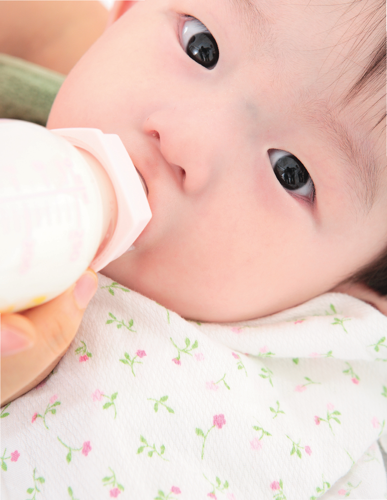

SHUTTERSTOCK

CHAPTERr

## INFANT FORMULA FEEDING

# H

uman milk is the best source of infant nutrition; however, when human milk is not available, iron-fortified infant formula is an appropriate alternative during the infant’s first year of life. The U.S. Food and Drug Administration (FDA) defines infant formula as “a food which purports to be or is represented for special dietary use

solely as a food for infants by reason of its simulation of human milk or its suitability as a complete or partial substitute for human milk.”1 NOTE: This chapter does not address the infant formula needs of and feeding protocols for premature and low-birth-weight infants or infants with medical conditions requiring exempt infant formulas. Since nutritional management of these infants may be complicated by treatment for existing medical conditions, WIC counselors must consult with and follow the recommendations of the infant’s health care provider when counseling parents and caregivers.

###### This chapter reviews:

QTypes of infant formulas QInfant formula additives QFormula feeding in the first year QFormula feeding recommendations QCommon feeding concerns QSelection, preparation, storage, and

warming of infant formula

QGuidelines for using infant formula when access to kitchen appliances is limited

QGuidelines for infant formula use after a

natural disaster or power outage QWeaning from the bottle

###### Types of Infant Formulas

The Food, Drug, and Cosmetic Act mandates that all infant formulas marketed in the United States provide the same nutrition for healthy, full-term infants.2 These nutrient specifications include minimum amounts for 29 nutrients and maximum amounts for 9 of those nutrients. If an infant formula does not contain these nutrients at or above the minimum level or within the specified range, it is an adulterated product unless the formula is “exempt” from certain nutrient requirements.3 Because infant formulas are often the only source of nutrition for infants, the FDA monitors infant formula manufacturers very closely to ensure that their products provide the appropriate nutrition for all infants.4

The American Academy of Pediatrics (AAP) recommends that, if human milk is not available, iron-fortified cow’s milk-based infant formula is the most appropriate milk to give infants up to 12 months of age who either are not breastfed or are partially breastfed. Infant formulas commercially

available may be cow’s milk-based, soy-based, and hypoallergenic. Other formulas are designed for infants with special medical or dietary needs. The manufacturers’ websites can be accessed for the most up-to-date information. Parents and caregivers should be informed that generic brand infant formulas are nutritionally equivalent to national brand infant formulas. All infant formulas marketed in the United States must meet the nutrient specifications listed in FDA regulations. Infant formula manufacturers may have their own proprietary formulations, but the formulas must contain at least the minimum levels of all nutrients specified in FDA regulations without going over the maximum levels, when maximum levels are specified.5

Each WIC State agency determines its allowed formula list.

###### Cow’s Milk-Based Infant Formula

The most common infant formulas are made from

modified cow’s milk with added carbohydrate (usually lactose), vegetable oils, and vitamins and minerals.6 Casein is the predominant protein in cow’s milk.7 Since the primary protein in human milk is whey rather than casein,8 some milk-based formulas have been altered to contain more whey. Despite that alteration, the protein in formula is significantly different from that in human milk because of its different amino acid and protein composition.9 In milk-based formula, about 9 to 12 percent of the kilocalories are provided by protein, 44 to 50 percent by fat, and 40 to 45 percent by carbohydrate. Infant formula is lower in fat and higher in carbohydrate, protein, and minerals than human milk.10

###### Iron-Fortified Infant Formula

Use of an iron-fortified formula ensures that formula-fed infants receive an adequate amount of iron, an important nutrient during the first year. Iron deficiency is associated with poor cognitive development and performance in infants.

ä See also: Chapter 1, “Iron,” pages 18–19. Look for this or a similar statement on the front of the formula package: “Infant Formula with Iron.” All iron-fortified infant formulas must have this type of statement on the package.

###### Low-Iron Infant Formula

There is no indication for use of low-iron infant formula under any circumstance. If an infant formula has low iron content, the package must carry this or a similar statement: “Additional Iron May Be Necessary.” Some parents and caregivers have requested or used low-iron formula in the past because they believed that the iron in the regular formula caused gastrointestinal problems such as constipation, colic, diarrhea, or vomiting.11 Studies have shown, however, that these gastrointestinal problems are no more frequent in infants consuming iron-fortified formula than in those who feed on low-iron infant formula.12 Therefore, only iron-fortified infant formula should be used during the first year of life, regardless of the age when formula is started.

###### Soy-Based Infant Formula

Soy-based formulas were developed for infants who cannot tolerate cow’s milk formulas. An infant’s symptoms must be evaluated carefully before advising a change from cow’s milk to soy formula, as spitting up, normal gas, and constipation are not indications to make such a change. True intolerance of cow’s milk protein usually presents with more significant symptoms, often in the first few months of life:

QSkin rashes QSwelling of mucus membranes QAcute vomiting QAcute respiratory wheezing

Soy infant formulas contain soy protein isolate made from soybean solids as the protein source, vegetable oils as the fat source, added carbohydrate (usually sucrose and/or corn syrup solids), and vitamins and minerals. These formulas are fortified with the essential amino acid methionine, which exists in very low quantities in soybeans. In soy formulas, 10 to 11 percent of the kilocalories are provided by protein, 45 to 49 percent by fat, and 41 to 43 percent by carbohydrate.13 All soy-based infant formulas are fortified with similar amounts of iron as milk-based, iron-fortified infant formulas.14

The AAP has stated that soy-based infant formulas are safe and effective alternatives to cow’s milkbased formulas but have no advantage over them. There have been concerns that infants who consume soy formulas could develop soy allergies. However, it is unclear whether soy formula predisposes infants to soy allergies. Studies have shown there is no cross-reactivity between cow’s milk allergy (CMA) and soy milk allergy, but about 10 to 14 percent of infants who are allergic to cow’s milk protein will develop an allergy to soy milk protein as well.15 If an infant is found to be truly allergic to cow’s milk protein, then an alternate formula should be considered—for example, extensively hydrolyzed or amino acid–based formula. ä See also: “Protein Hydrolysate and Amino Acid-Based Infant Formula,” pages 95–96.

Soy-based infant formulas may be recommended in the following situations:16

QFull-term infants with galactosemia, a rare metabolic disorder, or hereditary lactase deficiency ä See also: Chapter 3, “Metabolic Disorders,” page 76.

QInfants with documented IgE-mediated allergy to cow’s milk protein ä See also: “Why Does My Infant Have an Allergy?,” below.

The use of soy-based infant formulas is not recommended in the following situations:17 QFor a preterm infant with a birth weight less than

1,800 grams QWhen an infant has colic or allergy QWhen an infant has documented cow’s milk

protein-induced enteropathy or enterocolitis

###### Protein Hydrolysate and Amino Acid-Based Infant Formula

A number of infant formulas have been developed,

labeled, and marketed for infants with allergies or intolerances to milk- or soy-based formulas, or for infants with a family history of allergies. These formulas vary in the degree to which the allergycausing protein has been modified. They may contain partially hydrolyzed protein, extensively hydrolyzed protein, or free amino acids. Extensively hydrolyzed and free amino acid-based infant formulas have been demonstrated to be tolerated by at least 90 percent of infants with clinically documented allergies.18

In making infant formula, cow’s milk proteins are broken down so that they are unlikely to cause an allergic reaction. The process of breakdown is called protein hydrolyzation. It can be partial or extensive, depending on the degree of hydrolysis and on a filtering process called ultrafiltration. The probability of an infant formula causing a reaction decreases as the hydrolysis and filtration increase.19

###### W hy Does My Infant Have an Allergy?

There are two broad groups of immune system reactions that can cause food allergies in infants: immunoglobulin E (IgE)–mediated and non-IgEmediated.

QIgE-mediated reaction. The gastrointestinal tract processes food, which is then absorbed into the body. During that process, the gastrointestinal tract neutralizes foreign antigens, or toxins, and blocks them from entering circulation. An infant’s system is immature and cannot always block those toxins. Most infants develop tolerance against the antigens. But if they cannot, their system will overproduce IgE antibodies. These antibodies in turn react with food antigens to cause an allergic reaction. An allergic reaction may occur as soon as the infant feeds—then it may subside and not appear again. Or it may be immediate, followed

by ongoing symptoms such as runny nose, wheezing, hives, eczema, vomiting, and/or difficulty breathing.

QNon-IgE-mediated reaction. This reaction is less understood. Scientists believe that it involves the T-cell, a type of white blood cell that is key to immunity in the body. A nonIgE reaction is typically delayed in onset, and may occur within 4 to 28 hours after the infant has consumed food. Symptoms include diarrhea, malabsorption, colitis, and GERD (gastroesophageal reflux disease) or esophagitis.

NOTE: In all cases of allergic reaction, a health care provider should be contacted for diagnosis and treatment.

Source: R. E. Kleinman and F. R. Greer, eds., Pediatric Nutrition, 7th ed. (Elk Grove Village, IL: American Academy of Pediatrics, 2014), 848–50.

###### Enteropathy: Any condition or disease that keeps the gastrointestinal tract from functioning normally Enterocolitis: Inflammation of the gastrointestinal tract

Formulas are considered hypoallergenic if they have demonstrated with 95 percent confidence that at least 90 percent of infants with documented cow’s milk allergy will not react with defined symptoms to the formula under double-blind, placebo-controlled conditions.

NOTE: Parents and caregivers should be discouraged from automatically changing infant formula without talking to a health care provider.

The AAP recommends that the use of hypoallergenic infant formulas be limited to infants with welldefined clinical indications.20 If hypersensitivity is diagnosed, a physician may change the infant formula prescribed. The AAP states that formula-fed infants with clinically confirmed CMA may benefit from the use of a hypoallergenic formula that is extensively hydrolyzed or, if symptoms persist, a formula made from free amino acids.21 A soy-based formula may also be beneficial, especially for infants with IgE-associated symptoms.22

Once an infant begins feeding with a hypoallergenic formula, improvement is usually seen within 2 to 4 weeks. Hypoallergenic infant formulas made from extensively hydrolyzed protein or free amino acids may be used for infants with non-IgE-associated symptoms or for those with a strong family history of allergy. These formulas are significantly more expensive than either milk-based or soybased formulas. In addition, their taste is altered significantly during protein hydrolysis, and they may not be well accepted by some infants.

###### Lactose-Reduced or Lactose-Free Infant Formula

Lactose is the major carbohydrate in cow’s milkbased infant formulas. An enzyme called lactase is needed to break down lactose. A very small number of infants produce insufficient amounts of lactase. These infants cannot metabolize lactose or galactose, a component of lactose.23

Several cow’s milk-based formulas are available for infants with clinically documented lactose intolerance. Some specialty infant formulas contain other carbohydrates in the form of modified

###### W hen Is Relactation Appropriate?

Relactation is the return to breastfeeding after an infant has already weaned. Sometimes when an infant weans early, he or she experiences difficulty adjusting to infant formula. In that case, a mother may wish to reestablish breastfeeding. Even when a mother’s milk supply has been reduced or has dried up, she may still be able to rebuild it. A WIC-designated breastfeeding expert can guide a mother on this process.

The return to breastfeeding works best if the mother is motivated to follow the key steps, including breast stimulation, and to receive continued support. ä See also: Chapter 3, “Relactation,” page 75.

cornstarch, tapioca dextrin, or tapioca starch. In addition, soy-based infant formulas are lactosefree and may be used for infants with clinically documented lactose intolerance.

It is important to note that true lactose intolerance is rare. Symptoms of lactose intolerance such as diarrhea, flatulence, and abdominal bloating are similar to symptoms that an infant may have when ill. Consultation with a health care provider is encouraged to determine whether lactose intolerance is present, or whether symptoms are related to other causes such as gastrointestinal infection. Therefore, parents and caregivers should not change formulas without consulting their health care provider.24

Premature infants may have lower levels of lactase than term infants, proportional to their degree of prematurity, since lactase develops during the last trimester of pregnancy. However, it is recommended that premature infants not be fed lactose-free formula, but rather human milk or formula containing lactose. Lactose intolerance may develop in later childhood (above 2 years of age in some susceptible populations) or adulthood, but very few term infants have true lactose intolerance.25 Between

1 and 2 years of age, there may be decreased lactase activity in approximately 20 percent of children within certain ethnic groups, including Asians, African Americans, and Hispanics.26

safety standards identical to those of traditional crops so that both formulas are equally safe and effective. In particular, GE formula manufacturers must follow a detailed program for toxicity testing.30

Always discuss the need for lactose-free formulas with a health care provider. According to the AAP, those who do require a lactose-free formula generally can be rechallenged with a lactose-containing formula after 1 month.

###### Formulas for Medical and Dietary Needs

An exempt infant formula is one that is represented and labeled for use by infants who have inborn errors of metabolism or low birth weight, or who otherwise have unusual medical or dietary problems.27 Exempt infant formulas have to be prescribed by the infant’s primary care physician.

There are many varieties of specially designed infant formulas developed for infants with special medical conditions. These may include metabolic and modular formulas.28

According to the FDA, “[b]ecause infancy is a unique, vulnerable period when critical growth and development occur, great care is necessary to ensure the safety of all modifications to infant formula, even if the purpose of the modification is to more closely mirror the composition and health benefits of human milk.” In addition to setting safety standards for the ingredients that make up infant formula, the FDA also sets guidelines for manufacturer labeling of the formulas.31

###### Carotenoids

All infant formulas are required to contain the nutrient vitamin A; additional vitamin A may be added to infant formula in the form of carotenoids. Carotenoids include the nutrients lutein, betacarotene, and lycopene, which are naturally found in human milk.32 ä See also: “Chapter 1, “Vitamin A,” page 11.

###### Infant Formula Additives

Infant formula manufacturers add a variety of nutrients to infant formula to mimic the composition and quality of human milk.29 The nutrients in these genetically engineered (GE) formulas may include carotenoids, long-chain polyunsaturated fatty acids, nucleotides, prebiotics, and probiotics. Some formulas are made with non-genetically modified organisms (non-GMOs) and also contain these key nutrients. While the nutritional value of formula made with non-GMOs is the same as in the GE formula, the ingredients come from traditionally bred crops. The use of genetic engineering, or genetically modified organisms (GMOs), is prohibited in organic products. The FDA ensures that formulas created from GE crops meet

###### Arachidonic Acid and Docosahexaenoic Acid

Long-chain polyunsaturated fatty acids include the essential fatty acids linoleic acid (LA) and alphalinolenic acid (ALA), along with their derivatives, arachidonic acid (ARA) and docosahexaenoic acid (DHA).33 These nutrients are naturally found in human milk. Manufacturers began adding DHA and ARA to infant formulas sold in the United States in 2002 after the fatty acid additions were designated as safe.34 Research demonstrating better cognitive function and visual acuity in breastfed infants has led to support for the addition of ARA and DHA to infant formula.Therefore, almost all brands of formula sold in the United States are fortified with ARA and DHA.35 The AAP does not have an official

Metabolic formulas: Special formulas for infants born with metabolic disorders such as phenylketonuria (PKU) and maple syrup urine disease (MSUD)

Modular formulas: Nutritionally incomplete formulas that may be mixed with other products before use (e.g., protein, carbohydrate, or fat modulars); they may be used to increase formula concentration.

Carotenoids: A group of natural pigments with potential health benefits. The group includes vitamin A. ARA and DHA: Arachidonic acid (ARA) and docosahexaenoic acid (DHA) are major fatty acids found in human milk.

position on supplementing full-term infants with long-chain polyunsaturated fatty acids like DHA and ARA.36

###### Nucleotides, Prebiotics, and Probiotics

Nucleotides are metabolically important compounds that are the building blocks of ribonucleic acid (RNA), deoxyribonucleic acid (DNA), and adenosine triphosphate (ATP), and they are present in human milk. It is thought that nucleotides may enhance immune function and development of the gastrointestinal tract and may be beneficial when added to infant formula.37

Prebiotics are nutrients that support the growth of “good” bacteria in the intestines, while probiotics are nonpathogenic bacteria, including bifidobacteria and lactobacilli. Research has shown that probiotics may lower the risk of conditions such as food-related allergies and asthma. They may also help prevent or treat eczema or infectious diarrhea.38

Since all the organisms above are present in the intestines of breastfed infants and may protect an infant from infection by other pathogenic bacteria, researchers have studied the effect of adding the organisms to infant formula. Subsequently, infant formula manufacturers have included these compounds in many formulas. While this is promising, more research is needed to confirm the benefits of nucleotides, prebiotics, and probiotics in formula.

Parents and caregivers should discuss use of a probiotic-fortified formula with a health care provider before giving it to an infant.39

###### Formula Feeding in the First Year

The amount of formula needed by an infant during a 24-hour period will vary depending on the infant’s age, size, level of activity, metabolic rate, medical conditions, and other source(s) of nutrition (human milk and/or complementary foods). Infants have the ability to regulate their food intake relative to

their nutritional needs. In doing so, they express signs of hunger and satiety and expect their parentor caregiver to respond to these cues. Thus, unless medically indicated otherwise, infants should be fed on demand—that is, when they indicate hungerand should not be forced to follow a strict feeding schedule or to finish a bottle when they are no longer hungry.

###### Read the Formula Label

When reading a formula label, the following information should be checked:

QThe “use by” date, which is required by the FDA (Do not buy outdated formula, as it may not provide all the necessary nutrients.) QPreparation/mixing instructions, as well as

storage guidelines

The health care provider should always be consulted about the type and content of formula that is right for the individual infant.

Source: “FDA Takes Final Step on Infant Formula Protections,” U.S. Food and Drug Administration, last modified August 24, 2016, http://www.fda.gov/ ForConsumers/ConsumerUpdates/ucm048694.htm.

###### Responding to Hunger and Satiety Cues

Infants, especially newborns, may not be consistent or follow a timed schedule as to when and how often they want to eat. A healthy infant eventually establishes an individual pattern according to his or her growth requirements. It is normal for infants to have fussy times. Infants may cry for reasons other than being hungry. They may simply want to be held or need to be changed. Parents and caregivers should be encouraged to learn to recognize and respond appropriately to the infant’s cues of hunger and satiety or fullness, as outlined in detail in Chapter 2, with examples below.40 ä See also: Chapter 2, “Hunger and Satiety Cues by Age,” pages 38–39.

###### Responding to Signs of Hunger

If an infant is hungry, parents and caregivers may see the infant sucking on a fist, rooting, flexing arms and legs, and more. The parent or caregiver should

respond to such early signs with a feeding and not wait until the infant is upset and crying from hunger. Here are the cues to watch for:

QThe infant opens and closes mouth. QThe infant brings hands to face. QThe infant flexes arms and legs. QThe infant roots around on the chest of whoever is

carrying them. QThe infant makes sucking noises and motions. QSucks on lips, hands, fingers, toes, toys, or clothing.

###### Responding to Signs of Satiety

Encourage the parent or caregiver to feed the infant only until the infant indicates fullness. Signs of fullness include a decrease in sucking, spitting out the nipple, and more. Here are the cues to watch for:

QThe infant slows or decreases sucking. QThe infant extends arms and legs. QThe infant extends/relaxes fingers. QThe infant pushes/arches away. QThe infant turns head away from the nipple. QThe infant decreases rate of sucking or stops

sucking when full.

If they are not hungry, infants may not eat the full portions offered. A parent or caregiver should never force an infant to finish what is in the bottle. Infants are the best judges of how much they need. They may want to eat less if they are not feeling well and may want more if they are in a growth spurt.41

NOTE: If it is perceived that a parent or caregiver is frustrated or having difficulty coping with an infant’s fussiness or crying, the parent or caregiver should be referred to a health care provider for further assessment and assistance.

###### Feeding Frequency and Amount of Formula

Newborn formula-fed infants are generally fed infant formula as often as exclusively breastfed infants are fed human milk, for a total of 8 to 12 feedings within 24 hours. These young infants need to be fed small amounts of formula often throughout the day and night because their stomachs cannot hold a large quantity.

NOTE: If a newborn infant sleeps longer than 4 hours at a time, the infant should be woken up and offered a bottle.

There are some exceptions to using the on-demand feeding approach. One such case would be a young infant who is sleepy or placid. Some infants may either fall asleep after feeding on a bottle for a short time, may not be easy to wake for a feeding every 2 to 3 hours, or may not normally show signs of hunger. To ensure that such infants obtain sufficient nourishment, mothers should wait no more than 4 hours (or sooner if the infant’s health care provider indicates) between feedings until the infant’s first well checkup (between 2 and 4 weeks of age). At that time, the infant’s health care provider should be consulted about continuing that practice based on the infant’s weight gain. ä See also: Chapter 3, “Waking Sleepy or Placid Infants to Feed,” page 61.

ISTOCK

From birth to 6 months of age, infants grow rapidly and will gradually increase the amount of infant formula they can consume at each feeding, the time between each feeding, and the total amount of formula consumed during a 24-hour period. Parents or caregivers should be encouraged to prepare 2 to 3 ounces of infant formula every 2 to 3 hours at first. More should be prepared if the infant seems hungry, especially as the infant grows.42

The partially breastfed infant will consume less infant formula than given in these examples, depending on the frequency of breastfeeding. At 6 months of age, infants begin to shift from dependence on human milk or infant formula as the primary nutrient source to dependence on a mixed diet including complementary foods. Thus, the consumption of human milk or formula tends to decrease as the consumption of complementary foods increases.

Feeding throughout the night is not usually necessary for the older infant with a normal growth rate.

NOTE: An infant whose parents or caregivers complain of the infant’s sleepiness or lack of hunger should be referred to a health care provider for further assessment.

###### Formula Feeding Recommendations

Parents and caregivers can help their formula-fed infants have a positive feeding experience by creating a relaxing setting and giving the infant tender loving care. A comfortable feeding place should be established, and the parent or caregiver should interact with the infant in a calm and relaxed manner while both preparing for and during a feeding by cuddling and talking gently to the infant. Throughout the feeding, the infant should be shown love and attention. This will decrease fussiness and will not “spoil” the infant.

###### Guidelines for Safe, Effective Bottle-Feeding

To make bottle-feeding safe and effective for infants, encourage parents and caregivers to take these steps:

###### WIC Infant Formula Calculator

The WIC Infant Formula Calculator is a web-based tool developed to help WIC staff determine the amount of infant formula that can be issued to parents and caregivers, consistent with WIC regulations.

The calculator can be accessed on the WIC Works Resource Center website:

https://wicworks.fns.usda.gov/resources/wicinfant-formula-calculator

For breastfeeding women who do not receive the fully breastfeeding package, WIC staff are expected to individually tailor the amount of formula the women receive based on the assessed needs of the breastfeeding infant. Staff should then provide the minimal amount that meets but does not exceed the infant’s nutritional needs.

QWash their hands with soap and water for 20

seconds before feeding.

QHold the infant in their arms or lap during the

feeding.

QEnsure that the infant is in a semi-upright position with the head tilted slightly forward, slightly higher than the rest of the body, and supported by the parent or caregiver with the infant’s head cradled in the crook of the parent or caregiver’s arm. QEnsure that the infant can look at the parent or caregiver’s face. Take care that the infant’s head is not tilted back or lying flat down; the liquid could enter the infant’s windpipe and cause choking.

QHold the bottle still and at an angle so that the end of the bottle near the nipple is filled with infant formula and not air, thus reducing the amount of air swallowed by the infant.

QStroke the infant’s cheek gently with the nipple to stimulate the rooting reflex, causing the infant to open his or her mouth to initiate feeding. QEnsure that the infant formula flows from the bottle properly by checking if the nipple hole is an appropriate size. ä See also: “Know the Correct Nipple Size,” page 101.

QTo burp effectively, a parent or caregiver should

gently pat or rub the infant’s back while the infant is held against the parent or caregiver’s shoulder and chest or supported in a sitting position in the parent or caregiver’s lap. Expect a small amount of spitting up from time to time. It is common in formula-fed infants.

QAn infant should be burped at a natural break in or at the end of a feeding to help remove swallowed air from the stomach. Avoid burping too often, which disrupts a good feeding. Burping at natural breaks helps slow the feeding, lessens the amount of air swallowed, and may help reduce gastroesophageal reflux and colic in some infants. ä See also: “Common Feeding Concerns,” this page.

QTake breaks during the feeding to socialize with the

infant, talking gently and smiling.

Throughout infancy, it is especially important that bottle-fed infants be fed in a position that both minimizes the chance of choking and allows the infant to have physical and eye contact with the parent or caregiver. When an infant is held closely and can establish eye contact, bonding between the dyad is enhanced. Older infants may prefer to hold the bottle themselves while in the parent or caregiver’s arms or lap or while sitting in an infant high chair.

###### Propping the Bottle Is Not Recommended

It is never appropriate to feed an infant by propping a bottle against a pillow or similar object:

QLiquid in the bottle can accidentally flow into the

infant’s lungs and cause choking.

QInfants can develop ear infections because fluid

enters the middle ear and cannot drain properly. QInfants may overfeed. QInfants do not receive human contact, which is

important to make them feel secure and loved.

Infants should not be given a bottle (whether propped or not) while lying down at nap time or bedtime43 or while lying or sitting in an infant car seat, carrier, stroller, swing, or walker. In addition to potentially causing choking or ear infection, these practices can lead to dental problems. ä See also: Chapter 6, “Oral Health,” pages 151–156.

###### Know the Correct Nipple Size

Nipples come in different sizes, with varying numbers of holes and flow speeds that range from slow to fast—and nipples can vary per manufacturer. It is important to tailor the nipple size to an infant’s needs and to change out the nipple as necessary for adequate feeding. The nipple should never be altered to increase or decrease its flow.

Follow these pointers to ensure the proper flow:

QWhen the bottle is held upside down, a few drops should come out and then stop; the falling drops should follow each other closely and not make a stream.

QThe nipple hole should not be too big or too small. Milk flows too fast through a large hole, and an infant could choke. Slow-flowing milk through a small hole will likely cause the infant to gulp air.

QBe sure to adjust the nipple ring on the bottle so that air can get into the bottle; otherwise, the nipple may collapse.

###### The health care provider can direct a parent or caregiver to the ideal nipple and also the best kind of bottle to use.

###### Common Feeding Concerns

The following feeding concerns may occur while a parent or caregiver is bottle-feeding an infant. The AAP recommends to address the concerns and to keep the infant calm and feeding well. It is important for parents and caregivers to burp an infant at intervals during feedings, to help eliminate air swallowed as the infant takes in food. Burping may also help with some of the other feeding points below.44

Q Hiccups. Most infants hiccup from time to time.

Usually the hiccuping bothers the parent or

caregiver more than the infant. If hiccups occur during a feeding, these actions can help:

- •Change the infant’s position.
- •Try to get the infant to burp.
- •Help the infant relax.
- •Wait until the hiccups are gone to resume feeding.

Q Choking. While it may seem that choking could happen only when an older infant graduates to complementary foods, parents and caregivers should be aware that infants could also choke while bottle-feeding. Because an infant’s airway is not always blocked off properly when swallowing, food can enter the airway and prevent breathing. While bottle-feeding, parents and caregivers should do the following to prevent choking:

- •Maintain a calm atmosphere during feeding time.
- •Never prop a bottle in an infant’s mouth.
- •Use a nipple with an appropriately sized hole so that the milk does not flow too quickly.
- •Refrain from feeding complementary foods to an infant who is not developmentally prepared.
- •Never feed an infant who is crying, laughing, walking, talking, or playing.

Q Spitting up and vomiting. It is normal for young infants to spit up a small amount of infant formula after feedings. Sometimes spitting up means the infant has eaten more than the stomach can hold; other times, the infant spits up while burping or drooling.45 Because the nose is connected to the back of the throat, spitting up can also come out of the nose instead of the mouth. As long as the infant seems comfortable and is eating well and gaining weight, spitting up shouldn’t be cause for concern.46ä See also: “Chapter 6, “Common Gastrointestinal Problems,” pages 160–164.

If the infant vomits forcefully, emptying the stomach contents, or if the parent or caregiver notices blood or a dark green color in the vomit, the health care provider should be contacted immediately.47

Q Diarrhea. Diarrhea isn’t just a loose stool;

it’s a watery stool that occurs up to 12 times

###### How to Minimize Spitting Up

While spitting up is to be expected, tips to minimize spitting up include:

QTry to feed the infant before hunger takes over. QEnsure that each feeding is a calm, quiet, and

leisurely session.

QAvoid distractions such as bright lights and

sudden noises.

QFeed the infant in small, more frequent

amounts.

QIf bottle-feeding, burp the infant about every 3

to 5 minutes.

QDo not feed while the infant is lying down. QHold the infant upright for about 20 to 30

minutes after every feeding session.

QRefrain from bouncing or swinging the infant,

or playing energetically after feeding.

QEnsure that the bottle’s nipple hole is the optimal size. ä See also: “Know the Correct Nipple Size,” page 101.

a day. Contact the health care provider if it is accompanied by lethargy and fever. Acute diarrhea can last several hours or days. Persistent diarrhea may last more than a week. The results can include dehydration, intestinal damage, and malnutrition.

Q Dehydration. If an infant vomits or develops diarrhea, dehydration is a danger. A parent or caregiver should watch for important signs and contact the health care provider if the following signs are present: 48

- •Lack of interest in feeding
- •Urinates infrequently and has fewer wet diapers
- •Dry mouth or eyes, so infant has fewer tears when crying
- •Loose stools if dehydration is caused by diarrhea; otherwise, decreased bowel movements

Q Dry stools. Although formula-fed infants tend to have more solid stools, about the firmness of peanut butter, those stools should be easy to pass and should appear to be hydrated. Stools that are difficult for an infant to pass and that are hard and dry, like marbles, signal constipation. Constipation can occur because an infant is not taking in enough human milk or formula, or the formula is not properly prepared and diluted.49 A health care provider should be contacted for guidance.

Q Excessive gas. It is natural for infants to produce gas. While some infants simply pass it, others have buildup and become extremely uncomfortable (see “Colic,” below). These special tips may help manage gas:50

- •Never overfeed an infant.
- •Carry the infant upright against the chest or shoulder so that gas bubbles can move up and around the infant’s intestinal curves instead of being trapped there.
- •Lay the infant on his or her back and move the infant’s legs back and forth in a cycling motion to help break up gas.

Q Cold or ear infection. If a cold or ear infection has set in, it may be hard for an infant to breathe and painful for him or her to swallow. Nasal congestion can be temporarily cleared with a bulb syringe prior to feeding, but a health care provider should be contacted for guidance.51

Q Hives or rash. A rash with raised, red bumpy areas may indicate hives. If the rash spreads over the infant’s body, this could be a reaction to milk or medication, or a response to a virus or other infection. If the rash remains localized, it could be caused by something the infant touched.52 In any case contact the infant’s healthcare provider for guidance.

Q Colic. If an infant cries persistently, first check to see if the stomach appears bloated and the infant extends or pulls up the legs as if experiencing pain. A health care provider should be contacted to make sure that the crying is not related to a serious medical condition, such as a hernia, and then the following tips may be tried:53

•For formula-fed infants, a pediatrician may recommend using a protein hydrolysate formula, which helps address food sensitivity

issues. If sensitivity has been causing the colic, a change should take place within a few days.

- •Infants should never be overfed; this causes discomfort. The rule of thumb is to start a new feeding 2 to 2½ hours after the last feeding was started.
- •The infant may be soothed by being walked in a carrier, close to the parent or caregiver’s body. The motion and body contact will be calming and reassuring, even if the colic continues.
- •Swaddling in a thin blanket helps an infant feel warm and secure, but be sure the infant’s hips are loose when wrapped, and that the infant is laid on his or her back. The AAP recommends swaddling for promoting sleep, but only up to 2 months of age. After that age, the infant could roll over and potentially suffocate.54

###### Colic a Mystery Ailment

Doctors are unsure what causes colic (persistent crying), but it is a common ailment: in the first few months of life, approximately one-fifth of all infants—and their parents or caregiversexperience the endless, distressed crying. Formula-fed infants seem to experience it more often than breastfed infants. The onset is usually in the evening, after about 6 p.m. See remedies above.

###### Selection, Preparation, Storage, and Warming of Infant Formula

To ensure that infant formula is safe for consumption, it must be properly selected, prepared, and storedand bottles must be properly sanitized. ä See also: “Appendix A, “Infant Feeding: Tips for Food Safety,” pages 223–224.

###### Selecting and Storing Cans of Infant Formula

Parents and caregivers should be encouraged to take these steps when selecting and using cans of infant formula55:

QCarefully check the “use by” date. This is the date after which a package or container of infant formula should not be fed to infants. It indicates that the manufacturer guarantees the nutrient content and the general acceptability of the formula quality up to that date. FDA regulations require this date to be specified on each container of infant formula.

QNever use cans that have dents, leaks, bulges, puffed ends, pinched tops or bottoms, or rust spots. These deformities in the can are indications that the product quality may be diminished and the product is unsafe.

QStore cans in a cool, indoor place—never in vehicles, garages, or outdoors. Extreme heat can affect the formula quality. However, do not refrigerate or freeze formula.

###### Keeping Bottles Clean

The AAP does not routinely recommend sterilizing bottles for healthy, term infants unless there is a concern for contamination.56 Bottles should be thoroughly washed using soap and hot water and bottle and nipple brushes, or cleaned in a dishwasher. These practices will effectively remove germs.

###### Preparing Infant Formula

Table 4.1, see page 105, provides general guidelines for preparing infant formula that comes in powdered, concentrated, or ready-to-feed forms. As noted by the AAP, different scoop sizes come with different kinds of powdered formulas, so exact measurements must be followed on individual labels.

Despite the general guidelines below for infant formula preparation, the parent or caregiver should always follow the manufacturer’s instructions for preparation or instruction from the health care provider. Although formula cans include written preparation instructions, parents and caregivers may not be able to read or understand them. WIC staff should assess if parents or caregivers have difficulty correctly diluting concentrated or powder forms of formula

and determine whether ready-to-feed formula is appropriate. ä See also: Chapter 8, “Food Safety,” pages 191–198.

Note: Water contaminants cannot be removed by heating or boiling the water.

Health care providers do not recommend homemade infant formulas, since they tend to be deficient in vitamins and other important nutrients.

###### Using Fluoridated Water to Mix Infant Formula

The FDA and the U.S. Environmental Protection Agency (EPA) are both responsible for the safety of drinking water. The EPA regulates public drinking water (tap water); the FDA regulates bottled drinking water.57

Ready-to-feed infant formulas and other infant foods are generally manufactured with nonfluoridated water. However, although fluoride is not specifically added to formulas during production, some of the ingredients besides water naturally contain fluoride.58 Supplementary fluoride should not be given to a formula-fed infant during the first 6 months of life. After that, supplementation depends on the amount of fluoride in the water used for formula preparation. Given the variability of exposure to fluoride from formula mixtures, a parent or caregiver should consult the infant’s health care provider for advice on fluoride.

If the fluoride content of the home drinking water is unknown, the local water supplier or health department should be contacted for a report. In the case of a private well, the water should be tested by a certified private laboratory.59 ä See also: Chapter 8, “Well Water Contaminants,” page 199.

Certain types of home water treatment systems, such as reverse osmosis and distillation units, may remove fluoride from the water. Carbon and charcoal water filtration systems (the most common types used in homes) and water softeners do not significantly change the fluoride content of water.60

###### TABLE 4.1 –Formula Preparation Guidelines

|Type of infant formula|Mix|Add|
|---|---|---|
|Powdered formula|Because scoop sizes vary, follow instructions on label|Appropriate amount of water as noted on label|
|Concentrated formula|Equal part concentrated liquid|Equal part water|
|Ready-to-feed formula|Ready for infant to consume as is|None|

Sources: S. P. Shelov, ed., Caring for Your Baby and Young Child: Birth to Age 5, 6th ed., American Academy of Pediatrics (New York: Bantam Books, 2014), 120–21; R. E. Kleinman and F. R. Greer, eds., Pediatric Nutrition, 7th ed. (Elk Grove Village, IL: American Academy of Pediatrics, 2014), 71–72.

NOTE: Parents and caregivers should discuss the use of all formulas and potential filtration products with a health care provider.

Manufacturers of bottled water are not required to include fluoride content on the label unless they have added fluoride to the water. Thus, parents and caregivers using bottled water to mix infant formula and to prepare food should contact the manufacturer to determine its fluoride content, or they should have it tested.

In general, it is safe to use bottled water to prepare infant formula as long as parents and caregivers understand key points:

QThe amount of fluoride varies in different

bottled waters.

QIf an infant is consuming only formula mixed with fluoridated water, there is an increased risk of mild dental fluorosis.61

QBottled waters labeled as deionized, purified, demineralized, or distilled contain no to very small amounts of fluoride, unless fluoride is specifically listed. Using such products for mixing formula may lessen an infant’s chance of developing fluorosis.62

Without knowing the fluoride content in bottled water, it is impossible for a health care provider to adequately assess the amount of fluoride the infant is ingesting. Bottled waters manufactured and marketed specifically for infants may contain fluoride and must be labeled as such. The FDA recommends that manufacturers do not add more than 0.7 milligrams of fluoride per liter of water to bottled waters.

###### Storing Infant Formula

Prepared infant formula is a highly perishable food that must be stored properly for safe consumption. Parents and caregivers should always consult their health care provider and follow the manufacturer’s label instructions for infant formula storage procedures. Several guidelines should be followed to prevent spoilage:

QBottles and their parts should be thoroughly cleaned and sanitized before reuse. For more information visit: https://www.cdc.gov/ healthywater/hygiene/healthychildcare/ infantfeeding/cleansanitize.html

QBottles of prepared infant formula should be stored in a properly functioning refrigerator until ready to use. Bacterial growth is reduced when formula is kept in a refrigerator at temperatures of 40 degrees Fahrenheit or below. (A refrigerator thermometer should be used to monitor the refrigerator’s temperature.)

QPowdered infant formula should be tightly covered

and stored in a cool, dry place.

QFormula should be used within 24 hours of

preparation to avoid bacterial contamination.63 QDo not freeze infant formula, as it may cause a

separation of the product’s components.64

QPrepared formula should be taken out of the refrigerator no more than 2 hours before a feeding. Once the feeding has begun, the contents should be fed within an hour or discarded.65

QAny formula remaining after a feeding should be discarded. The mixture of formula with saliva provides an ideal breeding ground for diseasecausing microorganisms.

###### Special Concerns About Infant Formula

Infant formula is a safe and effective alternative for infant nutrition when breastfeeding is not possible.

To ensure the safety of infant formula, the FDA in 2014 finalized additional guidelines, specifically requiring that infant formula must test for Salmonella and Cronobacter, two bacteria that can cause severe illness in infants. In addition, manufacturers must test their products’ nutrient content to demonstrate that their formulas “support normal physical growth.”

Formula is a perishable food, and therefore it must be prepared, handled, and stored properly and in a sanitary manner to be safe for consumption. Infants can be exposed to harmful bacteria from a dirty environment, pets, and other family members.

It is very important to prepare infant formula properly. Improper mixing of infant formula can lead to potential health risks. Increasing the water-to-formula ratio (i.e., adding too much water) is never recommended because it will yield

a lower-calorie formula, which will not meet the infant’s caloric requirements. Decreasing the water-to-formula ratio (i.e., not adding enough water) may be recommended for infants who are failing to thrive, but it should only be done when recommended by the health care provider. Infants consuming incorrectly reconstituted formula may develop serious health problems. Underdiluted infant formula puts an excessive burden on an infant’s kidneys and digestive system and may lead to dehydration. This problem becomes worse if the infant has increased fluid needs because of fever or infection. Overdiluted infant formula may contribute to growth problems, nutrient deficiencies, and water intoxication.

Sources: U.S. Food and Drug Administration,“Current Good Manufacturing Practices, Quality Control Procedures, Quality Factors, Notification Requirements, and Records and Reports for Infant Formula,”

Federal Register 61, no. 132 (July 9, 1996), accessed September 2016, https://www.federalregister.gov/ articles/2014/06/10/2014-13384/current-good

- -manufacturing-practices-quality-control-procedures
- -quality-factors-notification; HMP Communications, “A Comprehensive Overview of Store Brand Infant Formula,” Supplement to Consultant for Pediatricians, February 2014, 2, https://s3.amazonaws.com/Consultant/ Perrigo_Advert.pdf.

ä See also: Chapter 8, “Safely Preparing and Storing Human Milk and Infant Formula,” pages 192–193.

###### Warming Infant Formula

The following guidelines are recommended for warming refrigerated infant formula:

QFor infants who prefer a warmed bottle, warming should take place immediately before serving. QA safe method is to hold the bottle under warm,

running tap water. Next, swirl the bottle contents and test the temperature by squirting a couple of drops of formula onto the back of the wrist. The

formula temperature must always be tested prior to a feeding to make sure it is not too hot or cold.

QOnly the amount that an infant is likely to consume

at one feeding should be warmed.

QNever use a microwave to warm formula. The liquid may become overly hot and remain hot even after the bottle feels cool.

NOTE: Infants have been seriously burned by liquids warmed in microwave ovens. Covered bottles, especially vacuum-sealed and metal-capped bottles of ready-to-feed infant formula, can explode when heated in a microwave.

###### Underdiluted: Containing too little water. Underdiluted infant formula can burden an infant’s kidneys. Overdiluted: Containing too much water. Overdiluted infant formula may lead to nutrient deficiencies.

###### Guidelines for Using Infant Formula When Access to Common Kitchen Appliances Is Limited

The following guidelines regarding use of standard milk- and soy-based infant formulas are recommended for parents and caregivers who have limited access to a refrigerator or stove, or whose appliances are not functioning properly (e.g., the refrigerator is not keeping foods at or below 40 degrees Fahrenheit).

QIf powdered infant formula is used, prepare one bottle at a time. Fill it with the approximate amount of formula an infant can consume in one feeding. The powder must be scooped from the can with a clean, dry scoop. Ensure that no liquid enters the can; liquid will facilitate bacterial growth and spoil of the formula.

QAlternatively, ready-to-feed infant formula in

individual servings can be used.

QUse formula immediately after it is prepared or

after a ready-to-feed container is opened.

QDiscard any formula that has been sitting at room

temperature for more than 2 hours.66

QOnce the feeding has begun, the contents should

be fed within an hour or discarded.67

###### Natural Disaster or Power Outage: Infant Formula Guidelines

Breastfeeding is the best infant feeding option for an infant during a natural disaster situation, but formula can be safely used. The Centers for Disease Control and Prevention recommends taking the following actions for ensuring an infant’s safe feeding after a natural disaster or during a power outage:68

QContinue breastfeeding QUse ready-to-feed formula if possible. QUse bottled water to prepare powdered or liquid

concentrated infant formula. If bottled water or ready-to-feed formulas are not available, discuss options with a health care provider.

QClean bottles and nipples with bottled, boiled,

or treated water before each use.

###### Traveling With Infant Formula

When traveling with an infant, a can of powdered infant formula will help the parent or caregiver make formula on demand and only in the amount that an infant is likely to consume at one feeding. These tips for preparing formula for a trip:

QPack a can of powdered infant formula. Alternatively, put the required scoops of formula into clean bottles, using the mixing amounts as instructed.

QBring the required measured amount of water

in clean bottles.

QMix the water and formula into a single bottle

when ready to feed.

QThe more expensive option is to buy

prepackaged bottles of ready-to-feed formula. QIt is not recommended to travel with bottles of

prepared infant formula.

QFor information on air travel with formula, go to the TSA (Transportation Security Administration) page “Traveling with Children,” at https://www.tsa.gov/travel/ special-procedures/traveling-children.

Sources: S. P. Shelov, ed., Caring for Your Baby and Young Child: Birth to Age 5, 6th ed., American Academy of Pediatrics (New York: Bantam Books, 2014), 185–86; R. E. Kleinman and F. R. Greer, eds., Pediatric Nutrition, 7th ed. (Elk Grove Village, IL: American Academy of Pediatrics, 2014), 68.

QDiscard all infant bottles, nipples, and pacifiers that have come in contact with flood waters or debris.

QWash hands before breatfeeding, preparing formula and prior to feeding an infant. Sixty percent alcohol-based hand sanitizer can be used if the water supply is limited.69

ä See also: Chapter 8, Food Safety, “Parasitic, Bacterial, and Viral Contaminants,” pages 201–202.

###### No Whole Cow’s Milk in the First Year

The AAP Committee on Nutrition recommends that whole cow’s milk not be fed to infants during the first year of life. Iron-fortified infant formulas are preferred for infants not breastfed or partially breastfed for a number of nutritional and medical reasons. ä See also: Chapter 5, “Beverages,” page 129.

Source: R. E. Kleinman and F. R. Greer, eds., Pediatric Nutrition, 7th ed. (Elk Grove Village, IL: American Academy of Pediatrics, 2014), 78.

###### Weaning From the Bottle

The AAP recommends weaning infants who are bottle-fed by 15 months of age and no later than 18 months.70 Older infants who bottle-feed longer than this may be prone to excessive milk intake and to iron deficiency because they are not consuming

complementary iron-rich foods. The sooner the infant is weaned, the easier it is. The process can begin as early as 6 months of age, when a parent or caregiver can begin introducing a cup.71 Weaning from the bottle can take place while the infant learns to drink from the cup and tries other new foods. By 12 to 14 months of age, most older infants have mastered cup feeding and are ready to leave the bottle behind. If the older infant insists on a bottle, a slower process may be necessary: the midday bottle may be eliminated first, then the evening and morning bottles, and finally the night bottle. By 12 months of age, an older infant no longer needs to feed at night, and any late-night milk that remains on the teeth can cause tooth decay. If an infant takes milk before bedtime, the parent or caregiver must clean the teeth with either soft gauze or a soft toothbrush. A plush toy or blanket may be used to replace the comfort of an evening milk snack. ä See also: Chapter 6, “Oral Health,” pages 151–156.

###### Endnotes

- 1 U.S. Code, Title 21—Food and Drugs, Chapter 9, Federal Food, Drug, and Cosmetic Act, Subchapter II Section 321, Paragraph z, accessed September 2016, http://uscode.house.gov/view. xhtml?req=granuleid%3AUSC-prelim-title21-chapter9&saved=%7CKGluZmFudCBmb3JtdWxhKQ%3D%3D %7CdHJlZXNvcnQ%3D%7CdHJ1ZQ%3D%3D%7C13%7Ctrue%7Cprelim&edition=prelim.
- 2 U.S. Code, Title 21—Food and Drugs, Chapter 9, Federal Food, Drug, and Cosmetic Act, Subchapter II, Section 321, Paragraph z.
- 3 “Questions & Answers for Consumers Concerning Infant Formula,” FDA (U.S. Food and Drug Administration), accessed September 2016, http://www.fda.gov/food/foodborneillnesscontaminants/ peopleatrisk/ucm108079.htm.
- 4 U.S. Food and Drug Administration, “Electronic Code of Federal Regulations,” Title 21, Parts 106 and 107, accessed September 2016, http://www.ecfr.gov/cgi-bin/text-idx?SID=e293e8169a366e32e533b69dacbaa26 2&mc=true&tpl=/ecfrbrowse/Title21/21cfr106_main_02.tpl.
- 5 “Questions & Answers for Consumers Concerning Infant Formula,” FDA.
- 6 L. K. Mahan and J. L. Raymond, Krause’s Food & the Nutrition Care Process, 14th ed. (St. Louis, MO: Elsevier, 2017), 305.
- 7 F. Porto and D. M. DiMaggio, The Pediatrician’s Guide to Feeding Babies & Toddlers (Berkeley, CA: Ten Speed Press, 2016), 21.
- 8 Mahan and Raymond, Krause’s Food & the Nutrition Care Process, 305.
- 9 R. E. Kleinman and F. R. Greer, eds., Pediatric Nutrition, 7th ed. (Elk Grove Village, IL: American Academy of Pediatrics, 2014), 70.
- 10 Duggan et al., eds., Nutrition in Pediatrics, 5th ed. (Shelton, CT: People’s Medical Publishing House, 2016), appendix III.
- 11 U.S. Code, Title 21—Food and Drugs, Chapter 1, Part 107, Infant Formula, Subpart B Labeling, Part 107.10 Nutrient Information, last modified April 1, 2016, http://www.accessdata.fda.gov/scripts/cdrh/cfdocs/ cfcfr/CFRSearch.cfm?fr=107.10.
- 12 Kleinman and Greer, Pediatric Nutrition, 71–72.
- 13 Duggan et al., Nutrition in Pediatrics, appendix III.
- 14 Kleinman and Greer, Pediatric Nutrition, 71–72.
- 15 Kleinman and Greer, Pediatric Nutrition, 74.
- 16 J. Bahatia, F. Greer, and AAP Committee on Nutrition, “Clinical Report: Use of Soy Protein-Based Formulas in Infant Feeding,” Pediatrics 121, no. 5 (May 2008): 1062–68, http://pediatrics.aappublications. org/content/pediatrics/121/5/1062.full.pdf; Mahan and Raymond, Krause’s Food & the Nutrition Care Process, 306; Kleinman and Greer, Pediatric Nutrition, 74.
- 17 Bahatia, Greer, and AAP Committee on Nutrition, “Clinical Report: Use of Soy Protein-Based Formulas in Infant Feeding,” 1062–68.
- 18 S. P. Shelov, ed., Caring for Your Baby and Young Child: Birth to Age 5, 6th ed., American Academy of Pediatrics (New York: Bantam Books, 2014), 117; AAP Committee on Nutrition, “Hypoallergenic Infant Formulas,” Pediatrics 106, no. 2 (2000): 347.
- 19 AAP Committee on Nutrition, “Hypoallergenic Infant Formulas,” 346; F. R. Greer, S. H. Sicherer, and W. Burks, “Effects of Early Nutritional Interventions on the Development of Atopic Disease in Infants and Children: The Role of Maternal Dietary Restriction, Breastfeeding, Timing of Introduction of

- Complementary Foods, and Hydrolyzed Formulas,” Pediatrics 121, no. 1 (January 2008): 183–91; Kleinman and Greer, Pediatric Nutrition, 76.
- 20 Greer, Sicherer, and Burks, “Effects of Early Nutritional Interventions on the Development of Atopic Disease in Infants and Children,” 183–91.
- 21 Shelov, Caring for Your Baby and Young Child: Birth to Age 5, 117; Kleinman and Greer, Pediatric Nutrition, 76.
- 22 Kleinman and Greer, Pediatric Nutrition, 75.
- 23 “Lactose Intolerance in Children,” American Academy of Pediatrics, accessed November 2015, https:// www.healthychildren.org/English/healthy-living/nutrition/Pages/Lactose-Intolerancein-Children.aspx.
- 24 M. B. Heyman, “Clinical Report: Lactose Intolerance in Infants, Children, and Adolescents,” Pediatrics 118, no. 3 (September 2006): 1279–86, http://pediatrics.aappublications.org/content/pediatrics/118/3/1279. full.pdf.
- 25 J. Neu, M. Douglas-Escobar, and S. Fucile “Gastrointestinal Development: Implications for Infant Feeding,” chap 9 in Nutrition in Pediatrics, 5th ed., ed. C. Duggan, J. B. Watkins, B. Koletzko, and W. A. Walker (Shelton, CT: People’s Medical Publishing House, 2016), 241–49, https://books.google.com/ books?id=RCh4DAAAQBAJ&pg=PT8&source=gbs_selected_pages&cad=2#v=onepage&q&f=false.
- 26 Heyman, “Clinical Report: Lactose Intolerance in Infants, Children, and Adolescents,” 1279–86.
- 27 U.S. Code, Title 21—Food and Drugs, Chapter 9, Federal Food, Drug, and Cosmetic Act, Subchapter IV, Section 350a, Paragraph h, accessed September 2016, http://uscode.house.gov/view.xhtml?req=%28inf ant+formula%29&f=treesort&fq=true&num=13&hl=true&edition=prelim&granuleId=USC-prelim-title21section350a.
- 28 Mahan and Raymond, Krause’s Food & the Nutrition Care Process, 894–901.
- 29 Kleinman and Greer, Pediatric Nutrition, 61–82.
- 30 Kleinman and Greer, Pediatric Nutrition, 562–63.
- 31 U.S. Food and Drug Administration, “Substantiation for Structure/Function Claims Made in Infant Formula Labels and Labeling: Guidance for Industry,” draft guidance, September 2016, http://www.fda. gov/downloads/Food/GuidanceRegulation/GuidanceDocumentsRegulatoryInformation/UCM514642.pdf; S. Kaplan, “Allergy Proof? Intelligence Booster? FDA Looks to Rein in Health Claims for Baby Formula,” Stat News, September 18, 2016, accessed November 2016, https://www.statnews.com/2016/09/08/babyformula-health-benefits-fda/.
- 32 Kleinman and Greer, Pediatric Nutrition, 523–54.
- 33 Kleinman and Greer, Pediatric Nutrition, 411-15.
- 34 G. Kent, “Regulating Fatty Acids in Infant Formula: Critical Assessment of U.S. Policies and Practices,” International Breastfeeding Journal 9, no. 1 (2014): 2, doi:10.1186/1746-4358-9-2; Kleinman and Greer, Pediatric Nutrition, 413–14.
- 35 Kleinman and Greer, Pediatric Nutrition, 71.
- 36 Committee to Review WIC Food Packages, Food and Nutrition Board, Institute of Medicine, National Academies of Sciences, Engineering, and Medicine, “Background and Approach to Considering Food Package Options,” 279–324; Mahan and Raymond, Krause’s Food & the Nutrition Care Process, 302.
- 37 Singhal et al., “Dietary Nucleotides and Early Growth in Formula-Fed Infants: A Randomized Controlled Trial,” Pediatrics 126, no. 4 (October 2010): e946–53, http://pediatrics.aappublications.org/ content/126/4/e946.abstract.

- 38 Shelov, Caring for Your Baby and Young Child: Birth to Age 5, 119.
- 39 Shelov, Caring for Your Baby and Young Child: Birth to Age 5, 119; D. W. Thomas F. R. Greer, and AAP Committee on Nutrition, “Clinical Report: Probiotics and Prebiotics in Pediatrics,” Pediatrics 126, no. 6 (December 2010): 1217–31, http://pediatrics.aappublications.org/content/pediatrics/early/2010/11/29/ peds.2010-2548.full.pdf.“
- 40 Baby Behavior Module,” USDA WIC Works Resource System, last modified September 14, 2016, https:// wicworks.fns.usda.gov/infants/baby-behavior; K. Holt et al., eds., Bright Futures: Nutrition, 3rd ed. (Elk Grove Village, IL: American Academy of Pediatrics, 2011), 26, 49, 116–17, 223–24; “Starting Solid Foods,” American Academy of Pediatrics, last modified February 1, 2012, https://www.healthychildren.org/ English/ages-stages/baby/feeding-nutrition/Pages/Switching-To-Solid-Foods.aspx.
- 41 Shelov, Caring for Your Baby and Young Child: Birth to Age 5, 112.
- 42 Holt et al., Bright Futures: Nutrition, 29, 31.
- 43 Mahan and Raymond, Krause’s Food & the Nutrition Care Process, 306; AAP Committee on Infectious Diseases, Committee on Nutrition, “Consumption of Raw or Unpasteurized Milk and Milk Products by Pregnant Women and Children,” Pediatrics 133, no. 1 (January 2014): 175–79.
- 44 Shelov, Caring for Your Baby and Young Child: Birth to Age 5, 167–68; “Common Feeding Problems,” AAP (American Academy of Pediatrics), accessed September 2016, https://www.healthychildren.org/English/ ages-stages/baby/breastfeeding/Pages/Common-Feeding-Problems.aspx.
- 45 Babies Spitting Up—Normal in Most Cases, https://www.fda.gov/ForConsumers/ConsumerUpdates/ ucm363693.htm.
- 46 Shelov, Caring for Your Baby and Young Child: Birth to Age 5, 130, 549–51; “Common Feeding Problems,” AAP; “Infant Vomiting,” AAP.
- 47 Mayo Clinic, “Spitting up in babies: What’s normal, what’s not” accessed November 29, 2017, available at:https://www.mayoclinic.org/healthy-lifestyle/infant-and-toddler-health/in-depth/healthy-baby/ art-20044329; “Burping, Hiccups, and Spitting Up,” American Academy of Pediatrics, last modified November 21, 2015, https://healthychildren.org/English/ages-stages/baby/feeding-nutrition/Pages/ Burping-Hiccups-and-Spitting-Up.aspx.
- 48 “Common Feeding Problems,” AAP; “Signs of Dehydration in Infants and Children,” American Academy of Pediatrics, last modified November 21, 2015, https://www.healthychildren.org/English/health-issues/ injuries-emergencies/Pages/dehydration.aspx.
- 49 Dietz and Stern, Nutrition: What Every Parent Needs to Know, 213–35. D. Hill, “Infant Constipation,” American Academy of Pediatrics, last modified November 21, 2015, https://www.healthychildren.org/ English/ages-stages/baby/diapers-clothing/Pages/Infant-Constipation.aspx.
- 50 L. Jana and J. Shu, “Breaking Up Gas,” American Academy of Pediatrics, last modified November 21, 2015, https://www.healthychildren.org/English/ages-stages/baby/diapersclothing/Pages/Breaking-UpGas.aspx.
- 51 “Common Feeding Problems,” AAP.
- 52 Shelov, Caring for Your Baby and Young Child: Birth to Age 5, 570–71.
- 53 Shelov, Caring for Your Baby and Young Child: Birth to Age 5, 166–68; “Colic Relief Tips for Parents,” American Academy of Pediatrics, last modified November 21, 2015, https://www.healthychildren.org/ English/ages-stages/baby/crying-colic/Pages/Colic.aspx.
- 54 “Swaddling: Is It Safe?,” American Academy of Pediatrics, last modified November 21, 2015, https://www. healthychildren.org/English/ages-stages/baby/diapers-clothing/Pages/Swaddling-Is-it-Safe.aspx.

- 55 “FDA Takes Final Step on Infant Formula Protections,” FDA (U.S. Food and Drug Administration), last modified August 24, 2016, http://www.fda.gov/ForConsumers/ConsumerUpdates/ucm048694.htm.
- 56 Shelov, Caring for Your Baby and Young Child: Birth to Age 5, 120.
- 57 “FDA Regulates the Safety of Bottled Water Beverages Including Flavored Water and Nutrient-Added Water Beverages,” U.S. Food and Drug Administration, last modified April 6, 2016, http://www.fda.gov/ Food/ResourcesForYou/Consumers/ucm046894.htm.
- 58 Kleinman and Greer, Pediatric Nutrition, 67.
- 59 American Dental Association, Fluoridation Facts (Washington, DC: ADA, 2005), accessed September 2016, http://www.ada.org/~/media/ADA/Member%20Center/FIles/fluoridation_facts.pdf?la=en.
- 60 Kleinman and Greer, Pediatric Nutrition, 1175.
- 61 “Bottled Water and Fluoride,” CDC (Centers for Disease Control and Prevention), last modified March 16, 2015, http://www.cdc.gov/fluoridation/faqs/bottled_water.htm.
- 62 “Overview: Infant Formula and Fluorosis,” Centers for Disease Control and Prevention, accessed September 2016, http://www.cdc.gov/fluoridation/safety/infant_formula.htm; “Bottled Water and Fluoride,” CDC.
- 63 Kleinman and Greer, Pediatric Nutrition, 67.
- 64 “FDA Takes Final Step on Infant Formula Protections,” FDA.
- 65 Kleinman and Greer, Pediatric Nutrition, 67.
- 66 “Food Safety for Moms to Be: Once Baby Arrives,” U.S. Food and Drug Administration, last modified August 16, 2016, http://www.fda.gov/Food/ResourcesForYou/HealthEducators/ucm089629.htm.
- 67 Kleinman and Greer, Pediatric Nutrition, 67.
- 68 “Disaster Planning: Infant and Child Feeding,” Centers for Disease Control and Prevention, last modified August 13, 2018, https://www.cdc.gov/features/disasters-infant-feeding/index.html.
- 69 “FDA Requests Additional Information to Address Data Gaps for Consumer Hand Sanitizers,” U.S. Food and Drug Administration, last modified June 29, 2016, http://www.fda.gov/newsevents/newsroom/ pressannouncements/ucm509097.htm.
- 70 “Pediatricians Can Help Parents Wean Babies Off the Bottle,” AAP; “Weaning from the Bottle,” American Academy of Pediatrics, 2016, accessed October 2016, https://www.aap.org/en-us/about-the-aap/aappress-room/aap-press-room-media-center/Pages/Weaning-from-the Bottle.aspx; Shelov, Caring for YourBaby and Young Child: Birth to Age 5, 120, 316; Holt et al., Bright Futures: Nutrition, 48.
- 71 Shelov, Caring for Your Baby and Young Child: Birth to Age 5, 286–87; “Discontinuing the Bottle,” American Academy of Pediatrics, last modified November 21, 2015, https://www.healthychildren.org/English/agesstages/baby/feeding-nutrition/Pages/Discontinuing-the-Bottle.aspx.

SHUTTERSTOCK

CHAPTERt

## COMPLEMENTARY FOODS

# T

he American Academy of Pediatrics (AAP) recommends that all infants be exclusively breastfed for about 6 months; that complementary foods be introduced in a timely manner, when the infant is developmentally ready to consume them, at approximately 6 months of age; and that breastfeeding is continued simultaneously with the consumption of complementary foods for at least the first year of

life or longer, as long as it is mutually desired by both infant and mother. These practices should be promoted and supported because of the numerous health benefits for infants and mothers.1

Throughout the first year, many physiological changes occur that allow infants to consume foods of varying composition and texture. As an infant’s mouth, tongue, and digestive tract mature, the infant shifts from being able to only suck, swallow, and take in liquid foods—such as human milk or infant formula—to being able to chew and receive a wide variety of complementary foods. At the same time, infants progress from needing to be fed to feeding themselves. As infants mature, their food and feeding patterns continually change.

###### This chapter reviews:

Complementary foods refer to foods and beverages that are introduced during infancy to complement human milk and/or infant formula. Complementary foods continue as the infant transitions to family foods. Recommendations on the introduction of complementary foods provided to parents or caregivers of infants should take into account the following: QThe infant’s developmental stage and nutritional

QRecommendations on transitioning to

complementary foods

QFood hypersensitivities/allergies,

intolerances, and other adverse reactions QChoking prevention QTypes of complementary foods to introduce QFood and beverage selection and preparation QFoods to avoid QRecommended amounts of complementary

status QCoexisting medical conditions QCultural, ethnic, and religious food preferences

foods QMealtimes QOther practical aspects of feeding

of the family

complementary foods and beverages

QThe nutritional values of key foods which are

accessible and easy to prepare

###### Recommendations on Transitioning to Complementary Foods

The ideal time to introduce complementary foods in the diets of infants varies because infants develop at different rates. When complementary foods are introduced appropriate to the infant’s developmental stage, nutritional requirements can be met and eating using self-feeding skills can develop properly. Pediatric nutrition authorities agree that

complementary foods should not be introduced to infants before they are developmentally ready. The AAP acknowledges that infants are often developmentally ready to consume certain complementary foods around 6 months of age.

Despite of these recommendations, studies have demonstrated that earlier introduction still remains a practice. The incidence of early introduction of complementary foods before an infant is 6 months old has been reported to be from 19 percent to 29 percent in the United States, depending on

Complementary foods: Solid foods and beverages that are introduced when an infant is developmentally ready to consume them, around 6 months of age. They include infant cereal, vegetables, fruits, meat, and other protein-rich foods modified to a texture appropriate (e.g., strained, pureed, chopped, etc.) for the infant’s developmental readiness.

the group surveyed.2The incidence is lower among infants who are exclusively breastfed than among those who are fed infant formula or those fed a combination of human milk and formula.3

###### Developmental Readiness for Complementary Foods

Healthy infants reach developmental readiness to begin complementary foods when they are around 6 months old. By this age, infants begin to show their desire for food by smiling, opening their mouth when food is presented, and moving their head forward. Conversely, they show lack of interest or fullness by acting distracted, turning away, pushing the spoon or food away, or closing their mouth.4 ä See also: Chapter 2, table 2.1, “Sequence of Infant Developmental Skills,” page 38; and Table 2.2, “Infant Hunger and Satiety Cues,” page 39.

Each infant develops at his or her own rate and an infant’s weight or age alone does not determine readiness for complementary foods.

In general, around 6 months of age, the following developmental changes occur that allow the infant to tolerate complementary foods:5

QThe infant’s intestinal tract develops immunologically, gaining defense mechanisms that will protect the infant from foreign proteins. Thus, the risk of hypersensitive, or allergic, reactions to the proteins in complementary foods is reduced.

QThe infant’s ability to digest and absorb proteins,

fats, and carbohydrates, other than those in human milk and formula, increases rapidly.

QThe infant’s kidneys develop the ability to excrete the waste products from foods with a high renal solute load, such as meat.

QThe infant develops the neuromuscular mechanisms needed for recognizing and accepting a spoon, masticating, swallowing nonliquid foods, and appreciating variation in the taste, color, and texture of foods.

There are milestones an infant reaches when he or she is ready to consume complementary foods. The infant is usually mature enough to learn to spoon-feed

when he or she exhibits the following abilities:6

QHas head and neck control QSits up, either alone or with support QOpens the mouth when sees spoon approaching QBrings objects to the mouth QTries to grasp small objects such as toys and food QTransfers food from the front to the back of the

tongue to swallow

QSwallows food rather than pushing it back out onto the chin (By 4 to 7 months of age, the infant’s tongue thrust reflex, which causes the tongue to push most solid objects out of the mouth, usually disappears.)7

Introduction of complementary foods from a spoon is developmentally important for infants in order to learn appropriate feeding skills for childhood.8

As an infant’s oral skills develop, the thickness and lumpiness of foods can gradually be increased. The texture of foods can progress from plain strained, pureed, and mashed to ground, finely chopped, and diced. Commercially prepared infant foods that progress in texture can also be purchased.

Because of risk of choking, infants should be given only foods that are appropriately textured for their level of development. ä See also: Chapter 2, “Table 2.1 – Sequence of Infant Developmental Skills,” page 38.

###### Developmental Delays Can Affect an Infant’s Feeding Skills

An infant’s development does not always match his or her chronological age. Infants experiencing one of the following medical risk factors may be developmentally delayed in their feeding skills:9

QPrematurity QLow birth weight QMultiple hospitalizations due to illness and possibly the need to be fed intravenously QCongenital anomalies, such as cleft lip or palate QGenetic issues, such as Down syndrome QNeuromuscular delay, such as cerebral palsy

A parent or caregiver of a developmentally delayed infant will need instructions on feeding techniques from the infant’s health care provider. For more information and resources on feeding infants and children with special health care needs, contact the following resources:

QA local pediatrician or health care provider QA registered dietitian or nutritionist specializing

in this area, through the State health department or WIC program, through a local hospital, or at a university affiliated program for developmental disabilities

QA State maternal and child health agency

All infants should be monitored individually for growth-faltering or other adverse effects and refer to an appropriate health care provider.10 This is a population-based recommendation, and the timing of introduction of complementary foods for an individual infant may differ from this recommendation. ä See also: Chapter 2, “Infant

Developmental and Feeding Skills,” pages 35–39; and Table 5.2, “Table 5.2 – Guidelines for Feeding Healthy Infants,Birth to 12 Months Old,” page 138.

###### Importance of Gradually Introducing Each New Food

When introducing infants to complementary foods, parents and caregivers should follow the guidelines below. By doing so, the infant will have time to become acquainted with each new food, and the parent or caregiver will easily be able to identify any adverse reactions or difficulties an infant has in digesting new foods.11

Introduce one new, single-ingredient food at a time to determine the infant’s acceptance to each food.12 For instance, try plain cereal separately and fruit separately before cereal mixed with fruit. Allow 3 to 5 days between the introduction of each new singleingredient food to observe for possible allergic reactions such as a rash, wheezing, or diarrhea, or other intolerances, before starting another food.13

Start with baby foods such as iron-fortified cereal or baby meat, which are both high in key nutrients such as iron and zinc.

Introduce a small amount, 0.5–1 ounce, of a new food at first. This allows an infant to adapt to a food’s flavor and texture. Small amounts also help an infant avoid choking. Gradually increase the amounts of each food with the infant’s age and/or appetite.

Start with one feeding and gradually increase feedings to three times a day. Gradually increase the variety of foods with the infant’s age. By 7 to 8 months of age, infants should be consuming foods from a variety of food groups along with human milk or infant formula to ensure nutritional adequacy. Establish healthy/appropriate eating patterns (i.e., give the infant a variety of grains, vegetables, fruits, and protein-rich foods).

Check carefully for bones in commercially or homeprepared meals containing meat, fish, or poultry; remove seeds, skin, and pits from vegetables and fruits. ä See also: “Choking Prevention38,” pages 120–123.

###### Early Introduction of Complementary Foods

Complementary foods introduced too early are of little benefit to the infant and may even be harmful because of the possibility of choking or causing an infant to consume less than the appropriate amount of human milk or infant formula, which can lead to malnutrition.14 There is also a well-established research that human milk protect against infectious diseases.15 Early introduction can also contribute to obesity.16 Parents or caregivers tend to introduce complementary foods at an early age because they feel that their infants are not satisfied with human milk or formula alone or that the foods will make their infants sleep through the night.17 However, the AAP warns that infants who are fed complementary foods before they are developmentally ready for them may react in the following ways:

QChoke QConsume less than the appropriate amount of

human milk or infant formula QBe at risk for obesity

###### Sleep and Early Start of Complementary Foods

Contrary to popular belief among parents and caregivers, feeding complementary foods early will not help infants sleep through the night or eat fewer times in a day. An infant’s ability to sleep through the night depends on his or her developmental maturity and ability to comfort himself or herself when awake and not hungry.

If a parent or caregiver complains that an infant is not satisfied with breastfeeding or the amount of infant formula provided, a nutrition assessment with additional probing questions may help identify possible problems.

Source: W. Dietz and L. Stern, eds., Nutrition: What Every Parent Needs to Know, 2nd ed. (Elk Grove Village, IL: American Academy of Pediatrics, 2011), 34.

###### Late Introduction of Complementary Foods

Introducing complementary foods too late may cause an infant to develop nutritional deficiencies and/or miss that period of developmental readiness. As a result, the infant may have difficulties learning to eat complementary foods when introduced later. Delaying the introduction of complementary foods may also increase the risk of developing food allergies.18

There is agreement that infants need a good dietary source of iron and zinc around 6 months of age, which can’t be met without initiating complementary foods rich in these nutrients.19

A healthy infant can begin learning to eat different food textures and chew between 6 and 10 months of age. Introducing these skills during this critical window may help decrease an infant’s later rejection of chewing and trying new textures.20

By 8 months of age, infants should be developing skills to feed themselves. The jaw and muscle development that occurs when an infant eats complementary foods at the appropriate age contributes to later speech development.21 ä See also: Chapter 2, Table 2.1, ““Table 2.1 – Sequence of Infant Developmental Skills,” page 38.

Infants who are not introduced to complementary foods when developmentally ready for them may experience the following problems:

QThey may reject foods that are introduced at a later age, possibly because they have become comfortable with the easier feeding style of sucking from the breast or bottle. Infants may then have difficulty developing skills to eat independently.22

QThey may consume an inadequate variety and amount of food to meet their nutritional needs. Neither human milk nor infant formula alone provides an adequate concentration or balance of nutrients for older infants.23

Because of complementary foods’ contribution to nutrition and motor development, it is highly important that parents and caregivers introduce complementary foods at the appropriate developmental stage.

###### Establishing Dietary Variety and Food Preferences

Parents and caregivers should show a positive attitude when introducing new foods to their infant. New foods that are rejected should not be force-fed to an infant and should be offered again in a week or two. Research has demonstrated that it may take more than 10 repeated exposures to a new food for an infant to readily accept the food.24

Infants and children may accept foods previously rejected if time has elapsed since the initial rejection. It may also be helpful if the food is offered to the infant without any comment about the food or pressure to accept it.It may take time to adapt to the flavor and texture of new foods; familiarity plays a significant part in food acceptance.25

One suggested way to ease the transition to complementary foods is to first breastfeed the infant a little and then switch to very small halfspoonfuls of cereal prepared with the mother’s human milk, formula, or water; finally, finish the feeding with more breastfeeding.26 However, there is no medical evidence that introducing

complementary foods in any particular order has an advantage for the infant.27

Breastfed infants tend to accept the introduction of new foods more readily than do formula-fed infants. This effect is most likely a result of the infant’s exposure to a variety of flavors in human milk from the mother’s diet.28

###### Food Hypersensitivities/ Allergies, Intolerances, and Other Adverse Reactions

While the introduction of complementary foods is vital for an infant’s growth, parents or caregivers must also watch carefully for signs that an infant’s system is reacting poorly to or cannot tolerate certain foods. This is why it is important to introduce foods gradually, giving a parent or caregiver time to watch for signs of intolerance as noted below.

###### Hypersensitivities/Allergies

Food hypersensitivities, also called allergies, are defined as an adverse health effect arising from a specific immune response. When a food allergy is present, the immune system reacts to a certain food with symptoms such as the following:

QGastrointestinal system: nausea, vomiting,

diarrhea, abdominal pain

QRespiratory system: coughing, wheezing, mouth

itch, runny nose, ear infection

QSkin: hives, atopic dermatitis (skin rash, such

- as eczema)

QFull system: life-threatening anaphylaxis

Reactions may occur immediately or hours after eating. Approximately 4 to 8 percent of children in the United States under 3 years of age suffer from food allergies. The most common allergies in infants and children come from milk, egg, wheat, and soy products. These allergies often resolve in childhood, within the first 3 to 5 years of life. Other allergies, from such foods as peanuts, tree nuts, fish, and shellfish can resolve, but they are more likely

to persist.29 ä See also: Chapter 4, ““Why Does My Infant Have an Allergy?,” page 95.

An infant is at high risk for developing an allergy if there is a strong family history of allergy, with at least one first-degree relative (a parent or sibling) with an allergic disease.30 While it was once recommended that parents and caregivers wait until a child was 3 years old to introduce the top allergenic foods, recent studies have indicated that the delay likely does not prevent an infant’s development of allergies, and it may actually increase the risk. Early exposure to a variety of food allergens once the infant is developmentally ready to consume complementary foods, through a healthy, diverse diet may be beneficial to the infant’s gastrointestinal tract.31

Because there is no convincing evidence that the introduction of allergenic foods should be delayed beyond 6 months of age, the AAP recommends that an infant without allergic risk be introduced to those foods when the infant is determined to be developmentally ready.32

If an infant appears to have a reaction to a food (i.e. atopic dermatitis), a health care provider should be contacted to ensure that the infant is clinically allergic to the food before removing it from the diet because restrictive diets may be harmful.

The AAP recommends guarding against infant development of allergies through exclusive breastfeeding for the first 6 months; if that is not possible, parents and caregivers should use hydrolyzed formulas for infants with a family history of allergies.

###### Food Intolerances

Food intolerances occur when there is difficulty in digesting foods. This can be caused by an enzyme deficiency, a toxin, or a disease not involving the immune system. Food intolerances, such as the following, may cause similar symptoms to those of the food allergies noted above, but they should not be mistaken for food allergies:33

Anaphylaxis: A serious allergic reaction involving multiple parts of the body, which can include swelling of the face and tongue. An injection of the drug epinephrine is needed immediately.

QLactose intolerance. This condition is caused by a lack of lactase, the intestinal enzyme that digests the sugar in milk, lactose.

QCeliac disease. This condition occurs when gluten, a combination of proteins found in wheat, rye, oats (unless gluten-free), barley, and buckwheat, damages the lining of the small intestine and interferes with absorption of nutrients from food.

These symptoms can occur: QFor lactose intolerance: abdominal discomfort,

bloating, loose stools34

QFor celiac disease: crampy abdominal pain, foul-smelling stools, diarrhea, weight loss, and irritability; apparent after an infant begins eating gluten-containing cereals35

NOTE: Only a health care provider can make a diagnosis for either an allergy or food intolerance.

###### Other Adverse Reactions

Aside from allergic reactions and food intolerances, there are other reactions that can occur from sometimes unexpected sources:36

QFood additives such as artificial food colorings QNatural substances in foods, such as caffeine

or fiber

QSubstances or microorganisms that cause food

poisoning

After any new food is introduced, watch for the following reactions:37

QExcessive intestinal gas after consuming certain

foods (e.g., certain vegetables, legumes)

QVomiting QDiarrhea QSkin rashes

NOTE: If the parent or caregiver observes any of the above reactions in an infant during or after a feeding, consumption of that food should be stopped immediately and a health care provider consulted. If an infant appears to be having a severe reaction to a food, such as difficulty breathing, the parent or caregiver should call 911 or take the infant to the nearest hospital emergency room.

38

###### Choking Prevention

Whenever infants begin consuming complementary foods, choking becomes a concern due to their developmental ability to chew or swallow.

Choking is a major cause of fatality in infants and young children, especially for children from birth to 4 years of age. Food items are associated with approximately 40 percent of fatal choking incidents and approximately 60 percent of nonfatal choking episodes in children. Hot dogs, candy, seeds, raw carrots, apples, popcorn, chunks of peanut butter, marshmallows, sausages, chewing gum, and bones are the foods most often implicated.

Normally when someone eats, the airway to the lungs is blocked off as food passes to the esophagus on its way to the stomach. This prevents food from passing into the airway. However, in infants or young children, choking can occur more easily because the airway is still developing. It is not always blocked off properly during swallowing. This allows food to enter the airway and prevent breathing. Choking may also occur when food is inhaled directly into the airway.

To avoid the risk of choking, an infant should consume only foods that can be easily dissolved with saliva and do not require chewing. This way, only small bits of food enter the esophagus instead of large, unchewed chunks. If any of the food is accidentally directed to the airway, it will not be stuck there.

Parents and caregivers need to be familiar with the foods that pose higher choking risks and avoid them until the infant is developmentally ready. These are listed in Table 5.1 on page 122. They should also know the rules for preparing foods of proper shape, size, and consistency as noted in “Preparing Infant Foods for Consistency, Size, and Shape,” pages 133–135. Finally, it is key for infants and young children to be observed while eating in order to avoid choking.

###### Steps to Avoid Choking

Choking can occur anywhere and anytime an infant is eating or drinking. It is vital for parents and caregivers

###### Current Views on Peanut Allergies

Peanut allergy is an adverse response by the body’s immune system to otherwise harmless peanut proteins in the diet. The prevalence of peanut allergy has been increasing, especially in some countries such as the United States that advocate avoidance of peanuts by mothers during pregnancy and lactation and by infants.

Emerging evidence shows the potential benefit of peanut introduction during the period of complementary feeding. The 2015 LEAP, or “Learning Early About Peanut Allergy,” study conducted by the Immune Tolerance Network and published in the New England Journal of Medicine, was based on a hypothesis that the regular eating of peanut-containing products, when started during infancy, will elicit a protective immune response instead of an allergic immune reaction in the child. The results demonstrated that consuming peanut-containing products likely prevents the development of an allergy among children who were at high risk of peanut allergy.

Based on the LEAP findings, the National Institute of Allergy and Infectious Diseases, part of the National Institutes of Health, worked with 25

professional organizations, Federal agencies, and patient advocacy groups to develop clinical practice guidelines on preventing peanut allergies. The resulting fact sheet published in January 2017 gives parents and caregivers basic information they can use to discuss prevention of peanut allergy with their health care provider.

During the complementary feeding period, infants who develop the early onset of an atopic disease such as severe eczema might benefit from seeing a health care provider specializing in allergic diseases who can diagnose a food allergy and suggest whether or not to introduce peanuts to the infant.

Sources: G. du Toit et al., “Randomized Trial of Peanut Consumption in Infants at Risk for Peanut Allergy,” New England Journal of Medicine 372 (February 26, 2015): 803–13, doi:10.1056/NEJMoa1414850; D. M. Fleischer et al., “Consensus Communication on Early Peanut Introduction and the Prevention of Peanut Allergy in High-Risk Infants,” Statement of Endorsement from the American Academy of Pediatrics, Pediatrics 136, no. 3 (September 2015): 600–604; A. Togias et al., “Addendum Guidelines for the Prevention of Peanut Allergy in the United States: Report of the National Institute of Allergy and Infectious Diseases– Sponsored Expert Panel,” Journal of Allergy and Clinical Immunology 139, no. 1 (January 2017): 29–44.

to create an appropriate feeding environment in order to prevent incidents of choking.39

Parents and caregivers are strongly encouraged to take the following steps:

QPrepare the proper foods in the appropriate size, consistency, and shape that will allow an infant to eat and swallow easily.

QFeed small portions and encourage infants to

eat slowly.

QAvoid giving the infant any medicine for teething

discomfort before meals because this may

anesthetize the mouth.

QMake sure the infant is seated in an upright position. Sit with the infant and watch over him or her carefully during all mealtimes and snack times. Do not leave an infant or children under the age of 4 alone when they are eating.

QMaintain a calm atmosphere during eating time so the infant is not distracted by loud music, television, or activities of other family members.

QAvoid feeding an infant while in the car because the driver may be the only adult present and cannot assist a choking infant.

QClosely supervise eating during mealtimes.

Protective immune response: The body’s ability to recognize and fight or destroy harmful substances Allergic immune reaction: The immune system’s response to a potentially harmful substance. Signs of reaction may include coughing, sneezing, and, in severe cases, difficulty breathing.

QAvoid feeding complementary foods to an infant

who is not developmentally ready for them. QAvoid feeding an infant too quickly. QAvoid feeding an infant who is lying down, walking,

talking, crying, laughing, or playing.

QAvoid feeding difficult-to-chew foods to infants with poor chewing and swallowing abilities.

QAvoid feeding complementary foods to an infant or

young child without close supervision.

QAvoid feeding foods that may cause choking,

as noted in Table 5.1 below.

QSolids and liquids should not be swallowed at the

same time. Offer liquids between mouthfuls.

###### Food Preparation Techniques to Lower Choking Risk

An infant’s risk of choking on food can be lowered by taking the proper precautions when preparing food. Specifically, make sure that food is in a form that does not require much chewing.

###### TABLE 5.1 – Common Foods That Cause Choking in Children Under Age 4

|Vegetables|Fruits|Protein-rich foods|Grain products|Other foods and snacks|
|---|---|---|---|---|
|Small pieces of raw vegetable (like raw carrot rounds, baby carrots, string beans, or celery), or other raw, partially cooked vegetables  Raw green peas Cooked or uncooked whole corn kernels  Large, hard pieces of uncooked dried vegetables|Apples or other hard pieces of raw fruit, especially those with hard pits or seeds Large, hard pieces of uncooked dried fruits Whole pieces of canned fruit Whole grapes, cherries, berries, melon balls, or cherry and grape tomatoes|Tough or large chunks of meat Hot dogs, meat sticks, or sausages (even when cut into round slices) Fish with bones Large chunks of cheese or string cheese Peanuts, nuts, or seeds (like sunflower or pumpkin seeds) Chunks or spoonfuls of peanut butter or other nut and seed butters Whole beans|Plain wheat germ Whole-grain kernels Crackers or breads with seeds Nut pieces Hard pretzels|Hard or round candy Jelly beans Caramels Gum drops, gummy candies, or other gooey or sticky candy Chewy fruit snacks Chewing gum Marshmallows  Popcorn, potato or corn chips, or similar snack foods  Ice cubes|

Sources: American Academy of Pediatrics, “Policy Statement: Prevention of Choking among Children,” Pediatrics 125, no. 3 (March 2010): 601–7; M. M. Chapin et al., “Nonfatal Choking on Food among Children 14 Years or Younger in the United States, 2001–2009,” Pediatrics 132, no. 2 (August 2013): 275–81, doi:10.1542/peds.2013-0260; U.S. Department of Agriculture, U.S. Department of Health and Human Services, “Appendix A: Practice Choking Prevention,” in Nutrition and Wellness Tips for Young Children: Provider Handbook for the Child and Adult Care Food Program (Washington, DC: USDA, June 2013), 78–79; “Choking Prevention,” American Academy of Pediatrics, last modified November 21, 2015, https://www.healthychildren.org/English/ health-issues/injuries-emergencies/Pages/Choking-Prevention.aspx; K. Holt et al., eds., Bright Futures: Nutrition, 3rd ed. (Elk Grove Village, IL: American Academy of Pediatrics, 2011), 70–71; S. P. Shelov, ed., Caring for Your Baby and Young Child: Birth to Age 5, 6th ed., American Academy of Pediatrics (New York: Bantam Books, 2014), 283–84, 691–92.

Infants should have enough teeth and the muscular developmental ability needed to chew and swallow the foods being served. Remember, not all infants of the same age will be at the same developmental level. Infants with special health care needs may be

- at great risk for choking.40

QRemove all bones from poultry and meat,

especially from fish, before cooking.

QCook food until it is soft enough to easily mash

with a fork.

QGrind up or puree chicken and other tough foods. QMash or puree vegetables, fruits, and other foods

until they are smooth.

QCut soft foods into small pieces (ideally cubes of food not larger than a half inch) or thin slices that can easily be chewed.

QCut cylindrical foods such as hot dogs or string cheese into short, thin strips rather than round pieces that could become stuck in the airway. QCut small spherical foods such as grapes, cherry tomatoes, and grape tomatoes lengthwise and then cut them again, into smaller pieces.

QRemove seeds and hard pits from fruit and then

cut the fruit into small pieces. QGrate or thinly slice cheeses.

###### C hoking: A Major Cause of Unintentional Infant Death

It is important for all parents and caregivers to learn the skills necessary to save an infant’s life.

The “Infant CPR Anytime” personal learning program, created by the American Heart Association (AHA), makes it possible for anyone to learn how to relieve a choking infant and perform infant CPR (cardiopulmonary resuscitation). The kit contains everything needed to learn the skills in 20 minutes, and it can be used anywhere, from the home to a large community group setting.

Information on classes held locally can be found on websites for the AHA and the American Red Cross. These organizations conduct classes and

QCook and finely grind or mash whole-grain kernels

of wheat, barley, and other grains.

QSpread peanut butter, nut butter, or seed butter thinly on crackers. Or mix them with applesauce and cinnamon and spread thinly on bread. Use only creamy, not chunky, peanut, nut, and seed butters.

###### Baby-Led Weaning

Some parents and caregivers express interest in using a method called baby-led weaning (BLW) to introduce their infants to complementary foods. Although BLW has several proposed advantages, there is concern that BLW may increase the risk of food-related choking. Complementary feeding usually begins with pureed foods being spoonfed to the infant by a parent or caregiver. In BLW, infants feed themselves all their foods, in the form of graspable pieces. Studies suggest that while gagging continues to be a greater possibility with BLW than with regular spoon-feeding, if the BLW method is followed carefully, choking is no more of a hazard than it is for spoon-fed infants.41

provide educational materials on first aid, choking prevention, emergency treatment, and CPR.

The AHA has a wall poster entitled “Heartsaver First Aid for the Choking Infant” appropriate for posting in offices or waiting rooms, with steps and illustrations for emergency treatment. It can be purchased by phone or through their website (1-800-611-6083, http://www.heart.org/en/cpr).

The pamphlet Choking Prevention and First Aid for Infants and Children, which addresses choking, first aid, and CPR, can be ordered or downloaded from the AAP website at https://shop.aap.org/ product-list/. The pamphlet may also be available from the parent or caregiver’s health care provider.

###### Types of Complementary Foods to Introduce

Infants can be fed either home-prepared or commercially made infant foods. Research does not support introducing foods in a particular order; however, it is recommended to introduce one single-ingredient food at a time, starting with ironrich and zinc-rich or fortified baby foods, such as fortified baby cereals or meats.Then an appropriate eating pattern should be established, including a variety of grains, vegetables, fruits, and protein-rich foods, so that by 7 or 8 months of age infants are consuming foods from all the food groups.42 This section reviews the different types and varieties of complementary foods that parents and caregivers commonly feed to infants, with their benefits. ä See also: Table 5.2, “Table 5.2 – Guidelines for Feeding Healthy Infants, Birth to 12 Months Old,” page 138; and Chapter 8, “Food Safety,” pages 191–214.

###### Grain Products

Grain products in the form of iron-fortified infant cereal are appropriate complementary foods for infants because they are easy to digest and contribute important nutrients such as iron and zinc to the diet. Also, iron-fortified infant cereal’s texture can be easily altered to meet an infant’s developmental needs: more liquid makes it a soupy, easy-to-swallow first cereal, and less liquid makes it thicker and lumpier as feeding skills advance. A variety of plain, iron-fortified infant cereals are available.

The AAP recommends that parents and caregivers feed infants a variety of grain products as part of a well-balanced diet. Introduce oat, rice, and barley infant cereals as well as wheat cereal. Mixed grains cereals should be given to an infant only after the infant has tried each grain separately. Ground or mashed barley is another grain food.43

Cereals designed for older children or adults are not for infant consumption because these cereals often have high sugar or salt content. In addition, they may contain vitamins and minerals in forms or amounts that are not ideal for infants.

###### Tips for Choosing and Preparing Grains

QAlways read the product labels to ensure that cereals are infant appropriate, that crackers and breads are made from whole-grain or enriched meal or flour and do not include seeds, and that pastas are an appropriate size that won’t cause choking.

QTo prepare dry infant cereal, follow the directions on the box to measure the cereal before adding liquid.

QCereals can be prepared with expressed human milk, infant formula, or water to produce a mixture that is not too thick and is easy for an infant to swallow and digest.

QA cereal’s consistency may be thickened as the

infant matures by adding less liquid.

QPrepared cereals should never be given to an infant in a bottle. This practice promotes tooth decay and obesity and may cause choking.

QBread should be cut into no larger than half-inch

pieces or into small, thin strips before serving.

QPastas should be cooked to a soft consistency

for easy chewing and swallowing.

Sources: K. Holt et al., eds., Bright Futures: Nutrition, 3rd ed. (Elk Grove Village, IL: American Academy of Pediatrics, 2011), 47–48; Institute of Food Technologists, “Analysis of Microbial Hazards Related to Time/ Temperature Control of Foods for Safety,” chap. 4 in Evaluation and Definition of Potentially Hazardous Foods, a report prepared for the U.S. Food and Drug Administration, December 2001, last modified November 26, 2014, http://www.fda.gov/Food/ FoodScienceResearch/SafePracticesforFoodProcesses/ ucm094147.htm; R. E. Kleinman and F. R. Greer, eds., Pediatric Nutrition, 7th ed. (Elk Grove Village, IL: American Academy of Pediatrics, 2014), 127; U.S. Department of Agriculture, U.S. Department of Health and Human Services, “Appendix A: Practice Choking Prevention,” in Nutrition and Wellness Tips for Young Children: Provider Handbook for the Child and Adult Care Food Program (Washington, DC: USDA-HHS, June 2013), 77–79; S. P. Shelov, ed., Caring for Your Baby and Young Child: Birth to Age 5, 6th ed., American Academy of Pediatrics (New York: Bantam Books, 2014), 242, 316; “Starting Solid Foods,” American Academy of Pediatrics, last modified February 1, 2012, https://www. healthychildren.org/English/ages-stages/baby/feedingnutrition/Pages/Switching-To-Solid-Foods.aspx.

Beyond cereal, many infants are ready to try to eat bread and small pieces of crackers. From 8 to 12 months of age, or when developmentally ready, a wider variety of grain products may be consumed.44 The variety offers sources of carbohydrates, thiamin, niacin, riboflavin, iron, and other minerals. In the case of whole-grain products, fiber is also added to the diet.Different foods can include small pieces of toast or crusts of bread from white, wheat, whole wheat, French, Italian, and similar breads and rolls without nuts, seeds, or hard pieces of whole-grain kernels; English muffins; pita bread; soft bagels without seeds or kernels; and soft tortillas. Crackers may include teething biscuits, saltines, plain enriched or whole-grain crackers low in salt, snack crackers without hard kernels, and graham crackers without honey. Zwieback and teething biscuits are also choices. Be aware and avoid some products that have a composition that could cause choking in an infant.45 ä See also: Table 5.1, “Table 5.1 – Common Foods That Cause Choking in Children Under Age 4,” page 122.

Pasta, noodles, and macaroni are also choices for infants 8 months and older, but a health care provider should give approval for these foods before the parent or caregiver starts introducing them.

Infants should never be fed hard foods that can’t be changed to make them safe options, such as popcorn, or products with seeds because they can obstruct the vulnerable infant’s airway.46 Barley and other grain products must be carefully ground or mashed before feeding them to an infant. ä See also: "Table 5.1 - Common Foods That Cause Choking in Children under Age 4,” page 122; “Choking Prevention38,” pages 120–123; Chapter 8, “Preparing and Storing Home-Prepared and Commercial Foods Safely,” pages 193–198.

NOTE: For information on rice and arsenic exposure in infants refer to “FDA Feeding Advice on Reducing Exposure to Arsenic,” page 203. ä See also: Chapter

8, “Arsenic,” page 203.

###### Protein-Rich Foods

Protein-rich foods are generally introduced to infants when they are about 6 months old. Iron and zinc, found in protein-rich foods such as meat, are important nutrients needed by exclusively breastfed infants as they grow older. Iron stores, especially, begin to diminish after an infant reaches 6 months of age, so this is an important time to introduce meats if the infant is developmentally ready to receive them.

###### An Infant Needs Iron and Zinc

Iron and zinc are essential nutrients for infants. Iron deficiency (ID) and iron-deficiency anemia (IDA) continue to be of concern. This deficiency may adversely affect long-term neurodevelopmental and behavior, and some effects may be irreversible. In general, healthy term infants are born with 75mg/kg of total body iron, and this iron stored usually is sufficient until 4 to 6 months of age. Thus, it is recommended to talk with the pediatrician about screening and iron supplementation until complementary feeding starts. ä See also: Chapter 1, “Iron for Breastfed and Formula-Fed Infants” page 19.

Complementary feeding needs to continue with appropriate iron- and zinc-rich foods to support the production of red blood cells and normal brain development and to build a healthy immune system.

Sources: R. E. Kleinman and F. R. Greer, eds., Pediatric Nutrition, 7th ed. (Elk Grove Village, IL: American Academy of Pediatrics, 2014), 128, 133; R. D. Baker, F. R. Freer, and AAP Committee on Nutrition, “Diagnosis and Prevention of Iron Deficiency and Iron-Deficiency Anemia in Infants and Young Children (0-3 Years of Age),” Pediatrics 126, no. 5 (September 2010): 1040–50, doi:10.1542/peds.2010-2576.

###### Meat, Poultry, and Fish

Meats such as poultry and beef should be among the first complementary foods introduced into an infant’s diet; especially to breastfed infants. Fish is another key protein-rich food. Commercially or home-prepared meats are a good source of iron and zinc, in addition to iron-fortified infant cereal. For the infant over 6 months old, protein-rich foods, as with all new foods, should be introduced one at a time, waiting 3 to 5 days between exposing each new food

while observing the infant closely for reactions to the foods.47 ä See also: Chapter 6, “Vegetarian Diets,” pages 156–160.

Chicken, turkey, seafood, and lean red meats are the recommended choices for an infant’s first pureed proteins—as long as they are thoroughly cooked first. Lamb and pork are also choices, but they carry harmful bacteria that pose great risk for an infant if the food is not fully cooked before being pureed and served. Due to their high salt and/or fat content, hot

###### Tips for Preparing Meats, Poultry, and Fish

QRemove the fat, skin, and bones from meat, poultry, and fish before cooking. Take particular care to remove all the bones, including small ones, from fish. It is more difficult to find all the bones after cooking, and bacteria from the preparer’s hands are destroyed by heat if bones are removed before cooking. After cooking, additional tough, inedible parts and remaining visible fat can be removed.

QThe U.S. Department of Agriculture recommends

ways to cook these foods: broiling, baking or roasting, panbroiling, braising, pot roasting, stewing, and poaching (for fish).

QDo not cook food in an oven set at a temperature below 325 degrees Fahrenheit because lower temperatures may not heat the food enough to kill bacteria.

QCook meat, poultry, and fish thoroughly to kill any bacteria that might be present in the food and to improve the digestibility of the protein. ä See also: “Never Feed Infants Partially Cooked or Raw Animal Foods,” page 137.

QColor is not a reliable indicator of the food being fully cooked. Always use a food thermometer to ensure that food is fully and safely cooked to the following internal temperatures:

- •Red meats: at least 145 degrees Fahrenheit, with a rest period of 3 minutes after cooking
- •White meat poultry: at least 165 degrees Fahrenheit
- •Dark meat poultry: at least 165 degrees Fahrenheit
- •Fin fish: at least 145 degrees Fahrenheit

QAfter cooking, cut the deboned meat, poultry, or fish into small pieces and puree to the desired consistency. Warm meat is easier to blend than cold meat; chicken, turkey, lamb, and fish are the easiest to puree. Also, meats are easier to puree in a blender in small quantities.

QMake sure to clean the blender thoroughly before

using it to make infant food.

QAs an infant’s feeding skills mature, meats, poultry, fish, and legumes can be served ground or finely chopped instead of pureed.

Sources: “Safe Minimal Internal Temperature Chart,” USDA, FSIS (U.S. Department of Agriculture, Food Safety and Inspection Service), last modified January 15, 2015, http://www.fsis.usda.gov/wps/portal/fsis/topics/food

- -safety-education/get-answers/food-safety-fact-sheets/ safe-food-handling/safe-minimum-internal-temperature
- -chart/ct_index; “Safe Minimum Cooking Temperatures,” Foodsafety.gov, accessed October 5, 2016, https://www

.foodsafety.gov/keep/charts/mintemp.html; USDA, FSIS, “Food Safety Information: Basics for Handling Food Safely” (revised August 2013), http://www.fsis.usda.gov/wps/ wcm/connect/18cece94-747b-44ca-874f-32d69fff1f7d/ Basics_for_Safe_Food_Handling.pdf?MOD=AJPERES; USDA, FSIS, “Food Safety Information: Chicken from Farm to Table” (revised July 2014), http://www.fsis. usda.gov/wps/wcm/connect/ad74bb8d-1dab-49c1b05e-390a74ba7471/Chicken_from_Farm_to_Table. pdf?MOD=AJPERES; USDA, FSIS, “Food Safety Information: Beef from Farm to Table” (revised August 2014), http://www.fsis.usda.gov/wps/wcm/connect/ c33b69fe-7041-4f50-9dd0-d098f11d1f13/Beef_from_Farm_ to_Table.pdf?MOD=AJPERES; “Ground Beef and Food Safety,” USDA, FSIS, last modified February 29, 2016, http://www.fsis.usda.gov/wps/portal/fsis/topics/foodsafety-education/get-answers/food-safety-fact-sheets/meatpreparation/ground-beef-and-food-safety/CT_Index.

###### Fish: The Benefits and Concerns

Fish is an important part of a healthy diet. Fish is a lean, low-calorie source of protein, rich in micronutrients, and contains a good type of fat (omega-3 fatty acids) that is important for normal growth and development. However, much attention has been focused on the contaminants (methylmercury, polychlorinated biphenyls, and dioxins) that may be in some fish and that could pose health risks if those fish are eaten in large amounts.

Parents and caregivers should discuss with their health care providers the amounts and types of fish to feed their infants. The FDA and EPA guidance regarding seafood consumption for women who are pregnant

dogs, sausage, bacon, bologna, salami, luncheon meats, other cured meats, fried animal foods, and the fat and skin trimmed from meats are not recommended for infants. In addition, hot dogs, bologna, and luncheon meats may contain harmful bacteria unless they are heated thoroughly until steaming hot. Hot dogs are also a major choking risk. ä See also: Table 5.1, “Table 5.1 – Common Foods That Cause Choking in Children Under Age 4,” page 122.

###### Eggs

Eggs are an excellent source of protein for an infant as long as the parent or caregiver takes care to choose and prepare them properly.

Research shows that there is little evidence that waiting longer than 6 months of age to introduce possibly allergenic foods will protect an infant from developing food allergies. Some studies even indicate that eating complementary foods with potential allergens can help infants guard against the development of allergic reactions.48 Still, special care should be taken when introducing eggs to ensure the infant does not experience an allergic reaction. ä See also: “Food Hypersensitivities/Allergies, Intolerances, and Other Adverse Reactions,” pages 119–120.

or breastfeeding and infants and young children is found at https://www.fda.gov/ Food/FoodborneIllnessContaminants/Metals/ ucm351781.htm. ä See also: Chapter 8, “Mercury in Fish,” page 205; and “Meat, Poultry, and Fish,” pages 194–196.

Sources: U.S. Environmental Protection Agency, U.S. Food and Drug Administration, “2017 EPA-FDA Advice about Eating Fish and Shellfish,” last modified January 18, 2017, http://www.FDA.gov/fishadvice and https://www.epa

.gov/fish-tech/epa-fda-advisory-mercury-fish-and-shellfish; “Protecting Your Children from Contaminated Fish,” American Academy of Pediatrics, last modified November 21, 2015, https://www.healthychildren.org/English/safety

- -prevention/all-around/Pages/Protecting-Your-Children
- -From-Contaminated-Fish.aspx; S. P. Shelov, ed., Caring for Your Baby and Young Child: Birth to Age 5, 6th ed., American Academy of Pediatrics (New York: Bantam Books, 2014), 712–13.

All eggs and egg-rich foods must be carefully handled and properly prepared to reduce the possibility of contamination with salmonella and other bacteria. Raw or partially cooked eggs or foods that contain them, such as homemade ice cream, mayonnaise, or eggnog, should never be fed to infants (or anyone else) because they may contain bacteria that can cause illness. ä See also: Chapter 8, “Eggs and Egg-Rich Foods,” page 196.

###### Cheese and Yogurt

Cottage cheese, hard cheeses, and yogurt can be gradually introduced as occasional protein foods. Since these foods contain proteins similar to those in cow’s milk, infants should be observed closely for reactions after eating these foods. However, cow’s milk should be avoided until 12 months of age. ä See also: Chapter 4, “No Whole Cow’s Milk in the Fist Year,” page 108.

Cheese can be eaten cooked in foods or in the sliced form. Small slices or strips of cheese are easier and safer to eat than chunks of cheese, which could cause choking. ä See also: Table 5.1, “Table 5.1 – Common Foods That Cause Choking in Children Under Age 4,” page 122.

###### T ips for Choosing and Preparing Legumes and Tofu

QInstructions for cooking dried beans and peas can be found on the package label and in many basic cookbooks.

QIf canned beans are used, choose low sodium or drain the salty water and rinse the beans with clean water before using. However, varying amounts of some water-soluble nutrients may also be lost.

QOnce cooked until soft, remove the skins and cool and mash the legumes using a strainer and fork.

QTofu (bean curd) can be mashed with a fork before feeding to infants. Freshness is key to buying high-quality tofu, so check the “use by” date stamped on the package.

Aseptically packaged tofu may be shelf stable for up to 9 months, but it should be used as soon as opened, according the package instructions. ä See also: Chapter 8, “Legumes (Beans and Peas) and Tofu,” page 196.

Sources: “Protein Foods for Your Vegetarian Child,” Academy of Nutrition and Dietetics, accessed May 2017, http://www.eatright.org/resource/food/nutrition/ vegetarian-and-special-diets/protein-foods-for-your

- -vegetarian-child; “Tofu,” Soy Foods Association of North America, accessed September 2016, http://www.soyfoods

.org/soy-products/soy-fact-sheets/tofu; “Starting Solid Foods,” American Academy of Pediatrics, last modified February 1, 2012, https://www.healthychildren.org/English/ ages-stages/baby/feeding-nutrition/Pages/Switching-To

- -Solid-Foods.aspx; D. B. Haytowitz, “Effect of Draining and Rinsing on the Sodium and Water Soluble Vitamin Content of Canned Vegetables,” FASEB Journal 25, no. 1, supplement 609.3 (April 2011), http://www.fasebj.org/ content/25/1_Supplement/609.3.short.

###### Legumes (Dry Beans or Peas) and Tofu

Cooked legumes (dried beans and peas) or tofu (bean curd made from soybeans) can be introduced into an infant’s diet as a protein food. As for any new food, a parent or caregiver should observe whether the infant has a reaction to them, or appears to have difficulty digesting them.49 If so, legumes and tofu can be introduced again at a later time. ä See also: Chapter 1, “Protein,” pages 7–9; and Chapter 6, “Vegetarian Diets,” pages 156–160.

Legume choices include lentils, peas, and dried beans—such as black beans, black-eyed peas, garbanzo beans (chickpeas), great northern beans, white beans (navy and pea beans), kidney beans, mature lima beans (“butter beans”), fava beans, pinto beans, and soybeans.

Legumes can be cooked and modified to a consistency easily eaten by an infant. It is best to introduce small quantities, usually 0.5 or 1 ounce of mashed or pureed and strained legumes initially, because whole beans or peas could cause choking.

###### Vegetables

Vegetables provide infants with carbohydrates (including fiber), vitamins, and minerals. Although many pediatricians may recommend starting vegetables before fruits, there is no evidence that an infant will develop a dislike for vegetables if fruit is given first. Infants are born with a preference for sweets, and the order of introducing foods does not change this.50

The following vegetables are high in nutrients and can be prepared to the desired texture: asparagus, broccoli, Brussels sprouts, cabbage, carrots, cauliflower, collard greens, green beans, green peas, green peppers, kohlrabi, kale, plantains, potatoes, spinach, summer or winter squash, and sweet potatoes. Observe the infant for reactions after feeding any of these as new foods.

NOTE: Foods high in nitrates (spinach, beets, turnips, carrots, and collard greens) that are used in home-prepared baby foods can cause serious health effects in young infants. A varied diet will curb overconsumption of foods naturally high in nitrates. ä See also: Chapter 8, ““Nitrate in Vegetables,” pages 206–208.

###### Tips for Choosing and Preparing Vegetables

QFresh, frozen, or canned vegetables can be used. Try to find products without added sugar, salt, or fat.

QWash fresh vegetables with clean, running water to remove dirt. Remove seeds and inedible peels and other parts. Edible skins and peels can be removed either before or after cooking.

QCook fresh vegetables shortly after purchase to

preserve nutrients that can be lost over time.

QVegetables can be cooked, baked, broiled, or steamed. If boiling them, use very little water to preserve the nutrients and boil until just tender enough to be pureed or mashed. Avoid excessive cooking of vegetables in order to limit the destruction of vitamins.

QAfter cooking is finished, the food should be allowed to cool slightly. Then the food can be pureed or mashed until it reaches the desired smoothness.

QIt is not necessary to add salt, sugar, syrups, oil, butter, margarine, lard, or cream to vegetables.

Sources: “How to Make Homemade Baby Food,” Academy of Nutrition and Dietetics, accessed May 2017, http://www.eatright.org/resource/food/planning

- -and-prep/snack-and-meal-ideas/homemade-baby
- -food; “Produce: Selecting and Serving It Safely,” U.S. Food and Drug Administration, last modified April 6, 2016, https://www.fda.gov/Food/ResourcesForYou/ Consumers/ucm114299; “Baby Food and Infant Formula,” Foodsafety.gov, accessed May 2017, https:// www.foodsafety.gov/keep/types/babyfood/index.html; W. Dietz and L. Stern, eds., Nutrition: What Every Parent Needs to Know, 2nd ed. (Elk Grove Village, IL: American Academy of Pediatrics, 2011), 41–42.

###### Fruits

Infants are born with a preference for sweet foods and will enjoy trying fruit foods of varied flavors. Like vegetables, fruits provide infants with carbohydrates (including fiber), vitamins, and minerals.51 Commercially or home-prepared fruits can be fed to infants. A wide variety of fruits should be introduced over time.

If they are soft and ripe, the following fresh fruits can be mashed after peeling without cooking: apricots, avocados, bananas, cantaloupes, mangoes, melons, nectarines, papayas, peaches, pears, and plums. Apples and pears usually need to be cooked in order to be easily pureed or mashed.

The infant should be watched for adverse food reactions after feeding any of these fruits as new foods.

When preparing fruits for an infant, never add honey because of the risk of infant botulism. ä See also: ”Honey,” page 135.

###### Beverages

Human milk and infant formula are the only beverages that should be offered to infants younger than 6 months old. Some pediatricians may recommend adding limited amounts of water once protein-rich foods are introduced. Similarly, 100 percent pasteurized fruit juice may be added in limited amounts after 1 year of age. Other beverages should not be fed to infants and may take the place of more nutritious foods or beverages in the diet.

Regular cow’s milk should never be given to an infant during his or her first year of life. Young infants cannot digest cow’s milk as completely or easily as they digest formula. In addition, cow’s milk has high concentrations of protein and minerals; these can stress the kidneys of an infant and cause severe illness, especially if the infant is already suffering from heat stress, fever, or diarrhea. The appropriate amounts of iron, vitamin C, and other nutrients required by infants are lacking in cow’s milk. It may even cause iron-deficiency anemia because calcium can inhibit iron absorption.52

###### Tips for Choosing and Preparing Fruits

QIt is best to select high-quality fresh fruits whenever possible; however, frozen or canned foods can be used. Try to find products without added sugar, particularly canned fruits that are packed in syrup. Another option is canned fruit packed in water or 100 percent juice.

QWash fresh fruits with clean, running water to remove dirt. Even if you do not plan to eat the skin, it is still important to wash the fruit first so dirt and bacteria are not transferred to the surface when peeling or cutting it. Drying it with a paper towel will further reduce bacteria on the surface.

QRemove pits, seeds, and inedible peels and

other parts.

QWhen cooking is needed, cook the fruits in a covered saucepan on a stove. Either boil the food with a small amount of water or steam it until it is just tender enough to be pureed or mashed. Avoid excessive cooking of fruits in order to limit the destruction of vitamins.

QAfter cooking is finished, the food should be allowed to cool slightly. Then the food can be pureed or mashed until it reaches the desired smoothness.

Sources: “How to Make Homemade Baby Food,” Academy of Nutrition and Dietetics, accessed May 2017, http://www.eatright.org/resource/food/planning

-and-prep/snack-and-meal-ideas/homemade-babyfood; “Produce: Selecting and Serving It Safely,” U.S. Food and Drug Administration, last modified April 6, 2016, https://www.fda.gov/Food/ResourcesForYou/ Consumers/ucm114299; “Baby Food and Infant Formula,” Foodsafety.gov, accessed May 2017, https:// www.foodsafety.gov/keep/types/babyfood/index.html; W. Dietz and L. Stern, eds., Nutrition: What Every Parent Needs to Know, 2nd ed. (Elk Grove Village, IL: American Academy of Pediatrics, 2011), 41–42; R. E. Kleinman and F. R. Greer, eds., Pediatric Nutrition, 7th ed. (Elk Grove Village, IL: American Academy of Pediatrics, 2014), 136; S. P. Shelov, ed., Caring for Your Baby and Young Child: Birth to Age 5, 6th ed., American Academy of Pediatrics (New York: Bantam Books, 2014), 241–44.

###### Water

In the first 6 months of life a healthy infant does not need extra water. Human milk and/or formula provide all the fluids the infant needs. Once complementary foods are introduced, an infant can have small amounts of water. Very hot weather may also be a time to feed infants a little water, but check with a health care provider to determine how much and how often water may be given. An infant should become accustomed to the taste of plain water early in life and should establish a healthy habit of drinking water that will extend into adulthood. In an area where the water is fluoridated, the drinking water also will help prevent future tooth decay.53 ä See also: Chapter 1, “Fluoride,” page 21.

NOTE: The parent or caregiver should consult the health care provider concerning the infant’s individual water needs.

###### Fruit Juice

Infants under 12 months of age should not consume juice unless clinically indicated. After 12 months, any juice consumed should be 100 percent pasteurized

fruit juice, and from an open cup (i.e., not bottles or easily transportable covered cups). Be sure to give juice only during a meal or snack, and never offer more than 4 ounces each day. If an infant drinks more than this, his or her appetite for other nutrientrich foods, such as human milk or formula, may be limited.54

NOTE: Giving an infant too much juice can result in diarrhea, diaper rash, or unnecessary weight gain.55

###### 100 percent pasteurized fruit juice:67 The FDA mandates that a product must contain 100 percent fruit juice in order to be labeled as such. If a beverage contains less than 100 percent fruit juice, its label must display a descriptive term, such as “drink,” “beverage,” or “cocktail.” Pasteurization rids the juice of harmful bacteria.

###### Dehydration

Insufficient liquid intake (coming from human milk or formula) or losing water through illness can lead to dehydration, which in turn can lead to death in infants. Parents and caregivers need to be aware of these signs of dehydration:

QA reduced amount of urine, and urine dark

yellow in color QDry lips and dry membranes inside the mouth QNo tears when crying QSunken eyes and fontanelle (the soft spot on

top of the head) QRestlessness and irritability QLethargy

NOTE: The parent or caregiver should refer an infant to a health care provider for immediate medical attention if the infant exhibits any symptoms of dehydration.

Source: “Signs of Dehydration in Infants and Children,” American Academy of Pediatrics, last modified November 21, 2015, https://www.healthychildren.org/ English/health-issues/injuries-emergencies/Pages/ dehydration.aspx.

When fruit juices are introduced, the parent or caregiver should follow strict guidelines, as allowing an infant to drink excessive amounts of fruit juice from a bottle or cup may have detrimental effects:

QThe infant may not consume an adequate quantity of human milk, infant formula, or other nutritious foods because they are replaced by juice.56 QGastrointestinal symptoms such as diarrhea, abdominal pain, or bloating can develop if an infant consumes an excessive quantity of prune, pear, cherry, peach, or apple juice. These juices contain a significant amount of sorbitol, a naturally occurring carbohydrate. The unabsorbed carbohydrate ferments in the lower intestine, causing abdominal upset.57

QThe infant may suffer malnutrition and failure

to thrive.58 QDental caries may develop.59 QThe infant is at increased risk for obesity.60 The AAP Committee on Nutrition makes the following recommendations regarding juice consumption by infants:61 QIt is optimal to completely avoid the use of

juice in infants before 1 year of age. Infants can be encouraged to consume whole fruit that is mashed or pureed. When juice is introduced, offer it only from a cup, not a bottle.

QWhether regular “adult” juices or infant juices are used, infants should be fed juice from a cup without a lid. Cups with lids designed to prevent spilling (sippy cups) are not recommended because they allow the infant or toddler to carry the cup around. This practice allows the infant to consume excessive amounts of liquid because of the constant access. (Many commercial infant juices are available in 4- and 8-ounce bottles designed so that a rubber nipple can easily be attached. Parents and caregivers should not use these bottles in place of a lidless cup.)

QFruit juice should be part of a meal or snack and

not sipped throughout the day.

QFruit juice should not be consumed at bedtime

or in bed. QInfants should never drink unpasteurized juices. QIf juices are bought in a can that is imported,

pour them into a glass container once the can is opened to stop lead from leaching into the juice from the can. ä See also: Chapter 8, “Lead,” pages 202–204.

###### Adult or Children’s Juice?

When buying 100 percent pasteurized fruit juices, a parent or caregiver may find them either as adult products or as infant and toddler products. The content is the same. The juices bottled specifically for infants and toddlers are simply in different packaging and are more expensive. Regular adult juices can be consumed using the previous guidelines.

###### Unpasteurized Fruit Juices Are Not for Infants

Parents and caregivers should never buy unpasteurized juices for infants.

Even though such juices are readily available in the refrigerated sections of grocery or health food stores, cider mills, and farmers markets, they are not safe for infants. The juices may carry the bacteria Escherichia coli O157:H7, which can make an infant extremely ill. ä See also: Chapter 8, “Parasitic, Bacterial, and Viral Contaminants,” page 201.

Labels on unpasteurized juices must contain the following warning: “This product has not been pasteurized and therefore may contain harmful bacteria that can cause serious illness in children, the elderly, and persons with weakened immune systems.”

Sources: “Escherichia coli O157:H7 and Drinking Water from Private Wells,” Centers for Disease Control and Prevention, last modified July 1, 2015, http://www.cdc

.gov/healthywater/drinking/private/wells/disease/e_coli

.html; “Talking about Juice Safety: What You Need to Know,” U.S. Food and Drug Administration, last modified October 30, 2015, http://www.fda.gov/Food/ ResourcesForYou/Consumers/ucm110526.htm.

###### Herbal Teas

Some parents and caregivers have given infants herbal teas in the belief that the teas would help with fussiness, digestion, colic, and relaxation.62 While herbal teas or tisanes have been made for children by pouring boiling water over herbal leaves or flowers and allowing them to steep, there is little knowledge of their effect on infants and children or how to use them safely. Several reports have shown adverse effects and general toxicities of drug-herbals or food-herbals, but information on how they affect specific age groups, including infants and children,

is limited. A 2011 systematic review of randomized clinical trials on how herbals might help remedy colic was inconclusive.63 A focused study in 2011 determined that up to 9 percent of infants may be receiving herbal teas from a parent or caregiver, and that health care providers must be aware of this practice. More research is needed to establish the safety of herbal teas for infants, and parents or caregivers should consult a health care provider before using them.

###### Caffeine-Containing Beverages

Beverages containing caffeine and theobromine, a caffeine-related substance, are not recommended for infants. Caffeine and theobromine act as stimulant drugs in the body. Coffee; green, black, or oolong nonherbal teas; some carbonated beverages such as colas; and hot chocolate contain these substances. In some cultures, infants are commonly fed coffee or tea as a beverage. This practice should be discouraged.64

###### Sweetened Beverages

Sodas, fruit drinks, punches and “ades,” sweetened gelatin water, sweetened iced tea, and similar drinks are not recommended for infants because of their high sugar content. The sugars in these beverages are fermentable carbohydrates and thus can promote tooth decay.65 ä See also: Chapter 6, “Dental Caries (Tooth Decay or Cavities),” pages 152–153. Some parents or caregivers may feed sweetened beverages to their infants when ill. This practice could be dangerous if the infant has symptoms that could lead to dehydration, such as diarrhea or vomiting.

NOTE: Infants with symptoms such as diarrhea, vomiting, or signs of dehydration should be referred to a health care provider. To treat vomiting or diarrhea, parents and caregivers should use only the appropriate oral electrolyte solution prescribed by a health care provider.

###### Artificially Sweetened “Low-Calorie” Beverages

Beverages such as sodas, iced tea, and fruit-punch mixes that are marketed as “diet” generally contain artificial sweeteners such as saccharin, aspartame, or sucralose. Since infants are growing rapidly and require energy for growth, there is no need for low-calorie beverages in their diets. Furthermore, artificial sweeteners have not been proven safe specifically for consumption by infants. Because of limited studies in children, the AAP has no official recommendations for the use of sweeteners. However, because there is no proven benefit to consuming them, they should not be fed to infants.66

###### Preparing Infant Foods for Consistency, Size, and Shape

Foods prepared for an infant at home can be equally as nutritious and more economical than commercially prepared infant food. The parent or caregiver also has more control over the variety and texture of the food than with commercially prepared infant foods. However, home-prepared infant foods must be appropriately modified for infants to safely consume. As an infant’s feeding skills progress, changes can gradually be made. For instance, food consistency or texture can progress from pureed to ground to fork mashed and eventually to diced.

When determining the size, shape, and consistency of foods being prepared, it is important to assess the developmental stage of the infant, including oral skills and number and type of teeth for chewing. For instance, a toddler may have the front teeth to bite off foods but not have the molars to chew foods thoroughly.Remember that every infant develops at a different rate. Foods should be introduced when the infant or toddler is ready for them. As an infant or toddler tries each new food, the parent or caregiver should allow him or her to touch it and explore the new texture for a full experience.67

Some kinds of foods are never appropriate for an infant during the first year, or even the first 4 years

of life. Foods such as hot dogs, nuts and seeds, hard fruits and vegetables, and sticky foods like marshmallows are choking hazards and must be avoided.

Below are guidelines for preparing foods in the consistency, size, and shape that will allow infants and toddlers to eat a nutritious balance of foods, to explore new textures and food experiences, and to be safe from choking.

###### Consistency

An infant’s first complementary food can begin as a liquid gruel, and it can gradually be mixed with less and less liquid—human milk or formula—to form a lumpier consistency. To deliver a slightly denser consistency, meats, vegetables, and fruits can be cooked until they are soft and then mashed or pureed. Always remove bones from meat and seeds and hard pits from fruit and vegetables before cooking them. The cooked product should be soft enough to pierce with a fork before mashed or pureed.

Avoid sticky foods such as marshmallows and chunks of peanut butter. Peanut butter can conform to the airway and form a seal over it. If a parent or caregiver wishes to serve nut butters, he or she should be sure they are smooth, not chunky; they may be spread in a thin layer on a cracker or mixed with applesauce and cinnamon and spread thinly on bread.68

Avoid foods that are firm, smooth, or slick: these may slip down the throat. Some examples are whole grapes or cherry tomatoes, nuts, hard candy, hot dog-like products, string cheese, large pieces of fruit with skin, whole pieces of canned fruit, and raw beans or peas.

Dry or hard foods may be difficult to chew and too easy to swallow whole. Some examples are popcorn, pretzels, potato chips, nuts and seeds, and small, hard pieces of raw vegetables. Sticky or tough foods such as chunks of peanut butter, marshmallows, sticky candy, or tough meat may not break apart easily and may be hard to remove from the airway.

SHUTTERSTOCK

69

###### Size

When an infant is usually around 8 months of age, and as an infant’s skills develop, foods can advance from being pureed to being served in bite-size pieces. Foods should be cooked until soft enough to pierce easily with a fork. Each piece should be no larger than one-half inch in size to avoid choking.

Introduce small, soft foods such as well-cooked spiral pasta, chopped cooked vegetables, or chopped soft fresh fruits. Be sure to cut grapes, pitted cherries, berries, or melon balls in half lengthwise, and then cut them into smaller pieces before serving. Cheese can be grated or thinly sliced. These foods, which can be picked up by the infant as finger foods, allow the infant a new level of interaction and discovery.

In addition, strips of larger, firmer grain foods such as teething crackers; plain, low-sodium crackers; small, soft pieces of tortilla or pita bread; or other bread and toast strips allow the infant to pick up the food and chew on it rather than inserting the entire piece in the mouth.

Avoid small, hard pieces of food such as nuts and seeds or raw, hard vegetables such as carrots that can get into the airway if they are swallowed before being chewed properly. Never serve crackers with tiny seeds, nuts, or whole-grain kernels.

Larger pieces of food beyond the recommended halfinch chunks will be more difficult to chew and are more likely to completely block the airway if inhaled. Avoid serving any foods that are as wide around as a nickel.

NOTE: Parents or caregivers must observe the infant

carefully with each new food, as any size can cause choking when not chewed and swallowed properly.

70

###### Shape

When preparing infant foods, a parent or caregiver can chop soft foods such as bread, pasta, and cooked vegetables into squares no larger than a half inch.

Cylindrical-shaped foods must be altered or avoided altogether for infants and young children. Hot dogs, for instance, are exactly the size of a child’s airway and can easily wedge there. To make cylindrical foods like hot dogs and string cheese more accessible for an infant, cut them into short strips instead of round pieces. Other cylindrical foods, like carrots and celery, can be cooked until soft and then cut into strips.

Some cylindrical foods cannot be altered and should be avoided, such as hard candies.

Chunks of cheese can be altered for safe eating by grating the cheese into small shavings or cutting it into very thin slices.

Any sphere-shaped foods such as grapes, cherries, or cherry tomatoes should be cut in half lengthwise and then cut into smaller pieces before serving. If left whole, they are likely to slip into the throat and block the airway more completely than other shapes.

71

###### Introducing Finger Foods

At about 6 months of age, infants develop the innate palmar reflex, a grasping reflex, to begin pushing food into the palm with their fingers. ä See also: Chapter 2, “Know the Infant’s Grasping Reflexes,” page 37. Between 6 and 8 months old, they develop the ability to hold something between their thumb and forefinger. This is called a pincer grasp. By this time, infants can begin to feed themselves with their hands and try some finger foods. The foods should have the following characteristics:

- ■Pieces small enough for an infant to pick up
- ■Food is soft enough for the infant to chew on

Appropriate finger foods include cooked macaroni or noodles, small pieces of bread, small pieces of soft, ripe peeled fruit or soft cooked vegetables, small slices of mild cheese, crackers, and teething biscuits.

This is a messy stage, but allowing infants to feed themselves is very important to their development of feeding skills. Using a high chair or booster seat with a removable tray that can be washed easily or covering the area under the infant’s seat with newspaper or a plastic mat will help manage the mess.

By about 10 to 12 months of age, most healthy, fullterm infants are able to feed themselves chopped foods from the table with their fingers. Parents and caregivers should be alerted to the risk of infants choking and instructed to closely supervise infants while they are eating. ä See also: “Choking Prevention38,” pages 120–123.

###### Foods to Avoid

While the infant is exploring new foods, the parent or caregiver must beware that certain foods that may be appropriate for older children and adults must never be given to an infant. Some might cause food poisoning or contain chemical contaminants; others are candidates for choking. Parents and caregivers should keep a list of the following foods that should never enter an infant’s diet.

###### Honey

Honey, including that used in cooking or baking or found in processed foods such as yogurt with honey, honey graham crackers, adult cereals, and peanut butter with honey, should not be fed to infants under 12 months of age.72 Honey is sometimes contaminated with Clostridium botulinum spores. Foods made with honey that in the preparation process are not heated to a certain temperature may still contain viable spores. When consumed by an infant, these spores can produce a toxin that may cause infant botulism, a foodborne illness that can result in death. While the gastrointestinal tract

of older children and adults can destroy the small amount of spores in honey, an infant’s cannot.

###### Cow’s Milk

Cow’s milk should never be given to an infant under the age of 1 year old.73 ä See also: “Beverages,” page 129.

###### Sugar

Sugar eaten alone or added to foods provides additional kilocalories to the diet and, as a fermentable carbohydrate, promotes tooth decay. In addition, early exposure to sugar sets taste preferences that can lead to overconsumption later in life and to related problems from obesity to chronic diseases including diabetes.74

###### Syrups

Unlike honey, corn syrup, molasses, maple syrup, and other syrups are not sources of Clostridium botulinum spores and are not associated with infant botulism; however, syrups are not appropriate for infant consumption. Like sugar, syrups eaten alone or added to foods provide additional kilocalories and promote tooth decay. They carry the same concerns for overconsumption and health problems in later life.75

###### Artificial Sweeteners in Foods and Beverages

Never feed artificially sweetened foods or beverages to infants. Because infants are growing rapidly, they have no need for low-calorie foods or drinks. In addition, artificial sweeteners have not been proven safe for consumption by infants.76 ä See also: “Artificially Sweetened “Low-Calorie” Beverages,” page 133.

###### Sugar-Sweetened Beverages

Drinks such as soda, coffee, tea, fruit punches, and “ade” drinks are high in either caffeine or sugar and should never be consumed by an infant.77 ä See also: “Sweetened Beverages,” page 132.

###### Sweetened Foods and Desserts

Sweetened foods may be higher in sugar and fat and lower in key nutrients than other more nutritious foods, such as plain fruit. For an infant’s dessert, plain fruit should be given instead of commercially prepared infant food desserts such as commercial cakes, cookies, candies, and sweet pastries. Also, it is important to avoid chocolate, which has caffeine, is high in fat and sugar, and can cause an allergic reaction in some infants.78

###### Adult Cereals

Ready-to-eat, iron-fortified cereals designed for adults or older children are not recommended for infants for a few reasons. First, they are usually loaded with more sugar and sodium (salt) than are infant cereals. Second, they contain less iron per infant-size serving size, and the iron is a type that is not easily absorbed into the infant’s system.79

###### Vegetables High in Nitrates or Nitrites

When counseling parents and caregivers who give infants complementary foods before the recommended age (which is about 6 months of age), assess if the infant is developmentally ready. Additionally, caution against using certain vegetables that contain nitrate. The AAP recommends that spinach, beets, turnips, carrots, and collard greens prepared at home should not be fed to infants less than 6 months old because they may contain sufficient nitrate to cause

methemoglobinemia.80

The nitrate in these vegetables is converted to nitrite before ingestion or while in the infant’s stomach. The nitrite binds to iron in the blood and hinders the blood’s ability to carry oxygen. The risk of developing methemoglobinemia is only present with homeprepared, high-nitrate vegetables. Commercially prepared infant and junior spinach, carrots, and beets contain only traces of nitrate and are not

considered a risk to the infant. Manufacturers of infant foods select produce grown in areas of the country that do not have high nitrate levels in the soil, and they monitor the amount of nitrate in the final product. Therefore, if parents or caregivers wish to feed infants under 6 months of age those foods, they should be advised to use only commercial products. ä See also: Chapter 8, “Nitrate,” pages 206–208.

###### Salt

Salt should never be added to any infant complementary foods. Sodium is already present in commercially prepared foods and in many natural foods. As with sugar, early exposure sets the stage for later overuse and complications including obesity, high blood pressure, and cardiovascular disease.81 The AAP states that “food choices to be encouraged, whether home or commercially prepared, are those with no added salt or sugar.”

###### Fried Foods, Sauces, Gravies, and Processed Meats

These foods are loaded with salt and fats. These are a challenge for an infant’s developing system to digest. In addition, foods such as fat-rich meats, fried foods, and oil-based sauces are likely to contribute to obesity later in life.82

###### Recommended Amounts of Complementary Foods

83

When an infant is ready to begin complementary foods, the parent or caregiver can start with small servings of 0.5–1 ounce of individual foods once a day and gradually increase the serving size to 1–2 ounces of grain products, 2–4 ounces of vegetables, 2–4 ounces of fruit, and 1–2 ounces of protein-rich foods daily.

Methemoglobinemia: Also called blue baby syndrome, this condition occurs when too little oxygen reaches the tissues throughout the body, causing an infant to turn blue. Consumption of high-nitrate foods, exposure to certain drugs or chemicals, or illness can lead to this condition.

###### N ever Feed Infants Partially Cooked or Raw Animal Foods

Never feed infants partially cooked or raw meat, poultry, or fish because these foods may contain harmful microorganisms that could cause serious food poisoning.

Ground beef may contain the potentially serious bacteria Escherichia coli O157:H7. While most types of E. coli are harmless, this strain produces a toxin that can cause severe bloody diarrhea and abdominal cramps. In infants and children under 5 years of age, a serious illness called hemolytic uremic syndrome (HUS) may result, leading to kidney failure.

Cook pork and lamb until well done to destroy the parasites Trichinella spiralis and Toxoplasma gondii that may be present in these meats.

Since an infant’s appetite influences the amount of food eaten on a particular day, there is day-to-day variation in the quantity of food consumed. If fed commercially prepared infant foods, most infants will not be able to finish an entire container of food in one meal. It is not appropriate to encourage or force infants to finish what is in their bowl or to eat a whole container of infant food if they indicate that they are full. Encourage parents and caregivers to let their infants determine how much they eat. Infants indicate that they are interested in consuming additional complementary foods by opening their mouths and leaning forward. Then parents or caregivers should watch for the signs that they are full and satisfied, infants:

Q Pull away from the spoon. Q Turn their heads away. Q Play with the food. Q Seal their lips. Q Push the food out of their mouths. Q Throw the food on the floor.

Raw fish may harbor parasites and high levels of bacteria. ä See also: Chapter 8, “Is It Done Yet?,” page 195.

Sources: “Escherichia coli O157:H7 and Other Shiga Toxin-Producing E. coli (STEC),” U.S. Department of Agriculture, Food Safety and Inspection Service, last modified October 15, 2015, http://www.fsis.usda.gov/wps/ portal/fsis/topics/food-safety-education/get-answers/ food-safety-fact-sheets/foodborne-illness-and-disease/ escherichia-coli-o157h7/CT_Index; “E. coli (Escherichia coli): General Information,” Centers for Disease Control and Prevention, last modified November 6, 2015, http:// www.cdc.gov/ecoli/general/index.html; “Fresh Pork from Farm to Table,” U.S. Department of Agriculture, Food Safety and Inspection Service, last modified August 6, 2013, http://www.fsis.usda.gov/wps/portal/fsis/topics/foodsafety-education/get-answers/food-safety-fact-sheets/ meat-preparation/fresh-pork-from-farm-to-table/CT_Index; “Parasites and Foodborne Illness,” U.S. Department of Agriculture, Food Safety and Inspection Service, last modified June 2011, http://www.fsis.usda.gov/wps/ wcm/connect/48a0685a-61ce-4235-b2d7-f07f53a0c7c8/ Parasites_and_Foodborne_Illness.pdf?MOD=AJPERES.

The quantity of food an infant consumes varies between infants. It also changes from meal to meal or day to day for an individual infant. Infants may want to eat less food when teething or not feeling well and more food on days when they have a very good appetite. The best guide for how much to feed an infant is to follow his or her indications of hunger and fullness. Table 5.2 (page 138) gives basic guidelines for feeding healthy infants from birth to 12 months old. ä See also: Chapter 2, “Hunger and Satiety Cues by Age,” pages 38–39.

###### Home-Prepared Foods

Home-prepared foods are important for parents and caregivers because they are easy to prepare and the precise ingredients are known. At an early stage, it is good to help infants become used to eating foods the rest of the family will eat.84 In addition, preparing fresh foods at home is less expensive than buying commercial foods in jars and boxes.

###### TABLE 5.2 –Guidelines for Feeding Healthy Infants, Birth to 12 Months Old

|Age|Human milk or infant formula|Grain products|Vegetables|Fruits|Protein-rich foods|
|---|---|---|---|---|---|
|Birth– 6 months|Newborns breastfeed 8–12 times/day.  Formula-fed infants should consume 2–3 ounces of formula every 3–4 hours and by 6 months consume 32 ounces/day.|None|None|None|None|
|6–8 months|Breastfed infants continue to breastfeed, on demand.  Formula-fed infants take in about 24–32 ounces. Amounts vary based on individual nutrition assessment.  Intake of human milk or formula may decrease as complementary foods increase.|About 1–2 ounces iron-fortified infant cereals, bread, small pieces of crackers|About 2–4 ounces of cooked, plain, strained/pureed/ mashed vegetables|About 2–4 ounces of plain strained/pureed/ mashed fruits|About 1–2 ounces meat, poultry, fish, eggs, cheese, yogurt, or legumes; all are plain strained/ pureed/mashed.|
|8–12 months|Guide/encourage breastfeeding mothers and continue to support mothers who choose breastfeeding beyond 12 months.  Formula-fed infants take in about 24 ounces. Amounts vary based on individual nutrition assessment.|About 2–4 ounces ironfortified infant cereals; other grains: baby crackers, bread, noodles, corn, grits, soft tortilla pieces|About 4–6 ounces, ground/ finely chopped/ diced|About 4–6 ounces, ground/ finely chopped/ diced|About 2–4 ounces meat, poultry, fish, eggs, cheese, yogurt, or mashed legumes; all are ground/ finely chopped/ diced.|

Sources: R. E. Kleinman and F. R. Greer, Pediatric Nutrition, 7th ed. (Elk Grove Village, IL: American Academy of Pediatrics, 2014), 41–139, 359–68; USDA Food Composition Databases, U.S. Department of Agriculture Agricultural Research Service, accessed May 2017, https://ndb.nal.usda.gov/ndb/; K. Holt et al., eds., Bright Futures: Nutrition, 3rd ed. (Elk Grove Village, IL: American Academy of Pediatrics, 2011), 130–35; American Academy of Pediatrics, “Policy Statement: Breastfeeding and the Use of Human Milk,” Pediatrics 129, no. 3 (March 27, 2012): e827–41, doi:10.1542/peds.2011-3552; “Amount and Schedule of Formula Feedings,” American Academy of Pediatrics, last modified November 21, 2015, https://www.healthychildren.org/English/agesstages/baby/feeding-nutrition/Pages/Amount-and-Schedule-of-Formula-Feedings.aspx; B. Leonberg, Pocket Guide to Pediatric Nutrition Assessment, 2nd ed. (Chicago: Academy of Nutrition and Dietetics, 2013), 109–10.

NOTE: These are general guidelines for the healthy, full-term infant per day; serving sizes may vary with individual infants. Start complementary foods when developmentally ready, about 6 months; start with about 0.5–1 ounce.

When preparing food for an infant, the parent or caregiver should be sure to take the following steps:85

QPrepare and store the food safely. ä See also:

Chapter 8, “Food Safety,” pages 191–198.

QCook the food to the appropriate texture. ä See also: “Food Preparation Techniques to Lower Choking Risk,” pages 122–123.

QCook the food using methods that preserve nutrients. QPrepare the food without adding unnecessary

ingredients such as sugar, salt, and excess fat.

###### Equipment for Preparation

86

Common kitchen equipment is all that is necessary to make infant foods at home. A simple metal steamer, available in most supermarkets, can be used to cook fruits and vegetables and will reduce the loss of vitamins that can occur during cooking. To help reach the desired food textures ranging from very smooth to lumpy to coarse, the following equipment can be used:

QBlender. Purees foods, including meats, vegetables,

and fruit, to a very smooth consistency

QFine mesh strainer. Purees very soft cooked vegetables and ripe or cooked fruits to a less smooth consistency, achieved by pushing the food through the strainer with the back of a spoon

QInfant food grinder or food mill. Purees most foods to a smooth consistency; purees meats to a coarser consistency

QA kitchen fork or knife. For older infant food, fork

mashes to a lumpy consistency; knife chops finely

After pureeing food, the parent or caregiver may add plain water, human milk, or infant formula to create a thinner consistency. As an infant grows older and progresses in the development of feeding skills, the consistency and texture of foods can be altered accordingly.

Avoid adding sugar or salt to an infant’s food. When cooking foods for the family, the infant’s portion can be separated out before adding those ingredients.

NOTE: Strongly discourage parents and caregivers from chewing table foods in their mouths and then feeding the food to their infants. Saliva from the parent or caregiver’s mouth contaminates the food with bacteria and dilutes its nutrient content. ä See also: Chapter 8, “Clean Hands and Kitchens Keep Infants Well,” pages 191–192.

###### Commercially Prepared Foods

While commercially prepared infant foods provide a fast alternative for busy parents and caregivers, these foods often contain additional ingredients such as sugars and salts that are not necessary in infant food preparation. Before buying commercial infant foods, parents and caregivers should understand the offerings and know how to read the labels. ä See also: Chapter 8, “Commercial Infant Foods,” page 197.

NOTE: Encourage parents and caregivers to read food labels carefully and match the consistency and texture to an infant’s developmental stage. Be sure to look at the “use by” dates before buying or using unopened infant food containers.

Plain, commercially prepared infant meats, vegetables, or fruits offer more nutrient value, ounce for ounce, than do commercially prepared infant food mixed dinners. For example: the mixed dinners do not contain as much protein and iron as do the plain meats. Instead of using mixed dinners, parents and caregivers should mix together the desired amounts of plain meats and plain vegetables. Some infants will accept meat better when it is mixed in this manner.

Commercially prepared infant foods that progress in texture and thickness can be used as the infant’s developmental abilities advance.

If commercially prepared infant fruits are used, plain varieties are preferred instead of fruit desserts or infant food mixtures with added ingredients such as sugar, nonfat dry milk, or corn syrup.

###### Mealtimes

An infant who is around 6 months old may start out with one meal per day of complementary food, in addition to human milk or formula, and then gradually work up to about three meals and two to three snacks per day. The food itself is vital to bringing the right balance of nutrients to an infant. But there is more to good nutrition than the food itself. The selection and balance of the foods, the careful observation by and interaction with the parent or caregiver, and the promotion of a calm and loving feeding environment are key to successfully introducing foods for his or her long and healthy relationship with nutritious eating.87 ä See also: Chapter 2, “The Feeding Relationship,” pages 39–43.

###### Environment

QEnsure that the infant has a high chair or other chair in which he or she can sit upright, both for ease of eating and to keep from choking. Be sure to use a safety strap at all times. The parent or caregiver should also be in a comfortable position.

QKeep the environment calm and focused on the food. This will help the infant enjoy the new tastes and textures.

QBring the infant into a circle with the family dinner table; gradually the infant will learn that eating is a social experience. Research shows that being part of regular family dinners has a positive effect on an infant’s development.

QPractice good eating habits in front of the infant, as he or she will imitate the way other family members eat and what they eat. Slow eating is important. Also, avoid the saltshaker and refrain from eating salty, sugary, or processed foods.

QExpect that early feedings of complementary foods will be messy and that more food will end up on the high-chair tray and floor than in the infant’s mouth. Cover the floor around the high chair with newspaper or a drop cloth to make cleanup easier.

QNever hurry. By creating a relaxing atmosphere, the parent or caregiver will allow the infant to experiment with new foods and develop individual patterns and rituals. That way the infant—and everyone in the family—will look forward to mealtimes.

88

Care and Observation

QPay attention to the infant’s behavior and never

leave him or her alone.

QTalk to the infant as he or she eats, encourage him or her to taste new foods, and be supportive as each new food is tried and accepted or rejected.

QAllow the infant to rest between bites. QSome infants have a challenging time adjusting to

new food textures. They may cough, gag, or spit up when new foods are introduced. New foods must be introduced slowly.

QIf the infant is fussy, do not force the issue. It’s more important that both parent or caregiver and infant enjoy mealtimes than try to meet a schedule for trying specific new foods. If necessary, go back to nursing or bottle-feeding exclusively for a week or two, and then try again.

SHUTTERSTOCK

QWatch for signs that the infant is full. An infant should never be forced to eat all the food on the plate; this teaches him or her to eat just because the food is there, not because he or she is hungry.

QExpect a smaller and pickier appetite as the infant’s

growth rate slows around age 1.

###### Practical Aspects of Feeding Complementary Foods

89

Explain to parents and caregivers that beginning at age 6 to 9 months, infants show more interest in the food adults eat and less interest in breastfeeding or bottle-feeding. Nevertheless, infants should continue to receive human milk or infant formula or both until 1 year of age or longer as mutually desired by mother and infant.

For infants who are developmentally ready for complementary foods, the following are practical guidelines for feeding complementary foods to healthy full-term infants.Developmentally delayed infants may require special seating, feeding utensils, bowls, and feeding methods. These infants should be referred to a health care provider.

It is important to ensure that the infant is safely and comfortably prepared to receive foods at mealtimes. Encourage parents and caregivers to:

QWash an infant’s hands and face frequently and especially before he or she eats. An infant’s hands can pick up harmful microorganisms, lead paint dust, and more that may be consumed during eating. QSeat the infant straight up in a comfortable high chair (or similar chair) and secure the infant in it.This practice reduces the risk that the infant will choke on the food or fall out of the chair. An infant who is lying down with food or eating while playing, walking, or crawling can easily choke. The parent or caregiver should sit directly in front of the infant while feeding him or her.

QUse a spoon and a bowl to feed pureed or mashed foods. The spoon should be small and fit easily into the infant’s mouth; it should be made of unbreakable material that will not splinter if the infant bites it. The bowl should be small and unbreakable, with edges that are not sharp.

QUnderstand that the time between the introduction of complementary foods at about 6 months of age and around 9 months of age is a sensitive period for learning to chew.

QBe patient and understanding as the infant tries new foods. Emphasize that if the infant does not like a new food, he or she should not be forced to

eat it. The food can be offered at a later time. It may take more than 10 attempts before an infant accepts a certain food.

QTalk to the infant during feedings. As infants develop, they increasingly respond to social interaction.

QPermit the infant to “explore” their food with their hands as they grow older and begin to gain more control over picking up and holding food; by doing so, they will have an easier time learning to feed themselves.

QBe patient and accept that their infants will make a mess when eating; this is a natural part of learning for an infant.

QRemove distractions such as television so that the infant stays focused on food during mealtimes. However, they may place the infant in a high chair in the family circle at mealtimes to increase socialization.

###### Drinking From a Cup

Infants who are developmentally ready to eat complementary foods may be able to drink or suck small amounts of liquid from a cup when another person holds the cup. When they are about 6 months old, most infants develop the ability to drink, with assistance, from a cup with some liquid escaping from their mouths. Infants are usually ready to drink from a cup when they can curve their lips around the rim of a cup and can sit without support. Reassure parents and caregivers that spills and some mess normally occur as an infant learns to use a cup, and that maintaining patience during this time is important.

Here are tips for parents and caregivers to help their infants learn how to drink from a cup:90

QHold the cup for the young infant. QIntroduce small amounts of human milk or infant

formula.

QFeed the infant very slowly, by tilting the cup so that a very small amount of liquid—one mouthful—leaves the cup; then allow the infant to swallow without hurry.

QUse a plastic cup.

###### Use of Sippy Cups

The sippy cup is a training tool that can help infants transition from a bottle to a cup. It should not be used for a long period of time: it is not a bottle or a pacifier.

As sippy cups have become a convenience for parents and caregivers, their use encourages the infant to carry the cup and drink more often. Frequent sips of infant formula or juice put infants at higher risk for developing early childhood caries.

The American Academy of Pediatric Dentistry recommends avoiding frequent, repetitive consumption of any liquid containing fermentable carbohydrates from a bottle or no-spill training cup. These liquids include infant formula, milk, juice, or sweetened beverages. ä See also: Chapter 6, “Dental Caries (Tooth

decay or cavities),” pages 152–153.

Sources: AAPD (American Academy of Pediatric Dentistry) Clinical Affairs Committee, “Policy on Dietary Recommendations for Infants, Children, and Adolescents” (revised 2012), Reference Manual 37, no. 6 (15/16): 56–58, http:// www.aapd.org/media/Policies_Guidelines/P_DietaryRec.pdf; AAPD Clinical Affairs Committee, “Guideline on Infant Oral Health Care” (revised 2014), Reference Manual 37, no. 6 (15/16): 146–50, http://www.aapd.org/media/Policies _Guidelines/G_InfantOralHealthCare.pdf.

###### Endnotes

- 1 R. E. Kleinman and F. R. Greer, eds., Pediatric Nutrition, 7th ed. (Elk Grove Village, IL: American Academy of Pediatrics, 2014), 130–31; AAP (American Academy of Pediatrics), “Policy Statement: Breastfeeding and the Use of Human Milk,” Pediatrics 129, no. 3 (March 27, 2012): e827–41, http://pediatrics. aappublications.ogr/content/pediatrics/early/2012/02/22/peds.2011-3553.full.pdf.
- 2 Kleinman and Greer, Pediatric Nutrition, 151.
- 3 Kleinman and Greer, Pediatric Nutrition, 123; AAP, “Policy Statement: Breastfeeding and the Use of Human Milk,” e827–41.
- 4 Kleinman and Greer, Pediatric Nutrition, 123, 131.
- 5 Kleinman and Greer, Pediatric Nutrition, 856; “Guidelines for Clinicians and Patients for Diagnosis and Management of Food Allergy in the United States,” National Institute of Allergy and Infectious Diseases, last modified February 10, 2017, https://www.niaid.nih.gov/diseases-conditions/guidelines-clinicians-andpatients-food-allergy; D. M. Fleischer et al., “Primary Prevention of Allergic Disease through Nutritional Interventions,” Journal of Allergy and Immunology: In Practice 1, no. 1 (January 2013): 29–36.
- 6 Kleinman and Greer, Pediatric Nutrition, 127–28.
- 7 K. Holt et al., eds., Bright Futures: Nutrition, 3rd ed. (Elk Grove Village, IL: American Academy of Pediatrics, 2011), 48.
- 8 W. Dietz and L. Stern, eds., Nutrition: What Every Parent Needs to Know, 2nd ed. (Elk Grove Village, IL: American Academy of Pediatrics, 2011), 32.
- 9 Kleinman and Greer, Pediatric Nutrition, 15–40, 130–31; F. Sizer and E. Whitney, Nutrition: Concepts and Controversies, 14th ed. (Boston: Cengage Learning, 2017), 544; L. K. Mahan and J. L. Raymond, Krause’s Food & the Nutrition Care Process, 14th ed. (St. Louis, MO: Elsevier, 2017), 308–9.
- 10 Holt et al., Bright Futures: Nutrition, 48; “Starting Solid Foods,” AAP (American Academy of Pediatrics), last modified February 1, 2012, https://healthychildren.org/English/ages-stages/baby/feeding-nutrition/ Pages/Switching-To-Solid-Foods.aspx; “Do’s and Don’ts for Baby’s First Foods,” Academy of Nutrition and Dietetics, last modified October 2016, http://www.eatright.org/resource/food/nutrition/eating-as-afamily/dos-and-donts-for-babys-first-foods.
- 11 S. P. Shelov, ed., Caring for Your Baby and Young Child: Birth to Age 5, 6th ed., American Academy of Pediatrics (New York: Bantam Books, 2014), 241; Kleinman and Greer, Pediatric Nutrition, 129–30; USDA, FNS, Infant Developmental Skills.
- 12 Mahan and Raymond, Krause’s Food & the Nutrition Care Process, 308–9; Dietz and Stern, Nutrition: What Every Parent Needs to Know, 33.
- 13 S. Marcus and S. Breton, Infant and Child Feeding and Swallowing: Occupational Therapy Assessment and Intervention (Bethesda, MD: American Occupational Therapy Association Press, 2013), 64; Kleinman and Greer, Pediatric Nutrition, 643–61; P. Dodrill and M. M. Gosa, “Pediatric Dysphagia: Physiology, Assessment, and Management,” Annals of Nutrition and Metabolism 66, Suppl. 5 (2015): 24–31, doi:10.1159/000381372.
- 14 AAP, “Policy Statement: Breastfeeding and the Use of Human Milk,” e827–41.
- 15 Kleinman and Greer, Pediatric Nutrition, 123–40; Holt et al., Bright Futures: Nutrition, 130–35, 361; “Starting Solid Foods,” AAP.
- 16 Dietz and Stern, Nutrition: What Every Parent Needs to Know, 35; Kleinman and Greer, Pediatric Nutrition, 134; “Starting Complementary Foods,” in Guidelines for Feeding Healthy Infants; Mahan and Raymond, Krause’s Food & the Nutrition Care Process, 309.

- 17 Kleinman and Greer, Pediatric Nutrition, 134; “Starting Complementary Foods,” in Guidelines for Feeding Healthy Infants.
- 18 H. B. Clayton et al., “Prevalence and Reasons for Introducing Infants Early to Solid Foods: Variations by Milk Feeding Type,” Pediatrics 131, no. 4 (2013): e1108–14, doi:10.1542/peds.2012-2265; Kleinman and Greer, Pediatric Nutrition, 132.
- 19 Clayton et al., “Prevalence and Reasons for Introducing Infants Early to Solid Foods: Variations by Milk Feeding Type”; Kleinman and Greer, Pediatric Nutrition, 132; Dietz and Stern, Nutrition: What Every Parent Needs to Know, 34.
- 20 Holt et al., Bright Futures: Nutrition, 48; Sizer and Whitney, Nutrition: Concepts and Controversies, 544; Kleinman and Greer, Pediatric Nutrition, 123–39.
- 21 Sizer and Whitney, Nutrition: Concepts and Controversies, 546.
- 22 Holt et al., Bright Futures: Nutrition, 48; Marcus and Breton, Infant and Child Feeding and Swallowing: Occupational Therapy Assessment and Intervention, 17.
- 23 Sizer and Whitney, Nutrition: Concepts and Controversies, 544; Kleinman and Greer, Pediatric Nutrition, 123–39.
- 24 Mahan and Raymond, Krause’s Food & the Nutrition Care Process, 311; Kleinman and Greer, Pediatric Nutrition, 135.
- 25 Mahan and Raymond, Krause’s Food & the Nutrition Care Process, 309.
- 26 Shelov, Caring for Your Baby and Young Child: Birth to Age 5, 242.
- 27 “Starting Solid Foods,” AAP.
- 28 Mahan and Raymond, Krause’s Food & the Nutrition Care Process, 309.
- 29 Kleinman and Greer, Pediatric Nutrition, 845–56; AAP (American Academy of Pediatrics), “What You Need to Know about the New Guidelines for the Diagnosis and Management of Food Allergy in the U.S.,” Supplement to the Journal of Allergy and Clinical Immunology 120, no. 6 (December 2010): 1–2, https:// www2.aap.org/sections/allergy/allergy_guidelines_final_1.pdf.
- 30 Kleinman and Greer, Pediatric Nutrition, 845–62; AAP, “What You Need to Know about the New Guidelines for the Diagnosis and Management of Food Allergy in the U.S.,” 1–2.
- 31 D. M. Fleischer et al., “Consensus Communication on Early Peanut Introduction and the Prevention of Peanut Allergy in High-Risk Infants,” Statement of Endorsement from the American Academy of Pediatrics, Pediatrics 136, no. 3 (September 2015): 600–604; Mahan and Raymond, Krause’s Food & the Nutrition Care Process, 503–4; F. R. Greer, S. H. Sicherer, and A. W. Burks, “Effect of Early Nutritional Interventions on the Development of Atopic Disease in Infants and Children: The Role of Maternal Dietary Restriction, Breastfeeding, Timing of Introduction of Complementary Foods, and Hydrolyzed Formulas,” Pediatrics 121, no. 1 (January 2008): 183–91; B. I. Nwaru et al., “Age at the Introduction of Solid Foods during the First Year and Allergic Sensitization at Age 5 Years,” Pediatrics 125, no. 1 (January 2010): 50–59; AAP, “What You Need to Know about the New Guidelines for the Diagnosis and Management of Food Allergy in the U.S.,” 1–2.
- 32 AAP, “What You Need to Know about the New Guidelines for the Diagnosis and Management of Food Allergy in the U.S.,” 1–2.
- 33 Kleinman and Greer, Pediatric Nutrition, 712, 845.
- 34 Kleinman and Greer, Pediatric Nutrition, 845.
- 35 Shelov, Caring for Your Baby and Young Child: Birth to Age 5, 526–27; Sizer and Whitney, Nutrition: Concepts and Controversies, 544; Mahan and Raymond, Krause’s Food & the Nutrition Care Process, 532.

- 36 Kleinman and Greer, Pediatric Nutrition, 845, 847.
- 37 Shelov, Caring for Your Baby and Young Child: Birth to Age 5, 242; Dietz and Stern, Nutrition: What Every Parent Needs to Know, 35.
- 38 M. M. Chapin et al., “Nonfatal Choking on Food among Children 14 Years or Younger in the United States, 2001–2009,” Pediatrics 132, no. 2 (August 2013): 275–81, doi:10.1542/peds.2013-0260; “Choking Prevention,” AAP (American Academy of Pediatrics), last modified November 21, 2015, https://www. healthychildren.org/English/health-issues/injuries-emergencies/Pages/Choking-Prevention.aspx; American Academy of Pediatrics, “Numbers of Food-Related Choking Incidents in Children Continue to Climb” (press release July 29, 2013), accessed September 2016, https://www.aap.org/en-us/about-theaap/aap-press-room/Pages/Numbers-of-Food-Related-Choking-in-Children-Continue-to-Climb.aspx; Holt et al., Bright Futures: Nutrition, 70–71.
- 39 AAP, “Policy Statement: Prevention of Choking among Children,” Pediatrics 125, no. 3 (March 2010): 601–7; USDA, HHS (U.S. Department of Agriculture, U.S. Department of Health and Human Services), “Appendix A: Practice Choking Prevention,” in Nutrition and Wellness Tips for Young Children: Provider Handbook for the Child and Adult Care Food Program (Washington, DC: USDA, June 2013), 78–79.
- 40 “Choking Prevention,” AAP.
- 41 L. J. Fangupo et al., “A Baby-Led Approach to Eating Solids and Risk of Choking,” Pediatrics 138, no. 4 (October 2016): e20160772, 1-8, doi:10.1542/peds.2016-0772.
- 42 Kleinman and Greer, Pediatric Nutrition, 123–40; Holt et al., Bright Futures: Nutrition, 361; “Starting Solid Foods,” AAP.
- 43 Anthony Porto, “When should I introduce wheat into my baby’s diet?,” AAP (American Academy of Pediatrics), last modified March 18, 2017, https://www.healthychildren.org/English/tips-tools/ask-thepediatrician/Pages/When-should-I-introduce-wheat-into-my-babys-diet.aspx
- 44 Holt et al., Bright Futures: Nutrition, 49.
- 45 Dietz and Stern, Nutrition: What Every Parent Needs to Know, 45; Kleinman and Greer, Pediatric Nutrition, 389, 402; U.S. Department of Health and Human Services, U.S. Department of Agriculture, Dietary Guidelines for Americans 2015–2020, 8th ed. (Washington, DC: December 2015), 24, accessed December 2016, http://health.gov/dietaryguidelines/2015/guidelines/AAP, “Policy Statement: Prevention of Choking among Children,” 604; USDA, HHS, “Appendix A: Practice Choking Prevention.” 77-79.
- 46 Mahan and Raymond, Krause’s Food & the Nutrition Care Process, 309; Kleinman and Greer, Pediatric Nutrition, 134; “Working Together: Breastfeeding and Solid Foods,” American Academy of Pediatrics, last modified November 21, 2015, https://www.healthychildren.org/English/ages-stages/baby/breastfeeding/ Pages/Working-Together-Breastfeeding-and-Solid-Foods.aspx.
- 47 Greer, Sicherer, and Burks, “Effects of Early Nutritional Interventions on the Development of Atopic Disease in Infants and Children: The Role of Maternal Dietary Restriction, Breastfeeding, Timing of Introduction of Complementary Foods, and Hydrolyzed Formulas,” 188.
- 48 “Prevention of Allergies and Asthma in Children,” American Academy of Allergy, Asthma and Immunology, accessed February 24, 2019, https://www.aaaai.org/conditions-and-treatments/library/ allergy-library/prevention-of-allergies-and-asthma-in-children.
- 49 “Protein Foods for Your Vegetarian Child,” Academy of Nutrition and Dietetics, accessed May 2017, http://www.eatright.org/resource/food/nutrition/vegetarian-and-special-diets/protein-foods-for-yourvegetarian-child; “Tofu,” Soy Foods Association of North America, accessed September 2016, http:// www.soyfoods.org/soy-products/soy-fact-sheets/tofu; “Starting Solid Foods,” AAP; D. B. Haytowitz, “Effect of Draining and Rinsing on the Sodium and Water Soluble Vitamin Content of CannedVegetables,” FASEB Journal 25, no. 1, supplement 609.3 (April 2011), http://www.fasebj.org/content/25/1_

- Supplement/609.3.short; “Starting Solid Foods,” AAP; USDA, FSIS (Food Safety and Inspection Service), Guidelines for Feeding Healthy Infants.
- 50 “Starting Solid Foods,” AAP.
- 51 Kleinman and Greer, Pediatric Nutrition, 440.
- 52 Mahan and Raymond, Krause’s Food & the Nutrition Care Process, 302.
- 53 April 20, 2012, https://www.healthychildren.org/English/healthy-living/oral-health/Pages/WaterFluoridation.aspx; Shelov, Caring for Your Baby and Young Child: Birth to Age 5, 126.
- 54 “Starting Solid Foods,” AAP; M. Heyman and S. Abrams, “Fruit Juice in Infants, Children, and Adolescents: Current Recommendations,” Pediatrics 139, no. 5 (May 2017), http://pediatrics. aappublications.org/content/early/2017/05/18/peds.2017-0967; AAP Committee on Nutrition, “The Use and Misuse of Fruit Juice in Pediatrics,” 1210–13; U.S. Food and Drug Administration, “Name of Food,” chap. 4 in Guidance for Industry: A Food Labeling Guide (revised January 2013), http://www.fda.gov/Food/ GuidanceRegulationGuidanceDocumentsRegulatoryInformation/LabelingNutrition/ucm064872.htm.
- 55 Dietz and Stern, Nutrition: What Every Parent Needs to Know, 46; Kleinman and Greer, Pediatric Nutrition, 707; Shelov, Caring for Your Baby and Young Child: Birth to Age 5, 127.
- 56 Dietz and Stern, Nutrition: What Every Parent Needs to Know, 46; Kleinman and Greer, Pediatric Nutrition, 707.
- 57 Kleinman and Greer, Pediatric Nutrition, 556–57.
- 58 Kleinman and Greer, Pediatric Nutrition, 161.
- 59 Shelov, Caring for Your Baby and Young Child: Birth to Age 5, 316; Kleinman and Greer, Pediatric Nutrition, 161.
- 60 Kleinman and Greer, Pediatric Nutrition, 707, 824–25; Dietz and Stern, Nutrition: What Every Parent Needs to Know, 46; Shelov, Caring for Your Baby and Young Child: Birth to Age 5, 127; J. Wojcicki and M. Heyman, “Reducing Childhood Obesity by Eliminating 100% Fruit Juice,” American Journal of Public Health 102, no. 9 (September 2012):1630–33, doi:10.2105/AJPH.2012.300719.
- 61 Kleinman and Greer, Pediatric Nutrition, 123–40; Mahan and Raymond, Krause’s Food & the Nutrition Care Process, 310; Dietz and Stern, Nutrition: What Every Parent Needs to Know, 46; “Talking about Juice Safety: What You Need to Know,” U.S. Food and Drug Administration, last modified October 30, 2015, http:// www.fda.gov/Food/ResourcesForYou/Consumers/ucm110526.htm; AAP Committee on Nutrition, “The Use and Misuse of Fruit Juice in Pediatrics”; Shelov, Caring for Your Baby and Young Child: Birth to Age 5, 126–27.
- 62 Y. Zhang, E. Fein, and S. Fein, “Feeding of Dietary Botanical Supplements and Teas to Infants in the United States,” Pediatrics 127, no. 6 (June 2011), http://pediatrics.aappublications.org/content/pediatrics/ early/2011/04/27/peds.2010-2294.full.pdf.
- 63 R. Perry, K. Hunt, and E. Ernst, “Nutritional Supplements and Other Complementary Medicines for Infantile Colic: A Systematic Review,” Pediatrics 127, no. 4 (April 2011), http://pediatrics.aappublications. org/content/127/4/720.
- 64 “Caffeine Sources for Children and Teens More Varied Than Before,” American Academy of Pediatrics, last modified February 10, 2014, https://www.healthychildren.org/English/news/Pages/Caffeine-Sources-forChildren-and-Teens-More-Varied-Than-Before.aspx; A. M. Branum, L. M. Rossen, and K. C. Schoendorf, “Trends in Caffeine Intake among U.S. Children and Adolescents,” Pediatrics 133, no. 3 (March 2014): 386–93; Committee on Nutrition and the Council on Sports Medicine and Fitness, “Clinical Report–

- Sports Drinks and Energy Drinks for Children and Adolescents: Are They Appropriate?,” Pediatrics 127, no. 6 (June 2011): 1182–89; USDA, FSIS, Guidelines for Feeding Healthy Infants.
- 65 Kleinman and Greer, Pediatric Nutrition, 1168–71; AAPD (American Academy of Pediatric Dentistry), “Policy on Early Childhood Caries (ECC): Classifications, Consequences, and Preventive Strategies” (revised 2014), Reference Manual 37, no. 6 (15/16): 50–52, http://www.aapd.org/media/policies_ guidelines/p_eccclassifications.pdf.
- 66 “Sweeteners and Sugar Substitutes,” AAP (American Academy of Pediatrics), last modified November 21, 2015, https://www.healthychildren.org/English/healthy-living/nutrition/Pages/Sweeteners-and-SugarSubstitutes.aspx.
- 67 L. Bellows, A. Clark, and R. Moore, “Introducing Solid Foods to Infants,” Fact Sheet 9.358, October 2013, Colorado State University Extension, http://extension.colostate.edu/docs/pubs/foodnut/09358.pdf; AAP, “Policy Statement: Prevention of Choking among Children,” 604.
- 68 USDA, HHS, “Appendix A: Practice Choking Prevention,” 77–79; AAP “Policy Statement: Prevention of Choking among Children,” 604.
- 69 Bellows, Clark, and Moore, “Introducing Solid Foods to Infants”; “Starting Solid Foods,” AAP; AAP, “Policy Statement: Prevention of Choking among Children,” 604; USDA, HHS, “Appendix A: Practice Choking Prevention,” 77–79.
- 70 “Choking Prevention,” AAP; AAP, “Policy Statement: Prevention of Choking among Children,” 604; USDA, HHS, “Appendix A: Practice Choking Prevention,” 77–79.
- 71 “Starting Solid Foods,” AAP.
- 72 “Botulism,” Centers for Disease Control and Prevention, last modified May 3, 2016, http://www.cdc. gov/botulism/prevention.html; J.L. Hoecker, “How Can I Protect My Baby from Infant Botulism?,” Mayo Clinic, accessed September 2016, http://www.mayoclinic.org/healthy-lifestyle/infant-and-toddler-health/ expert-answers/infant-botulism/faq-20058477.
- 73 Kleinman and Greer, Pediatric Nutrition, 135.
- 74 M. E. Cogswell et al., “Sodium and Sugar in Complementary Infant and Toddler Foods Sold in the United States,” Pediatrics 135, no. 3 (March 2015): 416–23, http://pediatrics.aappublications.org/ content/135/3/416; USDA, FSIS, Guidelines for Feeding Healthy Infants.
- 75 “Botulism,” American Academy of Pediatrics, last modified November 21, 2015, https://www. healthychildren.org/English/health-issues/conditions/infections/Pages/Botulism.aspx; Dietz and Stern, Nutrition: What Every Parent Needs to Know, 43; USDA, Food Safety Inspection Services (FSIS), Guidelines for Feeding Healthy Infants.
- 76 “Sweeteners and Sugar Substitutes,” AAP; USDA, FSIS, Guidelines for Feeding Healthy Infants.
- 77 USDA, FSIS, Guidelines for Feeding Healthy Infants.
- 78 Holt et al., Bright Futures: Nutrition, 228; Dietz and Stern, Nutrition: What Every Parent Needs to Know, 48; USDA, FSIS, Guidelines for Feeding Healthy Infants.
- 79 “Starting Solid Foods,” AAP.
- 80 Kleinman and Greer, Pediatric Nutrition, 320–21; F. R. Greer and M. Shannon, “Infant Methemoglobinemia: The Role of Dietary Nitrate in Food and Water,” Pediatrics 116, no. 3 (September 2005): 784–86, doi:10.1542/peds.2005-1497, reaffirmed April 2009; “Nitrate/Nitrite Toxicity: Who Is at Most Risk of Adverse Health Effects from Overexposure to Nitrates and Nitrites?,” Centers for Disease Control and Prevention, last modified August 9, 2016, https://www.atsdr.cdc.gov/csem/csem. asp?csem=28&po=7.

- 81 Cogswell et al., “Sodium and Sugar in Complementary Infant and Toddler Foods Sold in the United States,” 416–23; USDA, FSIS, Guidelines for Feeding Healthy Infants.
- 82 USDA, FSIS, Guidelines for Feeding Healthy Infants; “Fat, Salt, and Sugar: Not All Bad,” American Academy of Pediatrics, last modified November 21, 2015, https://www.healthychildren.org/English/healthy-living/ nutrition/Pages/Fat-Salt-and-Sugar-Not-All-Bad.aspx; Kleinman and Greer, Pediatric Nutrition, 825.
- 83 Kleinman and Greer, Pediatric Nutrition, 41–139, 359–68; USDA Food Composition Databases, U.S. Department of Agriculture Agricultural Research Service, accessed May 2017, https://ndb.nal.usda.gov/ ndb/; Holt et al., Bright Futures: Nutrition, 130–35; “Starting Solid Foods,” AAP.
- 84 Dietz and Stern, Nutrition: What Every Parent Needs to Know, 41.
- 85 Kleinman and Greer, Pediatric Nutrition, 136.
- 86 Dietz and Stern, Nutrition: What Every Parent Needs to Know, 41–42; Shelov, Caring for Your Baby and Young Child: Birth to Age 5, 243.
- 87 Shelov, Caring for Your Baby and Young Child: Birth to Age 5, 241–44; Holt et al., Bright Futures: Nutrition, 41; Dietz and Stern, Nutrition: What Every Parent Needs to Know, 32–36, 249–50; “Starting Solid Foods,” AAP.
- 88 Shelov, Caring for Your Baby and Young Child: Birth to Age 5, 241–44; Dietz and Stern, Nutrition: What Every Parent Needs to Know, 36, 249-50.
- 89 Shelov, Caring for Your Baby and Young Child: Birth to Age 5, 241–85; Dietz and Stern, Nutrition: What Every Parent Needs to Know, 32–36, 249–50; “Starting Solid Foods,” AAP; Kleinman and Greer, Pediatric Nutrition, 134–36.
- 90 S. A. Keim et al., “Injuries Associated with Bottles, Pacifiers, and Sippy Cups in the United States,1991–2010,” Pediatrics 129, no. 6 (June 2012): 1104–10; AAPD, “Policy on Early Childhood Caries (ECC): Classifications, Consequences, and Preventive Strategies.”

SHUTTERSTOCK

CHAPTERy

## SPECIAL CONCERNS IN INFANT FEEDING AND DEVELOPMENT

# A

s parents and caregivers establish foundational feeding practices and a safe and healthy environment during an infant’s first year of life, they must also recognize and nurture practices that will affect an

###### This chapter reviews:

QOral health QVegetarian diets QCommon gastrointestinal problems QImmunization QPrevention of overweight and obesity QSleeping patterns and safe sleep practices

infant’s long-term health and development. These factors include growing and maintaining healthy teeth, consuming a wide variety of foods and adequate nutrients when restrictive diets are needed, avoiding certain common illnesses and behaviors that lead to overweight, and establishing sound sleeping habits.

###### Oral Health

Good oral health is integral to general health and means a lot more than having healthy teeth that are free of decay. A person cannot be healthy without having a healthy mouth. The mouth and surrounding structure allows us to speak, smell, taste, chew, swallow, and express emotions from cries to smiles. The oral area helps a person interact with the world.

It also gives insight into the workings of other parts of the body that cannot be seen. By carefully examining the mouth, teeth, and tissues, experts can see signs of nutritional deficiency, infections, immune disorders, and even cancers. That is why good oral care needs to start early. It is key to an infant’s health and sets the stage for a healthy life.1

###### The WIC Program and Oral Health

As an adjunct to health care services, the WIC program’s role in preventing oral health problems in women, infants, and children is through its education and referral programs. The identification of oral health problems may be a part of the nutrition risk assessment. Identification of oral health problems is based on self-reported information obtained from participating parents and caregivers or from a documented diagnosis of dental problems by a health care provider.

Tooth decay is the most common chronic infectious disease that does not respond to antibiotics and does not heal itself. The good news is that it can be prevented.2 Good nutrition, use of proper feeding techniques, and careful attention to keeping the mouth and teeth clean are all important for ensuring that an infant develops and maintains healthy, strong teeth.

###### Tooth Development

The primary teeth and many permanent teeth begin forming inside the jaw bones before birth. Both the primary teeth, which erupt over the first 2½ years of the infant’s life, and the permanent teeth that follow serve important purposes. The primary teeth are critical for the following key points in development:

QChewing and eating food QNormal formation of the jaw bones and muscles QCorrect placement of the permanent teeth QFacial appearance QProper speech development

The central and lateral incisors are the first primary teeth to erupt. These are the front four teeth on the lower and upper sections of the mouth. Teething usually starts between 4 and 7 months of age. Each infant teethes at his or her own rate. The timing can be hereditary. There is no cause for alarm if infant teeth have not yet erupted during this timeframe.3 Since the primary teeth are not fully replaced by permanent teeth until a child is 12 to 14 years old, keeping teeth healthy and intact during this period is particularly important, as this impacts the subsequent health and alignment of the permanent teeth.

###### Teething

Teething occurs when the erupting primary teeth make an infant’s gums sore or tender. Signs of teething include the following:4

QExcessive drooling QMild irritability QCrying QA desire to chew on something hard QA low-grade temperature, which is an elevated

temperature above 98.6 degrees Fahrenheit or 35.5 degrees Celsius but under 101 degrees Fahrenheit or 38.3 degrees Celsius

NOTE: If an infant’s temperature is over 101 degrees Fahrenheit or 38.3 degrees Celsius, the fever is probably unrelated to teething, and a health care provider should be consulted.

During the teething period, a parent or caregiver may notice that an infant’s gums are red and puffy and may see or feel the emerging tooth. The following actions may help alleviate an infant’s teething discomfort:5

QGently rubbing or massaging the gums with a

clean finger

QCleaning the infant’s mouth two to three times per day with a damp, clean gauze pad or washcloth

QLetting the infant chew on a chilled (in the refrigerator) clean rattle, solid teething ring, pacifier, or wet washcloth

NOTE: Never give an infant a liquid-filled teething ring. They can become hard when chilled and can cause damage to the gums. In addition, there have been recalls due to possible bacterial growth in the liquid affecting an infant who bites through the ring.

###### Proper Tooth Development

The following nutrients are necessary for proper tooth development: QProtein as included in human milk, formula, and

the early complementary foods ä See also: Chapter 5, “Protein-Rich Foods,” pages 125–128.

QMinerals such as calcium, phosphorus, and

fluoride

Protein provides the foundation for teeth, and minerals are deposited in this foundation to form a hard tooth structure. Fluoride, when incorporated during tooth development and after the teeth erupt, makes tooth enamel significantly more resistant to acids from food that help produce dental caries. Thus, a nutritious, adequate diet, along with adequate fluoride, is important for both the development and maintenance of healthy, strong teeth.6

Yet even if a nutritious diet is consumed, as soon as any of the primary teeth begin to appear, they can decay under certain conditions, as noted below, under “Dental Caries.”

###### Dental Caries (Tooth Decay or Cavities)

Three variables contribute to the development of dental caries: susceptible teeth, specific bacteria in the mouth, and fermentable carbohydrates (sugars and starches). Tooth decay begins when fermentable carbohydrates from food or beverages are metabolized into organic acids by mouth bacteria, primarily Streptococcus mutans (S. mutans).7 The S. mutans bacteria that normally live in the mouth adhere to the tooth surfaces and form dental plaque. The sticky plaque enables the bacteria and the acids

Dental caries: Tooth decay or cavities resulting from the complex interaction of foods, especially sugars, with saliva and mouth bacteria to form acids and dental plaque that cause teeth to decay

Dental plaque: The sticky, colorless material that accumulates around and between the teeth and gums and in the pits and grooves of the chewing surfaces of the teeth. It holds bacteria and the acids it produces on the tooth surface. These in turn cause decay.

###### Home Remedies and Teething Gels: What to Avoid

Using home remedies for treating teething discomfort may be a family tradition, but parents and caregivers should be aware that some remedies may be harmful to an infant. They should always speak with a health care provider before buying and applying over-the-counter (OTC) medications or using other remedies for soothing sore gums.

Parents and caregivers should follow these guidelines:

QNever give ice chips or hard, raw vegetables such as carrots to an infant to chew. These present a serious choking hazard.

QNever rub brandy or other alcoholic beverages on the gums. Even a small amount of an alcoholic beverage can have an adverse effect on an infant.

QNever give teething pain relief medicine before mealtime. It numbs the gums and mouth and may interfere with chewing and swallowing.

QAvoid using OTC topical teething gels unless given specific guidance by a health care provider. These usually contain benzocaine, a topical

they produce to remain on the tooth surface instead of being washed away by saliva. The longer plaque stays undisturbed on the tooth surfaces, the greater is the likelihood that the bacteria will produce acids from carbohydrates. The acids demineralize, or destroy, the enamel on teeth and cause tooth decay.

If any of the primary teeth are lost prematurely to decay, surrounding teeth may move into the empty space. Then permanent teeth may erupt without having sufficient room to be placed properly. They may come in crooked, making them more difficult to clean and thus more susceptible to decay. Proper feeding practices, appropriate fluoride intake, and regular care of an infant’s teeth help prevent dental caries from occurring.

Evidence indicates that the primary source of S. mutans in the mouth of infants is their mother’s saliva.S. mutans can be transferred from mother to

anesthetic, and they can seriously injure an infant if too much is used and the excess amount is accidentally swallowed. Resulting reactions can include gum irritation and swelling; seizures when there is an overdose; and methemoglobinemia (see page 136 for definition), which reduces the oxygen carried through the bloodstream. Teething gels with benzocaine should never be used in children under 2 years of age.

QIf a health care provider prescribes OTC analgesic medications such as acetaminophen or ibuprofen, carefully follow the provider’s instructions on correct dosing.

Sources: “Teething Pain,” American Academy of Pediatrics, last modified November 28, 2015, https://www.healthy children.org/English/ages-stages/baby/teething-tooth

-care/Pages/Teething-Pain.aspx; American Academy of Pediatrics, “Dental Development: Teething Care and Anticipatory Guidance,” chap. 2 in Protecting All Children’s Teeth (PACT): A Pediatric Oral Health Training Program, accessed October 2016, http://www2.aap.org/oralhealth/ pact/ch2_sect5.cfm; American Academy of Pediatric Dentistry Clinical Affairs Committee, “Guideline on Infant Oral Health Care” (revised 2014), Reference Manual 37, no. 6 (15/16): 146–50, http://www.aapd.org/media/ policies_guidelines/g_infantoralhealthcare.pdf.

infant, for instance, through shared eating utensils or toothbrushes, which increases the risk of the infant developing dental caries, especially if the mother has untreated dental caries.8

The transfer of S. mutans is not limited to mother to infant saliva transfer but applies to any saliva transfer for example a caregiver or sibling. For this reason, it is advisable for parents and caregivers to take the following steps:9

QAvoid exposing the infant to their saliva by sharing eating utensils or toothbrushes, or cleaning a dropped spoon or pacifier with their saliva.

QAvoid chewing food themselves and then feeding it

to their infants.

QTake care of their mouth with regular brushing with

fluoride toothpaste, flossing, and dental care. QObtain treatment for any existing dental caries.

###### Early Childhood Caries

Early childhood caries (formerly called nursing bottle caries or baby bottle tooth decay) is a specific form of severe tooth decay of an infant’s primary teeth. It develops when bacteria are present and an infant’s teeth are bathed in liquids containing fermentable carbohydrates (infant formula, other milks, fruit juice, sweetened water, or other sweetened beverages) for prolonged periods of time during the day or night.10

The following criteria characterize severe early childhood caries:

QThe decay begins soon after tooth eruption. QThe decay progresses rapidly. QThe decay occurs on smooth surfaces, generally

considered to be at low risk for decay. In the case of early childhood caries, the decay is usually seen on the four maxillary incisors—the upper four front teeth. The upper four front teeth are among the first to erupt and are the first to be bathed in liquids during food intake, while the lower teeth are protected in part by the infant’s tongue.

QAs decay progresses, the front teeth become brown

or black and may be completely destroyed.

QIf inappropriate practices continue, the other teeth

may also undergo similar decay.

Even though primary teeth will ultimately be replaced with permanent teeth, severe decay to the primary teeth has a lasting harmful effect on a child’s oral health.Children with early childhood caries tend to experience more hospital and emergency room visits. Treatment is more expensive and invasive. Those with early childhood caries experience pain, increased risk of infection, poor physical growth, poor learning ability, and increased school absence and activity restrictions.11

Taking a bottle to bed, or unsupervised use of a bottle or sippy cup holding any liquid other than water during the day, should be discouraged.12 Decreased cleaning movements of the tongue and lower production of saliva (resulting in reduced cleansing of the teeth) during sleep contribute to the development of caries, as does extended and repetitive use of a no-spill sippy training cup.

UNIVERSITY OF MARYLAND SCHOOL OF DENTISTRY, DEPARTMENT OF ORTHODONTICS AND PEDIATRIC DENTISTRY, BALTIMORE, MARYLAND

HEALTHY TEETH PHOTO: SHUTTERSTOCK; THREE CARIES PHOTOS COURTESY OF DR. NORMAN TINANOFF, DDS, MS, PROFESSOR,

###### R ecognizing Healthy Teeth and Early Childhood Caries

Parents and caregivers need to know the signs of developing decay in an infant’s teeth. Every infant should have healthy teeth if a regimen is followed that includes eating healthy foods that are low in sugar and cleaning teeth in a careful and consistent manner. The photographs below show examples of healthy teeth and of teeth that have been allowed to decay, ranging from mild to severe cases of early caries.

Healthy teeth

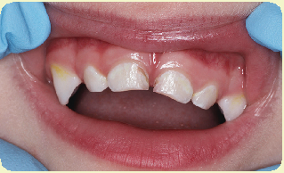

Cavities begin to form between the two front teeth.

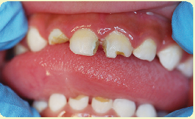

Severe dental caries have occurred, with one cavity affecting the tooth to the gum line.

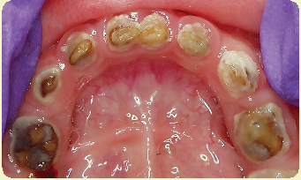

More severe early caries affect all lower teeth.

###### Does Breastfeeding Help Avoid Caries?

Human milk, in contrast to formula, contains breastspecific Lactobacilli and other substances that inhibit the growth of the bacteria that cause caries; however, breastfed infants may also be vulnerable to early childhood caries.13 Breastfeeding mothers should be alerted to the need for oral hygiene after feedings, especially when the infant’s first teeth have begun to emerge. Although studies have shown that human milk alone does not cause dental caries, once an infant starts consuming complementary foods, the combination of sugar-rich food and human milk from an on-demand breastfeeding schedule can contribute to dental caries.14

###### Oral Care and Prevention of Infant Caries

To prevent early childhood caries and caries development in general, these steps are recommended:15

QTake good care of personal oral health: even before an infant is born, it is important and safe during pregnancy to see a dentist regularly (every 6 months) for oral care.

QCare of teeth is important in both breastfed and

bottle-fed infants:

- •Birth to 12 months. Gently wipe the gums with a clean baby washcloth. Once the first teeth have erupted, gently brush them using a soft baby toothbrush and a smear (about the size of a grain of rice) of fluoride toothpaste.
- •12 to 36 months. Brush the infant or young child’s teeth two times per day—after breakfast and before bedtime—for 2 minutes each time. Use a smear of fluoride toothpaste until the third birthday.
- •To prevent fluorosis, parents and caregivers should make efforts to minimize the swallowing of toothpaste.

Q Never put an infant to bed with a bottle or food. This exposes teeth to sugars that cause dental caries.

QCheck to see if there is fluoride in the household water. Drinking water that contains fluoride in the right amounts or eating food prepared

with fluoridated water will benefit an infant.16 If the tap water comes from a well or another nonfluoridated source, it will be useful to have a water sample tested for natural fluoride content. If the tap water does not have enough fluoride, a health care provider may prescribe a fluoride supplement for the older infant. A fluoride varnish may also be applied to the infant’s teeth to protect the teeth from decay. ä See also: Chapter 4, “Using Fluoridated Water to Mix Infant Formula,” pages 104–105.

QTeach an infant to drink from a regular cup as soon as possible, preferably beginning around 6 months of age.17 Drinking from a cup prevents excess liquid from collecting around the teeth, and a cup cannot be taken to bed.

QAvoid or limit foods that promote development of dental caries such as sweet or sticky foods an older infant eats (e.g., cookies, or fruit roll-ups).18

QAvoid the use of juice in infants under 12 months of age. After 12 months, encourage whole fruit over fruit juice, but any juice consumed should be part of a meal or snack and from an open cup. When juice is introduced, it should be pasteurized 100 percent fruit juice. Also, avoid giving infants carbonated beverages.19ä See also: Chapter 5, “Beverages,” pages 129–133.

QTake the infant to see a dentist before he or she is 1 year old, or sooner if there are any concerns. A local pediatric dentist can be found through the American Academy of Pediatric Dentistry (AAPD) website at http://www.aapd.org or through https://www.insurekidsnow.gov/, a Centers for Medicare and Medicaid Services website.20

QDo not use a bottle or sippy cup as a pacifier or allow an infant to hold one filled with liquids for long periods.

###### The First Visit to the Dentist

To ensure that any dental problems are discovered and treated before becoming more serious, the AAPD and the AAP recommend that infants receive an oral health risk assessment by a qualified pediatric health care professional by 6 months of age.Those infants at significant risk of developing dental caries should be evaluated between 6 and 12 months of age by a dentist. Infants should be taken to their first dental visit by 12 months of age.21

Infant dental checks should set the stage for a lifelong good habit of regular dental care that will prevent the negative effects of dental disease. If an infant or young child shows signs of dental problems or tooth decay at any time, refer him or her to a medical or dental health care provider as soon as possible. If left untreated, dental caries can become very serious, possibly requiring the extraction of teeth at a very early age.

###### Vegetarian Diets

Families or individuals choose vegetarian diets for religious, philosophical, economic, ecological, health, or personal reasons. A vegetarian diet is generally defined as a diet that includes primarily or only plant foods (i.e., fruits, vegetables, legumes, and grains) and usually excludes certain or all animal foods (i.e., meats, poultry, fish, eggs, and dairy products). Advise parents and caregivers to make their health care provider aware of this dietary choice, as each food category has different implications for the health and nutrition of infants and children.22

USDA

###### Classifications of Vegetarian Diets

Vegetarian diets have been classified into the following subdivisions, based on the types of animal foods included in each diet. Within each classification, there may be variations of the foods eaten:23

QLacto-vegetarian diet. It includes plant foods and

dairy products; excludes eggs.

QLacto-ovo-vegetarian diet. It includes plant foods,

dairy products, and eggs.

QSemi-vegetarian or partial vegetarian diet. It

includes plant foods and a few to several kinds of animal products such as fish, seafood, eggs, and dairy products.

QVegan or total vegetarian diet. It includes plant foods only; excludes any foods from animal sources, such as dairy products, gelatin, and honey.

QMacrobiotic diet. It includes unpolished rice and other whole grains, legumes, seaweed, fermented foods, vegetable oils, fruits and vegetables, and occasionally fish. This diet can have stages of increasingly severe dietary restriction that excludes some of these foods. Generally, dairy products, red meat, and poultry are excluded at any stage. When taken to extremes, macrobiotic diets have been known to compromise nutrient status.

QFruitarian diet. It includes raw or dried fruits, berries, juices, grains, legumes, and a few vegetables.

###### Adequacy of Vegetarian Diets

For parents and caregivers who want their infants to follow a vegetarian or vegan diet, the AAP has indicated that, besides human milk, soy-based infant formula is an appropriate food. Both provide adequate nutrition for approximately the first 6 months of life.Later, when complementary feeding starts, most vegetarian-oriented infants are on a lacto-vegetarian diet (which includes fruits, vegetables, cereal, human milk, and after 12 months of age, cow’s milk). For older infants, the AAP and the Academy of Nutrition and Dietetics have stated that vegetarian or vegan diets can meet infants’ needs if attention is paid to specific nutrients such as protein, vitamin A, vitamin B2, vitamin B12, vitamin D, calcium, iron, and zinc.24

###### Risks of Some Vegetarian Diets

As vegetarian diets become more restrictive, the nutritional and health risks for infants increase. Infants of any age on a restrictive vegetarian diet, such as macrobiotic, vegan, or fruitarian, are placed

at significant risk for multiple health and growth issues due to nutrient and vitamin deficiencies. Parents or caregivers and their infants should have a dietary evaluation and should be given appropriate information about the deficiencies related to vegetarian diets.25

Inadequate vegetarian, in particular vegan, diets may lead to the following conditions in infants:26

QFailure to thrive due to lack of nutrients, including vitamin B2, and because excess fiber may inhibit the absorption of nutrients ä See also: Chapter 1, “Fiber,” page 7; and “Vitamin B2,” page 14.

QVitamin B2 deficiency, which contributes to poor growth and eye health, including sensitivity to light

QIron deficiency anemia ä See also: Chapter 1, “Iron

Deficiency,” page 19.

QVitamin B12 deficiency, causing megaloblastic anemia (production of abnormally large red blood cells) and thus fatigue

QVitamin D deficiency rickets ä See also: Chapter 1,

“Vitamin D Deficiency,” page 12.

QVitamin A deficiency, causing keratomalacia (softening and ulceration of the cornea)

QProtein deficiency, leading to diarrhea, fatty liver,

and stunted growth

QZinc deficiency, which decreases wound healing

and promotes anemia

QCalcium deficiency, causing osteomalacia

(softening of the bones)

###### Guidelines for Nutrition Counseling for Vegetarian Diets

When providing nutrition counseling to parents or caregivers of infants on vegetarian diets, the following guidelines should be used. If key points are appropriately addressed when feeding a vegetarian infant, it should be possible for the infant to receive an adequate balance of nutrients and thus achieve optimum growth and development. ä See also: Chapter 1, “Nutritional Needs of Infants,” pages 1–30; and Chapter 5, Table 5.2, “Guidelines for Feeding Healthy Infants, Birth to 12 Months Old,” page 138.

NOTE: Be mindful that the dietary preferences of vegetarians may be based on deeply held beliefs and cultural food habits. Work with the parent or caregiver at initial and follow-up nutrition counseling sessions to ensure that the diet is nutritionally adequate.27

Counselors should follow these steps: QProvide initial nutrition evaluation and assessment

of the diet for nutritional deficiencies and excesses, and determine if the diet is appropriate for the infant’s developmental level.

QProvide follow-up counseling if a parent or caregiver

decides to keep his or her infant on a vegan diet.28

QInform the parent or caregiver about the limits and

potential detriments of restrictive diets.

QDiscourage the use of very restrictive vegetarian

diets.

QRefer the infant to a health care provider for a medical evaluation and advice on supplementation if the parent or caregiver decides to keep the infant on a restrictive diet.

QEmphasize the importance of following general guidelines for introducing new foods and of watching for hypersensitivity (allergic) or other reactions an infant may have to new foods. ä See also: Chapter 5, “Developmental Readiness for Complementary Foods,” page 116. QDiscuss with the parent or caregiver the importance of modifying the texture of foods to meet the infant’s developmental needs. ä See also: Chapter 5, “Home-Prepared Foods,” pages 137–139.

QDiscuss with the parent or caregiver the appropriate amounts and types of foods needed to supply the infant with adequate energy, protein, vitamins, and minerals. The following section provides details on these nutrients.

###### Feed Infants the Right Balance of Nutrients

A balance of foods that provide energy and nutrients is key to a diet that will allow an infant to thrive. Guide parents and caregivers to understand the energy and nutrients offered by foods allowed in various vegetarian diets and how to supplement those nutrients that are missing.

###### Energy Content

Many vegetable- and cereal-based foods are low in calories and high in fiber content. For an infant, these foods need to be chosen wisely to ensure that sufficient kilocalories and nutrients are consumed daily. Low-calorie foods provide little energy. In addition, although a small amount of fiber in an infant’s diet should not be harmful, a high-fiber diet tends to fill an infant’s stomach and limit the amount of foods the infant can physically consume during meals.

A high-fiber diet can also reduce the availability of iron, calcium, and zinc from foods in the diet and inhibit mineral absorption.Thus, encourage parents and caregivers to select a variety of foods, including those with a moderate or low fiber content. Vegan infants are most vulnerable to inadequate energy intake during the weaning period—whether weaning from human milk or soy formula; providing some refined grain products and peeled fruits and vegetables, and feeding more frequently, can help provide adequate calories without adding significant fiber.29

###### Protein

The protein needs of a lacto- or lacto-ovo-vegetarian infant are easily met if the diet includes sufficient quantities of high-quality protein foods, such as yogurt, cheese, and eggs. A vegan diet must be planned carefully to ensure that a sufficient quality and quantity of protein is provided. ä See also: Chapter 1, “Protein,” pages 7–9.

Advise parents and caregivers who decide to keep their infants on a vegan diet to take these steps:

QBreastfeed or use soy-based infant formula.Soybased infant formulas are nutritionally balanced. Soy-based beverages (sometimes described as soy drinks or soy milks) or rice beverages (rice milk) sold in grocery and specialty food stores are lacking in key nutrients needed by infants, including calcium, niacin, and vitamins D, E, and C. Such drinks should not be fed as substitutes for infant formula. Full-fat soy milk may be offered to vegan infants starting at 12 months of age.30

QFeed combinations of plant foods, such as beans and rice, to infants consuming complementary foods during the course of each day. Several combinations meet the protein needs of the older vegetarian or vegan infant:31

- •Cooked, mashed tofu and ground or mashed rice
- •Iron-fortified infant cereal and soy-based infant formula
- •Cooked, pureed kidney beans with ground or mashed rice, mashed noodles, or a piece of whole-wheat bread
- •Other combinations of different legumes and cereal grains (such as rice, wheat, and barley) prepared with the appropriate texture

###### Vitamin A

Vitamin A requirements can be met by adding to the diet plant foods rich in beta carotene. These foods include leafy or deep yellow or orange vegetables and fruits such as carrots, sweet potatoes, squash, spinach, romaine lettuce, kale, oranges, and cantaloupe. Beta carotene absorption can be increased by chopping, cooking, or pureeing these foods. Also, a small amount of fat can be added to the foods to help absorption into the body.32

###### Vitamin B12

A vegan infant’s needs for vitamin B12 are a challenge to meet. B12 occurs only in animal foods and very few plants. The few plants with B12, such as algae and seaweed, are not always easy to find in the store.33 Mothers who choose a vegan diet for their infant should be advised to breastfeed or use commercial soy-based infant formula in order to deliver adequate B12. Soy-based formula will be fortified with vitamin B12, and to ensure a good supply of B12 in her own milk, a vegan breastfeeding mother should consume vitamin B12-fortified plant foods; nutritional yeast; and sea vegetables such as kelp, chlorella, and dulse or take a supplement containing vitamin B12.34

Without adequate B12, over time an infant can develop neurological damage.Refer the vegan mother and infant to a health care provider for assessment of vitamin B12 status. Vegan diets are generally high in folic acid, which can mask the symptoms of vitamin B12 deficiency.35

###### Vitamin D

The vitamin D needs of vegetarian infants should be carefully monitored. Vegetarian, and particularly vegan, infants who are not breastfed should be fed soy-based infant formulas. These formulas provide adequate vitamin D for vegetarian infants in the first 12 months of life. ä See also: Chapter 1, “Vitamin D,” pages 11–12.

After an infant reaches 12 months of age, soy milk fortified with vitamin D may be introduced to the infant’s diet.36

###### Calcium

Calcium needs are easily met if an infant is consuming adequate quantities of human milk or infant formula, both rich sources of calcium. Calcium, in smaller amounts and a less available form, is also present in soybeans and other legumes, grain products, and green leafy vegetables, including chard, kale, collard greens, and spinach.37

NOTE: When counseling parents and caregivers who give infants complementary foods before the recommended age of about 6 months, assess if the infant is developmentally ready. In addition, caution against using certain vegetables that contain nitrate. The AAP recommends that spinach, beets, turnips, carrots, and collard greens prepared at home should not be fed to infants less than 6 months old because these vegetables may contain sufficient nitrate to cause methemoglobinemia.38 ä See also: Chapter 5, “Vegetables High in Nitrates or Nitrites,” page 136; and Chapter 8, “Nitrate in Vegetables,” pages 206–208.

###### Iron

Most healthy, full-term infants are born with iron stores that are not depleted until they are about 4 to 6 months old. Thus, it is recommended that infants receive an iron supplementation until complementary feeding starts. ä See also: Chapter 1, “Iron for Breastfed and Formula-Fed Infants, page 19.

A vegetarian infant who consumes an appropriate amount of iron-fortified infant formula daily and iron-fortified cereal starting around 6 months of age should receive an adequate amount of iron in the first year of life. Iron sources other than meat, poultry, and fish include iron-fortified infant cereal and other enriched and whole-grain products, cooked dried beans and peas, and cooked dried fruits. Since these plant foods contain poorly absorbed nonheme iron, it is recommended to feed vitamin C-rich foods at the same meal, which will help increase iron absorption.39 ä See also: Chapter 1, “Iron,” pages 18–19.

NOTE: Refer infants who may be iron deficient, based on dietary intake or hemoglobin and hematocrit tests, to a health care provider for assessment, monitoring, and advice on supplementation.

###### Zinc

Human milk or infant formulas consumed in appropriate amounts provide sufficient zinc for young infants.40 After 6 months of age, vegetarian food sources of zinc should be added to the diet. Zinc sources besides meat, poultry, fish, and eggs include legumes, whole-grain cereals, breads, and other fortified or enriched grain products; milk products such as cheese and yogurt are a zinc source for lacto-vegetarians. The AAP does not recommend zinc supplementation for vegan infants during the weaning period because clinical signs of zinc deficiency are rarely seen in vegetarians.41

###### Riboflavin (Vitamin B2)

Dairy products are one of the major sources of riboflavin in an infant’s diet.42 Infants who are not fed human milk, milk-based infant formula, or other dairy products such as cheese and yogurt can obtain riboflavin from soy-based infant formula; enriched, fortified, and whole-grain breads or cereals; green leafy vegetables; legumes; broccoli; and avocados. Riboflavin deficiency has occasionally occurred in people who follow severely restricted macrobiotic diets, but it is not a problem in other forms of vegetarianism.43

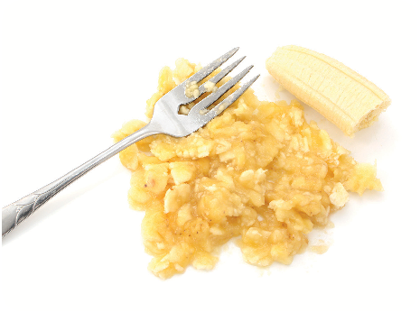

SHUTTERSTOCK

###### Preparing Foods

Some foods commonly included in vegetarian diets may be coarse and hard to digest and/or may require teeth for chewing. Discuss with the parent or caregiver the importance of modifying the texture of foods to meet the infant’s needs.

Guidelines to ensure that certain foods are suitable for infants to consume include the following:

QPuree or mash cooked whole dried beans and peas. Legumes should be pressed through a sieve to remove skins.

QGrind up or finely mash cooked whole grain

kernels, such as rice, wheat berries, and barley.

QAvoid grain products that require chewing and can cause choking: granola-type cereals, cooked whole-grain kernels, and plain, dry wheat germ. QNever serve chunks of nut or seed butters because they can conform to the infant’s airway and form a seal over it, causing choking. Nut butters can be served if they are creamy, not chunky, and spread in a thin layer on a cracker or piece of bread.44 ä See also: Chapter 5, “Choking Prevention,” pages 120–124.

QFollow standard recommendations regarding home preparation of grains, vegetables, and fruits for infants. ä See also: Chapter 5, “Types of Complementary Foods To Introduce,” pages 124–129.

###### Common Gastrointestinal Problems

In the early months of life, many infants have gastrointestinal challenges. These can range from taking in too much air while feeding and becoming cranky to developing gastroesophageal reflux, to developing the more serious gastroesophageal reflux disease, which can cause symptoms including vomiting, abdominal pain, and upper respiratory infection.45 Among the milder challenges is spitting up. Not to be confused with vomiting, spitting up is a common occurrence in infants less than 12 months old. Until that age, the muscle located between the stomach and esophagus is not sufficiently developed to keep all the food inside the stomach after eating, so some of the food comes back up.46 Spitting up is the easy flow of stomach contents up through the esophagus and out of the mouth, frequently with a burp. Vomiting is the forceful throwing up of stomach contents through the esophagus and mouth.47

###### Spitting Up

It is normal for young infants to spit up a small amount of human milk or infant formula after feedings. Sometimes spitting up means the infant has eaten more than the stomach can hold; sometimes the infant spits up while burping or drooling.48

After a feeding, it is usual for a small amount of human milk or infant formula to come out of an infant’s mouth. Spitting up can be messy, but it is not usually a cause for concern. It almost never involves choking, coughing, discomfort, or danger to the infant even if it occurs while sleeping.

Although some parents and caregivers may want to lay their infant on his or her stomach to prevent spitting up, infants should only be put to sleep lying on their back, without any pillows, blankets, or toys to prop them up. Following this guideline will also help prevent sudden infant death syndrome (SIDS).49 ä See also: “Safe Sleep Practices,” pages 167–168.

To help decrease the frequency and amount of spitting up, practice these steps:50

QFeed the infant before frantic hunger sets in. QMake each feeding calm, quiet, and leisurely. QAvoid sudden noises, bright lights, and other

distractions during feedings.

QDo not feed the infant when he or she is lying

down.

QHold the infant in an upright position for 20 to 30

minutes following a feeding.

QAvoid excessive stimulation or physical activity

after the feeding.

QWhen bottle-feeding, burp the infant every 3 to 5 minutes throughout the feeding and make sure the hole in the nipple is the proper size. ä See also: Chapter 4, “Know the Correct Nipple Size,” page 101.

###### Gastroesophageal Reflux (GER)

A more frequent form of spitting up is called gastroesophageal reflux. Reflux is defined as the spontaneous, effortless regurgitation of material from the stomach into the esophagus. GER may be caused by the immature gastrointestinal tract and seems to be related to a delay in stomach emptying.51 When reflux is associated with other symptoms, or if it persists beyond infancy, it is considered a disease and is known as gastroesophageal reflux disease or GERD. ä See also: Chapter 4, “Common Feeding Concerns,” pages 101–103.

NOTE: Infants with severe GER can develop gastroesophageal reflux disease (GERD). Symptoms of GERD include wheezing, recurrent pneumonia or upper respiratory infections, hoarseness and other symptoms of esophagitis (an irritation of the esophagus), blood in vomit or stool, irritability during feeding, or failure to thrive. These infants should be referred to a health care provider immediately.52

###### Reducing Air Intake During Feeding

Most infants swallow air while feeding, which leads to crankiness, fussiness, and spitting up. Air intake happens more often with bottle-fed infants than with those who are breastfed.

If an infant begins to fuss in the middle of a feeding, it is better to stop and address the problem. If the infant continues feeding and gulps in even more air, spitting up is sure to follow once the feeding is over.

Be sure to burp the infant several times during a feeding, during normal breaks. Burping slows a feeding and can lessen the amount of air swallowed.

Since bottle-fed infants often swallow more air than breastfed infants, they need to be burped every 3 to 5 minutes during feedings.

SHUTTERSTOCK

Sources: S. P. Shelov, ed., Caring for Your Baby and Young Child: Birth to Age 5, 6th ed., American Academy of Pediatrics (New York: Bantam Books, 2014), 128–31; “Burping, Hiccups, and Spitting Up,” American Academy of Pediatrics, last modified November 21, 2015, https://www.healthychildren.org/English/ages-stages/ baby/feeding-nutrition/Pages/Burping-Hiccups-andSpitting-Up.aspx.

###### Vomiting

constipation.56 Formula-fed infants tend to have firmer stools, but this does not indicate constipation.57

It is important to recognize the difference between spitting up and vomiting. Because vomiting is a forceful discharge of food through the esophagus, it involves a more complete emptying of the stomach’s contents than does spitting up.

Constipation can be caused by a variety of factors or conditions, including the following:58

QDietary influences

- •Inadequate amounts of human milk, infant formula, complementary foods, or fluid intake
- •Improper dilution of infant formula
- •Early introduction of complementary foods

Vomiting causes distress and discomfort to the infant and can occur as a:53

QSymptom of a reaction to food eaten QMinor medical condition, such as a viral illness QMajor medical condition, such as pyloric stenosis QReaction to certain medications QResult of inner ear stimulation while in a moving

QAbnormal anatomy or neurologic functioning of

the digestive tract QUse of certain medications QMedical conditions and hormonal abnormalities QStool withholding due to rectal irritation from

vehicle

rashes, thermometers, vigorous wiping, etc. QExcessive fluid losses due to vomiting or fever QLack of movement or activity

QResult of excitement or nervousness

Vomiting can place an infant at risk of dehydration and should be addressed immediately.54 Refer an infant to a health care provider for medical evaluation if the infant has forceful vomiting occurring approximately 15 to 13 minutes or less after every feeding.55ä See also: Chapter 1, “Water,” page 22; and Chapter 5, “Dehydration,” page 131.

Signs that can suggest actual constipation of an infant include:59

QBeing excessively fussy QSpitting up more than usual QHaving dramatically more or fewer bowel

movements than before

###### Constipation

QHaving stools unusually hard, or contain blood

related to hard stools

Constipation is generally defined as the condition in which bowel movements are hard, dry, and difficult to pass. Pyloric stenosis is the thickening of the muscle at the stomach exit that prevents food from passing into the intestines and causes projectile vomiting after every feeding. It requires surgery within the first 2 to 6 weeks of life to open the narrowed area.

QHaving episodes of straining for more than 10

minutes without success

###### Preventing Constipation

If a parent or caregiver complains that an infant is constipated, recommend he or she see the infant’s health care provider for medical evaluation. Assess the infant’s diet and guide the parent or caregiver to follow these preventive measures:

Part of the difficulty in determining whether an infant is constipated is that each parent or caregiver may have a different perception of how often an infant should have a bowel movementand whether an infant’s stool is “too hard.” Some parents and caregivers believe iron from formula causes their infant to be constipated, but studies have demonstrated no relationship between iron-fortified infant formula and gastrointestinal distress, including

QEnsure adequate intake of human milk or infant

formula.

QEnsure proper infant formula preparation and

dilution if the infant is formula-fed.

QEnsure that appropriate types and amounts of complementary foods are consumed.60 ä See also: Chapter 5, “Complementary Foods,” pages 115–142.

Pyloric stenosis: Thickening of the muscle at the stomach exit that prevents food from passing into the intestines and causes projectile vomiting after every feeding. It requires surgery within the first two to six weeks of life to open the narrowed area.

###### How to Help a Colicky Infant

Caring for a colicky infant can be stressful. The parent or caregiver not only is worried about the infant’s health, but also may be on edge because of the continual crying and fussiness. Parents and caregivers can take these steps to help soothe a colicky infant:

QBreastfeeding. You may find that some foods

cause your infant’s stomach upset. You can try avoiding those foods to see if your infant feels better and ask his or her doctor for help.

QFormula feeding. Talk with parents and caregivers about proper formula preparation, safe storage and feeding, and how to formula feed.

QTiming is important. To avoid overfeeding, try to wait at least 2 to 2½ hours from the start of one feeding to the next.

QPractice close contact. Walk the infant close to the chest. The motion and body contact may be reassuring.

QSeek soothing sounds. Steady rhythmic motion and a calming sound may help the infant fall asleep. NOTE: Never place an infant on top of a washer or dryer.

QPromote tummy time. Lay the infant tummydown across the knees and gently rub the infant’s back. The light pressure against the infant’s belly may bring comfort.

QTry swaddling, or wrapping in a blanket. If an infant is swaddled, it is essential to place the infant on his or her back. When it looks as if an

QRefrain from introducing complementary foods until the infant is developmentally ready, around 6 months of age.

Each infant’s bowel patterns are different. Parents and caregivers should become familiar with their normal bowel patterns, specifically, the usual size, consistency, and frequency of the stools. This will help determine when constipation occurs and how severe the problem is.

NOTE: A parent or caregiver should never give a laxative or other type of stool-softening medication without consulting the health care provider.61

infant is about to roll over, the infant should no longer be swaddled. ä See Also: Chapter 4, “Common Feeding Concerns,” pages 101–103.

QTake a break. When feeling tense and anxious because of the infant’s continual crying, have a trusted family member or friend look after the infant; then take a break, such as a nap or a walk outside the home. An hour or two away will help restore energy and a positive attitude.

NOTE: Parents and caregivers may become impatient or angry; advise them to keep calm, seek help, and treat their infant gently. Never shake an infant, as this can cause bodily harm. When feeling depressed, anxious, or stressed, parents and caregivers should consult their health care provider immediately.

Sources: “Colic Relief Tips for Parents,” American Academy of Pediatrics, last modified November 21, 2015, https://www.healthychildren.org/English/ages-stages/ baby/crying-colic/Pages/Colic.aspx; “Pacifiers: Satisfying Your Baby’s Needs,” American Academy of Pediatrics, last modified November 21, 2015, https://www.healthychildren. org/English/ages-stages/baby/crying-colic/Pages/Pacifiers

- -Satisfying-Your-Babys-Needs.aspx; A. H. Zachry, “Tummy Time Activities,” American Academy of Pediatrics, last modified November 21, 2015, https://www.healthy children.org/English/ages-stages/baby/sleep/Pages/The
- -Importance-of-Tummy-Time.aspx; “Swaddling: Is It Safe?,” American Academy of Pediatrics, last modified November 21, 2015, https://www.healthychildren.org/English/ages
- -stages/baby/diapers-clothing/Pages/Swaddling-Is-it
- -Safe.aspx.

###### Colic

Up to one-fifth of all infants experience colic in the first few months of life. Colic is described as prolonged, inconsolable crying that appears to be related to stomach pain and discomfort. It often occurs between 6 p.m. and midnight, and sometimes causes infants to pull up their legs in pain.Colic usually develops between 2 to 4 weeks of age and may continue until the infant is 3 to 4 months old.62 Formula-fed infants seem to experience colic more often than breastfed infants. Parents and caregivers should speak with their health care provider to rule out any serious medical condition the infant may have.

###### V iruses and Diarrhea

Viruses such as norovirus and rotavirus are among the most frequent infectious causes of diarrhea. A person can contract each of them by coming in contact with someone who has the virus, by touching a surface where the virus is present, or from consuming contaminated food or water.

While norovirus affects all ages, rotavirus is most common in infants and children. These contagious viruses can cause gastroenteritis, or inflammation of the stomach and intestines. Symptoms include severe watery diarrhea, often with vomiting, fever, and abdominal pain. Infants and young children are most likely to get rotavirus disease. The resulting diarrhea, if untreated, can lead to severe dehydration and death.

In otherwise healthy infants, diarrhea is the second most common cause of hospitalizations, after

respiratory issues. Diarrheal diseases account for one in nine child deaths worldwide, making diarrhea the second leading cause of death among children under the age of 5.

Rotavirus was the leading cause of severe diarrhea among infants and young children in the United States before the rotavirus vaccine was introduced in 2006.

The rotavirus vaccine is routinely given to infants starting at 2 months of age and is very effective at preventing diarrhea and subsequent dehydration caused by rotavirus.

Sources: S. Monroe, “Control and Prevention of Viral Gastroenteritis,” Emerging Infectious Diseases 17, no. 8 (August 2011): 1347–48, doi:10.3201/eid1708.110824; “Diarrhea: Common Illness, Global Killer,” Centers for Disease Control and Prevention, last modified December 17, 2015, http://www.cdc.gov/healthywater/global/diarrhea

-burden.html; S. P. Shelov, ed., Caring for Your Baby and Young Child: Birth to Age 5, 6th ed., American Academy of Pediatrics (New York: Bantam Books, 2014): 531.

###### Diarrhea

Diarrhea is defined as the frequent passage of loose, watery stools that can occur as often as 12 times a day. Diarrhea should not be confused with the normal stools of breastfed infants, which are soft but formed and can be passed after every feeding.63 Diarrhea should be referred to a health care provider for medical evaluation. Fasting does not modify the outcome or severity of the diarrhea; therefore, good nutrition and hydration should be continue thorough breastfeeding or usual bottle feeding.64

Diarrhea in infants can be caused by the following factors:65

QImproper infant formula preparation and storage

techniques QA reaction to a food QExcessive juice consumption QUse of certain medications, such as antibiotics QMedical conditions such as lactose intolerance

QInfections such as viral rotavirus or norovirus, bacterial Salmonella or Shigella, and parasitic Giardia

QMalabsorption of food due to protein allergies,

such as allergic gastroenteropathy QConsuming contaminated food or water NOTE: Proper formula preparation and storage are very important in ensuring that infant formula is not contaminated and a potential cause of diarrhea.66 ä See also: Chapter 4, “Selection, Preparation, Storage, and Warming of Infant Formula,” pages 103-106.

67

###### Immunization

The Centers for Disease Control and Prevention (CDC) recommends that infants and children between birth and 6 years of age, should receive vaccines that will protect against major diseases including rotavirus (see “Viruses and Diarrhea,”

###### Allergic gastroenteropathy: Any disorder of the stomach and intestines caused by an allergic reaction, usually resulting in diarrhea

###### Immunization Is Important

Immunizing infants against certain diseases is one important way to help them stay healthy. Part of WIC’s mission is to be a partner with other services that are important to childhood and family well-being, such as immunizations. As an adjunct to services that provide immunizations, the WIC program’s role is to find out about an infant’s need for immunizations and share that information with parents and caregivers, including where to get an infant immunized. For more information about immunization, visit WWRS immunization training and guidance at https://wicworks.fns. usda.gov/resources/immunizations-educationmaterials-and-information-resources.

opposite), polio, influenza, chickenpox, and more. Most of these diseases are spread from person to person through the air by coughing, sneezing, or simply breathing. Others enter the body through the mouth, through body fluids, or through breaks in the skin. Today vaccinations are vital not only for protecting individuals but also for keeping major diseases from spreading through schools and communities.

###### Overweight and Obesity Prevention

Infants need a diet high in fat to support rapid growth. As a result, calorie restriction in order to reduce weight is not recommended for children under 2 years of age. However, infants need to balance their energy as well. Energy balance in infants occurs when the amount of energy taken in from food or drink and the energy being used by the body support natural growth without promoting excess weight gain.

If this energy balance is not maintained, infants can gain excess weight. Heavy infants can delay crawling and walking; also, this early weight gain lays the foundation for overweight concerns in

older infancy and obesity in childhood. Obesity can lead to many chronic medical conditions, including type 2 diabetes, heart disease, high blood pressure, and joint issues. In addition, obesity sets the stage for a lower quality of life, and possibly a shorter life span.68

###### Measuring Overweight and Obesity

The CDC recommends that health care providers use the World Health Organization’s charts to monitor weight-for-recumbent length for infants and children 0 to 2 years of age in the United States. Weight for length greater than the 95th percentile is termed overweight and should be monitored.69 ä See also: Chapter 1, “Anthropometric Data,” page 2.

###### Preventing Infant Overweight

The AAP states that early recognition of excessive weight gain in relation to linear growth is important for initiating early intervention. It advocates a dietary approach that encourages moderate consumption of healthful foods rather than overconsumption or restriction.70

Maternal risk factors during pregnancy and the first 2 years of life may be critical for the programming of obesity. Therefore, the following factors may play a part in the prevention or development of childhood overweight and obesity:

QPregnancy weight. Excessive weight gain during pregnancy can increase an infant’s birth weight and so the risk of childhood obesity.71

QBreastfeeding. Multiple studies indicate a protective effect of breastfeeding against the later development of obesity; however, research is still ongoing.Longer duration of breastfeeding and later introduction of complementary foods, around 6 months of age, are associated with a decreased risk of becoming overweight.72

QRapid weight gain in infancy. Rapid weight gain in the first 4 to 6 months of life is associated with a higher incidence of overweight and obesity in later childhood and adolescence.73 An infant whose weight-for-length is greater than the 95th percentile in the early months may not develop

into an overweight child, but if the infant does become an obese child, there is a good chance that he or she will remain obese as an adult.74

QParental or caregiver control. In the first 2 years of a child’s life, parents and caregivers should be discouraged from showing too much concern and exerting too much control over monitoring and restricting food intake, or pressuring an infant to eat. Allowing an infant to respond to internal cues of hunger and satiety rather than to parental or caregiver pressure or restriction may make it less likely that the infant will become obese.75 ä See also Chapter 2, “Development of Infant Feeding Skills,” pages 33–43.

QDietary choices. Research shows that between the ages of 6 and 24 months, as infants transition from breast- or formula feeding to complementary foods, the kind of transition they make is potentially important in avoiding long-term obesity.During these months, infants develop patterns of eating and food preferences. By the time they are 2 years old, these patterns have taken hold and likely will continue throughout life. When they eat mainly high-calorie foods of low nutrient density, infants and young children are displacing low-calorie foods of high nutrient density. In addition, they often consume greater quantities of the high-calorie foods.76 The following points can help parents and caregivers guide infants and young children to make healthy choices: 77

- •Promote healthy eating patterns by offering nutritious complementary foods, such as vegetables and fruits, whole grains, lean meats and fish, and legumes.
- •Develop healthy eating habits that can begin in infancy, such as minimizing or eliminating juice.
- •Choose the appropriate portion size, and offer a variety of foods according to the infant’s developmental stage.
- •Set appropriate limits on choices and model healthy food choices.

NOTE: Taste preferences can change over time, and an infant may try a new food several times before he or she enjoys it.

Q Media Use. The AAP discourages television and

###### WIC Helps Prevent Obesity

The WIC program plays an important role in public health efforts to reduce the prevalence of obesity by actively identifying and enrolling infants and children who may be overweight or at risk of overweight in childhood and adolescence. When identifying this risk, it is important to communicate it in a way that is supportive and nonjudgmental, and with a careful choice of words to convey an empathetic attitude and to minimize embarrassment or harm to a parent or caregiver’s self-esteem, or to the self-esteem of a child old enough to understand.

Source: U.S. Department of Agriculture, Food and Nutrition Service, VENA: The First Step in Quality Nutrition Services (Washington, DC: USDA, 2006), 25– 26, 76–84. https://www.cdc.gov/media/releases/2016/ s1117-childhood-obesity.html

other screen time for children younger than 2 years of age. Keep mealtimes media/screen-free: kids tend to eat more when watching TV or playing with computer games, and they are exposed to commercials that may lead to cravings for unhealthy foods.78 ä See also: Chapter 7, “Limiting TV and Digital Media,” page 186.

QPhysical Activity. Encourage age-appropriate physical activity. ä See also: Chapter 7, “Physical Activity in Infancy,” pages 177–186.

###### Sleeping Patterns and Safe Sleep Practices

Healthy infant sleep patterns vary by age and individual and can often prove problematic to parents and caregivers. For new parents and caregivers, anticipating and recognizing new developments are a constant challenge. But understanding usual sleep patterns and knowing their infant’s pattern can help parents and caregivers develop realistic expectations about sleep stages and prevent frustration. An infant’s brain is constantly developing while adapting to the demands of a new environment. As the brain

slowly matures, the waking infant can better cope with the stimulus load of a busy world. In addition, new parents and caregivers must be educated in safe infant sleep practices in order to prevent accidental death.79 This section reviews sleeping patterns and safe sleep practices.

###### Sleeping Patterns

Infants do not have regular sleep cycles until about 6 months of age. While newborns sleep for a total of about 16 to 17 hours per day, they may only sleep for 1 to 2 hours at a time. As infants get older, they need less sleep and are able to sleep for longer periods of time at night. All infants have different sleep needs.80 The AAP gives professional recommendations to parents and caregivers for introducing and reinforcing healthy sleep patterns during different stages of infant development:81

QNewborn stage: Introduce. During this stage, infants generally require 16 to 18 hours of sleep. They may prefer to be awake during the peaceful nighttime hours rather than the more hectic daytime ones. Parents or caregivers should slowly introduce gentle stimulation during the day to increase daytime wakefulness.

QTwo months: Reinforce. Most infants are staying awake for longer daytime periods, but they may have difficulty transitioning to sleep. Some infants become overstimulated; in those cases, a brief period of understimulation may allow the infant to settle to sleep more easily. Most infants at this stage still require nighttime feeding, but it is important to learn an infant’s cues. Some infants may wake up hungry and give cues for feeding, while others may lightly fuss and then be able to soothe themselves back to sleep after a few minutes.

QFour months: Reinforce. Four months is often the age at which healthy infants begin sleeping longer stretches at night. However, some infants also start to develop separation anxiety at this stage. It is important to develop bedtime habits for the infant, such as bathing, brushing, reading, and implementing a routine time to get ready for and get into bed.82 Feeding infants in an effort to quiet

SHUTTERSTOCK

their crying is not recommended, as it can lead to the infant expecting this response whenever he or she awakens during the night.

QSix months through 9 months: Continue to reinforce. If positive sleep behaviors are not reinforced by this time, the poor behaviors can become habits. Parents and caregivers should continue to reinforce nighttime rituals in a consistent and loving manner.83

###### Safe Sleep Practices

After the AAP’s recommendation in 1992 that all infants should be placed on their backs to sleep, deaths from sudden infant death syndrome (SIDS) declined more than 50 percent in the 1990s and early 2000s.However, after the initial decrease, the overall death rate attributable to sleep-related deaths has remained about the same in recent years. SIDS is still the leading cause of death for infants between 1 and 12 months of age, and it is most common among infants 1 to 4 months old. Other causes of sleep-related deaths, including suffocation, entrapment, and asphyxia, have increased.84

It is important for parents and caregivers to follow safe sleep practices to create a secure environment for their infants:

QAlways place infants to sleep on their backs during

naps and at bedtime.85

QKeep the infant from becoming overheated. Watch for sweating, damp hair, flushed cheeks, heat rash, or rapid breathing. Dress the infant lightly for sleep. Set the room temperature in a range that is comfortable for a lightly clothed adult.86 QConsider offering a pacifier at nap time and bedtime. Pacifiers should not be hung around the infant’s neck and they should not have cords or clips that might be a strangulation risk.87 ä See also: Chapter 2, “Does the Infant Want to Eat or Suck?,” page 36.

QPlace the infant on a firm/flat mattress, covered by a fitted sheet that meets current safety standards. Find more information at the Consumer Product Safety Commission’s website, http://www.cpsc.gov.

QPlace the crib in an area that is always smoke-free. QThe AAP recommends that the crib be placed in

the parent or caregiver’s room, close to the adult bed, for at least the first 6 months and ideally for 1 year.

QToys and other soft bedding, including fluffy blankets, comforters, pillows, stuffed animals, bumper pads, and wedges should not be placed in the crib with the infant. These items can impair the infant’s ability to breathe if they are close to his or her face.88

QSleep clothing, such as sleepers, sleep sacks, and wearable blankets, are better alternatives to blankets.

NOTE: Never put an infant to sleep on adult beds, chairs, sofas, waterbeds, pillows, or cushions. When the infant awakens, he or she could easily roll off. Entrapment and suffocation are factors, too: an infant could wedge between the cushions, or be accidentally suffocated by another person sharing the surface.

###### B ed Sharing

Bed sharing is the practice of parents or caregivers and infants sleeping together on any surface, such as a bed, couch, or chair.

The AAP does not recommend any bed-sharing situations. There is a danger that infants can be smothered when bed sharing. The parent or caregiver can accidentally roll onto the infant, the parent or caregiver’s movement may cause the infant to roll face down, or the infant can become entangled in the bedding.

“SIDS and Other Sleep-Related Infant Deaths: Updated 2016 Recommendations for a Safe Infant Sleeping Environment,” released in 2016 by the AAP Task Force on Sudden Infant Death Syndrome, indicates that bed sharing remains the greatest risk factor for sleep-related infant deaths.

Sources: American Academy of Pediatrics Task Force on Sudden Infant Death Syndrome, “SIDS and Other SleepRelated Infant Deaths: Updated 2016 Recommendations for a Safe Infant Sleeping Environment,” Pediatrics 138, no. 5 (November 2016): 1–8, doi:10.1542/peds.20162938; J. Colvin et al., “Sleep Environment Risks for Younger and Older Infants,” Pediatrics 134, no. 2 (August 2014): e406–12, http://pediatrics.aappublications. org/content/134/2/e406; C. Shapiro-Mendoza et al., “Classification System for the Sudden Unexpected Infant Death Case Registry and its Application,” Pediatrics 134, no. 1 (July 2014), http://pediatrics.aappublications.org/ content/134/1/e210.

###### Endnotes

- 1 U.S. Department of Health and Human Services, Oral Health in America: A Report of the Surgeon General (Rockville, MD: U.S. Department of Health and Human Services, National Institutes of Health, National Institute of Dental and Craniofacial Research, 2000), 1–4, 249–252, accessed January 2017, https://www. nidcr.nih.gov/DataStatistics/SurgeonGeneral/Documents/hck1ocv.@www.surgeon.fullrpt.pdf.
- 2 “How to Prevent Tooth Decay in Your Baby,” AAP (American Academy of Pediatrics), last modified May 15, 2015, https://www.healthychildren.org/English/ages-stages/baby/teething-tooth-care/Pages/How-toPrevent-Tooth-Decay-in-Your-Baby.aspx.
- 3 “Teething: 4 to 7 Months,” AAP (American Academy of Pediatrics), last modified October 6, 2016, https://www.healthychildren.org/English/ages-stages/baby/teething-tooth-care/Pages/Teething-4-to-7Months.aspx.
- 4 “Teething: 4 to 7 Months,” AAP.
- 5 W. S. Swanson, “How to Help Teething Symptoms without Medications,” American Academy of Pediatrics, last modified November 15, 2015, https://www.healthychildren.org/English/ages-stages/ baby/teething-tooth-care/Pages/How-to-Help-Teething-Symptoms-without-Medications.aspx; American Academy of Pediatrics, “Dental Development: Teething Care and Anticipatory Guidance,” Chapter 2 in Protecting All Children’s Teeth (PACT): A Pediatric Oral Health Training Program, accessed October 2016, http://www2.aap.org/oralhealth/pact/ch2_sect5.cfm.
- 6 L. K. Mahan and J. L. Raymond, Krause’s Food & the Nutrition Care Process, 14th ed. (St. Louis, MO: Elsevier, 2017), 468; F. Sizer and E. Whitney, Nutrition: Concepts and Controversies, 14th ed. (Boston: Cengage Learning, 2017), 306.
- 7 R. E. Kleinman and F. R. Greer, Pediatric Nutrition, 7th ed. (Elk Grove Village, IL: American Academy ofPediatrics, 2014), 1167.
- 8 AAPD (American Academy of Pediatric Dentistry), “Policy on Early Childhood Caries (ECC): Classifications, Consequences, and Preventive Strategies” (revised 2014), Reference Manual 37, no. 6 (15/16): 50–52, http://www.aapd.org/media/Policies_Guidelines/P_ECCClassifications.pdf; Kleinman and Greer, Pediatric Nutrition, 1167.
- 9 AAPD, “Policy on Early Childhood Caries (ECC): Classifications, Consequences, and Preventive Strategies,” 50–52; Kleinman and Greer, Pediatric Nutrition, 1167; “Oral Health,” CDC (Centers for Disease Control and Prevention), last modified October 28, 2016, https://www.cdc.gov/oralhealth/basics/adultoral-health/tips.html.
- 10 AAPD, “Policy on Early Childhood Caries (ECC): Classifications, Consequences, and Preventive Strategies,” 50–52; Kleinman and Greer, Pediatric Nutrition, 1167; Mahan and Raymond, Krause’s Food & the Nutrition Care Process, 310, 473.
- 11 U.S. Department of Health and Human Services, A National Call to Action to Promote Oral Health, NIH publication 03-5303, May 2003, Rockville, MD: U.S. Department of Health and Human Services, Public Health Service, Centers for Disease Control and Prevention, National Institutes of Health, National Institute of Dental and Craniofacial Research, last modified September 2014, http://www.nidcr.nih.gov/ DataStatistics/SurgeonGeneral/NationalCalltoAction/nationalcalltoaction.htm; Kleinman and Greer, Pediatric Nutrition, 1168.
- 12 Kleinman and Greer, Pediatric Nutrition, 1168.
- 13 R. Tham et al., “Breastfeeding and the Risk of Dental Caries: A Systematic Review and Meta-Analysis,” Acta Paediatrica 104, no. 467 (December 2015): 62–84, doi:10.1111/apa.13118.

- 14 Kleinman and Greer, Pediatric Nutrition, 1168.
- 15 “How to Prevent Tooth Decay in Your Baby,” AAP; “Brushing Up on Oral Health: Never Too Early to Start,” American Academy of Pediatrics, last modified October 3, 2014, https://www.healthychildren. org/English/healthy-living/oral-health/Pages/Brushing-Up-on-Oral-Health-Never-Too-Early-to-Start. aspx; American Academy of Pediatrics, “Preventive Care: Key Points,” chap. 5 in Protecting All Children’s Teeth (PACT): A Pediatric Oral Health Training Program, accessed February 2017, http://www2.aap.org/ oralhealth/pact/ch5_key.cfm.
- 16 “Water Fluoridation,” American Academy of Pediatrics, last modified November 21, 2015, https://www. healthychildren.org/English/healthy-living/oral-health/Pages/Water-Fluoridation.aspx.
- 17 “Discontinuing the Bottle,” American Academy of Pediatrics, last modified November 21, 2015, https:// www.healthychildren.org/English/ages-stages/a/feeding-nutrition/Pages/Discontinuing-the-Bottle. aspx; S. A. Keim et al., “Injuries Associated with Bottles, Pacifiers, and Sippy Cups in the United States, 1991–2010,” Pediatrics 129, no. 6 (June 2012): 1104–10; AAPD, “Policy on Early Childhood Caries (ECC): Classifications, Consequences, and Preventive Strategies.”
- 18 “Diet Tips to Prevent Dental Problems,” American Academy of Pediatrics, last modified November 21, 2015, https://healthychildren.org/English/healthy-living/oral-health/Pages/Diet-Tips-to-Prevent-DentalProblems.aspx.
- 19 “Where We Stand: Fruit Juice,” American Academy of Pediatrics, last modified November 21, 2015, https://healthychildren.org/English/healthy-living/nutrition/Pages/Where-We-Stand-Fruit-Juice. aspx; K. Holt et al., eds., Bright Futures: Nutrition, 3rd ed. (Elk Grove Village, IL: American Academy of Pediatrics, 2011), 48; American Academy of Pediatrics Section on Pediatric Dentistry, “Oral Health Risk Assessment Timing and Establishment of the Dental Home,” Pediatrics 111, no. 5 (May 2003): 1113–16; AAPD (American Academy of Pediatric Dentistry), “Policy on the Dental Home” (revised 2015), Reference Manual 37, no. 6 (15/16): 24–25, http://www.aapd.org/media/policies_guidelines/p_dentalhome.pdf; M. Heyman and S. Abrams, “Fruit Juice in Infants, Children, and Adolescents: Current Recommendations,” Pediatrics 139, no. 5 (May 2017), http://pediatrics.aappublications.org/content/early/2017/05/18/ peds.2017-0967.
- 20 “What Is a Pediatric Dentist?,” American Academy of Pediatrics, last modified November 11, 2015, https://healthychildren.org/English/family-life/health-management/pediatric-specialists/Pages/Whatis-a-Pediatric-Dentist.aspx; “America’s Pediatric Dentists: The Big Authority on Little Teeth,” American Academy of Pediatric Dentistry, accessed October 2016, http://www.aapd.org; “InsureKidsNow.gov,” Centers for Medicare and Medicaid Services, accessed October 2016, https://www.InsureKidsNow.gov.
- 21 Kleinman and Greer, Pediatric Nutrition, 1179; AAPD, “Policy on the Dental Home,” 24–25.
- 22 Kleinman and Greer, Pediatric Nutrition, 241.
- 23 Sizer and Whitney, Nutrition: Concepts and Controversies, 232; Kleinman and Greer, Pediatric Nutrition, 241; “What Makes a Vegetarian?,” American Academy of Pediatrics, last modified November 21, 2015, https:// www.healthychildren.org/English/ages-stages/teen/nutrition/Pages/What-Makes-A-Vegetarian.aspx.
- 24 Kleinman and Greer, Pediatric Nutrition, 243, 255; “Where We Stand: Soy Formulas,” American Academy of Pediatrics, last modified November 21, 2015, https://www.healthychildren.org/English/ages-stages/baby/ feeding-nutrition/Pages/Where-We-Stand-Soy-Formulas.aspx; W. J. Craig and A. R. Mangels, “Position of the American Dietetic Association: Vegetarian Diets,” Journal of the American Dietetic Association 109, no. 7 (2009): 1266–82; M. Amit, “Vegetarian Diets in Children and Adolescents,” Pediatrics & Child Health 15, no. 5 (May–June 2010), 303–8, accessed March 2017, https://www.ncbi.nlm.nih.gov/pmc/articles/ PMC2912628/.
- 25 Kleinman and Greer, Pediatric Nutrition, 255.

- 26 Kleinman and Greer, Pediatric Nutrition, 250–255; Holt et al., Bright Futures: Nutrition, 213–14.
- 27 Kleinman and Greer, Pediatric Nutrition, 245; Holt et al., Bright Futures: Nutrition, 213–19.
- 28 Kleinman and Greer, Pediatric Nutrition, 245.
- 29 Kleinman and Greer, Pediatric Nutrition, 400-401.
- 30 Kleinman and Greer, Pediatric Nutrition, 255; R. Mangels and V. Messina, “Considerations in Planning Vegan Diets: Infants,” Journal of the American Dietetic Association 101, no. 6 (2001): 670–77.
- 31 “Vegetarian Diets for Children,” AAP (American Academy of Pediatrics), last modified November 21, 2015, https://www.healthychildren.org/English/agesstages/gradeschool/nutrition/Pages/Vegetartian-Diet-forChildren.aspx.
- 32 Kleinman and Greer, Pediatric Nutrition, 245, 252.
- 33 Kleinman and Greer, Pediatric Nutrition, 253.
- 34 “Information for Vegetarians,” American Academy of Pediatrics, last modified November 21, 2015, https://www.healthychildren.org/English/agesstages/baby/breastfeeding/Pages/Information-forVegetarians.aspx.
- 35 Kleinman and Greer, Pediatric Nutrition, 253.
- 36 Kleinman and Greer, Pediatric Nutrition, 253.
- 37 Kleinman and Greer, Pediatric Nutrition, 254.
- 38 F. Greer and M. Shannon, “Infant Methemoglobinemia: The Role of Dietary Nitrate in Food and Water,” Pediatrics 116, no. 3 (September 2005): 784–84, doi:10.1542/peds.2005-1497, reaffirmed April 2009.
- 39 Kleinman and Greer, Pediatric Nutrition, 254; Holt et al., Bright Futures: Nutrition, 216–17.
- 40 Holt et al., Bright Futures: Nutrition, 217.
- 41 Kleinman and Greer, Pediatric Nutrition, 254.
- 42 “Riboflavin,” National Institutes of Health, last modified February 11, 2016, https://ods.od.nih.gov/ factsheets/Riboflavin-HealthProfessional/.
- 43 Kleinman and Greer, Pediatric Nutrition, 252.
- 44 Holt et al., Bright Futures: Nutrition, 71; American Academy of Pediatrics, “Policy Statement: Prevention of Choking among Children,” Pediatrics 125, no. 3 (March 2010): 601–7.
- 45 J. R. Lightdale, D. A. Gremse, and Section on Gastroenterology, Hepatology and Nutrition, “Gastroesophageal Reflux: Management Guidance for the Pediatrician,” Pediatrics 131, no. 5 (May 2013): e1684–95, doi:10.1542/peds.2013-0421.
- 46 S. P. Shelov, ed., Caring for Your Baby and Young Child: Birth to Age 5, 6th ed., American Academy of Pediatrics (New York: Bantam Books, 2014), 220.
- 47 “Infant Vomiting,” American Academy of Pediatrics, last modified November 21, 2015, https://www. healthychildren.org/English/health-issues/conditions/abdominal/Pages/Infant-Vomiting.aspx.
- 48 Shelov, Caring for Your Baby and Young Child: Birth to Age 5, 128-29.
- 49 “American Academy of Pediatrics Task Force on Sudden Infant Death Syndrome, “SIDS and Other Sleep-Related Infant Deaths: Updated 2016 Recommendations for a Safe Infant Sleeping Environment,”Pediatrics 138, no. 5 (November 2016): 3, doi:10.1542/peds.2016-2938.
- 50 Shelov, Caring for Your Baby and Young Child: Birth to Age 5, 128–31; “Burping, Hiccups, and Spitting Up,” AAP.

- 51 Shelov, Caring for Your Baby and Young Child: Birth to Age 5, 221, 550; W. Dietz and L. Stern, eds, Nutrition: What Every Parent Needs to Know, 2nd ed. (Elk Grove Village, IL: American Academy of Pediatrics, 2011), 213; “GERD/Reflux,” American Academy of Pediatrics, last modified November 21, 2015, https:// www.healthychildren.org/English/healthissues/conditions/abdominal/Pages/GERD-Reflux.aspx; “InfantVomiting,” AAP.
- 52 “GERD/Reflux,” American Academy of Pediatrics, last modified November 21, 2015, https://www. healthychildren.org/English/health-issues/conditions/abdominal/Pages/GERD-Reflux.aspx.
- 53 Shelov, Caring for Your Baby and Young Child: Birth to Age 5, 130.
- 54 Shelov, Caring for Your Baby and Young Child: Birth to Age 5, 549–551.
- 55 “Infant Vomiting,” AAP.
- 56 R. D. Baker, F. R. Greer, and AAP Committee on Nutrition, “Diagnosis and Prevention of Iron Deficiency and Iron-Deficiency Anemia in Infants and Young Children (0–3 Years of Age),” Pediatrics 126, no. 5 (November 2010): 1040–50, http://pediatrics.aappublications.org/content/early/2010/10/05/peds.20102576.
- 57 W. Dietz and L. Stern, eds., Nutrition: What Every Parent Needs to Know, 2nd ed. (Elk Grove Village, IL: American Academy of Pediatrics, 2011), 232.
- 58 “Constipation,” AAP (American Academy of Pediatrics), https://www.healthychildren.org/ English/ health-issues/conditions/abdominal/Pages/Constipation.aspx; AAP (American Academy of Pediatrics), “Constipation and Your Child,” AAP Patient Education Handout

(2005), last modified February 27, 2017, http://patiented.solutions.aap.org/handout. aspx?gbosid=156420&username=pediatricweb&password=PedWeb1; I. Xinias and A. Mavroudi, “Constipation in Childhood: An Update on Evaluation and Management,” Hippokratia 19, no. 1 (January– March 2015): 11–19, https://www.ncbi.nlm.nih.gov/ pubmed/26435640; “Constipation in Children,” Mayo Clinic, last modified August 18, 2016, http://www. mayoclinic.org/diseases-conditions/constipationinchildren/home/ovc-20235976.

- 59 D. Hill, “Infant Constipation,” American Academy of Pediatrics, last modified November 21, 2015, https:// www.healthychildren.org/English/ages-stages/baby/diapers-clothing/Pages/Infant-Constipation. aspx; “Constipation,” AAP.
- 60 “Infant Constipation,” American Academy of Pediatrics, last modified May 22, 2017, https:// healthychildren.org/English/ages-stages/baby/diapers-clothing/Pages/Infant-Constipation.aspx.
- 61 “Constipation and Your Child,” AAP.
- 62 Shelov, Caring for Your Baby and Young Child: Birth to Age 5, 166–68; “Colic Relief Tips for Parents,” AAP (American Academy of Pediatrics), last modified November 21, 2015, https://www.healthychildren.org/ English/ages-stages/baby/crying-colic/Pages/Colic.aspx.
- 63 “Diarrhea in Babies,” American Academy of Pediatrics, last modified November 21, 2015, https://www. healthychildren.org/English/ages-stages/baby/diapers-clothing/Pages/Diarrhea-in-Babies.aspx.
- 64 Clifton Yu, Douglas Lougee, Jorge R. Murno, “Module 6, Diarrhea and Dehydration, Section II/Diarrhea in Infants,” American Academy of Pediatrics, available at https://www.aap.org/en-us/advocacy-and-policy/ aap-health-initiatives/Children-and-Disasters/Pages/Diarrhea-and-Dehydration.aspx.
- 65 Kleinman and Greer, Pediatric Nutrition, 708, 713; Shelov, Caring for Your Baby and Young Child: Birth to Age 5, 119–21, 530–31, 537–38.
- 66 Shelov, Caring for Your Baby and Young Child: Birth to Age 5, 530–31.

- 67 Centers for Disease Control and Prevention, Parent’s Guide to Childhood Immunizations, August 2015, 1–10, accessed January 2017, https://www.cdc.gov/vaccines/parents/tools/parents-guide/index. html; “Immunization Schedules for Infants and Children,” Centers for Disease Control and Prevention, lastmodified May 4, 2016, http://www.cdc.gov/vaccines/schedules/index.html.
- 68 U.S. Department of Agriculture, Food and Nutrition Service, VENA: The First Step in Quality Nutrition Services (Washington, DC: USDA, 2006), 25–26, 76–84; C. L. Ogden and K. M. Flegal, “Changes in Terminology for Childhood Overweight and Obesity,” National Health Statistics Reports no. 25 (June 25, 2010): 2–8;Kleinman and Greer, Pediatric Nutrition, 812; National Institutes of Health, “Overweight and Obesity Statistics,” October 2012, accessed January 2017, https://www.niddk.nih.gov/health-information/ health-statistics/Pages/overweight-obesity-statistics.aspx.
- 69 Kleinman and Greer, Pediatric Nutrition, 812.
- 70 S. R. Daniels, S. G. Hassink, and the Committee on Nutrition, “The Role of the Pediatrician in Primary Prevention of Obesity,” Pediatrics 136, no. 1 (July 2015): e275–92, doi:10.1542/peds.2015-1558; Kleinman and Greer, Pediatric Nutrition, 823–27.
- 71 J. L. Hoecker, “How Can I Tell If My Baby’s Weight Is Cause for Concern?,” Mayo Clinic, last modified July 14, 2015, http://www.mayoclinic.org/healthy-lifestyle/infant-and-toddler-health/expert-answers/baby-fat/ faq-20058296.
- 72 Kleinman and Greer, Pediatric Nutrition, 817–18; W. H. Oddy et al., “Early Infant Feeding and Adiposity Risk: From Infancy to Adulthood,” Annals of Nutrition and Metabolism 64, no. 3 (2014): 262–70, doi:10.1159/000365031.
- 73 Kleinman and Greer, Pediatric Nutrition, 817; Oddy et al., “Early Infant Feeding and Adiposity Risk: From Infancy to Adulthood.”
- 74 Hoecker, “How Can I Tell If My Baby’s Weight Is Cause for Concern?”
- 75 Daniels, Hassink, and the Committee on Nutrition, “The Role of the Pediatrician in Primary Prevention of Obesity,” e275–92.
- 76 Daniels, Hassink, and the Committee on Nutrition, “The Role of the Pediatrician in Primary Prevention of Obesity,” e275–86; Kleinman and Greer, Pediatric Nutrition, 825.
- 77 Kleinman and Greer, Pediatric Nutrition, 825; Daniels, Hassink, and the Committee on Nutrition, “The Role of the Pediatrician in Primary Prevention of Obesity,” e287; “Where We Stand: Obesity Prevention,” American Academy of Pediatrics, last modified November 21, 2015, https://www.healthychildren.org/ English/health-issues/conditions/obesity/Pages/Where-We-Stand-Obesity-Prevention.aspx.
- 78 S. Hassink, “Food and TV: Not a Healthy Mix,” American Academy of Pediatrics, last modified June 1, 2014, https://www.healthychildren.org/English/family-life/Media/Pages/Food-and-TV-Not-a-Healthy-Mix. aspx; Kleinman and Greer, Pediatric Nutrition, 825.
- 79 Shelov, Caring For Your Baby and Young Child Birth To Age 5, 60–61.
- 80 “Getting Your Baby to Sleep,” AAP (American Academy of Pediatrics), last modified November 21, 2015, https://www.healthychildren.org/English/ages-stages/baby/sleep/Pages/Getting-Your-Baby-to-Sleep.aspx.
- 81 American Academy of Pediatrics, “Practice Guide: Sleeping and Eating Issues” (2007, updated 2013), 1–5, accessed October 2016, http://www2.aap.org/sections/scan/practicingsafety/Modules/SleepingFeeding/ SleepingEatingIssues.pdf.
- 82 “The 4 B’s of Bedtime,” American Academy of Pediatrics, last modified March 26, 2012, https://www. healthychildren.org/English/healthy-living/sleep/Pages/The-4-Bs-of-Bedtime.aspx.

- 83 L. Jana and J. Shu, “Sleeping by the Book,” American Academy of Pediatrics, last modified November 21, 2015, https://www.healthychildren.org/English/ages-stages/baby/sleep/Pages/Sleeping-by-the-Book.aspx; “Getting Your Baby to Sleep,” AAP.
- 84 R. Moon, “How to Keep Your Sleeping Baby Safe: AAP Policy Explained,” American Academy of Pediatrics, last modified October 24, 2016, https://www.healthychildren.org/English/ages-stages/baby/sleep/Pages/ A-Parents-Guide-to-Safe-Sleep.aspx; “Reduce the Risk of SIDS and Suffocation,” AAP (American Academy of Pediatrics), last modified October 24, 2016, https://www.healthychildren.org/English/ages-stages/ baby/sleep/Pages/Preventing-SIDS.aspx; “Sleep Position: Why Back Is Best,” AAP (American Academy of Pediatrics), last modified November 21, 2015, https://www.healthychildren.org/English/ages-stages/baby/ sleep/Pages/Sleep-Position-Why-Back-is-Best.aspx; “Where We Stand: Back to Sleep,” American Academy of Pediatrics, https://www.healthychildren.org/English/ages-stages/baby/sleep/Pages/Where-We-StandBack-To-Sleep.aspx; American Academy of Pediatrics Task Force on Sudden Infant Death Syndrome, “Policy Statement: SIDS and Other Sleep-Related Infant Deaths: Updated 2016 Recommendations for a Safe Infant Sleeping Environment,” Pediatrics 138, no. 5 (November 2016): 1–8, doi:10.1542/peds.20162938.
- 85 “Back to Sleep, Tummy to Play,” American Academy of Pediatrics, last modified November 21, 2015, https://www.healthychildren.org/English/ages-stages/baby/sleep/Pages/Back-to-Sleep-Tummy-to-Play. aspx.
- 86 “Tips for Dressing Your Baby,” American Academy of Pediatrics, last modified June 17, 2016, https://www. healthychildren.org/English/ages-stages/baby/diapers-clothing/pages/Dressing-Your-Newborn.aspx.
- 87 AAP, “Policy Statement: SIDS and Other Sleep-Related Infant Deaths: Updated 2016 Recommendations for a Safe Infant Sleeping Environment;” L. Jana, “Practical Pacifier Principles,” American Academy of Pediatrics, last modified November 21, 2015, https://www.healthychildren.org/English/ages-stages/baby/ crying-colic/Pages/Practical-Pacifier Principles.aspx.
- 88 A. H. Zachry, “Toy Selection Tips,” American Academy of Pediatrics, last modified September 30, 2013, https://www.healthychildren.org/English/ages-stages/baby/Pages/What-to-Look-for-in-a-Toy.aspx.

SHUTTERSTOCK

CHAPTERu

## PHYSICAL ACTIVITY IN INFANCY

# P

hysical activity is important at any age. Infants and toddlers need physical activity in order to grow and develop properly, as well as to enhance overall health and maintain appropriate body weight.1 As infants develop neurologically, they also develop motor skills that allow them to reach, grab, grasp, roll over, and sit up. This development continues in the toddler stage as they learn to walk,

run, jump, and climb.

Parents and caregivers should focus on the importance of physical activity in an infant’s life and appreciate how it relates to the development of gross motor skills and overall health.

###### This chapter reviews:

QWhy physical activity is important QGross motor milestones in infancy QPhysical activity guidelines for

As an infant matures, physical activity increases. In order for the infant to receive the optimal benefit from it and to be safe, parents and caregivers need to be aware of the stages of increasing activity from infancy through the toddler stage. An actual exercise routine should not begin until age 6.2 Before that time, parents and caregivers should encourage infants and young children to be naturally active throughout the day and to be guided by their natural curiosity and drive to be self-sufficient.3 Key recommendations for parents and caregivers are included in this chapter.

infants QPlay positions QCommon concerns with walkers and

infant equipment

QMedia use and inactivity

NOTE: Carefully handle infants, since they are still developing bones and muscles. When holding an infant, be careful to support the infant’s head and neck. Never shake an infant during play, in frustration, or to wake the infant up. Avoid rough play such as jiggling an infant on the knee or throwing the infant in the air. Vigorous movement can cause bleeding in the brain and even death.

###### Why Physical Activity Is Important

Physical activity must begin naturally in early infancy and continue throughout life. Parents and caregivers should begin supporting an infant’s active lifestyle as early as the infant’s second month of life. Early activity helps infants learn and reach important milestones, like sitting up and crawling. For instance, in 5-to-10-minute activity breaks throughout the day, the infant can lie on a play mat under suspended toys to practice kicking and reaching, or parents or caregivers can put a toy just out of reach so the infant stretches for it. During bath time, the infant can splash the water with hands and feet.4 Activity not only aids in overall health and

the development of motor skills, but also sets the stage for an infant to develop social skills in later life.

###### Maintaining Weight

The role of early activity and motor skills development in preventing pediatric overweight is well established. However, overweight concerns have been growing among infants and toddlers: 8 percent of infants and toddlers from birth to 2 years of age are now considered overweight.5 Being overweight leads to delayed gross motor development as well as susceptibility to obesity at later stages of life.6 A retrospective study of medical charts reveals that increased BMI, or body mass index, as early as 2 weeks of age is associated with a significant

Physical activity: Any bodily movement produced by the contraction of skeletal muscles that increases energy expenditure to enhance health and maintain healthy body weight

increased risk of an infant being overweight at ages 6, 12, 36, and 60 months. The weight of the mother has much to do with this. An infant is at risk of being overweight if the mother is overweight.7 Similar literature reports that being overweight at 6 to 18 months of age is a strong predictor of an infant’s tendency to be overweight in preschool.8 Additional research points out that an infant’s weight status predicts his or her BMI during adolescence and early adulthood. The earlier a child becomes overweight and the longer he or she maintains the excess weight, the greater is the child’s risk of obesity in adulthood.9 ä See also: Chapter 6, “Overweight and Obesity Prevention,” pages 165–166.

Physical activity is also vital for motor skills development, which will affect a child’s ability to perform sports and other exercise during childhood and adulthood.10

###### Ensuring Overall Health

Besides keeping weight in check, physical activity contributes to an infant’s overall healthy body development and ability to fight disease.11 Early in life, regular movement begins building an infant’s healthy heart, strong bones, and lean muscles.12 Because of the low risk and many potential benefits of exercise, the American Academy of Pediatrics (AAP) recommends that parents and caregivers be models of physical activity and guide the development of an active lifestyle for infants and young children.13

###### Motor Skill Development

In early infancy, movement is controlled by involuntary reflexes, but as muscles develop, infants are gaining control of voluntary movements. During this period, key connections are made between the brain and muscles.14 This is the time when physical activity can become a natural part of an infant’s lifestyle. Parents and caregivers should make sure that an infant’s day has both planned and spontaneous times for active play and physical activity.

Active time can include floor play and supervised “tummy time”—the time an infant spends on his or her tummy stretching and looking around. Activity can also be worked into routine tasks such

as diapering, bathing, dressing, pulling up to sit, rolling over, lifting arms overhead, pulling to stand, and helping to lift a foot for a sock. Games such as patty-cake, peekaboo, and “How big is the baby?” all encourage an infant to move.

It is important to remember that all infants usually acquire motor skills in the same order, but not every infant develops each skill at the same rate.15 Infant activity serves as the basis for skillful movement in later childhood and adulthood, when a variety of activities can include sports, dance, and other exercise.

Below are ways that early physical activity contributes to motor skill development:16

QIt builds strong bones and muscles. Studies have shown that physical activity helps build strong bones and muscles in children and adolescents. Any activity causes bones and muscle cells to reproduce, so starting an active routine in infancy sets the stage for this benefit.17

QIt builds strength and endurance. By building muscle, heart, and lung strength, activity gradually helps increase strength and endurance as an infant grows into childhood.18

QIt builds awareness and reaction time. As infants develop motor, visual, and mental skills through activity, they become more aware of the world around them and learn to reach accurately and quickly for objects.19

Early motor skill confidence and competence leads to enjoyment of physical activity and may also contribute to participation in physical activity later in life.

###### Social Benefits

Physical activity also aids in the development of social skills that continue to build throughout a lifetime.20 An active lifestyle started in infancy delivers the following benefits:

QIt encourages exploration of the bigger world. Advancing from tummy time to sitting, to crawling, to standing and walking brings infants into contact with new surroundings they can explore. Increased manual dexterity allows infants to experience new textures, learn how to manipulate objects, and discover how things work.21

QIt contributes to brain development. Research shows that when an infant is active at an early age, playing with blocks or interacting with a parent or caregiver, his or her brain is stimulated. Scientists have made connections between such early brain stimulation and increase in IQ and later academic achievement.22

QIt builds self-confidence and self-esteem. Developing physical skills and learning to voluntarily control their movements gives infants a sense of accomplishment.23

QIt fosters independence. Each new physical skill infants master helps them on the journey from being entirely dependent on the parents or caregivers to becoming independent individuals.24

QIt encourages infants to have fun! Infants enjoy unstructured (but supervised) solo playtime in addition to being engaged and active with a parent or caregiver.

###### Gross Motor Milestones in Infancy

The early years represent a period critical to promoting physical activity. However, because of a lack of research and evidence-based information, defining and measuring physical activity during infancy has been challenging. From infancy to preschool age, the types of movements that children make vary as they grow; however, the concept of physical activity as defined at the beginning of this chapter is still the same across all ages. Table 7.1 (see page 180) gives milestones for parents and caregivers to watch for as their growing infant increases physical activity and develops motor skills and social skills.

###### Physical Activity Guidelines for Infants

It is important that parents and caregivers continually reinforce physical activity with their infant. Parents and caregivers should not only allow infants to move as freely as possible in a safe and monitored environment, but also incorporate easy, fun, and stimulating activities into the infant’s daily routine.

ä See also: “Make Moving Fun: Encourage a Playful Infant!,” pages 182–183. The National Association for Sport and Physical Education (NASPE) recommends that all children from infancy to 5 years of age should engage in physical activity.25

Parents and caregivers should understand the importance of physical activity and should promote movement skills by providing opportunities for structured and unstructured physical activity.

NOTE: While encouraging their infant to be active, parents and caregivers must be aware of motor skill developmental milestones to make sure activities are safe. For example, recognizing when an infant can hold his or her head erect and steady without support or when he or she can sit unsupported is key to keeping the infant safe during play.26 ä See also: Table 7.1, “Milestones and Development,” page 180.

Follow these basic guidelines to promote moving skills while keeping an infant moving safely:

QLimit the time the infant spends in a stroller, crib, and other equipment that restricts movement.

QPlace the infant on a large blanket or rug in an area that encourages and stimulates movement experiences and active play for short periods of time each day. Be sure that the space is free of sharp or potentially free-falling objects and away from stairs. Never place an infant on an elevated surface such as a bed or sofa unless sitting within immediate reach. The infant could roll off and injure his or her head and neck.27

QMake sure the infant’s area for movement is safe for performing large muscle activities and contains only safe objects. The space should be at least 5 x 7 feet. It should be out of the parent or caregiver’s walking path, away from shelving and objects that could fall, and away from rocking chairs and other potential hazards. Play items in the space should be lightweight for easy handling and grasping, contain no pieces that the infant can swallow, have no sharp points or edges, and be nontoxic.28

Solo playtime: When an infant plays alone in a safe environment with a parent or caregiver supervising nearby but not directly interacting. This should not include solo media use, such as allowing an infant to watch television.

###### TABLE 7.1 –Milestones and Development

|Age|Movement and physical development|Cognitive (learning, thinking, problem solving)|Language/ communication|Social and emotional|
|---|---|---|---|---|
|2 months|•Can hold head up and begins to push up when lying on tummy •Makes smoother movements with arms and legs |•Pays attention to faces •Begins to follow things with eyes and recognize people at a distance •Begins to act bored (cries, fussy) if activity doesn’t change |•Coos, makes gurgling sounds •Turns head toward sounds |•Begins to smile at people •Can briefly calm himself or herself (may bring hands to mouth and suck on hand) •Tries to look at parent or caregiver |
|4 months|•Holds head steady, unsupported •Pushes down on legs when feet are on a hard surface •May be able to roll over from tummy to back •Can hold a toy and shake it and swing at dangling toys •Brings hands to mouth •When lying on stomach, pushes up to elbows |•Lets the parent or caregiver know if she or he is happy or sad •Responds to affection •Reaches for toy with one hand •Uses hands and eyes together, such as seeing a toy and reaching for it •Follows moving things with eyes from side to side •Watches faces closely •Recognizes familiar people and things at a distance |•Begins to babble •Babbles with expression and copies sounds he hears •Cries in different ways to show hunger, pain, or being tired |•Smiles spontaneously, especially at people •Likes to play with people and might cry when playing stops •Copies some movements and facial expressions, like smiling or frowning |
|6 months|•Rolls over in both directions (front to back, back to front) •Begins to sit without support •When standing, supports weight on legs and might bounce •Rocks back and forth, sometimes crawling backward before moving forward |•Looks around at things nearby •Brings things to mouth •Shows curiosity about things and tries to get things that are out of reach •Begins to pass things from one hand to the other |•Responds to sounds by making sounds •Strings vowels together when babbling (“ah,” “eh,” “oh”) and likes taking turns with parent or caregiver while making sounds •Responds to own name •Makes sounds to show joy and displeasure •Begins to make consonant sounds (jabbering with “m,” “b”) |•Knows familiar faces and begins to know if someone is a stranger •Likes to play with others, especially parents and caregivers •Responds to other people’s emotions and often seems happy •Likes to look at self in a mirror |
|9 months|•Stands, holding on •Can get into sitting position •Sits without support •Pulls to stand •Crawls |•Watches the path of something as it falls •Looks for things he or she sees the parent or caregiver hide •Plays peekaboo •Puts things in his or her mouth •Moves things smoothly from one hand to the other •Picks up things like cereal O’s between thumb and index finger |•Understands “no” •Makes a lot of different sounds like “mamamama” and “bababababa” •Copies sounds and gestures of others •Uses fingers to point at things |•May be afraid of strangers •May be clingy with familiar adults •Has favorite toys |

Sources: S. P. Shelov, ed., Caring for Your Baby and Young Child: Birth to Age 5, 6th ed., American Academy of Pediatrics (New York: Bantam Books, 2014), 120–21; R. E. Kleinman and F. R. Greer, eds., Pediatric Nutrition, 7th ed. (Elk Grove Village, IL: American Academy of Pediatrics, 2014), 71–72.

QAny activity should promote the development of movement skills. These can include lifting the head and neck to observe new surroundings; using hands and fingers to explore objects; and rolling over, sitting, crawling, and standing to increase strength in the arms and legs that will lead to walking.29

QAllow for tummy time so that the infant can build shoulder and neck strength; this also puts the infant in the right position to practice crawling. Do not leave the infant alone during tummy time. ä See also: “Make Moving Fun: Encourage a Playful Infant!,” pages 182–183.

QEncourage walking by allowing the infant to cruise along the furniture, holding the infant’s hands while he or she practices (be sure to remove or pad sharp-edged furniture); or encourage the infant to use a sturdy walking toy other than a walker, or wagon.

QSupervise the infant during crawling or walking, and make sure stairs are off-limits with a gate or other safety blockade.

QInteract with the infant to keep up his or her

interest in moving as often as possible.

NOTE: In any regular movement or directed activity, safety is always crucial!

###### Play Positions

It is important for every parent or caregiver to know the positions that best promote safety when an infant is playing actively and to provide walled safety zones for infants as they learn to sit, crawl, or walk. The AAP’s recommendation is: “back to sleep and tummy to play.” Parents and caregivers should remember this at all times.30 ä See also: Chapter 6, “Sleeping Patterns and Safe Sleep Practices,” pages 166–168.

###### Tummy to Play

During waking hours, infants need supervised tummy time (lying on their stomach) to strengthen their head, neck, and upper body muscles. Tummy time helps to build the strength, coordination, and flexibility needed for rolling over, crawling, reaching, and playing. Remember, tummy time should occur when the infant is awake, alert, and supervised.31

NOTE: Parents and caregivers should consult their health care provider regarding the appropriate age to place an infant on his or her stomach.

Other safe awake play positions may include the following:32

QBack activities. Back-lying does not have to be reserved for sleep time only. The back is a good position for allowing the infant to stretch, for interacting with the infant, and encouraging the infant’s focus and reaction time. A play mat with toys suspended above the infant allows for the opportunity to kick and reach. This makes the infant stronger and teaches cause and effect. Talk to the infant about the pretty colors of the toys and point to each one. Smile and give words of encouragement as the infant focuses on the toys. Then hold an object such as a rattle just out of reach and have the infant move his or her arms to reach it. Give continuous words of encouragement, and then move the object into the infant’s grasp; be sure to praise the infant for the effort.

QSide-lying with support. The AAP promotes sidelying as an excellent alternative to tummy time and back-lying if an infant shows discomfort or unease while lying on the stomach or back. Place the infant on a blanket on one side. For support, prop the infant’s back against a rolled-up towel and place a small, folded washcloth beneath the infant’s head. Make sure that both arms are out in front of the infant, and then bring the infant’s legs forward at the hips and bend the knees for comfort.

QAlternating lying positions. It is best to set up a regular time for tummy time, back time, and side-lying, such as after naps, baths, or diaper changes. Change the infant’s position every 10 to 15 minutes during playtime. Move the infant from tummy time to side-lying time to back time to arms or lap time. Whatever the position, don’t forget to distract the infant with a fun toy or to read an entertaining book or sing songs.

QArm and lap positions. Strive to expose the infant to a variety of all the positions throughout the day, including time spent in a parent or caregiver’s arms and on his or her lap. Remember, infants crave emotional interaction and connection with their parents or caregivers.

QUp and down positions. This can happen with stand-and-sit games. Starting when the infant is around age 3 or 4 months, help the infant stand and sit over and over again until he or she is tired. This can be a fun bonding time.

QNew environments. Interact with the infant in daily physical activities that are dedicated to exploring movement and the environment. Introduce the infant to new places—in the house and outside world. Move infants from one position or place to another and introduce new toys and activities, and place the infant on a different colored towel or rug. The infant can be moved across the room or to another room. When carrying the infant around the house, especially while doing chores, the infant should be strapped in an infant carrier. Otherwise the infant can arch his or her back and flip out of a parent or caregiver’s arms. Even a small change creates an entirely new environment and experience. Be sure to stay close and watch the infant at all times.

USDA

###### Make Moving Fun: Encourage a Playful Infant!

33

Exercise helps motivate infants to move, explore, become aware, and advance toward self-sufficiency. Parents and caregivers should create a safe play space for an infant to stretch, roll, and try new skill-building activities like the following:

SHUTTERSTOCKSHUTTERSTOCK

QPlay peekaboo. Hide behind hands or a blanket and pop out at intervals; infants love anticipating the surprise. This builds reaction time and supports growing motor skills.

QLay the infant on his or her back. While playing or singing happy music, rotate or pump the infant’s legs as if riding a bicycle or dancing. Then try other “dance” moves with their arms, like rotating them or pumping them gently backward and forward. Sometimes infants will fuss at first. But try activities each day; gradually, infants become more comfortable with the positions and activities and can do them for longer periods of time.

SHUTTERSTOCKSHUTTERSTOCKSHUTTERSTOCK

QTummy time. Place the infant on a large blanket or rug on the floor. Make eye contact. Smile. Encourage infants to keep their head up and to move their arms.

QLet infants roll, creep, crawl, or sit. These and other activities will help develop large muscles. Place an object so some effort is required to touch it. Or roll a ball toward them so they can reach out to grab it.

USDASHUTTERSTOCK

QSing or play. Use happy, age-appropriate songs and give the infant a rattle to shake or a pan to beat along with the rhythm. Try marching songs or anything with a rhythmic beat.

QOffer a variety of age-appropriate toys. These should stimulate the senses and can include toys that make sounds and those with varied textures and colors. Rattles, large blocks, bubbles, balls, pans, wooden spoons, small boxes, and small stuffed animals are great examples.

QHelp the infant push up onto hands and knees. Then put a favorite toy out of reach and encourage the infant to move toward it.

###### Common Concerns With Walkers and Infant Equipment

Infant walkers are associated with thousands of injuries or deaths each year, most often as a result of an infant falling down stairs in a walker. The AAP has recommended a ban on the manufacture and use of infant walkers with wheels due to the associated high injury risk.34

Some of the possible dangers include the following: QRolling down the stairs. This is the most common

accident associated with infant walkers, and it can result in broken bones and severe head injuries.

QGetting burned. An infant can reach higher in a walker, so he or she could pull a tablecloth off a table, causing any hot coffee or soup vessels on the table to fall; grab pot handles off the stove; or push fingers or toes into radiators, fireplaces, or space heaters.

QDrowning. An infant can fall into a pool or bathtub

while in a walker.

QAccidental poisoning. Medicines and cleaning fluids on a shelf are easier for an infant to reach in a walker.

Most walker injuries happen while adults are watching. An infant in a walker can move more than 3 feet in 1 second, and parents or caregivers simply cannot respond quickly enough.35

seats, high chairs, swings, bouncers, exersaucers, and similar objects, has been associated with significant delays in an infant’s motor skill development.36

SHUTTERSTOCK

Older infants may enjoy sitting up in a high chair and playing with toys on the tray. They can be in the middle of family activity and interact with their surroundings, building response time and social skills. Be sure to keep them secured in their seat at all times and to use the high chair appropriately, mainly at mealtimes. It should not be used as a substitute for natural physical activity.37

NOTE: Parents and caregivers should be encouraged

never to use baby walkers and to make sure that there are no walkers wherever the infant is being cared for, whether in a home or day care center.

Instead of walkers, stationary activity centers may be used. These look like walkers but have no wheels. They usually have seats that rotate, tilt, and bounce, allowing the infant to use and develop large muscles. However, they must not be used all the time as a substitute for natural tummy time, crawling, and other floor movement.

In addition to the danger of using a walker, the misuse of other infant equipment, including infant

Parents and caregivers should be encouraged to limit the use of infant equipment and to focus on guiding their infant to be active by crawling, walking, and otherwise playing naturally in a safe environment.

###### Media Use and Inactivity

38

Electronic media in all forms, including TV, computers, and smartphones, can affect how infants feel, learn, think, and behave, especially as they grow older. In addition, media activities do not promote physical activity. Examples of media activities are watching television and videos, playing computer or video games, or any other screen-based activities.

The problem lies not only with what infants and toddlers are doing while they are watching TV, but also with what they are not doing. Specifically, infants are programmed to learn from interacting with other people, not screens. The earlier they can begin healthy person-to-person interaction as opposed to media interaction, the better.39

###### Limiting TV and Digital Media

The AAP discourages all infants and young children under 24 months of age from watching television and otherwise viewing screens such as computers, tablets, and cell phones, unless the viewing is for video chatting. Once parents or caregivers do allow the use of TV and digital media, such as digital books, computer games, and live video chatting, the AAP recommends that it be a shared experience. That way, the parent or caregiver can monitor the viewing time and help the infant or child understand how the media message relates to the surrounding world.

According to the AAP, “for children younger than 2 years, evidence for benefits of [digital] media is still limited, adult interaction with the child during media use is crucial, and there continues to be evidence of harm from excessive digital media use.” The AAP recommends the following usage guidelines:

QAvoid digital media use (except video chatting) in infants and children younger than 24 months.

QIf digital media is introduced to this age group, choose high-quality programming, such as educational TV programs, and use media together with the infant or young child.

QDo not feel pressured to introduce digital media to infants; later, older children will learn to use it quickly because the interfaces are so intuitive.

QScreen-watching habits formed in infancy promote sedentary and solitary habits in later childhood. By limiting digital media, parents and caregivers help open the space for more interactive activities, such as talking, playing, singing, and reading together, which encourage proper brain development. Such activities also

The AAP realizes that media exposure is a reality for many families in today’s society. However, the benefits to infants and toddlers are shown to be limited, and inappropriate use can be harmful. If parents and caregivers choose to engage their infants with electronic media, they are encouraged to wait until the infant is at least 18 to 24 months

set the stage for healthier eating patterns that help an infant avoid obesity as a child. By being more active, older children are not only burning calories but also focusing on ideas and other people rather than on food.

QDuring mealtimes, the distraction of media promotes faster eating and consumption of higher volumes of food. In addition, television commercials promote unhealthy snacks and desserts. Meals without media competition promote a calm family environment and conversation that leads to relaxed eating and an infant’s increased recognition of satiety cues.

QWhile digital media should be nonexistent or limited for infants and young children up to 2 years of age, the presence of a television set in a bedroom is discouraged for infants and children of any age group.

For more about children and media use, consult the American Academy of Pediatrics Family Media Use Plan at https://www.healthychildren.org/ English/media/Pages/default.aspx.

Sources: American Academy of Pediatrics Council on Communications and Media, “Policy Statement: Media and Young Minds,” Pediatrics 138, no. 5 (November 2016): 1–6; “Healthy Digital Media Use Habits for Babies, Toddlers, and Preschoolers,” American Academy of Pediatrics, last modified October 6, 2016, https://www

.healthychildren.org/English/family-life/Media/Pages/ Healthy-Digital-Media-Use-Habits-for-Babies-Toddlers

- -Preschoolers.aspx; S. R. Daniels, S. G. Hassink, and the Committee on Nutrition, “The Role of the Pediatrician in Primary Prevention of Obesity,” Pediatrics 136, no. 1 (July 2015): e283–87; R. E. Kleinman and F. R. Greer, eds., Pediatric Nutrition, 7th ed. (Elk Grove Village, IL: American Academy of Pediatrics, 2014), 825; S. Hassink, “Food and TV: Not a Healthy Mix,” American Academy of Pediatrics, last modified June 1, 2014, https://www.healthychildren. org/English/family-life/Media/Pages/Food-and-TV-Not
- -a-Healthy-Mix.aspx.

old and then have concrete strategies for managing screen time.

In order for an infant to develop a healthy, active lifestyle, parents and caregivers should be aware of the following AAP research:

QFor every hour that a child younger than 2 years old watches television alone, she or he spends an additional 52 minutes less time per day interacting with a parent, caregiver, or sibling.

QFor every hour of television, there is 9 percent less time on weekdays and 11 percent less time on weekends spent in creative play for a child younger than 2 years of age.40

QTelevision viewing is associated with irregular sleep schedules, which have adverse effects on mood, behavior, and learning.41

QUnstructured playtime is more valuable for the developing brain than any electronic media exposure. Even for infants as young as 4 months of age, solo play, with the parent or caregiver nearby, allows an infant to think creatively, problem solve, and accomplish tasks with minimal parent or caregiver interaction. An infant learns more from playing with soft, appropriate toys in a safe, designated play area while a parent or caregiver cooks dinner than he or she does from watching a screen for the same amount of time, because of the eye contact and interaction.

QJust having the TV on in the background, even if “no one is watching it,” is enough to delay language development. When a parent or caregiver focuses attention on an active infant or toddler, the parent or caregiver exposes the child to new words,but with the television on, the parent or caregiver is distracted and there is less interaction with the infant. Fewer words means less learning.

QToddlers are also learning to pay attention for prolonged periods, and toddlers who watch more TV are more likely to have problems paying attention by age 7. Video programming is constantly changing, constantly interesting, and almost never forces a child to deal with tedious content.42

Therefore, in the 2016 policy statement “Media and Young Minds,” the AAP reaffirmed its recommendation to discourage media use in infancy and early childhood and the use of television intended for adults when a young child is present.

Although infant/toddler programming might be entertaining, it should not be marketed as or presumed by parents and caregivers to be educational. No longitudinal study has determined the long-term effects of media use on infants and children younger than 2 years of age, and the AAP supports research to understand the consequences of early electronic media exposure.

###### Swimming Programs

Exercise and swimming programs designed for infants and toddlers are popular. However, these programs are not necessary for the development of motor skills in infancy.

Swimming programs may be a concern for risk of drowning if a false sense of security around water is fostered. The AAP does not recommend formal swim programs for infants under the age of 1 year. Additional concerns include the risk of gastrointestinal tract infections, dermatitis, and acute respiratory illness that can result from the exposure to infectious agents and pool chemicals.

NOTE: Infants should not take part in swimming programs until at least 1 year of age. Always consult a health care provider before entering an infant in a swimming program.

Sources: “Infant Swimming,” American Academy of Pediatrics, last modified January 23, 2016, https://www .healthychildren.org/English/safety-prevention/at-play/ Pages/Infant-Swimming-Video.aspx; C. Harrison, “ID Pearls and Other Gems: When Water Is Not Your Friend,” The Section on Infectious Diseases 18, no. 1 (Spring 2015): 15–17, https://www.aap.org/en-us/ Documents/soid_newsletter_spring_2015.pdf.

###### Endnotes

- 1 M. S. Tremblay et al., “Canadian Physical Activity Guidelines for the Early Years (Aged 0–4 years),” Applied Physiology, Nutrition, and Metabolism 37, no. 2 (2012): 345–56, doi:10.1139/H2012-018.
- 2 “Keeping Your Child Active,” 2014, American Academy of Family Physicians, accessed November 2016, http://familydoctor.org/familydoctor/en/prevention-wellness/exercise-fitness/exercise-basics/keepingyour-child-active.html; N. Maffulli, “At What Age Should a Child Begin Regular Continuous Exercise at Moderate or High Intensity?,” Western Journal of Medicine 172, no. 6 (June 2000): 413, https://www.ncbi. nlm.nih.gov/pmc/articles/PMC1070938/.
- 3 SHAPE America, Active Start: A Statement of Physical Activity Guidelines for Children from Birth to Age 5, 2nd ed. (Reston, VA: SHAPE America, 2009), viii, 1–5.
- 4 “Physical Activity: Baby 0–12 Months,” AAP (American Academy of Pediatrics), accessed January 2017, https://www.healthychildren.org/English/healthy-living/growing-healthy/Pages/baby-activity.aspx# none; SHAPE America, Active Start: A Statement of Physical Activity Guidelines for Children from Birth to Age 5, 25.
- 5 C. L. Ogden et al, “Prevalence of Childhood and Adult Obesity in the United States, 2011–2012,” Journal of the American Medical Association 311, no. 8 (2014): 806–14.
- 6 M. Slining et al., “Infant Overweight Is Associated with Delayed Motor Development,” Journal of Pediatrics 157, no. 1 (2010): 20–25.e1; S. E. Benjamin Neelon et al., “Age of Achievement of Gross Motor Milestones in Infancy and Adiposity at Age 3 Years,” Maternal and Child Health Journal 16, no. 5 (2012): 1015–20.
- 7 J. D. Winter, P. Langenberg, and S. D. Krugman, “Newborn Adiposity by Body Mass Index Predicts Childhood Overweight,” Clinical Pediatrics 49, no. 9 (2010): 866–70; C. B. Williams, K. Mackenzie, and S. Gahagan, “The Effect of Maternal Obesity on the Offspring,” Clinical Obstetrics and Gynecology 57, no. 3 (September 2014): 508–15.
- 8 E. M. Taveras et al., “Weight Status in the First 6 Months of Life and Obesity at 3 Years of Age,” Pediatrics 123, no. 4 (2009): 1177–83.
- 9 N. Stettler and V. Iotova, “Early Growth Patterns and Long-Term Obesity Risk,” Current Opinion in Clinical Nutrition and Metabolic Care 13, no. 3 (2010): 294–99; J. Botton et al., “Postnatal Weight and Height Growth Velocities at Different Ages between Birth and 5 Years and Body Composition in Adolescent Boys and Girls,” American Journal of Clinical Nutrition 87, no. 6 (2008): 1760–68; K. K. Ong et al., “Infancy Weight Gain Predicts Childhood Body Fat and Age at Menarche in Girls,” Journal of Clinical Endocrinology and Metabolism 94, no. 5 (2009): 1527–32.
- 10 R. Cataldo et al., “Effects of Overweight and Obesity on Motor and Mental Development in Infants and Toddlers,” Pediatric Obesity 11, no. 5 (October 2016): 389–96; American Academy of Pediatrics, “School Physical Education and Activity,” State Advocacy Focus, September 2015, https://www.aap.org/en-us/ advocacy-and-policy/state-advocacy/Documents/Obesity.pdf; “Childhood Obesity Facts,” Centers for Disease Control and Prevention, last modified November 2016, http://www.cdc.gov/obesity/data/ childhood.html.
- 11 K. Holt et al., eds., Bright Futures: Nutrition, 3rd ed. (Elk Grove Village, IL: American Academy of Pediatrics, 2011), 3; S. Daniels, S. Hassink, and the Committee on Nutrition, “The Role of the Pediatrician in Primary Prevention of Obesity,” Pediatrics 136, no. 1 (July 2015): e275–92, doi:10.1542/ peds.2015-1558.
- 12 Holt et al., Bright Futures: Nutrition, 3.
- 13 Daniels, Hassink, and the Committee on Nutrition, “The Role of the Pediatrician in Primary Prevention of Obesity,” e275.

- 14 R. J. Gerber, T. Wilks, and C. Erdie-Lalena, “Developmental Milestones: Motor Development,” Pediatrics 31, no. 7 (July 2010): 267.
- 15 J. F. Hagan, J. S. Shaw, and P. M. Duncan, eds., Bright Futures: Guidelines for Health Supervision of Infants, Children, and Adolescents, 3rd ed. (Elk Grove Village, IL: American Academy of Pediatrics, 2008), 148–49.
- 16 Holt et al., Bright Futures: Nutrition, 3; Daniels, Hassink, and the Committee on Nutrition, “The Role of the Pediatrician in Primary Prevention of Obesity,” e275–92.
- 17 U.S. Department of Health and Human Services, U.S. Department of Agriculture, Dietary Guidelines for Americans 2015–2020, 8th ed. (Washington, DC: HHS, USDA, December 2015), 9, http://health.gov/ dietaryguidelines/2015/guidelines/; Holt et al., Bright Futures: Nutrition, 3; Hagan, Shaw, and Duncan, Bright Futures: Guidelines for Health Supervision of Infants, Children, and Adolescents, 150.
- 18 Holt et al., Bright Futures: Nutrition, 3; Hagan, Shaw, and Duncan, Bright Futures: Guidelines for Health Supervision of Infants, Children, and Adolescents, 150; S. P. Shelov, ed., Caring for Your Baby and Young Child: Birth to Age 5, 6th ed., American Academy of Pediatrics (New York: Bantam Books, 2014), 205–6, 229–32, 266–67.
- 19 P. Stricker, “Sports Physiology,” American Academy of Pediatrics, last modified November 21, 2015, https:// www.healthychildren.org/English/healthy-living/sports/Pages/Sports-Physiology.aspx; Shelov, Caring for Your Baby and Young Child: Birth to Age 5, 205–6, 229–32, 266–67; Hagan, Shaw, and Duncan, Bright Futures: Guidelines for Health Supervision of Infants, Children, and Adolescents, 148–49.
- 20 Holt et al., Bright Futures: Nutrition, 3; Daniels, Hassink, and the Committee on Nutrition, “The Role of the Pediatrician in Primary Prevention of Obesity,” e275–92.
- 21 Shelov, Caring for Your Baby and Young Child: Birth to Age 5, 205–6, 229–32, 266–67.
- 22 SHAPE America, Active Start: A Statement of Physical Activity Guidelines for Children from Birth to Age 5, 30.
- 23 Stricker, “Sports Physiology”; Shelov, Caring for Your Baby and Young Child: Birth to Age 5, 205–6, 229–32, 266–67; Hagan, Shaw, and Duncan, Bright Futures: Guidelines for Health Supervision of Infants, Children, and Adolescents, 147–49.
- 24 Shelov, Caring for Your Baby and Young Child: Birth to Age 5, 205–6, 229–32, 266–67.
- 25 SHAPE America, Active Start: A Statement of Physical Activity Guidelines for Children from Birth to Age 5, 1–5.
- 26 SHAPE America, Active Start: A Statement of Physical Activity Guidelines for Children from Birth to Age 5, 3, 29–30.
- 27 “Safety for Your Child: Birth to 6 Months,” American Academy of Pediatrics, last modified November 1, 2012, https://www.healthychildren.org/English/ages-stages/baby/Pages/Safety-for-Your-Child-Birth-to

-6-Months.aspx; Shelov, Caring for Your Baby and Young Child: Birth to Age 5, 225, 257.

- 28 SHAPE America, Active Start: A Statement of Physical Activity Guidelines for Children from Birth to Age 5, 3.
- 29 Hagan, Shaw, and Duncan, Bright Futures: Guidelines for Health Supervision of Infants, Children, and Adolescents, 148–49.
- 30 “Back to Sleep, Tummy to Play,” American Academy of Pediatrics, last modified January 20, 2017, https:// www.healthychildren.org/English/ages-stages/baby/sleep/Pages/Back-to-Sleep-Tummy-to-Play.aspx; R. Moon, “SIDS and Other Sleep-Related Infant Deaths: Evidence Base for 2016 Updated Recommendations for a Safe Infant Sleeping Environment,” Pediatrics 138, no. 5 (November 2016): e1–34.
- 31 Zachry, “Tummy Time Activities,” American Academy of Pediatrics, last modified November 15, 2015, https://www.healthychildren.org/English/ages-stages/baby/sleep/Pages/The-Importance-of-Tummy

-Time.aspx; “Physical Activity: Baby 0–12 Months,” AAP.

- 32 Zachry, “Tummy Time Activities”; “Physical Activity: Baby 0–12 Months,” AAP; “Motion Moments: Infants,” YouTube video, posted by National Resource Center for Health and Safety in Child Care and Early Education (NRCKids), June 14, 2012, https://www.youtube.com/watch?v=7ZkXmver-Eo&feature=youtu.be.
- 33 Hagan, Shaw, and Duncan, Bright Futures: Guidelines for Health Supervision of Infants, Children, and Adolescents, 149; SHAPE America, Active Start: A Statement of Physical Activity Guidelines for Children from Birth to Age 5, 1-5; N. Prosch, “Physical Activity from Birth – 5 Years,” iGrow publication 04-1004-2013

(2013), accessed November 2016, https://igrow.org/up/resources/04-1004-2013.pdf; “Motion Moments: Infants,” NRCKids.

- 34 American Academy of Pediatrics Committee on Injury and Poison Prevention, “Injuries Associated with Infant Walkers,” Pediatrics 108, no. 3 (2001): 790-92, http://pediatrics.aappublications.org/ content/108/3/790, reaffirmed 2014; “Baby Walkers: A Dangerous Choice,” American Academy of Pediatrics, last modified November 21, 2015, https://www.healthychildren.org/English/safety-prevention/athome/Pages/Baby-Walkers-A-Dangerous-Choice.aspx.
- 35 “Baby Walkers: A Dangerous Choice,” AAP.
- 36 M. Garrett, A. M. McElroy, and A. Staines, “Locomotor Milestones and Babywalkers: Cross Sectional Study,” British Medical Journal 324, no. 7352 (June 22, 2002): 1494; A. Abbott and D. Bartlett, “Infant Motor Development and Equipment Use in the Home,” Child Care Health and Development 27, no. 3 (2001): 295–306; A. Khambalia et al., “Risk Factors for Unintentional Injuries Due to Falls in Children Aged 0–6 Years: A Systematic Review,” Injury Prevention 12, no. 6 (December 2006): 378–81.
- 37 “High Chair Safety Tips,” American Academy of Pediatrics, last modified November 21, 2015, https://www. healthychildren.org/English/safety-prevention/at-home/Pages/High-Chair-Safety-Tips.aspx; “Starting Solid Foods,” American Academy of Pediatrics, last modified February 1, 2012, https://www.healthychildren.org/ English/ages-stages/baby/feeding-nutrition/Pages/Switching-To-Solid-Foods.aspx; W. Dietz and L. Stern, eds., Nutrition: What Every Parent Needs to Know, 2nd ed. (Elk Grove Village, IL: American Academy of Pediatrics, 2011), 37; Shelov, Caring for Your Baby and Young Child: Birth to Age 5, 241.
- 38 American Academy of Pediatrics Council on Communications and Media, “Policy Statement: Media and Young Minds,” Pediatrics 138, no. 5 (November 2016): 1–6, http://pediatrics.aappublications.org/content/ pediatrics/138/5/e20162591.full.pdf.
- 39 “Digital Media Use Habits for Babies, Toddlers and Preschoolers,” American Academy of Pediatrics, last modified October 6, 2016, https://www.healthychildren.org/English/family-life/Media/Pages/ Healthy-Digital-Media-Use-Habits-for-Babies-Toddlers-Preschoolers.aspx; D. Hill, “Why to Avoid TV for Infants and Toddlers,” American Academy of Pediatrics, last modified October 21, 2016, https://www.healthychildren.org/English/family-life/Media/Pages/Why-to-Avoid-TV-Before-Age-2.aspx; Y. Reid Chassiakos et al., “Technical Report: Children and Adolescents and Digital Media,” Pediatrics 138, no. 5 (November 2016): e1–18, http://pediatrics.aappublications.org/content/pediatrics/138/5/e20162593. full.pdf.
- 40 E. A. Vandewater, D. S. Bickham, and J. H. Lee, “Time Well Spent? Relating Television Use to Children’s Free-Time Activities,” Pediatrics 117, no. 2 (2006): e181–91.
- 41 D. A. Thompson and D. A. Christakis, “The Association between Television Viewing and Irregular Sleep Schedules among Children Less Than Three Years of Age,” Pediatrics 116, no. 4 (2005): 851–56; F. J. Zimmerman, D. A. Christakis, and A. N. Meltzoff, “Associations between Media Viewing and Language Development in Children under Age of Two Years,” Journal of Pediatrics 151, no. 4 (2007): 364–68.
- 42 Hill, “Why to Avoid TV for Infants and Toddlers.”

SHUTTERSTOCK

CHAPTERi

## FOOD SAFETY

# S

electing and preparing foods for infant consumption to ensure optimal nutrition and safety for an infant is key for parents and caregivers. Because infants have immature immune systems, they are particularly sensitive to disease-producing microorganisms and toxins that may contaminate food. Therefore, it is important to clean anything that might come into contact with food—hands,

surfaces, utensils, cutting boards, and other equipmentbefore starting preparation of either home-prepared or commercially packaged infant foods. This chapter reviews the importance of safe food preparation and storage, and it warns of the potential contaminants that can harm an infant.

###### This chapter reviews:

QClean hands and kitchens for

infant safety

- •Washing hands
- •Keeping kitchens clean

Improperly prepared foods can develop bacteria, causing vomiting and diarrhea in an infant, which can lead to dehydration, electrolyte imbalance, and even other, more serious medical complications.1 For instance, infections by E. coli bacteria (see page 201) are the main cause of kidney failure in infants and children. Therefore, parents and caregivers should always use clean water from a safe source to thoroughly wash their hands, rinse produce, clean equipment and preparation spaces, and prepare and cook food. This includes mixing concentrated or powdered infant formulas and rinsing or boiling and blanching vegetables and fruits. Other safe food preparation includes following proper cooking times and cutting or mashing foods to the ideal size, shape, and consistency for an infant to consume based on his or her developmental abilities. ä See also: Chapter 5, “Preparing Infant Foods for Consistency, Size, and Shape,” pages 133–135.

QPreparing and storing human milk

and infant formula safely QPreparing and storing homeprepared and commercial foods safely

QWater and food contaminants

- •A safe water supply
- •Water system contaminants
- •Well water contaminants
- •Use of bottled water
- •Home water treatments
- •Parasitic, bacterial, and viral contaminants
- •Other contaminants (heavy metals, minerals)

###### Clean Hands and Kitchens Keep Infants Well

Dirty hands spread illness. To prevent sharing bacteria, viruses, and other contaminants with an infant, parents and caregivers must carefully wash their hands before touching an infant, preparing food, or feeding.

2

When to Wash Hands

Parents and caregivers should wash their hands often throughout the day, before and after they touch an infant and his or her toys, cloths, and equipment. The following situations are absolute times for handwashing:

QBefore, during, and after food preparation QBefore eating food QBefore and after caring for someone who is sick QBefore and after treating a cut or wound QAfter using the toilet and restrooms QAfter changing diapers or cleaning up a child who

has used the toilet QAfter nose blowing, coughing, or sneezing QAfter touching pets such as dogs, cats, turtles,

birds, snakes, and lizards, animal feed, or animal waste

QAfter handling pet food or pet treats QAfter touching garbage

Other contaminant-rich sources:3

QRaw meat, poultry, seafood, and eggs QFarm animals such as chickens, cows, horses,

goats, sheep, and pigs QSoil QSurfaces such as countertops, faucet handles,

and doorknobs

4

How to Wash Hands

QWet hands with clean, running water, either warm

or cold; turn off the tap; and apply soap. QLather hands by rubbing them together with the soap. Be sure to lather the backs of hands, between fingers, and under fingernails.

QScrub hands for at least 20 seconds. QRinse hands well under clean, running water. QDry hands using a clean towel, or air-dry them.

As children grow, teach them when and how to wash their hands.

###### Keeping Kitchens Clean

Illness-causing bacteria can survive not just on hands but also in many places around the kitchen, including on utensils, equipment, countertops, and cutting boards. Therefore, just as parents and caregivers need to wash their hands the right way to prevent the spread of bacteria to food, so too do they need to clean kitchen equipment, utensils, and surfaces.5

To prevent the spread of bacteria in the kitchen, parents and caregivers should take the following steps:

QUse paper towels or clean cloths to wipe up kitchen surfaces and any additional spills. It is important to wash dirty cloths frequently in the hot cycle of the washing machine.

QWash all cutting boards, dishes, blenders, food

processors, utensils, and countertops with hot, soapy water between preparing each food item.

QTo ensure the cleanest kitchen possible, use a solution of 1 tablespoon of unscented, liquid chlorine bleach in 1 gallon of water to sanitize surfaces, equipment, cutting boards, and utensils that have already been washed.

###### Hand Sanitizers

Washing hands with soap and water is the best way to reduce the number of germs on them in most situations. If soap and water are not available, use an alcohol-based hand sanitizer that contains at least 60 percent alcohol. Alcohol-based hand sanitizers can quickly reduce the number of germs on hands in some situations, but sanitizers do not eliminate all types of germs and might not remove harmful chemicals. Follow these steps to use hand sanitizers as effectively as possible:

- ■Follow instructions on the label to apply the correct amount of product to the palm of one hand.
- ■Rub the hands together.
- ■Rub the product over all the surfaces of the hands and fingers until they are dry.

Sources: “When and How to Wash Your Hands,” Centers for Disease Control and Prevention, last modified September 4, 2015, https://www.cdc.gov/handwashing/ when-how-handwashing.html; “Food Safety for Moms to Be: Once Baby Arrives,” U.S. Food and Drug Administration, last modified August 16, 2016, http:// www.fda.gov/Food/ResourcesForYou/HealthEducators/ ucm089629.htm.

###### Safely Preparing and Storing Human Milk and Infant Formula

Proper food safety procedures are essential when expressing, handling, and storing human milk and formula. Unsafe practices can result in bacterial growth in the liquids and resulting illness for the infant. In addition, cleanliness during preparation is key: parents and caregivers must keep bottles, nipples, and other utensils clean and sanitary. They should be sure preparation takes place in a clean environment away from pets and family members with colds or other contagious illnesses. To keep both the liquid and environment clean and safe, parents and caregivers should follow the handling tips in this section.6

###### Human Milk

When expressing or otherwise handling human milk, parents and caregivers should take the following precautions:

QWash hands thoroughly before expressing or

handling human milk. QCollect human milk in clean containers. QLabel and date the containers. QStore freshly expressed human milk at room

temperature for up to 4 hours. Containers should be covered and kept as cool as possible.

QRefrigerate human milk for up to 4 days. QFreeze human milk for up to 6 months. QThaw human milk in the refrigerator or by swirling

it in a bowl of warm water.7

QAvoid using a microwave oven to thaw or warm the milk; it can destroy the nutrient quality of the milk and also create hot spots in the liquid that can burn an infant’s mouth.8

QDo not refreeze thawed human milk; discard thawed human milk if it is not consumed within 24 hours.

QDiscard human milk left in the bottle within 1 to 2 hours after the infant has finished feeding. ä See also: Chapter 3, “Human Milk Storage,” pages 65–66.

NOTE: The above storage guidelines are for healthy, full-term infants. Storage times and temperatures may vary for premature or sick infants. Parents and caregivers of these infants should check with their health care provider.

###### Infant Formula

Formula is a perishable food and therefore must be prepared, handled, and stored properly and in a sanitary manner for consumption. Follow these steps:9

QAdvise parents and caregivers to always wash their hands before preparing formula, handling bottles, or feeding.

QEmphasize that water used for preparing formula must be from a safe source. The local health department can help determine if a parent or caregiver’s tap water is safe for preparing formula.

QRefer parents and caregivers with questions regarding the use of local drinking water, well water, or bottled water for formula preparation to their health care provider.

QInstruct parents and caregivers to follow the directions on the formula labels for proper formula preparation and use, or to follow those given by their health care provider.

QDiscard formula that has been left out for more

than 2 hours after opening or preparing it. QFollow guidelines on the formula label for safe storage. ä See also: Chapter 4, “Storing Infant Formula,” pages 105–106.

###### Preparing and Storing Home-Prepared and Commercial Foods Safely

Infants are more susceptible to harmful effects from contaminated food than are older children or adults. Parents and caregivers must buy or prepare and store complementary foods properly to ensure optimal safety for their infants. This includes protecting an infant from choking by feeding them only foods that are ideal in consistency, size, and shape. ä See also: Chapter 5, “Choking Prevention,” pages 120–124; and “Preparing Infant Foods for Consistency, Size, and Shape,” pages 133–135.

Parents and caregivers should follow these general guidelines:10

QNever feed infants raw or partially cooked meat, poultry, fish, or eggs. These can contain harmful bacteria, parasites, or viruses that could cause serious food poisoning.ä See also: Chapter 5, “Never Feed Infants Partially Cooked or Raw Animal Foods,” page 137.

QEnsure that food is appropriate in texture. QCook foods using methods that conserve nutrients. QPrepare foods without adding unnecessary

ingredients, such as sugar and salt.

QBecause harmful bacteria from an infant’s mouth can be introduced during feeding, don’t put a bottle or used infant food back in the refrigerator if the infant doesn’t finish it. ä See also: “Home-Prepared Food,” page 194.

QStore refrigerated foods in covered containers or

sealed storage bags. Store eggs in their carton in the main part of the refrigerator, not on the door where the temperature is warmer.

QDon’t leave infant food, solid or liquids, out at

room temperature for more than 2 hours.

###### Home-Prepared Food

Parents and caregivers must be diligent when preparing and storing infant food made in the home by following the steps below.

QWash hands, utensils, equipment such as a food processor or blender, and work surfaces before preparing any food. Use soap and warm or cold, running water, and then rinse thoroughly with warm or cold, running water.11 ä See also: “Clean Hands and Kitchens Keep Infants Well,” pages 191–192.

QEnsure that separate cutting boards are used for animal foods such as meat, poultry, and fish, and nonanimal foods such as vegetables, fruits, and breads.12

QUse fresh foods. Making infant foods from

leftovers is not recommended.

QServe foods immediately, or refrigerate and use them within 1 to 2 days; use strained meats and eggs within 1 day.

QIf preparing infant food in large batches, freeze the food immediately in individual portions and use it within 3 to 8 months depending on the kind of food.13

QThaw frozen foods in the refrigerator or under cold,

running water.

QRefreezing home-prepared infant food is not

recommended.14

QDo not feed infants complementary foods before the recommended age of about 6 months, unless the health care provider has been consulted and has said that the infant is developmentally ready.

QBe cautious of feeding infants nitrate-rich vegetables. ä See also: “Nitrate in Vegetables,” pages 206–208; and Chapter 5, “Vegetables High in Nitrates or Nitrites,” page 136.

QNever give honey to infants under 1 year of age. Honey can sometimes be contaminated with Clostridium botulinum spores, which can cause

botulism in infants. Botulism is generally not fatal, but it is a serious foodborne illness for infants. ä See also: Chapter 5, “Honey,” page 135.

###### Grain Products

Grains for infant consumption should be prepared and stored using the following guidelines:15

QTo prepare dry infant cereal, follow the directions on the package to measure the cereal before adding liquid.

QCereals can be prepared with expressed human milk, infant formula, or water to produce a mixture that is not too thick and is easy for an infant to swallow and digest.

QA cereal’s consistency may be thickened as the

infant matures by adding less liquid.

QPrepared cereals should never be given to an infant in a bottle. This practice promotes tooth decay and obesity, and may cause choking.

QCrackers and breads should only be served if the health care provider has agreed to this, and then only in a form that will not cause choking. QBread should be cut into quarter- to half-inch

pieces or into small, thin strips before serving. QPastas should be cooked to a soft consistency for

easy chewing and swallowing.

QCooked pastas and cereals can be stored in

covered containers in the refrigerator.

QUncooked cereal, pasta, and other nonperishable grain products should be stored in closed containers in appropriate cupboards or pantries, away from household cleaning products and chemicals.

###### Protein-Rich Foods

The preparation of protein-rich foods such as meat, poultry, eggs, fish, legumes, and tofu requires following different safety guidelines depending on the kind of food. Find tips for each kind below.

###### Meat, Poultry, and Fish

Meat, poultry, and fish are good protein sources for infants, but they require extra care during preparation. Parents and caregivers should follow these guidelines:16

QOnce purchased and unpacked at home, meat, poultry, and seafood should be refrigerated immediately unless they are about to be prepared.

QKeep meat, poultry, seafood, and eggs separate from all other foods in the refrigerator. Bacteria can spread inside the refrigerator if the juices of raw meat, poultry, seafood, and eggs drip onto ready-to-eat foods.

QUse separate cutting boards and plates for produce and for meat, poultry, seafood, and eggs; to avoid spreading bacteria, keep ready-to-eat food away from surfaces that held raw meat, poultry, seafood, or eggs.

QRemove the fat, skin, and bones from meat, poultry, and fish before cooking. Take particular care to remove all the bones, including small ones, from fish. It is more difficult to find all the bones after cooking, and bacteria from a person’s hands are destroyed by heat if the bones are removed before cooking. After cooking, additional tough, inedible parts and remaining visible fat can be removed.

QThe USDA recommends these ways to cook meat, poultry, and fish: broiling, baking or roasting, panbroiling, braising, pot roasting, stewing, and poaching (for fish).

QDo not cook food in an oven set at a temperature below 325 degrees Fahrenheit because low temperatures may not heat the food enough to kill bacteria.

QCook meat, poultry, and fish thoroughly to kill

USDA

###### Is It Done Yet?

Cooking meat and eggs or egg-rich foods to the right temperature for safe infant consumption is crucial. How does a parent or caregiver know when it is done? The USDA states: “You can’t tell by looking. Use a food thermometer to be sure.”

QBeef, pork, veal, and lamb (roasts, steaks, and chops): 145 degrees Fahrenheit, with a 3-minute “rest time” after removal from the heat source

QGround beef, pork, veal, and lamb: 160

degrees Fahrenheit

QTurkey, chicken, and duck (whole, parts, and

ground): 165 degrees Fahrenheit QFish: 145 degrees Fahrenheit QEgg dishes: 160 degrees Fahrenheit

To find out more about safe cooking, contact the following USDA sources:

QMeat and Poultry Hotline: 1-888-MPHotline (or

1-888-674-6854)

Q24/7 Virtual Representative “Ask Karen”:

https://askkaren.custhelp.com QSafe Food Information Line: 1-888-723-3366 QThe website www.IsItDoneYet.gov

Source: “Is It Done Yet?,” U.S. Department of Agriculture, Food Safety and Inspection Service, last updated August 2011, www.IsItDoneYet.gov.

any bacteria that might be present in the food and to improve the digestibility of the protein. Color is not a reliable indicator of the food being fully cooked. Always use a food thermometer to ensure that food is fully and safely cooked to the right internal temperatures. ä See also: Chapter 5, “Never Feed Infants Partially Cooked or Raw Animal Foods,” page 137, and “Is It Done Yet?,” this page.

QAfter cooking the deboned meat, poultry, or fish, cut it into small pieces and puree it to the desired consistency. Warm meat is easier to blend than cold meat; chicken, turkey, lamb, and fish are the easiest to puree. Also, meat is easier to puree in a blender or food processor in small quantities.

QMake sure to clean the blender or food processor thoroughly before using it to make infant food. QAs an infant’s feeding skills mature, meat, poultry, fish, and legumes can be served ground or finely chopped instead of pureed.

QStore prepared items in the refrigerator, in covered containers. Do not crowd the refrigerator so tightly that air cannot circulate.

###### Eggs and Egg-Rich Foods

Eggs and egg-rich foods are an excellent source of protein for an infant as long as parents and caregivers take care to prepare and store the foods properly:17

QBuy eggs with clean, noncracked shells. All eggs must be federally inspected and should be carefully handled and properly refrigerated. Do not buy unrefrigerated eggs.

QRefrigerate eggs in their carton in the main section of the refrigerator, not on the door where the temperature is warmer.

QUse eggs within 3 weeks of buying for best quality. Hard-cooked eggs may be eaten for up to 1 week if they have been properly refrigerated.

QCook eggs thoroughly to kill possible bacteria. Boil eggs until the yolk is firm and not runny. The long-standing practice had been to feed infants only the yolk part, mashing it with some liquid, such as water or infant formula, to the desired consistency. This was due to the risk of an allergic reaction or intolerance to egg whites. However, the AAP now supports the policy that infants may consume egg whites or other potential allergens after 6 months of age, as this may help keep them from developing an allergic reaction in the future. Such foods should be avoided if they do cause an allergic reaction.18

QEgg dishes should be cooked to the right temperature. ä See also: “Is It Done Yet?,” page 195.

QRefrigerate eggs or egg-rich foods immediately after cooking, or keep them hot. Discard eggs or egg-rich foods if kept out of the refrigerator for more than 2 hours, including serving time.

QDo not feed infants raw or partially cooked eggs or foods that contain them, such as homemade ice cream, mayonnaise, or eggnog.

###### Legumes (Beans and Peas) and Tofu

Legumes offer a protein alternative to meat, fish, and eggs. Parents and caregivers should follow these guidelines in choosing and preparing them:19

QHome-prepared dried beans or peas are more economical and lower in sodium than canned beans. Instructions for cooking dried beans and peas can be found on the package label and in many basic cookbooks.

QIf canned or frozen beans are used, ensure that the cans are dent- and rust-free before purchase, and drain the salty water and rinse the beans with clean water before using. ä See also: “Commercial Infant Foods,” next page.

QOnce legumes are cooked until soft, sieve them to remove skins, and then cool and mash them using a strainer and fork. Tofu (bean curd) can be mashed before feeding to infants.

QStore prepared legumes in a covered container in

the refrigerator.

###### Vegetables and Fruits

Select, store, and prepare vegetables and fruits using the following guidelines:20

Selecting QIf canned or frozen products are used, those

without added salt or syrup and packed in their own juice are preferable. ä See also: “Commercial Infant Foods,” next page. Select high-quality fresh vegetables and fruits. Avoid ones that are bruised or damaged. If the foods are pre-cut, bagged, or packaged, choose only those items that are refrigerated or surrounded by ice.

Storing QStore perishable fresh fruits and vegetables in

a clean refrigerator. Be sure to store bagged vegetables not requiring refrigeration, such as potatoes and onions, in a cool, dry place.

Preparing QCut away bruised or damaged areas of fruits and

vegetables before eating or preparing. Remove pits, seeds, and inedible peels and other parts. QWash fresh vegetables and fruits with clean water to remove dirt. Even if the skin will not be eaten, it is still important to wash the produce first so

dirt and bacteria are not transferred from the surface when peeling or cutting produce.

QDo not use soap, detergent, bleach, or commercial

produce washes on fruits and vegetables. QDry produce with a cloth or paper towel after washing to further reduce bacteria on the surface of produce.

QWhen cooking is needed, cook the vegetables or fruits in a covered saucepan on a stove. Either boil the food with a small amount of water or steam it until it is just tender enough to be pureed or mashed. A microwave oven can also be used to initially cook these foods. Avoid excessive cooking of vegetables and fruits in order to limit the destruction of vitamins.

QAfter cooking is finished, the food should be

allowed to cool slightly.

QThen the food can be pureed or mashed with liquid, such as human milk or formula, until it reaches the desired smoothness.

QStore prepared vegetables and fruits in a covered

container in the refrigerator.

QPreviously prepared vegetables and fruits can be reheated on the stove or in a microwave oven before serving. If a microwave oven is used, the food should be allowed to sit for a few minutes, stirred thoroughly, and tested by the parent or caregiver for temperature before giving it to the infant.

SHUTTERSTOCK

###### Commercial Infant Foods

Parents and caregivers cannot assume that ready-toeat infant foods are always safe. Even commercially prepared infant foods—whether they are canned or packaged—require safe handling. The following tips serve as a basic guide:21

QBuy clean jars, cans, or other containers; discard

any containers that are stained on the outside.

QCheck canned goods for damage, shown by swelling, punctures, leakage, holes, fractures, rusting, or crushing or denting that makes it impossible to open the can with a manual, wheeltype can opener. If a can is sticky, it may have a leak. Either return the can to the store for a refund or exchange, or throw it away.

QDiscard any jars if the vacuum seal appears to be broken or if they have chipped glass or rusty lids; make sure that the safety button on the lid is down. Discard any jars that don’t “pop” when opened.

QCheck for any swelling or leaking before purchasing foods in a plastic package or pouch. If the food has been bought, return it or discard it.

QDo not purchase or use foods after the “use by”

date. QDo not freeze jarred infant foods. QWash jars and containers with hot, soapy water

before opening.

QPut infant food in a bowl; do not feed it from

the jar.

QServe jarred food immediately upon opening

the jar.

QStore uneaten, opened jarred food in the refrigerator and use it within 48 hours; use infant meats within 24 hours.

Parents and caregivers can check for any infant food product recalls, or any other food recalls, or sign up for recall alerts, at www.foodsafety.gov. ä See also: Chapter 5, “Fish: The Benefits and Concerns,” page 127.

In addition, parents and caregivers can access the following FDA and USDA web pages to find out more about product labeling and dating:

Q“How to Understand and Use the Nutrition Facts Label,” https://www.fda.gov/Food/ LabelingNutrition/ucm274593.htm

Q“Food Product Dating,” https://www.fsis.usda.gov/ wps/portal/fsis/topics/food-safety-education/ get-answers/food-safety-fact-sheets/food-labeling/ food-product-dating/food-product-dating

###### Don’t Cross-Contaminate

Cross-contamination is how bacteria can spread. It occurs when juices from raw meats or germs from unclean objects touch cooked or readyto-eat foods. By following a few simple steps as they handle, store, shop for, and cook foods, parents and caregivers can greatly reduce the risk of food poisoning:

QSeparate raw meat, poultry, and seafood from other foods in the grocery shopping cart and in the refrigerator.

QWash cutting boards, dishes, countertops, and utensils with hot, soapy water after they come in contact with raw meat, poultry, and seafood or their juices.

QIf possible, use different cutting boards for raw meat and poultry products and vegetables. QNever place cooked food on a plate that

previously held raw meat, poultry, or seafood.

Sources: E. Cunningham, “How to Prevent CrossContamination,” Academy of Nutrition and Dietetics, June 23, 2015, http://www.eatright.org/resource/ homefoodsafety/four-steps/separate/cross

- -contamination; U.S. Department of Agriculture, Food Safety and Inspection Service, “Yersiniosis and Chitterlings: Tips to Protect You and Those You Care for from Foodborne Illness,” last modified December 1, 2016, https://www.fsis.usda.gov/wps/portal/fsis/topics/ food-safety-education/get-answers/food-safety-fact
- -sheets/foodborne-illness-and-disease/yersiniosis
- -and-chitterlings/ct_index.

###### Water and Food Contaminants

Contaminants in both water and food can cause significant harm to infants and young children; therefore, parents and caregivers must take special care to know the sources of water and food for infants and to ensure safe preparation and consumption. Drinking water should be tested

to confirm that it is contaminant-free, and food should be carefully purchased and prepared to avoid unwanted bacteria and other contaminants.

###### A Safe Water Supply

Infants who are fed concentrated or powdered infant formula also consume a significant amount of water because it is used in the formula preparation. It is important that this water be safe and free from potentially harmful contaminants. In keeping with Federal and State standards, water from public or municipal water systems is regularly tested for contaminants such as pathogens, radioactive elements, and certain toxic chemicals. However, anyone with an infant, and all pregnant women, should be aware that contaminants could still enter a house or apartment’s water supply from a variety of sources.

Since 1998, public water suppliers have been required by the U.S. Environmental Protection Agency (EPA) to provide residents with a consumer confidence report on the State of the local water supply each year by July 1.22 The suppliers are also required to notify residents of any contamination they discover. Large water system suppliers often mail this report, while smaller suppliers may publish it in a local newspaper. The largest systems are required to post their reports online; the EPA is working to require all suppliers to post online.23

Whether in print or online, the consumer confidence reports for public water systems must include the following:24

QName of the lake, river, aquifer, or other source of

drinking water QHow susceptible the source is to contamination QLevel of contamination found QLikely source of the contaminant QMaximum amount of the contaminant the EPA

considers acceptable for healthy consumption QPotential health effects of the contaminant QActions planned to restore safe water QSystem’s compliance with other drinking water-

related rules

QHow to protect vulnerable populations, such as infants and the elderly, in areas where contaminants (Cryptosporidium, nitrate, arsenic, and lead) are at levels that may be a concern

QHow the consumer can get information from the following groups about health issues specific to drinking water contaminants such as lead, mercury, nitrate, bacteria, and pesticides:

- •For information about Consumer Confidence Reports (CCR), visit https://www.cdc.gov/ healthywater/drinking/cdc-at-work.html
- •For information on public water systems nationwide, visit https://www.epa.gov/ccr.
- •For information on specific water suppliers, call the EPA Safe Drinking Water Hotline, 1-800426-4791, 10 a.m.–4 p.m. Eastern Standard Time, Monday–Friday.
- •For information on State water programs, visit the EPA web page “Private Drinking Water Well Programs in Your State,” https://www. epa.gov/privatewells/private-drinking-water-wellprograms-your-state.
- •For information on analyzing drinking water content, visit the EPA web page “Certification of Laboratories that Analyze Drinking Water Samples to Ensure Compliance with Regulations,” https://www.epa.gov/dwlabcert.

###### Water System Contaminants

Contaminants to water systems can be airborne, soilborne, or waterborne. Airborne pollutants can come from factory emissions into the atmosphere that eventually settle into water sources; factories can also dump pollutants directly into the water; and pollutants in the soil can eventually seep into water sources.

###### Well Water Contaminants

More than 15 million U.S. households get their drinking water from a private well.25 Private wells are not regulated by the same Federal drinking water standards as a public water system. As a result, the burden is on the resident to determine if the water is safe to drink. Therefore, parents and caregivers whose drinking water comes from a private household or community well should have their water tested for bacteria, nitrates, and other contaminants on a regular basis. The Centers for Disease Control and Prevention (CDC) recommends that private wells be tested once a year for germs and every 2 to 3 years for harmful chemicals.Wells

should also be tested if there is a problem with other wells in the area—such as flooding, land disturbance, or nearby waste disposal—or if any part of the well system is repaired or replaced.26

Potential sources of well water contaminants include the following:27

QNaturally occurring chemicals like arsenic, lead,

and radon found in rocks and soils

QHuman and animal waste coming from polluted stormwater runoff, agricultural runoff, or flooded sewers

QNearby gas stations or factories QImproperly functioning septic systems QAny past and present activities in the area near

the well, such as the application of lawn-care or agricultural chemicals or the improper disposal of household chemicals such as used motor oil, paints and thinners, and cleaning fluids

NOTE: Well water may contain fluoride, and owners of private wells should know what the fluoride level is in their water. The U.S. Public Health Service recommends that drinking water contain 0.7 milligrams (mg) of fluoride per liter (L). If well water contains less than 0.6 mg/L, there may be insufficient fluoride to protect against tooth decay. If well water contains 2 mg/L or greater, children under age 8 may potentially develop dental fluorosis. A medical or dental health care provider can help determine if parents and caregivers should use an alternate source of water, such as bottled water or a blend of home and bottled water28

For information on well water contaminants and testing, and for a list of State-certified laboratories in their vicinity, parents and caregivers can contact the following organizations:

QThe local health or environmental department QThe State drinking water office, which is usually

located in the State health department or environmental agency

QThe nearest public water utility QThe EPA website and Safe Drinking Water Hotline

(see contact information under “A Safe Water Supply,” on this page)

###### Use of Bottled Water

If parents and caregivers are concerned about the local water supply, bottled water may be an alternative to tap water for preparing infant formula and complementary foods. The following instances may be reasons for using bottled water:

QThe local water supply does not meet health-based drinking water standards. Review the Consumer Confidence Report issued by the water supplier. Find more information at: https://www.cdc.gov/ healthywater/drinking/cdc-at-work.html QNaturally occurring fluoride exceeds the

recommended levels for safe drinking water.

QCorrosion of household plumbing installed prior to 1984 my result in lead and/or copper to enter the drinking water.

The U.S. Food and Drug Administration (FDA) regulates bottled water as a food. Bottlers are required to carry out the following steps:29

QTo process, bottle, hold, and transport bottled

water under sanitary conditions.

QTo meet standards of identity established in 1995 that define types of waters: artesian, mineral, purified or distilled, sparkling, and spring.

QTo meet standards of quality in terms of maximum allowable amounts of chemical, physical, microbial, and radiological contaminants.

The FDA is responsible for inspecting and monitoring bottled waters and the plants in which they are processed. Nothing may be added to bottled water except optional antimicrobial agents and fluoride. Different brands of bottled water contain varying levels of fluoride because fluoride is naturally present in many sources of water, and manufacturers may add some amount as water fortification.30 Manufacturers are only required to list the type of fluoride product used to adjust the fluoride level, not the actual fluoride level of the water. All of this will affect the amount an infant consumes.31 Thus, parents and caregivers who wish to feed their infants a specific brand of bottled spring or mineral water should consider contacting the manufacturer for information on the quality and fluoride content of its water. ä See also: Chapter 1, “Fluoride,” page 21; Chapter 4, “Using Fluoridated Water to Mix Infant Formula,” pages 104–105; and Chapter 6, “Oral Care and Prevention of Infant Caries,” page 155.

SHUTTERSTOCK

If bottled water is to be used, distilled water may be the best choice because it may contain fewer contaminants than bottled spring or mineral waters. To help decide whether or not to use a particular kind of bottled water, parents and caregivers should contact their health care provider and the local or State health department for information on local water quality concerns and recommendations.32

###### Home Water Treatment Units

Home water treatment units can potentially remedy a water contamination problem; however, it is important to keep in mind that no single household treatment unit will remove all potential drinking water contaminants. Treatment is very specific to certain substances. Before selecting a unit, the household water should be tested to confirm the nature and extent of contamination. After identifying the substances to be removed, the appropriate unit can be selected.33

The EPA recognizes the following group as a reliable source of information on home water treatment units: NSF International, reachable by phone at 1-800-673-8010 or online at http://www.nsf.org.

###### Parasitic, Bacterial, and Viral Contaminants

Parasites, bacteria, and viruses can contaminate water and foods and cause disease. Three organisms of particular concern for infants are Cryptosporidium, Escherichia coli O157:H7, Salmonella, and Rotavirus.

###### Cryptosporidium

Cryptosporidiosis is caused by the parasite Cryptosporidium, which lives in the intestines of humans or animals and passes into water through their feces. When contaminated food or water is consumed, the parasite attacks. Cryptosporidiosis has become one of the most common waterborne diseases affecting humans in the United States. Symptoms include watery diarrhea, dehydration, weight loss, stomach cramps, and slight fever. Rapid dehydration can be life-threatening for infants with cryptosporidiosis.34 Boiling water at a rolling boil for at least 1 minute (3 minutes at altitudes higher than 6,562 feet) will kill or inactivate the parasite.35 Also, reverse osmosis filters or filters with an absolute pore size of under 1 micron (one-hundredth the width of a human hair) will remove the parasite. ä See also: “Home Water Treatment Units,” page 200.

###### Escherichia coli O157:H7

This strain of the E. coli bacteria lives in the intestines of healthy cattle. Infection in humans may occur from eating meat, especially ground beef that has not been fully cooked; drinking unpasteurized milk or juice; or drinking sewage-contaminated water. While most types of E. coli are harmless, this strain produces a toxin that can cause severe bloody diarrhea and abdominal cramps and can be passed easily from the fecal matter of one person into the mouth of another when hands are not washed after touching feces. Illness is very uncommon in infants, but children age 1-4 years have the highest rate of infection. This age group also has the highest rate of a serious complication called hemolytic uremic syndrome (HUS). HUS occurs in 15 percent of infections caused by E. coli O157:H7 among children less than 5 years old.36 Boiling contaminated water for 1 minute (3 minutes at altitudes higher than 6,562 feet) will kill or inactivate the bacteria; filtering will not remove the bacteria.37

###### Salmonella

Most people infected with Salmonella develop diarrhea, fever, and abdominal cramps 8 and 72 hours after exposure. Salmonellosis is most common in children under the age of 5 years, and infants have the highest rate of diagnosed infection. Infants are more likely than most other age groups to develop bloodstream infection or meningitis. Salmonella is carried in the intestines of most food animals, and many pets (especially reptiles) carry it. The highest risk foods are those of animal origin that are not well cooked. Infants can be exposed to Salmonella from an infected caregiver who has not washed hands well. Contaminated environments and objects are also a source: if someone preparing raw chicken contaminated with Salmonella touches an object, and the infant then touches the object and puts its fingers or the object in its mouth, the infant could get infected. Infants have gotten salmonellosis from being in a house with a reptile (without touching the reptile) and from being in a house with an asymptomatic infected puppy or contaminated dry pet food. Foods of animal origin, including eggs, poultry, and meat, can be contaminated with Salmonella. It is therefore important that infants only be served these foods when they are fully cooked. Caregivers preparing eggs, poultry, and meat should also be careful to avoid cross-contamination in the kitchen; and, after handling these raw food items, caregivers should always wash their hands before having contact with an infant.38

###### Rotavirus

Rotavirus is the most common cause of severe diarrhea among infants and children worldwide. Prior to introduction of the rotavirus vaccine in 2006, rotavirus resulted in about 55,000-77,000 hospitalizations per year in the United States.39 Since then, illness due to rotavirus has decreased significantly. Unfortunately, it is still an issue. Rotavirus can be transmitted from person to person through contact with contaminated environmental surfaces, and through ingestion of contaminated water or food. Rotavirus disease is characterized by vomiting, and watery diarrhea and dehydration can occur.40 Rotavirus is found in water sources that have been contaminated with human feces, usually as a result of sewage overflows or sewage systems

not working properly. It usually occurs in the winter, presenting with symptoms of vomiting and watery diarrhea, and it can lead to dehydration. Boiling water for 1 minute (3 minutes at altitudes higher than 6,500 feet) will kill or inactivate rotavirus; filtration will not remove the virus.41 Universal vaccination of all infants against rotavirus is recommended during the first 6 months of life.42

NOTE: If a parent or caregiver suspects that an infant has signs of any of the above diseases, he or she should contact a health care provider immediately.

###### Other Contaminants

Parents and caregivers should be aware of contaminants such as arsenic, copper, lead, mercury, and nitrates. They should also know the sources of these toxins and the signs of poisoning from them.

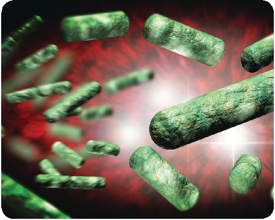

SHUTTERSTOCK

###### Arsenic

Arsenic is an element that occurs naturally in rocks and soil and is used for a variety of purposes within industry and agriculture. It is also a by-product of copper smelting, mining, and coal burning.

Arsenic can enter the water supply naturally, from arsenic-rich rock or soil deposits that spread across the ground, or from agricultural and industrialmostly mining and metal-processing—pollution that seeps into the ground.Once on the ground or in surface water, arsenic can slowly enter a water supply. High arsenic levels in private wells may come

from certain arsenic-containing fertilizers used in the past, industrial waste, or improper well construction. During agricultural production, food can be exposed to arsenic through soil, water, and air.43

A large intake of arsenic can cause irritation of the stomach and intestines, with symptoms such as stomachache, nausea, and vomiting. Infants and children who are exposed to arsenic may have many of the same effects as adults, including irritation of the stomach and intestines, blood vessel damage, skin changes, and reduced nerve function.44 ä See also: “FDA Feeding Advice on Reducing Exposure to Arsenic,” next page.

The CDC recommends having well water tested at least once a year to be sure any arsenic problems are under control.45 Heating or boiling your water, or adding a chlorine disinfectant, will not remove arsenic. If a problem in a private well is suspected, the local health department should be contacted. The State certification officer can provide a list of laboratories in the area that will test the water for a fee. ä See also: “A Safe Water Supply,” pages 198–200.

###### Copper

High levels of copper can dissolve from some pipes in areas with corrosive water. Corrosive water tends to have a higher level of acid, which eats away at the contents of a pipe.46 Copper, which is beneficial at lower levels, is a health risk at levels above 1.3 milligrams per liter of water. Acute exposure to copper can result in gastrointestinal symptoms such as nausea, vomiting, stomach cramps, and diarrhea. Chronic exposure can cause liver or kidney damage. Studies show that a small percentage of infants are unusually sensitive to copper. When water is tested, it can be tested for copper. If high levels of copper are found, encourage parents and caregivers to contact a health care provider for advice.46

###### Lead

Lead is a poisonous metal that can accumulate in the body and cause brain, nerve, and kidney damage; anemia; and even death. Lead is especially dangerous, even with short-term exposure, to infants, children, and pregnant women.47 While lead exposure can take place through sources such as

paint chips, lead dust, toys, and pottery, it can also be consumed in drinking water.48

Lead levels are typically low in groundwater and surface water. Lead can enter drinking water from plumbing materials that carry water to and within homes and residential buildings. Until the Federal Government banned the manufacture of lead plumbing materials in 1986, pipes and solder containing lead were often used in water systems and homes.49 Residents in older homes today must be aware of this concern; lead can be present in

###### F DA Feeding Advice on Reducing Exposure to Arsenic

Just as consuming infant formula prepared with arsenic-contaminated water can be harmful to an infant, consuming some arsenic-containing foods can be harmful as well. Arsenic-containing foods include rice and rice cereals, seafood, mushrooms, poultry, and certain kinds of seaweed. ä See also: “Arsenic,” page 202.

The FDA is taking steps to reduce inorganic arsenic in infant rice cereal, a leading source of arsenic exposure in infants. Through a draft guidance to industry, the FDA is proposing a limit or “action level” of 100 parts per billion (ppb) for inorganic arsenic in infant rice cereal. FDA testing found that the majority of infant rice cereal on the market either meets, or is close to, the proposed action level.

The FDA encourages parents and caregivers to follow the advice of the American Academy of Pediatrics (AAP) and to feed their infants and toddlers a variety of grains as part of a wellbalanced diet. In addition, the FDA provides the following advice for consumers:

QRice cereal fortified with iron is a good source of nutrients, but it should not be the only source. Other fortified infant cereals include oat, barley, and other grains.

drinking water at high enough levels to warrant concern.50 The AAP policy statement “Prevention of Childhood Lead Toxicity” recommends at the very least running water for 1 to 2 minutes to flush out the contaminants and to replace leadcontaminated pipes.51 ä See also: “Water for Infants: Get the Lead Out!,” page 206.

Parents and caregivers should be aware if their homes exhibit these features or conditions:52

QCook rice in extra water (6–10 parts water to 1 part rice), and then drain the water; this can reduce arsenic content by 40 to 60 percent, depending on the type of rice. Be aware that this may also remove key nutrients.

The FDA has found that long-term arsenic exposure in infants can affect IQ scores and result in lower performance on developmental learning tests.

Sources: “Arsenic in Rice and Rice Products,” U.S. Food and Drug Administration, last modified June 29, 2016, http://www.fda.gov/Food/FoodborneIllnessContaminants/ Metals/ucm319870.htm; “For Consumers: Seven Things Pregnant Women and Parents Need to Know about Arsenic in Rice,” U.S. Food and Drug Administration, last modified April 1, 2016, https://www.fda.gov/ ForConsumers/ConsumerUpdates/ucm493677.htm#5; “AAP Welcomes FDA Announcement on Limiting Arsenic in Infant Rice Cereal,” American Academy of Pediatrics, April 1, 2016, https://www.aap.org/en-us/about-the-aap/ aap-press-room/pages/aap-welcomes-fda-announcement

-on-limiting-arsenic-in-infant-rice-cereal.aspx; “Arsenic,” Agency for Toxic Substances and Disease Registry, last modified October 14, 2015, https://www.atsdr.cdc.gov/ sites/toxzine/arsenic_toxzine.html; “Trace Elements National Synthesis Project,” U.S. Geological Survey, last modified March 4, 2014, https://water.usgs.gov/nawqa/ trace/pubs/gw_v38n4/; “FDA Looks for Answers on Arsenic in Rice,” U.S. Food and Drug Administration, last modified November 15, 2013, http://www.fda.gov/ ForConsumers/ConsumerUpdates/ucm319827.htm; U.S. Environmental Protection Agency, Arsenic Occurrence in Public Drinking Water Supplies (Washington, DC: Office of Water, 2000), vi, 59–85; Minnesota Department of Health, “Arsenic in Drinking Water and Your Patients’ Health,” 2003, http://www.health.state.mn.us/divs/eh/hazardous/ topics/arsenicfct.pdf.

QBrass fixtures. Although these fixtures have low lead levels, the lead in them can dissolve into the water, especially when the fixtures are new.

QCopper pipes with lead solder. These are found in homes built before the 1986 ban on lead in pipes. These pipes are still new enough that mineral deposits have not yet built up to cover the harmful lead.

QSoft water. The chemical composition of this water allows it to pull, or leach, metals from lead pipes; hard water, on the other hand, is resistant to leaching toxic metals.

QWater that has sat in lead pipes or pipes with lead solder for several hours. The water can contain lead that leached from the pipe.

NOTE: Drink or cook only with water that comes out of the tap cold. Water that comes out of the tap warm or hot can contain much higher levels of lead. Boiling this water will NOT reduce the amount of lead in the water.

kinds of bowls and dishes, especially if they are imported from another country:

- •Leaded crystal bowls, pitchers, or other containers
- •Decorative ceramic or pewter vessels or dishes
- •Antique utensils

QAlways store foods or beverages in plastic or

regular glass containers.

###### Mercury

A naturally occurring element found in Earth’s crust, mercury is released into the atmosphere by natural geological activity and mining. Mercury is used in a number of commercial products, including thermostats, older thermometers, fluorescent light bulbs, pesticides, and two kinds of batteries: button cell and mercuric oxide. Mercury-containing products and the companies who manufacture them are possible sources of mercury contamination. Mercury also enters the environment through the combustion of fossil fuels.55

Since a person cannot see, taste, or smell lead dissolved in water, household drinking water must be tested to determine its lead content. The local water utility or local department of health can provide information and assistance regarding testing for lead and how to locate a qualified laboratory. Testing is especially important because flushing may not be effective in all cases. For instance, it may not reduce lead levels in high-rise buildings with lead-soldered central piping or in homes receiving water through lead service lines. The local water utility company can be contacted for information on the pipes carrying water into a home.53

The natural release of mercury from Earth’s crust can affect drinking water, but man-made causes for mercury contamination are far more common. Mercury that is spilled or improperly stored at industrial and hazardous waste sites can penetrate underground water supplies, thus contaminating private water sources. Even simple household products, such as light bulbs and thermostats, can leak mercury into the environment if not properly discarded. Mercury also can be present at former agricultural sites where mercury-containing pesticides were once used.

###### Limiting Lead Exposure in Foods

An infant can also take in lead from foods that are stored or prepared in lead-rich vessels or prepared with lead-based utensils. Parents and caregivers should follow these guidelines to reduce an infant’s potential exposure to lead from foods:54

QNever feed an infant canned imported foods or beverages. These cans may have lead seams, and lead in seams can enter the food.

QWhen preparing, serving, and storing foods and

beverages for an infant, avoid using the following

Over time, mercury can build up in the body until it causes health problems. The EPA has established that repeated exposure to mercury at levels above the maximum contaminant level (MCL) of 2 parts per billion (ppb)—an amount compared to two pinches of salt in a 10-ton bag of potato chips—can cause damage to the brain and kidneys, depending on the type and amount of the mercury contamination.56 Mercury can also harm a developing fetus.

MCL: Maximum contaminant level. This is the highest level of a contaminant that is allowed in drinking water.

###### H ow Can Diet Help Reduce Negative Impacts of LeadContaminated Water?

Ensuring proper nutrition is critical to mitigating lead absorption in the body. Parents and caregivers can reduce the negative impacts of lead-contaminated water by using nutrition as a tool to help prevent lead absorption into the body.

Although no food can undo lead exposure completely, foods rich in iron, vitamin C, and calcium are thought to help limit the absorption of lead by the body. Older infants consuming complementary foods and children can obtain these nutrients by eating the following foods:

QIron-rich foods. Normal levels of iron work to protect the body from the harmful effects of lead. Good sources of dietary iron include iron-fortified cereal, legumes, peanut butter, and lean red meat.

QVitamin C–rich foods. Vitamin C– and ironrich foods work together to reduce lead absorption. Good sources of vitamin C include oranges, green and red peppers, and 100 percent fruit juice.

QCalcium-rich foods. Calcium reduces lead absorption and helps make teeth and bones strong. Good sources of calcium include lowfat and fat-free milk, yogurt, or cheese; canned sardines; and green leafy vegetables such as spinach, kale, and collard greens. Calciumfortified, soy-based beverages are also good sources of calcium. To check the iron, vitamin C, and/or calcium content of foods, visit https://ndb.nal.usda.gov/ndb/search/list.

Sources: U.S. Environmental Protection Agency, “Lead Poisoning Prevention Tips for Families,” November 2001, https://www.epa.gov/sites/production/ files/2014-02/documents/fight_lead_poisoning_with_a_ healthy_diet.pdf; U.S. Department of Agriculture, “Promoting Balanced Diets Featuring Key Nutrients,” accessed April 2017, https://www.fns.usda.gov/sites/ default/files/disaster/Balanced-Diets-Key-Nutrients.pdf.

###### Mercury in Fish

Mercury is of greatest concern when consuming fish. The FDA and EPA have issued advice regarding eating fish that is geared toward women who are pregnant or may become pregnant, breastfeeding mothers, and parents and caregivers of young children.

The FDA-EPA advice is for children age 2 years and older:57

QEating a variety of fish is better than eating the

same type every time.

QAvoid any fish with high levels of mercury. These include king mackerel, swordfish, shark, tilefish, orange roughy, marlin, and bigeye tuna.

QConsume fish from the FDA-EPA “Best Choices” list. These fish are lowest in mercury: canned light tuna, salmon, shrimp, cod, catfish, clams, flounder, tilapia, haddock, crab, scallops, and pollock. (Note that albacore or “white” tuna has more mercury than does canned light tuna.)

QParents and caregivers can feed fish to young children, but they should not feed fish to infants younger than 6 months of age.

More information about the advice, including the number of servings and serving sizes for adults and children, can be found on the FDA and EPA websites: https://www.fda.gov/ForConsumers/ ConsumerUpdates/ucm397443.htm. ä See also: Chapter 5, “Fish: The Benefits and Concerns,” page 127.

For information about the safety of fish caught locally, parents and caregivers should contact State and local health departments. State health departments can also give advisories on toxins besides mercury that may be present in local waters.

###### Nitrate

Water from private household or community wells may become contaminated from nitrate in fertilizer, septic tank waste, and improper disposal of human and animal waste.58 If the nitrate level in drinking water climbs above the national standard of 10 milligrams per liter of water (10 mg/L), it poses an

###### W ater for Infants: Get the Lead Out!

High levels of lead in tap water can cause health effects if the lead in the water enters the bloodstream and causes an elevated blood lead level. However, the risk will vary depending on the individual, the circumstances, and the amount of water consumed. For example, infants who drink formula prepared with lead-contaminated water may be at a higher risk because of the large volume of water they consume relative to their body size.

How to reduce or eliminate lead in the tap water? Lead in the tap water may be coming from the street pipe or connected pipes, it may also be coming from sources inside your home.

Until the lead source is eliminated, take the following steps any time you wish to use tap water for drinking or cooking, especially when the water has been off and sitting in the pipes for more than 6 hours. Please note that additional flushing is necessary:

immediate threat to infants.59 In infants younger than 6 months old, exposure to high levels of nitrate from well water may cause vomiting, diarrhea, and methemoglobinemia, a condition that results in oxygen deficiency. The current water standard for nitrate has been set to protect infants from this condition.60 Fortunately, infants who are breastfed are not susceptible to nitrate poisoning from mothers who drink water with high nitrate levels because the milk’s nitrate concentration does not significantly increase.61

Parents and caregivers with private household wells should have their water tested for nitrate, especially if home gardening and other agricultural activities occur in the area, or if animal and human waste are suspected to be entering the well. Community well users who suspect that their water is contaminated can contact their State public water supply agency to determine next steps.62 ä See also: “A Safe Water Supply,” pages 198–200.

QBefore using any tap water for drinking or cooking, run high-volume taps (such as your shower) on COLD for 5 minutes or more;

QThen, run the kitchen tap on COLD for 1–2

additional minutes;

QFill a clean container(s) with water from this tap. This water will be suitable for drinking, cooking, preparation of infant formula, or other consumption. To conserve water, collect multiple containers of water at once (after you have fully flushed the water from the tap as described). ä See also: “How Do I Remove Heavy Metals From My Drinking Water?,” page 208.

NOTE: If parents or caregivers are concerned about the lead level in water or if lead contamination is found through testing, they should seek guidance from their health care provider.

Sources: Source: CDC (Centers for Disease Control and Prevention), “Lead, Water” available at: https://www.cdc. gov/nceh/lead/tips/water.htm Page last updated: February 18, 2016 Accessed 12/14/17

If the nitrate level in well water is confirmed to be above 10 mg/L, parents and caregivers should take the following steps:

QConsult a health care provider immediately. QFeed the infant water from an alternative source

that has less than 10 mg/L of nitrate.

QBreastfeed the infant, as nitrate concentration does not increase in human milk, even if the mother drinks high-nitrate water.63

QDo not use the water in infant formula, especially if

boiled, as boiling concentrates the nitrate.64 QGive the infant ready-to-feed formula instead of a concentrated or powdered mix that requires dilution with water.

###### Nitrate in Vegetables

When counseling parents and caregivers who give infants complementary foods before the recommended age of about 6 months, assess if the infant is developmentally ready. Also, caution

###### S hould I Have My Water Tested for Mercury?

In the quest to make safe drinking water available for everyone, the EPA is working to reduce mercury pollution and exposures to mercury across the Nation.

Under the Safe Drinking Water Act, the EPA in 1991 set an enforceable regulation, called a maximum contaminant level (MCL), for inorganic mercury at 0.002 mg/L or 2 ppb. Public water systems must ensure that its drinking water does not exceed the MCL for mercury.

However, people who use private water supplies are responsible for ensuring the quality of their water. Private water sources should be tested for contamination at least once a year.

The presence of germs and harmful chemicals will depend on where a well is located on a piece of property, in which State the property is, and whether the land is in an urban or rural area. The local health department’s environmental section can clarify which contaminants are problems in each region. Testing should measure levels of mercury, lead, arsenic, radium, atrazine, and other pesticides. It is important to know that no single test can identify all possible contaminants.

The EPA designates each State, and each Indian Tribal Organization, to be responsible for enforcing drinking water standards, as long as they meet key requirements. All public water systems must ensure that drinking water does not exceed the MCL for mercury. If an initial test shows that mercury is below the recommended MCL or 2 ppb mercury-to-water level, yearly follow-up testing is generally not needed unless noticeable changes occur in water quality or in the health of the residents.

If the water supply does test higher than the MCL, recommendations from the environmental

health section at the local health department may include the following:

QSwitch to bottled water for all drinking and cooking. Never boil water, because it can release mercury into the air and increase levels of mercury in the water.

QConsider water treatment methods specially designed to remove mercury. The local health department’s environmental health section can give guidance. In addition, NSF International has information on selecting filters. Call 1-800-673-8010 or visit its website, http://www. nsf.org.

QIdentify a new water source. Drilling a deeper well or accessing a different aquifer (the source of underground water) may be recommended. A connection may need to be made to an alternative water source such as a public or city water line.

For more information on water testing for mercury or other chemicals, contact the local health department or the EPA Safe Drinking Water Hotline at 1-800-426-4791, or visit one of the EPA web pages listed under “A Safe Water Supply,” pages 198–199.

Sources: “Drinking Water FAQ,” Centers for Disease Control and Prevention, last modified June 20, 2012, https://www.cdc.gov/healthywater/drinking/public/ drinking-water-faq.html; Centers for Disease Control and Prevention, “Mercury,” last modified December 23, 2016, https://www.cdc.gov/biomonitoring/Mercury _FactSheet.html; “Mercury,” Agency for Toxic Substances and Disease Registry, last modified October 14, 2015, https://www.atsdr.cdc.gov/sites/toxzine/mercury_toxzine

.html; “Environmental Laws that Apply to Mercury,” U.S. Environmental Protection Agency, last modified January 19, 2017, https://www.epa.gov/mercury/ environmental-laws-apply-mercury#CleanWaterAct; “What EPA Is Doing to Reduce Mercury Pollution, and Exposures to Mercury,” U.S. Environmental Protection Agency, last modified April 14, 2016, https://www.epa.gov/ mercury/what-epa-doing-reduce-mercury-pollution-and -exposures-mercury; “EPA News about Mercury, 2008– Present,” U.S. Environmental Protection Agency, last modified August 26, 2016, https://www.epa.gov/ mercury/epa-news-about-mercury-2008-present.

against using certain vegetables that contain nitrate. The AAP recommends that spinach, beets, turnips, carrots, and collard greens prepared at home should not be fed to infants less than 6 months old because they may contain sufficient amounts of nitrate to cause methemoglobinemia.65

The nitrate in these vegetables is converted to nitrite before ingestion or while in the infant’s stomach. The nitrite binds to iron in the blood and hinders the blood’s ability to carry oxygen. The risk of developing methemoglobinemia is only present with homeprepared, high-nitrate vegetables.

Commercially prepared infant and junior spinach, carrots, and beets contain only traces of nitrate and are not considered a risk to the infant. Manufacturers of infant foods select produce grown in areas of the country that do not have high nitrate levels in the soil, and they monitor the amount of nitrate in the final product. A health care provider should always be made aware that a parent or caregiver is feeding foods with nitrates. ä See also: Chapter 5, “Vegetables High in Nitrates or Nitrites,” page 136.

###### How Do I Remove Heavy Metals From My Drinking Water?

Heating or boiling your water will not remove heavy metals, such as lead, mercury, arsenic or copper. Because some of the water evaporates during the boiling process, the contaminants concentrations can actually increase slightly as the water is boiled. Additionally, chlorine (bleach) disinfection will not remove them.

You may wish to consider water treatment methods such as reverse osmosis, ultrafiltration, distillation, or ion exchange. There are carbon filters specially designed to removed lead. Typically these methods are used to treat water at only one faucet. Contact your local health department for recommended procedures. Remember to have your well water tested regularly, at least once a year, to make sure the problem is controlled.

Sources: CDC (Centers for Disease Control and Prevention), “Lead, Water” available at: https://www. cdc.gov/nceh/lead/tips/water.htm Page last updated: February 18, 2016 Accessed 12/14/17; “Drinking Water, Diseases and Contaminants”Page last updated: July 1, 2015 Accessed 12/14/17;

###### Endnotes

- 1 R. E. Kleinman and F. R. Greer, eds., Pediatric Nutrition, 7th ed. (Elk Grove Village, IL: American Academy of Pediatrics, 2014), 717–19; “Global Diarrhea Burden,” Centers for Disease Control and Prevention, last updated December 17, 2015, https://www.cdc.gov/healthywater/global/diarrhea-burden.html; N. CaJacob and M. Cohen, “Update on Diarrhea,” Pediatrics in Review 37, no. 8 (August 2016): 313–22,http://pedsinreview.aappublications.org/content/37/8/313.
- 2 “Handwashing: Clean Hands Save Lives,” CDC (Centers for Disease Control and Prevention), last modified January 27, 2017, https://www.cdc.gov/handwashing/.
- 3 “Handwashing: Clean Hands Save Lives,” CDC; “E. coli (Escherichia coli): General Information,” CDC (Centers for Disease Control and Prevention), last modified November 6, 2015, https://www.cdc.gov/ ecoli/general/; “Influenza (Flu): Stopping the Spread of Germs at Home, Work & School,” Centers for Disease Control and Prevention, last modified August 19, 2015, https://www.cdc.gov/flu/protect/stopgerms.htm.
- 4 “Handwashing: Clean Hands Save Lives,” CDC.
- 5 “Clean: Wash Hands and Surfaces Often,” Foodsafety.gov, accessed April 20, 2017, https://www. foodsafety.gov/keep/basics/clean/index.html.
- 6 “Proper Handling and Storage of Human Milk,” CDC (Centers for Disease Control and Prevention), last modified June 9, 2016, https://www.cdc.gov/breastfeeding/recommendations/handling_breastmilk.htm.
- 7 Dina DiMaggio, “Tips for Freezing & Refrigerating Breast Milk,” last modified September 9, 2016, https://www.healthychildren.org/English/ages-stages/baby/breastfeeding/Pages/Storing-and-PreparingExpressed-Breast-Milk.aspx.
- 8 Kleinman and Greer, Pediatric Nutrition, 68; “Proper Handling and Storage of Human Milk,” CDC.
- 9 “Food Safety for Moms to Be: Once Baby Arrives,” FDA (U.S. Food and Drug Administration), last modified November 8, 2017, https://www.fda.gov/Food/ResourcesForYou/HealthEducators/ucm089629.htm; “Infant and Toddler Health,” Mayo Clinic, last modified August 24, 2016, http://www.mayoclinic.org/ healthy-lifestyle/infant-and-toddler-health/in-depth/infant-formula/art-20045791?pg=2; “FDA Takes Final Step on Infant Formula Protections,” U.S. Food and Drug Administration, last modified August 24, 2016, https://www.fda.gov/ForConsumers/ConsumerUpdates/ucm048694.htm.
- 10 “Escherichia coli O157:H7 and Other Shiga Toxin-Producing E. coli (STEC),” U.S. Department of Agriculture, Food Safety and Inspection Service, last modified October 15, 2015, http://www.fsis.usda. gov/wps/portal/fsis/topics/food-safety-education/get-answers/food-safety-fact-sheets/foodborne-illness-and-disease/escherichia-coli-o157h7/CT_Index; “E. coli (Escherichia coli): General Information,” CDC; “Fresh Pork from Farm to Table,” U.S. Department of Agriculture, Food Safety and Inspection Service, last modified August 6, 2013, http://www.fsis.usda.gov/wps/portal/fsis/topics/food-safety-education/get-answers/food-safety-fact-sheets/meat-preparation/fresh-pork-from-farm-to-table/CT_ Index; “Food Safety Information: Parasites and Foodborne Illness,” U.S. Department of Agriculture, Food Safety and Inspection Service, last modified June 2011, http://www.fsis.usda.gov/wps/wcm/connect/ 48a0685a61ce-4235-b2d7-f07f53a0c7c8/Parasites_and_Foodborne_Illness.pdf?MOD=AJPERES; D. Hayes, “Introducing Solid Foods to Toddlers,” Academy of Nutrition and Dietetics, January 31, 2014, http://www. eatright.org/resource/food/nutrition/dietary-guidelines-and-myplate/introducing-solid-foods-to-toddlers; Kleinman and Greer, Pediatric Nutrition, 136; “Food Safety for Moms to Be: Once Baby Arrives,” FDA; “Are You Storing Food Safely?,” FDA (U.S. Food and Drug Administration), last modified September 22, 2016, https://www.fda.gov/ForConsumers/ConsumerUpdates/ucm093704.htm.
- 11 “When and How to Wash Your Hands,” Centers for Disease Control and Prevention, last modified September 4, 2015, https://www.cdc.gov/handwashing/when-how-handwashing.html.

- 12 “Cutting Boards and Food Safety,” U.S. Department of Agriculture, Food Safety and Inspection Service, last modified August 2, 2013, https://www.fsis.usda.gov/wps/portal/fsis/topics/food-safety-education/ get-answers/food-safety-fact-sheets/safe-food-handling/cutting-boards-and-food-safety.
- 13 “Food Safety for Moms to Be: Once Baby Arrives,” FDA.
- 14 “Freezing and Food Safety,” U.S. Department of Agriculture, last modified January 15, 2013, https:// www. fsis.usda.gov/wps/portal/fsis/topics/food-safety-education/get-answers/food-safety-fact-sheets/ safe-food-handling/freezing-and-food-safety/CT_Index.
- 15 Kleinman and Greer, Pediatric Nutrition, 136; “Working Together: Breastfeeding and Solid Foods,” American Academy of Pediatrics, last modified November 21, 2015, https://www.healthychildren.org/ English/ages-stages/baby/breastfeeding/Pages/Working-Together-Breastfeeding-and-Solid-Foods.aspx; “Are You Storing Food Safely?,” FDA.
- 16 “Safe Minimal Internal Temperature Chart,” USDA FSIS (U.S. Department of Agriculture, Food Safety and Inspection Service), last modified January 15, 2015, http://www.fsis.usda.gov/wps/portal/fsis/ topics/food-safety-education/get-answers/food-safety-fact-sheets/safe-food-handling/safe-minimum-internal-temperature-chart/ct_index; “Safe Minimum Cooking Temperatures,” Foodsafety.gov, accessed October 5, 2016, https://www.foodsafety.gov/keep/charts/mintemp.html; USDA FSIS, “Food Safety Information: Basics for Handling Food Safely” (revised August 2013), http://www.fsis.usda.gov/wps/ wcm/connect/18cece94-747b-44ca-874f32d69fff1f7d/Basics_for_Safe_Food_Handling.pdf?MOD=AJPERES; USDA FSIS, “Food Safety Information: Chicken from Farm to Table” (revised July 2014), http:// www.fsis.usda.gov/wps/wcm/connect/ad74bb8d-1dab-49c1-b05e-390a74ba7471/Chicken_from_Farm_ to_Table.pdf?MOD=AJPERES; USDA FSIS, “Food Safety Information: Beef from Farm to Table” (revised August 2014), http://www.fsis.usda.gov/wps/wcm/connect/c33b69fe-7041-4f50-9dd0-d098f11d1f13/ Beef_from_Farm_to_Table.pdf?MOD=AJPERES; “Ground Beef and Food Safety,” USDA FSIS, last modified February 29, 2016, http://www.fsis.usda.gov/wps/portal/fsis/topics/food-safety-education/ get-answers/ food-safety-fact-sheets/meat-preparation/ground-beef-and-food-safety/CT_Index; “Are You Storing Food Safely?,” FDA; “Separate, Don’t Cross-Contaminate,” Foodsafety.gov, accessed April 21, 2017, https://www.foodsafety.gov/keep/basics/separate/index.html.
- 17 “Eggs and Egg Products,” Foodsafety.gov, accessed February 2017, https://www.foodsafety.gov/keep/ types/eggs/index.html; “Egg Safety: What You Need to Know,” U.S. Food and Drug Administration, last modified May 2, 2016, http://www.fda.gov/Food/ResourcesForYou/Consumers/ucm077342.htm; “Egg Products and Food Safety,” U.S. Department of Agriculture, Food Safety and Inspection Service, last modified August 10, 2015, http://www.fsis.usda.gov/wps/portal/fsis/topics/food-safety-education/ get-answers/food-safety-fact-sheets/egg-products-preparation/egg-products-and-food-safety/ct_index.
- 18 F. R. Greer, S. H. Sicherer, and A. W. Burks, “Effects of Early Nutritional Interventions on the Development of Atopic Disease in Infants and Children: The Role of Maternal Dietary Restriction, Breastfeeding, Timing of Introduction of Complementary Foods, and Hydrolyzed Formulas,” Pediatrics 121, no. 1 (January 2008): 183–91.
- 19 N. Zibdeh, “Protein Foods for Your Vegetarian Child,” Academy of Nutrition and Dietetics, February 14, 2014, http://www.eatright.org/resource/food/nutrition/vegetarian-and-special-diets/ protein-foods-for-your-vegetarian-child; U.S. Department of Agriculture, U.S. Department of Health and Human Services, “Appendix A: Practice Choking Prevention,” in Nutrition and Wellness Tips for Young Children: Provider Handbook for the Child and Adult Care Food Program (Washington, DC: USDA-HHS, 2013), 77–79.
- 20 “Produce: Selecting and Serving It Safely,” U.S. Food and Drug Administration, last modified April 6, 2016, http://www.fda.gov/Food/ResourcesForYou/Consumers/ucm114299; “Are You Storing Food Safely?,” FDA; K. Holt et al., eds., Bright Futures: Nutrition, 3rd ed. (Elk Grove Village, IL: American Academy of Pediatrics,

- 2011), 47–48; Institute of Food Technologists, “Analysis of Microbial Hazards Related to Time/Temperature Control of Foods for Safety,” chap 4. in Evaluation and Definition of Potentially Hazardous Foods, a report prepared for the U.S. Food and Drug Administration, last modified November 26, 2014, http://www.fda.gov/ Food/FoodScienceResearch/SafePracticesforFoodProcesses/ucm094147.htm. “Food Safety for Moms to Be: Once Baby Arrives,” U.S. Food and Drug Administration, last modified August 16, 2016, http://www.fda.gov/ Food/ResourcesForYou/HealthEducatorsucm089629.htm; Kleinman and Greer, Pediatric Nutrition, 136; Dietz and Stern, Nutrition: What Every Parent Needs to Know, 41.
- 21 “Baby Food and Infant Formula,” Foodsafety.gov, accessed April 27, 2017, https://www.foodsafety.gov/ keep/types/babyfood/index.html; “Food Safety for Moms to Be: Once Baby Arrives,” FDA.
- 22 U.S. Environmental Protection Agency, “Consumer Confidence Report Rule: A Quick Reference Guide,” last modified August 2009, https://www.epa.gov/sites/production/files/2014-05/documents/guide_qrg_ ccr_2011.pdf; “CCR Information for Consumers,” EPA (U.S. Environmental Protection Agency), last modified December 1, 2016, https://www.epa.gov/ccr/ccr-information-consumers.
- 23 U.S. Environmental Protection Agency, “Best Practices Factsheet: Consumer Confidence Report,” July 2015, 1–15, https://www.epa.gov/sites/production/files/2015-09/documents/epa816f15002.pdf.
- 24 U.S. Environmental Protection Agency, “Consumer Confidence Report Rule and Rule History for Water Systems,” last modified December 2012, https://www.epa.gov/ccr/consumer-confidence -report-ruleand-rule-history-water-systems; “CCR Information for Consumers,” EPA.
- 25 “Overview of Water-Related Diseases and Contaminants,” CDC (Centers for Disease Control and Prevention), last modified July 2, 2015, https://www.cdc.gov/healthywater/drinking/private/wells/ diseases.html; U.S. Census Bureau, American Housing Survey for the United States: 2007, Current Housing Reports H150/07 (Washington, DC: U.S. Government Printing Office, 2008), 1–642, accessed February 2017, https://www.census.gov/prod/2008pubs/h150-07.pdf.
- 26 “Well Testing,” CDC (Centers for Disease Control and Prevention), last modified May 3, 2010. https:// www.cdc.gov/healthywater/drinking/private/wells/testing.html; “Drinking Water FAQ,” CDC (Centers for Disease Control and Prevention), last modified June 20, 2012, http://www.cdc.gov/healthywater/drinking/drinking-water-faq.html#wells.
- 27 “Overview of Water-Related Diseases and Contaminants,” CDC; “Overview of Water-Related Diseases and Contaminants,” CDC; “Contaminants Found in Groundwater,” USGS (U.S. Geological Survey), last modified December 2, 2016, https://water.usgs.gov/edu/groundwater-contaminants.html; “Well Siting and Potential Contaminants,” Centers for Disease Control and Prevention, last modified April 10, 2009, https://www.cdc.gov/healthywater/drinking/private/wells/location.html.
- 28 “Community Water Fluoridation: Private Wells,” CDC (Centers for Disease Control and Prevention), last modified March 18, 2015, http://www.cdc.gov/fluoridation/faqs/wellwater.htm; “Fluorosis,” CDC (Centers for Disease Control and Prevention), last modified June 1, 2016, https://www.cdc.gov/fluoridation/faqs/dental_fluorosis/index.htm; M. J. Brown and S. Margolis, “Lead in Drinking Water and Human Blood Lead Levels in the United States,” Centers for Disease Control and Prevention, Morbidity and Mortality Weekly Report Supplements 61, no. 4 (August 10, 2012): 1–9, https://www.cdc.gov/mmwr/preview/mmwrhtml/su6104a1.htm/; “Fluorosis,” CDC.
- 29 “The FDA Regulates the Safety of Bottled Water Beverages Including Flavored Water and Nutrient- Added Water Beverages,” U.S. Food and Drug Administration, last modified April 4, 2016, http:// www.fda.gov/ Food/ResourcesForYou/Consumers/ucm046894.htm; L. Posnick and H. Kim, “Bottled Water Regulation and the FDA,” Food Safety Magazine (August/September 2002), last modified October 3, 2014, http:// www.fda.gov/Food/FoodborneIllnessContaminants/BuyStoreServeSafeFood/ ucm077079.htm.
- 30 “Commercially Bottled Water,” CDC (Centers for Disease Control and Prevention), last modified April 17, 2014, http://www.cdc.gov/healthywater/drinking/bottled/index.html.

- 31 Posnick and Kim, “Bottled Water Regulation and the FDA.
- 32 “Commercially Bottled Water,” CDC; U.S. Environmental Protection Agency, Water Health Series: Bottled Water Basics, September 2005, https://www.epa.gov/sites/production/files/2015-11/documents/2005_09_14_faq_fs_healthseries_bottledwater.pdf; Posnick and Kim, “Bottled Water Regulation and the FDA.”
- 33 “Choosing Home Water Filters and Other Water Treatment Systems,” CDC (Centers for Disease Control and Prevention), last modified June 3, 2014, https://www.cdc.gov/healthywater/drinking/home-water-treatment/water-filters.html.
- 34 “Parasites-Cryptosporidium (also known as ‘Crypto’),” CDC (Centers for Disease Control and Prevention), last modified August 2016, https://www.cdc.gov/parasites/crypto/; “Diseases and Contaminants: Cryptosporidium,” Centers for Disease Control and Prevention, last modified July 1, 2015, https://www.cdc.gov/healthywater/drinking/private/wells/disease/cryptosporidium.html; “Choosing Home Water Filters and Other Water Treatment Systems, CDC.
- 35 “Drinking Water FAQ,” CDC.
- 36 “E. coli (Escherichia coli),” Centers for Disease Control and Prevention, last modified September 24, 2016, https://www.cdc.gov/ecoli/; “Diseases and Contaminants: E. coli,” Centers for Disease Control and Prevention, https://www.cdc.gov/healthywater/drinking/private/wells/disease/e_coli.html, last modified July 1, 2015; “E. Coli,” Foodsafety.gov, accessed February 2017, https://www.foodsafety.gov/ poisoning/ causes/bacteriaviruses/ecoli/; “Shiga Toxin-Producing E. Coli and Food Safety,” Centers for Disease Control and Prevention, last modified May 5, 2016, https://www.cdc.gov/features/ecoli infection/.
- 37 “Drinking Water FAQ,” CDC.
- 38 58 “Salmonella,” CDC (Centers for Disease Control and Prevention), last modified August 25, 2016, https://www.cdc.gov/salmonella/general/index.html; “Quick Tips for Preventing Salmonella “CDC (Centers for Disease Control and Prevention), last modified March 9, 2015, https://www.cdc.gov/salmonella/general/prevention.html.
- 39 “Rotavirus in the U.S.,” CDC (Centers for Disease Control and Prevention), last modified August 12, 2016, https:// www.cdc.gov/rotavirus/surveillance.html.
- 40 “Rotavirus,” CDC (Centers for Disease Control and Prevention), last modified August 12, 2016, https:// www. cdc.gov/rotavirus/clinical.html.
- 41 “Diseases and Contaminants,” CDC (Centers for Disease Control and Prevention), last modified July 1, 2015, https://www.cdc.gov/healthywater/drinking/private/wells/disease/rotavirus.html
- 42 “Rotavirus,” CDC; D. C. Payne, M. Wikswo, and U. D. Parashar, “Rotavirus,” in Manual for the Surveillance of Vaccine-Preventable Diseases, ed. S. W. Roush and L. M. Baldy (Atlanta: CDC, 2008), last modified April 1, 2014, http://www.cdc.gov/vaccines/pubs/surv-manual/chpt13-rotavirus.html.
- 43 “Arsenic Toxicity: Where Is Arsenic Found?,” Agency for Toxic Substances and Disease Registry, last modified January 15, 2010, https://www.atsdr.cdc.gov/csem/csem.asp?csem=1&po=5; J. Chung, S. Yu, and Y. Hong, “Environmental Source of Arsenic Exposure,” Journal of Preventive Medicine and Public Health 7, no. 5 (September 2014): 253–57, doi:https://doi.org/10.3961/jpmph.14.036.
- 44 “Arsenic,” Agency for Toxic Substances and Disease Registry, last modified October 14, 2015, https:// www.atsdr.cdc.gov/sites/toxzine/arsenic_toxzine.html; “Arsenic in Rice and Rice Products,” U.S. Food and Drug Administration, last modified June 29, 2016, http://www.fda.gov/Food/ Foodborne Illness Contaminants/Metals/ucm319870.htm.
- 45 “Overview of Water-Related Diseases and Contaminants in Private Wells,” CDC.
- 46 “Diseases and Contaminants: Copper and Drinking Water from Private Wells,” Centers for Disease

- Control and Prevention, last modified July 1, 2015, https://www.cdc.gov/healthywater/drinking/private/ wells/disease/copper.html; B. Swistock, W. E. Sharpe, and P. D. Robillard, “Corrosive Water Problems,” Penn State Extension, 2017, http://extension.psu.edu/natural-resources/water/drinking-water/water-testing/pollutants/corrosive-water-problems; “Toxic Substances Portal: Copper,” ATSDR (Agency for Toxic Substances and Disease Registry), last modified October 24, 2011, https://www.atsdr.cdc.gov/toxfaqs/ tf.asp?id=205&tid=37.
- 47 AAP (American Academy of Pediatrics) Council on Environmental Health, “Policy Statement: Prevention of Childhood Lead Toxicity,” Pediatrics 138, no. 1 (July 2016): 1–15, http://pediatrics.aappublications.org/ content/pediatrics/138/1/e20161493.full.pdf.
- 48 “Lead in Tap Water and Household Plumbing: Parent FAQs,” AAP (American Academy of Pediatrics), last modified January 25, 2016, https://www.healthychildren.org/English/safety-prevention/at-home/ Pages/ Lead-in-Tap-Water-Household-Plumbing.aspx.
- 49 “Use of Lead Free Pipes, Fittings, Fixtures, Solder, and Flux for Drinking Water,” U.S. Environmental Protection Agency, last modified January 17, 2017, https://www.epa.gov/dwstandardsregulations/useleadfree-pipes-fittings-fixtures-solder-and-flux-drinking-water; “Water,” CDC (Centers for Disease Control and Prevention), last modified February 18, 2016, https://www.cdc.gov/nceh/lead/tips/water.htm.
- 50 “Diseases and Contaminants: Lead and Drinking Water from Private Wells,” CDC (Centers for Disease Control and Prevention), last modified July 1, 2015, https://www.cdc.gov/healthywater/drinking/private/ wells/disease/lead.html.
- 51 AAP Council on Environmental Health, “Policy Statement: Prevention of Childhood Lead Toxicity,” 8–9 “Diseases and Contaminants: Lead and Drinking Water from Private Wells,” CDC.
- 52 “Community Water Fluoridation,” Centers for Disease Control and Prevention, last modified July 10, 2013, https://www.cdc.gov/fluoridation/engineering/corrosion.htm#; “Lead,” Agency for Toxic Substances and Disease Registry, last modified October 14, 2015, https://www.atsdr.cdc.gov/sites/ toxzine/lead_toxzine.html; “Drinking Water,” Centers for Disease Control and Prevention, last modified March 14, 2014, https://www.cdc.gov/healthywater/drinking/home-water-treatment/household_water_ treatment.html.
- 53 “Lead in Tap Water and Household Plumbing: Parent FAQs,” AAP; “Water,” CDC; AAP Council on Environmental Health, “Policy Statement: Prevention of Childhood Lead Toxicity,” 8–9.
- 54 U.S. Food and Drug Administration, U.S. Department of Health and Human Services, “Overview of FDA Activities Addressing Lead in Food,” in Supporting Document for Recommended Maximum Level for Lead in Candy Likely to Be Consumed Frequently by Small Children (Silver Spring, MD.: FDA-HHS, 2006), last modified June 5, 2015, https://www.fda.gov/food/foodborneillnesscontaminants/metals/ucm172050.
- 55 “Mercury,” Centers for Disease Control and Prevention, last modified December 23, 2016, https://www. cdc.gov/biomonitoring/Mercury_FactSheet.html; “Mercury in Consumer Products,” U.S. Environmental Protection Agency, last modified July 7, 2016, https://www.epa.gov/mercury/mercury-consumer-products; “Basic Information About Mercury,” U.S. Environmental Protection Agency, last modified September 13, 2016, https://www.epa.gov/mercury/basic-information-about-mercury; “Mercury in Batteries,” U.S. Environmental Protection Agency, last modified April 6, 2017, https://www.epa.gov/mercury/mercury-batteries.
- 56 Z. Satterfield, “What Does PPM or PPB Mean?,” National Environmental Services Center, On Tap (Fall 2004), http://www.nesc.wvu.edu/ndwc/articles/ot/fa04/q&a.pdf.
- 57 “EPA-FDA Advice about Eating Fish and Shellfish,” U.S. Environmental Protection Agency, U.S. Food and Drug Administration, last modified January 17, 2017, https://www.epa.gov/fish-tech/2017-epaf-

- da-advice-about-eating-fish-and-shellfish; “Eating Fish: What Pregnant Women and Parents Should Know,” U.S. Food and Drug Administration, last modified January 18, 2017, https://www.fda.gov/ Food/ FoodborneIllnessContaminants/Metals/ucm393070.htm; U.S. Food and Drug Administration, “FDA and EPA Issue Final Fish Consumption Advice,” press release, January 18, 2017, https://www.fda. gov/ NewsEvents/Newsroom/PressAnnouncements/ucm537362.htm; U.S. Department of Agriculture, “Maternal Intake of Seafood Omega-3 Fatty Acids and Infant Health: A Review of the Evidence,” Nutrition Insight 46, February 2012, https://www.cnpp.usda.gov/sites/default/files/nutrition_insights_ uploads/Insight46.pdf; U.S. Department of Health and Human Services, U.S. Department of Agriculture, Dietary Guidelines for Americans 2015–2020, 8th ed. (Washington, DC: HHS-USDA, 2015), 24, accessed December 2016, http://health.gov/dietaryguidelines/2015/guidelines/.
- 58 “Diseases and Contaminants: Nitrate and Drinking Water from Private Wells,” CDC (Centers for Disease Control and Prevention), last modified July 1, 2015, https://www.cdc.gov/healthywater/drinking/private/ wells/disease/nitrate.html.
- 59 “Toxic Substances Portal: Nitrate and Nitrite,” Agency for Toxic Substances and Disease Registry, last modified November 23, 2015, https://www.atsdr.cdc.gov/toxfaqs/tf.asp?id=1186&tid=258.
- 60 “Case Studies in Environmental Medicine,” Agency for Toxic Substances and Disease Registry, last modified August 30, 2016, https://www.atsdr.cdc.gov/csem/csem.asp?csem=28&po=8.
- 61 F. R. Greer and M. Shannon, “Infant Methemoglobinemia: The Role of Dietary Nitrate in Food and Water,” Pediatrics 116, no. 3 (September 2005): 784–86, doi:10.1542/peds.2005-1497, reaffirmed April 2009.
- 62 “Disease and Contaminants: Nitrate and Drinking Water from Private Wells,” CDC.
- 63 Greer and Shannon, “Infant Methemoglobinemia: The Role of Dietary Nitrate in Food and Water,” 784– 86.
- 64 “Disease and Contaminants: Nitrate and Drinking Water from Private Wells,” CDC.
- 65 Kleinman and Greer, Pediatric Nutrition, 320–21; Greer and Shannon, “Infant Methemoglobinemia: The Role of Dietary Nitrate in Food and Water,” 784–86; “Nitrate/Nitrite Toxicity: Who Is at Most Risk of Adverse Health Effects from Overexposure to Nitrates and Nitrites?,” Agency for Toxic Substances and Disease Registry, last modified August 9, 2016, https://www.atsdr.cdc.gov/csem/csem.asp?csem=28&po=7.

SHUTTERSTOCK

## APPENDIXES

###### NOTE: These resources are for staff use only. Materials are not intended to be used as handouts for participants.

###### APPENDIX A –Using the WIC Works Resource System

The WIC Works Resource System (wicworks.fns.usda.gov), a project of the USDA, Food and Nutrition Service, is an online education and training center for WIC program staff. State and local agency nutrition and health professionals can increase knowledge and skills using the free tools available. Key resources accessible through the WIC Works Resource System include the WIC Nutrition Services Standards Online Self-Assessment, Value Enhanced Nutrition Assessment Guidance and Training, and WIC Learning Online, a series of online training courses for all levels of WIC staff. Select courses are approved for continuing education for nurses and dietitians.

WIC agencies can also utilize WIC Works as a vehicle to learn and share with each other. The State Sharing Gallery features State agency-developed staff training and participant education resources, and the Bulletin Board Exchange allows local agencies to share visuals for bulletin board displays that enhance the clinic environment.

The WIC Works Resource System gives access to an array of printable education, training, and outreach tools to be used with WIC participants. These include brochures, tip sheets, images, and videos on topics that are relevant to the WIC program mission and target audiences. An online order form allows WIC agencies to submit requests for available USDA publications.

Questions about the WIC Works Resource System can be directed to wicworks@usda.gov.

###### Guidelines for Feeding Healthy Infants

(for WIC staff)

Birth to 6 monthsStarting Complementary Foods

Use growth as a guide to determine adequacy of complementary

feeding practices. When discussing complementary feeding with

caregivers, advise on:

Exclusive breastfeeding is recommended for the first 6 months, with

continuation for the first year or longer as mutually desired by

mother and baby.lovingsupport.fns.usda.gov

foods such as iron-fortified cereal or baby meat which are both high in iron

and zinc. It is important to wait at least 3 to 5 days to observe for possible

with one feeding and gradually increase feedings to about three times per

When counseling on feeding practices in general, focus on the quality of the

allergic reactions or intolerances before starting another new food. Start

oEstablishing healthy/appropriate eating patterns, i.e., a variety of grains,

oIntroducing one new, single-ingredient food at a time starting with baby

age.By7 to 8 months of age, infants should be consuming food from all

oGradually increasing variety and amounts of each food with the infant’s

feeding environment, feeding routines and behaviors, and food choices,

oEstablishing predictable routines for meals and snacks

Last Updated: June 2017WIC Works Resource System - wicworks.fns.usda.gov

oAvoiding grazing behaviors with snacks or liquids

oResponding to infants’ hunger and satiety cues

oLimiting meal times to 15 to 20 minutes

oFeeding only in a high chair at the table

vegetables, fruits, and protein.

food groups.

day.

such as:

unless breastfeeding is contraindicated.

supports exclusive breastfeeding as the

stomachs can hold more milk and they

months of age, babies may consume

are better at breastfeeding; therefore,

feedings will be farther apart and may

few days, they will take 2 to 3 ounces

During growth spurts, the frequency

For newborns on formula, in the first

approximately 32 ounces per day.

standard method of infant feeding

of formula every 3 to 4 hours. By 6

times per day. As babies age, their

Newborns will breastfeed 8 to 12

The WIC Program promotes and

offeedings may increase.

For information on satiety cues, refer to the job aid

Developmental Skills/Infant Hunger& Satiety Cues

so it’s best to watch the baby, not the clock.

Babies do not feed on a strict schedule,

take less time.”

|Protein-rich  Foods|Only human milk (or formula) is needed for the first 6 months|~1 to 2 ounces  Plain strained/  pureed/mashed  meat, poultry, fish,  eggs, cheese, yogurt,  or mashed legumes|~2 to 4 ounces  Ground/finely  chopped/diced  meat, poultry, fish,  eggs, cheese, yogurt  or mashed legumes|
|---|---|---|---|
|Fruits|Only human milk (or formula) is needed for the first 6 months|~2 to 4 ounces  Plain strained/  pureed/mashed*|~4 to 6 ounces  Finely chopped/  diced*|
|Vegetables|Only human milk (or formula) is needed for the first 6 months|~2 to 4 ounces  Cooked, plain  strained/pureed/  mashed*|Cooked, finely  chopped/diced*  ~4 to 6 ounces|
|Grain  Products|Only human milk (or formula) is needed for the first 6 months|~1 to 2 ounces  Iron-fortified infant  cereals, bread, small  pieces of crackers|~2 to 4 ounces  Iron-fortified infant  cereals  Other grains: baby  crackers, bread,  noodles, corn grits, soft  tortilla pieces|
|Infant Formula|Only human milk (or formula) is needed for the first 6 months|Breastfeeding infants should continue to be  breastfed, on demand.  Though formula-fed infants take in ~24 to 32  ounces, provide an amount based on an individual  nutrition assessment.  Infants’ intake of human milk/formula may  decrease as complementary foods increase.|Provide guidance and encouragement to  breastfeeding mothers and continue to support  those mothers who choose to breastfeed beyond  12 months.  Formula-fed infants take in ~24 ounces, but  provide an amount based on an individual  nutrition assessment.|
|Human Milk|Only human milk (or formula) is needed for the first 6 months|Breastfeeding infants should continue to be  breastfed, on demand.  Though formula-fed infants take in ~24 to 32  ounces, provide an amount based on an individual  nutrition assessment.  Infants’ intake of human milk/formula may  decrease as complementary foods increase.|Provide guidance and encouragement to  breastfeeding mothers and continue to support  those mothers who choose to breastfeed beyond  12 months.  Formula-fed infants take in ~24 ounces, but  provide an amount based on an individual  nutrition assessment.|
|Age|Birth to 6 months|6 to 8 months  Start complementary foods  when developmentally  ready, about 6 months  Start with  ~0.5 - 1 ounces|8 to 12 months|

eggs, cheese, yogurt,

eggs, cheese, yogurt

or mashed legumes

or mashed legumes

meat, poultry, fish,

meat, poultry, fish,

Infantsunder 12 months of age should not consume juice unless clinically indicated. After 12 months, encourage fruit over fruit juice; any juice consumed should be as*

pureed/mashed

Products VegetablesFruitsProtein-rich

chopped/diced

~2 to 4 ounces

~1 to 2 ounces

Plain strained/

Ground/finely

Foods

pureed/mashed*

Finely chopped/

~2 to 4 ounces

~4 to 6 ounces

Plain strained/

diced*

###### n milk (or formula) is needed for the first 6 months

strained/pureed/

chopped/diced*

~4 to 6 ounces

Cooked, finely

- ~1 to 2 ounces

Iron-fortified infant

cereals, bread, small

pieces of crackers

- ~2 to 4 ounces

St Cooked, plain

###### Typical Daily Portion Sizes(serving sizes may vary with individual infants)

mashed*

part of a meal or snack and from an open cup (i.e., not bottles or easily transportable covered cups).

noodles, corn grits, soft

Iron-fortified infant

Other grains: baby

crackers, bread,

~2 to 4 ounces8

tortilla pieces

Grain

cereals

Bi

6

|Fried foods, gravies, sauces,  processed meats  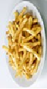|
|---|
|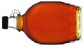  Added sugar,  syrups,  other  sweeteners|
|Added oil, butter, other  fats, seasoning  |
|Added salt  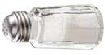|
|  Milk until 12  months|
|Soda, gelatin, coffee, tea or  fruit punches and  “ade” drinks  |

Fried foods, gravies, sauces,

processed meats

fat Added sugar,

sweeteners

syrups,

other

months AderAdded salt

###### Foods to Avoid

Milk until 12

Soda, gelatin, coffee, tea or

fruit punches and

“ade” drinks

- •Babies weaned from human milk before 12 months should receive iron-fortified formula.
- •Wean entirely off the bottle and onto a cup at 12 to 14 months.
- •Keep bottles out of bedtime and nap routines to avoid exposing infants’ teeth to sugars and reduce the risk for ear infections and choking.
- •Check carefully for bones in commercially or home-prepared meals containing meat, fish, or poultry.
- •Remove seeds, skin, and pits from fruits. For additional choking prevention information, refer to theInfant Feeding: Tips for Food Safetyjob aid.

###### Important Notes to Remember

Last Updated: June 2017WIC Works Resource System - wicworks.fns.usda.gov

###### Infant Developmental Skills

|Mouth Patterns|Hand and Body Skills|Feeding Abilities|
|---|---|---|
|Has tongue thrust, rooting, and gag re ex Begins to babble |Needs head support Brings hands to the mouth |Coordinates the  suck‐swallow‐breathe action while breast or bottle feeding|
|Transfers food from front to back of the tongue to swallow Opens the mouth when sees spoon approaching Begins to control the position of food in the mouth Uses up‐and‐down munching movement |Has head and neck control Sits with support Brings objects to the mouth Begins to sit alone unsupported Tries to grasp small objects such as toys and food |Takes in a spoonful of strained/pureed/mashed food and swallows without choking Drinks small amounts from a cup (with spilling) held by another person Begins to eat mashed foods Eats from a spoon easily Begins to feed self with hands |
|Uses the jaw and tongue to mash food Uses rotary chewing (diagonal movement of the jaw as food is moved to the side or center of the mouth) |Sits alone easily Easily grasps and/or brings small objects to the mouth, such as nger foods Begins to hold a cup with two hands Has good eye‐hand‐ mouth coordination |Begins to eat ground/ nely chopped/diced food  and small pieces of soft, cooked table food  Bites through a variety of textures Demands to spoon‐feed self |

Birth - 3 months

4 - 7 months

8 - 12 months

Nutrition during the first year of your baby’s life is important for proper growth and development of oral and motor skills. These are general observations of infant devel‐ opmental skills; however, each baby is different and may meet developmental skills earlier or later than his or her peers.

WIC Works Resource System - wicworks.fns.usda.gov

###### Infant Hunger and Satiety Cues

|Hunger Cues|Satiety Cues|
|---|---|
|Opens and closes mouth Brings hands to face Flexes arms and legs Roots around on the chest of whoever is carrying the infant Makes sucking noises and motions Sucks on lips, hands, ngers, toes, toys, or clothing |Slows or decreases sucking Extends arms and legs Extends/relaxes ngers Pushes/arches away Falls asleep Turns head away from the nipple Decreases rate of sucking or stops sucking when full |
|Smiles, gazes at caregiver, or coos during feeding to indicate wanting more Moves head toward spoon or tries to swipe food towards mouth |Releases the nipple Seals lips together May be distracted or pays attention to surroundings more Turns head away from the food |
|Reaches for spoon or food Points to food Gets excited when food is presented Expresses desire for specic food with words or sounds |Eating slows down Clenches mouth shut Pushes food away Shakes head to say “no more” |

Birth - 3 months

4 - 7 months

8 - 12 months

###### Important Counseling Points

Babies use multiple cues together, or clustered cues, to convey their needs. They may bring their hands to their face, clench their hands, root, and make sucking noises. All these behaviors together help us know when a baby is hungry. A single cue alone does not necessarily indicate hunger or satiety.

Crying is not a cue, but rather a distress signal. Cues occur prior to crying. Watching and responding early to cues can help prevent crying. Hungry babies might cry, but they will also exhibit hunger cues noted above.

Last Updated: October 2016 WIC Works Resource System - wicworks.fns.usda.gov

job aid

job aid

###### Infant Feeding: Tips for Food Safety

Human Milk

Proper food safety procedures are essential when expressing, handling, and storing human milk. Unsafe handling and cleaning procedures can result in bacterial growth and illness.

- • Wash hands thoroughly before expressing human milk.
- • Collect human milk in clean, sterile containers.
- • Label and date the containers.
- • Freshly pumped/expressed human milk may be stored at room temperature up to 4 hours.
- • Refrigerate human milk for up to 4 days.
- • Freeze human milk for up to 6 months.
- • Milk may be thawed in several ways, such as holding the container under warm running water.
- • Do not refreeze human milk; discard thawed human milk if it is not consumed within 24 hours.
- • Discard unused milk left in the bottle within 1 to 2 hours after the baby is finished feeding.
- • Never use a microwave to thaw or warm human milk because this practice is dangerous.

Formula

Formula is a perishable food, and therefore, must be prepared, handled, and stored properly and in a sanitary manner to be safe for consumption. Babies can be exposed to harmful bacteria from a dirty environment, pets, and other family members.

- • Emphasize the importance of cleanliness during preparation to include keeping bottles, nipples and other utensils clean and sanitary.
- • Instruct caregivers to always wash their hands before preparing formula, handling bottles, or feeding.
- • Emphasize that water used for preparing formula must be from a safe source. The local health department can help determine if a participant’s tap water is safe to prepare formula.
- • Instruct caregivers to follow the directions on the formula labels for proper formula preparation, use, and storage instructions, or those given by their healthcare provider.
- • Refer caregiver questions regarding the use of local drinking water or well water or bottled water to prepare formula to their healthcare provider.

###### Store-Bought Infant Food

Some WIC participants may assume that infant food purchased from the store is safe. However, this is not always the case. Even store-bought infant food requires safe handling.

- • Buy clean and intact containers; discard any containers that are dented or stained on the outside.
- • For jars, make sure that the safety button on the lid is down. Discard any jars that don’t “pop” when opened or that have chipped glass or rusty lids.
- • For plastic pouches, discard any packages that are swelling or leaking.
- • Do not purchase or use foods after the “use-by” date.
- • Wash jars and containers with hot, soapy water before opening.
- • Serve jarred food immediately, store opened jarred food in the refrigerator and use within 48 hours (use infant food meats within 24 hours).
- • Do not freeze jarred infant foods.
- • Put infant food in a bowl; do not feed from the jar.

#### Home-Prepared Infant Food job aid

Infants are more susceptible to harmful effects of contaminated food than older children or adults. As a result, parents and caregivers must be diligent when preparing and storing home-prepared infant food.

- • Wash hands, utensils, and work surfaces before preparing any food.
- • Use fresh foods. Making infant foods from leftovers is not recommended.
- • Serve immediately, or refrigerate and use within 48 hours; use meats and egg yolks within 24 hours.
- • If preparing infant food in large batches, freeze the food immediately in individual portions and use within one month.
- • Thaw frozen foods in the refrigerator or under cold running water; refreezing home-prepared infant food is not recommended.
- • When counseling caregivers who give infants complementary foods before the recommended age (about 6 months), assess if the baby is developmentally ready. Additionally, caution against using certain vegetables (spinach, beets, turnips, collard greens, green beans, squash, and carrots) before 3 months of age, per the AAP, since these may contain large amounts of nitrates. Nitrates are chemicals that can cause an unusual type of anemia (low blood count) in young babies. Commercially prepared vegetables are safer because the manufacturers test for nitrates.
- • Never give honey to infants under one year of age. Honey can sometimes be contaminated with Clostridium botulinum spores, which can cause botulism in infants. It is generally not fatal, but is a serious food-borne illness.

###### Choking

Participants need to know that certain foods should not be given to infants to reduce the risk of choking. Choking can be caused by the size, shape and consistency of certain foods. Always supervise infants when they are eating, keep mealtimes calm, and cut up food into small pieces. Have children sit down while eating. Children should never run, walk, play, or lie down with food in their mouths.

The following foods are not recommended for infants and young children because they are associated with choking:

- • Whole, raw, or hard pieces of partially cooked vegetables (cherry or grape tomatoes, carrot rounds, baby carrots, green peas, string beans, celery, corn, whole beans, etc.).
- • Whole or raw fruit (grapes, melon balls, etc.); especially those with pits or seeds or whole pieces of canned fruit.
- • Tough, stringy, or large chunks of meat or cheese, as well as fish with bones, hot dogs, meat sticks or sausages.
- • Peanuts or other nuts and seeds; chunks or spoonfuls of peanut butter.
- • Popcorn, potato/corn chips, pretzels, crackers or breads with seeds, and plain wheat germ.
- • Hard candy, jelly beans, caramels, gum drops/gummy candies, chewing gum, or marshmallows.

###### APPENDIX B –Resources on Infant Nutrition, Food Safety, and Related Topics

|Agency/organization|Resources available and contact information|
|---|---|
|Academy of Nutrition and Dietetics (AND) (formerly American Dietetic Association)|Source of information on food and nutrition for all age groups, including infants. Provides resources on expert counseling in nutrition, including the “Find a Registered Dietitian Nutritionist” online referral service. Website: http://www.eatright.org|
|American Academy of Pediatric Dentistry (AAPD)|Source for oral health policies, clinical practice guidelines related to oral health for infants and children, and parent education brochures. Website: http://www.aapd.org|
|American Academy of Pediatrics (AAP)|Source of materials on infant nutrition, child safety, first aid, and choking prevention. Publishes position papers on nutrition and health-related topics, including vitamin D supplementation, breastfeeding and the use of human milk, iron fortification of infant formulas, use of soy formulas, hypoallergenic infant formulas, use and misuse of fruit juice, guidelines on sudden infant death syndrome (SIDS), safe media use, and more. Website: http://www.aap.org|
|American College of Obstetricians and Gynecologists and American Congress of Obstetricians and Gynecologists|Companion professional organizations dedicated to women’s health. Provide information on pregnancy and childbirth as well as resources for hospitals and health care professionals who support women in choosing to breastfeed their infants. Website: http://www.acog.org|
|American Heart Association (AHA) National Center|Voluntary organization dedicated to fighting heart disease and stroke. Provides public health education on healthy lifestyles, has programs to fight childhood obesity, and is a leader in education on cardiopulmonary resuscitation (CPR) for all ages, including infant CPR and choking relief. Website: http://www.heart.org/HEARTORG/|
|American Red Cross (ARC) National Headquarters|Provides health and safety training to the public, emergency social services to U.S. military members and their families, and relief to people affected by disasters in America. Each local chapter provides pamphlets, posters, and classes in emergency techniques for first aid, preventing choking, and cardiopulmonary resuscitation. Website: http://www.redcross.org|
|Centers for Disease Control and Prevention (CDC)|Works to protect the United States from health, safety, and security threats, both at home and abroad. Uses the latest science and technology to detect and prevent disease; promotes healthy and safe behaviors, communities, and environments. Provides public health education, including information on infant development, safety, and nutrition. The CDC’s National Center for Health Statistics publishes pediatric growth charts and information on using and interpreting growth data. Website: https://www.cdc.gov|
|Centers for Medicare and Medicaid Services (CMS) InsureKidsNow.gov Resource Center|CMS created an Oral Health Initiative to help states ensure that children enrolled in Medicaid and the Children’s Health Insurance Program (CHIP) have easy access to dental and oral health services. CMS also provides free educational materials to promote good oral health for infants and children. Website: https://www.insurekidsnow.gov/initiatives/oral-health/index.html|

|Agency/organization|Resources available and contact information|
|---|---|
|Health and Medicine Division (HMD), National Academies of Sciences, Engineering, and Medicine Note: HMD was formerly known as Institute of Medicine (IOM)|Serves as an independent, nonpartisan adviser to the Nation to improve health, by providing advice that is unbiased, based on evidence, and grounded in science. Periodically updates and publishes the “Dietary Reference Intakes” tables that serve as a guide for good nutrition. Website: http://www.nationalacademies.org/HMD|
|International Lactation Consultant Association (ILCA)|ILCA promotes the profession of International Board Certified Lactation Consultants® (IBCLC®) and other health care professionals who care for breastfeeding families. ILCA’s goal is to improve the standard of health for infants worldwide through breastfeeding and skilled lactation care. Website: http://www.ilca.org/home|
|La Leche League International (LLLI)|LLLI provides information, education, and encouragement such as mother-tomother support to help mothers throughout the world understand the importance of breastfeeding to the healthy development of their infants.  Website: http://www.llli.org/|
|National Institutes of Health (NIH) National Institute of Allergy and Infectious Diseases (NIAID)|NIAID conducts and supports basic and applied research to better understand, treat, and ultimately prevent infectious, immunologic, and allergic diseases. Website: https://www.niaid.nih.gov/|
|National Institutes of Health (NIH) Office of Dietary Supplements (ODS)|Promotes scientific study of the benefits of dietary supplements (including vitamins, minerals, and botanicals) in maintaining health and preventing chronic disease and other health-related conditions. Makes accurate and up-to-date scientific information about dietary supplements available to researchers, health care providers, and the public through fact sheets, brochures, exhibits, and newsletters. Website: https://ods.od.nih.gov|
|National Maternal and Child Oral Health Resource Center (OHRC)|OHRC collaborates with government agencies, research centers, and professional organizations to develop effective strategies to improve oral health care for pregnant women, infants, children, and adolescents, including individuals and families with special health care needs. Website: http://www.mchoralhealth.org|
|NSF International|An independent, accredited organization that tests and certifies consumer products related to the safety of food, water, and the environment. The EPA recognizes NSF as a reliable source of information on home water treatment units.  Website: http://www.nsf.org|
|SHAPE America (Society of Health and Physical Educators); umbrella group including the former National Association for Sport and Physical Education (NASPE)|An organization of health and physical education professionals that promotes research related to health and physical education, physical activity, dance, and sport for children of all ages. Provides guidance through materials such as the booklet Active Start: A Statement of Physical Activity Guidelines for Children From  Birth to Age 5. Website: http://www.shapeamerica.org|

|Agency/organization|Resources available and contact information|
|---|---|
|U.S. Breastfeeding Committee (USBC)|USBC coordinates national breastfeeding initiatives through a partnership with government agencies, professional health associations, and other organizations in the United States. Their efforts have brought significant and lasting changes to ensure families have the support and protection they need to provide the optimal breastfeeding experience needed for their infants. Website: http://www.usbreastfeeding.org/|
|U.S. Consumer Product Safety Commission (CPSC)|Protects the public from unreasonable risks of injury or death from many types of consumer products, including those for infants and children.  Website: https://www.cpsc.gov|
|U.S. Department of Agriculture (USDA) Food Safety and Inspection Service (FSIS)|FSIS is the public health agency in the U.S. Department of Agriculture responsible for ensuring that the Nation’s commercial supply of meat, poultry, and egg products is safe, wholesome, and correctly packaged and labeled. Provides resource materials on food safety, including the online feature “Ask Karen,” a guide to expert knowledge on handling and storing food safely and preventing food poisoning. Also issues public health alerts for recalls of meat and poultry products. Operates the USDA Meat and Poultry Hotline (MPH). Websites: http://www.fsis.usda.gov/ and https://askkaren.gov|
|U.S. Department of Agriculture (USDA) Food and Nutrition Service (FNS) WIC Breastfeeding Support: Learn Together. Grow Together.|WIC Breastfeeding Support: Learn Together. Grow Together is a social marketing campaign from the U.S. Department of Agriculture, that launched in 2018 and serves as the foundation for all breastfeeding education, counseling, and promotion efforts in the WIC program. Website: https://wicbreastfeeding.fns.usda.gov|
|U.S. Department of Agriculture (USDA) Food and Nutrition Service (FNS) Special Supplemental Nutrition Program for Women, Infants and Children (WIC)|Provides Federal grants to states for supplemental foods, health care referrals, and nutrition education for low-income pregnant, breastfeeding, and nonbreastfeeding postpartum women, and to infants and children up to age 5 who are found to be at nutritional risk. Website: https://www.fns.usda.gov/wic/women-infants-and-children-wic|
|U.S. Department of Agriculture (USDA) National Agricultural Library (NAL)|NAL documents USDA research and serves as a national resource for agricultural information, including scientific research on infant nutrition. Website: https://naldc.nal.usda.gov/naldc/home.xhtml|
|U.S. Environmental Protection Agency (EPA)|Provides information on water safety and recommendations for consumption of foods susceptible to contamination from hazardous materials such as mercury or lead. Resources include information on protecting infant and children’s environmental health. Operates EPA Safe Drinking Water Hotline. EPA Safe Drinking Water Hotline: 1-800-426-4791 Website: https://www.epa.gov|
|U.S. Food and Drug Administration (FDA) Center for Food Safety and Applied Nutrition|Promotes and protects the public’s health by ensuring that the Nation’s food supply is safe, sanitary, wholesome, and honestly labeled, and that cosmetic products, dietary supplements, bottled water, and infant formula are safe and properly labeled. Website: https://www.fda.gov/AboutFDA/CentersOffices/OfficeofFoods/CFSAN/ default.htm|

|Agency/organization|Other resources available and contact information|
|---|---|
|U.S. Department of Health and Human Services (HHS) – Foodsafety.gov|Established as the gateway to food safety information provided by U.S. Government agencies, including USDA, FDA, and CDC. Provides an online portal to ask experts about food safety, to report food poisoning, and to learn up-to-date information on food safety alerts and recalls. Website: https://www.foodsafety.gov/|
|U.S. Department of Health and Human Services (HHS), Office of Disease Prevention and Health Promotion (ODPHP) – Healthy People|Provides science-based, 10-year national objectives for improving the health of all Americans; publishes goals for maternal, infant, and childhood health, including national targets for breastfeeding every 5 years. Publishes dietary guidelines for Americans. Website: https://www.healthypeople.gov/2020/topics-objectives|
|U.S. Government Bookstore|Offers for sale official Government books, e-books, periodicals, posters, pamphlets, forms, Code of Federal Regulations, and subscription services in many subject categories, including nutrition, breastfeeding, childhood immunizations, health care, and safety. Website: https://bookstore.gpo.gov|

###### Glossary

A Acidosis: A condition that comes from overproduction of acid in the blood

AI (adequate intake): An approximation of intake by a group of healthy individuals maintaining a defined nutritional status

Allergic disease/Allergy: Adverse reaction to certain

foods. A mild allergic reaction may cause a light rash; a severe allergic reaction could cause suffocation and death

Allergic gastroenteropathy: Any disorder of the stomach and intestines caused by an allergic reaction, usually resulting in diarrhea

Allergic immune reaction: The immune system’s response to a potentially harmful substance. Signs of reaction may include coughing, sneezing, and, in severe cases, difficulty breathing

Ambient temperature: The temperature of the surrounding environment

Amino acids: Various compounds that link together to form proteins. They can be made in the body (nonessential) or obtained from the diet (essential)

Anabolism: Turning simple substances in the body into complex ones

Anaphylaxis: A serious allergic reaction involving multiple parts of the body, which can include swelling of the face and tongue. An injection of the drug epinephrine is needed immediately

Anovulation: Failure of the ovaries to release ova, the female reproductive cells, over a time period of more than 3 months

Anthropometric data: A data collection and screening tool measuring height, weight, and head circumference to identify individuals at nutritional risk

Anthropometry: An immediately applicable technique for assessing the development of an infant through the first years of life

Antioxidant: A substance that inhibits damaging oxidation of food that is stored in the body

ARA and DHA: Arachidonic acid (ARA) and docosahexaenoic acid (DHA) are major fatty acids found in human milk

Areola: The circular area of pigmented skin surrounding the nipple

Arsenic: An element occurring naturally in rocks and soil and used in industry and agriculture. It is a harmful contaminant that seeps into water and is also present in some foods, including rice, seafood, and mushrooms Ataxia: The loss of full control of bodily movements Attachment, or latch-on: The infant’s mouth attaching fully to the mother’s nipple for feeding Azotemia: A condition caused by improperly functioning kidneys, in which waste products such as urea build up in the blood B Baby-led weaning (BLW): Instead of being fed by parents or caregivers, infants feed themselves all their foods, in the form of graspable pieces

Bilirubin: A yellow compound that occurs during the normal bodily process of breaking down and clearing out waste

Bioactive factors: Factors that provide protection from infection, including immunoglobulins, immune system proteins that attack and destroy bacteria and viruses, and the bifidus factor, which promotes the development of intestinal flora

Biochemical data: Data including measurements of hemoglobin and hematocrit levels that help diagnose or confirm an infant’s nutritional deficiencies or excesses

Biosynthesis: Biological production of chemical substances

Body composition: The percentages of muscle, fat, water, and other substances such as mineral components, in the body

Body mass index (BMI): A method for indicating body fat percentage, to help people maintain a healthy weight. It is calculated by the body mass or weight (kg) divided by the square of the body height (m)

Bone deposition: The depositing of calcium to form new bone

Bone resorption: The breakdown and transfer of calcium and other minerals from the bone into the bloodstream

BPA, or Bisphenol A: An industrial chemical used to make certain plastics and resins. It should not be used in infant bottles, as it can seep into the liquid

Breast pump: A manual, electric, or battery-powered pump for expressing milk from the breast for later use

Breast shell or milk cup: A plastic cup shape with a hole in the center through which the nipple protrudes. It helps relieve sore nipples

C Calcium: A mineral that builds strong bones and teeth and aids in blood clotting and maintaining a healthy nervous system

Carbohydrates: Foods sources of energy that are converted to glucose in the liver

Cardiomegaly: An enlarged heart Carotenoids: A group of natural pigments with potential health benefits. The group includes vitamin A Casein: The predominant protein in cow’s milk Celiac disease: Condition that occurs when gluten, a combination of proteins found in wheat, rye, oats (unless gluten-free), barley, and buckwheat, damages the lining of the small intestine and interferes with absorption of nutrients from food Cheilosis: Cracked lips, sore throat, and inflamed tongue caused by a deficiency in vitamin B2 (riboflavin) Cirrhosis: Chronic liver damage from a variety of causes, which leads to scarring and liver failure Clinical data: Data gathered through the infant’s medical chart review, the parent or caregiver interview, and the health care provider referral form, including surgeries, developmental delay, prescriptions, and nutrition-related illness Cluster feed: Also called “bunch feed,” this is when an infant feeds close together at certain times of the day, most commonly in the evening Coenzyme: Small molecules that cannot by themselves catalyze a reaction but can help enzymes do so Cognitive development: Learning ability based on brain tissue development that aids in brain function Colic: An ailment of unknown cause that manifests in endless, distressed crying in infants. Formula-fed infants seem to experience it more often than breastfed infants Colostrum: Thick human milk that is secreted during pregnancy and several days after delivery Complementary foods: Solid foods and beverages that are introduced when an infant is developmentally

ready to consume them, around 6 months of age. They include infant cereal, vegetables, fruits, meat, and other protein-rich foods properly prepared

Constipation: Condition in which bowel movements are hard, dry, and difficult to pass

Competent professional authority (CPA): A person on the WIC staff who determines the eligibility of applicants to the WIC program and makes referrals to community resources

Copper: A chemical element that is good for the body in small doses but harmful at levels above 1.3 milligrams per liter of water. Drinking water should be tested for copper levels

Corrosive water: Water with a high level of acid that can eat away at copper pipes, filling drinking water with impurities

Costochondral beading: In children with rickets, beadlike bumps that form where each rib meets its cartilage

Cow’s milk allergy (CMA): An allergy to the protein in cow’s milk

Cow’s milk-based formula: The most common infant formulas are made from modified cow’s milk with added carbohydrate, vegetable oils, and vitamins and minerals

Cradle breastfeeding hold: The mother’s same-sided arm supports the infant at the breast on which the infant is nursing, with the infant’s chest facing the mother’s chest

Cranial bossing: Enlargement and protrusion of bones in the skull, which can be due to rickets or other disease

Cretinism: A condition of severely stunted physical and mental growth due to untreated deficiency of thyroid hormone usually passed down from the mother

Cross-cradle breastfeeding hold: Nearly the same positioning as the cradle hold, but it supports the infant on the arm opposite the breast being used

CRP, or C-reactive protein: The body’s marker for inflammation and potential heart disease: the higher the concentration of CRP, the more likely is heart disease

Cryptosporidiosis: Illness caused by the parasite Cryptosporidium, which lives in the intestines of humans or animals and passes into water through their feces, and which is a danger to infants

Cyanocobalamin: Man-made form of vitamin B12 used to prevent and treat low blood levels of this vitamin

Cyanosis: Blue discoloration due to lack of oxygen

###### D

Dehydration: Effect on the body when too little water is consumed or water is lost through illness. If not treated, it can lead to death

Dental caries: Tooth decay or cavities resulting from the complex interaction of foods, especially starches and sugars, with saliva and mouth bacteria to form acids and dental plaque that cause teeth to decay Dental plaque: The sticky, colorless material that accumulates around and between the teeth and gums and in the pits and grooves of the chewing surfaces of the teeth. It holds bacteria and the acids it produces on the tooth surface. These in turn cause decay Diabetes: A condition in which the body does not produce or respond to insulin properly. This results in poor processing of carbohydrates and an overload of glucose in the system. There are two kinds: type 1 and type 2

Dietary Reference Intakes (DRIs): Four nutrientbased reference values intended for planning and assessing diets: estimated average requirement (EAR); recommended dietary allowance (RDA); adequate intake (AI); tolerable upper intake level (UL)

Disaccharides (double sugars): A category of carbohydrate that includes sucrose, lactose, and maltose

Dyad: The mother and infant unit Dyspnea: Shortness of breath

###### E

EAR (estimated average requirement): The median usual intake that is estimated to meet the requirement of 50 percent of the healthy population for age and gender

###### EER (estimated energy requirement): The level of

physical activity consistent with normal development Endemic goiter: A type of goiter—unusual growth of the thyroid gland—linked to iodine deficiency

Engorgement: The painful overfilling and edema of the breasts in the first few weeks of breastfeeding, which usually subsides after the third week

Enterocolitis: Inflammation of the gastrointestinal tract Enteropathy: Any condition or disease that keeps the gastrointestinal tract from functioning normally

Epiphyseal enlargement: Enlargement at the end of bones where growth takes place in children, due to lack of vitamin D

Epithelial cells: Cells that line the inside of the mouth, esophagus, and rectum

Escherichia coli O157:H7 (E. coli): While most types of E. coli are harmless, this strain produces a toxin that can cause severe bloody diarrhea and abdominal cramps

Exotosis: Formation of new bone on the surface of existing bone, which can cause pain

Express: To force milk out of the breast. Expression may occur through an infant’s sucking or through the mother’s pumping of the breast

F Failure to thrive: Insufficient weight gain or insufficient rate of weight gain expected for age and gender

Feeding relationship: The social skills used between the parent and infant that include appropriate food selection, supportive feeding techniques, appropriate caloric intake, and attention to infant cues and behavior

Fine motor skills: Movement and coordination of smaller body parts—e.g., wrists, hands, and fingersallowing ability to pick up objects between the thumb and finger

Flavin adenine dinucleotide (FAD): A protein involved in several important enzymatic reactions during metabolism

Flavin mononucleotide (FMN): A strong oxidizing agent produced from vitamin B2 (riboflavin) by the enzyme riboflavin kinase

Fluoride: A mineral that decreases the potential for teeth to decay

Fluorosis: Also called mottled enamel, the teeth turn brownish from intake of too much fluoride while the enamel is forming

Follicular hyperkeratosis: A skin condition characterized by overdevelopment of keratin in hair follicles, which results in whitish bumps on the upper arms and thighs

Football or clutch breastfeeding hold: The infant’s torso is held on the side of the mother’s body with the infant’s feet and body tucked under the mother’s arm. The mother’s forearm supports the infant’s back and head

Foremilk: The milk available at the start of a feeding Fruit juice, 100 percent pasteurized: The FDA mandates that a product must contain 100 percent fruit juice in order to be labeled as such. If a beverage contains less than 100 percent fruit juice, its label must display a descriptive term, such as “drink,” “beverage,” or “cocktail.” Pasteurization rids the juice of harmful bacteria

###### G

Gag reflex: Reflex at the back of the mouth that keeps the infant from swallowing inappropriate foods that could cause choking

Galactosemia: A rare genetic metabolic disorder that affects an individual’s ability to metabolize galactose (a sugar) in the body. If untreated, this disorder can lead to low blood sugar, vomiting, diarrhea, lethargy, brain damage, and death

Gastroesophageal reflux (GER): Spontaneous, effortless regurgitation of material from the stomach into the esophagus

Gastroesophageal reflux disease (GERD): Infants with severe GER can develop GERD, which includes wheezing and recurrent pneumonia or upper respiratory infections

Genetically engineered (GE): Products that are made with genetic modifications to enhance nutritional value; they are tested for safety

Genetically modified organisms (GMOs): Products whose makeup is modified for nutritional purposes; they are tested for safety

Glucose: The most abundant carbohydrate, metabolized for energy in the body

Glossitis: Inflammation of the tongue. The condition causes the tongue to swell, change in color, and develop a smooth appearance on the surface

Grasping reflex: Reflex that occurs when an infant’s palm is touched. The infant immediately grasps the object touching it. Also called the palmar grasp

Gross motor skills: Movement and coordination of large body parts—e.g., arms and legs—allowing trunk stability for standing, walking, and running

###### H

Hematocrit: The percentage of blood that consists of packed red blood cells

Hemochromatosis: A disease in which too much iron builds up in the body and becomes toxic

Hemoglobin: The iron-containing, oxygen-carrying protein in the blood

Hemolytic anemia: A condition in which red blood cells are destroyed and removed from the bloodstream before their normal life span is over

Hemorrhagic manifestations: Effects on the body when a sudden fever attacks the system

Hemosiderosis: An iron overload disorder in the body that can be the result of a hemorrhage within an organ

Hindmilk: The fat-rich milk available later in the feeding Homeostasis: The body’s regulation of certain processes and elements to ensure that they remain stable, such as body temperature and levels of sodium and potassium Hunger and satiety cues: Clusters of cues given by an infant that tell a parent or caregiver when the infant is hungry or satisfied. These include clenching hands, rooting, and making sucking noises Hyperammonemia: A dangerous condition characterized by too much ammonia in the blood Hypercalcemia: A condition in which the calcium level in the blood is above normal; it can weaken the bones Hyperpigmentation: A skin condition in which some parts of the skin grow darker than the rest because of an excess of brown pigmentation called melanin

Hypersensitivity: Also called allergy, this is an adverse health effect, such as nausea or wheezing, arising from a specific immune response to an allergen

Hyperuricemia: An excess of uric acid in the blood Hypoallergenic infant formula: Formula in which the allergy-causing protein has been modified

Hypochromic microcytic anemia: Red blood cells that are smaller than normal and poorly filled with hemoglobin, either caused by iron deficiency or by impaired production of hemoglobin

Hypogonadism: Diminished function of the gonadsthe testes in males or the ovaries in females

Hyporeflexia and hyperreflexia: Hyporeflexia is a condition of below normal or absent reflexes. It can be tested for by using a reflex hammer. Hyperreflexia is the opposite condition—overactive reflexes

###### I

IgE-mediated reaction: An immediate allergic reaction that may happen because an infant’s immature gastrointestinal tract cannot block toxins in a food, such as cow’s milk. Wheezing, hives, and other reactions may occur. (See also non-IgE-mediated reaction.)

Immunization: A series of vaccines that will protect against major diseases including rotavirus, polio, influenza, chickenpox, and more

Immunoglobulins: Antibodies that attach to bacteria and viruses so the immune system can destroy the harmful substances

Indigestible complex carbohydrates (dietary fiber):

A category of carbohydrate that includes pectin, lignin, gums, and cellulose, which are not broken down by intestinal digestive enzymes

Iron-fortified infant formula: When human milk is not available during the first year of an infant’s life, ironfortified infant formula ensures that infants receive an adequate amount of iron

Iron: A mineral that helps grow healthy blood cells and transport oxygen throughout the body. The two kinds are heme, which is easily absorbed into the body from eating red meats, and nonheme, which is not easily absorbed into the body and found in iron-fortified breads and cereals

###### J

Jaundice: Visible in yellowing of an infant’s skin and eyes; it occurs when bilirubin builds up faster than the infant’s system can break it down and eliminate it

###### K

Ketosis: A potentially dangerous metabolic state of burning too much fat because of very low carbohydrate consumption

Kilocalorie (Kcal): A measure of how much energy a food supplies to the body, technically defined as the quantity of heat required to raise the temperature of 1 kilogram (kg) of water by 1 degree Celsius

Kosher formula: Formulas that have been ritually

prepared or blessed for members of the Jewish faith. The term kosher means “pure.” Manufacturers label certified products with a “U” inside a circle or other symbols

Kwashiorkor-edema: A severe form of malnutrition that causes swelling in the gut from water retention, or edema

L Lactose intolerance: Condition caused by a lack of lactase, the intestinal enzyme that digests lactose, the sugar in milk

Laid-back hold: The mother lies in a slightly reclining position with the infant on top of the mother, with full skin-to-skin contact and with the infant’s face near the mother’s breasts

Latch-on: Refers to how the infant attaches onto the breast while breastfeeding

Lead: A poisonous metal that can accumulate in the body and cause brain, nerve, and kidney damage, anemia, and even death. It can be present in drinking water, and household water supplies should be tested for it

Lipids: Fats that are essential to the diet to maintain good health. The three categories are triglycerides, phospholipids, and sterols

Lying down or side-lying breastfeeding hold: The mother lies on her side. The infant lies on his or her side facing the mother with his or her chest to the mother’s chest and with his or her mouth level with the nipple

###### M

Macronutrients: Macronutrients are nutrients needed in large amounts for energy provision and other bodily functions. They include carbohydrate, proteins, and lipids, or fats

Mastitis: Breast infection that may come from feeding too infrequently and allowing breasts to engorge. Includes breast tenderness, yellowish nipple discharge, and flu-like symptoms

MCL: Maximum contaminant level. This is the highest level of a contaminant that is allowed in drinking water

Megaloblastic anemia: Anemia resulting from inhibition of DNA synthesis during red blood cell production

Mercury: A naturally occurring element that can contaminate water and food when released into the environment; it also occurs in man-made products. Drinking water should be tested for mercury, and fish should be chosen carefully to ensure low mercury content

Metabolic infant formulas: Special infant formulas for infants born with metabolic disorders such as phenylketonuria (PKU) and maple syrup urine disease (MSUD)

Methemoglobinemia: Also called blue baby syndrome, this condition occurs when too little oxygen reaches the tissues throughout the body, causing an infant to turn blue. Consumption of highnitrate foods, exposure to certain drugs or chemicals, or illness can lead to this

MFP factor: A substance in meat, fish, and poultry that promotes the absorption of nonheme iron from other foods eaten with them

Microcytic anemia: The presence of small red blood cells, resulting from iron deficiency

Micronutrients: Essential nutrients required in small amounts to maintain normal metabolism and growth as well as physical health. There are two categories: vitamins and minerals

Milk let-down reflex: Also called milk-ejection reflex. The mother’s milk is ready to flow. Signs are tingling in the breast or milk dripping from the nipple

Modular formulas: Nutritionally incomplete formulas that may be mixed with other products before use (e.g., protein, carbohydrate, or fat modulars); they may be used to increase formula concentration

Monosaccharides (simple sugars): A category of carbohydrate that includes glucose, galactose, and fructose

Moro reflex: Also called the “startle” reflex. If an infant is surprised, he or she throws out the arms, extends the neck, and may start crying

N Neonatal ataxia: Loss of control of movements in newborns

Nipple shield: An artificial rubber latex or silicone nipple that rests on a mother’s nipple while she is breastfeeding, intended to help an infant latch on to a flat or inverted nipple or an engorged breast

Nitrates: Compounds found naturally in some foods, such as spinach, beets, turnips, carrots, or collard greens. In the body they turn into nitrites, which can affect the health of young infants

Non-IgE-mediated reaction: This is a delayed allergic reaction that involves white blood cells called T-cells; it may include diarrhea, malabsorption, and colitis

Nonnutritive sucking: When an infant sucks on a pacifier, finger, or fist and there is no feeding involved. The sucks usually occur in bursts, and are smaller and quicker than sucking for oral feeding

Nucleotides: Metabolically important compounds that are the building blocks of ribonucleic acid (RNA), deoxyribonucleic acid (DNA), and adenosine triphosphate (ATP)

Nutritive sucking: Synchronous movement of lips, cheeks, tongue, and palate that results in bringing human milk/formula into the mouth

###### O

Obesity: A condition of serious overweight that sets up an infant for future medical conditions including diabetes and heart disease

Omega-3 fatty acids: A healthy kind of fat found in fish Oral skills: Movement and coordination of the lips, cheeks, tongue, and palate that allows milk to be extracted from the breast or bottle (sucking) and to make safe transport through the mouth into the stomach (swallowing) Osmotic pressure: The force exerted by a dissolved substance on a membrane it cannot penetrate Overdiluted: Containing too much water. Overdiluted infant formula may lead to nutrient deficiencies Over-the-counter (OTC) drugs: Pharmacological items that can be purchased without a doctor’s prescription Overweight: A condition of gaining too much weight, often due to overeating and too little exercise. It leads to obesity and lifelong health problems including heart disease and diabetes Oxytocin: A hormone that plays a role in bonding between mother and infant during and after childbirth

###### P

Phenylketonuria (PKU): An inherited metabolic disorder caused by an enzyme deficiency resulting in an accumulation of phenylalanine and its metabolites in the blood. If untreated, this disorder can lead to mental retardation and seizures

Phospholipid: A lipid containing a phosphate group in its molecule, such as lecithin

Photophobia: Discomfort or pain to the eyes due to light exposure or because of actual physical sensitivity of the eyes

Physical activity: Any bodily movement produced by the contraction of skeletal muscles that increases energy expenditure to enhance health and maintain healthy body weight

Physiologic effect: The promotion of the human body’s normal functioning

Polysaccharides (complex carbohydrates): A category of carbohydrate that includes starch, dextrins, and glycogen

Postpartum: The period after the infant is born Prebiotics: Nutrients that support the growth of “good” bacteria in the intestine Primary teeth: An infant’s first teeth, which begin forming in the jawbone before birth Probiotics: Nonpathogenic bacteria, including bifidobacteria and lactobacilli Protective immune response: The body’s ability to recognize and fight or destroy harmful substances Protein: A nutrient that builds, maintains, and repairs new tissues, including tissues of the skin, eyes, muscles, heart, lungs, brain, and other organs Prothrombin: A protein in blood plasma that helps blood coagulate Pyloric stenosis: Thickening of the muscle at the stomach exit that prevents food from passing into the intestines and causes projectile vomiting after every feeding R RDA (recommended dietary allowance): The average dietary intake level sufficient to meet the nutrient requirement of nearly all (97 to 98 percent of) healthy individuals REA (recommended energy allowance): The level of energy intake an individual requires to maintain a healthy weight at a reasonable level of activity Reflex: A muscle reaction that happens automatically in response to stimulation. Certain sensations or movements produce specific muscle responses

Relactation: Also called “induced lactation,” this is the process of a mother restarting her milk supply after she has weaned and her milk has dried up. The term can also be applied to a mother who has never nursed or to a nonbirth mother who wishes to develop a milk supply

Rooting reflex: A reflex that prompts an infant to turn the head toward the mother or caregiver’s hand or nipple when the infant’s oral area is stroked

Rotavirus: The most common cause of severe diarrhea among infants and children worldwide

###### S

SIDS, or sudden infant death syndrome: The death of a healthy infant from the apparent cessation of breathing Sleeping through the night: Researchers use midnight to 5 a.m. as the standard definition; however, parents and caregivers may consider it to be different Social skills: The series of supportive behavioral interactions between parents or caregivers and infants that results in effective feeding and a healthy nutritional status Sodium: Also called salt; a mineral that helps maintain balance in bodily systems Solo playtime: When an infant plays alone in a safe environment with a parent or caregiver supervising nearby but not directly interacting. This should not include solo media use, such as allowing an infant to watch television Spinocerebellar: Fibers in the spinal cord that run to the brain’s cerebellum and give information about the body’s muscles Stepping reflex: The first sign of an infant’s ability to walk: when supported under the arms and with feet flat on the floor, the infant begins to take imaginary steps Sucking/swallowing reflex: A reflex present before birth that allows a newborn infant to automatically suck a nipple put in his or her mouth, then to swallow the liquid ingested Sugar alcohols: A category of carbohydrate that includes sorbitol and mannitol

###### TTachycardia: An elevated heart rate

T-cell lymphocytes: A type of white blood cell that is an essential part of the immune system

Teething: The uncomfortable period for an infant when the teeth first begin to erupt, accompanied by discomfort and drooling

Thrush: Infection in which the nipple becomes sore and cracked

Tongue thrust reflex: A reflex that causes the infant’s tongue to stick out when something touches the infant’s lips

Tonic neck reflex: Also called “fencing” posture, the infant’s head turns to one side. The arm on that side will straighten and the opposite arm will bend, as if the infant is fencing

Tummy time: Playtime for infants when they are laid

on their tummies and can kick, look around, and reach for objects to help enhance motor skills and awareness

###### U

UL (tolerable upper intake level): The highest level of ongoing daily intake of a nutrient that is estimated to pose no risk in the majority of the population

Underdiluted: Containing too little water. Underdiluted infant formula can burden an infant’s kidneys

Uterine involution: The return of the uterus to its normal, pre-pregnancy size

###### V

###### Value Enhanced Nutrition Assessment (VENA):

Comprehensive nutrition assessment that includes steps from the WIC Nutrition Assessment and additional steps to set the stage for the infant’s future care

Vasodilating: The dilation, or widening, of blood vessels, which decreases blood pressure

Vegan diet: A total vegetarian diet that includes plant foods only; it excludes any foods from animal sources, such as dairy products, gelatin, and honey

Vegetarian diet: Includes primarily plant foods. Lactovegetarian diet includes dairy products except for

eggs; lacto-ovo-vegetarian diet includes eggs; semivegetarian diet includes some fish and meat

Vitamins: Essential organic compounds vital for healthy bodily functions. There are two categories: water-soluble, which dissolve in water and are not stored in the body, and fat-soluble, which dissolve in fats and oils and are stored in the body

###### W

Weaning: Making an infant accustomed to food other than human milk

WIC Infant Formula Calculator: A web-based tool developed to help WIC staff determine the amount of infant formula that can be issued to parents and caregivers, consistent with WIC regulations

WIC NSS: WIC Nutrition Services Standards; intended to assist State and local agencies in providing ongoing high-quality nutrition services

WIC nutrition assessment: Made by the CPA to determine a program for mothers for their optimal infant care and nutrition

###### X

Xanthine oxidase: A type of enzyme that plays an important part in energy release in humans

Z Zinc: An essential mineral needed in the human body that works with proteins in every organ

###### Bibliography

###### Authors

Abbott, A., and D. Bartlett. “Infant Motor Development and Equipment Use in the Home.” Child Care Health and Development 27, no. 3 (2001): 295–306.

Abrahams, S. W., and M. H. Labbok. “Breastfeeding and Otitis Media: A Review of Recent Evidence.” Current Allergy and Asthma Reports 11, no. 6 (December 2011): 508–12. doi:10.1007/s11882-011-0218-3.

Academy of Breastfeeding Medicine. “Position on Breastfeeding.” Breastfeeding Medicine 3, no. 4 (2008): 267–69. doi:10.1089/ bfm.2008.9988.

Accardo, P. J., and B. Y. Whitman. “Children of Mentally Retarded Parents.” American Journal of Diseases of Children 144 (1990): 69–70.

Agency for Healthcare Research and Quality. “Breastfeeding and Maternal and Infant Health Outcomes in Developed Countries.” Evidence Report/Technology Assessment no. 153 (April 2007). https://archive.ahrq.gov/downloads/pub/evidence/pdf/brfout/ brfout.pdf.

Agency for Healthcare Research and Quality. “Breastfeeding Programs and Policies, Breastfeeding Uptake, and Maternal Health Outcomes in Developed Countries”, Comparative Effectiveness Review no. 210 (July 2018) https://effectivehealthcare.ahrq.gov/ sites/default/files/pdf/cer-210-breastfeeding-report_1.pdf

Ajetunmobi, O. M., B. Whyte, J. Chalmers, D. M. Tappin, L. Wolfson, M. Fleming, A. MacDonald, R. Wood, and D. L. Stockton. Glasgow Centre for Population Health Breastfeeding Project Steering Group. “Breastfeeding Is Associated with Reduced Childhood Hospitalization: Evidence from a Scottish Birth Cohort (1997–2009).” Journal of Pediatrics 166, no. 3 (March 2015): 620–25.e4. doi:10.1016/j.jpeds.2014.11.013.

American Academy of Family Physicians. “Breastfeeding, Family Physicians Supporting.” Position Paper. Accessed November 2016. http://www.aafp.org/about/policies/all/breastfeeding-support.html.

American Academy of Pediatric Dentistry. “Guideline on Fluoride Therapy” (revised 2014). Reference Manual 37 no. 6 (15/16): 176–79. http://www.aapd.org/media/Policies_Guidelines/G_fluoridetherapy.pdf.

———. “Guideline on Xylitol Use in Caries Prevention.” Reference Manual 36, no. 6 (2011): 175–78. http://www.aapd.org/media/ policies_guidelines/g_xylitoluse.pdf.

———. “Policy on Dietary Recommendations for Infants, Children, and Adolescents” (revised 2012). Reference Manual 37, no. 6 (15/16): 56–58. http://www.aapd.org/media/Policies_Guidelines/P_DietaryRec.pdf.

———. “Policy on Early Childhood Caries (ECC): Classifications, Consequences, and Preventive Strategies” (revised 2014).

Reference Manual 37, no. 6 (15/16): 50–52. http://www.aapd.org/media/Policies_Guidelines/P_ECCClassifications.pdf. ———. “Policy on the Dental Home” (revised 2015). Reference Manual 37, no. 6 (15/16): 24–25. http://www.aapd.org/media/

policies_guidelines/p_dentalhome.pdf. American Academy of Pediatric Dentistry Clinical Affairs Committee. “Guideline on Infant Oral Health Care” (revised 2014). Reference Manual 37, no. 6 (15/16): 146–50. http://www.aapd.org/media/policies_guidelines/g_infantoralhealthcare.pdf. American Academy of Pediatrics. “AAP Welcomes FDA Announcement on Limiting Arsenic in Infant Rice Cereal.” Press release. April 1, 2016. https://www.aap.org/en-us/about-the-aap/aap-press-room/pages/aap-welcomes-fda-announcement-on-limiting

-arsenic-in-infant-rice-cereal.aspx.

———. “Constipation and Your Child.” AAP Patient Education Handout (2005). Accessed October 2016. http://patiented.solutions. aap.org/handout.aspx?gbosid=156420&username=pediatricweb&password=PedWeb1.

———. “Dental Development: Teething Care and Anticipatory Guidance.” In Protecting All Children’s Teeth (PACT): A Pediatric Oral Health Training Program. Accessed October 2016. http://www2.aap.org/oralhealth/pact/ch2_sect5.cfm.

———. “Executive Summary: Breastfeeding and the Use of Human Milk.” Pediatrics 129, no. 3 (March 2012): 601. doi:10.1542/ peds.2011-3553.

———. “Guidelines for the Diagnosis and Management of Food Allergy in the United States: Report of the NIAID-Sponsored Expert Panel.” Journal of Allergy and Clinical Immunology 126, no. 6, Supplement (December 2010): 1–2. doi:http://dx.doi.org/10.1016/j. jaci.2010.10.007.

———. “Numbers of Food-Related Choking Incidents in Children Continue to Climb.” Press release. July 29, 2013. https://www

.aap.org/en-us/about-the-aap/aap-press-room/Pages/Numbers-of-Food-Related-Choking-in-Children-Continue-to-Climb.aspx.

———. “Pediatricians Can Help Parents Wean Babies Off the Bottle.” Press release. July 12, 2010. https://www.aap.org/en-us/ about-the-aap/aap-press-room/pages/Pediatricians-Can-Help-Parents-Wean-Babies-Off-the-Bottle.aspx.

———. “Policy Statement: Breastfeeding and the Use of Human Milk.” Pediatrics 129, no. 3 (March 2012): e827–41. doi:10.1542/ peds.2011-3552.

———. “Policy Statement: Prevention of Childhood Lead Toxicity.” Pediatrics 138, no. 1 (June 2016): 1–15. http://pediatrics.aap publications.org/content/early/2016/06/16/peds.2016-1493.

———. “Policy Statement: Prevention of Choking among Children.” Pediatrics 125, no. 3 (March 2010): 601–7.

———. “Practice Guide: Sleeping and Eating Issues.” 2007, updated 2013. Accessed October 2016. http://www2.aap.org/sections/ scan/practicingsafety/Modules/SleepingFeeding/SleepingEatingIssues.pdf.

———. “School Physical Education and Activity.” State Advocacy Focus, September 2015. https://www.aap.org/en-us/advocacy-and

-policy/state-advocacy/Documents/Obesity.pdf.

———. “What You Need to Know about the New Guidelines for the Diagnosis and Management of Food Allergy in the U.S.” Supplement to the Journal of Allergy and Clinical Immunology 120, no. 6 (December 2010): 1–2. https://www2.aap.org/sections/ allergy/allergy_guidelines_final_1.pdf.

American Academy of Pediatrics Committee on Infectious Diseases, Committee on Nutrition. “Consumption of Raw or Unpasteurized Milk and Milk Products by Pregnant Women and Children.” Pediatrics 133, no. 1 (January 2014): 175–79.

American Academy of Pediatrics Committee on Injury and Poison Prevention. “Injuries Associated with Infant Walkers.” Pediatrics 108,

no. 3 (2001): 790–92. http://pediatrics.aappublications.org/content/108/3/790. Reaffirmed 2014. American Academy of Pediatrics Committee on Nutrition. “Hypoallergenic Infant Formulas.” Pediatrics 106, no. 2 (2000): 347. American Academy of Pediatrics Committee on Pediatric AIDS. “Infant Feeding and Transmission of Human Immunodeficiency Virus in

the United States.” Pediatrics 131, no. 2 (February 2013): 391–96. http://pediatrics.aappublications.org/content/131/2/391.

American Academy of Pediatrics Committee on Practice and Ambulatory Medicine and Bright Futures Periodicity Schedule Workgroup. “2015 Recommendations for Preventive Pediatric Health Care.” Pediatrics 136, no. 3 (September 2015). http://pediatrics.aap publications.org/content/136/3/e727.

American Academy of Pediatrics Council on Communications and Media. “Policy Statement: Media and Young Minds.” Pediatrics 138, no. 5 (November 2016): 1–6. http://pediatrics.aappublications.org/content/pediatrics/138/5/e20162591.full.pdf.

American Academy of Pediatrics Council on Environmental Health. “Policy Statement: Prevention of Childhood Lead Toxicity.” Pediatrics 138, no. 1 (July 2016): 1–15. http://pediatrics.aappublications.org/content/pediatrics/138/1/e20161493.full.pdf.

American Academy of Pediatrics Task Force on Sudden Infant Death Syndrome. “SIDS and Other Sleep-Related Infant Deaths: Updated 2016 Recommendations for a Safe Infant Sleeping Environment.” Pediatrics 138, no. 5 (November 2016): 1–8. doi:10.1542/peds.2016-2938.

American College of Obstetricians and Gynecologists. “Committee Opinion no. 637: Marijuana Use During Pregnancy and Lactation.” Obstetrics & Gynecology 126, no. 1 (2015): 234–38. doi:10.1097/01.AOG.0000467192.89321.a6.

———. “Committee Opinion no. 658: Optimizing Support for Breastfeeding as Part of Obstetric Practice.” February 2016. Accessed November 2016. http://www.acog.org/Resources-And-Publications/Committee-Opinions/Committee-on-Obstetric-Practice/ Optimizing-Support-for-Breastfeeding-as-Part-of-Obstetric-Practice.

American Dental Association. Fluoridation Facts. Washington, DC: ADA, 2005. Accessed September 2016. http://www.ada.org/~/media/ ADA/Member%20Center/FIles/fluoridation_facts.pdf?la=en.

Amit, M. “Vegetarian Diets in Children and Adolescents.” Paediatrics & Child Health 15, no. 5 (May–June 2010): 303–8. https://www.ncbi. nlm.nih.gov/pmc/articles/PMC2912628/.

Aniansson, G., B. Alm, B. Andersson, A. Håkansson, P. Larsson, O. Nylén, H. Peterson et al. “A Prospective Cohort Study on Breastfeeding and Otitis Media in Swedish Infants.” Pediatric Infectious Disease Journal 13, no. 3 (March 1994): 183–88.

Association of Women’s Health, Obstetric, and Neonatal Nurses. “Breastfeeding: AWHONN Position Statement.” Journal of Obstetric, Gynecologic & Neonatal Nursing 44, no. 1: 145–50. doi:10.1111/1552-6909.12530.

Augustyn, M., D. A. Frank, and B. S. Zuckerman. “Infancy and Toddler Years.” In Developmental-Behavioral Pediatrics, 4th ed., edited by W. B. Carey et al., 24–38. Philadelphia: Saunders Elsevier, 2009.

Bachrach, V. R., E. Schwarz, and L. R. Bachrach. “Breastfeeding and the Risk of Hospitalization for Respiratory Disease in Infancy: A Meta-analysis.” Archives of Pediatric and Adolescent Medicine 157, no. 3 (2003): 237–43.

Bahatia, J., F. Greer, and AAP Committee on Nutrition. “Clinical Report: Use of Soy Protein-Based Formulas in Infant Feeding.” Pediatrics 121, no. 5 (May 2008): 1062–68. http://pediatrics.aappublications.org/content/pediatrics/121/5/1062.full.pdf.

Baker, R. D., F. R. Freer, and AAP Committee on Nutrition. “Diagnosis and Prevention of Iron Deficiency and Iron-Deficiency Anemia in Infants and Young Children (0-3 Years of Age).” Pediatrics 126, no. 5 (November 2010): 1040–50. doi:10.1542/peds.2010-2576.

Bar, S., R. Milanaik, and A. Adesman. “Long-Term Neurodevelopmental Benefits of Breastfeeding.” Current Opinion in Pediatrics 28, no. 4 (August 2016): 559–66. http://www.ncbi.nlm.nih.gov/pubmed/27386975.

Barclay, A. R., R. K. Russell, M. L. Wilson, W. H. Gilmour, J. Satsangi, and D. C. Wilson. “Systematic Review: The Role of Breastfeeding in the Development of Pediatric Inflammatory Bowel Disease.” Journal of Pediatrics 155, no. 3 (2009): 421–26.

Bellows, L., A. Clark, and R. Moore. “Introducing Solid Foods to Infants.” Fact Sheet 9.358. October 2013. Colorado State University Extension. http://extension.colostate.edu/docs/pubs/foodnut/09358.pdf.

Bener, A., G. F. Hoffmann, Z. Afify, K. Rasul, and I. Tewfik. “Does Prolonged Breastfeeding Reduce the Risk for Childhood Leukemia and Lymphomas?” Minerva Pediatrica 60, no. 2 (2008): 155–61.

Benjamin Neelon, S. E., E. Oken, E. M. Taveras, S. L. Rifas-Shiman, and M. W. Gillman. “Age of Achievement of Gross Motor Milestones in Infancy and Adiposity at Age 3 Years.” Maternal and Child Health Journal 16, no. 5 (July 2012): 1015–20.

Bier, J. A., T. Oliver, A. E. Ferguson, and B. R. Vohr. “Human Milk Improves Cognitive and Motor Development of Premature Infants During Infancy.” Journal of Human Lactation 18, no. 4 (2002): 361–67.

Birch, L. L., and A. E. Doub. “Learning to Eat: Birth to Age 2 Years.” American Journal of Clinical Nutrition 99, no. 3 (March 2014):

723S–8S. doi:10.3945/ajcn.113.069047. Birch, L. L., and J. O. Fisher. “Appetite and Eating Behavior in Children.” Pediatric Clinics of North America 42, no. 4 (1995): 931–53. Botton, J., B. Heude, J. Maccario, Ducimetière, and M. A. Charles. “Postnatal Weight and Height Growth Velocities at Different Ages

between Birth and 5 Years and Body Composition in Adolescent Boys and Girls.” American Journal of Clinical Nutrition 87, no. 6

(2008): 1760–68. Branum, A. M., L. M. Rossen, and K. C. Schoendorf. “Trends in Caffeine Intake among U.S. Children and Adolescents.” Pediatrics 133, no. 3 (March 2014): 386–93.

Brown, M. J., and S. Margolis. “Lead in Drinking Water and Human Blood Lead Levels in the United States.” Morbidity and Mortality Weekly Report Supplements 61, no. 4 (August 10, 2012): 1–9. https://www.cdc.gov/mmwr/preview/mmwrhtml/su6104a1.htm/.

Butte N. F., K. Cobb, J. Dwyer, L. Graney, W. Heird, and K. Rickard. “The Start Healthy Feeding Guidelines for Infants and Toddlers.” Journal of the American Dietetic Association 104 (2004): 442–54. doi:10.1016/j.jada.2004.01.027.

CaJacob, N., and M. Cohen. “Update on Diarrhea.” Pediatrics in Review 37, no. 8 (August 2016): 313–22. http://pedsinreview.aap publications.org/content/37/8/313.

Carbajal, R., S. Veerapen, S. Couderc, M. Jugie, and Y. Ville. “Analgesic Effect of Breast Feeding in Term Neonates: Randomized Controlled Trial.” BMJ 326 (2003): 13.

Cataldo, R., J. Huang, R. Calixte, A. T. Wong, J. Bianchi-Hayes, and S. Pati. “Effects of Overweight and Obesity on Motor and Mental Development in Infants and Toddlers.” Pediatric Obesity 11, no. 5 (October 2016): 389–96.

California WIC Program, California Department of Public Health. “California Baby Behavior Campaign: Understanding Your Baby’s

Cues.” May 2011. http://archive.cdph.ca.gov/programs/wicworks/Documents/BabyBehavior/WIC-BB-EarlyInfancyHandout.pdf. Centers for Disease Control and Prevention. “Appendix D: Contraceptive Effectiveness.” Morbidity and Mortality Weekly Report 63, no. 4

(April 25, 2014): 47. https://www.cdc.gov/mmwr/preview/mmwrhtml/rr6304a5.htm.

———. “Appendix I: Lactational Amenorrhea Method.” Morbidity and Mortality Weekly Report 59 (May 28, 2010): 73. https://www.cdc. gov/mmwr/preview/mmwrhtml/rr59e0528a10.htm.

———. The CDC Guide to Strategies to Support Breastfeeding Mothers and Babies. Atlanta: HHS, 2013. http://www.cdc.gov/ breastfeeding/resources/guide.htm.

———. “Effectiveness of Family Planning Methods, 2014.” Accessed August 2016. https://www.cdc.gov/reproductivehealth/ unintendedpregnancy/pdf/family-planning-methods-2014.pdf.

———. “Low Level Lead Exposure Harms Children: A Renewed Call for Primary Prevention.” Report of the Advisory Committee on Childhood Lead Poisoning Prevention of the Centers for Disease Control and Prevention, Washington, DC, January 4, 2012. http:// www.cdc.gov/nceh/lead/acclpp/final_document_030712.pdf.

———. Parent’s Guide to Childhood Immunizations. Revised August 2015. Accessed January 2017. https://www.cdc.gov/vaccines/ parents/tools/parents-guide/index.html.

———. “Ticks and Lyme Disease Fact Sheet.” Accessed August 2016. https://www.cdc.gov/lyme/resources/toolkit/factsheets/ 10_508_lyme-disease_pregnantwoman_factsheet.pdf.

———. “Your Baby at 2 Months to 5 Years.” Accessed November 2016. http://www.cdc.gov/ncbddd/actearly/pdf/checklists/all _checklists.pdf.

Chantry, C. J., C. R. Howard, and P. Auinger. “Full Breastfeeding Duration and Associated Decrease in Respiratory Tract Infection in U.S. Children.” Pediatrics 117, no. 2 (2006): 425–32.

Chapin, M. M., L. M. Rochette, J. L. Annest, T. Haileyesus, K. A. Conner, and G. A. Smith. “Nonfatal Choking on Food among Children 14 Years or Younger in the United States, 2001–2009.” Pediatrics 132, no. 2 (August 2013): 275–81. doi:10.1542/peds.2013-0260.

Chulada, P. C., S. J. Arbes Jr., D. Dunson, and D. C. Zeldin. “Breast-feeding and the Prevalence of Asthma and Wheeze in Children: Analyses from the Third National Health and Nutrition Examination Survey, 1988–1994.” Journal of Allergy and Clinical Immunology 111, no. 2 (2003): 328–36.

Chung, J., S. Yu, and Y. Hong, “Environmental Source of Arsenic Exposure,” Journal of Preventive Medicine and Public Health 7, no. 5 (September 2014): 253–57. doi:https://doi.org/10.3961/jpmph.14.036.

Clayton, H. B., R. Li, C. G. Perrine, and K. S. Scanlon. “Prevalence and Reasons for Introducing Infants Early to Solid Foods: Variations by Milk Feeding Type.” Pediatrics 131, no. 4 (2013): e1108–14. doi:10.1542/peds.2012-2265.

Cogswell, M. E., J. P. Gunn, K. Yuan, S. Park, and R. Merritt. “Sodium and Sugar in Complementary Infant and Toddler Foods Sold in the United States.” Pediatrics 135, no. 3 (March 2015): 416–23. http://pediatrics.aappublications.org/content/135/3/416.

Collaborative Group on Hormonal Factors in Breast Cancer. “Breast Cancer and Breastfeeding: Collaborative Reanalysis of Individual Data from 47 Epidemiological Studies in 30 Countries, Including 50302 Women with Breast Cancer and 96973 Women without the Disease.” Lancet 360 (2002): 187–95.

Colvin, J., V. Collie-Akers, C. Schunn, and R. Y. Moon. “Sleep Environment Risks for Younger and Older Infants.” Pediatrics 134, no. 2 (August 2014): e406–12. http://pediatrics.aappublications.org/content/134/2/e406.

Committee on Nutrition and the Council on Sports Medicine and Fitness. “Clinical Report–Sports Drinks and Energy Drinks for Children and Adolescents: Are They Appropriate?” Pediatrics 127, no. 6 (June 2011): 1182–89.

Committee to Review WIC Food Packages, Food and Nutrition Board, Institute of Medicine, National Academies of Sciences, Engineering, and Medicine. “Background and Approach to Considering Food Package Options.” Chap. 9 in Review of WIC Food Packages: Proposed Framework for Revisions; Interim Report, edited by K. M. Rasmussen, M. E. Latulippe, and A. L. Yaktine. Washington, DC: National Academies Press, 2016. http://www.ncbi.nlm.nih.gov/books/NBK379053/.

Craig, W. J., and A. R. Mangels. “Position of the American Dietetic Association: Vegetarian Diets.” Journal of the American Dietetic Association 109, no. 7 (2009): 1266–82.

Cunningham, E. “How to Prevent Cross-Contamination.” Academy of Nutrition and Dietetics. June 23, 2015. http://www.eatright.org/ resource/homefoodsafety/four-steps/separate/cross-contamination.

Dale, L. “What Is Thirdhand Smoke, and Why Is It a Concern?” Mayo Clinic. July 10, 2014. http://www.mayoclinic.org/healthy-lifestyle/ adult-health/expert-answers/third-hand-smoke/faq-20057791.

Daniels, S. R., S. G. Hassink, and the Committee on Nutrition. “The Role of the Pediatrician in Primary Prevention of Obesity.” Pediatrics 136, no. 1 (July 2015): e275–92. doi:10.1542/peds.2015-1558.

Darnall, R. A., M. H. Goodstein, F. R. Hauck, and R. Y. Moon. “American Academy of Pediatrics’ Task Force on SIDS Fully Supports Breastfeeding.” Breastfeeding Medicine 9, no. 9 (November 2014): 486–87. doi:10.1089/bfm.2014.0110.

Dee, D. L., R. Li, L. C. Lee, and L. M. Grummer-Strawn. “Associations between Breastfeeding Practices and Young Children’s Language and Motor Skill Development.” Pediatrics 119, Suppl. 1 (February 2007): S92–98. http://www.ncbi.nlm.nih.gov/pubmed/17272591.

Dietz, W., and L. Stern, eds. Nutrition: What Every Parent Needs to Know. 2nd ed. Elk Grove Village, IL: American Academy of Pediatrics, 2011.

DiMaggio, D. “Tips for Freezing & Refrigerating Breast Milk.” American Academy of Pediatrics. Last modified September 9, 2016.

https://www.healthychildren.org/English/ages-stages/baby/breastfeeding/Pages/Storing-and-Preparing-Expressed-Breast-Milk.aspx. Dodrill, P., and M. M. Gosa. “Pediatric Dysphagia: Physiology, Assessment, and Management.” Annals of Nutrition and Metabolism 66,

suppl. 5 (2015): 24–31. doi:10.1159/000381372. Dreyfuss, J. H. “Thirdhand Smoke Identified as Potent, Enduring Carcinogen.” A Cancer Journal for Clinicians 60, no. 4 (2010): 203–4. du Toit, G., G. Roberts, P. H. Sayre, H. T. Bahnson, S. Radulovic, A. F. Santos, H. A. Brough et al. “Randomized Trial of Peanut

Consumption in Infants at Risk for Peanut Allergy.” New England Journal of Medicine 372 (February 26, 2015): 803–13. doi:10.1056/ NEJMoa1414850.

Duggan, C., J. B. Watkins, B. Koletzko, and W. A. Walker, eds. Nutrition in Pediatrics. 5th ed. Appendix III. Shelton, CT: People’s Medical Publishing House, 2016.

Duijts, L., V. W. Jaddoe, A. Hofman, and H. A. Moll. “Prolonged and Exclusive Breastfeeding Reduces the Risk of Infectious Diseases in Infancy.” Pediatrics 126, no. 1 (2010): e18–25. http://www.pediatrics.org/cgi/content/full/126/1/e18.

Duro, D., R. Rising, M. Cedillo, and F. Lifshitz. “Association between Infantile Colic and Carbohydrate Malabsorption from Fruit Juices in Infancy.” Pediatrics 109, no. 5 (May 2002): 797–807. doi:10.1542/peds.109.5.797. http://pediatrics.aappublications.org/ content/109/5/797.short.

Encyclopedia of Children’s Health. Carthage, IL: Advameg, Inc. 2016. Accessed August 2016. http://www.healthofchildren.com. Fagerhaug, T. N., S. Forsmo, G. W. Jacobsen, K. Midthjell, L. F. Andersen, and T. Ivar Lund Nilsen. “A Prospective Population-Based

Cohort Study of Lactation and Cardiovascular Disease Mortality: The HUNT Study.” BMC Public Health 13 (November 2013): 1070. doi:10.1186/1471-2458-13-1070.

Fangupo, L. J., A. M. Heath, S. M. Williams, L. W. Erickson Williams, B. J. Morison, E. A. Fleming, B. J. Taylor, B. J. Wheeler, and R. W. Taylor. “A Baby-Led Approach to Eating Solids and Risk of Choking.” Pediatrics 138, no. 4 (October 2016): e20160772. doi:10.1542/ peds.2016-0772.

Federal Food, Drug, and Cosmetic Act, U.S. Code 21 (2016), §§ 321 and 350a. http://uscode.house.gov/view.xhtml?req= (title:21%20section:321%20edition:prelim)%20OR%20(granuleid:USC-prelim-title21-section321)&f=treesort&edition=prelim& num=0&jumpTo=true , http://uscode.house.gov/view.xhtml?req=(title:21%20section:350a%20edition:prelim)%20OR%20 (granuleid:USC-prelim-title21-section350a)&f=treesort&edition=prelim&num=0&jumpTo=true.

Feldman, R. and A. I. Eidelman. “Direct and Indirect Effects of Breast Milk on the Neurobehavioral and Cognitive Development of Premature Infants.” Developmental Psychobiology 43 (2003): 109–19.

Fleischer, D. M., J. M. Spergel, A. H. Assa’ad, and J. A. Pongracic. “Primary Prevention of Allergic Disease through Nutritional Interventions.” Journal of Allergy and Clinical Immunology: In Practice 1, no. 1 (January 2013): 29–36.

Fleischer, D. M., S. Sicherer, M. Greenhawt, D. Campbell, E. Chan, A. Muraro, S. Halken et al. “Consensus Communication on Early Peanut Introduction and the Prevention of Peanut Allergy in High-Risk Infants.” Statement of Endorsement from the American Academy of Pediatrics. Pediatrics 136, no. 3 (September 2015): 600–604.

Food and Drug Administration Department of Health and Human Services, Electronic Code of Federal Regulations 21 (2016), chapter 1,

subchapter B, parts 106–107. http://www.ecfr.gov/cgi-bin/text-idx?SID=91dc1209c2842328344b7f7ffb239405&mc=true&tpl=/ ecfrbrowse/Title21/21chapterI.tpl.

Food and Nutrition Board, Institute of Medicine of the National Academies. Dietary Reference Intakes: Applications in Dietary Assessment. Washington, DC: National Academy Press, 2000. Accessed August 2016. doi:10.17226/9958.

———. “Dietary Reference Intakes: Elements.” Updated 2016. Accessed August 2016. http://www.nationalacademies.org/hmd/~/ media/Files/Activity%20Files/Nutrition/DRI-Tables/6_%20Elements%20Summary.pdf?la=en.

———. “Dietary Reference Intakes for Calcium and Vitamin D.” In Dietary Reference Intakes Tables and Application. Washington, DC: National Academies Press, 2011. Last modified 2016. http://www.nationalacademies.org/hmd/Activities/Nutrition/SummaryDRIs/ DRI-Tables.aspx.

———. Dietary Reference Intakes for Energy, Carbohydrate, Fiber, Fat, Fatty Acids, Cholesterol, Protein, and Amino Acids (Macronutrients). Washington, DC: National Academies Press, 2005.

Forinash, A. B., A. M. Yancey, K. N. Barnes, and T. D. Myles. “The Use of Galactogogues in the Breastfeeding Mother.” Annals of Pharmacotherapy 46, no. 10 (2012): 1392–404. doi:10.1345/aph.1R167.

Garrett, M., A. M. McElroy, and A. Staines. “Locomotor Milestones and Babywalkers: Cross Sectional Study.” BMJ 324, no. 7352 (June 22, 2002): 1494.

Gdalevich, M., D. Mimouni, and M. Mimouni. “Breast-Feeding and the Risk of Bronchial Asthma in Childhood: A Systematic Review with Meta-Analysis of Prospective Studies.” Journal of Pediatrics 139 (2001): 261–66.

Gerber, R. J., T. Wilks, and C. Erdie-Lalena. “Developmental Milestones: Motor Development.” Pediatrics 31, no. 7 (July 2010): 267. Giglia, R., and C. Binns. “Alcohol and Lactation: A Systematic Review.” Nutrition & Dietetics 63 (2006): 103–16. http://www.thefree

library.com/Alcohol+and+lactation%3a+a+systematic+review.-a0148138195.

Goswami, G. “Comparison of Analgesic Effect of Direct Breastfeeding, Oral 25% Dextrose Solution and Placebo during 1st DPT Vaccination in Healthy Term Infants: A Randomized, Placebo Controlled Trial.” Indian Pediatrics 50, no. 7 (July 2013): 649–53.

Government of Western Australia Department of Health. “Baby Feeding Cues.” Women and Newborn Health Service, Services A-Z. State of Queensland: Queensland Health, 2012. Accessed August 2016. http://kemh.health.wa.gov.au/services/breastfeeding/ feeding-cues.htm.

Grand, R. J., J. L. Sutphen, and W. H. Dietz. Pediatric Nutrition: Theory and Practice. Boston: Butterworth-Heinneman, 1987. Greer, F. R., and M. Shannon. “Infant Methemoglobinemia: The Role of Dietary Nitrate in Food and Water.” Pediatrics 116, no. 3

(September 2005): 784–86. doi:10.1542/peds.2005-1497. Reaffirmed April 2009.

Greer, F. R., S. H. Sicherer, and A. W. Burks. “Effects of Early Nutritional Interventions on the Development of Atopic Disease in Infants and Children: The Role of Maternal Dietary Restriction, Breastfeeding, Timing of Introduction of Complementary Foods, and Hydrolyzed Formulas.” Pediatrics 121, no. 1 (2008): 183–91.

Haastrup, M. B., A. Pottegård, and P. Damkier. “Alcohol and Breastfeeding.” Basic & Clinical Pharmacology & Toxicology 114, no. 2 (February 2014): 168–73. doi:10.1111/bcpt.12149.

Hagan, J. F., J. S. Shaw, and P. M. Duncan, eds. Bright Futures: Guidelines for Health Supervision of Infants, Children, and Adolescents. 3rd

ed. Elk Grove Village, IL: American Academy of Pediatrics, 2008. Hale, T., and H. Rowe. Medications and Mothers’ Milk Online. Plano, TX: Hale Publishing, L.P., 1992–2016. http://www.medsmilk.com/. Harrison, C. “ID Pearls and Other Gems: When Water Is Not Your Friend.” Section on Infectious Diseases 18, no. 1 (Spring 2015): 15–17.

https://www.aap.org/en-us/Documents/soid_newsletter_spring_2015.pdf. Hassink, S. “Food and TV: Not a Healthy Mix.” American Academy of Pediatrics. Last modified June 1, 2014. https://www.healthy children.org/English/family-life/Media/Pages/Food-and-TV-Not-a-Healthy-Mix.aspx. Hauck, F. R., O. O. Omojokun, and M. S. Siadaty. “Do Pacifiers Reduce the Risk of Sudden Infant Death Syndrome?” Pediatrics 116, no. 5 (2005): e716–23. Hay, G., T. Clausen, A. Whitelaw, K. Trygg, C. Johnston, T. Henriksen, and H. Refsum. “Maternal Folate and Cobalamin Status Predicts Vitamin Status in Newborns and 6-Month-Old Infants.” Journal of Nutrition 140, no. 3 (March 2010): 557–64. Hayes, D. “Introducing Solid Foods to Toddlers.” Academy of Nutrition and Dietetics. January 31, 2014. http://www.eatright.org/ resource/food/nutrition/dietary-guidelines-and-myplate/introducing-solid-foods-to-toddlers. Haytowitz, D. B. “Effect of Draining and Rinsing on the Sodium and Water Soluble Vitamin Content of Canned Vegetables.” FASEB Journal 25, no. 1, supplement 609.3 (April 2011). http://www.fasebj.org/content/25/1_Supplement/609.3.short. He, X., M. Zhu, C. Hu, X. Tao, Y. Li, Q. Wang, and Y. Liu. “Breast-Feeding and Postpartum Weight Retention: A Systematic Review and Meta-Analysis.” Public Health Nutrition 18, no. 18: 3308–16. doi:10.1017/S1368980015000828. Heyman, M. B. “Clinical Report: Lactose Intolerance in Infants, Children, and Adolescents.” Pediatrics 118, no. 3 (September 2006): 1279–86. http://pediatrics.aappublications.org/content/pediatrics/118/3/1279.full.pdf. Heyman, M., and S. Abrams. “Fruit Juice in Infants, Children, and Adolescents: Current Recommendations.” Pediatrics 139, no. 5 (May 2017). http://pediatrics.aappublications.org/content/early/2017/05/18/peds.2017-0967.

Hill, D. “Infant Constipation.” American Academy of Pediatrics. Last modified November 21, 2015. https://www.healthychildren.org/ English/ages-stages/baby/diapers-clothing/Pages/Infant-Constipation.aspx.

———. “Why to Avoid TV for Infants and Toddlers.” American Academy of Pediatrics. Last modified October 21, 2016. https://www. healthychildren.org/English/family-life/Media/Pages/Why-to-Avoid-TV-Before-Age-2.aspx.

HMP Communications. “A Comprehensive Overview of Store Brand Infant Formula.” Supplement to Consultant for Pediatricians. February

2014. Accessed October 2016. https://s3.amazonaws.com/Consultant/Perrigo_Advert.pdf. Hoecker, J. L. “How Can I Protect My Baby from Infant Botulism?” Mayo Clinic. Accessed September 2016. http://www.mayoclinic.org/ healthy-lifestyle/infant-and-toddler-health/expert-answers/infant-botulism/faq-20058477.

———. “How Can I Tell if My Baby’s Weight Is Cause for Concern?” Mayo Clinic. Last modified July 14, 2015. http://www.mayoclinic. org/healthy-lifestyle/infant-and-toddler-health/expert-answers/baby-fat/faq-20058296.

Holt, K., N. H. Wooldridge, M. Story, and D. Sofka, eds. Bright Futures: Nutrition. 3rd ed. Elk Grove Village, IL: American Academy of Pediatrics, 2011.

Horta, B. L., and C. G. Victora. Long-term Effects of Breastfeeding: A Systematic Review. Geneva: WHO Press, 2013. Accessed September

2016. http://apps.who.int/iris/bitstream/10665/79198/1/9789241505307_eng.pdf. Horwood, L. J., B. A. Darlow, and N. Mogridge. “Breast Milk Feeding and Cognitive Ability at 7–8 Years.” Archives of Disease in Childhood: Fetal Neonatal Edition 84, no. 1 (2001): F23–27.

Institute of Food Technologists. “Analysis of Microbial Hazards Related to Time/Temperature Control of Foods for Safety.” Chap. 4 in Evaluation and Definition of Potentially Hazardous Foods, a report prepared for the U.S. Food and Drug Administration, December 2001. Last modified November 26, 2014. http://www.fda.gov/Food/FoodScienceResearch/SafePracticesforFoodProcesses/ucm094147.htm.

Institute of Medicine of the National Academies, Committee on Nutritional Status During Pregnancy and Lactation. Nutrition During Lactation. Washington, DC: National Academy Press, 1991.

Isaacs, E. B., B. R. Fischl, B. T. Quinn, W. K. Chong, D. G. Gadian, and A. Lucas. “Impact of Breast Milk on Intelligence Quotient, Brain Size, and White Matter Development.” Pediatric Research 67, no. 4 (2010): 357–62.

Jana, L. “Practical Pacifier Principles.” American Academy of Pediatrics. Last modified November 21, 2015. https://www.healthychildren. org/English/ages-stages/baby/crying-colic/Pages/Practical-Pacifier-Principles.aspx.

Jana, L., and J. Shu. “Breaking Up Gas.” American Academy of Pediatrics. Last modified November 21, 2015. https://www.healthy children.org/English/ages-stages/baby/diapers-clothing/Pages/Breaking-Up-Gas.aspx.

———. “Sleeping by the Book.” American Academy of Pediatrics. Last modified November 21, 2015. https://www.healthychildren.org/ English/ages-stages/baby/sleep/Pages/Sleeping-by-the-Book.aspx.

———. “Waking Up Is (Sometimes) Hard to Do.” American Academy of Pediatrics. Last modified November 21, 2015. https://www. healthychildren.org/English/ages-stages/baby/sleep/Pages/Waking-Up-Is-Sometimes-Hard-to-Do.aspx.

Johnson, L. E. “Overview of Vitamins.” In Merck Manual Professional Version (online). Last modified October 2014. https://www.merck manuals.com/professional/nutritional-disorders/vitamin-deficiency,-dependency,-and-toxicity/overview-of-vitamins.

Kair, L. R., D. Kenron, K. Etheredge, A. C. Jaffe, and C. A. Phillipi. “Pacifier Restriction and Exclusive Breastfeeding.” Pediatrics 131, no. 4 (March 2013): e1101–6. http://pediatrics.aappublications.org/content/early/2013/03/12/peds.2012-2203.

Kaplan, S. “Allergy Proof? Intelligence Booster? FDA Looks to Rein in Health Claims for Baby Formula.” Stat News, September 18, 2016. Accessed November 2016. https://www.statnews.com/2016/09/08/baby-formula-health-benefits-fda/.

Keim, S. A., E. N. Fletcher, M. R. TePoel, and L. B. McKenzie. “Injuries Associated with Bottles, Pacifiers, and Sippy Cups in the United States, 1991–2010.” Pediatrics 129, no. 6 (June 2012): 1104–10.

Kennedy, M. “Lead-Laced Water in Flint: A Step-By-Step Look at the Makings of a Crisis.” NPR. The Two-Way: Breaking News from NPR. April 20, 2016. http://www.npr.org/sections/thetwo-way/2016/04/20/465545378/lead-laced-water-in-flint-a-step-by-step-look-at-the

-makings-of-a-crisis. Kent, G. “Regulating Fatty Acids in Infant Formula: Critical Assessment of U.S. Policies and Practices.” International Breastfeeding Journal 9, no. 1 (2014): 2. doi:10.1186/1746-4358-9-2. Khambalia, A., P. Joshi, M. Brussoni, P. Raina, B. Morrongiello, and C. Macarthur. “Risk Factors for Unintentional Injuries Due to Falls in

Children Aged 0–6 Years: A Systematic Review.” Injury Prevention 12, no. 6 (December 2006): 378–81. Kleinman, R. E., ed. Pediatric Nutrition Handbook. 6th ed. Elk Grove Village, IL: American Academy of Pediatrics, 2009. Kleinman, R. E., and F. R. Greer, eds. Pediatric Nutrition. 7th ed. Elk Grove Village, IL: American Academy of Pediatrics, 2014. Kramer, M. S., F. Aboud, E. Mironova, I. Vanilovich, R. W. Platt, L. Matush, S. Igumnov et al. “Breastfeeding and Child Cognitive

Development: New Evidence from a Large Randomized Trial.” Archives of General Psychiatry 65, no. 5 (2008): 578–84. Kwan, M. L., P. A. Buffler, B. Abrams, and V. A. Kiley. “Breastfeeding and the Risk of Childhood Leukemia: A Meta-Analysis.” Public Health Reports 119, no. 6 (2004): 521–35.

Ladomenou, F., J. Moschandreas, A. Kafatos, Y. Tselentis, and E. Galanakis. “Protective Effect of Exclusive Breastfeeding Against Infections During Infancy: A Prospective Study.” Archives of Disease in Childhood 95, no. 12 (December 2010): 1004–8. doi:10.1136/ adc.2009.169912.

Lawrence, R. A., and R. M. Lawrence. Breastfeeding: A Guide for the Medical Profession. 8th ed. Philadelphia: Elsevier, 2016. Leonberg, B. Pocket Guide to Pediatric Nutrition Assessment. 2nd ed. Chicago: Academy of Nutrition and Dietetics, 2013. Li, D. P., C. Du, Z. M. Zhang, G. X. Li, Z. F. Yu, X. Wang, P. F. Li, C. Cheng, Y. P. Liu, and Y. S. Zhao. “Breastfeeding and Ovarian Cancer

Risk: A Systematic Review and Meta-Analysis of 40 Epidemiological Studies.” Asian Pacific Journal of Cancer Prevention 15, no. 12 (2014): 4829–37.

Li, R., S. B. Fein, and L. M. Grummer-Strawn. “Do Infants Fed from Bottles Lack Self-regulation of Milk Intake Compared with Directly Breastfed Infants?” Pediatrics 125, no. 6 (2010): e1386–93.

Li, R., K. S. Scanlon, A. May, C. Rose, and L. Birch. “Bottle-Feeding Practices during Early Infancy and Eating Behaviors at 6 Years of Age.” Pediatrics 134, suppl. 1 (September 2014): S70–77. doi:10.1542/peds.2014-0646L.

Liebert, M. A. “ABM Clinical Protocol #8: Human Milk Storage.” Breastfeeding Medicine 5, no. 3 (2010): 128. doi:10.1089/bfm.2010.9988. Lightdale, J. R., and D. A. Gremse, and Section on Gastroenterology, Hepatology and Nutrition. “Gastroesophageal Reflux: Management

Guidance for the Pediatrician.” Pediatrics 131, no. 5 (May 2013): e1684–95. doi:10.1542/peds.2013-0421. Maffulli, N. “At What Age Should a Child Begin Regular Continuous Exercise at Moderate or High Intensity?” Western Journal of Medicine

172, no. 6 (June 2000): 413. https://www.ncbi.nlm.nih.gov/pmc/articles/PMC1070938/. Mahan, L. K., and J. L. Raymond. Krause’s Food & the Nutrition Care Process. 14th ed. St. Louis, MO: Elsevier, 2017. Mangels, R., and V. Messina. “Considerations in Planning Vegan Diets: Infants.” Journal of the American Dietetic Association 101, no. 6

(2001): 670–77. Marcus, S., and S. Breton. Infant and Child Feeding and Swallowing: Occupational Therapy Assessment and Intervention. Bethesda, MD: American Occupational Therapy Association Press, 2013. Mårild, S., S. Hansson, U. Jodal, A. Odén, and K. Svedberg. “Protective Effect of Breastfeeding Against Urinary Tract Infection.” Acta Paediatrica 93 (2004): 164–68.

Marín Gabriel, M. Á., B. del Rey Hurtado de Mendoza, L. Jiménez Figueroa, V. Medina, B. Iglesias Fernández, M. Vázquez Rodríguez, V. Escudero Huedo, and L. Medina Malagón. “Analgesia with Breastfeeding in Addition to Skin-to-Skin Contact during Heel Prick.” Archives of Disease in Childhood: Fetal and Neonatal Edition 98, no. 6 (November 2013): F499–503. doi:10.1136/archdischild-2012-302921.

Mata, L. J., and R. G. Wyatt. “Host Resistance to Infection.” American Journal of Clinical Nutrition 24, no. 8 (August 1971): 976–86. Matt, G. E., P. J. Quintana, M. F. Hovell, J. T. Bernert, S. Song, N. Novianti, T. Juarez et al. “Households Contaminated by Environmental

Tobacco Smoke: Sources of Infant Exposures.” Tobacco Control 13, no. 1 (March 2004): 29–37. doi:10.1136/tc.2003.003889.

May, L., C. Borger, S. McNutt, G. Harrison, N. Weinfield, C. MacAllum, and J. Montaquila. WIC ITFPS-2 Infant Report: Intention to Breastfeed. Alexandria, VA: Office of Policy Research, USDA Food and Nutrition Service, 2015. Accessed August 2016. http://www.fns. usda.gov/sites/default/files/ops/WICITFPS2-Prenatal.pdf.

McDade, T. W., M. W. Metzger, L. Chyu, G. J. Duncan, C. Garfield, and E. K. Adam. “Long-term Effects of Birth Weight and Breastfeeding Duration on Inflammation in Early Adulthood.” Proceedings of the Royal Society B 281, no. 1784 (April 23, 2014): 20133116. doi:10.1098/ rspb.2013.3116.

Meek, J. Y., ed. American Academy of Pediatrics New Mother’s Guide to Breastfeeding. 2nd ed. New York: Bantam Books, 2011. Mennella, J. “Alcohol’s Effect on Lactation.” Alcohol Research & Health 25, no. 3 (2001): 230–34. http://pubs.niaaa.nih.gov/publications/

arh25-3/230-234.htm. Mennella, J., and C. Gerrish. “Effects of Exposure to Alcohol in Mother’s Milk on Infant Sleep.” Pediatrics 101, no. 5 (1998): e2. Metzger, M. W., and T. W. McDade. “Breastfeeding as Obesity Prevention in the United States: A Sibling Difference Model.” American

Journal of Human Biology 22, no. 3 (2010): 291–96. Minnesota Department of Health. “Arsenic in Drinking Water and Your Patients’ Health.” 2003. http://www.health.state.mn.us/divs/eh/ hazardous/topics/arsenicfct.pdf. Monroe, S. “Control and Prevention of Viral Gastroenteritis.” Emerging Infectious Diseases 17, no. 8 (August 2011): 1347–48. doi:10.3201/ eid1708.110824. Moon, R. “How to Keep Your Sleeping Baby Safe: AAP Policy Explained.” American Academy of Pediatrics. Last modified October 24, 2016. https://www.healthychildren.org/English/ages-stages/baby/sleep/Pages/A-Parents-Guide-to-Safe-Sleep.aspx.

———. “SIDS and Other Sleep-Related Infant Deaths: Evidence Base for 2016 Updated Recommendations for a Safe Infant Sleeping

Environment.” Pediatrics 138, no. 5 (November 2016): e1–e34. Morris, S. E., and M. D. Klein. Pre-Feeding Skills: A Comprehensive Resource for Mealtime Development. 2nd ed. Austin, TX: Pro-Ed, 2000. Mortensen, E. L., K. F. Michaelsen, S. A. Sanders, and J. M. Reinisch. “The Association between Duration of Breastfeeding and Adult

Intelligence.” Journal of the American Medical Association 287, no. 18 (2002): 2365–71. National Academies of Sciences, Engineering, and Medicine, “Dietary Reference Intakes for Sodium and Potassium,” (Washington, DC: The National Academies Press, 2019), https://doi.org/10.17226/25353.

National Heart, Lung, and Blood Institute. Expert Panel on Integrated Guidelines for Cardiovascular Health and Risk Reduction in Children and Adolescents. NIH publication 12-7486. Washington, DC: U.S. Department of Health and Human Services, National Institutes of Health, October 2012. https://www.nhlbi.nih.gov/files/docs/guidelines/peds_guidelines_full.pdf.

Neu, J., M. Douglas-Escobar, and S. Fucile. “Gastrointestinal Development: Implications for Infant Feeding.” Chap. 22 in Nutrition in Pediatrics, 5th ed., edited by C. Duggan, J. B. Watkins, B. Koletzko, and W. A. Walker. Shelton, CT: People’s Medical Publishing House,

2016. https://books.google.com/books?id=RCh4DAAAQBAJ&pg=PT8&source=gbs_selected_pages&cad=2#v=onepage&q&f=false. Nwaru, B. I., M. Erkkola, S. Ahonen, M. Kaila, A. M. Haapala, C. Kronberg-Kippilä, R. Salmelin et al. “Age at the Introduction of Solid

Foods During the First Year and Allergic Sensitization at Age 5 Years.” Pediatrics 125, no. 1 (January 2010): 50–59. Oddy, W. H., P. G. Holt, P. D. Sly, A. W. Read, L. I. Landau, F. J. Stanley, G. E. Kendall, and P. R. Burton. “Association between Breast Feeding and Asthma in 6 Year Old Children: Findings of a Prospective Birth Cohort Study.” BMJ 319 (1999): 815–19. Oddy, W. H., T. A. Mori, R. C. Huang, J. A. Marsh, C. E. Pennell, P. T. Chivers, B. P. Hands et al. “Early Infant Feeding and Adiposity Risk: From Infancy to Adulthood.” Annals of Nutrition and Metabolism 64, no. 3 (2014): 262–70. doi:10.1159/000365031. Oddy, W. H., J. K. Peat, and N. H. de Klerk. “Maternal Asthma, Infant Feeding, and the Risk of Asthma in Childhood.” Journal of Allergy and Clinical Immunology 110, no. 1 (2002): 65–67. Oddy, W. H., and J. L. Sherriff. “Breastfeeding, Body Mass Index, Asthma and Atopy in Children.” Asia-Pacific Journal of Public Health 15, Suppl. (2003): S15–17. Oddy, W. H., P. D. Sly, N. H. de Klerk, L. I. Landau, G. E. Kendall, P. G. Holt, and F. J. Stanley. “Breast Feeding and Respiratory Morbidity in Infancy: A Birth Cohort Study.” Archives of Disease in Childhood 88, no. 3 (2003): 224–28. Ogden, C. L., M. D. Carroll, B. K. Kit, and K. M. Flegal. “Prevalence of Childhood and Adult Obesity in the United States, 2011–2012.” Journal of the American Medical Association 311, no. 8 (2014): 806–14. Ogden, C. L., and K. M. Flegal. “Changes in Terminology for Childhood Overweight and Obesity.” National Health Statistics Reports no.

25 (June 25, 2010): 1–5. Okun, M. L. “Sleep and Postpartum Depression.” Current Opinion Psychiatry 28, no. 6 (November 2015): 490–96. Ong, K. K., P. Emmett, K. Northstone, J. Golding, I. Rogers, A. R. Ness, J. C. Wells, and D. B. Dunger. “Infancy Weight Gain Predicts

Childhood Body Fat and Age at Menarche in Girls.” Journal of Clinical Endocrinology and Metabolism 94, no. 5 (2009): 1527–32. Owen, C. G., R. M. Martin, P. H. Whincup, G. D. Smith, and D. G. Cook. “Effect of Infant Feeding on the Risk of Obesity Across the Life Course: A Quantitative Review of Published Evidence.” Pediatrics 115, no. 5 (2005): 1367–77. Parikh, N. I., S. J. Hwang, E. Ingelsson, E. J. Benjamin, C. S. Fox, R. S. Vasan, and J. M. Murabito. “Breastfeeding in Infancy and Adult Cardiovascular Disease Risk Factors.” American Journal of Medicine 122, no.7 (2009): 656–63.e1. Payne, D. C., M. Wikswo, and U. D. Parashar. “Rotavirus.” Chap. 13 in Manual for the Surveillance of Vaccine-Preventable Diseases, edited by S. W. Roush and L. M. Baldy. Atlanta, GA: CDC, 2008. Last modified April 1, 2014. http://www.cdc.gov/vaccines/pubs/surv

-manual/chpt13-rotavirus.html. Penders, J., C. Thijs, C. Vink, F. F. Stelma, B. Snijders, I. Kummeling, P. A. van den Brandt, and E. E. Stobberingh. “Factors Influencing the Composition of the Intestinal Microbiota in Early Infancy.” Pediatrics 118, no. 2 (2006): 511–21. Peres, K. G., A. M. Cascaes, M. A. Peres, F. F. Demarco, I. S. Santos, A. Matijasevich, and A. J. Barros. “Exclusive Breastfeeding and Risk of Dental Malocclusion.” Pediatrics 136, no. 1 (July 2015): e60–67. doi:10.1542/peds.2014-3276. Perry, R., K. Hunt, and E. Ernst. “Nutritional Supplements and Other Complementary Medicines for Infantile Colic: A Systematic Review.” Pediatrics 127, no. 4 (April 2011). http://pediatrics.aappublications.org/content/127/4/720. Pollitt, E., and S. Wirtz. “Mother-Infant Feeding Interaction and Weight Gain in the First Month of Life.” Journal of the American Dietetic

Association 78, no. 6 (June 1981): 596–601. Porto, A. F., and D. M. DiMaggio. The Pediatrician’s Guide to Feeding Babies & Toddlers. Berkeley, CA: Ten Speed Press, 2016. Posnick, L., and H. Kim. “Bottled Water Regulation and the FDA.” Food Safety Magazine (August/September 2002). Last modified

October 3, 2014. http://www.fda.gov/Food/FoodborneIllnessContaminants/BuyStoreServeSafeFood/ucm077079.htm. Prosch, N. “Physical Activity from Birth – 5 Years.” iGrow publication 04-1004-2013 (2013). Accessed November 2016. https://igrow.org/ up/resources/04-1004-2013.pdf. Quigley, M. A., Y. J. Kelly, and A. Sacker. “Breastfeeding and Hospitalization for Diarrheal and Respiratory Infection in the United Kingdom Millennium Cohort Study.” Pediatrics 119, no. 4 (2007): e837–42. www.pediatrics.org/cgi/content/full/119/4/e837. Radwan, H. “Breast-Feeding and Lactational Amenorrhea in the United Arab Emirates.” Journal of Pediatric Nursing 24, no. 1 (February 2009): 62–68. doi:10.1016/j.pedn.2007.09.005. Rao, M. R., M. L. Hediger, R. J. Levine, A. B. Naficy, and T. Vik. “Effect of Breastfeeding on Cognitive Development of Infants Born Small for Gestational Age.” Acta Paediatrica 91, no. 3 (2002): 267–74.

Reid Chassiakos, Y., J. Radesky, D. Christakis, M. A. Moreno, C. Cross, and AAP Council on Communications and Media. “Technical Report: Children and Adolescents and Digital Media.” Pediatrics 138, no. 5 (November 2016): e1–e18. http://pediatrics.aap publications.org/content/pediatrics/138/5/e20162593.full.pdf.

Reynolds, A. “Breastfeeding and Brain Development.” Pediatric Clinics of North America 48, no. 1 (2001): 159–71. Rodriguez, N. A., and M. S. Caplan. “Oropharyngeal Administration of Mother’s Milk to Prevent Necrotizing Enterocolitis in Extremely

Low-Birth-Weight Infants: Theoretical Perspectives.” Journal of Perinatal and Neonatal Nursing 29, no. 1 (January–March 2015): 81–90. doi:10.1097/JPN.0000000000000087.

Rollins, N. C., N. Bhandari, N. Hajeebhoy, S. Horton, C. K. Lutter, J. C. Martines, E. G. Piwoz, L. M. Richter, and C. G. Victora. “Why Invest, and What It Will Take to Improve Breastfeeding Practices?” Lancet 387, no. 10017 (January 2016): 491–504. http://www. thelancet.com/pdfs/journals/lancet/PIIS0140-6736(15)01044-2.pdf.

Rudant, J., L. Orsi, F. Menegaux, A. Petit, A. Baruchel, Y. Bertrand, A. Lambilliotte et al. “Childhood Acute Leukemia, Early Common Infections, and Allergy: The ESCALE Study.” American Journal of Epidemiology 172, no. 9 (2010): 1015–27.

Sachs, H. C., and AAP Committee on Drugs. “The Transfer of Drugs and Therapeutics into Human Breast Milk: An Update on Selected Topics.” Pediatrics 132, no. 3 (2013): e796–809. doi:10.1542/peds.2013-1985.

Sackler, A., M. A. Quigley, and Y. J. Kelly. “Breastfeeding and Developmental Delay: Findings from the Millennium Cohort Study.” Pediatrics 118, no. 3 (September 2006): e682–89. http://www.ncbi.nlm.nih.gov/pubmed/16950960.

Sampson, H. A., S. Aceves, S. A. Bock, J. James, S. Jones, D. Lang, K. Nadeau et al. “Food Allergy: A Practice Parameter Update.”

Journal of Allergy and Clinical Immunology 134, no. 5 (November 2014): 1016–25. Satter, E. How to Get Your Kid to Eat...But Not Too Much. Boulder, CO: Bull Publishing Company, E-book edition, 2012. Satterfield, Z. “What Does PPM or PPB Mean?” On Tap (Fall 2004): 38–40. http://www.nesc.wvu.edu/ndwc/articles/ot/fa04/q&a.pdf. Schanler, R. J., ed. Breastfeeding Handbook for Physicians. 2nd ed. Elk Grove Village, IL and Washington, DC: American Academy of

Pediatrics and American College of Obstetricians and Gynecologists, 2014. Schwarz, E. B., J. S. Brown, J. M. Creasman, A. Steube, C. K. McClure, S. K. Van Den Eeden, and D. Thom. “Lactation and Maternal Risk of Type 2 Diabetes: A Population-Based Study.” American Journal of Medicine 123, no. 9 (2010): 863.e1–6. Schwarz, E. B., R. M. Ray, A. M. Steube, M. A. Allison, R. B. Ness, M. S. Freiberg, and J. A. Cauley. “Duration of Lactation and Risk Factors for Maternal Cardiovascular Disease.” Obstetrics & Gynecology 113, no. 5 (2009): 974–82. Section on Pediatric Dentistry, American Academy of Pediatrics. “Oral Health Risk Assessment Timing and Establishment of the Dental Home.” Pediatrics 111, no. 5 (May 2003): 1113–16. SHAPE America. Active Start: A Statement of Physical Activity Guidelines for Children From Birth to Age 5. 2nd ed. Reston, VA: SHAPE America, 2009.

Shapiro-Mendoza, C., L. Camperlengo, R. Ludvigsen, C. Cottengim, R. N. Anderson, T. Andrew, T. Covington et al. “Classification System for the Sudden Unexpected Infant Death Case Registry and its Application.” Pediatrics 134, no. 1 (July 2014). http:// pediatrics.aappublications.org/content/134/1/e210.

Shelov, S. P., ed. Caring for Your Baby and Young Child: Birth to Age 5. 6th ed. American Academy of Pediatrics. New York: Bantam Books, 2014.

Shenassa, E., and M. Brown. “Maternal Smoking and Infantile Gastrointestinal Dysregulation: The Case of Colic.” Pediatrics 114, no. 4 (October 1, 2004): e497–505. http://pediatrics.aappublications.org/content/114/4/e497.full.pdf+html.

Silfverdal, S. A., L. Bodin, and P. Olcén. “Protective Effect of Breastfeeding: An Ecologic Study of Haemophilus influenzae Meningitis and Breastfeeding in a Swedish Population.” International Journal of Epidemiology 28, no. 1 (February 1999): 152–56.

Singhal, A., K. Kennedy, J. Lanigan, H. Clough, W. Jenkins, A. Elias-Jones, T. Stephenson, P. Dudek, and A. Lucas. “Dietary Nucleotides and Early Growth in Formula-Fed Infants: A Randomized Controlled Trial.” Pediatrics 126, no. 4 (October 2010): e946–53. http:// pediatrics.aappublications.org/content/126/4/e946.abstract.

Sizer, F., and E. Whitney. Nutrition: Concepts and Controversies. 14th ed. Boston: Cengage Learning, 2017. Sleiman, M., L. A. Gundel, J. F. Pankow, P. Jacob III, B. C. Singer, and H. Destaillats. “Formation of Carcinogens Indoors by Surface-

Mediated Reactions of Nicotine with Nitrous Acid, Leading to Potential Thirdhand Smoke Hazards.” Proceedings of the National Academies of Sciences in the United States of America 107, no. 15 (2010): 6576–81.

Slining, M., L. S. Adair, B. D. Goldman, J. B. Borja, and M. Bentley. “Infant Overweight Is Associated with Delayed Motor Development.” Journal of Pediatrics 157, no. 1 (2010): 20–25.e1.

Smith, M. “Homemade Baby Food: Make It Safely.” Foodsafety.gov. January 27, 2011. https://www.foodsafety.gov/blog/homemade

_babyfood.html. Spangler, A. Breastfeeding: A Parent’s Guide. 9th ed. Atlanta: Amy Spangler, 2010. Stettler, N., and V. Iotova. “Early Growth Patterns and Long-Term Obesity Risk.” Current Opinion in Clinical Nutrition and Metabolic

Care 13, no. 3 (2010): 294–99. Strathearn, L., A. A. Mamun, J. M. Najman, and M. J. O’Callaghan. “Does Breastfeeding Protect Against Substantiated Child Abuse and Neglect? A 15-year Cohort Study.” Pediatrics 123, no. 2 (2009): 483–93. Stricker, P. “Sports Physiology.” American Academy of Pediatrics. Last modified November 21, 2015. https://www.healthychildren.org/ English/healthy-living/sports/Pages/Sports-Physiology.aspx. Stuebe, A. M., J. W. Rich-Edwards, W. C. Willett, J. E. Manson, and K. B. Michels. “Duration of Lactation and Incidence of Type 2 Diabetes.” Journal of the American Medical Association 294, no. 20 (2005): 2601–10. Stuebe, A. M., W. C. Willett, F. Xue, and K. B. Michels. “Lactation and Incidence of Premenopausal Breast Cancer: A Longitudinal Study.” Archives of Internal Medicine 169, no. 15 (2009): 1364–71.

Sullivan, S., R. J. Schanler, J. H. Kim, A. L. Patel, R. Trawöger, U. Kiechl-Kohlendorfer, G. M. Chan et al. “An Exclusively Human Milk-Based Diet Is Associated with a Lower Rate of Necrotizing Enterocolitis than a Diet of Human Milk and Bovine Milk-Based Products.” Journal of Pediatrics 156, no. 4 (2010): 562–67.e1.

Sum, F. H., L. Zhang, H. T. Ling, C. P. Yeung, K. Y. Li, H. M. Wong, and Y. Yang. “Association of Breastfeeding and Three-dimensional Dental Arch Relationships in Primary Dentition.” BMC Oral Health 10, no. 15 (March 2015): 30. doi:10.1186/s12903-015-0010-1.

Swanson, W. S. “How to Help Teething Symptoms without Medications.” American Academy of Pediatrics. Last modified November 15, 2015. https://www.healthychildren.org/English/ages-stages/baby/teething-tooth-care/Pages/How-to-Help-Teething-Symptoms

-without-Medications.aspx. Swistock, B., W. E. Sharpe, and P. D. Robillard. “Corrosive Water Problems.” Penn State Extension. 2017. http://extension.psu.edu/naturalresources/water/drinking-water/water-testing/pollutants/corrosive-water-problems. Taveras, E. M., S. L. Rifas-Shiman, M. B. Belfort, K. P. Kleinman, E. Oken, and M. W. Gillman. “Weight Status in the First 6 Months of Life and Obesity at 3 Years of Age.” Pediatrics 123, no. 4 (2009): 1177–83. Taylor, R. J., and E. O’Brien. “Nutrition to Fight Lead Poisoning.” Lead Action News 10, no. 2 (June 2010): 1–41. http://www.lead.org.au/ lanv10n2/LEAD_Action_News_vol_10_no_2.pdf. Tham, R., G. Bowatte, S. C. Dharmage, D. J. Tan, M. X. Lau, X. Dai, K. J. Allen, and C. J. Lodge. “Breastfeeding and the Risk of Dental Caries: A Systematic Review and Meta-Analysis.” Acta Paediatrica 104, no. 467 (December 2015): 62–84. doi:10.1111/apa.13118. Thomas, D. W., F. R. Greer, and AAP Committee on Nutrition. “Clinical Report: Probiotics and Prebiotics in Pediatrics.” Pediatrics 126, no. 6 (December 2010): 1217–31. http://pediatrics.aappublications.org/content/pediatrics/early/2010/11/29/peds.2010-2548.full.pdf. Thompson, D. A., and D. A. Christakis. “The Association between Television Viewing and Irregular Sleep Schedules among Children Less than Three Years of Age.” Pediatrics 116, no. 4 (2005): 851–56.

Togias, A., S. F. Cooper, M. L. Acebal, A. Assa’ad, J. R. Baker Jr., L. A. Beck, J. Block et al. “Addendum Guidelines for the Prevention of Peanut Allergy in the United States: Report of the National Institute of Allergy and Infectious Diseases–Sponsored Expert Panel.” Journal of Allergy and Clinical Immunology 139, no. 1 (January 2017): 29–44.

Tremblay, M. S., A. G. Leblanc, V. Carson, L. Choquette, S. Connor Gorber, C. Dillman, M. Duggan et al. “Canadian Physical Activity Guidelines

for the Early Years (Aged 0–4 years).” Applied Physiology, Nutrition, and Metabolism 37, no. 2 (2012): 345–69. doi:10.1139/H2012-018. University of California Davis Human Lactation Center. “Understanding Your Baby: Infant Behavior, FitWIC Baby Behavior Study.” n.d.

Accessed August 2016. https://wicworks.fns.usda.gov/wicworks/Sharing_Center/CA/SelfLearningModules/UnderstandingBabyEng.pdf. U.S. Census Bureau. American Housing Survey for the United States: 2007. Current Housing Reports H150/07. Washington, DC: U.S.

Government Printing Office, 2008. Accessed February 2017. https://www.census.gov/prod/2008pubs/h150-07.pdf. U.S. Department of Agriculture, Food and Nutrition Service. Substance Use Prevention: Screening, Education, and Referral Resource Guide for Local WIC Agencies. Washington, DC: USDA, 2013. https://wicworks.fns.usda.gov/wicworks/Topics/ResourceManual.pdf. U.S. Department of Agriculture. “Breastfeeding Support: Peer Counseling Training.” Accessed November 2018. https://wicbreastfeeding.fns. usda.gov/node/194.

———. “Maternal Intake of Seafood Omega-3 Fatty Acids and Infant Health: A Review of the Evidence.” Nutrition Insight 46. February 2012. https://www.cnpp.usda.gov/sites/default/files/nutrition_insights_uploads/Insight46.pdf.

———. “Promoting Balanced Diets Featuring Key Nutrients.” Accessed April 2017. https://www.fns.usda.gov/sites/default/files/disaster/ Balanced-Diets-Key-Nutrients.pdf.

———. “Learn, Start, Overcome, and Thrive: Your Breastfeeding Journey” USDA Breastfeeding Support. Accessed November 2018. https:// wicbreastfeeding.fns.usda.gov/node/192.

U.S. Department of Agriculture, Food and Nutrition Service. Feeding Infants: A Guide for Use in the Child Nutrition Programs, FNS-258. Washington, DC: USDA, 2001.

———. “Food Safety Information: Basics for Handling Food Safely” (revised August 2013). http://www.fsis.usda.gov/wps/wcm/ connect/18cece94-747b-44ca-874f-32d69fff1f7d/Basics_for_Safe_Food_Handling.pdf?MOD=AJPERES.

———. “Food Safety Information: Beef from Farm to Table” (revised August 2014). http://www.fsis.usda.gov/wps/wcm/connect/c33b69fe7041-4f50-9dd0-d098f11d1f13/Beef_from_Farm_to_Table.pdf?MOD=AJPERES.

———. “Food Safety Information: Chicken from Farm to Table” (revised July 2014). http://www.fsis.usda.gov/wps/wcm/connect/ad74bb8d1dab-49c1-b05e-390a74ba7471/Chicken_from_Farm_to_Table.pdf?MOD=AJPERES.

———. “Food Safety Information: Parasites and Foodborne Illness.” Last modified June 2011. http://www.fsis.usda.gov/wps/wcm/ connect/48a0685a-61ce-4235-b2d7-f07f53a0c7c8/Parasites_and_Foodborne_Illness.pdf?MOD=AJPERES.

———. Nutrition Services Standards. Washington, DC: USDA, 2013.

———. Special Supplemental Nutrition Program for Women, Infants, and Children (WIC): Breastfeeding Policy and Guidance. Washington, DC: USDA, 2016. Accessed August 2016. https://www.fns.usda.gov/sites/default/files/wic/WIC-Breastfeeding-Policy-and-Guidance. pdf.

———. VENA: The First Step in Quality Nutrition Services. Washington, DC: USDA, 2006.

U.S. Department of Agriculture, U.S. Department of Health and Human Services. Part D, Chap. 2. In Scientific Report of the 2015 Dietary Guidelines Advisory Committee: Advisory Report to the Secretary of Health and Human Services and the Secretary of Agriculture. Washington, DC: USDA-HHS, 2015. Accessed August 2016. http://www.health.gov/dietaryguidelines/2015-scientific-report/PDFs/ Scientific-Report-of-the-2015-Dietary-Guidelines-Advisory-Committee.pdf.

———. “Appendix A: Practice Choking Prevention.” In Nutrition and Wellness Tips for Young Children: Provider Handbook for the Child and Adult Care Food Program, 77–80. Washington, DC: USDA-HHS, 2013.

U.S. Department of Health and Human Services. The Health Consequences of Involuntary Exposure to Tobacco Smoke. Atlanta: HHS,

2006. Accessed August 12, 2015. http://www.cdc.gov/tobacco/data_statistics/sgr/2006.

———. A National Call to Action to Promote Oral Health. NIH Publication 03-5303, May 2003. Rockville, MD: HHS, Public Health Service, Centers for Disease Control and Prevention, National Institutes of Health, National Institute of Dental and Craniofacial Research. Last modified September 2014. http://www.nidcr.nih.gov/DataStatistics/SurgeonGeneral/NationalCalltoAction/ nationalcalltoaction.htm.

———. Oral Health in America: A Report of the Surgeon General. Rockville, MD: HHS, National Institute of Dental and Craniofacial Research, National Institutes of Health, 2000. Accessed January 2017. https://www.nidcr.nih.gov/DataStatistics/SurgeonGeneral/ Documents/hck1ocv.@www.surgeon.fullrpt.pdf.

———. The Surgeon General’s Call to Action to Support Breastfeeding. Washington, DC: HHS, 2011. Accessed August 2016. http://www

.surgeongeneral.gov/library/calls/breastfeeding/calltoactiontosupportbreastfeeding.pdf.

U.S. Department of Health and Human Services Office on Women’s Health. Your Guide to Breastfeeding. Washington, DC: HHS, 2011. Accessed August 2016. http://womenshealth.gov/publications/our-publications/breastfeeding-guide/BreastfeedingGuide-General

-English.pdf. U.S. Department of Health and Human Services, U.S. Department of Agriculture. Dietary Guidelines for Americans 2015–2020. 8th ed. Washington, DC: HHS-USDA, 2015. Accessed December 2016. http://health.gov/dietaryguidelines/2015/guidelines/. U.S. Department of Labor Wage and Hour Division. “Fact Sheet 73: Break Time for Nursing Mothers under the FLSA (Fair Labor Standards Act).” 2013. Accessed August 2016. https://www.dol.gov/whd/regs/compliance/whdfs73.pdf. U.S. Environmental Protection Agency. Arsenic Occurrence in Public Drinking Water Supplies. Washington, DC: Office of Water, 2000.

———. “Best Practices Factsheet: Consumer Confidence Report.” July 2015. https://www.epa.gov/sites/production/files/2015-09/ documents/epa816f15002.pdf.

———. “Consumer Confidence Report Rule: A Quick Reference Guide.” Last modified August 2009. https://www.epa.gov/sites/ production/files/2014-05/documents/guide_qrg_ccr_2011.pdf.

———. “Fight Lead Poisoning with a Healthy Diet: Lead Poisoning Prevention Tips for Families.” November 2001. https://www.epa. gov/sites/production/files/2014-02/documents/fight_lead_poisoning_with_a_healthy_diet.pdf.

———. Water Health Series: Bottled Water Basics. September 2005. https://www.epa.gov/sites/production/files/2015-11/documents/ 2005_09_14_faq_fs_healthseries_bottledwater.pdf.

U.S. Food and Drug Administration. “Current Good Manufacturing Practices, Quality Control Procedures, Quality Factors, Notification Requirements, and Records and Reports for Infant Formula.” Federal Register 61, no. 132 (July 9, 1996). https://www.federalregister. gov/articles/2014/06/10/2014-13384/current-goodmanufacturing-practices-quality-control-proceduresquality-factors-notification.

———. “FDA and EPA Issue Final Fish Consumption Advice.” Press release. January 18, 2017. https://www.fda.gov/NewsEvents/ Newsroom/PressAnnouncements/ucm537362.htm.

———. “Name of Food.” Chap. 4 in Guidance for Industry: A Food Labeling Guide (revised January 2013). http://www.fda.gov/Food/ GuidanceRegulation/GuidanceDocumentsRegulatoryInformation/LabelingNutrition/ucm064872.htm.

———. “Substantiation for Structure/Function Claims Made in Infant Formula Labels and Labeling: Guidance for Industry.” Draft guidance, September 2016. http://www.fda.gov/downloads/Food/GuidanceRegulation/GuidanceDocumentsRegulatoryInformation/ UCM514642.pdf.

U.S. Food and Drug Administration, U.S. Department of Health and Human Services. “Overview of FDA Activities Addressing Lead in Food.” In Supporting Document for Recommended Maximum Level for Lead in Candy Likely to Be Consumed Frequently by Small Children. Silver Spring, MD: FDA-HHS, 2006. Last modified June 5, 2015. https://www.fda.gov/food/foodborneillnesscontaminants/ metals/ucm172050.htm#over.

Vandewater, E. A., D. S. Bickham, and J. H. Lee. “Time Well Spent? Relating Television Use to Children’s Free-Time Activities.” Pediatrics 117, no. 2 (2006): e181–91.

Vennemann, M. M., T. Bajanowski, B. Brinkmann, G. Jorch, K. Yücesan, C. Sauerland, and E. A. Mitchell. “Does Breastfeeding Reduce the Risk of Sudden Infant Death Syndrome?” Pediatrics 123, no. 3 (March 2009): e406–10. http://pediatrics.aappublications.org/ content/123/3/e406.

Victora, C. G., B. L. Horta, C. Loret de Mola, L. Quevedo, R. T. Pinheiro, D. P. Gigante, H. Gonçalves, and F. C. Barros. “Association between Breastfeeding and Intelligence, Educational Attainment, and Income at 30 Years of Age: A Prospective Birth Cohort Study from Brazil.” Lancet Global Health 3, no. 4 (April 2015): e199–205. doi:10.1016/S2214-109X(15)70002-1.

Wiessinger, D., D. West, and T. Pitman. The Womanly Art of Breastfeeding. 8th ed. La Leche League International. New York: Ballantine Books, 2010.

Williams, C. B., K. Mackenzie, and S. Gahagan. “The Effect of Maternal Obesity on the Offspring.” Clinical Obstetrics and Gynecology 57, no. 3 (September 2014): 508–15.

Winter, J. D., P. Langenberg, and S. D. Krugman. “Newborn Adiposity by Body Mass Index Predicts Childhood Overweight.” Clinical Pediatrics 49, no. 9 (2010): 866–70.

Wojcicki, J., and M. Heyman. “Reducing Childhood Obesity by Eliminating 100% Fruit Juice.” American Journal of Public Health 102, no. 9 (September 2012): 1630–33. doi:10.2105/AJPH.2012.300719.

World Health Organization. “Infant and Young Child Feeding.” Fact Sheet no. 342 (2009). Last modified January 2016. http://who.int/ mediacentre/factsheets/fs342/en/.

———. “Infant and Young Child Nutrition: Global Strategy on Infant and Young Child Feeding.” A report by the Secretariat. April 16,

2002. Accessed November 2016. http://apps.who.int/gb/archive/pdf_files/WHA55/ea5515.pdf?ua=1. Xinias, I., and A. Mavroudi. “Constipation in Childhood: An Update on Evaluation and Management.” Hippokratia 19, no. 1 (JanuaryMarch 2015): 11–19. https://www.ncbi.nlm.nih.gov/pubmed/26435640. Zachry, A. H. “Toy Selection Tips.” American Academy of Pediatrics. Last modified September 30, 2013. https://www.healthychildren

.org/English/ages-stages/baby/Pages/What-to-Look-for-in-a-Toy.aspx.

———. “Tummy Time Activities.” American Academy of Pediatrics. Last modified November 15, 2015. https://www.healthychildren.org/ English/ages-stages/baby/sleep/Pages/The-Importance-of-Tummy-Time.aspx.

Zelkowitz, P. L., I. Gold, N. Feeley, B. Hayton, C. S. Carter, T. Tulandi, H. A. Abenhaim, and P. Levin. “Psychosocial Stress Moderates the Relationships between Oxytocin, Perinatal Depression, and Maternal Behavior.” Hormones and Behavior 66, no. 2 (July 2014): 351–60. doi:10.1016/j.yhbeh.2014.06.014.

Zhang, Y., E. Fein, and S. Fein. “Feeding of Dietary Botanical Supplements and Teas to Infants in the United States.” Pediatrics 127, no. 6 (June 2011). http://pediatrics.aappublications.org/content/pediatrics/early/2011/04/27/peds.2010-2294.full.pdf.

Zibdeh, N. “Protein Foods for Your Vegetarian Child.” Academy of Nutrition and Dietetics. February 14, 2014. http://www.eatright.org/ resource/food/nutrition/vegetarian-and-special-diets/protein-foods-for-your-vegetarian-child.

Zimmerman, F. J., D. A. Christakis, and A. N. Meltzoff. “Associations between Media Viewing and Language Development in Children under Age of Two Years.” Journal of Pediatrics 151, no. 4 (2007): 364–68.

###### Website Content

Academy of Nutrition and Dietetics. “Do’s and Don’ts for Baby’s First Foods.” Last modified October 2016. http://www.eatright.org/ resource/food/nutrition/eating-as-a-family/dos-and-donts-for-babys-first-foods.

———. “How to Make Homemade Baby Food.” Accessed May 2017. http://www.eatright.org/resource/food/planning-and-prep/snack

-and-meal-ideas/homemade-baby-food.

———. “Protein Foods for Your Vegetarian Child.” Accessed May 2017. http://www.eatright.org/resource/food/nutrition/vegetarian

-and-special-diets/protein-foods-for-your-vegetarian-child. Agency for Toxic Substances and Disease Registry. “Arsenic.” Last modified October 14, 2015. https://www.atsdr.cdc.gov/sites/toxzine/ arsenic_toxzine.html.

———. “Arsenic Toxicity: Where Is Arsenic Found?” Last modified January 15, 2010. https://www.atsdr.cdc.gov/csem/csem.asp?cse m=1&po=5.

———. “Case Studies in Environmental Medicine.” Last modified August 30, 2016. https://www.atsdr.cdc.gov/csem/csem.asp?cse m=28&po=8.

———. “Lead.” Last modified October 14, 2015. https://www.atsdr.cdc.gov/sites/toxzine/lead_toxzine.html.

———. “Mercury.” Last modified October 14, 2015. https://www.atsdr.cdc.gov/sites/toxzine/mercury_toxzine.html.

———. “Nitrate/Nitrite Toxicity: Who Is at Most Risk of Adverse Health Effects from Overexposure to Nitrates and Nitrites?” Last modified August 9, 2016. https://www.atsdr.cdc.gov/csem/csem.asp?csem=28&po=7.

———. “Toxic Substances Portal: Copper.” Last modified October 24, 2011. https://www.atsdr.cdc.gov/toxfaqs/tf.asp?id=205&tid=37.

———. “Toxic Substances Portal: Nitrate and Nitrite.” Last modified November 23, 2015. https://www.atsdr.cdc.gov/toxfaqs/ tf.asp?id=1186&tid=258.

American Academy of Family Physicians. “Keeping Your Child Active.” Accessed November 2016. http://familydoctor.org/familydoctor/ en/prevention-wellness/exercise-fitness/exercise-basics/keeping-your-child-active.html.

American Academy of Pediatric Dentistry. “America’s Pediatric Dentists: The Big Authority on Little Teeth.” Accessed October 2016. http://www.aapd.org.

American Academy of Pediatrics. “AAP Offers Guidance to Boost Iron Levels in Children.” Last modified October 5, 2010. https://www. healthychildren.org/English/news/Pages/AAP-Offers-Guidance-to-Boost-Iron-Levels-in-Children.aspx.

———. “AAP Schedule of Well-Child Care Visits.” Last modified December 18, 2015. https://www.healthychildren.org/English/family

-life/health-management/Pages/Well-Child-Care-A-Check-Up-for-Success.aspx.

———. “Amount and Schedule of Formula Feedings.” Last modified November 21, 2015. https://www.healthychildren.org/English/ ages-stages/baby/feeding-nutrition/Pages/Amount-and-Schedule-of-Formula-Feedings.aspx.

———. “Baby Walkers: A Dangerous Choice.” Last modified November 21, 2015. https://www.healthychildren.org/English/safety

-prevention/at-home/Pages/Baby-Walkers-A-Dangerous-Choice.aspx.

———. “Baby-Wearing.” Last modified November 21, 2015. https://www.healthychildren.org/English/ages-stages/baby/preemie/Pages/ Baby-Wearing.aspx.

———. “Back to Sleep, Tummy to Play.” Last modified January 20, 2017. https://www.healthychildren.org/English/ages-stages/baby/ sleep/Pages/Back-to-Sleep-Tummy-to-Play.aspx.

———. “Botulism.” Last modified November 21, 2015. https://www.healthychildren.org/English/health-issues/conditions/infections/ Pages/Botulism.aspx.

———. “Brushing Up on Oral Health: Never Too Early to Start.” Last modified October 3, 2014. https://www.healthychildren.org/ English/healthy-living/oral-health/Pages/Brushing-Up-on-Oral-Health-Never-Too-Early-to-Start.aspx.

———. “Burping, Hiccups, and Spitting Up.” Last modified November 21, 2015. https://www.healthychildren.org/English/ages-stages/ baby/feeding-nutrition/Pages/Burping-Hiccups-and-Spitting-Up.aspx.

———. “Caffeine Sources for Children and Teens More Varied Than Before.” Last modified February 10, 2014. https://www.healthy children.org/English/news/Pages/Caffeine-Sources-for-Children-and-Teens-More-Varied-Than-Before.aspx.

———. “Children’s Oral Health: Protecting All Children’s Teeth (PACT): A Pediatric Oral Health Training Program.” Accessed February

2017. http://www2.aap.org/oralhealth/pact/ch5_key.cfm.

———. “Choking Prevention.” Last modified November 21, 2015. https://www.healthychildren.org/English/health-issues/injuries

-emergencies/Pages/Choking-Prevention.aspx.

———. “Colic Relief Tips for Parents.” Last modified November 21, 2015. https://www.healthychildren.org/English/ages-stages/baby/ crying-colic/Pages/Colic.aspx.

———. “Common Feeding Problems.” Accessed September 2016. https://www.healthychildren.org/English/ages-stages/baby/ breastfeeding/Pages/Common-Feeding-Problems.aspx.

———. “Constipation.” Accessed November 2016. https://www.healthychildren.org/English/health-issues/conditions/abdominal/ Pages/Constipation.aspx.

———. “Diarrhea in Babies.” Last modified November 21, 2015. https://www.healthychildren.org/English/ages-stages/baby/diapers

-clothing/Pages/Diarrhea-in-Babies.aspx.

———. “Diet Tips to Prevent Dental Problems.” Last modified November 21, 2015. https://healthychildren.org/English/healthy-living/ oral-health/Pages/Diet-Tips-to-Prevent-Dental-Problems.aspx.

———. “Digital Media Use Habits for Babies, Toddlers and Preschoolers.” Last modified October 6, 2016. https://www.healthychildren

.org/English/family-life/Media/Pages/Healthy-Digital-Media-Use-Habits-for-Babies-Toddlers-Preschoolers.aspx.

———. “Discontinuing the Bottle.” Last modified November 21, 2015. https://www.healthychildren.org/English/ages-stages/a/feeding

-nutrition/Pages/Discontinuing-the-Bottle.aspx.

———. “FAQ: Fluoride from Children.” Last modified November 21, 2015. https://healthychildren.org/English/healthy-living/oral

-health/Pages/FAQ-Fluoride-and-Children.aspx.

———. “Fat, Salt, and Sugar: Not All Bad.” Last modified November 21, 2015. https://www.healthychildren.org/English/healthy-living/ nutrition/Pages/Fat-Salt-and-Sugar-Not-All-Bad.aspx.

———. “Fruit Juice and Your Child’s Diet.” Last modified September 19, 2016. https://www.healthychildren.org/English/healthy-living/ nutrition/Pages/Fruit-Juice-and-Your-Childs-Diet.aspx.

———. “GERD/Reflux.” Last modified November 21, 2015. https://www.healthychildren.org/English/health-issues/conditions/ abdominal/Pages/GERD-Reflux.aspx.

———. “Getting Your Baby to Sleep.” Last modified November 21, 2015. https://www.healthychildren.org/English/ages-stages/baby/ sleep/Pages/Getting-Your-Baby-to-Sleep.aspx.

———. “Healthy Digital Media Use Habits for Babies, Toddlers, and Preschoolers.” Last modified October 6, 2016. https://www.

healthychildren.org/English/family-life/Media/Pages/Healthy-Digital-Media-Use-Habits-for-Babies-Toddlers-Preschoolers.aspx. ———. “High Chair Safety Tips.” Last modified November 21, 2015. https://www.healthychildren.org/English/safety-prevention/at

-home/Pages/High-Chair-Safety-Tips.aspx.

———. “How to Prevent Tooth Decay in Your Baby.” Last modified May 15, 2015. https://www.healthychildren.org/English/ages-stages/ baby/teething-tooth-care/Pages/How-to-Prevent-Tooth-Decay-in-Your-Baby.aspx.

———. “How to Safely Prepare Formula with Water.” Last modified, November 21, 2015. https://www.healthychildren.org/English/ages

-stages/baby/feeding-nutrition/Pages/How-to-Safely-Prepare-Formula-with-Water.aspx.

———. “Infant Allergies and Food Sensitivities.” Last modified November 21, 2015. https://www.healthychildren.org/English/ages

-stages/baby/breastfeeding/Pages/Infant-Allergies-and-Food-Sensitivities.aspx.

———. “Infant Swimming.” Last modified January 23, 2016. https://www.healthychildren.org/English/safety-prevention/at-play/Pages/ Infant-Swimming-Video.aspx.

———. “Infant Vomiting.” Last modified November 21, 2015. https://www.healthychildren.org/English/health-issues/conditions/ abdominal/Pages/Infant-Vomiting.aspx.

———. “Information for Vegetarians.” Last modified November 21, 2015. https://www.healthychildren.org/English/ages-stages/baby/ breastfeeding/Pages/Information-for-Vegetarians.aspx.

———. “Inguinal Hernia.” Last modified November 21, 2015. https://www.healthychildren.org/English/health-issues/conditions/ abdominal/Pages/Inguinal-Hernia.aspx.

———. “Lactose Intolerance in Children.” Accessed November 2015. https://www.healthychildren.org/English/healthy-living/nutrition/ Pages/Lactose-Intolerance-in-Children.aspx.

———. “Lead in Tap Water and Household Plumbing: Parent FAQs.” Last modified January 25, 2016. https://www.healthychildren.org/ English/safety-prevention/at-home/Pages/Lead-in-Tap-Water-Household-Plumbing.aspx.

———. “Pacifiers: Satisfying Your Baby’s Needs.” Last modified November 21, 2015. https://www.healthychildren.org/English/ages

-stages/baby/crying-colic/Pages/Pacifiers-Satisfying-Your-Babys-Needs.aspx.

———. “Physical Activity: Baby 0–12 Months.” Accessed January 2017. https://www.healthychildren.org/English/healthy-living/growing

-healthy/Pages/baby-activity.aspx#none.

———. “Positions for Breastfeeding.” Accessed August 2016. https://www.healthychildren.org/English/ages-stages/baby/breast feeding/Pages/Positioning-Your-Baby-For-Breastfeeding.aspx.

———. “Protecting Your Children from Contaminated Fish.” Last modified November 21, 2015. https://www.healthychildren.org/ English/safety-prevention/all-around/Pages/Protecting-Your-Children-From-Contaminated-Fish.aspx.

———. “Reduce the Risk of SIDS and Suffocation.” Last modified October 24, 2016. https://www.healthychildren.org/English/ages

-stages/baby/sleep/Pages/Preventing-SIDS.aspx.

———. “Safety for Your Child: Birth to 6 Months.” Last modified November 1, 2012. https://www.healthychildren.org/English/ages

-stages/baby/Pages/Safety-for-Your-Child-Birth-to-6-Months.aspx.

———. “Signs of Dehydration in Infants and Children.” Last modified November 21, 2015. https://www.healthychildren.org/English/ health-issues/injuries-emergencies/Pages/dehydration.aspx.

———. “Sleep Position: Why Back Is Best.” Last modified November 21, 2015. https://www.healthychildren.org/English/ages-stages/ baby/sleep/Pages/Sleep-Position-Why-Back-is-Best.aspx.

———. “Starting Solid Foods.” Last modified February 1, 2012. https://www.healthychildren.org/English/ages-stages/baby/feeding

-nutrition/Pages/Switching-To-Solid-Foods.aspx.

———. “Swaddling: Is It Safe?” Last modified November 21, 2015. https://www.healthychildren.org/English/ages-stages/baby/diapers

-clothing/Pages/Swaddling-Is-it-Safe.aspx.

———. “Sweeteners and Sugar Substitutes.” Last modified November 21, 2015. https://www.healthychildren.org/English/healthy

-living/nutrition/Pages/Sweeteners-and-Sugar-Substitutes.aspx.

———. “Teething: 4 to 7 Months.” Last modified October 6, 2016. https://www.healthychildren.org/English/ages-stages/baby/teething

-tooth-care/Pages/Teething-4-to-7-Months.aspx.

———. “Teething Pain.” Last modified November 28, 2015. https://www.healthychildren.org/English/ages-stages/baby/teething-tooth

-care/Pages/Teething-Pain.aspx.

———. “Things to Avoid When Breastfeeding.” Last modified November 2015. http://www.healthychildren.org/English/ages-stages/ baby/breastfeeding/Pages/Things-to-Avoid-When-Breastfeeding.aspx.

———. “Tips for Dressing Your Baby.” Last modified June 17, 2016. https://www.healthychildren.org/English/ages-stages/baby/diapers

-clothing/pages/Dressing-Your-Newborn.aspx.

———. “Transitional Objects.” Last modified August 1, 2009. https://www.healthychildren.org/English/ages-stages/baby/Pages/ Transitional-Objects.aspx.

———. “Treatment of Lead Poisoning.” Accessed August 2016. https://www.aap.org/en-us/advocacy-and-policy/aap-health-initiatives/ lead-exposure/Pages/Treatment-of-Lead-Poisoning.aspx.

———. “Vegetarian Diets for Children.” Last modified November 21, 2015. https://www.healthychildren.org/English/ages-stages/ gradeschool/nutrition/Pages/Vegetartian-Diet-for-Children.aspx.

———. “Vitamin D & Iron Supplements for Babies: AAP Recommendations.” Last modified May 27, 2016. https://www.healthychildren

.org/English/ages-stages/baby/feeding-nutrition/Pages/Vitamin-Iron-Supplements.aspx.

———. “Water Fluoridation.” Last modified November 21, 2015. https://www.healthychildren.org/English/healthy-living/oral-health/ Pages/Water-Fluoridation.aspx.

———. “Weaning from the Bottle.” 2016. Accessed October 2016. https://www.aap.org/en-us/about-the-aap/aap-press-room/aap

-press-room-media-center/Pages/Weaning-from-the-Bottle.aspx.

———. “What Is a Pediatric Dentist?” Last modified November 11, 2015. https://healthychildren.org/English/family-life/health

-management/pediatric-specialists/Pages/What-is-a-Pediatric-Dentist.aspx.

———. “What Makes a Vegetarian?” Last modified November 21, 2015. https://www.healthychildren.org/English/ages-stages/teen/ nutrition/Pages/What-Makes-A-Vegetarian.aspx.

———. “Where We Stand: Administration of Vitamin K.” Last modified November 21, 2015. https://healthychildren.org/English/ ages-stages/prenatal/delivery-beyond/Pages/Where-We-Stand-Administration-of-Vitamin-K.aspx.

———. “Where We Stand: Back to Sleep.” Last modified November 21, 2015. https://www.healthychildren.org/English/ages-stages/ baby/sleep/Pages/Where-We-Stand-Back-To-Sleep.aspx.

———. “Where We Stand: Fruit Juice.” Last modified November 21, 2015. https://healthychildren.org/English/healthy-living/ nutrition/Pages/Where-We-Stand-Fruit-Juice.aspx.

———. “Where We Stand: Obesity Prevention.” Last modified November 21, 2015. https://www.healthychildren.org/English/health

-issues/conditions/obesity/Pages/Where-We-Stand-Obesity-Prevention.aspx.

———. “Where We Stand: Soy Formulas.” Last modified November 21, 2015. https://www.healthychildren.org/English/ages-stages/ baby/feeding-nutrition/Pages/Where-We-Stand-Soy-Formulas.aspx.

———. “Why Babies Spit Up.” Last modified November 21, 2015. https://www.healthychildren.org/English/ages-stages/baby/ feeding-nutrition/Pages/Why-Babies-Spit-Up.aspx.

———. “Working Together: Breastfeeding and Solid Foods.” Last modified November 21, 2015. https://www.healthychildren.org/ English/ages-stages/baby/breastfeeding/Pages/Working-Together-Breastfeeding-and-Solid-Foods.aspx.

BeTobaccoFree.gov. “Electronic Cigarettes.” Accessed October 2016. http://betobaccofree.hhs.gov/about-tobacco/Electronic

-Cigarettes/index.html. Centers for Disease Control and Prevention. “A Guide to Water Treatment Technologies for Household Use.” Last modified March 14, 2014. https://www.cdc.gov/healthywater/drinking/home-water-treatment/household_water_treatment.html.

———. “Blood Lead Levels in Children.” Accessed March 15, 2016. http://www.cdc.gov/nceh/lead/acclpp/blood_lead_levels.htm.

———. “Bottled Water and Fluoride.” Last modified March 16, 2015. http://www.cdc.gov/fluoridation/faqs/bottled_water.htm.

———. “Botulism.” Last modified May 3, 2016. http://www.cdc.gov/botulism/prevention.html.

———. “Breastfeeding: Diseases and Conditions.” Last modified June 17, 2015. http://www.cdc.gov/breastfeeding/disease/ index.htm.

———. “Breastfeeding: Jaundice.” Last modified June 2015. https://www.cdc.gov/breastfeeding/disease/jaundice.htm.

———. “Breastfeeding: Proper Handling and Storage of Milk.” Accessed August 2016. http://www.cdc.gov/breastfeeding/ recommendations/handling_breastmilk.htm.

———. “Breastfeeding Report Cards.” 2012–2016. Accessed August 2016. https://www.cdc.gov/breastfeeding/data/reportcard.htm.

———. “Childhood Obesity Facts.” Last modified November 2016. http://www.cdc.gov/obesity/data/childhood.html.

———. “Choosing Home Water Filters and Other Water Treatment Systems.” Last modified June 3, 2014. https://www.cdc.gov/ healthywater/drinking/home-water-treatment/water-filters.html.

———. “Commercially Bottled Water.” Last modified April 17, 2014. http://www.cdc.gov/healthywater/drinking/bottled/index.html.

———. “Community Water Fluoridation: Private Wells.” Last modified March 18, 2015. http://www.cdc.gov/fluoridation/faqs/ wellwater.htm.

———. “Diarrhea: Common Illness, Global Killer.” Last modified December 17, 2015. http://www.cdc.gov/healthywater/global/ diarrhea-burden.html.

———. “Diseases and Contaminants: Copper and Drinking Water from Private Wells.” Last modified July 1, 2015. https://www.cdc. gov/healthywater/drinking/private/wells/disease/copper.html.

———. “Diseases and Contaminants: Cryptosporidium.” Last modified July 1, 2015. https://www.cdc.gov/healthywater/drinking/ private/wells/disease/cryptosporidium.html.

———. “Diseases and Contaminants: E. coli.” Last modified July 1, 2015. https://www.cdc.gov/healthywater/drinking/private/wells/ disease/e_coli.html.

———. “Diseases and Contaminants: Lead and Drinking Water from Private Wells.” Last modified July 1, 2015. https://www.cdc. gov/healthywater/drinking/private/wells/disease/lead.html.

———. “Diseases and Contaminants: Nitrate and Drinking Water from Private Wells.” Last modified July 1, 2015. https://www.cdc

.gov/healthywater/drinking/private/wells/disease/nitrate.html.

———. “Diseases and Contaminants: Rotavirus and Drinking Water from Private Wells.” Last modified July 1, 2015. https://www

.cdc.gov/healthywater/drinking/private/wells/disease/rotavirus.html.

———. “Drinking Water FAQ.” Last modified June 20, 2012. http://www.cdc.gov/healthywater/drinking/drinking-water-faq.html #wells.

———. “E. coli (Escherichia coli).” Last modified September 24, 2016. https://www.cdc.gov/ecoli/.

———. “E. coli (Escherichia coli): General Information.” Last modified November 6, 2015. https://www.cdc.gov/ecoli/general/.

———. “Escherichia coli O157:H7 and Drinking Water from Private Wells.” Last modified July 1, 2015. http://www.cdc.gov/healthywater/ drinking/private/wells/disease/e_coli.html.

———. “Fact Sheet: Mercury.” Last modified December 23, 2016. https://www.cdc.gov/biomonitoring/Mercury_FactSheet.html.

———. “Facts about Vitamin K Deficiency Bleeding.” Last modified March 31, 2014. http://www.cdc.gov/ncbddd/vitamink/facts.html.

———. “Fluoridation of Drinking Water and Corrosion of Pipes in Distribution Systems Fact Sheet.” Last modified July 10, 2013. https:// www.cdc.gov/fluoridation/factsheets/engineering/corrosion.htm.

———. “Fluorosis.” Last modified June 1, 2016. https://www.cdc.gov/fluoridation/faqs/dental_fluorosis/index.htm.

———. “Food, Water, Sanitation, and Hygiene Information for Use Before and After a Disaster or Emergency.” Last modified August 4,

2014. http://www.cdc.gov/disasters/foodwater/index.html.

———. “Global Diarrhea Burden.” Last updated December 17, 2015. https://www.cdc.gov/healthywater/global/diarrhea-burden.html.

———. “Handwashing: Clean Hands Save Lives.” Last modified January 27, 2017. https://www.cdc.gov/handwashing/.

———. “Hepatitis B and C Infections.” Last modified June 17, 2015. http://www.cdc.gov/breastfeeding/disease/hepatitis.htm.

———. “Immunization Schedules for Infants and Children.” Last modified May 4, 2016. http://www.cdc.gov/vaccines/schedules/index. html.

———. “Influenza (Flu): Stopping the Spread of Germs at Home, Work & School.” Last modified August 19, 2015. https://www.cdc. gov/flu/protect/stopgerms.htm.

———. “Learn the Signs. Act Early: Developmental Milestones.” Last modified October 17, 2016. http://www.cdc.gov/ncbddd/actearly/ milestones/index.html.

———. “Lyme Disease: Transmission.” Last modified March 4, 2015. http://www.cdc.gov/lyme/transmission/index.html.

———. “Overview of Water-Related Diseases and Contaminants.” Last modified July 2, 2015. https://www.cdc.gov/healthywater/ drinking/private/wells/diseases.html.

———. “Overview: Infant Formula and Fluorosis.” Accessed September 2016. http://www.cdc.gov/fluoridation/safety/infant _formula.htm.

———. “Parasites-Cryptosporidium (also known as “Crypto”).” Last modified August 2016. https://www.cdc.gov/parasites/crypto/.

———. “Proper Handling and Storage of Human Milk.” Last modified June 9, 2016. https://www.cdc.gov/breastfeeding/ recommendations/handling_breastmilk.htm.

———. “Rotavirus.” Last modified August 12, 2016. https://www.cdc.gov/rotavirus/.

———. “Rotavirus in the U.S.” Last modified August 12, 2016. https://www.cdc.gov/rotavirus/surveillance.html.

———. “Shiga Toxin-Producing E. Coli and Food Safety.” Last modified May 5, 2016. https://www.cdc.gov/features/ecoliinfection/.

———. “Smoking and Tobacco Use: Health Effects of Secondhand Smoke.” Accessed September 2016. http://www.cdc.gov/tobacco/ data_statistics/fact_sheets/secondhand_smoke/health_effects/index.htm.

———. “Tobacco Use: Should Mothers Who Smoke Breastfeed?” Accessed September 2016. http://www.cdc.gov/breastfeeding/ disease/tobacco.htm.

———. “Vitamin D Supplementation.” Last modified June 17, 2015. http://www.cdc.gov/breastfeeding/recommendations/vitamin _D.htm.

———. “Water.” Last modified February 18, 2016. https://www.cdc.gov/nceh/lead/tips/water.htm.

———. “Well Siting and Potential Contaminants.” Last modified April 10, 2009. https://www.cdc.gov/healthywater/drinking/private/ wells/location.html.

———. “Well Testing.” Last modified May 3, 2010. https://www.cdc.gov/healthywater/drinking/private/wells/testing.html.

———. “When and How to Wash Your Hands.” Last modified September 4, 2015. https://www.cdc.gov/handwashing/when-how

-handwashing.html. CNN Library. “Flint Water Crisis Fast Facts.” Last modified March 29, 2017. http://www.cnn.com/2016/03/04/us/flint-water-crisis

-fast-facts/.

Food and Nutrition Board, Health and Medicine Division, National Academies of Sciences, Engineering, and Medicine, National Research Council Dietary Reference Intakes. “DRI-Tables.” Accessed September 2016. http://nationalacademies.org/hmd/activities/ nutrition/summarydris/dri-tables.aspx.

Foodsafety.gov. “Baby Food and Infant Formula.” Accessed April 27, 2017. https://www.foodsafety.gov/keep/types/babyfood/index. html.

———. “Clean: Wash Hands and Surfaces Often.” Accessed April 20, 2017. https://www.foodsafety.gov/keep/basics/clean/index. html.

———. “E. coli” Accessed February 2017. https://www.foodsafety.gov/poisoning/causes/bacteriaviruses/ecoli/.

———. “Eggs and Egg Products.” Accessed February 2017. https://www.foodsafety.gov/keep/types/eggs/index.html.

———. “Safe Minimum Cooking Temperatures.” Accessed October 5, 2016. https://www.foodsafety.gov/keep/charts/mintemp.html.

———. “Separate, Don’t Cross-Contaminate.” Accessed April 21, 2017. https://www.foodsafety.gov/keep/basics/separate/index.

html. “Insurekidsnow.gov.” Centers for Medicare and Medicaid Services. Accessed October 2016. https://www.insurekidsnow.gov. La Leche League International. “Tips for Discreet Breastfeeding.” Accessed August 2016. http://www.llli.org/faq/discreet.html. Mayo Clinic. “Constipation in Children.” Last modified August 18, 2016. http://www.mayoclinic.org/diseases-conditions/constipation-

in-children/home/ovc-20235976.

———. “Diabetes Insipidus.” Last modified March 19, 2016. http://www.mayoclinic.org/diseases-conditions/diabetes-insipidus/ home/ovc-20182403.

———. “Infant and Toddler Health.” Last modified August 24, 2016. http://www.mayoclinic.org/healthy-lifestyle/infant-and-toddler

-health/in-depth/infant-formula/art-20045791?pg=2.

———. “Infant Jaundice.” Accessed October 2016. http://www.mayoclinic.org/diseases-conditions/infant-jaundice/basics/definition/ con-20019637.

National Institute of Allergy and Infectious Diseases. “Guidelines for Clinicians and Patients for Diagnosis and Management of Food Allergy in the United States.” Last modified February 10, 2017. https://www.niaid.nih.gov/diseases-conditions/guidelines

-clinicians-and-patients-food-allergy. National Institutes of Health. “Overweight and Obesity Statistics.” October 2012. Accessed January 2017. https://www.niddk.nih.gov/ health-information/health-statistics/Pages/overweight-obesity-statistics.aspx. National Institutes of Health, Office of Dietary Supplements. “Nutrient Recommendations: Dietary Reference Intakes (DRI).” Accessed August 2016. https://ods.od.nih.gov/Health_Information/Dietary_Reference_Intakes.aspx.

———. “Riboflavin.” Last modified February 11, 2016. https://ods.od.nih.gov/factsheets/Riboflavin-HealthProfessional/.

———. “Vitamin A: Fact Sheet for Health Professionals.” Last modified February 11, 2016. https://ods.od.nih.gov/factsheets/VitaminAHealthProfessional/.

———. “Vitamin and Mineral Supplement Fact Sheets.” Last modified 2016. https://ods.od.nih.gov/factsheets/list-VitaminsMinerals/. ———. “Vitamin C: Fact Sheet for Health Professionals.” Last modified February 11, 2016. https://ods.od.nih.gov/factsheets/VitaminC-

HealthProfessional/.

———. “Vitamin D: Fact Sheet for Health Professionals.” Last modified February 11, 2016. https://ods.od.nih.gov/factsheets/ VitaminD-HealthProfessional/.

National Institutes of Health, Osteoporosis and Related Bone Disease National Resource Center. “Calcium and Vitamin D: Important at Every Age.” May 2015. http://www.niams.nih.gov/health_info/bone/bone_health/nutrition/#d.

National Resource Center for Health and Safety in Child Care and Early Education (NRCKids). “Motion Moments: Infants.” YouTube video. Posted June 14, 2012. https://www.youtube.com/watch?v=7ZkXmver-Eo&feature=youtu.be.

NSF International. “Selecting a Home Water Treatment System.” Accessed February 2017. http://www.nsf.org/consumer-resources/ what-is-nsf-certification/water-filters-treatment-certification/selecting-a-water-treatment-system.

Office of Disease Prevention and Health Promotion, Healthy People 2020. “Maternal, Infant, and Child Health: Objectives.” Accessed August 2016. https://www.healthypeople.gov/2020/topics-objectives/topic/maternal-infant-and-child-health/objectives.

Soy Foods Association of North America. “Tofu.” Accessed September 2016. http://www.soyfoods.org/soy-products/soy-fact-sheets/ tofu.

U.S. Breastfeeding Committee. “Healthy People 2020: Breastfeeding Objectives.” Accessed August 2016. http://www.usbreast feeding.org/p/cm/ld/fid=221.

U.S. Department of Agriculture Agricultural Research Service. “USDA Food Composition Databases.” Accessed May 2017. https://ndb. nal.usda.gov/ndb/.

U.S. Department of Agriculture, Food Safety and Inspection Service. “Cutting Boards and Food Safety.” Last modified August 2, 2013. https://www.fsis.usda.gov/wps/portal/fsis/topics/food-safety-education/get-answers/food-safety-fact-sheets/safe-food-handling/ cutting-boards-and-food-safety.

———. “Egg Products and Food Safety.” Last modified August 10, 2015. http://www.fsis.usda.gov/wps/portal/fsis/topics/food -safety-education/get-answers/food-safety-fact-sheets/egg-products-preparation/egg-products-and-food-safety/ct_index.

———. “Escherichia coli O157:H7 and Other Shiga Toxin-Producing E. coli (STEC).” Last modified October 15, 2015. http://www. fsis.usda.gov/wps/portal/fsis/topics/food-safety-education/get-answers/food-safety-fact-sheets/foodborne-illness-and-disease/ escherichia-coli-o157h7/CT_Index.

———. “Freezing and Food Safety.” Last modified January 15, 2013. https://www.fsis.usda.gov/wps/portal/fsis/topics/food-safety

-education/get-answers/food-safety-fact-sheets/safe-food-handling/freezing-and-food-safety/CT_Index.

———. “Fresh Pork from Farm to Table.” Last modified August 6, 2013. http://www.fsis.usda.gov/wps/portal/fsis/topics/food-safety

-education/get-answers/food-safety-fact-sheets/meat-preparation/fresh-pork-from-farm-to-table/CT_Index.

———. “Ground Beef and Food Safety.” Last modified February 29, 2016. http://www.fsis.usda.gov/wps/portal/fsis/topics/food

-safety-education/get-answers/food-safety-fact-sheets/meat-preparation/ground-beef-and-food-safety/CT_Index.

———. “Is It Done Yet?” Last updated August 2011. www.IsItDoneYet.gov.

———. “Keeping Food Safe During an Emergency.” Last modified July 30, 2013. http://www.fsis.usda.gov/wps/portal/fsis/topics/foodsafety-education/get-answers/food-safety-fact-sheets/emergency-preparedness/keeping-food-safe-during-an-emergency/CT_Index.

———. “Safe Minimal Internal Temperature Chart.” Last modified January 15, 2015. http://www.fsis.usda.gov/wps/portal/fsis/topics/ food-safety-education/get-answers/food-safety-fact-sheets/safe-food-handling/safe-minimum-internal-temperature-chart/ct_index.

———. “Yersiniosis and Chitterlings: Tips to Protect You and Those You Care For from Foodborne Illness.” Last modified December 1,

2016. https://www.fsis.usda.gov/wps/portal/fsis/topics/food-safety-education/get-answers/food-safety-fact-sheets/foodborne

-illness-and-disease/yersiniosis-and-chitterlings/ct_index. U.S. Department of Health and Human Services Office on Women’s Health. “Breastfeeding.” Accessed August 2016. http://www. womenshealth.gov/breastfeeding/. U.S. Department of Homeland Security Transportation Security Agency. “Formula, Breast Milk, and Juice.” Accessed August 2016. https:// www.tsa.gov/node/1947. U.S. Environmental Protection Agency. “Basic Information about Mercury.” Last modified September 13, 2016. https://www.epa.gov/ mercury/basic-information-about-mercury.

———. “CCR Information for Consumers.” Last modified December 1, 2016. https://www.epa.gov/ccr/ccr-information-consumers.

———. “Consumer Confidence Report Rule and Rule History for Water Systems.” Last modified December 2012. https://www.epa

.gov/ccr/consumer-confidence-report-rule-and-rule-history-water-systems.

———. “Environmental Laws that Apply to Mercury.” Last modified January 19, 2017. https://www.epa.gov/mercury/environmental

-laws-apply-mercury#CleanWaterAct.

———. “EPA News about Mercury, 2008–Present.” Last modified August 26, 2016. https://www.epa.gov/mercury/epa-news-about

-mercury-2008-present.

———. “Mercury in Batteries.” Last modified April 6, 2017. https://www.epa.gov/mercury/mercury-batteries.

———. “Mercury in Consumer Products.” Last modified July 7, 2016. https://www.epa.gov/mercury/mercury-consumer-products.

———. “Use of Lead Free Pipes, Fittings, Fixtures, Solder, and Flux for Drinking Water.” Last modified January 17, 2017. https://www. epa.gov/dwstandardsregulations/use-lead-free-pipes-fittings-fixtures-solder-and-flux-drinking-water.

———. “What EPA Is Doing to Reduce Mercury Pollution, and Exposures to Mercury.” Last modified April 14, 2016. https://www.epa. gov/mercury/what-epa-doing-reduce-mercury-pollution-and-exposures-mercury.

U.S. Environmental Protection Agency, U.S. Food and Drug Administration. “EPA-FDA Advice about Eating Fish and Shellfish.” Last modified January 18, 2017. https://www.epa.gov/fish-tech/2017-epa-fda-advice-about-eating-fish-and-shellfish.

U.S. Food and Drug Administration. “Are You Storing Food Safely?” Last modified September 22, 2016. https://www.fda.gov/ ForConsumers/ConsumerUpdates/ucm093704.htm.

———. “Arsenic in Rice and Rice Products.” Last modified June 29, 2016. http://www.fda.gov/Food/FoodborneIllnessContaminants/ Metals/ucm319870.htm.

———. “Breast Pumps.” Last modified May 16, 2016. http://www.fda.gov/MedicalDevices/ProductsandMedicalProcedures/Home HealthandConsumer/ConsumerProducts/BreastPumps/default.htm.

———. “Eating Fish: What Pregnant Women and Parents Should Know.” Last modified January 18, 2017. https://www.fda.gov/Food/ FoodborneIllnessContaminants/Metals/ucm393070.htm.

———. “Egg Safety: What You Need to Know.” Last modified May 2, 2016. http://www.fda.gov/Food/ResourcesForYou/Consumers/ ucm077342.htm.

———. “FDA Looks for Answers on Arsenic in Rice.” Last modified November 15, 2013. http://www.fda.gov/ForConsumers/ ConsumerUpdates/ucm319827.htm.

———. “FDA Regulates the Safety of Bottled Water Beverages Including Flavored Water and Nutrient-Added Water Beverages.” Last modified April 6, 2016. http://www.fda.gov/Food/ResourcesForYou/Consumers/ucm046894.htm.

———. “FDA Requests Additional Information to Address Data Gaps for Consumer Hand Sanitizers.” Last modified June 29, 2016. http://www.fda.gov/newsevents/newsroom/pressannouncements/ucm509097.htm.

———. “FDA Takes Final Step on Infant Formula Protections.” Last modified August 24, 2016. http://www.fda.gov/ForConsumers/ ConsumerUpdates/ucm048694.htm.

———. “FDA Takes Significant Steps to Protect Americans from Dangers of Tobacco through New Regulation.” Last modified May 10,

2016. http://www.fda.gov/ForConsumers/ConsumerUpdates/ucm225210.htm.

———. “Food and Water Safety During Power Outages and Floods.” Last modified January 19, 2016. http://www.fda.gov/Food/ ResourcesForYou/Consumers/ucm076881.htm.

———. “Food Safety for Moms to Be: Once Baby Arrives.” Last modified August 16, 2016. http://www.fda.gov/Food/ResourcesForYou/ HealthEducators/ucm089629.htm.

———. “For Consumers: Seven Things Pregnant Women and Parents Need to Know about Arsenic in Rice.” Last modified April 1, 2016. https://www.fda.gov/ForConsumers/ConsumerUpdates/ucm493677.htm#5.

———. “Medical Devices: Breast Pumps.” Last modified May 16, 2016. http://www.fda.gov/MedicalDevices/ProductsandMedical Procedures/HomeHealthandConsumer/ConsumerProducts/BreastPumps/default.htm.

———. “Medicine and Pregnancy.” Last modified November 25, 2015. http://www.fda.gov/ForConsumers/ByAudience/ForWomen/ ucm118567.htm.

———. “Produce: Selecting and Serving It Safely.” Last modified April 6, 2016. http://www.fda.gov/Food/ResourcesForYou/Consumers/ ucm114299.

———. “Questions & Answers for Consumers Concerning Infant Formula.” Accessed September 2016. http://www.fda.gov/food/ foodborneillnesscontaminants/peopleatrisk/ucm108079.htm.

———. “Talking about Juice Safety: What You Need to Know.” Last modified October 30, 2015. http://www.fda.gov/Food/ ResourcesForYou/Consumers/ucm110526.htm.

U.S. Geological Survey. “Contaminants Found in Groundwater.” Last modified December 2, 2016. https://water.usgs.gov/edu/ groundwater-contaminants.html.

———. “Trace Elements National Synthesis Project.” Last modified March 4, 2014. https://water.usgs.gov/nawqa/trace/pubs/ gw_v38n4/.

UNICEF. “Breastfeeding and Complementary Feeding.” Last modified December 2015. https://www.unicef.org/nutrition/index _breastfeeding.html.

USDA National Institute of Food and Agriculture. “What Child Care Providers Can Expect in Infants’ Physical Development.” September 16,

2015. http://articles.extension.org/pages/25651/what-child-care-providers-can-expect-in-infants-physical-development. USDA WIC Works Resource System. “Baby Behavior.” Last modified September 14, 2016. https://wicworks.fns.usda.gov/infants/baby

-behavior.

###### Acknowledgments

Infant Nutrition and Feeding: A Guide for Use in the Special Supplemental Nutrition Program for Women, Infants, and Children (WIC) is an updated version of Infant Nutrition and Feeding: A Guide for Use in WIC and CSF Programs, published in March 2009.

We would like to acknowledge and express our appreciation to the United States Department of Agriculture, Food and Nutrition Service staff who reviewed this Guide and provided valuable comments:

Anne Bartholomew, MS, RD Cheryl Funanich, MEd, RD Marta Kealey, MS Melanie Haake, MPH, RD Olivia Newman, MPH, RD Pascasie Adedze, PhD, MPH Patti McMahon, MPH, RD

Patricia MacNeil, MS Valery Soto, MS, RD, CLC Donna Johnson-Bailey, MS Kristin R. Garcia, MPH, REHS Lisa Mays, MPH, RD Tina Hanes, RD, RN Usha Kalro, MS, RD

We also thank Elizabeth Brownell, MD, Jessica Lazerov, MD, and Donna Parsons, MS, RD, SNS, for their contributions to this new edition.

In addition, we would like to express our appreciation to:

Amy Spangler, MN, RN, IBCLC for providing the illustrations from her book, Breastfeeding: A Parent’s Guide, on pages 55, 56.

Norman Tinanoff, DDS, MS, for providing the images demonstrating early childhood caries on page 156.

The Texas WIC Program for providing images of WIC staff and participants on page 59.

Barbara Brownell Grogan, Kristin Hanneman, Jane Sunderland, and Carol Norton, who provided editorial services for the Guide.

###### Index

Academy of Nutrition and Dietetics (AND), 225

Adequate intake (AI) alpha-linolenic acid, 9 calcium, 17, 18 carbohydrates, 7 chromium, 17 copper, 17 definition of, 4 fat, 6 fluoride, 17, 21 iodine, 17 iron, 18, 19 linoleic acid, 6, 97 lipids, 9, 10 magnesium, 17 manganese, 17 phosphorus, 17 protein, 7–9 selenium, 17 sodium, 17, 21

- vitamin A, 11
- vitamin B1, 13

- vitamin B2, 14
- vitamin B3, 14 vitamin B6, 15, 16

- vitamin B9, 15 vitamin B12, 15, 16
- vitamin C, 14, 16, 18
- vitamin D, 11, 12
- vitamin E, 10, 12 vitamin K, 10, 12, 13 water, 22 zinc, 17, 20

Adult cereals, 135, 136 Adult juices, 131 Alcohol

breastfeeding and, 79–80, 83 teething and, 153

Allergies/allergic diseases allergic immune reactions, 119 anaphylaxis, 119 breastfeeding and, 49 food allergies

complementary foods, 116, 119,

1297 cow’s milk, 94, 95 eggs, 127, 201 hypoallergenic formulas, 96 IgE-mediated reactions, 95 non-IgE-mediated reactions, 95 peanuts, 119 soy allergies, 96

Alpha-linolenic acid (ALA), 9

American Academy of Pediatric Dentistry (AAPD), 225 American Academy of Pediatrics (AAP), 225 American College of Obstetricians and Gynecologists, 225 American Congress of Obstetricians and Gynecologists, 225 American Heart Association (AHA),

225 American Red Cross (ARC), 225 Amino acids, 8 Anaphylaxis, 119 Anthropometric data, 2 Arachidonic acid (ARA), 9, 97–98 Artificial sweeteners beverages, 132 safety with, 135

Ascorbic acid (vitamin C) deficiency, 18, 24 dietary reference intake, 14 functions, 18, 24 lead poisoning and, 205 sources, 16, 18, 24 toxicity, 24

Baby-led weaning (BLW), 123 Beans, 128, 196 Bed sharing, 168 Beverages

alcoholic beverages, 79–80 artificially sweetened beverages, 132 breastfeeding and, 79–81 caffeinated beverages, 81, 132 cups and, 142 dehydration, 131 fruit juice, 131–132 herbal teas, 81, 132 sippy cups, 142, 131 sweetened beverages, 132–133 water

arsenic, 202–204 bottled water, 200 copper, 202 Cryptosporidium, 201 E. coli, 201 functions, 22 home treatment units, 200 introducing, 130 lead, 202–204 mercury, 204–205, 207 nitrate, 205, 206 rotavirus, 201 sources, 26 supply safety, 198–199 testing, 207

water system contaminants, 199 well water contaminants, 199,

200 Bioactive factors, in human milk, 6,

48 Biochemical data, 2 Bonding

bottle-feeding and, 101 breastfeeding and, 49–50, 51

Bone deposition, 18 Bone resorption, 18 Bottle-feeding

air intake, 161 bonding, 101 bottle cleaning, 104 breastfeeding interruption and,

76–77 complementary bottles, 72 concerns

choking, 102 colds, 103 colic, 103 dehydration, 102 diarrhea, 102 dry stools, 103 ear infections, 103 excessive gas, 103 GERD, 95 hiccups, 101 hives, 103 rashes, 103 spitting up, 102 vomiting, 102

consumption amounts, 103 guidelines, 100–101 hunger cues, 38–39, 98 nipple size, 101 propping the bottle, 101 satiety cues, 38–39, 98 weaning to, 75 weight gain, 42

Bowel movements breastfeeding and, 63 constipation, 162–163 counting, 63 dehydration, 102 dry stools, 103

Brain cognitive development, 49 human milk supply and, 55–56 media use and, 184, 186 physical activity and, 182–183 sleep and, 168 vitamin K deficiency, 13

Breastfeeding accessories, 67 alcohol consumption, 79–80 attachment, 58–60 bioactive factors, 6 bonding and, 49–51 bottle-feeding with, 75–76 bowel movements and, 63 breasts

breast care, 62 fullness, 61 inverted nipples, 66 latching on, 59 piercings, 76–77 surgery, 76–77

breast pumps, 64–65, 67 breast shells, 66 caffeine, 80–81 childcare and, 73 colostrum, 6 comfort and, 56 coming off the breast, 60 complementary foods and, 119 concerns

appetite spurts, 70 biting, 72 complementary bottles, 72 early weaning, 72 engorgement, 66–69, 72 flat nipples, 66 growth spurts, 70 jaundice, 70 mastitis, 69 pacifiers, 72 plugged milk ducts, 69 poor suckling, 70 refusing to breastfeed, 71 sleeping through the night, 72 slow weight gain, 71 sore nipples, 66 teething, 71

consumption indicators, 62 continuing factors, 51 contraindications

infectious diseases, 76 metabolic disorders, 76 pharmacological therapy, 76

dental caries and, 155 duration, 60–61 dyad assessment, 54 dyad support, 52 economic benefits, 50 frequency, 60–61 health benefits for infant

allergic diseases, 48, 49

asthma, 49 cardiovascular disease, 49 cognitive development, 49 dental abnormalities, 49 diabetes, 49 disease resistance, 48–49 immunoglobulins, 48 infection resistance, 49 leukemia, 49 obesity, 49 skin-to-skin contact, 49–50 sudden infant death syndrome

(SIDS), 49

health benefits for mother cancer, 50 cardiovascular disease, 50 diabetes, 50 immediate benefits, 50–51 obesity, 50

herbal teas, 81 herbal therapies, 81 human milk

carbohydrates, 7 characteristics, 52–53 cholesterol, 9 colostrum, 6, 52–53 expressing, 63–65, 68, 73–74 first milk, 52–53 flight rules, 74 freezing, 65 iron, 19 jaundice, 70 mature milk, 53 safety, 65, 204 storage, 65, 68, 73 supply decrease, 63 supply increase, 63 supply maintenance, 53–55 thawing, 66 warming, 66 WIC Works Resource System

guidelines, 219 hunger cues, 38–39, 60 illicit drugs and, 82 initiating, 51–52, 59 iron and, 19, 125 latching on, 59 Breastfeeding Support, 51 milk cups, 73 milk let-down reflex, 50 nipples

flat nipples, 66 inverted nipples, 66 mastitis, 59 nipple shields, 48

piercings, 76–77 rooting reflex and, 34 sore nipples, 66

obesity and, 166 over-the-counter (OTC) drugs, 82 physiological effects, 6 piercings, 76–77 positions

across the lap, 57 clutch hold, 58 cradle hold, 57–58 cross-cradle hold, 57–58 football hold, 58 laid-back hold, 58 lying down, 57 side-lying, 57

prescription drugs and, 82 public feedings, 56 recommendations, 47–48 recreational drugs and, 82 relactation, 75, 98 satiety cues, 38–39, 60 smoking

cigarettes, 77–78 e-cigarettes, 78 marijuana, 79 vaping, 78 social benefits, 50 supply maintenance, 73 support for, 52 surgery, 76–79 time away and, 73–75 waking to feed, 61 weaning

to bottle, 75 to cup, 75 gradual approach, 75 recommendations, 75 relactation, 75 workplace rights, 74 zinc and, 125

Caffeine beverages, 132 breastfeeding and, 80–81

Calcium bone deposition, 18 bone resorption, 18 deficiency, 18, 25 dietary reference intake, 17 function, 18, 25 lead poisoning and, 18, 202 sources, 16, 18, 25 toxicity, 25

vegetarian diets, 157 Cancer, breastfeeding and, 50 Carbohydrates

deficiency, 7, 23 dental caries, 152, 154 dietary reference intake, 6 functions, 7, 23 lactose, 96 sources, 7, 23, 129, 130 disaccharides (double sugars), 7 fiber, 7 functions, 7, 23 indigestible complex carbohydrates

(dietary fiber), 7 monosaccharides (simple sugars), 7 polysaccharides (complex

carbohydrates), 7 sources, 7, 23 sugar alcohols, 7

Cardiovascular disease, breastfeeding

and, 49, 50 Carotenoids, 97 Celiac disease, complementary foods

and, 120 Centers for Disease Control and

Prevention (CDC), 225 Cereals, 124–125, 136, 194 Cheese, 127 Chloride, 26 Choking

common hazards, 122 complementary foods and, 124–129 food preparation and, 124 formula feeding and, 103 Infant CPR Anytime program, 123 prevention of, 120–123 WIC Works Resource System

guidelines, 219 Cholesterol, 9 Chromium, 17, 26 Cigarettes, breastfeeding and, 77–78,

82 Clinical data, 2 Cobalamin (vitamin B12)

deficiency, 15–16, 24 dietary reference intake, 14 functions, 15, 24 sources, 15, 16, 24 toxicity, 24 vegetarian diets, 157

Cognitive development, 49, 180 Colds, formula feeding and, 103 Colic

care for, 103, 163 formula feeding and, 103 overview of, 103, 163

Colostrum, 6, 48, 53–54 Commercially prepared foods, 139,

223 Competent professional authority (CPA), 1

Complementary foods adverse reactions allergies, 119 celiac disease, 120 choking, 120–123 hypersensitivities, 119 lactose intolerance, 120

avoiding adult cereals, 136 artificially sweetened beverages,

135 artificially sweetened foods, 136 cow’s milk, 135 desserts, 136 fried foods, 136 gravies, 136 honey, 137 nitrates, 136 nitrites, 136 processed meats, 136 salt, 136 sauces, 136 sugar, 135 sugar-sweetened beverages, 135 sugar-sweetened foods, 135 syrups, 135

baby-led weaning (BLW), 123 beans, 128 beverages

artificially sweetened, 135 caffeinated, 132 cups, 142 herbal teas, 132 sippy cups, 142, 154, 155 sugar-sweetened, 135 water, 130

breastfeeding and, 119 cereals, 124–125, 136 cheese, 127 commercially prepared foods, 139 eggs, 127 feeding guidelines, 138 finger foods, 134–135 fish, 126–127 fruits, 129 grains, 124–125 home-prepared foods, 137–139 kitchen equipment, 139 legumes, 128 mealtimes

care, 140 environment, 140 observation, 140

meats, 126–127 partially cooked animal foods, 137 peas, 128 poultry, 126–127 practical aspects, 140–141 preference establishment, 118–119 preparation

consistency, 133 equipment, 139 finger foods, 134 fish, 126–127 fruits, 130 grains, 124 legumes, 128 meats, 126 poultry, 126 shape, 134 size, 134 tofu, 128 vegetables, 128 raw animal foods, 137 selection

fruits, 130 grains, 124 legumes, 128 tofu, 128 vegetables, 128 serving sizes, 136–139 tofu, 128 transition to

developmental delays, 116–117 developmental readiness, 116 early introduction, 117 gradual introduction, 117 late introduction, 118 sleep and, 118

variety establishment, 118–119 vegetables, 128–129 WIC Works Resource System

guidelines, 218

yogurt, 127 Constipation, 103, 162 Copper

contamination, 202 deficiency, 26 dietary reference intake, 17 function, 26 sources, 26 toxicity, 26, 202

Cow’s milk age recommendations, 108, 129, 135

allergies to, 95, 96 cow’s milk-based infant formula, 93 formula, 93–94 safety with, 108, 129, 135

Crawling, 183 Cross-contamination, 198 Cryptosporidium, 201 Cups, 142

Dehydration, 102, 131, 164 Dental health. See Oral health. Desserts, 136 Development

breastfeeding and, 49–50 complementary foods and, 116–117 feeding skills

developmental delays and, 43,

116–117 fine motor skills, 35–37 grasping reflexes, 37 gross motor skills, 35–37 hunger cues, 38–40 oral skills, 33, 35 rate of development, 38 reflexive responses, 37 satiety cues, 38–39

milestones, 182 oral health

breastfeeding and, 49 caries, 152–155 decay recognition, 154 dentists, 155–156 oral care, 155 teething, 153, 153 tooth decay, 152–153 tooth development, 151–152

physical activity and, 180–182 reflexes

gag reflex, 35 grasping reflexes, 37 milk let-down reflex, 50 Moro reflex, 37 rooting reflex, 34 stepping reflex, 37 tongue thrust reflex, 35 tonic neck reflex, 37–38

skills guidelines, 221 Diabetes, breastfeeding and, 49, 51 Diapers, tracking, 64 Diarrhea

definition of, 162 dehydration and, 103 causes of, 162, 164 formula feeding and, 103 viruses and, 164

Dietary Reference Intake (DRI) fat-soluble vitamins, 10 macronutrients, 6 minerals, 17 overview of, 3–4 water-soluble vitamins, 14

Disaccharides (double sugars), 7 Docosahexaenoic acid (DHA), 9, 97

Ear infections, 103 Early childhood caries, 154 E-cigarettes, breastfeeding and, 78 E. coli, 201 Eggs, 127, 196 Electronics, 166, 184–186 Energy, 4–5, 156, 165 Essential amino acids, 8 Estimated average requirement (EAR)

calcium, 17 carbohydrate, 6 copper, 17 definition, 3 iodine, 17 iron, 17 magnesium, 17 phosphorus, 17 protein, 6 selenium, 17

- vitamin A, 10
- vitamin B1, 14

- vitamin B2, 14
- vitamin B3, 14 vitamin B6, 14

- vitamin B9, 14 vitamin B12, 14
- vitamin C, 14
- vitamin D, 10
- vitamin E, 10 zinc, 17

Estimated energy requirement (EER), 4

Fats alpha-linolenic acid (ALA), 6, 9 cholesterol, 9 deficiency, 10, 24 functions, 9, 23 linoleic acid (LA), 9 sources, 10, 23 Fat-soluble vitamins

vitamin A deficiency, 11, 23 dietary reference intake, 10 functions, 11, 23 sources, 11, 16, 23

toxicity, 23 vegetarian diets, 157

- vitamin D deficiency, 12, 23 dietary reference intake, 10 functions, 11, 23 sources, 11–12, 16, 23 toxicity, 23 vegetarian diets, 157
- vitamin E deficiency, 12, 24 dietary reference intake, 10 functions, 12, 24 sources, 12, 16, 24 toxicity, 24

Feeding relationship, 39, 41–42 Feeding skills

developmental delays and, 43, 116 fine motor skills, 35–37 grasping reflexes, 37 gross motor skills, 35–37 hunger cues, 38–39, 40 oral skills

gag reflex, 35 rooting reflex, 34 sucking/swallowing reflex, 34, 36 tongue thrust reflex, 35

rate of development, 38 reflexive responses, 37 satiety cues, 38–39

“Fencing posture.” See Tonic neck

reflex. Fine motor skills, 35–37 Finger foods, 135 Fish

benefits of, 127 introducing, 126–127 mercury contamination, 204 preparation, 126, 194–195 risks of, 127

Fluoride deficiency, 21, 26 dietary reference intake, 17 formula and, 105–106 function, 26 sources, 22, 26 toxicity, 21–22, 26

Folate (vitamin B9) deficiency, 15, 24 dietary reference intake, 14 functions, 15, 24 sources, 15, 16, 24 toxicity, 24

Food allergies complementary foods, 116, 119, 127

cow’s milk, 93, 94 eggs, 127 hypoallergenic formulas, 95–96 IgE-mediated reactions, 95 non-IgE-mediated reactions, 95 peanuts, 121 soy allergies, 96

Food and Nutrition Service (FNS), 227 Food safety commercially prepared foods, 197,

223 cross-contamination, 198 Cryptosporidium, 201 E. coli, 201 fish, 194–196, 204 formula, 193, 223 fruits, 196–197 hand sanitizers, 192 handwashing, 191–192 home-prepared foods, 194–197, 224 human milk, 193, 224 kitchen cleaning, 192 lead exposure, 204 meat, 194–195 poultry, 194–195 preparation

beans, 196 commercial infant foods, 197 doneness, 195 egg-rich foods, 196 eggs, 196 fish, 194–196 fruits, 196–197 grain products, 194 home-prepared foods, 194–197 legumes, 196 meats, 194–195 peas, 196 poultry, 194–196 temperatures, 195 tofu, 196 vegetables, 196–197

rotavirus, 201–202 storage

beans, 196 commercial infant foods,

197–198 egg-rich foods, 196 eggs, 196 fish, 194–195 fruits, 196–197 grain products, 194 home-prepared foods, 194–197 legumes, 196

meat, 194–195 peas, 196 poultry, 194–196 tofu, 196 vegetables, 196–197

vegetables, 205, 209 water

arsenic, 202–203 bottled water, 200 copper, 202 home treatment units, 200 lead, 202–203 mercury, 204–205 nitrate, 205–208 supply safety, 198–199 system contamination, 199 testing, 207 well water, 199, 202

WIC Works Resource System guidelines, 203–204 Food Safety and Inspection Service

(FSIS), 227 Formula feeding

additives arachidonic acid (ARA), 97 carotenoids, 97 docosahexaenoic acid (DHA), 97 nucleotides, 98 prebiotics, 98 probiotics, 98

air intake, 161 bottle cleaning, 104 breastfeeding interruption and,

73–76 complementary bottles, 72 concerns

choking, 101 colds, 103 colic, 103 dehydration, 102 diarrhea, 102 dry stools, 103 ear infections, 103 excessive gas, 103 GERD, 102 hiccups, 101 hives, 103 rashes, 103 spitting up, 102 vomiting, 102

consumption amounts, 103 cow’s milk–based formula, 93–94,

96 fluoride and, 105–106 frequency of, 99–100

guidelines, 100–101 hunger cues, 98 hypoallergenic, 95 iron-fortified, 19, 94 kosher formulas, 97 labels, 98 lactose-free formula, 96 lactose-reduced formula, 96 limited appliance access and, 107 low-iron, 94 medical conditions and, 97 metabolic formulas, 97 modular formulas, 97 natural disasters and, 107 nipple size, 101 overdiluted formula, 106 power outages and, 107–108 preparation, 104–106 propping the bottle, 101 safety, 106, 205–206 satiety cues, 99 selection, 103–104 soy-based, 94–95, 96, 158 storage, 105 traveling with, 107 underdiluted formula, 106 warming, 106 weaning from, 108 weaning to, 75 weight gain, 49 WIC Infant Formula Calculator, 100 WIC Works Resource System

guidelines, 223 Fried foods, 136 Fruit juice

adult fruit juice, 131–132 introducing, 130–132 unpasteurized, 132

Fruits choking hazards, 122 feeding guidelines, 138 fruitarian diet, 156 introducing, 129 preparation, 130 selection, 130, 196 storing, 196

Gag reflex, 35 Gas, 103 Gastrointestinal problems

colic care for, 103, 163 formula feeding and, 103 overview of, 103, 163

constipation 103, 162

diarrhea definition of, 162 causes of, 162, 164 formula feeding and, 103 viruses and, 164

GER (gastroesophageal reflux), 161 GERD (gastroesophageal reflux

disease), 102 spitting up, 160–161 vomiting, 102, 162

GER (gastroesophageal reflux), 161 GERD (gastroesophageal reflux

disease), 161

Grains choking hazards, 122 introducing, 124–125 preparing, 124 safety, 207 selection, 124 storage, 124

Gravies, 136 Gross motor skills, 35–37

Hand sanitizers, 192 Handwashing, 192–193 Health and Medicine Division

(HMD), 226 Heme iron, 19 Hemoglobin levels, 2 Herbal teas, 81, 132 Hiccups, 101–102 Hives, 103 Home-prepared foods equipment, 138 preparation, 194–197 safety, 224 storage, 194–197

Honey, 135, 207 Human milk

carbohydrates, 7 characteristics, 52 cholesterol, 9 colostrum, 6, 52–53 expressing

collecting, 65 manual expression, 65 pump expression, 65–66, 67 storing, 65 time away from infant and,

73–74 first milk, 52–53 flight rules, 74 freezing, 65–66 iron, 19–20 jaundice, 70

mature milk, 53 safety, 65, 207 storage, 65, 68, 74 supply decrease, 63 supply increase, 63 supply maintenance

brain and, 54–55 breasts and, 53 infant and, 55

thawing, 68 warming, 68 WIC Works Resource System

guidelines, 218 Hunger cues, 38–40, 60, 99 Hydration, 102, 131, 164 Hypersensitivities, 119 Hypoallergenic infant formula, 96

IgE-mediated reactions, 96 Immunization, 165 Indigestible complex carbohydrates

(dietary fiber), 7 “Infant CPR Anytime” program, 125 Infections

breastfeeding and, 49, 77 ear infections, 103 mastitis, 69 thrush, 68

Institute of Allergy and Infectious Diseases (NIAID), 226 International Lactation Consultant Association (ILCA), 226

Iodine deficiency, 26 dietary reference intake, 17 function, 26 sources, 26 toxicity, 26

Iron breastfeeding and, 19, 125 deficiency, 19, 25 dietary reference intake, 17 function, 19, 25 lead contamination and, 202 heme iron, 19 iron-fortified cereal, 124, 136 iron-fortified formula, 94 lead poisoning and, 202 low-iron formula, 94 nonheme iron, 19 requirements, 18–19 sources, 16, 19, 25 toxicity, 25 vegetarian diets, 157

Jaundice, 70

Juices adult fruit juice, 131–132 introducing, 130–132 unpasteurized, 132

Kitchen equipment, 139, 194

Lacto-ovo-vegetarian diet, 156 Lactose-free formulas, 96 Lactose intolerance, 96, 120 Lactose-reduced formulas, 96 Lacto-vegetarian diet, 156 La Leche League International (LLLI),

226 Lead, 202–204 Lead poisoning

avoiding, 20, 206 calcium and, 18 zinc and, 21

Legumes introducing, 128 preparation, 128, 196 selection, 128

Leukemia, breastfeeding and, 49 Linoleic acid (LA), 6, 9 Lipids

alpha-linolenic acid (ALA), 6, 9 cholesterol, 9 deficiency, 10, 24 functions, 9, 24 linoleic acid (LA), 6, 9 sources, 10, 24

Long-chain polyunsaturated fatty acids (LCPUFAs), 9, 49, 97 “Breastfeeding Support,” 52, 229 Low-iron infant formula, 94

Macrobiotic diet, 156 Macronutrients

carbohydrates deficiency, 7, 23 dental caries, 152, 154 functions, 7, 23 lactose, 98 sources, 7, 23, 128, 129 disaccharides (double sugars), 7 fiber, 7 functions, 7, 24 indigestible complex

carbohydrates (dietary fiber), 7 monosaccharides (simple

sugars), 7 polysaccharides (complex

carbohydrates), 7 dietary reference intake, 6

sources, 7, 24 sugar alcohols, 7

dietary reference intake, 6 energy and, 4 introduction to, 5 lipids

alpha-linolenic acid (ALA), 6, 9 cholesterol, 9 deficiency, 10 functions, 9 linoleic acid (LA), 6, 9 sources, 10

protein cheese, 127 deficiency, 9, 24 dietary reference intake, 6, 7–8 eggs, 127 essential amino acids, 8 fish, 126–127 functions, 8, 24 legumes, 130 meats, 126–127 nonessential amino acids, 8 poultry, 126–127 sources, 8–9, 24 tofu, 128 toxicity, 24 vegetarian diets, 157 yogurt, 127

Magnesium deficiency, 26 dietary reference intake, 17 function, 26 sources, 26 toxicity, 26

Manganese deficiency, 26 dietary reference intake, 17 function, 26 sources, 26 toxicity, 26

Marijuana, breastfeeding and, 77–79, 82

Meats cross-contamination, 195 introducing, 126–127 preparation, 126, 205 processed meats, 136–137 temperatures, 194–195

Media, 166, 184–186 Medicaid, 225 Medicare, 225 Mercury, 204–205, 207 Metabolic formulas, 97 Methemoglobinemia, 136, 203, 206

MFP factor, 19 Micronutrients. See Minerals;

Vitamins. Milk let-down reflex, 50 Minerals

calcium bone deposition, 18 bone resorption, 18 deficiency, 19, 25 dietary reference intake, 17 function, 18, 25 lead poisoning and, 18, 202 sources, 16, 18, 25 toxicity, 25 vegetarian diets, 159

chloride deficiency, 26 function, 26 sources, 26 toxicity, 26

chromium deficiency, 26 dietary reference intake, 17 function, 26 sources, 26 toxicity, 26

copper contamination, 202 deficiency, 26 dietary reference intake, 17 function, 26 sources, 26 toxicity, 26, 202

fluoride deficiency, 21, 26 dietary reference intake, 17 formula and, 104–105 function, 26 sources, 21, 26 toxicity, 21, 26

iodine deficiency, 26 dietary reference intake, 17 function, 26 sources, 26 toxicity, 26

iron

breastfeeding and, 19, 125 deficiency, 19, 25 dietary reference intake, 17 function, 18, 25 lead contamination and, 202 heme iron, 19 iron-fortified cereal, 124, 136 iron-fortified formula, 94

lead poisoning and, 202–203 low-iron formula, 94 nonheme iron, 19 requirements, 18–19 sources, 19, 25 toxicity, 25 vegetarian diets, 159

magnesium deficiency, 26 dietary reference intake, 17 function, 26 sources, 26

- toxicity, 26

manganese deficiency, 27 dietary reference intake, 17 function, 27 sources, 27

- toxicity, 27

molybdenum deficiency, 27 function, 27 sources, 27 toxicity, 27

phosphorus deficiency, 27 dietary reference intake, 17 function, 27 sources, 27 toxicity, 27

potassium deficiency, 27 function, 27 sources, 27 toxicity, 27

selenium deficiency, 27 dietary reference intake, 17 function, 27 sources, 27 toxicity, 27

sodium commercially prepared foods,

136 deficiency, 22, 27 dietary reference intake, 17 function, 22, 27 sources, 22, 27 toxicity, 27 supplements, 22 zinc

breastfeeding and, 125 deficiency, 21, 26 dietary reference intake, 17 function, 20–21, 26

lead poisoning and, 21 sources, 20, 26 toxicity, 26 vegetarian diets, 159

Modular formulas, 97 Molybdenum, 27 Monosaccharides (simple sugars), 7 Moro reflex, 37

National Academies of Sciences, Engineering, and Medicine, 226 National Agricultural Library (NAL), 227 National Association for Sport and

Physical Education (NASPE), 226 National Institutes of Health (NIH),

226

National Maternal and Child Oral Health Resource Center (OHRC), 226

Niacin (vitamin B3) deficiency, 14, 25 dietary reference intake, 14 functions, 14, 25 sources, 14, 16, 25 toxicity, 25

Nipples bottle-feeding, 101 flat nipples, 66–68 formula feeding and, 100 inverted nipples, 66–68 mastitis, 69 nipple shields, 74 piercings, 76–77 rooting reflex and, 34 sore nipples, 66

Nitrates, 136, 205–208 Nitrites, 136, 208 Nonessential amino acids, 8 Nonheme iron, 19 NSF International, 200, 207, 226 Nucleotides, 98 Nutrition assessment

competent professional authority

(CPA), 1 hematocrit levels, 2 hemoglobin levels, 2 introduction to, 1 Value Enhanced Nutrition Assessment (VENA) adjunct health information, 3 anthropometric data, 2 biochemical data, 2 clinical data, 2 dietary information, 2–3 environmental information, 3

family information, 3 technical requirements, 3

Obesity breastfeeding and, 49, 165 measuring, 165 weight maintenance, 42, 165

Office of Disease Prevention and Health Promotion (ODPHP), 75, 228

Oral health breastfeeding and, 47 caries, 152–155 decay recognition, 154 dentists, 155–1586 oral care, 155 teething

gels, 153 home remedies, 153 over-the-counter (OTC)

remedies, 153

signs of, 152 tooth decay, 152–154 tooth development, 151–152

Over-the-counter (OTC) drugs breastfeeding and, 82–83 teething remedies, 153

Overweight measuring, 165 preventing, 165–166 weight maintenance, 42, 165

Pacifiers

adverse effects, 36, 72 breastfeeding and, 72

Partially cooked animal foods, 137 Partial vegetarian diet, 156 Peanut allergies, 121 Peas

introducing, 128 preparation, 128 selection, 128

Peekaboo game, 182 Phosphorus

deficiency, 27 dietary reference intake, 17 function, 27 sources, 27 toxicity, 27 Physical activity guidelines, 179, 181 health maintenance, 180 infant equipment, 184 measuring, 180 motor milestones, 179–180

motor skill development, 178, 180 play positions

alternating, 181 arm positions, 181 back-lying, 181 down positions, 182 environment, 182 lap positions, 181 side-lying with support, 181 tummy time, 183 up positions, 182

skill-building activities back position, 182 crawling, 183 creeping, 183 peekaboo, 182 rolling, 183 singing, 183 sitting, 183 toys, 183 tummy position, 183

social benefits, 178–179 swimming programs, 185 walkers, 184 weight maintenance, 177–178

Play positions alternating, 181 arm positions, 181 back-lying, 181 down positions, 182 environment, 182 lap positions, 181 side-lying with support, 181 tummy time, 183 up positions, 182

Polysaccharides (complex

carbohydrates), 7 Potassium, 27 Poultry

introducing, 126 preparation, 126

Prebiotics, 98 Prescription drugs, breastfeeding and,

76, 81–82 Probiotics, 98 Processed meats, 136–137 Protein

cheese, 127 deficiency, 9, 24 dietary reference intake, 6, 7–8 eggs, 127 essential amino acids, 8 fish, 126–127 functions, 8, 23 legumes, 128

meats, 126–127 nonessential amino acids, 8 poultry, 126–127 sources, 8–9, 23 tofu, 128 toxicity, 23 vegetarian diets, 156 yogurt, 127

Public breastfeeding, 56 Pyridoxine (vitamin B6)

deficiency, 15, 24 dietary reference intake, 14 functions, 15, 24 sources, 15, 16, 24 toxicity, 24

Rashes, formula feeding and, 103 Raw animal foods, 137 Recommended dietary allowance

(RDA) calcium, 17 copper, 17 definition, 4 iodine, 17 iron, 17, 19 magnesium, 17 phosphorus, 17 protein, 6, 7 selenium, 17

- vitamin A, 10
- vitamin B1, 14

- vitamin B2, 14
- vitamin B3, 14 vitamin B6, 14

- vitamin B9, 14 vitamin B12, 14
- vitamin C, 14
- vitamin D, 10 zinc, 17, 20

Recommended energy allowance (REA), 4, 5

Reflexes gag reflex, 35 grasping reflexes, 37 milk let-down reflex, 50 Moro reflex, 37 rooting reflex, 34 stepping reflex, 37 tongue thrust reflex, 35 tonic neck reflex, 37

Relactation, 75, 96 Riboflavin (vitamin B2) deficiency, 14, 25 dietary reference intake, 14 functions, 14, 25

sources, 14, 25 toxicity, 25 vegetarian diets, 159

Rooting reflex, 34 Rotavirus, 201–202

Salt, 136 Satiety cues, 38–39, 98 Sauces, 136 Selenium

deficiency, 27 dietary reference intake, 17 function, 27 sources, 27 toxicity, 27

Semi-vegetarian diet, 156 SHAPE America (Society of Health and Physical Educators), 226 Shape, complementary foods and, 134 Sippy cups, 142 Skill-building activities back position, 186 crawling, 183 creeping, 183 peekaboo, 182 rolling, 183 singing, 183 sitting, 183 toys, 183 tummy position, 183

Sleep bed sharing, 168 complementary foods and, 118 introductory phase, 167 media use and, 186 newborn stage, 167 patterns, 72–73, 167 reinforcement phase, 167 safe practices for, 167–168 sleeping through the night, 72 waking to feed, 61

Sodium commercially prepared foods, 136 deficiency, 22, 27 dietary reference intake, 17 function, 22, 27 sources, 22, 27 toxicity, 27

Soy-based infant formula, 94, 96, 159 Spitting up, 102, 160–161 “Stepping” reflex, 37 Sucking/swallowing reflex, 34, 36 Sudden infant death syndrome

(SIDS), 49, 168 Sugar, 135, 136

Sugar alcohols, 7 Supplements, 23 Sweetened beverages, 132–133 Swimming programs, 185 Syrups, 135

Teeth breastfeeding and, 49 caries, 152–155 decay recognition, 154 dentists, 155–156 oral care, 155 tooth decay, 152–154 tooth development, 151–152

Teething gels, 153 home remedies, 153 over-the-counter (OTC) remedies,

153

signs of, 152 Television, 167, 187–188 Thiamin (vitamin B1)

deficiency, 13, 25 dietary reference intake, 14 functions, 13, 25 sources, 13, 16, 25 toxicity, 25

Tofu, 128 Tongue thrust reflex, 35 Tonic neck reflex, 37 Toys, 183

UL (tolerable upper intake level) calcium, 17 copper, 17 definition, 4 fluoride, 17, 21 iodine, 17 iron, 17, 19 magnesium, 17 manganese, 17 phosphorus, 17 selenium, 17 sodium, 17

- vitamin A, 10, 11
- vitamin B3, 14 vitamin B6, 14

- vitamin B9, 14
- vitamin C, 14
- vitamin D, 10, 11
- vitamin E, 10 zinc, 17, 20

Unpasteurized fruit juice, 132 Urination

dehydration, 102 diaper counting, 63

U.S. Breastfeeding Committee (USBC), 227 U.S. Consumer Product Safety

Commission (CPSC), 227 U.S. Department of Agriculture

(USDA), 227 U.S. Department of Health and

Human Services (HHS), 228 U.S. Environmental Protection

Agency (EPA), 227 U.S. Food and Drug Administration (FDA), 227 U.S. Government Bookstore, 228

Value Enhanced Nutrition Assessment (VENA) adjunct health information, 3 anthropometric data, 2 biochemical data, 2 clinical data, 2 dietary information, 2–3 environmental information, 3 family information, 3 technical requirements, 3

Vaping, breastfeeding and, 78 Vegan diet, 156–157 Vegetables

choking hazards, 122 introducing, 128–129 feeding guidelines, 138 nitrates, 136, 205 nitrites, 136 preparation, 129, 139, 209 selection, 129, 209 storage, 197

Vegetarian diets adequacy of, 156 fruitarian diet, 156 lacto-ovo-vegetarian, 156 lacto-vegetarian, 156 macrobiotic diet, 156 nutrition

calcium, 159 energy content, 158 iron, 159 protein, 158 riboflavin (vitamin B2), 159 vitamin A, 158 vitamin B2 (Riboflavin), 159 vitamin B12, 158 vitamin D, 159 zinc, 159

nutrition counseling guidelines, 157 partial vegetarian, 156

preparation, 160 risks of, 156–157 semi-vegetarian, 156 vegan diet, 156–157 Viruses, diarrhea and, 164 Vitamins

fat-soluble vitamins vitamin A, 10, 11, 16, 23, 158

- vitamin D, 10, 11–12, 16, 23, 159
- vitamin E, 10, 12, 16, 24

introduction to, 10 supplements, 22

- vitamin A deficiency, 11, 23 dietary reference intake, 10 functions, 11, 23 sources, 11, 16, 23 toxicity, 23 vegetarian diets, 158
- vitamin B1 (thiamin) deficiency, 13, 25 dietary reference intake, 14 functions, 13, 25 sources, 13, 16, 25 toxicity, 25

- vitamin B2 (riboflavin) deficiency, 14, 25 dietary reference intake, 14 functions, 14, 25 sources, 14, 16, 25 toxicity, 25 vegetarian diets, 159
- vitamin B3 (niacin) deficiency, 14, 25 dietary reference intake, 14 functions, 14, 25 sources, 14, 16, 25 toxicity, 25

vitamin B6 (pyridoxine) deficiency, 15, 24 dietary reference intake, 14 functions, 15, 24 sources, 15, 16, 24 toxicity, 24

vitamin B9 (folate) deficiency, 15, 24 dietary reference intake, 14 functions, 15, 24 sources, 15, 16, 24 toxicity, 24

vitamin B12 (cobalamin) deficiency, 15, 24 dietary reference intake, 14 functions, 15, 24

sources, 15, 16, 24 toxicity, 24 vegetarian diets, 158

vitamin C (ascorbic acid) deficiency, 18, 24 dietary reference intake, 14 functions, 16, 24 lead poisoning and, 202–203 sources, 16, 24 toxicity, 24

- vitamin D deficiency, 12, 23 dietary reference intake, 10 functions, 11, 23 sources, 11–12, 16, 23 toxicity, 23 vegetarian diets, 159
- vitamin E deficiency, 12, 24 dietary reference intake, 10 functions, 12, 24 sources, 12, 16, 24 toxicity, 24

vitamin K deficiency, 13, 24 dietary reference intake, 10 functions, 12, 24 sources, 13, 16, 24 toxicity, 24

water-soluble vitamins

- vitamin B1 (thiamin), 13, 14, 16, 25
- vitamin B2 (riboflavin), 14, 16, 25, 161
- vitamin B3 (niacin), 14, 16, 25 vitamin B6 (pyridoxine), 14, 15,

16, 24

- vitamin B9 (folate), 14, 15, 16, 24

vitamin B12 (cobalamin), 14, 15 16, 24, 158

- vitamin C (ascorbic acid), 14, 16, 18, 24

Vomiting, 102, 132, 160, 162

Walkers, 184 Walking, 37, 184 Washing hands, 191–192 Water

arsenic, 198–199 bottled water, 200 copper, 202 Cryptosporidium, 201 E. coli, 201 functions, 22

home treatment units, 200 introducing, 130 lead, 202–203 mercury, 204–205, 207 nitrate, 205–206 rotavirus, 201 sources, 23 supply safety, 193–194 testing, 204 water system contaminants, 199 well water contaminants, 199

Water-soluble vitamins

- vitamin B1 (thiamin) deficiency, 13, 25 dietary reference intake, 14 functions, 13, 25 sources, 13, 16, 25 toxicity, 25
- vitamin B2 (riboflavin) deficiency, 14, 25 dietary reference intake, 14 functions, 14, 25 sources, 14, 16, 25 toxicity, 25 vegetarian diets, 159
- vitamin B3 (niacin) deficiency, 14, 25 dietary reference intake, 14 functions, 14, 25 sources, 14, 16, 25 toxicity, 25

vitamin B6 (pyridoxine) deficiency, 15, 24 dietary reference intake, 14 functions, 15, 24 sources, 15, 16, 24 toxicity, 24

- vitamin B9 (folate) deficiency, 15, 24 dietary reference intake, 14 functions, 15, 24 sources, 15, 16, 24 toxicity, 24

vitamin B12 (cobalamin) deficiency, 15, 24 dietary reference intake, 14 functions, 15, 24 sources, 15, 16, 24 toxicity, 24 vegetarian diets, 158

- vitamin C (ascorbic acid) deficiency, 18, 24 dietary reference intake, 14 functions, 16, 25

lead poisoning and, 202–204 sources, 16, 18, 24 toxicity, 24

Weaning baby-led weaning (BLW), 123 from bottle, 108 to bottle, 75 to cup, 75 early weaning, 72 gradual weaning, 75 recommendations, 75 relactation, 75

Weight caregiver control, 166 dietary choices, 166 maintaining, 42, 165 media use, 166 obesity

breastfeeding and, 49, 166 measuring, 165 weight maintenance, 42, 165

overweight measuring, 165 preventing, 165–166 weight maintenance, 42, 165

parent control, 166 physical activity and, 179–181 pregnancy weight, 166 rapid weight gain, 166 slow weight gain, 71

Well water, 199 WIC Works Resource System

complementary food guidelines, 219 development skills guidelines, 221 feeding guidelines, 219 food safety

choking, 224 formula, 223 home-prepared infant foods, 224 human milk, 223 store-bought infant foods, 223

hunger cue guidelines, 222 Infant Formula Calculator, 100 overview of, 218 portion size guidelines, 220 satiety cue guidelines, 222

Yogurt, 127

Zinc breastfeeding and, 125 deficiency, 21, 26 dietary reference intake, 17 function, 20, 26 lead poisoning and, 21

sources, 16, 20, 26 toxicity, 26 vegetarian diets, 159

###### Reader Response

Infant Nutrition and Feeding: A Guide for Use in the Special Supplemental Nutrition Program for Women, Infants, and Children (WIC) is a reference guidebook for staff of the Special Supplemental Nutrition Program for Women, Infants, and Children (WIC) that provides nutrition education to the parents and guardians of infants. We are interested in your comments about the guidebook. Please send your comments to

WICHQ-SFPD@usda.gov.

Thank you!

